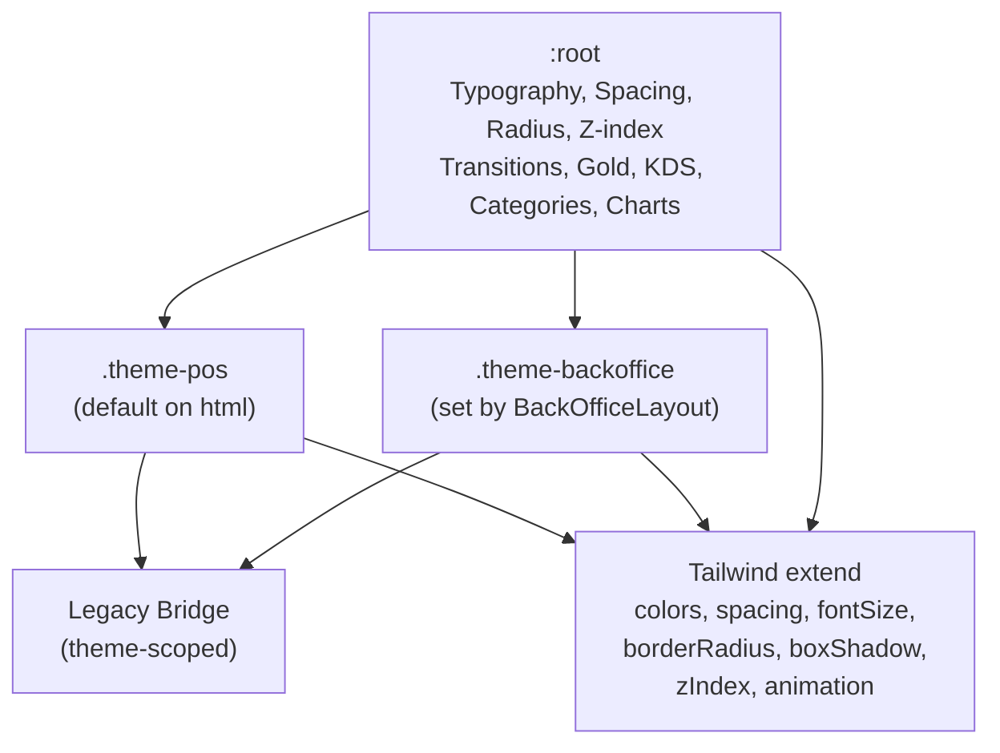

<!-- STALE-V2 -->
> ⚠️ **DOC HISTORIQUE — PÉRIMÉE (V2), NE FAIT PLUS FOI.** Ce fichier décrit en grande partie l'architecture **V2** (mono-app AppGrav, npm/Vercel, PWA/Capacitor, projet Supabase `abjabuniwkqpfsenxljp` = **prod incompatible**, versions RPC obsolètes). **Ne jamais l'appliquer tel quel** (migration, config, archi). Sources de vérité actuelles : `CLAUDE.md` (patterns + workplan) et `docs/workplan/remise-a-plat/` (référence modules réel-vs-demandé). Hiérarchie complète : `docs/README.md`. Régénération depuis le code prévue en Phase 3.

# 02 — Design Tokens

> **Last verified**: 2026-05-03
> **Sources**: [`src/styles/index.css`](../../../src/styles/index.css) (1279 lines), [`tailwind.config.js`](../../../tailwind.config.js) (327 lines)

All tokens live in three layers: **`:root`** (shared base), **`.theme-pos`** (dark, default), **`.theme-backoffice`** (light, applied by `BackOfficeLayout`). Tailwind exposes them through the `extend.colors`, `extend.spacing`, `extend.fontSize`, `extend.borderRadius`, `extend.boxShadow`, `extend.zIndex`, and animation keys in [`tailwind.config.js`](../../../tailwind.config.js).

---

## 1. Color Tokens

### 1.1 Surfaces (theme-aware)

| Token | POS (Dark) | Back-Office (Light) | Tailwind | Usage |
|---|---|---|---|---|
| `--surface-0` | `#0C0C0E` | `#F8F8F6` | `bg-surface-0` | Page background |
| `--surface-1` | `#151517` | `#FFFFFF` | `bg-surface-1` | Cards, panels, sidebars |
| `--surface-2` | `#1E1E22` | `#F2F2EE` | `bg-surface-2` | Elevated surfaces, hover |
| `--surface-3` | `#28282E` | `#EAEAE6` | `bg-surface-3` | Active states, drop targets |

### 1.2 Text (theme-aware)

| Token | POS (Dark) | Back-Office (Light) | Tailwind | Usage |
|---|---|---|---|---|
| `--text-primary` | `#F0F0F2` | `#1A1A1D` | `text-content-primary` | Headings, amounts, primary copy |
| `--text-secondary` | `#A8A8B0` | `#6B7280` | `text-content-secondary` | Labels, metadata, timestamps |
| `--text-muted` | `#6E6E78` | `#9CA3AF` | `text-content-muted` | Placeholders, de-emphasized text |

### 1.3 Borders (theme-aware)

| Token | POS (Dark) | Back-Office (Light) | Tailwind | Usage |
|---|---|---|---|---|
| `--border` | `#2A2A32` | `#E5E7EB` | `border-line` | Standard dividers, card edges |
| `--border-strong` | `#3A3A44` | `#D1D5DB` | `border-line-strong` | Stronger separators, input borders |

### 1.4 Gold (fixed, both themes)

| Token | Hex | Tailwind | Usage |
|---|---|---|---|
| `--gold` | `#C9A55C` | `bg-gold`, `text-gold` | Primary CTAs, active nav, totals, brand |
| `--gold-light` | `#E2D0A0` | `bg-gold-light` | Subtle highlights, hover tints |
| `--gold-dark` | `#9A7B3A` | `bg-gold-dark` | Gradient endpoints, pressed states |
| `--gold-deep` | `#6B5425` | `bg-gold-deep` | Deep accents, emphasis borders |

The CTA gradient is `linear-gradient(135deg, var(--gold) 0%, var(--gold-dark) 100%)` with a `0 4px 14px rgba(201,165,92,0.2)` shadow.

### 1.5 Semantic Colors (4 tokens per role: base, bg, text, border)

**POS (Dark):**

| Role | Base | Background | Text | Border |
|---|---|---|---|---|
| Success | `#34D399` | `rgba(52,211,153,0.08)` | `#6EE7B7` | `rgba(52,211,153,0.15)` |
| Warning | `#FBBF24` | `rgba(251,191,36,0.08)` | `#FDE68A` | `rgba(251,191,36,0.15)` |
| Error / Danger | `#F87171` | `rgba(248,113,113,0.08)` | `#FCA5A5` | `rgba(248,113,113,0.15)` |
| Info | `#60A5FA` | `rgba(96,165,250,0.08)` | `#93C5FD` | `rgba(96,165,250,0.15)` |

**Back-Office (Light):**

| Role | Base | Background | Text | Border |
|---|---|---|---|---|
| Success | `#16A34A` | `#F0FDF4` | `#15803D` | `#BBF7D0` |
| Warning | `#D97706` | `#FFFBEB` | `#92400E` | `#FDE68A` |
| Error / Danger | `#DC2626` | `#FEF2F2` | `#991B1B` | `#FECACA` |
| Info | `#2563EB` | `#EFF6FF` | `#1E40AF` | `#BFDBFE` |

**Tailwind**: `bg-success`, `text-success`, `bg-success-bg`, `text-success-text`, `border-success-border` — same pattern for `warning`, `danger`, `info`.

### 1.6 KDS Timing Colors (fixed, KDS-only)

| Token | Hex | Meaning |
|---|---|---|
| `--kds-fresh` | `#22C55E` | Order < 5 min |
| `--kds-normal` | `#EAB308` | 5–10 min |
| `--kds-late` | `#F97316` | 10–15 min |
| `--kds-critical` | `#EF4444` | > 15 min |

Used as inline `var(--kds-fresh)` references in [`KDSOrderCard.tsx`](../../../src/components/kds/KDSOrderCard.tsx).

### 1.7 POS Category Colors (fixed)

`--cat-red` `#EF4444`, `--cat-orange` `#F97316`, `--cat-amber` `#F59E0B`, `--cat-emerald` `#10B981`, `--cat-teal` `#14B8A6`, `--cat-sky` `#0EA5E9`, `--cat-violet` `#8B5CF6`, `--cat-pink` `#EC4899`, `--cat-lime` `#84CC16`, `--cat-cyan` `#06B6D4`.

### 1.8 Chart Colors (Recharts palette)

| Token | Value | Tailwind |
|---|---|---|
| `--chart-1` | `var(--gold)` (`#C9A55C`) | `text-chart-1`, `bg-chart-1` |
| `--chart-2` | `#3B82F6` (blue) | `text-chart-2` |
| `--chart-3` | `#EF4444` (red) | `text-chart-3` |
| `--chart-4` | `#22C55E` (green) | `text-chart-4` |
| `--chart-5` | `#8B5CF6` (violet) | `text-chart-5` |
| `--chart-6` | `#9CA3AF` (gray) | `text-chart-6` |

### 1.9 shadcn/ui HSL Compatibility

For each theme, an HSL set drives the shadcn primitives that read `hsl(var(--primary))`, `hsl(var(--background))`, etc.:

| HSL token | POS (Dark) | Back-Office (Light) | Tailwind exposure |
|---|---|---|---|
| `--background` | `240 7% 4%` | `40 11% 97%` | `bg-background` |
| `--foreground` | `240 5% 95%` | `240 7% 11%` | `text-foreground` |
| `--card` / `--card-foreground` | `240 3% 8%` / `240 5% 95%` | `0 0% 100%` / `240 7% 11%` | `bg-card`, `text-card-foreground` |
| `--popover` / `--popover-foreground` | `240 3% 8%` / `240 5% 95%` | `0 0% 100%` / `240 7% 11%` | `bg-popover` |
| `--primary` / `--primary-foreground` | `41 43% 57%` (gold) / `0 0% 0%` | same | `bg-primary text-primary-foreground` |
| `--secondary` / `--secondary-foreground` | `240 3% 13%` / `240 5% 95%` | `220 13% 95%` / `240 7% 11%` | `bg-secondary` |
| `--muted` / `--muted-foreground` | `240 3% 13%` / `240 3% 45%` | `40 6% 93%` / `220 9% 46%` | `bg-muted text-muted-foreground` |
| `--accent` / `--accent-foreground` | `240 3% 13%` / `240 5% 95%` | `40 6% 93%` / `240 7% 11%` | `bg-accent` |
| `--destructive` / `--destructive-foreground` | `0 72% 51%` / `0 0% 98%` | same | `bg-destructive` |
| `--input` | `240 3% 18%` | `220 13% 91%` | `border-input` |
| `--ring` | `41 43% 57%` (gold) | same | `ring-ring` |

### 1.10 Legacy Bakery Bridge

These tokens stay so old components keep compiling. **Do not introduce new usages** — prefer the surface/text/border tokens.

| Legacy token | Maps to | Tailwind |
|---|---|---|
| `--color-flour` | `--surface-1` | `bg-flour` |
| `--color-cream` | `--surface-0` | `bg-cream` |
| `--color-kraft` | `--surface-2` | `bg-kraft` |
| `--color-parchment` | `--border` | `bg-parchment`, `border-parchment` |
| `--color-wheat` | `--border-strong` | `bg-wheat` |
| `--color-charcoal` | `--text-primary` | `text-charcoal` |
| `--color-espresso` | `--text-secondary` | `text-espresso` |
| `--color-smoke` | `--text-secondary` | `text-smoke` |
| `--color-stone` | `--text-muted` | `text-stone` |
| `--color-sand` | (legacy) | `bg-sand` |

---

## 2. Typography Tokens

### 2.1 Font Families

| Family | Token | Tailwind | Usage |
|---|---|---|---|
| Inter | `--font-body`, `--font-sans` | `font-sans`, `font-body` | All operational UI: body, labels, buttons, tables, inputs |
| Playfair Display | `--font-display` | `font-display` | Italic serif for the brand "B" lockup, dashboard headlines, KPI labels |
| Fraunces | (Tailwind direct) | `font-fraunces` | Optical-size serif for analytics modals |
| JetBrains Mono | `--font-mono` | `font-mono` | Tabular numerics, code, terminal-style displays |

All four are loaded via Google Fonts in [`index.html`](../../../index.html#L44).

### 2.2 Font Size Scale (`:root`)

| Token | Rem | Pixel | Tailwind |
|---|---|---|---|
| `--text-xs` | `0.75rem` | 12px | `text-xs` |
| `--text-sm` | `0.8125rem` | 13px | `text-sm` |
| `--text-base` | `0.875rem` | 14px | `text-base` |
| `--text-lg` | `1.125rem` | 18px | `text-lg` |
| `--text-xl` | `1.25rem` | 20px | `text-xl` |
| `--text-2xl` | `1.5rem` | 24px | `text-2xl` |
| `--text-3xl` | `1.875rem` | 30px | `text-3xl` |
| `--text-4xl` | `2.25rem` | 36px | `text-4xl` |

### 2.3 Line Height Scale

| Token | Value |
|---|---|
| `--leading-none` | `1` |
| `--leading-tight` | `1.25` |
| `--leading-snug` | `1.375` |
| `--leading-normal` | `1.5` |
| `--leading-relaxed` | `1.625` |

### 2.4 Tracking Conventions

| Tailwind class | Value | Usage |
|---|---|---|
| `tracking-tight` | `-0.025em` | Numeric displays, order numbers |
| `tracking-wide` | `0.025em` | Item names in KDS |
| `tracking-widest` | `0.1em` | Standard UI labels |
| `tracking-[0.15em]` | `0.15em` | Header metadata |
| `tracking-[0.2em]` | `0.2em` | Section headers (signature pattern) |
| `tracking-[0.25em]` | `0.25em` | Display labels, brand name |
| `tracking-[0.3em]` | `0.3em` | "Empty Bag" placeholder, ultra-tracked micro-labels |

### 2.5 Custom Numeric Utility

```css
.font-mono-num {
  font-family: var(--font-mono);
  font-variant-numeric: tabular-nums;
  text-align: right;
  letter-spacing: -0.02em;
}
```

Apply to any monetary or stock-quantity display.

---

## 3. Spacing Tokens

| Token | Rem | Pixel | Tailwind |
|---|---|---|---|
| `--space-xs` | `0.25rem` | 4px | `p-xs`, `gap-xs`, `m-xs` |
| `--space-sm` | `0.5rem` | 8px | `p-sm`, `gap-sm` |
| `--space-md` | `0.75rem` | 12px | `p-md`, `gap-md` |
| `--space-lg` | `1rem` | 16px | `p-lg`, `gap-lg` |
| `--space-xl` | `1.5rem` | 24px | `p-xl`, `gap-xl` |
| `--space-2xl` | `2rem` | 32px | `p-2xl`, `gap-2xl` |
| `--space-3xl` | `3rem` | 48px | `p-3xl`, `gap-3xl` |

Tailwind's default numeric scale (`p-1`, `p-2`, …) is also fully available; the named tokens are used for design-system-aligned spacing.

---

## 4. Border Radius

| Token | Value | Tailwind |
|---|---|---|
| `--radius` | `0.5rem` | `rounded-lg` (semantic), `rounded` (default → `var(--radius-md)`) |
| `--radius-sm` | `0.375rem` | `rounded-sm` |
| `--radius-md` | `0.5rem` | `rounded-md` |
| `--radius-lg` | `0.75rem` | `rounded-lg` |
| `--radius-xl` | `1rem` | `rounded-xl` |
| `--radius-2xl` | `1.5rem` | `rounded-2xl` |
| `--radius-full` | `9999px` | `rounded-full` |

Tailwind exposes the scale via `extend.borderRadius` with `calc()` derivatives (`sm` = `calc(var(--radius) - 4px)`, `md` = `calc(var(--radius) - 2px)`).

---

## 5. Shadows

Shadows differ by theme — heavier on dark, subtler on light.

| Token | POS (Dark) | Back-Office (Light) | Tailwind |
|---|---|---|---|
| `--shadow-sm` | `0 1px 2px rgba(0,0,0,0.3)` | `0 1px 2px rgba(0,0,0,0.05)` | `shadow-sm` |
| `--shadow` | `0 1px 3px rgba(0,0,0,0.4)` | `0 1px 3px rgba(0,0,0,0.08), 0 1px 2px rgba(0,0,0,0.06)` | `shadow` |
| `--shadow-md` | `0 4px 6px rgba(0,0,0,0.4)` | `0 4px 6px rgba(0,0,0,0.07), 0 2px 4px rgba(0,0,0,0.06)` | `shadow-md` |
| `--shadow-lg` | `0 10px 15px rgba(0,0,0,0.5)` | `0 10px 15px rgba(0,0,0,0.08), 0 4px 6px rgba(0,0,0,0.05)` | `shadow-lg` |
| `--shadow-xl` | `0 20px 25px rgba(0,0,0,0.5)` | `0 20px 25px rgba(0,0,0,0.08), 0 8px 10px rgba(0,0,0,0.04)` | `shadow-xl` |
| `--shadow-glow` | `0 0 20px rgba(201,165,92,0.15)` | `0 0 20px rgba(201,165,92,0.1)` | `shadow-glow` |

The Cart panel uses an unusual offset shadow — `shadow-[-8px_0_32px_rgba(0,0,0,0.5)]` — to cast a vignette toward the product grid (see [`Cart.tsx:195`](../../../src/components/pos/Cart.tsx#L195)).

---

## 6. Z-Index Scale

| Token | Value | Tailwind |
|---|---|---|
| `--z-dropdown` | `100` | `z-dropdown` |
| `--z-sticky` | `200` | `z-sticky` |
| `--z-modal-backdrop` | `300` | `z-modal-backdrop` |
| `--z-modal` | `400` | `z-modal` |
| `--z-toast` | `500` | `z-toast` |
| (tooltip) | `600` | `z-tooltip` |

In addition, ad-hoc layers are reserved: mobile sidebar `z-[100]`, mobile backdrop `z-[99]`, BackOffice sidebar `z-50`, fullscreen overlays `z-[2000]`.

---

## 7. Transitions

| Token | Value | Tailwind |
|---|---|---|
| `--duration-fast` | `150ms` | `duration-fast` |
| `--duration-normal` | `250ms` | `duration-normal`, `duration-250` |
| `--duration-slow` | `350ms` | `duration-slow`, `duration-350` |
| `--ease-standard` | `cubic-bezier(0.4, 0, 0.2, 1)` | `ease-standard` |
| `--ease-bounce` | `cubic-bezier(0.34, 1.56, 0.64, 1)` | `ease-bounce` |
| (custom) | `cubic-bezier(0.16, 1, 0.3, 1)` | `ease-expo` |

---

## 8. Animations (`tailwindcss-animate` + custom keyframes)

The plugin `tailwindcss-animate` (loaded in [`tailwind.config.js:326`](../../../tailwind.config.js#L326)) provides `data-[state=open]:animate-in`, `fade-in-0`, `zoom-in-95`, `slide-in-from-*`, etc. — used by every Radix-based primitive.

**Custom keyframes registered in `extend.animation`:**

| Animation | Purpose | Duration |
|---|---|---|
| `animate-accordion-down` / `animate-accordion-up` | Radix Accordion | 0.2s |
| `animate-pulse-preparing` | KDS preparing items | 1.5s infinite |
| `animate-pulse-ready` | KDS ready transition | 0.5s |
| `animate-countdown-pulse` | KDS countdown bar | 1s infinite |
| `animate-pin-shake` | PIN input error | 0.5s |
| `animate-slideInFromLeft` | Sidebar entry | 0.3s |
| `animate-slide-up` | Mobile bottom sheets | 0.3s |
| `animate-slide-down` | Top banners | 0.3s |
| `animate-pulse-alert`, `animate-pulse-urgent`, `animate-pulse-new`, `animate-pulse-critical`, `animate-pulse-mobile` | KDS / mobile order glows | 1–3s infinite |
| `animate-blink-hold` | Hold state indicator | 1s infinite |
| `animate-card-exit` | KDS card removal | 300ms |
| `animate-sh-fade-in`, `animate-sh-slide-up`, `animate-sh-spin`, `animate-sh-card-in`, `animate-sh-expand-in` | Generic surface entrances | 0.3–0.4s |
| `animate-grow-up`, `animate-grow-width` | Chart/bar entrance | 0.8s |
| `animate-sidebar-fade-in` | Sidebar item reveal | 0.3s |

All animations honor `prefers-reduced-motion` via `motion-reduce:animate-none` utilities applied at call sites (e.g., [`KDSOrderCard.tsx:141`](../../../src/components/kds/KDSOrderCard.tsx#L141)).

---

## 9. Breakpoints (Tailwind defaults)

| Breakpoint | Min-width | Typical use |
|---|---|---|
| `sm` | `640px` | Phone landscape |
| `md` | `768px` | Tablet portrait — BackOffice sidebar visible above this |
| `lg` | `1024px` | Tablet landscape, small laptop |
| `xl` | `1280px` | POS terminal — Cart panel locks to `w-[480px]` here |
| `2xl` | `1536px` | Wide desktop, dual monitors |

The POS terminal uses `xl:` extensively for the three-column lock (`w-full xl:w-[480px]` cart). The BackOffice sidebar collapses below `md` (`max-md:fixed max-md:-translate-x-full`).

---

## 10. Scrollbar Tokens

| Token | POS (Dark) | Back-Office (Light) |
|---|---|---|
| `--scrollbar-thumb` | `#2A2A32` | `#D1D5DB` |
| `--scrollbar-thumb-hover` | `#3A3A44` | `#9CA3AF` |

Default WebKit scrollbar is 4px; the `.custom-scrollbar` utility renders a 6px scrollbar (used in panels with significant scroll content like the Cart and BackOffice nav).

---

## 11. Shimmer / Skeleton Tokens

| Token | POS (Dark) | Back-Office (Light) |
|---|---|---|
| `--shimmer-base` | `#151517` | `#F2F2EE` |
| `--shimmer-highlight` | `rgba(201,165,92,0.05)` (gold-tinted) | `#FFFFFF` |

Applied via `.skeleton-shimmer` (3s) and `.skeleton-shimmer-subtle` (4s).

---

## 12. Token Inheritance Diagram



For the actual rules behind each token, read [`src/styles/index.css`](../../../src/styles/index.css) end-to-end and cross-reference with [`tailwind.config.js`](../../../tailwind.config.js).
