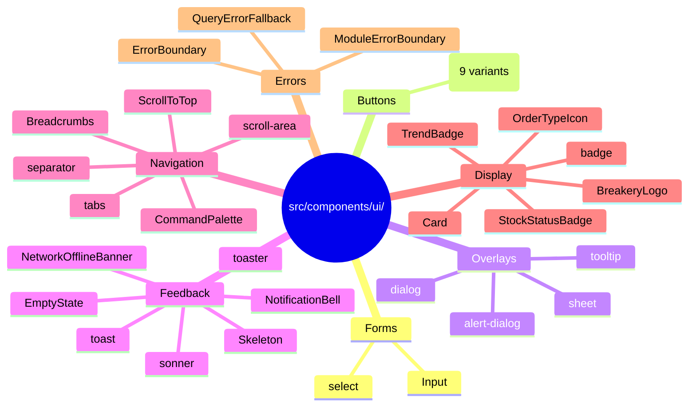

<!-- STALE-V2 -->
> ⚠️ **DOC HISTORIQUE — PÉRIMÉE (V2), NE FAIT PLUS FOI.** Ce fichier décrit en grande partie l'architecture **V2** (mono-app AppGrav, npm/Vercel, PWA/Capacitor, projet Supabase `abjabuniwkqpfsenxljp` = **prod incompatible**, versions RPC obsolètes). **Ne jamais l'appliquer tel quel** (migration, config, archi). Sources de vérité actuelles : `CLAUDE.md` (patterns + workplan) et `docs/workplan/remise-a-plat/` (référence modules réel-vs-demandé). Hiérarchie complète : `docs/README.md`. Régénération depuis le code prévue en Phase 3.

# 03 — shadcn/ui Primitives

> **Last verified**: 2026-05-03
> **Source folder**: [`src/components/ui/`](../../../src/components/ui/) (29 files)
> **Config**: [`components.json`](../../../components.json) — style `new-york`, base color `neutral`, alias `@/components/ui`, icon library `lucide`

The `src/components/ui/` folder contains both the **shadcn-installed Radix primitives** (lower-case filenames, e.g., `button.tsx`, `dialog.tsx`) and **custom in-house primitives** that follow the shadcn convention (PascalCase filenames, e.g., `Card.tsx`, `Skeleton.tsx`). All 29 files are catalogued below, grouped by family.

---

## 1. Forms

| Primitive | File | Radix base | Variants / Notes |
|---|---|---|---|
| **Input** | [`Input.tsx`](../../../src/components/ui/Input.tsx) | (native `<input>`) | Custom wrapper. Token-driven background `--surface-0`, 1.5px border `--border`, focus ring `0 0 0 3px rgba(201,165,92,0.15)`. |
| **Select** | [`select.tsx`](../../../src/components/ui/select.tsx) | `@radix-ui/react-select` | Trigger / Content / Item / Group / Label / Separator. Animated content with `data-[state=open]:animate-in zoom-in-95`. |

Use case: every form field across `/customers`, `/products`, `/inventory`, `/accounting`, `/settings`. Radix Checkbox / Radio / Switch are not yet installed — use native HTML elements styled via Tailwind in the meantime.

---

## 2. Buttons & Actions

| Primitive | File | Radix base | Variants |
|---|---|---|---|
| **Button** | [`button.tsx`](../../../src/components/ui/button.tsx) | `@radix-ui/react-slot` (for `asChild`) | `default`, `primary` (gold), `destructive`, `outline`, `secondary`, `ghost`, `link`, `pos-pay` (gold gradient w-full h-14), `kds-bump` (uppercase tracking-widest min-h-[48px]). Sizes: `default`, `sm`, `lg`, `xl`, `icon`, `icon-lg`. |

Defined via `cva` (class-variance-authority). The `pos-pay` variant is the signature gold CTA used at the bottom of the Cart.

---

## 3. Overlays

| Primitive | File | Radix base | Notes |
|---|---|---|---|
| **Dialog** | [`dialog.tsx`](../../../src/components/ui/dialog.tsx) | `@radix-ui/react-dialog` | Centered modal. `bg-black/80` overlay, `bg-background` content, `max-w-lg` default. `data-[state=open]:zoom-in-95` + `slide-in-from-top-[48%]`. Close button top-right. |
| **AlertDialog** | [`alert-dialog.tsx`](../../../src/components/ui/alert-dialog.tsx) | `@radix-ui/react-alert-dialog` | Confirmation modal with explicit Cancel + Action buttons. Used for void / refund / delete confirmations. |
| **Sheet** | [`sheet.tsx`](../../../src/components/ui/sheet.tsx) | `@radix-ui/react-dialog` | Side drawer. Variants `top`, `bottom`, `left`, `right` (default). Mobile-first. `w-3/4 max-w-md` for left/right. |
| **Tooltip** | [`tooltip.tsx`](../../../src/components/ui/tooltip.tsx) | `@radix-ui/react-tooltip` | Provider + Trigger + Content. Z-index `z-50`. Used on collapsed sidebar nav, KDS bump buttons. |

Toast / notification overlays are listed under §4 Feedback below.

---

## 4. Feedback

| Primitive | File | Radix base | Notes |
|---|---|---|---|
| **Toast** | [`toast.tsx`](../../../src/components/ui/toast.tsx) | `@radix-ui/react-toast` | Native shadcn toast viewport. |
| **Toaster** | [`toaster.tsx`](../../../src/components/ui/toaster.tsx) | (composition) | Mounts the Toast viewport at root. |
| **Sonner** | [`sonner.tsx`](../../../src/components/ui/sonner.tsx) | `sonner` library | Alternative toast system (preferred for promise toasts). Themed via `theme="dark"` / `light` based on `next-themes`. Custom semantic borders: success green, error red, warning amber, info blue (4px left border). |
| **Skeleton** | [`Skeleton.tsx`](../../../src/components/ui/Skeleton.tsx) | (custom) | Variants `default`, `subtle`, `gold`. Helpers: `SkeletonCard`, `SkeletonTableRow`. Uses `--shimmer-base` / `--shimmer-highlight` tokens. |
| **EmptyState** | [`EmptyState.tsx`](../../../src/components/ui/EmptyState.tsx) | (custom) | Centered icon + title + description + optional CTA. Used in empty product lists, empty carts, no-results screens. |
| **NetworkOfflineBanner** | [`NetworkOfflineBanner.tsx`](../../../src/components/ui/NetworkOfflineBanner.tsx) | (custom) | Top-of-screen banner triggered by `navigator.onLine === false`. Red-tinted, dismissible. |
| **NotificationBell** | [`NotificationBell.tsx`](../../../src/components/ui/NotificationBell.tsx) | (custom) | Sidebar bell icon with unread count badge; opens a `Sheet` with notification list. |

---

## 5. Navigation & Disclosure

| Primitive | File | Radix base | Notes |
|---|---|---|---|
| **Tabs** | [`tabs.tsx`](../../../src/components/ui/tabs.tsx) | `@radix-ui/react-tabs` | List + Trigger + Content. `data-[state=active]:bg-background data-[state=active]:shadow`. Used in `/customers/:id`, `/accounting`, `/settings`. |
| **CommandPalette** | [`CommandPalette.tsx`](../../../src/components/ui/CommandPalette.tsx) | `cmdk` | Global ⌘K palette; mounted in `BackOfficeLayout`. Drives quick navigation across modules. |
| **Breadcrumbs** | [`Breadcrumbs.tsx`](../../../src/components/ui/Breadcrumbs.tsx) | (custom) | Auto-generated from React Router `useLocation`. Gold separator (`/`), `text-content-secondary` links. |
| **ScrollArea** | [`scroll-area.tsx`](../../../src/components/ui/scroll-area.tsx) | `@radix-ui/react-scroll-area` | Themed scrollbars matching `--scrollbar-thumb`. |
| **Separator** | [`separator.tsx`](../../../src/components/ui/separator.tsx) | `@radix-ui/react-separator` | `bg-border`, horizontal or vertical. |
| **ScrollToTop** | [`ScrollToTop.tsx`](../../../src/components/ui/ScrollToTop.tsx) | (custom) | Floating button bottom-right; appears after 200px scroll. |

---

## 6. Display

| Primitive | File | Radix base | Notes |
|---|---|---|---|
| **Card** | [`Card.tsx`](../../../src/components/ui/Card.tsx) | (custom, shadcn-style) | `Card` + `CardHeader` + `CardTitle` + `CardDescription` + `CardContent` + `CardFooter`. Default classes: `rounded-xl border bg-card text-card-foreground shadow`. |
| **Badge** | [`badge.tsx`](../../../src/components/ui/badge.tsx) | (cva) | Variants `default` (gold), `secondary`, `destructive`, `outline`. |
| **StockStatusBadge** | [`StockStatusBadge.tsx`](../../../src/components/ui/StockStatusBadge.tsx) | (custom) | Maps stock numeric to color: critical (<5) red, warning (<10) amber, ok green. |
| **TrendBadge** | [`TrendBadge.tsx`](../../../src/components/ui/TrendBadge.tsx) | (custom) | Up arrow green / down arrow red with percentage. Used in dashboard KPIs. |
| **OrderTypeIcon** | [`OrderTypeIcon.tsx`](../../../src/components/ui/OrderTypeIcon.tsx) | (custom) | Lucide icon mapped to `dine_in` / `takeaway` / `delivery` / `b2b`. |
| **BreakeryLogo** | [`BreakeryLogo.tsx`](../../../src/components/ui/BreakeryLogo.tsx) | (custom brand) | Sizes `sm`, `md`, `lg`; variants `mark` (just the "B"), `full` (lockup). Playfair Display italic. |

---

## 7. Error Handling

| Primitive | File | Notes |
|---|---|---|
| **ErrorBoundary** | [`ErrorBoundary.tsx`](../../../src/components/ui/ErrorBoundary.tsx) | App-level React error boundary. |
| **ModuleErrorBoundary** | [`ModuleErrorBoundary.tsx`](../../../src/components/ui/ModuleErrorBoundary.tsx) | Per-module wrapper that isolates failures (one module crashing does not blank the app). |
| **QueryErrorFallback** | [`QueryErrorFallback.tsx`](../../../src/components/ui/QueryErrorFallback.tsx) | Default fallback for `react-query` errors with retry button. |

---

## 8. Family Map



---

## 9. Conventions

- **shadcn-installed primitives** keep their lower-case filenames (`button.tsx`, `dialog.tsx`, …) and stay editable. Re-running `npx shadcn add <name>` would overwrite them.
- **Custom primitives** (PascalCase) are bespoke — they consume tokens identically and follow the same prop conventions (`forwardRef`, `cn(className, …)`, `cva` for variants).
- **Always import via the `@/` alias**: `import { Button } from '@/components/ui/button'`.
- **Variants over class props**: prefer adding a `cva` variant over passing one-off classes when a pattern repeats more than twice.
- **Asymmetric overlays**: `Dialog` for centered modals, `Sheet` for slide-in panels (mobile-first), `AlertDialog` for destructive confirmation, `Tooltip` for hover hints. Choose by intent, not aesthetic.

---

## 10. Snippet — Composing a Primary CTA

```tsx
import { Button } from '@/components/ui/button';

// Standard back-office gold CTA
<Button variant="primary" size="lg">
  Save changes
</Button>

// POS Pay button (gold gradient, full width)
<Button variant="pos-pay">
  Pay {formatIDR(total)}
</Button>

// KDS bump button (uppercase tracking-widest)
<Button variant="kds-bump" className="bg-success text-black">
  Mark Ready
</Button>
```

For higher-level patterns (Cart, KDSOrderCard, Report cards), see [04-feature-components.md](./04-feature-components.md).
