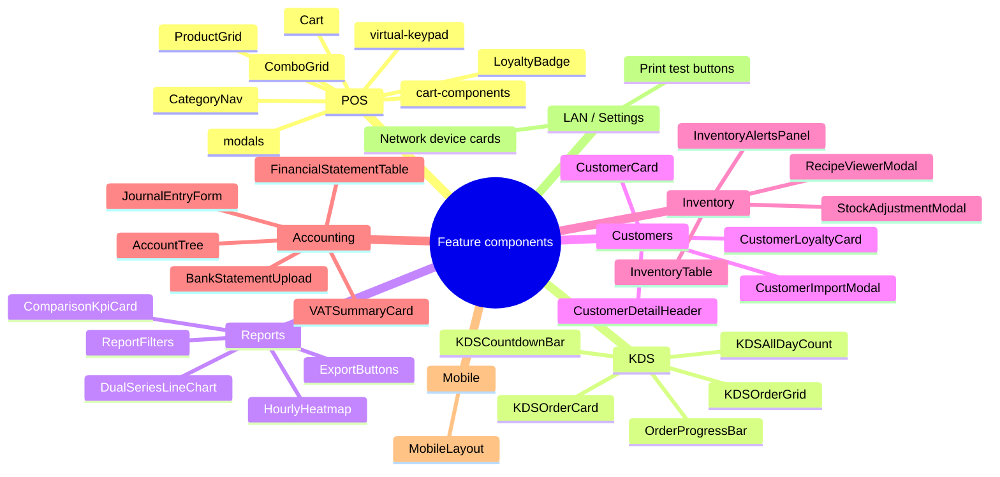

<!-- STALE-V2 -->
> ⚠️ **DOC HISTORIQUE — PÉRIMÉE (V2), NE FAIT PLUS FOI.** Ce fichier décrit en grande partie l'architecture **V2** (mono-app AppGrav, npm/Vercel, PWA/Capacitor, projet Supabase `abjabuniwkqpfsenxljp` = **prod incompatible**, versions RPC obsolètes). **Ne jamais l'appliquer tel quel** (migration, config, archi). Sources de vérité actuelles : `CLAUDE.md` (patterns + workplan) et `docs/workplan/remise-a-plat/` (référence modules réel-vs-demandé). Hiérarchie complète : `docs/README.md`. Régénération depuis le code prévue en Phase 3.

# 04 — Feature Components

> **Last verified**: 2026-05-03
> **Source folders**: [`src/components/{accounting,customers,expenses,inventory,kds,lan,mobile,orders,permissions,pos,products,purchasing,reports,settings}`](../../../src/components/)

This document catalogues representative components per feature family. Each component is a real-world consumer of the shadcn primitives ([03-shadcn-primitives.md](./03-shadcn-primitives.md)) and the design tokens ([02-tokens.md](./02-tokens.md)).

---

## 1. Family Map



---

## 2. POS — Point of Sale

The POS surface composes around the three panels of [`POSMainPage.tsx`](../../../src/pages/pos/POSMainPage.tsx#L195) (`theme-pos flex flex-col h-[100dvh]`).

| Component | Path | Pattern | Composes |
|---|---|---|---|
| **Cart** | [`pos/Cart.tsx`](../../../src/components/pos/Cart.tsx) | `aside w-full xl:w-[480px] h-full bg-surface-1 border-l border-line` with offset shadow `shadow-[-8px_0_32px_rgba(0,0,0,0.5)]`. Empty state: `ShoppingCart` icon + tracked-3em "Empty Bag". Header / item list / totals / actions stack vertically. | `cart-components/*`, `modals/*`, native button |
| **CartItemRow** | [`pos/cart-components/CartItemRow.tsx`](../../../src/components/pos/cart-components/CartItemRow.tsx) | Row with quantity stepper, line total `font-mono-num text-gold`, locked-state lock icon. | `Button`, `OrderTypeIcon` |
| **CartTotals** | [`pos/cart-components/CartTotals.tsx`](../../../src/components/pos/cart-components/CartTotals.tsx) | Subtotal / Tax (PB1 10%) / Discount / Total breakdown. Total uses `text-2xl font-bold tabular-nums text-gold`. | (tokens only) |
| **CartActions** | [`pos/cart-components/CartActions.tsx`](../../../src/components/pos/cart-components/CartActions.tsx) | Sticky bottom container with safe-area padding `pb-[calc(1rem+env(safe-area-inset-bottom))]`, holds the gold "Pay" CTA. | `Button` (`pos-pay` variant) |
| **ProductGrid** | [`pos/ProductGrid.tsx`](../../../src/components/pos/ProductGrid.tsx) | Responsive grid of product tiles: `grid-cols-2 md:grid-cols-3 xl:grid-cols-4`, each tile `aspect-square` with category color band, name, price. Tap = add to cart. | `Card`, `Badge`, `StockBadge` |
| **CategoryNav** | [`pos/CategoryNav.tsx`](../../../src/components/pos/CategoryNav.tsx) | Horizontal scrollable bar of category chips with `--cat-*` color dot. Active = gold underline. | `Badge` |
| **ComboGrid** | [`pos/ComboGrid.tsx`](../../../src/components/pos/ComboGrid.tsx) | Variant of ProductGrid for combos with composite product preview. | `Card` |
| **VirtualKeypad** | [`pos/virtual-keypad/`](../../../src/components/pos/virtual-keypad/) | Fullscreen 3×4 keypad for PIN entry / quantity / price overrides; large `min-h-[64px]` touch targets, `font-mono` digits. | `Button` (`xl` size) |

**Use cases**: in-store cashier flow, table service, takeaway, B2B walk-ins.

---

## 3. KDS — Kitchen Display System

The KDS surface is a tile grid of order cards with status-color borders. Lives at [`/kds`](../../../src/pages/kds/KDSMainPage.tsx) inside `.theme-pos`.

| Component | Path | Pattern | Composes |
|---|---|---|---|
| **KDSOrderCard** | [`kds/KDSOrderCard.tsx`](../../../src/components/kds/KDSOrderCard.tsx) | Tile with timing-color border (`border-[var(--kds-fresh)]/50` → `border-[var(--kds-critical)]/50`), order number `text-2xl font-extrabold font-mono`, item list, bump button row. Pulses `animate-pulse-critical` past 15 min. | `Button` (`kds-bump`), `KDSCountdownBar`, `OrderProgressBar` |
| **KDSOrderGrid** | [`kds/KDSOrderGrid.tsx`](../../../src/components/kds/KDSOrderGrid.tsx) | Auto-fill grid: `grid-cols-1 md:grid-cols-2 lg:grid-cols-3 xl:grid-cols-4 gap-4`. Cards reflow as orders complete. Drag-and-drop hooks via `@dnd-kit`. | `KDSOrderCard` |
| **KDSCountdownBar** | [`kds/KDSCountdownBar.tsx`](../../../src/components/kds/KDSCountdownBar.tsx) | Horizontal timer bar that fills from green to red over the order's prep window. `animate-countdown-pulse` near completion. | (tokens only) |
| **KDSHeader** | [`kds/KDSHeader.tsx`](../../../src/components/kds/KDSHeader.tsx) | Top strip: station name (Playfair Display), Pause/Resume toggle, all-day item count badge. | `Button`, `Badge`, `KDSAllDayCount` |
| **OrderProgressBar** | [`kds/OrderProgressBar.tsx`](../../../src/components/kds/OrderProgressBar.tsx) | Inline `bg-success-bg` segment showing % of items marked ready. | (tokens only) |

**Use cases**: barista station, hot kitchen, cold kitchen, plating station — each subscribes to a filtered slice via `kds_stations` config.

---

## 4. Reports

Lives at [`/reports`](../../../src/pages/reports/) inside `.theme-backoffice`. ~50 reports across Sales / Stock / Customer / B2B / Accounting / Operations.

| Component | Path | Pattern | Composes |
|---|---|---|---|
| **ComparisonKpiCard** | [`reports/ComparisonKpiCard.tsx`](../../../src/components/reports/ComparisonKpiCard.tsx) | Dashboard KPI tile: tracked label `text-[10px] uppercase tracking-[0.2em]`, big `text-3xl font-bold tabular-nums` value (Fraunces optional), `TrendBadge` showing delta vs previous period. | `Card`, `TrendBadge`, `Skeleton` |
| **DualSeriesLineChart** | [`reports/DualSeriesLineChart.tsx`](../../../src/components/reports/DualSeriesLineChart.tsx) | Recharts `LineChart` with two series (current vs previous). Lines use `--chart-1` (gold) and `--chart-6` (gray). Tooltip themed via `bg-popover text-popover-foreground border border-line`. | `recharts`, tokens |
| **HourlyHeatmap** | [`reports/HourlyHeatmap.tsx`](../../../src/components/reports/HourlyHeatmap.tsx) | 7×24 grid (day × hour) with cell intensity from `bg-gold/5` to `bg-gold` based on revenue. Hovers reveal tooltip. | (tokens only) |
| **ReportFilters** | [`reports/ReportFilters/`](../../../src/components/reports/ReportFilters/) | Sticky filter bar: `DateRangePicker`, segment buttons (`Today / 7d / 30d / Custom`), category multi-select. | `Button`, `Select`, `Tabs` |
| **ExportButtons** | [`reports/ExportButtons/`](../../../src/components/reports/ExportButtons/) | "Export CSV / PDF / Excel" trio. CSV via Blob, PDF via `jsPDF + autotable`, Excel via `XLSX`. | `Button`, `Tooltip` |
| **ReportSkeleton** | [`reports/ReportSkeleton.tsx`](../../../src/components/reports/ReportSkeleton.tsx) | Composite loading state: KPI row + chart placeholder + table skeleton, all using `.skeleton-shimmer`. | `Skeleton` |

**Use cases**: morning revenue check, end-of-day Z-report, monthly P&L, stock turnover, customer cohort analysis.

---

## 5. Customers

Lives at [`/customers`](../../../src/pages/customers/) inside `.theme-backoffice`.

| Component | Path | Pattern | Composes |
|---|---|---|---|
| **CustomerCard** | [`customers/CustomerCard.tsx`](../../../src/components/customers/CustomerCard.tsx) | Avatar + name + loyalty tier badge + total spent. Hover lifts card with `shadow-md`. | `Card`, `Badge`, `LoyaltyBadge` |
| **CustomerDetailHeader** | [`customers/CustomerDetailHeader.tsx`](../../../src/components/customers/CustomerDetailHeader.tsx) | Profile banner: 80px avatar, name in Playfair Display, contact details, action buttons (Edit / Add Points / Send Email). | `Button`, `Badge` |
| **CustomerDetailTabs** | [`customers/CustomerDetailTabs.tsx`](../../../src/components/customers/CustomerDetailTabs.tsx) | `Tabs` with Overview / Orders / Loyalty / Notes. | `Tabs`, `Card` |
| **CustomerLoyaltyCard** | [`customers/CustomerLoyaltyCard.tsx`](../../../src/components/customers/CustomerLoyaltyCard.tsx) | Tier (Bronze→Platinum) with progress bar to next tier. Bronze=`#9A7B3A`, Silver=gray, Gold=`--gold`, Platinum=`--gold-light`. | `Card`, `Badge` |
| **CustomerImportModal** | [`customers/CustomerImportModal.tsx`](../../../src/components/customers/CustomerImportModal.tsx) | 3-step wizard (Upload → Preview → Result) inside a `Dialog`. CSV mapping preview, validation warnings. | `Dialog`, `Tabs`, `Button`, `Skeleton` |

**Use cases**: walk-in lookup at POS, monthly loyalty audit, bulk import from external CRM.

---

## 6. Inventory

Lives at [`/inventory`](../../../src/pages/inventory/) inside `.theme-backoffice`.

| Component | Path | Pattern | Composes |
|---|---|---|---|
| **InventoryTable** | [`inventory/InventoryTable.tsx`](../../../src/components/inventory/InventoryTable.tsx) | Sticky-header table: SKU / Name / Stock / Cost / Value, sortable columns, `StockStatusBadge` per row, click-row opens detail. | `StockStatusBadge`, native `<table>`, `Skeleton` |
| **InventoryAlertsPanel** | [`inventory/InventoryAlertsPanel.tsx`](../../../src/components/inventory/InventoryAlertsPanel.tsx) | Compact list of low-stock items, each with quantity left + reorder shortcut. Used in dashboard sidebar. | `Card`, `Badge`, `Button` |
| **StockAdjustmentModal** | [`inventory/StockAdjustmentModal.tsx`](../../../src/components/inventory/StockAdjustmentModal.tsx) | `Dialog` with reason `Select` (waste / count / transfer), quantity input, notes textarea. Manager PIN verify on submit. | `Dialog`, `Input`, `Select`, `Button` |
| **RecipeViewerModal** | [`inventory/RecipeViewerModal.tsx`](../../../src/components/inventory/RecipeViewerModal.tsx) | Read-only view of a finished-product recipe: ingredient list with quantity, total cost, margin. | `Dialog`, `Card`, native table |
| **StockAlertsBadge** | [`inventory/StockAlertsBadge.tsx`](../../../src/components/inventory/StockAlertsBadge.tsx) | Sidebar badge showing count of items at warning/critical level. Pulses gold if count > 0. | (tokens only) |

**Use cases**: morning stock check, ingredient depletion tracking, end-of-month opname, transfer between dine-in / cafe.

---

## 7. Accounting

Lives at [`/accounting`](../../../src/pages/accounting/) inside `.theme-backoffice`. Indonesian SAK EMKM compliant.

| Component | Path | Pattern | Composes |
|---|---|---|---|
| **AccountTree** | [`accounting/AccountTree.tsx`](../../../src/components/accounting/AccountTree.tsx) | Recursive tree of Chart of Accounts with collapsible parent nodes. Account code + name + balance (right-aligned `font-mono-num`). | (recursive composition) |
| **AccountPicker** | [`accounting/AccountPicker.tsx`](../../../src/components/accounting/AccountPicker.tsx) | Searchable `Select` filtered by account type (Asset / Liability / Equity / Revenue / Expense). | `Select`, `Input` |
| **JournalEntryForm** | [`accounting/JournalEntryForm.tsx`](../../../src/components/accounting/JournalEntryForm.tsx) | Multi-line debit/credit form. Live balance check at bottom — green when balanced, red when not. Uses `JournalLineTable` for line rows. | `Card`, `Input`, `AccountPicker`, `Button` |
| **FinancialStatementTable** | [`accounting/FinancialStatementTable.tsx`](../../../src/components/accounting/FinancialStatementTable.tsx) | Hierarchical statement (Trial Balance / Income Statement / Balance Sheet) with indented categories, subtotals, and totals in bold. Right-aligned `tabular-nums`. | native table, tokens |
| **VATSummaryCard** | [`accounting/VATSummaryCard.tsx`](../../../src/components/accounting/VATSummaryCard.tsx) | Card showing PB1 10% collected / payable / paid for the period. Gold accent on payable amount. | `Card`, `Badge` |
| **BankStatementUpload** | [`accounting/BankStatementUpload.tsx`](../../../src/components/accounting/BankStatementUpload.tsx) | Drop-zone (`@dnd-kit` style) accepting CSV/OFX bank exports for reconciliation. | `Card`, `Button`, `Skeleton` |

**Use cases**: daily journal posting, monthly close, PB1 tax filing, bank reconciliation, audit trail review.

---

## 8. Cross-Cutting Patterns

| Pattern | Where it appears |
|---|---|
| **Sticky-header table** | Reports, Inventory, Accounting, B2B, Purchasing — `<thead class="sticky top-0 bg-surface-1 z-sticky">` |
| **Empty state** | All list pages — uses `EmptyState` primitive with module-specific Lucide icon |
| **Tracked micro-label** | Section dividers — `text-[10px] uppercase font-semibold tracking-[0.2em] text-content-muted` |
| **`font-mono-num` totals** | Cart, Reports KPIs, Accounting, Inventory value columns |
| **`Sheet` for mobile filters** | Reports filters become a bottom sheet under `md` |
| **Confirmation `AlertDialog`** | Void / refund / delete / publish across all admin actions |
| **Manager-PIN gate** | Locked cart items, stock adjustments, refunds — uses `PinVerificationModal` (in `pos/modals/`) |
| **`Skeleton` first paint** | Every react-query consumer renders a skeleton block while `isLoading` |

---

## 9. Snippet — Composing a Report KPI Card

```tsx
import { Card, CardHeader, CardContent } from '@/components/ui/Card';
import { TrendBadge } from '@/components/ui/TrendBadge';

<Card className="p-xl">
  <CardHeader className="p-0 mb-md">
    <span className="text-[10px] uppercase font-semibold tracking-[0.2em] text-content-muted">
      Today's Revenue
    </span>
  </CardHeader>
  <CardContent className="p-0 flex items-baseline gap-md">
    <span className="text-3xl font-bold font-mono tabular-nums text-content-primary">
      Rp 4.235.000
    </span>
    <TrendBadge value={12.4} direction="up" />
  </CardContent>
</Card>
```

For layout-level composition (where these cards sit in a grid), see [05-layouts.md](./05-layouts.md).
