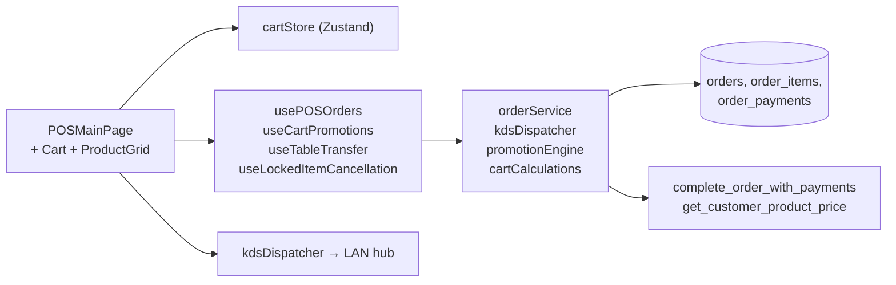

<!-- STALE-V2 -->
> ⚠️ **DOC HISTORIQUE — PÉRIMÉE (V2), NE FAIT PLUS FOI.** Ce fichier décrit en grande partie l'architecture **V2** (mono-app AppGrav, npm/Vercel, PWA/Capacitor, projet Supabase `abjabuniwkqpfsenxljp` = **prod incompatible**, versions RPC obsolètes). **Ne jamais l'appliquer tel quel** (migration, config, archi). Sources de vérité actuelles : `CLAUDE.md` (patterns + workplan) et `docs/workplan/remise-a-plat/` (référence modules réel-vs-demandé). Hiérarchie complète : `docs/README.md`. Régénération depuis le code prévue en Phase 3.

# 02 — POS Cart & Orders

> **Last verified** : 2026-05-13
> **Structure** : ce fichier fusionne la **vue fonctionnelle** (le *pourquoi* et le *quoi* métier du poste de caisse) et la **référence technique** (le *comment* implémenté — stores, services, RPC). Pour les tâches à faire, voir [`../../workplan/backlog-by-module/02-pos-cart-orders.md`](../../workplan/backlog-by-module/02-pos-cart-orders.md). Pour la vue **inspection / historique** des commandes créées au POS, voir [`./02b-orders.md`](./02b-orders.md).
> **Related E2E flows** : [01-pos-sale-cash](../08-flows-end-to-end/01-pos-sale-cash.md), [02-pos-sale-split-payment](../08-flows-end-to-end/02-pos-sale-split-payment.md), [05-table-transfer](../08-flows-end-to-end/05-table-transfer.md), [06-held-orders](../08-flows-end-to-end/06-held-orders.md), [07-locked-item-cancel](../08-flows-end-to-end/07-locked-item-cancel.md).
> **App de rattachement** : POS (`/pos`, `/pos/outstanding`) + extensions (`/pos/live-stock`, `/pos/cafe`, `/display`, `/tablet`).

> **En une phrase** : le module POS est le **poste de combat de la caisse** de The Breakery — il transforme un client devant le comptoir en transaction propre, comptable et traçable en moins d'une minute, supporte sans flancher 200 commandes par jour avec modifiers, splits, ardoises, promos auto et fidélité, verrouille tout ce qui sort de cuisine pour bloquer la fraude, dialogue en direct avec le KDS, la tablette serveur et l'écran client — pour qu'aucune vente ne soit ni mal saisie, ni mal encaissée, ni perdue entre le geste de la cashier et le tiroir-caisse.

---

## Table des matières

- [Partie I — Vue fonctionnelle](#partie-i--vue-fonctionnelle)
  - [1. Raison d'être](#1-raison-dêtre)
  - [2. Les 6 zones de l'écran principal](#2-les-6-zones-de-lécran-principal)
  - [3. Les 6 invariants du module](#3-les-6-invariants-du-module)
  - [4. Démarrer une journée — Ouvrir la session](#4-démarrer-une-journée--ouvrir-la-session)
  - [5. Prendre une commande — Le geste principal](#5-prendre-une-commande--le-geste-principal)
  - [6. Envoyer en cuisine — Le moment où le panier se verrouille](#6-envoyer-en-cuisine--le-moment-où-le-panier-se-verrouille)
  - [7. Mettre en attente — Held orders](#7-mettre-en-attente--held-orders)
  - [8. Encaisser — Le moment décisif](#8-encaisser--le-moment-décisif)
  - [9. Annuler / rembourser — Les actions de réparation](#9-annuler--rembourser--les-actions-de-réparation)
  - [10. Vue Outstanding — Les ardoises POS](#10-vue-outstanding--les-ardoises-pos)
  - [11. Le Virtual Keypad — La saisie touch-first](#11-le-virtual-keypad--la-saisie-touch-first)
  - [12. Les modales et outils satellites](#12-les-modales-et-outils-satellites)
  - [13. Réceptionner les commandes tablette](#13-réceptionner-les-commandes-tablette)
  - [14. Couplage temps réel — Les 4 canaux](#14-couplage-temps-réel--les-4-canaux)
  - [15. Fermer la journée — End of day](#15-fermer-la-journée--end-of-day)
  - [16. Mécaniques transverses — Comment le POS dialogue avec le reste](#16-mécaniques-transverses--comment-le-pos-dialogue-avec-le-reste)
  - [17. Ce que le module ne fait pas (par design)](#17-ce-que-le-module-ne-fait-pas-par-design)
  - [18. Utilisateurs cibles](#18-utilisateurs-cibles)
- [Partie II — Référence technique](#partie-ii--référence-technique)
  - [19. Architecture conceptuelle](#19-architecture-conceptuelle)
  - [20. Diagramme de responsabilité](#20-diagramme-de-responsabilité)
  - [21. Tables DB impliquées](#21-tables-db-impliquées)
  - [22. Hooks principaux](#22-hooks-principaux)
  - [23. Services principaux](#23-services-principaux)
  - [24. Composants UI principaux](#24-composants-ui-principaux)
  - [25. Stores Zustand utilisés](#25-stores-zustand-utilisés)
  - [26. RPCs / Edge Functions](#26-rpcs--edge-functions)
  - [27. RLS & Permissions](#27-rls--permissions)
  - [28. Routes](#28-routes)
  - [29. Pitfalls spécifiques](#29-pitfalls-spécifiques)
- [Partie III — Backlog opérationnel](#partie-iii--backlog-opérationnel)
- [Partie IV — Design & UX](#partie-iv--design--ux)
  - [30. Thèmes et contextes d'affichage](#30-thèmes-et-contextes-daffichage)
  - [31. Écrans du module (4 routes)](#31-écrans-du-module-4-routes)
  - [32. Layout patterns appliqués](#32-layout-patterns-appliqués)
  - [33. Composants UI signature](#33-composants-ui-signature)
  - [34. États visuels critiques](#34-états-visuels-critiques)
  - [35. Couleurs sémantiques utilisées](#35-couleurs-sémantiques-utilisées)
  - [36. Microcopy et empty states](#36-microcopy-et-empty-states)
  - [37. Références visuelles externes](#37-références-visuelles-externes)
  - [38. À faire côté design (backlog UX)](#38-à-faire-côté-design-backlog-ux)

---

# Partie I — Vue fonctionnelle

## 1. Raison d'être

Le module POS est **le poste de travail de la caisse** de The Breakery. Il répond à une question simple mais omniprésente :

> *"Comment je prends une commande, je l'envoie en cuisine, j'encaisse et je sors le client en moins d'une minute, sans erreur, à 200 commandes par jour ?"*

C'est l'écran qui transforme **un client devant le comptoir** en **transaction propre, comptabilisée, traçable** : produit, modificateurs, remise éventuelle, taxe PB1, paiement, ticket, ouverture du tiroir-caisse, déduction stock, envoi cuisine, attribution fidélité.

Le POS est **fullscreen, sans menu de navigation back-office**, conçu pour une utilisation **touch-first** par une cashier qui ne lâche pas l'écran des yeux pendant le rush. Toute friction inutile coûte 5 secondes — et 5 secondes × 200 transactions = 17 minutes de file d'attente par jour.

Le module est **bien plus que la caisse** : il intègre la gestion de session (ouverture / fermeture / écart), les ardoises (paiement différé), les commandes différées, l'historique transactionnel, la liaison avec le KDS, la tablette serveur, le customer display et le tiroir-caisse physique.

---

## 2. Les 6 zones de l'écran principal

L'écran POSMainPage est structuré en **6 zones permanentes** :

| Zone | Job-to-be-done |
|---|---|
| **Menu top bar** | Navigation modes (table / takeaway / delivery), accès aux modales (clients, ardoises, historique, paramètres) |
| **Category Nav** | Sélecteur de catégorie produit (Pains, Viennoiseries, Boissons…) |
| **Product Grid** | Grille tactile des produits filtrés par catégorie, avec stock badge et prix |
| **Combo Grid** | Grille séparée des combos (combos = produits composés à prix groupés) |
| **Cart** | Panier en direct avec lignes, totaux, taxes, remises |
| **Cart Actions** | Boutons d'action : Hold, Discount, Customer, Send to KDS, Pay |

Toute l'interface est conçue pour qu'un caissier puisse encaisser **sans toucher le clavier physique** — un Virtual Keypad apparaît au besoin pour les saisies (montant, recherche client, code produit).

---

## 3. Les 6 invariants du module

Quel que soit le moment d'utilisation, le POS garantit toujours :

1. **Une session de caisse ouverte avant toute transaction**. Pas de session = pas de vente possible. Force la discipline de fond de caisse et de réconciliation.
2. **Touch-first, sans dépendance au clavier**. Tous les boutons sont dimensionnés pour le doigt, le Virtual Keypad gère les saisies textuelles.
3. **Cart locké après envoi cuisine**. Les items envoyés au KDS deviennent verrouillés. Toute modification exige un PIN manager — traçabilité anti-fraude.
4. **Auto-évaluation des promotions** à chaque changement de panier via `useCartPromotions`. Le caissier ne calcule jamais : le système applique automatiquement les bonnes remises.
5. **Tax PB1 10% incluse dans tous les prix**. Le client voit toujours le prix total ; le système isole la taxe (`tax = total × 10/110`) pour la comptabilité.
6. **Une commande atomique : items + paiements en une seule transaction**. La RPC `complete_order_with_payments` crée la commande et tous ses paiements dans une transaction Postgres unique — pas de risque de paiement orphelin si la connexion saute.

---

## 4. Démarrer une journée — Ouvrir la session

Avant la première vente, le caissier ou le manager doit **ouvrir une session de caisse** (`OpenShiftModal`) :

- Comptage du fond de caisse initial en espèces.
- Sélection du terminal POS sur lequel la session s'ouvre.
- Attribution au cashier.
- Création d'un enregistrement `pos_sessions` avec `opening_cash`.

Tant qu'aucune session n'est ouverte, le POS refuse toute transaction et affiche le bouton "Open shift" en plein écran.

Bénéfice métier : **fond de caisse rigoureusement chiffré au départ**, condition sine qua non de la réconciliation de fin de journée.

---

## 5. Prendre une commande — Le geste principal

### 5.1 Choisir le type de commande

Avant ou pendant la composition, le caissier choisit le **type** :

- **Dine-in** — service en salle, déclenche la sélection d'une table (`TableSelectionModal` avec floor plan).
- **Takeaway** — emporter.
- **Delivery** — livraison.

Le type pilote ensuite la logique de paiement (différé acceptable pour dine-in, immédiat pour takeaway/delivery) et l'affichage cuisine (sticker emballage takeaway, etc.).

### 5.2 Ajouter des produits

Trois mécanismes complémentaires :

- **Clic produit dans la grille** → ajout direct au panier.
- **Scan QR / code-barres** via `QRScanArea` (caméra) → ajout par identification.
- **Combo selector** → un combo (ex: "petit-déjeuner") déclenche un `ComboSelectorModal` qui permet de choisir les composants (croissant **ou** pain au chocolat + café **ou** thé).

### 5.3 Modificateurs et variantes

À l'ajout d'un produit, deux modales peuvent apparaître :

- **`ModifierModal`** — modificateurs avec surcoût (lait d'amande +5k, sucre +2k, supplément chocolat +3k).
- **`VariantModal`** — variantes de prix selon une caractéristique (taille S/M/L, parfum).

Les modificateurs sont stockés JSONB sur l'item du panier, leur surcoût est inclus dans le `total_price` de la ligne.

### 5.4 Remise

Bouton **Discount** → `DiscountModal` :

- Remise en % ou en montant fixe.
- Remise sur tout le panier ou sur un item ciblé.
- **PIN manager** requis si la remise dépasse le seuil configuré.
- Trace obligatoire : raison de la remise (geste commercial, défaut produit, fidélité, ami du gérant…).

### 5.5 Lier un client

Bouton **Customer** → `CustomerSearchModal` :

- Recherche par nom, téléphone, e-mail, numéro de membre, **scan QR** du client.
- Affiche la fiche `CustomerCard` avec palier fidélité, points, historique.
- Bouton "Create new" si le client n'existe pas (`CreateCustomerForm`).
- La sélection applique automatiquement le pricing tier du client (retail / wholesale / discount % / catégorie custom).

Bénéfice métier : **transformer chaque vente anonyme en vente nominative** quand c'est pertinent, sans ralentir si ça ne l'est pas.

---

## 6. Envoyer en cuisine — Le moment où le panier se verrouille

Bouton **Send to Kitchen** → les items sont envoyés au KDS, **et le panier passe en mode locked** :

- Chaque item envoyé est marqué `locked: true`.
- L'icône d'un cadenas apparaît sur la ligne.
- Toute tentative de modifier ou retirer un item locked déclenche `PinVerificationModal` (PIN manager).
- L'annulation d'un item locked passe par `useLockedItemCancellation` qui trace dans l'audit log.

Pourquoi ce verrouillage : **un item envoyé en cuisine consomme un coût** (le boulanger commence à faire le sandwich). Le retirer sans contrôle = fraude potentielle (encaisser, annuler, empocher).

Le caissier peut **continuer à ajouter** des items au panier après envoi cuisine (le client commande encore un café) : les nouveaux items ne sont pas locked tant qu'ils n'ont pas été envoyés à leur tour. C'est une **commande à items mixtes** locked + non-locked.

---

## 7. Mettre en attente — Held orders

Spécificité du dine-in : un client peut commencer sa commande, manger, puis ajouter plus tard.

Bouton **Hold** → la commande est mise en attente (statut `held`) :

- Le panier est vidé, le caissier peut servir le client suivant.
- Plus tard, depuis `HeldOrdersModal`, le caissier reprend la commande où elle en était.
- Le `useRestoreHeldOrders` hook gère la restauration propre du state cart.

Bénéfice métier : **un comptoir ne se bloque jamais sur une commande non finalisée**. Plusieurs commandes peuvent vivre en parallèle sans collision.

---

## 8. Encaisser — Le moment décisif

Bouton **Pay** → `PaymentModal` s'ouvre. C'est le composant le plus riche du POS, structuré en plusieurs sous-vues :

### 8.1 Sélection méthode

`PaymentMethodSelector` propose les méthodes activées dans Settings : Cash, Card, QRIS, GoPay, OVO, DANA, Bank Transfer, B2B Credit, POS Outstanding.

### 8.2 Saisie du montant

- `PaymentAmountEntry` avec `PaymentNumpad` (clavier virtuel).
- Pour Cash : montant reçu → calcul automatique de la monnaie à rendre, arrondie à 100 IDR.
- Pour digital : montant exact pré-rempli.

### 8.3 Paiement multiple (split)

Le client peut payer **moitié cash + moitié carte**. La modale supporte plusieurs paiements ajoutés dans `PaymentAddedList` :

- Chaque paiement est ajouté un par un avec sa méthode et son montant.
- `PaymentStatusBar` affiche : Total dû / Total payé / Reste à payer.
- Validation seulement quand "Reste à payer" = 0.

### 8.4 Split par item

Cas dine-in où 4 amis veulent payer chacun **ce qu'ils ont consommé** :

- `SplitByItemModal` affiche les items du panier.
- Chaque personne sélectionne ses items via `SplitItemAssignment`.
- Le système calcule son total individuel + sa quote-part de taxe.
- Chaque sous-paiement crée son propre paiement dans la même commande.

### 8.5 Paiement différé (ardoise)

Si la méthode "POS Outstanding" est choisie, la commande passe en statut `unpaid` :

- Pas d'encaissement immédiat.
- Le client (lié obligatoirement) doit régler plus tard.
- La commande apparaît dans `POSOutstandingPage` jusqu'à règlement.

### 8.6 Validation finale

À la validation, la RPC `complete_order_with_payments` exécute **atomiquement** :

1. Création de la commande en base avec items et modificateurs.
2. Création de tous les paiements liés.
3. Mise à jour du stock (déduction).
4. Génération des écritures comptables (trigger Postgres).
5. Attribution des points fidélité au client (si lié).
6. Envoi KDS (si pas déjà envoyé).
7. Print du reçu (si auto-print activé dans Settings).
8. Ouverture du tiroir-caisse (si cash).
9. Affichage de `PaymentSuccess` avec total et monnaie à rendre.

Bénéfice métier : **un seul clic produit toute la chaîne**. Si la connexion saute après le clic, soit tout passe, soit rien — jamais un paiement orphelin.

---

## 9. Annuler / rembourser — Les actions de réparation

### 9.1 Void d'une commande

Bouton accessible depuis la modale détail ou l'historique transactionnel :

- `VoidModal` exige : PIN manager + raison obligatoire.
- L'annulation passe la commande en statut `voided`.
- Le stock est ré-crédité.
- Les points fidélité sont retirés au client si attribués.
- Génère une écriture comptable de contre-passation.

### 9.2 Refund partiel ou total

`RefundModal` permet de rembourser :

- Total — rembourse toute la commande.
- Partiel — sélection d'items à rembourser via `RefundOrderSummary`.
- Méthode de remboursement (cash sortie de caisse, transfer back…).
- PIN manager exigé.
- Trace audit complète.

Bénéfice métier : **un client mécontent est traité en 30 secondes**, sans bricolage ni excel parallèle.

---

## 10. Vue Outstanding — Les ardoises POS

`/pos/outstanding` (page séparée du POS principal mais dans le même module) :

- Liste de toutes les commandes en statut `unpaid` (ardoises).
- Par client : combien dépend depuis quand.
- Vieillissement (aging) visuel.
- Bouton "Encaisser" qui ouvre la même `PaymentModal` que pour une commande nouvelle.
- Bouton "POS Outstanding History" pour voir les ardoises soldées (avec délai de paiement).

Cas d'usage typique : un habitué emporte son café à 8h sans payer ("je passe ce soir"), reviens à 18h, le caissier solde son ardoise en 10 secondes.

Bénéfice métier : **autoriser le crédit informel** au comptoir tout en gardant trace de tout, sans risque qu'une ardoise se perde.

---

## 11. Le Virtual Keypad — La saisie touch-first

Spécificité ergonomique critique : le POS est conçu pour fonctionner **sans clavier physique** :

- `VirtualKeypadProvider` enveloppe toute l'arbre `/pos`.
- Tout input texte ou nombre dans le POS déclenche automatiquement le clavier virtuel.
- Deux layouts : `NumpadLayout` (chiffres uniquement, pour montants) et `QwertyLayout` (texte, pour recherche client / nom commande).
- Fermeture automatique au blur ou validation.

Bénéfice métier : **un seul écran tactile suffit**. Pas de bureau, pas de clavier sur le plan de travail. Hygiène + ergonomie + maintenance.

---

## 12. Les modales et outils satellites

Le POS expose un grand nombre de modales et outils accessibles depuis la barre de menu :

| Modal | Job |
|---|---|
| **CashierAnalyticsModal** | Stats personnelles du cashier en cours de session (CA, panier moyen, méthodes) |
| **TransactionHistoryModal** | Historique transactionnel du jour avec drill-down |
| **TabletOrdersPanel** | Commandes envoyées depuis les tablettes serveur, à intégrer dans une commande caisse |
| **LiveSessionsModal** | Voir toutes les sessions caisse actives sur les autres terminaux |
| **POSSettingsModal** | Réglages locaux du terminal (volume son, taille police, layout) |
| **PinVerificationModal** | Gardien universel — déclenchée par toute action sensible |

---

## 13. Réceptionner les commandes tablette

Le hook `useTabletOrderReceiver` écoute en continu les commandes envoyées depuis les **tablettes serveur** en salle :

- Un serveur prend une commande à table avec sa tablette.
- La commande arrive en notification dans `TabletOrdersPanel` côté caisse.
- Le caissier peut la valider, l'ajouter au panier en cours, ou la rejeter.
- Une fois acceptée, elle suit le flux normal (envoi cuisine → encaissement).

Bénéfice métier : **dispatcher la prise de commande entre la salle et le comptoir** sans ressaisie. Le serveur saisit, le caissier valide et encaisse.

---

## 14. Couplage temps réel — Les 4 canaux

Le POS dialogue en direct avec **4 canaux Realtime** :

1. **KDS** (`useKdsStatusListener`) — change d'état des items cuisine, son "order ready", refresh des badges.
2. **Customer Display** (`useDisplayBroadcast`) — diffuse le cart en cours via BroadcastChannel pour affichage sur l'écran client.
3. **Tablet servers** (`useTabletOrderReceiver`) — réception des commandes salle.
4. **Live Sessions** (`useAllOpenSessions`) — synchro avec les autres terminaux POS sur le même LAN.

Bénéfice métier : **un écosystème cohérent en temps réel**, sans qu'aucun écran nécessite de rafraîchissement manuel.

---

## 15. Fermer la journée — End of day

À la fin du service, le manager déclenche `CloseShiftModal` :

1. **Reconciliation cash** (`ShiftReconciliationModal`) :
   - Le système affiche le cash attendu (opening + ventes cash − refunds).
   - Le manager compte physiquement le tiroir.
   - Saisie du cash compté → écart calculé.
   - Si écart > seuil, raison obligatoire.

2. **Statistiques session** (`ShiftStatsModal`) :
   - CA total, nombre de transactions, panier moyen.
   - Répartition par méthode de paiement.
   - Liste des voids / refunds.

3. **Validation et clôture** :
   - Statut session → `closed`.
   - Génération automatique d'un journal cash (mouvement comptable).
   - Impression du Z (récapitulatif clôture).

L'`ShiftHistoryModal` permet de **revoir les sessions passées** (jusqu'à 30 jours) avec leurs écarts.

Bénéfice métier : **clôture rigoureuse en 5 minutes** avec preuves chiffrées de cohérence cash. Aucune session ne se ferme sans réconciliation.

---

## 16. Mécaniques transverses — Comment le POS dialogue avec le reste

| Module | Relation |
|---|---|
| **Products / Categories** | Le POS lit le catalogue produit + les prix selon le client lié. Voir [`./05-products-categories.md`](./05-products-categories.md). |
| **Customers** | Recherche client, attribution fidélité auto, application du pricing tier. Voir [`./08-customers-loyalty.md`](./08-customers-loyalty.md). |
| **Inventory** | Chaque vente déduit le stock ; le badge `StockBadge` alerte sur les produits en rupture. Voir [`./06-inventory-stock.md`](./06-inventory-stock.md). |
| **Orders** | Les commandes créées au POS apparaissent dans `/orders` pour consultation. Voir [`./02b-orders.md`](./02b-orders.md). |
| **KDS** | Send to Kitchen alimente le KDS ; statuts cuisine remontent au POS. Voir [`./04-kds-kitchen.md`](./04-kds-kitchen.md). |
| **Accounting** | Triggers Postgres génèrent les JE automatiquement à la complétion de chaque commande. Voir [`./10-accounting-double-entry.md`](./10-accounting-double-entry.md). |
| **Promotions / Combos** | `useCartPromotions` évalue à chaque changement de cart. Voir [`./13-promotions-discounts.md`](./13-promotions-discounts.md). |
| **Reports** | Les ventes alimentent ~16 reports de la catégorie Sales. Voir [`./14-reports-analytics.md`](./14-reports-analytics.md). |
| **Settings** | Toggles "auto-print", "auto-send KDS", "require customer", "session timeout" pilotent le comportement. Voir [`./19-settings-configuration.md`](./19-settings-configuration.md). |

---

## 17. Ce que le module ne fait pas (par design)

- Le POS **ne gère pas le catalogue**. Pas d'ajout / modification de produit ici — uniquement la vente.
- Le POS **ne fait pas de promotion manuelle complexe**. L'engine promo est dans le module Promotions, le POS ne fait que l'appliquer.
- Le POS **ne crée pas de commande B2B**. Le canal wholesale a son propre flux dans le module B2B.
- Le POS **ne valide pas de stock impossible** sauf si le toggle "allow oversell" est activé dans Settings.
- Le POS **ne supporte pas le mode offline complet**. Une coupure réseau bloque les transactions — choix de design pour garantir la cohérence comptable.
- Le POS **ne pilote pas l'item status** côté cuisine (preparing → ready → served). C'est le KDS qui le fait.

---

## 18. Utilisateurs cibles

| Rôle | Ce qu'il fait dans le module |
|---|---|
| **Cashier** | Prend les commandes, encaisse, ouvre / ferme sa session, gère les ardoises. |
| **Manager de salle** | Approuve discounts au-dessus du seuil, valide voids / refunds via PIN, réconcilie les caisses en fin de service. |
| **Serveur (tablette)** | Saisit la commande à table sur tablette, l'envoie au POS pour validation et encaissement. |
| **Barista / comptoir** | Utilise `/pos/cafe` pour réceptionner les viennoiseries en vitrine, `/pos/live-stock` pour surveiller le stock. |
| **Gérant / Owner** | Supervise les sessions en cours via `LiveSessionsModal`, consulte les Cashier Analytics, fait les overrides. |
| **Client B2B / habitué** | Peut être lié à une commande pour bénéficier de pricing wholesale ou d'ardoise. |

---

# Partie II — Référence technique

## 19. Architecture conceptuelle

Le POS est une application **fullscreen-touch**, organisée autour de :

1. **Un store central `cartStore` (Zustand)** — items, locked items, discount, customer, promotions, totals. Persisté `sessionStorage` TTL 2h.
2. **Une RPC atomique `complete_order_with_payments`** — encapsule toute la finalisation d'une commande (insert order + items + payments + trigger JE + trigger stock + trigger loyalty) en une transaction Postgres.
3. **Quatre canaux Realtime** — KDS, Customer Display, Tablet servers, Live Sessions (LAN).
4. **Un `VirtualKeypadProvider`** obligatoire au-dessus de `<POSMainPage>` qui injecte le clavier tactile sur tous les inputs.
5. **Un guard `POSAccessGuard` + `RouteGuard`** par route, doublé d'un `ModuleErrorBoundary moduleName="POS"`.

Toutes les actions sensibles (void, refund, discount > seuil, edit locked item) passent par `PinVerificationModal` qui consulte `audit_logs` après chaque verification.

---

## 20. Diagramme de responsabilité



---

## 21. Tables DB impliquées

| Table | Rôle | Lien |
|---|---|---|
| `orders` | Commande (status, type, totals, customer, staff, session, discount) | [details](../03-database/02-tables-reference.md#orders) |
| `order_items` | Lignes de commande (quantity, modifiers JSONB, variants JSONB, combo_selections JSONB, item_status, dispatch_station, is_dispatch_copy) | [details](../03-database/02-tables-reference.md#order_items) |
| `order_payments` | Paiements multi-lignes (method, amount, cash_received, change_given, reference) | [details](../03-database/02-tables-reference.md#order_payments) |
| `order_activity_log` | Trace toutes les interactions cart (item_added, quantity_changed, table_changed, …) | [details](../03-database/02-tables-reference.md#order_activity_log) |
| `pos_sessions` | Session caisse ouverte (shift) — FK `orders.pos_session_id` | [details](../03-database/02-tables-reference.md#pos_sessions) |
| `pos_terminals` | Identifiant terminal POS (LAN hub registration) | [details](../03-database/02-tables-reference.md#pos_terminals) |

---

## 22. Hooks principaux

26 hooks dans `src/hooks/pos/`. Sélection critique :

| Hook | Chemin | Rôle |
|---|---|---|
| `usePOSOrders` | `src/hooks/pos/usePOSOrders.ts` | `handleSendToKitchen` (dispatch KDS + held order + lock items), `handleRestoreHeldOrder` |
| `usePOSShift` | `src/hooks/pos/usePOSShift.ts` | Session caisse ouverte (open/close shift, manager PIN override `verifiedUser`) |
| `usePOSModals` | `src/hooks/pos/usePOSModals.ts` | UI state machine des modals POS (payment, discount, customer, …) |
| `usePOSAlerts` | `src/hooks/pos/usePOSAlerts.ts` | Toasts shift, locked items, network |
| `usePOSKeyboard` | `src/hooks/pos/usePOSKeyboard.ts` | Hotkeys POS (F1–F12) |
| `usePOSOutstanding` | `src/hooks/pos/usePOSOutstanding.ts` | Liste commandes en crédit (B2B + customers) |
| `useCartPromotions` | `src/hooks/pos/useCartPromotions.ts` | Auto-évaluation promotions sur change cart, feed `cartStore.setPromotionResult` |
| `useCafeStock` / `useCafeStockRealtime` / `useCafeStockReception` | `src/hooks/pos/useCafeStock*.ts` | Stock café temps réel (live-stock screen + reception flow) |
| `useTableTransfer` | `src/hooks/pos/useTableTransfer.ts` | Transfert items entre tables (RPC) |
| `useLockedItemCancellation` | `src/hooks/pos/useLockedItemCancellation.ts` | PIN manager pour cancel item kitchen-sent |
| `useOrderStatusSubscription` | `src/hooks/pos/useOrderStatusSubscription.ts` | Realtime subscription `orders` (KDS feedback) |
| `useKdsStatusListener` | `src/hooks/pos/useKdsStatusListener.ts` | Écoute LAN messages KDS (item ready, etc.) |
| `useDisplayBroadcast` | `src/hooks/pos/useDisplayBroadcast.ts` | Push cart vers `<CustomerDisplayPage>` via BroadcastChannel |
| `usePOSAlerts` / `useFloorPlan` / `useProductAvailability` / `usePromoProductIds` / `useRestoreHeldOrders` / `useTabletOrderReceiver` / `useAllOpenSessions` / `useCafeStockSettings` | `src/hooks/pos/*` | Hooks spécialisés (alerts, floor plan, dispo, promos, restore, tablet, sessions) |

---

## 23. Services principaux

11 fichiers dans `src/services/pos/` :

| Service | Chemin | Rôle |
|---|---|---|
| `orderService` | `src/services/pos/orderService.ts` | `createOrder` (ligne 96), `completeOrderWithPayments` RPC (ligne 374), `savePayment`, `completeOrderAsOutstanding`, `calculateTaxAmount` (PB1 10/110, ligne 55) |
| `cartCalculations` | `src/services/pos/cartCalculations.ts` | `calculateTotals`, `calculateModifiersTotal`, `calculateItemTotalPrice` (pure) |
| `promotionEngine` | `src/services/pos/promotionEngine.ts` | Évaluation des règles → `IPromotionEvaluationResult` (itemDiscounts + appliedPromotions) |
| `promotionMatchers` | `src/services/pos/promotionMatchers.ts` | Matchers (BOGO, percent, fixed, bundle) |
| `promotionCalculators` | `src/services/pos/promotionCalculators.ts` | Calcul des montants par règle |
| `dispatchStationResolver` | `src/services/pos/dispatchStationResolver.ts` | `batchGetDispatchStationsMulti` (résout station par item depuis `categories.dispatch_station` + overrides) |
| `kdsDispatcher` | `src/services/pos/kdsDispatcher.ts` | `dispatchOrderToKds(orderId, items)` — split par station + LAN broadcast |
| `orderActivityService` | `src/services/pos/orderActivityService.ts` | `logOrderActivity` (utilisé par `cartStore` à chaque mutation) |
| `refundService` | `src/services/pos/refundService.ts` | Refund flow (manager PIN + audit) |
| `tabletOrderService` | `src/services/pos/tabletOrderService.ts` | Réception commandes tablette serveur |
| `posReportsService` / `shiftZReportExport` | `src/services/pos/*` | Reports caisse + export Z-report PDF |

---

## 24. Composants UI principaux

50+ composants dans `src/components/pos/`. Sélection :

| Composant | Chemin | Rôle |
|---|---|---|
| `Cart` | `src/components/pos/Cart.tsx:79` | Panneau cart principal (réducer UI lignes 53-67) — orchestre PIN, table, discount, customer modals |
| `ProductGrid` | `src/components/pos/ProductGrid.tsx` | Grille produits filtrés par catégorie (avec stock badge) |
| `ComboGrid` | `src/components/pos/ComboGrid.tsx` | Grille combos disponibles |
| `CategoryNav` | `src/components/pos/CategoryNav.tsx` | Onglets catégories en haut de POS |
| `POSMenu` | `src/components/pos/POSMenu.tsx` | Container ProductGrid + ComboGrid |
| `LoyaltyBadge` | `src/components/pos/LoyaltyBadge.tsx` | Affichage points client sélectionné |
| `StockBadge` | `src/components/pos/StockBadge.tsx` | Badge stock (warning <10, critical <5) |
| `POSCheckoutWrapper` | `src/components/pos/POSCheckoutWrapper.tsx` | Wrapper checkout (provider settings) |
| `POSTerminalWrapper` | `src/components/pos/POSTerminalWrapper.tsx` | Wrapper terminal (config terminal_id) |
| Cart sub-components | `src/components/pos/cart-components/` | `CartHeader`, `CartItemRow`, `CartTotals`, `CartActions`, `CartOrderNotes` |
| Modals | `src/components/pos/modals/` | 30+ modals (PIN, Table, Customer, Discount, Variant, Modifier, Combo, HeldOrders, LiveSessions, TransactionHistory, Refund, Void, …) |
| Cafe stock | `src/components/pos/cafe-stock/` | `CafeStockProductCard`, `CafeStockSettingsModal` |
| Shift | `src/components/pos/shift/` | Open/Close/Reconciliation/History/Stats modals |
| `VirtualKeypad` | `src/components/pos/virtual-keypad/VirtualKeypad.tsx` | Clavier virtuel tactile (numpad + qwerty) |
| `VirtualKeypadProvider` | `src/components/pos/virtual-keypad/VirtualKeypadProvider.tsx` | Context provider obligatoire au-dessus de `<POSMainPage>` (`posRoutes.tsx:41`) |

---

## 25. Stores Zustand utilisés

| Store | Rôle |
|---|---|
| `cartStore` | **Le** store du module — items, locked, discount, customer, promotions, totals (cf. `src/stores/cartStore.ts`) |
| `orderStore` | Held orders (avant kitchen send), restore, removal |
| `paymentStore` | State paiement (utilisé par PaymentModal seulement) |
| `displayStore` | Push vers customer display |
| `terminalStore` | Identifiant terminal POS local |
| `posLocalSettingsStore` | Préférences locales (autoPrintReceipt, default orderType) |
| `splitItemStore` | Split-by-item flow |
| `tabletOrderStore` | Réception commandes tablette |

Voir [`../01-architecture/03-state-management.md`](../01-architecture/03-state-management.md).

**`cartStore` notable** :
- Persisté en `sessionStorage` (`'breakery-cart-session'`) avec **TTL 2h** (`cartStore.ts:602-608`)
- `merge` whitelist explicite (`PERSISTED_KEYS`, `cartStore.ts:611-619`) — empêche réhydratation de keys inconnues
- Guards locked items dans `updateItem`, `updateItemQuantity`, `removeItem`, `clearCart` (`cartStore.ts:213-308`)
- `forceClearCart()` doit être appelé APRÈS PIN manager
- `addItemWithPricing()` route customer-specific pricing (Story 6.2)
- `setPromotionResult()` injecté par `useCartPromotions`, recompute totals (`cartStore.ts:561-571`)

---

## 26. RPCs / Edge Functions

| Type | Nom | Rôle |
|---|---|---|
| RPC | `complete_order_with_payments(p_order_id, p_payments[], p_staff_id, p_session_id)` | **Atomique** : insert payments + update `orders.status='completed'` + trigger journal entry. Voir [`./03-payments-split.md`](./03-payments-split.md). |
| RPC | `complete_order_as_outstanding(p_order_id, p_staff_id, p_session_id, ...)` | Commande à crédit client B2B/loyalty |
| RPC | `get_customer_product_price(product_id, category_slug)` | Pricing customer-specific (retail/wholesale/discount/custom) |
| RPC | `transfer_table_items(...)` | Transfert items entre tables |
| Edge Function | `send-to-printer` | Print receipt après payment |
| Edge Function | `generate-invoice` | PDF invoice (B2B / refund) |

Voir [`../03-database/03-rpc-functions.md`](../03-database/03-rpc-functions.md) et [`../05-integrations/02-edge-functions.md`](../05-integrations/02-edge-functions.md).

---

## 27. RLS & Permissions

Permission codes : `pos.access`, `sales.view`, `sales.create`, `sales.void`, `sales.refund`, `sales.discount`, `sales.hold`, `sales.outstanding`.

Pattern RLS :
```sql
ALTER TABLE public.orders ENABLE ROW LEVEL SECURITY;
CREATE POLICY "Authenticated read" ON public.orders FOR SELECT USING (public.is_authenticated());
CREATE POLICY "Sales create" ON public.orders FOR INSERT WITH CHECK (public.user_has_permission(auth.uid(), 'sales.create'));
CREATE POLICY "Sales void" ON public.orders FOR UPDATE USING (
  public.user_has_permission(auth.uid(), 'sales.void')
  AND status IN ('completed', 'preparing')
);
```

Le **manager PIN override** (`<PinVerificationModal>`) déverrouille temporairement `sales.void`, `sales.discount`, `sales.refund` pour un caissier sans permission native — tracé dans `audit_logs`.

---

## 28. Routes

| Route | Page component | Guard |
|---|---|---|
| `/pos` | `src/pages/pos/POSMainPage.tsx` | `POSAccessGuard` + `VirtualKeypadProvider` (`src/routes/posRoutes.tsx:35-48`) |
| `/pos/live-stock` | `src/pages/pos/CafeStockReceptionPage.tsx` | `POSAccessGuard` |
| `/pos/cafe` | (alias `/pos/live-stock`) | `POSAccessGuard` |
| `/pos/outstanding` | `src/pages/pos/POSOutstandingPage.tsx` | `POSAccessGuard` |

Toutes les routes POS sont wrappées dans `<ModuleErrorBoundary moduleName="POS">`.

---

## 29. Pitfalls spécifiques

- **`clearCart()` retourne `false` si lockedItems** (`cartStore.ts:301-308`). Toujours capturer la valeur de retour ; sinon utiliser `forceClearCart()` après PIN manager.
- **`addCombo` met `modifiersTotal=0`** (`cartStore.ts:179`) car le prix combo inclut déjà les ajustements ; sinon `updateItemQuantity` double-comptabilise.
- **TTL cart 2h en sessionStorage** : un cart inactif >2h est jeté à la réhydratation (`cartStore.ts:602-608`). Les commandes en cours doivent être hold via `orderStore`.
- **Guards lockedItems déclarés DANS le `set()`** (race condition) : `updateItemQuantity` re-vérifie `lockedItemIds` à l'intérieur du closure (`cartStore.ts:244-251`), pas avant.
- **`recalculateAllPrices` utilise un snapshot pour itérer** mais merge dans le state CURRENT (`cartStore.ts:519-555`) — sinon race avec ajout d'items pendant le recalcul async.
- **Send to kitchen ≠ checkout** : `handleSendToKitchen` crée un held order + dispatch KDS + lock items, mais ne ferme pas la commande. Checkout via `<PaymentModal>` ↔ `complete_order_with_payments`.
- **VirtualKeypadProvider obligatoire** au-dessus de `<POSMainPage>` ; sans lui, `useVirtualKeypad` throw.
- **Tax PB1 10% included** : `calculateTaxAmount(total) = round(total * 10/110)` (`orderService.ts:55-57`). Ne pas appliquer 10% sur subtotal.
- **`logOrderActivity` non-bloquant** : appelé par `cartStore` à chaque mutation pour tracer (`cartStore.ts:166-173, 264-272, 290-298, …`). Si l'utilisateur n'a pas d'`activeOrderId`, no-op.
- **`useCartPromotions` doit être monté UNE FOIS** dans la page POS — sinon double évaluation et incohérences `promotionTotalDiscount`.
- **`isProcessing` guard checkout** : `cartStore.setProcessing(true)` avant le call RPC, `false` après. PaymentModal lit pour disable le submit.
- **`source: 'pos' | 'mobile' | 'web' | 'lan'`** distingue l'origine d'une commande pour le KDS (`useKdsOrderQueue.ts:40`). Les commandes tablette arrivent via `useTabletOrderReceiver`.

---

# Partie III — Backlog opérationnel

Pour les tâches techniques (offline mode dégradé, pre-authorization cartes, pré-commande client, vue "Tables ouvertes", quick reorder, voice search, suggested upsell, customer-facing payment QR, multi-currency), voir :

→ [`../../workplan/backlog-by-module/02-pos-cart-orders.md`](../../workplan/backlog-by-module/02-pos-cart-orders.md)

Backlog métier complémentaire (priorités R/O/Y/G) :

| Priorité | Évolution | Bénéfice attendu |
|---|---|---|
| 🔴 | **Mode dégradé offline** | Continuer à encaisser pendant une coupure courte (queue local synchronisée au retour). |
| 🔴 | **Pre-authorization cartes** | Pour les commandes dine-in, pré-autoriser la carte à l'arrivée et finaliser au départ. |
| 🟠 | **Réservation / pré-commande client** | Prendre une commande à retirer plus tard (anniversaire, gâteau sur mesure) avec acompte. |
| 🟠 | **Tableau "Tables ouvertes" en vue principale** | Vue dédiée pour le dine-in avec statut de chaque table (vide / commandée / servie / à encaisser). |
| 🟠 | **Quick reorder** | "Refaire la même commande" depuis l'historique pour les habitués. |
| 🟡 | **Voice search** | Recherche client / produit à la voix dans le rush. |
| 🟡 | **Suggested upsell** | Proposer "voulez-vous un café avec ?" basé sur l'analyse basket. |
| 🟢 | **Customer-facing payment QR** | QR généré à la volée pour paiement direct par l'app banque client. |
| 🟢 | **Multi-currency** | Encaisser un touriste en USD avec conversion auto (hors scope V2). |

---

# Partie IV — Design & UX

> **Source canonique** : [`../../DESIGN_POS_AND_BACKOFFICE.md`](../../DESIGN_POS_AND_BACKOFFICE.md) (design détaillé des deux apps).
> **Tokens techniques** : [`../../../DESIGN.md`](../../../DESIGN.md) (variables CSS, scales, classes Tailwind).
> **Screenshots de référence** : [`../../ux/assets/screens/caissapp/v2-reference/`](../../ux/assets/screens/caissapp/v2-reference/) — source de vérité visuelle POS.
> **Design system global** : [`../02-design-system/`](../02-design-system/) (7 fichiers : Luxe Dark, tokens, shadcn, layouts, responsive).

## 30. Thèmes et contextes d'affichage

Le module POS est **mono-thème** : sombre `.theme-pos` partout. C'est un **poste de combat nocturne** où le contenu émerge de l'ombre, l'or `#C9A55C` ressort comme un point lumineux dans la nuit. L'œil ne se fatigue jamais sur 8h de service continu.

| Contexte | Thème CSS | Pages concernées | Identité |
|---|---|---|---|
| **POS principal** | `.theme-pos` (noir profond `#0C0C0E`) | `/pos`, `/pos/outstanding`, `/pos/live-stock`, `/pos/cafe` | Plein écran tactile, pas de menu, gros boutons, or comme geste primaire |
| **Customer Display** (canal lié) | `.theme-pos` | `/display` | Plein écran client, gros caractères, animations de remise |

L'identité "Luxe Bakery" (or `#C9A55C` + Playfair italique + Inter + JetBrains Mono pour totaux) reste constante. Voir [`../../DESIGN_POS_AND_BACKOFFICE.md`](../../DESIGN_POS_AND_BACKOFFICE.md) §2 (Luxe Bakery) et §3 (POS — Le poste de combat sombre).

---

## 31. Écrans du module (4 routes)

| Route | Type d'écran | Densité | Composants signature |
|---|---|---|---|
| `/pos` | POS principal — grille produits + cart | Maximale | `CategoryNav`, `ProductGrid`, `Cart`, `CartActions`, `VirtualKeypad` |
| `/pos/outstanding` | Liste ardoises POS | Moyenne | Table commandes unpaid avec aging, bouton "Encaisser" → PaymentModal |
| `/pos/live-stock` | Grille temps réel surveillance stock | Très haute | `CafeStockProductCard` grid, severity badges, Realtime |
| `/pos/cafe` | Réception barista simplifiée | Faible | Product picker + qty + bouton "Receive" |

---

## 32. Layout patterns appliqués

### 32.1 POS principal — Deux colonnes plein écran

Pattern décrit en [`../../DESIGN_POS_AND_BACKOFFICE.md`](../../DESIGN_POS_AND_BACKOFFICE.md) §3.2 :

**Colonne gauche — La grille produits (≈60% largeur)**

- **Search bar** en haut : input arrondi, fond `surface-1`, placeholder doux.
- **Navigation catégories** : badges arrondis, catégorie active en or.
- **Grille produits** : 2 à 4 colonnes selon viewport, cartes carrées de ~280×280 px.
  - Photo produit plein cadre haute qualité.
  - Overlay sombre dégradé bas pour lisibilité texte.
  - Nom + prix en bas à gauche.
  - Étoile favori en haut à droite (Lucide icon).
  - Badge "SOLD OUT" diagonal si stock épuisé.
- **Stock badge** discret en coin si stock bas (orange pour <10, rouge pour <5).

**Colonne droite — Le cart actif (≈40% largeur)**

Section `ACTIVE ORDER #4315` :

- **Header cart** : titre en MAJUSCULES tracking large + numéro de commande à droite.
- **Sous-ligne** : type ("Dine-in") + **Badge table jaune** `TABLE: T12` avec fond gold/10.
- **Toggle DINE IN / TAKE-OUT / DELIVERY** : 3 onglets pleine largeur, actif en fond `gold/10`.
- **Bouton "Add client"** pleine largeur, fond `surface-2`, icône utilisateur Lucide à gauche.
- **Bouton "Held orders"** + bouton "Clear" en row.
- **Liste items** : qty préfixe gras, nom produit, modifiers en sous-ligne couleur d'accent, boutons `−` / qty / `+`, icône tag, prix monospace aligné droite, icône trash.
- **"Add special instructions"** bouton textuel discret.
- **Bloc Totaux** : SUBTOTAL, APPLY DISCOUNT, TAX INCLUDED (10%), **TOTAL AMOUNT** en gros + or.
- **Bouton "Send to kitchen"** pleine largeur fond `surface-2`.
- **Bouton "Checkout" en or massif** pleine largeur — le bouton primaire absolu.

### 32.2 Modale de paiement — Plein écran

Pattern décrit en §3.3 du design doc :

- Header numéro commande + total en gold massif.
- Numpad virtuel (~60% gauche) : grille 3×4, font Playfair pour les chiffres.
- Méthodes de paiement (~40% droite) : tiles colorées par méthode (Cash vert, Card bleu, QRIS violet, etc.), active en or.
- `PaymentStatusBar` : Total dû / payé / restant temps réel.
- `PaymentAddedList` : split en cours.
- `PaymentSuccess` : écran ✓ vert + monnaie à rendre en or massif.

### 32.3 Modales secondaires — Pattern unifié

Centrées, fond `surface-1`, blur derrière, header avec titre Playfair + close button, body scrollable, footer avec cancel à gauche (`text-secondary`) + primary à droite (`bg-gold`). Exemples : `DiscountModal`, `CustomerSearchModal`, `VariantModal`, `ModifierModal`, `RefundModal`, `VoidModal`, `PinVerificationModal`, `SplitByItemModal`.

### 32.4 `/pos/outstanding` — Liste avec aging visuel

- Header : titre "Outstanding orders" + KPI (total impayé en or massif).
- Filtres : client, date, montant.
- Table : commande, client, montant, **aging badge** (vert <24h, orange 24-72h, rouge >72h).
- Action : bouton "Settle" → ouvre `PaymentModal` standard.

### 32.5 `/pos/live-stock` & `/pos/cafe`

Voir [`./06-inventory-stock.md`](./06-inventory-stock.md) §37.5–37.6 — ces écrans appartiennent fonctionnellement à Inventory mais sont accessibles depuis le POS pour le geste opérationnel.

---

## 33. Composants UI signature

| Composant | Type | Usage | Style clé |
|---|---|---|---|
| `Cart` | Panel droit fullscreen | `/pos` | Header MAJUSCULES + table badge gold/10, totaux en or, bouton checkout or massif |
| `ProductGrid` | Grille tactile | `/pos` | Cards 280×280 px avec photo + overlay sombre, badge SOLD OUT diagonal |
| `CartItemRow` | Ligne cart | `/pos` | Qty préfixe gras + nom + modifiers couleur accent + boutons − / + + prix monospace + trash |
| `VirtualKeypad` | Clavier virtuel | Tout le POS | Numpad 3×4 (Playfair pour chiffres) + Qwerty pour texte, hover doux |
| `PaymentModal` | Modal plein écran | Checkout | Numpad gauche + méthodes droite + status bar |
| `StockBadge` | Badge | ProductGrid | Pastille orange <10 / rouge <5 en coin top-right |
| `LoyaltyBadge` | Badge | Cart header (si client lié) | Pastille gold avec points fidélité |
| `PinVerificationModal` | Modal centrée | Actions sensibles | Numpad 4 chiffres masqués, validation auto, sound on success |
| `OpenShiftModal` / `CloseShiftModal` | Modal | Début/fin journée | Numpad pour comptage cash, écart calculé temps réel avec couleur |
| `HeldOrdersModal` | Modal liste | Restore commandes hold | Cards résumé avec items, table, total, bouton "Restore" |
| `TableSelectionModal` | Modal avec floor plan | Dine-in | Plan visuel, tables actives en or, occupées en gris |
| `CustomerSearchModal` | Modal recherche | Lier client | Autocomplete + scan QR + `CreateCustomerForm` fallback |
| `SplitByItemModal` | Modal multi-step | Partage entre clients | Assignment d'items par convive avec sous-totaux temps réel |

---

## 34. États visuels critiques

| État | Visuel | Pourquoi |
|---|---|---|
| **Item locked (kitchen-sent)** | Icône cadenas Lucide + opacity réduite sur les boutons +/− + modifier | Signale que toute modif nécessite PIN manager |
| **Cart vide** | Empty state au centre du panel "Start a new order — tap a product on the left" | Guide le caissier sans afficher des contrôles inutilisables |
| **Stock critique (<5)** | Badge rouge `#F87171` + animation pulse sur ProductGrid card | Anticipation rupture au premier coup d'œil |
| **Stock low (<10)** | Badge orange `#FBBF24` sans animation | Avertissement préventif |
| **Sold out** | Overlay "SOLD OUT" diagonal gris translucide + image en opacity 30% | Bloque visuellement le clic même si l'utilisateur essaie |
| **Promo appliquée** | Ligne discount en vert dans le cart + chip "PROMO" sur la ligne item | Le caissier comprend pourquoi le total baisse |
| **Customer lié** | Header cart avec nom + badge tier (Wholesale / Gold / Platinum) + points | Confirme le pricing tier appliqué |
| **Outstanding / unpaid** | Bouton checkout secondaire "Mark as outstanding" (gris) à côté du checkout or | Alternative explicite au cash immédiat |
| **Session fermée** | Plein écran modal "No active shift — open shift to start selling" + bouton or "Open shift" | Bloque toute interaction tant que pas de session |
| **Loading checkout** | Bouton checkout en spinner + désactivation cart + overlay translucide | Empêche double-clic pendant RPC `complete_order_with_payments` |
| **Realtime déconnecté** | Pastille rouge dans le header POS + tooltip "Reconnecting…" | Le caissier sait que les statuts KDS ne remontent plus |
| **PIN failed** | Shake animation sur le numpad + texte rouge "Incorrect PIN — try again" | Feedback tactile immédiat |

---

## 35. Couleurs sémantiques utilisées

| Rôle | POS (dark) | Usage POS |
|---|---|---|
| **Success** | `#34D399` | Promo appliquée, paiement validé, item ready (échos KDS) |
| **Warning** | `#FBBF24` | Stock <10, shift bientôt à fermer (>10h), pending refund |
| **Error** | `#F87171` | Stock <5, item locked tentative non-autorisée, PIN failed, Realtime déconnecté |
| **Info** | `#60A5FA` | Customer linked, table assigned, tablet order incoming |
| **Gold** | `#C9A55C` | Bouton CHECKOUT, totaux finaux, customer tier active, table badge, navigation active |

Les **POS category colors** (10 couleurs fixes) différencient visuellement les catégories produits dans la grille — couleur d'accent sur le badge catégorie active.

---

## 36. Microcopy et empty states

### Empty states

| Contexte | Texte | CTA |
|---|---|---|
| Cart vide | "Start a new order — tap a product on the left" | — |
| ProductGrid catégorie vide | "No products in this category yet" | — |
| `/pos/outstanding` aucun impayé | "All settled — no outstanding orders" + icône `CheckCircle` gold | — |
| HeldOrdersModal aucune | "No held orders right now" | "Hold the current order" |
| LiveSessionsModal aucune autre | "You're the only active terminal" + icône `Monitor` | — |
| TabletOrdersPanel aucune | "No tablet orders pending" | — |

### Confirmations destructives

- **Clear cart with locked items** : "This cart contains items already sent to kitchen. Clearing will void those items — a manager PIN is required."
- **Cancel locked item** : "Item is being prepared in kitchen. Canceling requires manager PIN and a reason (food cost will be tracked)."
- **Void order** : "Voiding will refund items, reverse stock, remove loyalty points. This action is logged. Continue?"
- **Refund partial** : "Refund will reverse selected items only. Original payment method will be credited."
- **Close shift with discrepancy** : "Cash count differs from expected by Rp 25,000. Please confirm the count and provide a reason."

### Toast notifications

- Payment success : "Order #4315 paid — Rp 245,000 received, Rp 5,000 change"
- Send to kitchen : "Order sent to 3 stations — 5 items locked"
- Customer linked : "Customer Maya (Gold tier) — wholesale pricing applied"
- Discount applied : "10% discount applied — Rp 24,500 off"
- Stock alert : "Croissant tradition: only 2 left in stock"
- KDS ready : "Order #4314 ready at Hot Kitchen station"
- Realtime reconnect : "Connection restored — refreshing order statuses"
- Manager override : "Manager Mamat verified — locked items unlocked for this action"

### Status bar messages

- `PaymentStatusBar` (split en cours) : "Total: Rp 250,000 — Paid: Rp 150,000 — Remaining: Rp 100,000"
- `CartHeader` (dine-in) : "Dine-in — Table T12 — 4 guests"
- `ShiftHeader` : "Shift open since 08:15 — Rp 4,520,000 in sales — 47 orders"

---

## 37. Références visuelles externes

| Ressource | Chemin / lien |
|---|---|
| Design doc complet (POS + Backoffice) | [`../../DESIGN_POS_AND_BACKOFFICE.md`](../../DESIGN_POS_AND_BACKOFFICE.md) |
| Tokens canoniques V2 | [`../../../DESIGN.md`](../../../DESIGN.md) à la racine |
| Inventaire tokens V2 | [`../../ux/v2-token-inventory.md`](../../ux/v2-token-inventory.md) |
| Screenshot POS principal (référence visuelle) | [`../../ux/assets/screens/caissapp/v2-reference/04-grid-coffee-cart-2items-table-t12.jpg`](../../ux/assets/screens/caissapp/v2-reference/04-grid-coffee-cart-2items-table-t12.jpg) |
| Screenshots POS de référence | [`../../ux/assets/screens/caissapp/v2-reference/`](../../ux/assets/screens/caissapp/v2-reference/) |
| Design system feature components | [`../02-design-system/04-feature-components.md`](../02-design-system/04-feature-components.md) |
| Spec V3 (foundation) | `_bmad/output/planning-artifacts/ux-design-specification/design-system-foundation.md` |

---

## 38. À faire côté design (backlog UX)

| Priorité | Évolution UX | Bénéfice |
|---|---|---|
| 🔴 | **Mockups offline mode degraded** | Visualiser l'état "queue locale + sync icon" pendant une coupure réseau |
| 🔴 | **Tables ouvertes overview** | Nouvelle vue principale dine-in avec floor plan + statut visuel par table |
| 🟠 | **Animation "added to cart"** | Effet visuel produit qui "vole" depuis la grille vers le cart (engagement tactile) |
| 🟠 | **Quick reorder dropdown** | UI compacte depuis le menu top bar pour répéter une commande récente |
| 🟠 | **Customer-facing QR overlay** | Mode d'affichage payment QR sur Customer Display avec animation scan |
| 🟡 | **Suggested upsell tooltip** | Bulle non-intrusive sur le cart "Add a coffee? +Rp 25,000" basée sur basket analysis |
| 🟡 | **Voice search modal** | UI d'enregistrement voix avec wave animation et transcription temps réel |
| 🟢 | **Dark/Sepia mode pour Customer Display** | Variante d'ambiance pour service du soir |
| 🟢 | **Confetti animation au gros panier** | Récompense visuelle au-dessus d'un seuil (gamification douce du cashier) |
