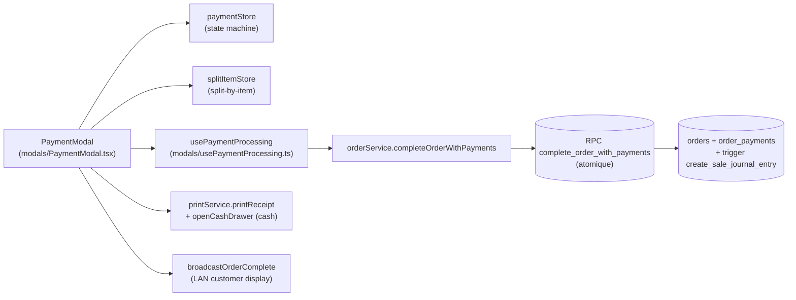

<!-- STALE-V2 -->
> ⚠️ **DOC HISTORIQUE — PÉRIMÉE (V2), NE FAIT PLUS FOI.** Ce fichier décrit en grande partie l'architecture **V2** (mono-app AppGrav, npm/Vercel, PWA/Capacitor, projet Supabase `abjabuniwkqpfsenxljp` = **prod incompatible**, versions RPC obsolètes). **Ne jamais l'appliquer tel quel** (migration, config, archi). Sources de vérité actuelles : `CLAUDE.md` (patterns + workplan) et `docs/workplan/remise-a-plat/` (référence modules réel-vs-demandé). Hiérarchie complète : `docs/README.md`. Régénération depuis le code prévue en Phase 3.

# 03 — Payments & Split

> **Last verified**: 2026-05-03
> **Related E2E flows**: [02-pos-sale-split-payment](../08-flows-end-to-end/02-pos-sale-split-payment.md), [01-pos-sale-cash](../08-flows-end-to-end/01-pos-sale-cash.md), [09-b2b-store-credit](../08-flows-end-to-end/09-b2b-store-credit.md)
> **Related backlog**: travail/03-payments-qris-edc.md (à créer)

## Vue d'ensemble

Module d'encaissement basé sur une **state machine Zustand** (`paymentStore`) et un **RPC atomique unique** (`complete_order_with_payments`) qui insère N paiements + ferme la commande + déclenche les triggers comptables (journal entry sale) en une seule transaction. Supporte split par méthode (cash + card + QRIS …) et split par item (chaque convive paie ses lignes via `splitItemStore`).

## Diagramme de responsabilité



## Tables DB impliquées

| Table | Rôle | Lien |
|---|---|---|
| `order_payments` | Lignes de paiement (`method`, `amount`, `cash_received`, `change_given`, `reference`, `payer_label`) | [details](../03-database/02-tables-reference.md#order_payments) |
| `orders` | `payment_status`, `total`, `cash_received`, `change_given`, `payment_method` (legacy single) | [details](../03-database/02-tables-reference.md#orders) |
| `journal_entries` + `journal_entry_lines` | JE comptable créée par trigger `create_sale_journal_entry()` après complétion | [details](../03-database/02-tables-reference.md#journal_entries) |
| `customer_credit_balances` (vue) | Crédit disponible (lookup pour Pay Later) | [details](../03-database/02-tables-reference.md#customer_credit_balances) |
| `b2b_orders` | Si store_credit + customer wholesale → création commande B2B parallèle | [details](../03-database/02-tables-reference.md#b2b_orders) |

## Hooks principaux

| Hook | Chemin | Rôle |
|---|---|---|
| `usePaymentStore` (Zustand) | `src/stores/paymentStore.ts` | State machine paiements (idle/adding/validating/complete) |
| `useSplitItemStore` (Zustand) | `src/stores/splitItemStore.ts` | Split-by-item state (assignation items ↔ payers) |
| `usePaymentProcessing` | `src/components/pos/modals/usePaymentProcessing.ts` | `processPayment` (single), `processSplitPayment` (multi), `processOutstanding`, gestion `isProcessing` + erreurs |
| `useDisplayBroadcast` | `src/hooks/pos/useDisplayBroadcast.ts` | `broadcastOrderComplete` vers customer display LAN |

## Services principaux

7 fichiers (4 dans `src/services/payment/` + appels RPC dans `orderService`) :

| Service | Chemin | Rôle |
|---|---|---|
| `paymentService` (barrel) | `src/services/payment/paymentService.ts` | Re-export `validatePayment`, `validateSplitPayments`, `calculateChange`, helpers split state |
| `paymentValidation` | `src/services/payment/paymentValidation.ts` | Validation cash_received >= amount, total split = order total, méthode autorisée |
| `splitPaymentState` | `src/services/payment/splitPaymentState.ts` | Builders pure (`createSplitPaymentState`, `addPaymentToState`, `removePaymentFromState`) — utilisés en tests, le state runtime vit dans `paymentStore` |
| `splitItemValidation` | `src/services/payment/splitItemValidation.ts` | Validation split-by-item (cover 100% du cart, pas de double assignation) |
| `orderService.completeOrderWithPayments` | `src/services/pos/orderService.ts:374-401` | **Le** point d'entrée DB : appelle RPC `complete_order_with_payments` |
| `b2bPosOrderService` | `src/services/b2b/b2bPosOrderService.ts` | Crée une `b2b_orders` parallèle si paiement store_credit + customer wholesale |
| `creditService` | `src/services/b2b/creditService.ts` | `getCustomerCredit` (vérif éligibilité Pay Later) |

> **Important** : les inserts directs dans `order_payments` sont **interdits** côté frontend hors RPC. Voir `paymentService.ts:3-7` et CLAUDE.md pitfalls.

## Composants UI principaux

| Composant | Chemin | Rôle |
|---|---|---|
| `PaymentModal` | `src/components/pos/modals/PaymentModal.tsx:36` | Modal principal — orchestre status bar, méthodes, numpad, success, print, B2B parallèle |
| `PaymentMethodSelector` | `src/components/pos/modals/PaymentMethodSelector.tsx` | Grille des 8 méthodes (cash, card, qris, edc, transfer, store_credit, credit, split) |
| `PaymentNumpad` | `src/components/pos/modals/PaymentNumpad.tsx` | Pavé numérique cash + quick amounts |
| `PaymentAmountEntry` | `src/components/pos/modals/PaymentAmountEntry.tsx` | Saisie montant + référence |
| `PaymentAddedList` | `src/components/pos/modals/PaymentAddedList.tsx` | Liste des paiements déjà ajoutés (suppression possible) |
| `PaymentStatusBar` | `src/components/pos/modals/PaymentStatusBar.tsx` | Progress bar `totalPaid / orderTotal` + remaining |
| `PaymentOrderSummary` | `src/components/pos/modals/PaymentOrderSummary.tsx` | Récap items / subtotal / discount / tax / total |
| `PaymentOrderItemsPanel` | `src/components/pos/modals/PaymentOrderItemsPanel.tsx` | Détail items |
| `PaymentFooterActions` | `src/components/pos/modals/PaymentFooterActions.tsx` | Boutons Add / Complete / Pay Later / Split-by-item |
| `PaymentSuccess` | `src/components/pos/modals/PaymentSuccess.tsx` | Écran succès (change, new order, print) |
| `SplitByItemModal` | `src/components/pos/modals/SplitByItemModal.tsx` (lazy) | Split par item (assignation items ↔ payers) |
| `SplitPaymentMethodSelector` | `src/components/pos/modals/SplitPaymentMethodSelector.tsx` | Sélecteur méthode dans split-by-item |
| `SplitItemAssignment` | `src/components/pos/modals/SplitItemAssignment.tsx` | UI assignation per-item |
| `SplitModalHeader` | `src/components/pos/modals/SplitModalHeader.tsx` | Header split modal |

## Stores Zustand utilisés

`paymentStore` est minimaliste mais critique. State :
```ts
{
  orderTotal: number,
  payments: IPaymentEntry[],          // { id, method, amount, cashReceived?, reference?, timestamp }
  totalPaid: number,
  remainingAmount: number,
  status: 'idle' | 'adding' | 'validating' | 'complete',
  currentMethod: TPaymentMethod | null,
  currentAmount: number,
}
```

Lifecycle (`paymentStore.ts:65-181`) :
1. `initialize(orderTotal)` — reset complet, `remainingAmount = orderTotal`
2. `setCurrentMethod(method)` — pré-remplit `currentAmount = remainingAmount` pour non-cash (`paymentStore.ts:87`)
3. `setCurrentAmount(amount)` — frappe numpad
4. `addPayment(input)` — push, recompute `totalPaid` + `remainingAmount`, status = `'complete'` si remaining ≤ 1 IDR (tolérance arrondi)
5. `removePayment(id)` — recompute, status retombe à `'adding'`
6. `reset()` — purge

`splitItemStore` gère le sub-flow split-by-item (mappage items ↔ groupes payeurs).

Voir [`01-architecture/03-state-management.md`](../01-architecture/03-state-management.md) (à créer).

## RPCs / Edge Functions utilisées

| Type | Nom | Rôle |
|---|---|---|
| RPC | `complete_order_with_payments(p_order_id uuid, p_payments jsonb[], p_staff_id uuid, p_session_id uuid) → JSON` | **Atomique**. Insert `order_payments`, update `orders.status='completed'`, `payment_status='paid'`, déclenche trigger comptable. Rollback complet en cas d'erreur. |
| RPC | `complete_order_as_outstanding(p_order_id, p_staff_id, p_session_id, p_customer_name)` | Pay Later — commande à crédit, JE comptable A/R |
| Edge Function | `send-to-printer` | Print receipt après complétion |
| Edge Function | `generate-invoice` | PDF invoice (B2B store_credit) |

Voir [`03-database/03-rpc-functions.md`](../03-database/03-rpc-functions.md) (à créer) et [`05-integrations/02-edge-functions.md`](../05-integrations/02-edge-functions.md) (à créer).

## RLS & Permissions

Permission codes : `sales.create`, `sales.discount`, `sales.refund`, `sales.outstanding`, `sales.void`.

Pattern RLS sur `order_payments` :
```sql
ALTER TABLE public.order_payments ENABLE ROW LEVEL SECURITY;
CREATE POLICY "Authenticated read" ON public.order_payments
    FOR SELECT USING (public.is_authenticated());
CREATE POLICY "Sales create payment" ON public.order_payments
    FOR INSERT WITH CHECK (public.user_has_permission(auth.uid(), 'sales.create'));
```

Le RPC `complete_order_with_payments` est `SECURITY INVOKER` — applique les RLS du caller.

## Méthodes de paiement

Enum `TPaymentMethod` (`src/types/payment.ts:13`) — aligné avec l'enum DB `payment_method` :

| Method | Usage | Champ supplémentaire |
|---|---|---|
| `cash` | Espèces | `cashReceived` (calcul change) |
| `card` | Carte (générique, pas EDC) | `reference` (last 4) |
| `qris` | QRIS Indonesia (QR code) | `reference` (transaction ID) |
| `edc` | EDC bancaire | `reference` (batch / approval) |
| `transfer` | Virement bancaire | `reference` (référence transfert) |
| `split` | Marker meta (mixed methods) | (ne sert plus, un order avec multiples `order_payments` est implicitement split) |
| `store_credit` | Crédit B2B (déclenche `b2bPosOrderService.createB2BPosOrder`, `PaymentModal.tsx:198-209`) | — |
| `credit` | Pay Later customer (route `processOutstanding`) | — |

## Routes

| Route | Page component | Guard |
|---|---|---|
| (modal seulement) | `<PaymentModal>` ouvert depuis `<POSMainPage>` | `POSAccessGuard` parent |
| `/pos/outstanding` | `src/pages/pos/POSOutstandingPage.tsx` | `POSAccessGuard` (consultation des Pay Later) |

## Flows E2E associés

- [01-pos-sale-cash](../08-flows-end-to-end/01-pos-sale-cash.md) (à créer) — flow nominal cash + change + auto print
- [02-pos-sale-split-payment](../08-flows-end-to-end/02-pos-sale-split-payment.md) (à créer) — split cash + card via `addPayment` x N
- [09-b2b-store-credit](../08-flows-end-to-end/09-b2b-store-credit.md) (à créer) — store_credit déclenchant `createB2BPosOrder`
- [10-pay-later-outstanding](../08-flows-end-to-end/10-pay-later-outstanding.md) (à créer) — Pay Later via `complete_order_as_outstanding`

## Pitfalls spécifiques

- **Tolérance arrondi 1 IDR** : `paymentStore.addPayment` considère le paiement complet si `remainingAmount ≤ 1` (`paymentStore.ts:116`). Idem `isComplete()` (`paymentStore.ts:158`). Indispensable car `total` est arrondi à 100 IDR mais split peut introduire un cent fantôme.
- **Pas d'insert direct dans `order_payments`** : toujours passer par `complete_order_with_payments` RPC. `savePayment` existe (`orderService.ts:420`) mais réservé aux scénarios legacy/refund.
- **Single payment vs split** : `usePaymentProcessing` route automatiquement vers `processPayment(p)` ou `processSplitPayment(p[])` selon `paymentInputs.length` (`PaymentModal.tsx:193-195`) — l'API DB est identique (le RPC accepte 1 à N), c'est un detail UX (success screen single).
- **Cash drawer auto-open** : si au moins un payment est cash, `openCashDrawer()` est invoqué post-success (`PaymentModal.tsx:222-225`) ; throw silencieux si pas branché.
- **B2B parallèle** : si `store_credit` + `customerCategorySlug === 'wholesale'`, `createB2BPosOrder` est appelé après succès du POS order (`PaymentModal.tsx:198-209`). En cas d'échec B2B, le POS order est déjà committé — toast d'erreur, pas de rollback.
- **`useEffect initialize/reset` autour de `total`** : `PaymentModal.tsx:102-105` initialize sur `total` change et reset au unmount. Modifier le cart en sous-jacent reset le paymentStore — UX volontaire (cohérence) mais peut surprendre.
- **`isSubmittingRef` ET `isProcessing`** : double guard contre double-clic submit (`PaymentModal.tsx:188-191`). Le second n'est libéré qu'après l'await complet.
- **`successChange` calculé côté client** : somme des `cashReceived - amount` sur tous les payments cash (`PaymentModal.tsx:211-214`). Le RPC ne renvoie pas le change.
- **Auto-print receipt** : `posLocalSettingsStore.autoPrintReceipt` déclenche `handlePrint()` une seule fois grâce à `hasAutoPrintedRef` (`PaymentModal.tsx:296-298`).
- **`forceClearCart()` post-succès** : un order payé a `lockedItems` non vides, donc `clearCart()` retournerait `false`. Toujours utiliser `forceClearCart()` au `handleNewOrder` (`PaymentModal.tsx:259`).
- **Pay Later guard** : `canPayLater` exige `customerCredit.credit_status === 'active'` ET (`credit_limit === 0` (unlimited) OU `availableCredit >= total`) — calculé dans `PaymentModal.tsx:71-80`.
