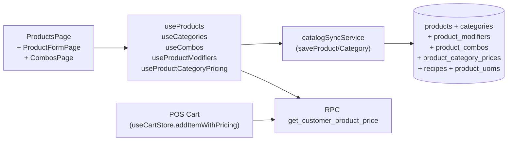

<!-- STALE-V2 -->
> ⚠️ **DOC HISTORIQUE — PÉRIMÉE (V2), NE FAIT PLUS FOI.** Ce fichier décrit en grande partie l'architecture **V2** (mono-app AppGrav, npm/Vercel, PWA/Capacitor, projet Supabase `abjabuniwkqpfsenxljp` = **prod incompatible**, versions RPC obsolètes). **Ne jamais l'appliquer tel quel** (migration, config, archi). Sources de vérité actuelles : `CLAUDE.md` (patterns + workplan) et `docs/workplan/remise-a-plat/` (référence modules réel-vs-demandé). Hiérarchie complète : `docs/README.md`. Régénération depuis le code prévue en Phase 3.

# 05 — Products & Categories

> **Last verified** : 2026-05-13
> **Structure** : ce fichier fusionne la **vue fonctionnelle** (le *pourquoi* et le *quoi* métier — 4 sous-modules + catégories) et la **référence technique** (le *comment* implémenté : tables, hooks, services, RPCs, RLS). Pour les tâches à faire, voir [`../../workplan/backlog-by-module/05-products-categories.md`](../../workplan/backlog-by-module/05-products-categories.md).
> **Related E2E flows** : [13-product-create](../08-flows-end-to-end/13-product-create.md), [14-customer-pricing](../08-flows-end-to-end/14-customer-pricing.md), [15-combo-build](../08-flows-end-to-end/15-combo-build.md), [16-product-import-xlsx](../08-flows-end-to-end/16-product-import-xlsx.md).
> **App de rattachement** : Backoffice principalement (configuration catalogue, prix, combos, promos). Consommé en lecture par POS, KDS, Inventory, Purchasing, Production, Accounting.

> **En une phrase** : le module Products est le **catalogue source de vérité** de The Breakery — il décrit chaque chose qui existe (produit, ingrédient, option, combo, promo, prix custom B2B) pour que la caisse, le KDS, le stock, les achats, la production et la comptabilité parlent tous le même langage et appliquent automatiquement les bonnes règles, sans saisie manuelle ni risque d'incohérence.

---

## Table des matières

- [Partie I — Vue fonctionnelle](#partie-i--vue-fonctionnelle)
  - [1. Raison d'être](#1-raison-dêtre)
  - [2. Les 4 sous-modules](#2-les-4-sous-modules)
  - [3. Objectif Catégories produits](#3-objectif-catégories-produits)
  - [4. Objectif Catalogue produits (liste principale)](#4-objectif-catalogue-produits-liste-principale)
  - [5. Objectif Fiche produit (création / édition)](#5-objectif-fiche-produit-création--édition)
  - [6. Objectif Modifiers (options de personnalisation)](#6-objectif-modifiers-options-de-personnalisation)
  - [7. Objectif UOMs (unités de mesure multiples)](#7-objectif-uoms-unités-de-mesure-multiples)
  - [8. Objectif Combos (bundles)](#8-objectif-combos-bundles)
  - [9. Objectif Promotions](#9-objectif-promotions)
  - [10. Objectif Category Pricing (prix B2B custom)](#10-objectif-category-pricing-prix-b2b-custom)
  - [11. Objectif Dashboard produit (vue analytique)](#11-objectif-dashboard-produit-vue-analytique)
  - [12. Objectif Import en masse (produits + recettes)](#12-objectif-import-en-masse-produits--recettes)
  - [13. Intégrations avec le reste de l'application](#13-intégrations-avec-le-reste-de-lapplication)
  - [14. Objectifs transverses (non-fonctionnels)](#14-objectifs-transverses-non-fonctionnels)
  - [15. Permissions](#15-permissions)
  - [16. Limites assumées V2](#16-limites-assumées-v2)
  - [17. Utilisateurs cibles](#17-utilisateurs-cibles)
  - [18. Indicateurs clés pilotables](#18-indicateurs-clés-pilotables)
- [Partie II — Référence technique](#partie-ii--référence-technique)
  - [19. Vue d'ensemble technique](#19-vue-densemble-technique)
  - [20. Diagramme de responsabilité](#20-diagramme-de-responsabilité)
  - [21. Tables DB impliquées](#21-tables-db-impliquées)
  - [22. Hooks principaux](#22-hooks-principaux)
  - [23. Services principaux](#23-services-principaux)
  - [24. Composants UI principaux](#24-composants-ui-principaux)
  - [25. Stores Zustand utilisés](#25-stores-zustand-utilisés)
  - [26. RPCs / Edge Functions utilisées](#26-rpcs--edge-functions-utilisées)
  - [27. RLS & Permissions](#27-rls--permissions)
  - [28. Routes](#28-routes)
  - [29. Pricing tiers](#29-pricing-tiers)
  - [30. Soft delete](#30-soft-delete)
  - [31. Flows E2E associés](#31-flows-e2e-associés)
  - [32. Pitfalls spécifiques](#32-pitfalls-spécifiques)
- [Partie III — Backlog opérationnel](#partie-iii--backlog-opérationnel)
- [Partie IV — Design & UX](#partie-iv--design--ux)
  - [33. Thèmes et contextes d'affichage](#33-thèmes-et-contextes-daffichage)
  - [34. Écrans du module (13 routes)](#34-écrans-du-module-13-routes)
  - [35. Layout patterns appliqués](#35-layout-patterns-appliqués)
  - [36. Composants UI signature](#36-composants-ui-signature)
  - [37. États visuels critiques](#37-états-visuels-critiques)
  - [38. Couleurs sémantiques utilisées](#38-couleurs-sémantiques-utilisées)
  - [39. Microcopy et empty states](#39-microcopy-et-empty-states)
  - [40. Références visuelles externes](#40-références-visuelles-externes)
  - [41. À faire côté design (backlog UX)](#41-à-faire-côté-design-backlog-ux)

---

# Partie I — Vue fonctionnelle

## 1. Raison d'être

Le module Products est le **catalogue central** de The Breakery. Il répond à la question fondatrice qui précède toutes les ventes, toutes les productions et tous les achats :

> *"Qu'est-ce que je vends, à quel prix, sous quelle forme, avec quelles options, et qui doit le préparer ?"*

C'est le module qui décrit **chaque chose qui existe dans la boulangerie** — un croissant, un cappuccino taille L avec lait d'avoine, un sac de farine de 25 kg, un combo "petit-déjeuner du dimanche", une promo "happy hour 17h-19h". Sans ce catalogue, la caisse n'a rien à scanner, la cuisine ne sait pas ce qu'elle doit faire, le stock ne sait pas quoi tracker, le comptable ne sait pas quoi valoriser.

En un mot : **le catalogue est l'ADN du système** — toute la chaîne (POS, KDS, Inventory, Purchasing, Accounting) s'y réfère en permanence.

---

## 2. Les 4 sous-modules

Le module est structuré en **4 grandes sections** accessibles depuis `/products` :

| Sous-module | Job-to-be-done |
|---|---|
| **Products** | Gérer le catalogue de tout ce qui se vend ou se stocke (produits finis, semi-finis, matières premières) |
| **Combos** | Créer des bundles de plusieurs produits vendus ensemble à un prix groupé |
| **Promotions** | Définir des règles promotionnelles activables sur la caisse (remise, BOGO, happy hour) |
| **Category Pricing** | Définir des prix custom par catégorie client (pour un produit donné, un B2B paie X et un retail paie Y) |

À cela s'ajoute la gestion des **catégories produits** (`/admin/categories`), qui n'a pas son propre onglet mais qui conditionne toute la structure du catalogue.

---

## 3. Objectif Catégories produits

Donner au gérant la **colonne vertébrale du catalogue** : regrouper les produits par famille pour les retrouver vite, les afficher correctement, et les router vers la bonne station de production.

Une catégorie porte plusieurs informations métier :

- **Nom + slug + icône emoji + couleur** : identification visuelle dans le POS, le KDS, les rapports.
- **`dispatch_station`** : station KDS de destination automatique (`barista` pour les boissons, `kitchen` pour les snacks chauds, `display` pour la vitrine, `none` pour ce qui ne dispatche pas).
- **`show_in_pos`** : la catégorie est-elle visible à la caisse ? (Une catégorie "Matières premières" ne l'est pas.)
- **`is_raw_material`** : marque les catégories d'ingrédients qui ne sont jamais vendus en direct.
- **`sort_order`** : ordre d'apparition dans le sélecteur POS.
- **Soft delete** : on désactive une catégorie obsolète sans casser l'historique des produits qui y étaient rattachés.

Catégories types de The Breakery : Breads, Pastries, Cakes, Hot Drinks, Cold Drinks, Breakfast, Sandwiches, Salads, Snacks, Extras, Flour & Grains, Dairy, Fruits & Nuts, Packaging.

Bénéfice métier : **un caissier trouve un produit en 2 clics**, le KDS sait dans quelle station envoyer la commande, et le gérant pilote son catalogue par famille (combien d'items pâtisserie, quel CA boissons, etc.).

---

## 4. Objectif Catalogue produits (liste principale)

Donner au gérant une **vue agrégée et filtrable** de tous les produits de The Breakery.

La liste permet de :

- Voir d'un coup d'œil chaque produit avec son **SKU**, son **nom**, sa **catégorie**, son **type** (finished / semi_finished / raw_material), son **prix retail**, son **prix de revient**, son **stock courant** et son **statut** (actif / POS visible / disponible à la vente).
- **Basculer entre vue grille** (vignettes avec image) **et vue liste** (table dense pour traitement de masse).
- **Filtrer** par catégorie, type, statut actif, visibilité POS, niveau de stock.
- **Rechercher** par nom ou SKU.
- **Statistiques en-tête** : total produits, répartition par type, alertes stock, valeur catalogue.
- **Désactiver** (soft delete) un produit retiré du menu sans casser l'historique des ventes passées.

Bénéfice métier : **piloter le catalogue comme un actif** — repérer les produits sans image, les SKU sans prix de revient, les produits actifs jamais vendus, les ruptures à traiter.

---

## 5. Objectif Fiche produit (création / édition)

Permettre au gérant ou au chef de **créer ou modifier un produit** avec toutes ses caractéristiques métier.

La fiche est organisée en sections logiques :

### 5.1 Informations de base

- **SKU** unique (code produit, généré ou saisi manuellement).
- **Nom**, **description**, **catégorie**.
- **Type de produit** :
  - `finished` — produit vendable directement (croissant, café, sandwich).
  - `semi_finished` — produit intermédiaire (pâte à pain, sirop maison, base de sauce) utilisable comme ingrédient d'une recette.
  - `raw_material` — matière première achetée (farine, sucre, lait) qui n'est jamais vendue telle quelle.
- **Image** uploadée vers Supabase Storage (utilisée à la caisse et dans la fiche).

### 5.2 Pricing

- **Prix retail** (TTC, IDR, arrondi à 100, taxe PB1 10 % incluse).
- **Prix wholesale** (pour les clients B2B avec catégorie wholesale).
- **Prix de revient** (`cost_price` / COGS) — saisi manuellement ou recalculé automatiquement à la réception PO.

### 5.3 Stock & Inventory

- **Unité de base** (`unit` : pcs, g, kg, L, mL…).
- **`track_inventory`** : faut-il décrémenter le stock à chaque vente ?
- **`min_stock_level`** : seuil d'alerte (low stock à `<10`, critique à `<5` par défaut).
- **`is_made_to_order`** : le produit n'a pas de stock propre, il est fabriqué à la commande (boissons typiquement).
- **`deduct_ingredients`** : si une recette est définie, faut-il déduire automatiquement les matières premières à chaque vente ?
- **Section physique** d'emplacement (warehouse, kitchen, display — voir module [Inventory](./06-inventory-stock.md)).

### 5.4 Options de vente

- **`available_for_sale`** : peut-on le commander aujourd'hui ?
- **`pos_visible`** : apparaît-il dans la grille caisse ?
- **`is_active`** : statut global (un produit inactif est masqué partout).

### 5.5 Modifiers (options de personnalisation)

Voir section 6.

### 5.6 UOMs (unités de mesure)

Voir section 7.

### 5.7 Inventory History (depuis la fiche)

Pour les produits suivis en stock, la fiche affiche l'historique récent des mouvements (entrées, sorties, ajustements) en lecture seule — pour comprendre rapidement d'où vient le stock courant sans aller dans le module Inventory.

Bénéfice métier : **toute la connaissance d'un produit centralisée sur une page**, sans navigation aller-retour. Un nouveau chef peut prendre en main un produit en lisant une seule fiche.

---

## 6. Objectif Modifiers (options de personnalisation)

Permettre de **modéliser les options** qu'un client peut choisir au moment de commander, sans démultiplier le catalogue (un cappuccino reste un cappuccino, même avec une taille L et du lait d'avoine).

### 6.1 Structure

Un modifier est organisé en **groupes** (Size, Milk, Sugar, Extras…), chaque groupe contient des **options** (Regular, Large, Oat, Almond, Whipped Cream…).

| Champ | Rôle |
|---|---|
| `group_name` | Nom affiché ("Size", "Milk", "Sugar", "Ice", "Extras") |
| `group_type` | `single` (radio button — un seul choix) ou `multiple` (checkbox — plusieurs choix) |
| `group_required` | Le client est-il obligé de choisir ? |
| `option_label` | Libellé de l'option ("Regular", "Large", "Oat Milk") |
| `price_adjustment` | Delta de prix appliqué si cette option est choisie (peut être 0, +5K, +10K IDR…) |
| `is_default` | L'option est-elle pré-sélectionnée ? |
| `materials` (JSONB) | Pour les variantes qui consomment des ingrédients différents (oat milk déduit X mL de lait d'avoine), tracking des matières associées |

### 6.2 Portée : produit-spécifique ou catégorie-wide

- **Produit-spécifique** (`product_id` renseigné) : ce modifier ne s'applique qu'à ce produit (ex : "extra cheese" sur un sandwich précis).
- **Catégorie-wide** (`category_id` renseigné) : ce modifier s'applique à **tous les produits de la catégorie** (ex : "Size" et "Milk" sur toutes les Hot Drinks).
- **Override** : si un produit redéfinit un groupe portant le même `group_name` que sa catégorie, **le produit gagne** (utile pour customiser une exception sans toucher la règle générale).

### 6.3 Modifiers seed actuels

- **Hot Drinks** : Size (required, single), Sugar (single), Milk (single).
- **Cold Drinks** : Size (required, single), Ice (single), Extras (multiple).

Bénéfice métier : **modéliser la richesse d'un menu de café/boulangerie** sans démultiplier les SKU. Un seul "Cappuccino" gère 12 variantes (3 sucres × 4 laits) avec les bons prix automatiquement.

---

## 7. Objectif UOMs (unités de mesure multiples)

Permettre de **vendre ou acheter un même produit dans plusieurs unités** sans dédoubler la fiche.

### 7.1 Cas d'usage

- Acheter le sucre **en sac de 25 kg** mais stocker en **g** et vendre **à l'unité** (le sachet 100 g).
- Acheter le lait **par carton de 12 bouteilles** mais stocker **par bouteille**.
- Vendre les croissants **à l'unité** ou **par boîte de 6** (avec prix groupé).

### 7.2 Structure

Chaque UOM porte :

- **`uom_code`** + **`uom_name`** (pcs, kg, box, sachet…).
- **`conversion_factor`** vers l'UOM de base (1 kg = 1000 g, 1 box = 12 pcs).
- **Flags d'usage** : `is_base_uom` (référence pour l'inventaire), `is_sale_uom` (utilisable en caisse), `is_purchase_uom` (utilisable en PO).
- **`price_override`** : prix alternatif spécifique à cette UOM (le sachet de 6 croissants peut coûter moins cher que 6× le prix à l'unité).
- **`barcode`** : code-barres associé à cette UOM (utile si chaque conditionnement a son propre EAN).

### 7.3 Conversion automatique

Le système gère automatiquement les conversions :

- Une réception PO de **1 sac de 25 kg** alimente le stock interne en **25 000 g**.
- Une vente de **2 sachets de 100 g** décrémente **200 g** du stock.
- Le prix de revient se recalcule sur l'UOM de base.

Bénéfice métier : **coller à la réalité commerciale** (les fournisseurs livrent en gros, on stocke en gramme, on vend en sachet) sans gymnastique mentale ni saisie manuelle d'unités.

---

## 8. Objectif Combos (bundles)

Permettre de **vendre plusieurs produits ensemble à un prix groupé** typique d'une boulangerie / café.

### 8.1 Cas d'usage

- "**Petit-déjeuner**" : 1 viennoiserie au choix + 1 boisson chaude au choix + 1 jus → 45 000 IDR.
- "**Pause goûter**" : 1 pâtisserie au choix dans une liste de 5 + 1 café → 35 000 IDR.
- "**Sandwich Combo**" : 1 sandwich + 1 boisson froide + 1 cookie → 65 000 IDR.

### 8.2 Structure du combo

Un combo est composé de **groupes de choix** (chaque groupe est une catégorie de l'offre) :

- **Groupe 1** : "Choisissez une viennoiserie" — liste de 5 produits autorisés, l'utilisateur en choisit 1.
- **Groupe 2** : "Choisissez une boisson chaude" — liste de 6 boissons autorisées, l'utilisateur en choisit 1.
- **Groupe 3** : "Ajouter un jus" — optionnel, liste de 3 jus.

Chaque groupe définit :

- **Nom du groupe** + **ordre d'affichage**.
- **Min / max** de sélections autorisées.
- **Liste des produits** éligibles.

### 8.3 Pricing

- **Prix combo fixe** (45 000 IDR pour le petit-dej, peu importe la combinaison).
- **Aperçu du prix** dans le formulaire (`ComboFormPricePreview`) : le gérant voit la marge théorique selon les choix possibles, et peut ajuster.

### 8.4 Cycle de vie

- Création du combo (formulaire dédié à 3 sections : général, groupes, aperçu prix).
- Visibilité POS et statut actif comme un produit standard.
- À la caisse, le caissier sélectionne le combo, le client choisit ses items, le combo est ajouté au panier comme une ligne unique avec ses sous-items.

Bénéfice métier : **augmenter le panier moyen** (le combo pousse à prendre +1 item) et **simplifier la commande client** (un seul prix, pas de calcul). Côté gérant, le combo se pilote comme un produit indépendant (CA, marge, popularité).

Pour le détail moteur, types de remise et stacking, voir le module [13 — Promotions & Discounts](./13-promotions-discounts.md).

---

## 9. Objectif Promotions

Permettre au gérant de **lancer des opérations promotionnelles** (remise temporaire, BOGO, happy hour, code promo) sans hard-coder de règles dans la caisse.

### 9.1 Types de promotion couverts

- **Remise pourcentage** sur un produit, une catégorie, le panier total.
- **Remise montant fixe** (IDR) sur un produit ou un panier.
- **BOGO** : "Buy One Get One Free" ou "Acheté 1 le 2e à -50 %".
- **Happy Hour** : remise active sur une plage horaire précise (ex : 17h–19h).
- **Seuil de panier** : "à partir de 100 000 IDR, -10 %".

### 9.2 Configuration d'une promo

Le formulaire permet de définir :

- **Nom + description** affichés au caissier.
- **Période d'activité** (date début / fin).
- **Plage horaire** (happy hour).
- **Jours de la semaine** (lundi seulement, weekend uniquement…).
- **Produits éligibles** (recherche multi-produit, `PromotionProductSearch`).
- **Catégories éligibles**.
- **Type de remise** (% / IDR / BOGO).
- **Contraintes** : panier minimum, quantité minimum, exclusivité avec d'autres promos, applicable aux clients fidélité uniquement, etc.

### 9.3 Activation à la caisse

Les promotions actives sont **automatiquement évaluées** sur le panier (via `useCartPromotions`) :

- Le moteur compare chaque ligne du panier aux règles actives.
- Les remises éligibles s'appliquent automatiquement.
- L'écran caisse affiche les promos déclenchées et le détail des remises.
- Aucune saisie manuelle n'est nécessaire.

Bénéfice métier : **piloter le marketing depuis le BackOffice** sans toucher au code, et **garantir l'application correcte** des règles (pas d'erreur humaine de caissier qui oublie d'appliquer la promo).

---

## 10. Objectif Category Pricing (prix B2B custom)

Permettre de **définir un prix custom par couple (produit, catégorie client)** quand ni le retail ni le wholesale ne conviennent.

### 10.1 Cas d'usage

- L'hôtel Pullman a négocié 6 000 IDR par baguette (vs retail 12 000 et wholesale 9 000).
- Le restaurant X a un tarif spécial sur 20 produits clés et le wholesale par défaut sur le reste.
- Une catégorie "Employé" bénéficie de -50 % sur tout.

### 10.2 Mécanisme

- Depuis la fiche produit → onglet **Category Pricing** → tableau qui liste **toutes les catégories clients existantes** avec un prix custom optionnel par catégorie.
- Le RPC `get_customer_product_price(product_id, category_slug)` consulte d'abord la table `product_category_prices` ; en l'absence d'entrée, il retombe sur la logique de la catégorie (retail / wholesale / discount %).
- À la caisse, dès qu'un client est rattaché, le prix correct est appliqué automatiquement.

### 10.3 Permissions

L'écran est protégé par `products.pricing` (distinct de `products.update`) — pour qu'un opérateur puisse éditer le nom et la description d'un produit sans pouvoir toucher aux prix négociés B2B.

Bénéfice métier : **gérer les négociations commerciales** au cas par cas (un B2B = un deal) sans dupliquer le catalogue ni faire des calculs manuels à chaque facturation.

---

## 11. Objectif Dashboard produit (vue analytique)

Pour chaque produit, la fiche détaillée (réutilisée depuis le module Inventory : `ProductDetailPage`) propose un **tableau de bord 360°** :

- **KPIs de stock** : niveau courant, valeur, vitesse de rotation.
- **Timeline de stock** : évolution graphique du stock dans le temps.
- **Mouvements récents** : entrées, sorties, ajustements, par type.
- **Performance produit** (`useProductPerformance`) : volume vendu, CA généré, marge sur période.
- **Historique de prix** (`useProductPriceHistory`) : évolution du `retail_price` et du `cost_price` dans le temps.
- **Consommation hebdomadaire** : moyenne sur les dernières semaines.
- **Recettes qui le consomment** (si matière première) : quelles préparations dépendent de cet ingrédient.
- **Patterns d'achat** : fréquence et volume des PO récents sur ce produit.
- **Opnames passés** : dernier inventaire physique et écarts constatés.

Bénéfice métier : **piloter chaque produit individuellement** — décider d'arrêter ceux qui se vendent mal, augmenter le prix de ceux dont le cost a explosé, repérer un best-seller à renforcer.

---

## 12. Objectif Import en masse (produits + recettes)

Permettre de **reprendre rapidement un catalogue existant** (Excel, ancien POS) sans saisie manuelle.

### 12.1 Import produits (`ProductImportModal`)

- Upload CSV/Excel avec colonnes mappées (SKU, name, category, retail_price, etc.).
- Preview des lignes parsées, détection des doublons par SKU.
- Validation des champs obligatoires, signalement des erreurs.
- Résultat : créés / mis à jour / ignorés / en erreur, exportable en rapport.

### 12.2 Import recettes (`RecipeImportModal`)

- Upload d'un fichier décrivant les recettes (produit fini + ingrédients + quantités par unité produite).
- Preview + validation (CSV preview avec parser dédié).
- Création/mise à jour des recettes en masse.

Bénéfice métier : **migrer en 1 journée** depuis un fichier maître Excel, ou **enrichir le catalogue** quand un fournisseur livre une nouvelle gamme.

---

## 13. Intégrations avec le reste de l'application

Le module Products est **consommé en permanence** par le reste du système :

| Module | Comment il s'appuie sur Products |
|---|---|
| **POS / Caisse** | Charge les produits avec `pos_visible = true` + `available_for_sale = true` + `is_active = true`. Applique le pricing selon la catégorie client. Récupère les modifiers pour proposer les options. |
| **KDS** | Route chaque ligne de commande vers la station définie par `category.dispatch_station`. |
| **Inventory** | Décrémente `current_stock` à chaque vente (si `track_inventory = true`) et déduit les ingrédients via recette (si `deduct_ingredients = true`). Génère les alertes via `min_stock_level`. |
| **Purchasing** | Réceptionne les PO et alimente le stock avec conversion UOMs. Met à jour `cost_price` au dernier prix d'achat. |
| **Production** | Consomme les matières premières définies dans les recettes des produits finis. Crée le stock du produit fini. |
| **Customers** | Couple `customer_category` × `product` via `product_category_prices` pour le pricing B2B. |
| **Reports** | Agrège les ventes, marges, rotations par produit et catégorie. |
| **Accounting** | Valorise le stock à `cost_price`, calcule la COGS au moment de la vente, génère les écritures de production. |

Un produit mal configuré casse toute la chaîne. **La discipline catalogue est le prix à payer pour que tout le reste tourne sans intervention humaine.**

---

## 14. Objectifs transverses (non-fonctionnels)

| Objectif | Pourquoi |
|---|---|
| **Soft delete** | Un produit retiré garde son historique de ventes, ses anciennes lignes PO, ses recettes. Aucune perte de données. |
| **Vues sécurisées** | `v_products`, `v_categories`, `v_product_modifiers`, `v_product_uoms` filtrent automatiquement les éléments supprimés. |
| **Multi-UOM cohérent** | Le stock interne est toujours en UOM de base ; les conversions sont calculées automatiquement à l'achat et à la vente. |
| **Cohérence pricing** | Le prix appliqué à la caisse est calculé serveur-side via `get_customer_product_price`, jamais hardcodé client. |
| **Image uploads** | Stockage Supabase Storage avec URL stable, accessible depuis caisse et BackOffice. |
| **Permissions granulaires** | `products.view`, `products.create`, `products.update`, `products.delete`, `products.pricing` — un opérateur peut éditer une description sans pouvoir toucher au prix. |

---

## 15. Permissions

Le module est gouverné par **5 codes de permission** distincts :

| Code | Pour qui ? |
|---|---|
| `products.view` | Tout utilisateur authentifié (caisse, BackOffice) |
| `products.create` | Manager, gérant (création produits, catégories, modifiers, UOMs, combos, promos) |
| `products.update` | Manager, gérant (édition fiches, mais pas forcément les prix B2B) |
| `products.delete` | Gérant uniquement (soft delete) |
| `products.pricing` | Gérant et responsable B2B (édition des prix custom par catégorie client) |

---

## 16. Limites assumées V2

- **Pas de gestion native multi-langue** sur les noms et descriptions — anglais uniquement (i18n suspendu).
- **Pas de variantes produit** au sens "couleur / taille" classique — les modifiers couvrent ce besoin pour la boulangerie.
- **Pas de catalogue versionné** (historique des changements de fiche) — les triggers et `updated_at` tracent la dernière modification mais pas les états antérieurs.
- **Pas de prévision automatique** des prix optimaux — le gérant fixe les prix manuellement.
- **Pas de génération automatique de SKU** intelligente — le SKU est saisi manuellement (la convention `BRD-001`, `HDR-002` est respectée par discipline).
- **Pas d'éditeur de recettes intégré** au formulaire produit — la définition des recettes (matières premières × quantités) se fait via le module [Production](./15-production-recipes.md) / Inventory ou via l'import dédié.
- **Pas de scanner code-barres natif** depuis le web pour saisie produit — l'app Android peut compléter.
- **Pas de catalogue partagé multi-établissement** — un seul site, un seul catalogue.

---

## 17. Utilisateurs cibles

| Rôle | Ce qu'il fait dans le module |
|---|---|
| **Gérant** | Pilote le catalogue global, ajuste les prix, lance les promos, configure les catégories et les paliers de prix B2B. |
| **Chef de production / boulanger** | Crée et met à jour les recettes, ajuste les `cost_price`, gère les semi-finis et les matières premières. |
| **Responsable B2B** | Définit les prix custom par catégorie client (`product_category_prices`). |
| **Caissier** | Consulte le catalogue en lecture seule via la caisse — n'édite jamais une fiche depuis le POS. |
| **Marketing / communication** | Configure les promotions saisonnières, les combos d'offre, l'image associée à chaque produit. |
| **Comptable** | Vérifie la cohérence des `cost_price` et leur impact sur la valorisation stock + la COGS. |

---

## 18. Indicateurs clés pilotables

Le module fournit (ou alimente d'autres modules avec) les indicateurs suivants :

- **Nombre de produits** par type, par catégorie, par statut.
- **Valeur du catalogue** au coût (stock × cost_price) et à la vente (stock × retail_price).
- **Marge brute théorique** par produit (`retail_price - cost_price`).
- **Top sellers** (CA, volume, marge) sur période.
- **Produits dormants** (jamais vendus depuis N jours).
- **Évolution du `cost_price`** (alerte hausse fournisseur).
- **Taux d'utilisation des modifiers** (quel modifier est le plus souvent choisi ?).
- **Performance des combos et des promos** (uplift CA, taux de déclenchement).

---

# Partie II — Référence technique

## 19. Vue d'ensemble technique

Catalogue produits + catégories avec dispatch station KDS, modifiers (taille, lait, extras), combos multi-groupes (groups + items configurables), pricing tiers customer-spécifique (retail / wholesale / discount / custom), recipes (BOM) et UOMs multiples. Soft delete via `deleted_at`. Le pricing customer est résolu par RPC `get_customer_product_price()` à chaque ajout au cart.

---

## 20. Diagramme de responsabilité



---

## 21. Tables DB impliquées

| Table | Rôle |
|---|---|
| `products` | Catalogue (`sku`, `name`, `retail_price`, `wholesale_price`, `cost_price`, `category_id`, `product_type` (finished/semi_finished/raw_material), `current_stock`, `pos_visible`, `available_for_sale`, `track_inventory`, `is_made_to_order`, `deduct_ingredients`, `section_id`, `deleted_at`) |
| `categories` | Catégorie (`name`, `slug`, `icon`, `color`, `dispatch_station`, `sort_order`, `is_raw_material`, `show_in_pos`, `deleted_at`) |
| `product_modifiers` | Modifiers product-level OU category-level (`group_name`, `group_type`, `group_required`, `option_label`, `price_adjustment`, `is_default`, `materials` JSONB pour variants matières) |
| `product_combos` | Combos / menus (header) |
| `product_combo_groups` | Groupes au sein d'un combo (`group_name`, `is_required`, `min_selections`, `max_selections`) |
| `product_combo_group_items` | Items éligibles dans un groupe (`product_id`, `price_adjustment`, `is_default`) |
| `product_category_prices` | Pricing custom par customer category (`product_id`, `customer_category_id`, `price`) |
| `product_uoms` | Unités multiples (`uom_name`, `conversion_factor`, `is_sale_uom`, `is_purchase_uom`, `barcode`, `price_override`) |
| `recipes` | BOM produit fini ↔ ingrédients (`product_id`, `material_id`, `quantity`, `unit`) |
| `customer_categories` | Catégories clients (`slug` : `retail`, `wholesale`, …) — input pricing |

---

## 22. Hooks principaux

14 hooks dans `src/hooks/products/` :

| Hook | Chemin | Rôle |
|---|---|---|
| `useProducts` / `useProductList` | `src/hooks/products/useProductList.ts:11` | Query products POS-visible (`pos_visible=true` AND `available_for_sale=true` AND `is_active=true`), filtre catégorie optionnel, jointure catégorie inline |
| `useProductListSimple` | `src/hooks/products/useProductList.ts:52` | Liste lightweight `{id, name, sku}` pour dropdowns |
| `useProductDetail` | `src/hooks/products/useProductDetail.ts` | Detail full avec recipes + uoms + modifiers (3 queries parallèles) |
| `useCategories` | `src/hooks/products/useCategories.ts` | Liste catégories (POS + admin) |
| `useCombos` | `src/hooks/products/useCombos.ts` | CRUD combos avec groups + items (3 tables jointes en transaction logique côté client) |
| `useProductModifiers` | `src/hooks/products/useProductModifiers.ts` | CRUD modifiers product/category-level + auto-cleanup |
| `useProductCategoryPricing` | `src/hooks/products/useProductCategoryPricing.ts` | CRUD `product_category_prices` (pricing custom par catégorie client) |
| `useProductForm` | `src/hooks/products/useProductForm.ts` | State machine du form produit (validation + draft save) |
| `useProductSearch` | `src/hooks/products/useProductSearch.ts` | Recherche full-text products (POS quick search) |
| `useProductSettings` | `src/hooks/products/useProductSettings.ts` | Préférences catalogue (display, sort) |
| `useProductPerformance` | `src/hooks/products/useProductPerformance.ts` | Métriques ventes par produit (report card) |
| `useProductPriceHistory` | `src/hooks/products/useProductPriceHistory.ts` | Historique changements prix (audit trail) |
| `useProductVariants` | `src/hooks/products/useProductVariants.ts` | Variants matières (lait amande, etc.) — branché sur `product_modifiers.materials` JSONB |
| `usePromotionForm` | `src/hooks/products/usePromotionForm.ts` | Form promotion (lié module Promotions, mais hébergé ici) |

---

## 23. Services principaux

4 fichiers dans `src/services/products/` :

| Service | Chemin | Rôle |
|---|---|---|
| `catalogSyncService` | `src/services/products/catalogSyncService.ts` | `saveProduct` (ligne 13), `saveCategory` (ligne 37), `saveProductCategoryPrice` (ligne 61) — upsert direct Supabase |
| `productImportExport` | `src/services/products/productImportExport.ts` | Import/export XLSX (catalog + recipes), bulk update |
| `productSettingsService` | `src/services/products/productSettingsService.ts` | Gestion settings catalogue (sort orders, displays) |
| `recipeImportExport` | `src/services/products/recipeImportExport.ts` | Import/export recettes XLSX |

---

## 24. Composants UI principaux

| Composant | Chemin | Rôle |
|---|---|---|
| `ProductImportModal` | `src/components/products/ProductImportModal.tsx` | UI import XLSX produits (validation + preview) |
| `RecipeImportModal` | `src/components/products/RecipeImportModal.tsx` | UI import recettes |
| `recipe-import/*` | `src/components/products/recipe-import/` | Sous-composants recipe import (mapping, errors, progress) |

Pages (`src/pages/products/`) :

| Page | Chemin | Rôle |
|---|---|---|
| `ProductsLayout` | `src/pages/products/ProductsLayout.tsx` | Layout shell (tabs Products / Combos / Promotions) |
| `ProductsPage` | `src/pages/products/ProductsPage.tsx` | Liste produits (filter par catégorie, search, bulk actions) |
| `ProductFormPage` | `src/pages/products/ProductFormPage.tsx` | Form create/edit produit (delegate à `product-form/` sub-components) |
| `product-form/*` | `src/pages/products/product-form/` | Sections form (general, pricing, stock, recipes, modifiers, uoms) |
| `ProductCategoryPricingPage` | `src/pages/products/ProductCategoryPricingPage.tsx` | Grille `product_category_prices` (matrice produit × catégorie client) |
| `category-pricing/*` | `src/pages/products/category-pricing/` | Sous-composants matrice |
| `CombosPage` | `src/pages/products/CombosPage.tsx` | Liste combos |
| `ComboFormPage` | `src/pages/products/ComboFormPage.tsx` | Form combo (groups + items) |
| `combo-form/*` | `src/pages/products/combo-form/` | Sub-components form combo |
| `combos-list/*` | `src/pages/products/combos-list/` | Sub-components liste |
| `PromotionsPage` | `src/pages/products/PromotionsPage.tsx` | Liste promotions (module séparé mais routé ici) |
| `PromotionFormPage` | `src/pages/products/PromotionFormPage.tsx` | Form promotion |
| `promotions-list/*` | `src/pages/products/promotions-list/` | Sub-components |
| `PromotionConstraintsSection` | `src/pages/products/PromotionConstraintsSection.tsx` | UI règles promotion |
| `PromotionProductSearch` | `src/pages/products/PromotionProductSearch.tsx` | Picker produits éligibles promo |

Composants modifier consommés par POS (vivent dans `src/components/pos/modals/`) :
- `ModifierModal`, `ModifierGroupSection`, `VariantModal`, `modifierConfig.ts`

---

## 25. Stores Zustand utilisés

Le module **n'a pas de store Zustand dédié** — toutes les données passent par react-query (`useProducts`, `useCategories`, `useCombos`, …) et sont consommées par `cartStore` au moment de l'ajout (`addItem` / `addItemWithPricing` / `addCombo`).

---

## 26. RPCs / Edge Functions utilisées

| Type | Nom | Rôle |
|---|---|---|
| RPC | `get_customer_product_price(product_id, category_slug)` → DECIMAL | Résout le prix selon le tier customer (retail / wholesale / discount % / custom override). Implémentation dans `database.generated.ts:12044`. |
| RPC | (insertion via `useCombos.create`) | Pas de RPC dédié — combo create fait 3 inserts séquentiels (combo + groups + items) côté client (`useCombos.ts:85-115`) |
| Direct upsert | `products`, `categories`, `product_modifiers`, `product_combos`, `product_combo_groups`, `product_combo_group_items`, `product_category_prices`, `recipes`, `product_uoms` | Via `catalogSyncService` ou hooks directs |

Pas d'Edge Function métier products — module purement DB.

---

## 27. RLS & Permissions

Permission codes : `products.view`, `products.create`, `products.update`, `products.delete`, `products.pricing`, `products.import`, `products.export`.

Pattern RLS sur `products` :
```sql
ALTER TABLE public.products ENABLE ROW LEVEL SECURITY;
CREATE POLICY "Authenticated read" ON public.products
    FOR SELECT USING (public.is_authenticated() AND deleted_at IS NULL);
CREATE POLICY "Products create" ON public.products
    FOR INSERT WITH CHECK (public.user_has_permission(auth.uid(), 'products.create'));
CREATE POLICY "Products update" ON public.products
    FOR UPDATE USING (public.user_has_permission(auth.uid(), 'products.update'));
```

`products.pricing` est requis pour `/products/:id/pricing` (matrice) — protégé par `<RouteGuard permission="products.pricing">` (`productRoutes.tsx:39`).

---

## 28. Routes

Toutes définies dans `src/routes/productRoutes.tsx` :

| Route | Page component | Guard |
|---|---|---|
| `/products` | `<ProductsLayout>` → `<ProductsPage>` (index) | `products.view` |
| `/products/combos` | `<CombosPage>` (dans layout) | `products.view` |
| `/products/promotions` | `<PromotionsPage>` (dans layout) | `products.view` |
| `/products/new` | `<ProductFormPage>` | `products.create` |
| `/products/:id` | `<ProductDetailPage>` (réutilise inventory page) | `products.view` |
| `/products/:id/edit` | `<ProductFormPage>` | `products.update` |
| `/products/:id/pricing` | `<ProductCategoryPricingPage>` | `products.pricing` |
| `/products/combos/new` | `<ComboFormPage>` | `products.create` |
| `/products/combos/:id` | `<ComboFormPage>` | `products.view` |
| `/products/combos/:id/edit` | `<ComboFormPage>` | `products.update` |
| `/products/promotions/new` | `<PromotionFormPage>` | `products.create` |
| `/products/promotions/:id` | `<PromotionFormPage>` | `products.view` |
| `/products/promotions/:id/edit` | `<PromotionFormPage>` | `products.update` |

Toutes wrappées dans `<ModuleErrorBoundary moduleName="Products">`.

---

## 29. Pricing tiers

| Tier | Slug `customer_categories.slug` | Source de prix |
|---|---|---|
| Retail | `retail` | `products.retail_price` (default) |
| Wholesale | `wholesale` | `products.wholesale_price` |
| Discount % | `discount` | `products.retail_price * (1 - customer_categories.discount_percentage/100)` |
| Custom | (any custom slug) | `product_category_prices.price` lookup, fallback retail si absent |

Côté cart : `useCartStore.addItemWithPricing(product, qty, modifiers, notes, customerPrice, priceType, savings, variants)` — `priceType` est `'retail' | 'wholesale' | 'discount' | 'custom'` (`src/types/cart.ts:15`).

Recalcul global cart sur changement de customer : `useCartStore.recalculateAllPrices(priceCalculator)` (`cartStore.ts:519-555`) — itère sur snapshot, écrit dans state actuel pour éviter race avec ajouts simultanés.

---

## 30. Soft delete

Tous les hooks de lecture filtrent implicitement via la RLS policy `deleted_at IS NULL`. Les hooks d'écriture mettent `deleted_at = now()` plutôt qu'un vrai `DELETE`. Les `useCombos` font une exception : `delete()` direct (`useCombos.ts:132`) car les combos ne sont pas FK-référencés ailleurs (ils sont stockés en JSONB dans `order_items.combo_selections`).

---

## 31. Flows E2E associés

- [13-product-create](../08-flows-end-to-end/13-product-create.md) (à créer) — création produit + recipe + modifiers
- [14-customer-pricing](../08-flows-end-to-end/14-customer-pricing.md) (à créer) — résolution `get_customer_product_price` + recalc cart
- [15-combo-build](../08-flows-end-to-end/15-combo-build.md) (à créer) — build combo multi-groupes + ajout cart
- [16-product-import-xlsx](../08-flows-end-to-end/16-product-import-xlsx.md) (à créer) — import XLSX bulk

---

## 32. Pitfalls spécifiques

- **`UI_SENTINELS` à filtrer** : `useProducts(categoryId)` rejette `'__combos__'` et `'favorites'` (`useProductList.ts:9-12`) car ce sont des onglets UI, pas des FK. Sans ce filtre, Supabase renvoie 400.
- **Pas de table `product_variants`** : le concept "variant" est implémenté via `product_modifiers.materials` JSONB (`useProductModifiers.ts:122`) — un modifier d'un produit peut consommer une matière différente (ex. lait amande au lieu de lait entier déduit du stock).
- **Combos non-soft-delete** : `useCombos.delete()` fait un vrai `DELETE` — un combo référencé dans un `order_items.combo_selections` JSONB historique ne casse pas (FK-less).
- **Pricing custom fallback** : `get_customer_product_price` renvoie `retail_price` si aucune entrée `product_category_prices` n'existe pour la catégorie demandée. Ne jamais supposer qu'un customer wholesale a forcément un prix custom.
- **`pos_visible` ≠ `is_active`** : un produit peut être actif (visible BackOffice) mais pas POS (kitchen prep only). Le filtre POS exige les TROIS flags `pos_visible AND available_for_sale AND is_active` (`useProductList.ts:19-21`).
- **`is_made_to_order` + `deduct_ingredients`** : produit BOM, déduit le stock des matières via `recipes` au moment de la production (cf. module [Production](./15-production-recipes.md)). Pas déduit à la vente seule.
- **`section_id` orphelin** : champ optionnel sur `products` pour grouper visuellement dans le POS (sections du menu). Pas de table `sections` distincte — c'est un libre arbitre catalogue.
- **`product_modifiers` peut être product-level OU category-level** : si `product_id` est NULL, le modifier s'applique à tous les produits de la `category_id` ; si `product_id` est rempli, il override pour ce produit (`useProductModifiers.ts:121-130`).
- **Modifiers persistés via JSONB dans `order_items.modifiers`** : pas de FK, donc supprimer un `product_modifiers` ne casse pas l'historique commandes.
- **Imports XLSX** : `productImportExport.ts` valide colonne par colonne, crée les catégories manquantes si auto-detect activé. SKU duplicate déclenche update plutôt qu'insert.
- **Combo upsert "transaction"** : `useCombos.update` fait combo + delete groups + delete items + re-insert (3-4 round-trips). Pas atomique au niveau DB — si le client coupe, on peut se retrouver avec un combo orphelin de groupes. Backlog : encapsuler dans une RPC.

---

# Partie III — Backlog opérationnel

Pour les tâches techniques à exécuter (refonte form produit, variants tab à créer, RPC atomique combo upsert, multi-langue, versioning fiche, génération SKU intelligente, scanner code-barres web, audit catalogue), voir :

→ [`../../workplan/backlog-by-module/05-products-categories.md`](../../workplan/backlog-by-module/05-products-categories.md)

Tâches priorisées P0–P3 avec critères d'acceptation, dépendances, estimations XS/S/M/L/XL et risques identifiés.

---

# Partie IV — Design & UX

> **Source canonique** : [`../../DESIGN_POS_AND_BACKOFFICE.md`](../../DESIGN_POS_AND_BACKOFFICE.md) (design détaillé des deux apps).
> **Design system global** : [`../02-design-system/`](../02-design-system/) (7 fichiers : Luxe Dark, tokens, shadcn, layouts, responsive).
> **Screenshots de référence** : [`../../ux/assets/screens/`](../../ux/assets/screens/) — source de vérité visuelle.

## 33. Thèmes et contextes d'affichage

Le module Products vit **principalement en Backoffice**, avec une présence en lecture seule au POS :

| Contexte | Thème CSS | Pages concernées | Identité |
|---|---|---|---|
| **Backoffice catalogue** | `.theme-backoffice` (ivoire `#F8F8F6`) | `/products`, `/products/combos`, `/products/promotions`, `/products/:id`, `/products/:id/edit`, `/products/:id/pricing`, `/admin/categories` | Salle de commandement claire, dense, scrollable |
| **POS — grille produits** | `.theme-pos` (noir profond `#0C0C0E`) | `/pos` (consommation lecture seule du catalogue) | Vue théâtrale tactile, photos plein cadre |
| **POS — Combo Selector** | `.theme-pos` (noir profond) | Modal `ComboSelectorModal` au POS | Sélection guidée des composants |
| **POS — Modifier Modal** | `.theme-pos` (noir profond) | Modal `ModifierModal` au POS (tailles, lait, sucre) | Choix rapide tactile |

**Constante de marque cross-thème** : l'or `#C9A55C` reste identique partout (CTA primaires, totaux, statut actif). Voir [`../../DESIGN_POS_AND_BACKOFFICE.md`](../../DESIGN_POS_AND_BACKOFFICE.md) §2 (Luxe Bakery).

---

## 34. Écrans du module (13 routes)

| Route | Type d'écran | Densité | Composants signature |
|---|---|---|---|
| `/products` | Liste produits paginée (grille + table) | Haute | `ProductsLayout`, `ProductsPage`, FilterBar (catégorie + type + status + search), bulk actions |
| `/products/combos` | Liste combos | Moyenne | `CombosPage`, `ComboCard`, `CombosStats`, `CombosHeader` |
| `/products/promotions` | Liste promotions | Moyenne | `PromotionsPage`, `PromotionCard`, `PromotionsStats` |
| `/products/new` | Formulaire création produit | Très haute | `ProductFormPage`, sections (general / pricing / stock / recipes / modifiers / uoms) |
| `/products/:id` | Fiche produit (réutilise `ProductDetailPage` inventory) | Haute | Tabs (Overview / Stock / Movements / Recipe / Suppliers) |
| `/products/:id/edit` | Formulaire édition produit | Très haute | Idem `/products/new` avec data préchargée |
| `/products/:id/pricing` | Matrice prix par catégorie client | Moyenne | `ProductCategoryPricingPage`, table produit × customer_category |
| `/products/combos/new` | Formulaire combo (3 onglets) | Haute | `ComboFormPage`, `ComboFormGeneral`, `ComboFormGroupEditor`, `ComboFormPricePreview` |
| `/products/combos/:id` | Détail combo (lecture seule) | Moyenne | Idem `/combos/new` mais read-only |
| `/products/combos/:id/edit` | Formulaire édition combo | Haute | Idem `/combos/new` avec data préchargée |
| `/products/promotions/new` | Formulaire promotion | Haute | `PromotionFormPage`, `PromotionConstraintsSection`, `PromotionProductSearch` |
| `/products/promotions/:id` | Détail promo (lecture seule) | Moyenne | Idem `/promotions/new` read-only |
| `/products/promotions/:id/edit` | Formulaire édition promotion | Haute | Idem `/promotions/new` avec data préchargée |

S'y ajoute `/admin/categories` (gestion des catégories — page Settings dédiée).

---

## 35. Layout patterns appliqués

### 35.1 Backoffice — Liste produits (`/products`)

Pattern récurrent de toute liste Backoffice (cf. [`../../DESIGN_POS_AND_BACKOFFICE.md`](../../DESIGN_POS_AND_BACKOFFICE.md) §4.3) :

1. **Header de page** : titre "Products" + sous-titre (compteur total) + actions à droite (boutons "New product", "Import", "Export").
2. **Tabs horizontaux** sous le header : `Products` / `Combos` / `Promotions` / `Category Pricing` (onglet actif = bordure inférieure gold 2px + texte gold-dark).
3. **Stats cards** en row (4–5 KPI compactes) : `Total products`, `Active / inactive`, `Low stock items`, `Catalog value at cost`, `Catalog value at retail`.
4. **Filters bar** : recherche (SKU/nom) + dropdowns (category, type, status, POS visibility) + bouton "Reset".
5. **Toggle vue grille / table** : 2 boutons icônes (grid / list) — la grille montre les photos en vignettes 280×280, la table affiche les colonnes denses.
6. **Table** principale en vue liste : header sticky, lignes alternées doucement, hover row `surface-2`, severity badge sur stock, badge statut, actions kebab.
7. **Pagination** + sélecteur "Items per page".

### 35.2 Backoffice — Liste combos (`/products/combos`)

- **CombosHeader** : titre + bouton "New combo".
- **CombosStats** : nombre de combos actifs, prix moyen, top combo.
- **Grille de `ComboCard`** : image, nom, prix combo, badge actif/inactif, compteur de groupes.
- **Filters** : status actif, recherche.

### 35.3 Backoffice — Liste promotions (`/products/promotions`)

- **PromotionsStats** : promos actives, planifiées, expirées, total redemptions du jour.
- **Cards (`PromotionCard`)** : nom, badge type (percentage / fixed / BOGO / free product), période, conditions résumées, compteur utilisations, toggle `is_active`.
- **Filters** : type, statut, recherche.

### 35.4 Backoffice — Formulaire produit (`/products/new`, `/products/:id/edit`)

Pattern formulaire dense Backoffice (cf. §4.4) :

1. **Breadcrumb** : `< Back to Products`.
2. **Bloc identité en haut** : SKU + nom + catégorie + type + statut actif.
3. **Sections collapsibles ou onglets latéraux** :
   - **General** : SKU, nom, description, catégorie, type, image upload.
   - **Pricing** : retail, wholesale, cost.
   - **Stock & Inventory** : unit, track_inventory, min_stock_level, is_made_to_order, deduct_ingredients, section_id.
   - **Sale options** : available_for_sale, pos_visible, is_active.
   - **Modifiers** : éditeur de groupes + options (product-level ou inherited from category).
   - **UOMs** : table éditable conversions multiples.
   - **Recipe** : éditeur BoM (si le produit a une recette).
4. **Sidebar droite** : sticky summary (preview catégorie, status badges, dernière modification, créateur).
5. **Footer d'actions sticky** : `Save draft` / `Save & continue` (primaire or) / `Delete` (secondaire rouge).

### 35.5 Backoffice — Matrice Category Pricing (`/products/:id/pricing`)

- **Header** : nom produit + retail price de référence + bouton "Reset to default".
- **Table** : ligne par customer category, colonne `Custom price` éditable inline, indicateur "fallback retail" si vide.
- **Footer** : `Save all` (primaire or).

### 35.6 Backoffice — Formulaire combo (3 onglets)

- **Tabs** : `General` / `Groups` / `Price preview` (onglet actif = bordure inférieure gold).
- **General** (`ComboFormGeneral`) : nom, description, image, prix combo, période de disponibilité, status.
- **Groups** (`ComboFormGroupEditor`) : liste de groupes avec drag-handle, éditeur de règles (min/max selections, is_required), picker de produits éligibles, surcoût par item.
- **Price preview** (`ComboFormPricePreview`) : tableau scénarios (combinaison choisie → marge théorique).

### 35.7 Backoffice — Formulaire promotion

- **Sections collapsibles** :
  - **Identity** : nom, description, code interne, code promo client optionnel.
  - **Type** : sélecteur visuel (cards) percentage / fixed / BOGO / free product.
  - **Value** : champs dépendant du type.
  - **Period & constraints** (`PromotionConstraintsSection`) : date start/end, days_of_week, time start/end.
  - **Targets** (`PromotionProductSearch`) : multi-picker produits + catégories.
  - **Conditions** : min purchase, min quantity, customer type, order type, payment method.
  - **Limits** : max_uses_total, max_uses_per_customer, max_uses_per_day.
- **Sidebar droite** : preview "Comment cette promo va-t-elle s'afficher au POS ?" (mock cart ligne avec discount appliqué).

### 35.8 POS — Grille produits (consommation lecture)

Voir [`02-pos-cart-orders.md`](./02-pos-cart-orders.md) et [`../../DESIGN_POS_AND_BACKOFFICE.md`](../../DESIGN_POS_AND_BACKOFFICE.md) §3.2 :

- Grille 2-4 colonnes selon viewport, cartes 280×280, photo plein cadre, overlay sombre.
- Catégorie active en or, navigation horizontale.
- Badge "SOLD OUT" diagonal si `current_stock = 0`.
- Stock badge discret en coin si `<10`.

### 35.9 POS — Combo Selector & Modifier modals

- Modal plein écran (fond `surface-1` POS), header titre Playfair, sections par groupe.
- Tiles produits avec photo + nom + surcoût.
- Sélection active : bordure gold + check mark.
- Validation bloquée tant que règles non satisfaites.
- Footer fixé en bas : prix combo + bouton "Add to cart" or massif.

---

## 36. Composants UI signature

| Composant | Type | Usage | Style clé |
|---|---|---|---|
| `ProductCard` | Tile | Vue grille `/products` | Photo carrée, overlay nom + prix, badge severity stock |
| `ProductRow` | Table row | Vue liste `/products` | Compact, severity badge, action icons |
| `ProductImportModal` | Modal | Import XLSX produits | Stepper : upload → mapping → preview → execute |
| `RecipeImportModal` | Modal | Import recettes | Idem stepper avec parser dédié |
| `ComboCard` | Card | Liste combos | Image combo + nom + prix + badge active |
| `ComboFormPricePreview` | Table | Onglet preview combo | Lignes scénarios, marge théorique colorée |
| `PromotionCard` | Card | Liste promotions | Badge type (couleur sémantique), période, toggle actif |
| `PromotionProductSearch` | Multi-picker | Form promotion targets | Liste filtrable produits + catégories, chips sélection |
| `ModifierModal` | Modal POS | Sélection options produit | Sections par groupe (size/milk/sugar), prix delta visible |
| `ComboSelectorModal` | Modal POS | Sélection composants combo | Groupes pliables, règles "Choose 1 of 4", footer prix + CTA |
| `VariantModal` | Modal POS | Sélection variant matière | Tiles avec sous-titre matière consommée |
| `CategoryPricingMatrix` | Table | `/products/:id/pricing` | Cellules inline-editable, fallback indicator |

---

## 37. États visuels critiques

| État | Visuel | Pourquoi |
|---|---|---|
| **Produit inactif** | Card grisée, badge "Inactive" gris foncé, opacity 0.6 | Distinguer du catalogue actif |
| **Produit POS-hidden** | Badge "Not on POS" jaune muted | Visible Backoffice mais pas vendable en caisse |
| **Stock critique sur card** | Pastille rouge `#DC2626` en coin top-right de la card | Alerter d'un coup d'œil |
| **Stock low** | Pastille orange `#D97706` en coin top-right | Avertissement préventif |
| **SKU dupliqué détecté à l'import** | Ligne fond rouge dans preview, tooltip "SKU already exists → will update" | Permet d'arbitrer avant exécution |
| **Image manquante** | Placeholder gris avec icône `Image` Lucide barrée + tooltip "No image uploaded" | Repérer rapidement les fiches incomplètes |
| **Combo avec règles invalides** | Bordure rouge sur le groupe + texte d'erreur sous le groupe | Bloquer la sauvegarde |
| **Pricing custom override** | Cellule fond `gold/10` + petit `★` à droite | Visible que ce prix override le tier par défaut |
| **Pricing fallback retail** | Cellule grise avec texte muted "= 12 000 IDR (retail)" | Confirmer qu'aucun override n'existe |
| **Promo expirée** | Card opacity 0.5 + badge "Expired" gris | Distingue de planifiée / active |
| **Promo planifiée** | Badge bleu "Scheduled" + date début | Mise en attente avant fenêtre |
| **Promo en cours** | Badge vert pulsing "Active now" | Indicateur live |
| **Soft deleted** | Toggle "Show deleted" pour révéler ; ligne en gris foncé avec barre diagonale | Audit / restauration possible |

---

## 38. Couleurs sémantiques utilisées

| Rôle | POS (dark) | Backoffice (light) | Usage Products |
|---|---|---|---|
| **Success** | `#34D399` | `#16A34A` | Produit actif, promo "Active now", import OK |
| **Warning** | `#FBBF24` | `#D97706` | Stock <10, prix sans cost_price, image manquante, hidden from POS |
| **Error** | `#F87171` | `#DC2626` | Stock <5, SKU duplicate à l'import, combo avec règles invalides, prix négatif |
| **Info** | `#60A5FA` | `#2563EB` | Promo planifiée, fallback retail price, badge "Inherited from category" |
| **Gold** | `#C9A55C` | `#C9A55C` | Bouton primaire "Save", price override, total combo, CTA "Add to cart" POS |

---

## 39. Microcopy et empty states

### Empty states (EN only)

| Page | Texte | CTA |
|---|---|---|
| `/products` (aucun produit) | "Your catalog is empty — let's add your first product" + icône `Box` grise | "Add product" (primary gold) |
| `/products` (filtre vide) | "No products match your filters" | "Reset filters" |
| `/products/combos` (aucun combo) | "No combos yet — bundle your best sellers to boost average ticket" + icône `Layers` grise | "Create combo" |
| `/products/promotions` (aucune promo) | "No promotions yet — launch your first campaign" + icône `Percent` grise | "Create promotion" |
| `/products/:id/pricing` (aucune catégorie custom) | "Default retail price applies to all customer categories" | "Add custom price" (gold) |
| Recipe tab (aucune recette) | "No recipe defined yet — add ingredients to enable production tracking" | "Add ingredient" |
| Modifiers tab (aucun modifier) | "No modifiers yet — add Size, Milk or Extras to give customers choices" | "Add modifier group" |

### Confirmations destructives

- **Soft delete produit** : "This product will be hidden from POS and Backoffice. Past sales and history remain intact." + bouton "Archive product" (orange) + raison optionnelle.
- **Hard delete combo** : "Combos are not soft-deletable. This combo will be permanently removed. Historical orders that included this combo remain intact via JSONB snapshot." + bouton "Delete permanently" (rouge).
- **Désactiver une catégorie** : "Products in this category will lose their category badge. Reassign them first?" + bouton "Disable category" (orange).
- **Changer le `cost_price`** : "Changing cost will impact margin calculations going forward. Past sales keep their snapshot." + bouton "Update cost" (gold).
- **Override pricing custom** : "This will override the default tier price for this customer category." + confirm.

### Toast notifications (EN)

- Succès création produit : "Product 'Croissant tradition' (BRD-001) created"
- Succès import XLSX : "Import complete: 47 created, 12 updated, 3 skipped, 0 errors"
- Erreur import : "Import failed at row 23 — SKU is required"
- Succès promo activée : "Promotion 'Weekend 10%' is now live until Sunday 23:59"
- Succès toggle POS visibility : "Now visible on POS" / "Hidden from POS"
- Erreur SKU dupliqué : "SKU 'BRD-001' already exists. Use 'Update mode' to overwrite."

---

## 40. Références visuelles externes

| Ressource | Chemin / lien |
|---|---|
| Design doc complet (POS + Backoffice) | [`../../DESIGN_POS_AND_BACKOFFICE.md`](../../DESIGN_POS_AND_BACKOFFICE.md) |
| Tokens canoniques V2 | [`../../../DESIGN.md`](../../../DESIGN.md) à la racine |
| Inventaire tokens V2 | [`../../ux/v2-token-inventory.md`](../../ux/v2-token-inventory.md) |
| Screenshots Backoffice de référence | [`../../ux/assets/screens/backoffice/`](../../ux/assets/screens/backoffice/) |
| Screenshots POS de référence | [`../../ux/assets/screens/caissapp/v2-reference/`](../../ux/assets/screens/caissapp/v2-reference/) — voir notamment `04-grid-coffee-cart-2items-table-t12.jpg` pour le pattern grille produit POS |
| Design system feature components | [`../02-design-system/04-feature-components.md`](../02-design-system/04-feature-components.md) |

---

## 41. À faire côté design (backlog UX)

| Priorité | Évolution UX | Bénéfice |
|---|---|---|
| Critical | **Refonte ProductFormPage** en stepper sectionné (general → pricing → stock → recipe → modifiers → review) | Réduire la fatigue cognitive d'un formulaire actuellement long et sans repère visuel |
| Critical | **Variants tab** (visuel dédié pour `product_modifiers.materials` JSONB) | Donner un éditeur clair pour les variants matières (lait amande, etc.) — actuellement caché dans un JSONB |
| High | **Drag-and-drop sort_order** sur catégories et sur produits dans une catégorie | Permettre au gérant d'ordonner visuellement la grille POS sans saisir des nombres |
| High | **Preview live du POS** dans le formulaire produit | Voir à droite "voici à quoi ça ressemblera sur la grille caisse" pendant l'édition |
| High | **Bulk edit modal** depuis la liste produits | Modifier `pos_visible`, `is_active`, `category_id`, prix sur une sélection — actuellement il faut éditer chaque fiche |
| Medium | **Heatmap top sellers** sur la liste catalogue (couleur de fond proportionnelle au CA 30j) | Repérer d'un coup d'œil les produits stars vs dormants |
| Medium | **Visualisation matrice prix B2B** : graphe radial des écarts retail vs custom par catégorie client | Pilotage stratégique des négociations |
| Medium | **Inline edit table** en vue liste (prix, stock_min, statuts en double-clic) | Éviter d'ouvrir la fiche pour des micro-ajustements |
| Low | **Confettis** à la création d'un nouveau combo ou d'une nouvelle promo | Récompense visuelle (gamification douce) |
| Low | **Mode "Curator"** : sélection des produits star à mettre en avant POS (badge ★) avec animation discrète | Marketing live |

---
