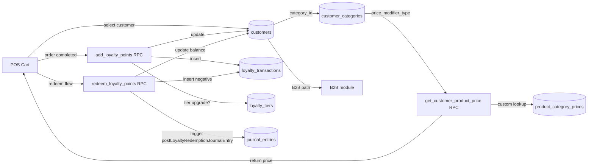

<!-- STALE-V2 -->
> ⚠️ **DOC HISTORIQUE — PÉRIMÉE (V2), NE FAIT PLUS FOI.** Ce fichier décrit en grande partie l'architecture **V2** (mono-app AppGrav, npm/Vercel, PWA/Capacitor, projet Supabase `abjabuniwkqpfsenxljp` = **prod incompatible**, versions RPC obsolètes). **Ne jamais l'appliquer tel quel** (migration, config, archi). Sources de vérité actuelles : `CLAUDE.md` (patterns + workplan) et `docs/workplan/remise-a-plat/` (référence modules réel-vs-demandé). Hiérarchie complète : `docs/README.md`. Régénération depuis le code prévue en Phase 3.

# 08 — Customers & Loyalty

> **Last verified** : 2026-05-13
> **Structure** : ce fichier fusionne la **vue fonctionnelle** (le *pourquoi* et le *quoi* métier) et la **référence technique** (le *comment* implémenté). Pour les tâches à faire, voir [`../../workplan/backlog-by-module/08-customers-loyalty.md`](../../workplan/backlog-by-module/08-customers-loyalty.md).
> **Related E2E flows** : [07-loyalty-earn-redeem](../08-flows-end-to-end/07-loyalty-earn-redeem.md).
> **App de rattachement** : Backoffice (CRUD complet, dashboards, imports, paliers et catégories) avec extensions POS (search rapide, scan QR code, création express, application du pricing différencié et de la fidélité en caisse).

> **En une phrase** : le module Customers transforme chaque ticket de caisse en relation suivie — il sait qui achète quoi, à quel prix, avec quelle fidélité et quel encours — pour que The Breakery puisse récompenser ses meilleurs clients retail, facturer correctement ses comptes B2B, et piloter son portefeuille au lieu de subir le hasard du passage en boutique.

---

## Table des matières

- [Partie I — Vue fonctionnelle](#partie-i--vue-fonctionnelle)
  - [1. Raison d'être](#1-raison-dêtre)
  - [2. Les deux populations couvertes](#2-les-deux-populations-couvertes)
  - [3. Objectif Fichier clients (vue liste)](#3-objectif-fichier-clients-vue-liste)
  - [4. Objectif Création / édition de fiche client](#4-objectif-création--édition-de-fiche-client)
  - [5. Objectif Catégories clients (pricing tiers)](#5-objectif-catégories-clients-pricing-tiers)
  - [6. Objectif Programme de fidélité (loyalty)](#6-objectif-programme-de-fidélité-loyalty)
  - [7. Objectif Fiche client détaillée (dashboard 360°)](#7-objectif-fiche-client-détaillée-dashboard-360)
  - [8. Objectif Import en masse](#8-objectif-import-en-masse)
  - [9. Objectif Intégration POS (caisse)](#9-objectif-intégration-pos-caisse)
  - [10. Objectif Intégration B2B / Wholesale](#10-objectif-intégration-b2b--wholesale)
  - [11. Objectif Sécurité et conformité](#11-objectif-sécurité-et-conformité)
  - [12. Permissions](#12-permissions)
  - [13. Limites assumées V2](#13-limites-assumées-v2)
  - [14. Utilisateurs cibles](#14-utilisateurs-cibles)
  - [15. Indicateurs clés pilotables](#15-indicateurs-clés-pilotables)
- [Partie II — Référence technique](#partie-ii--référence-technique)
  - [16. Vue d'ensemble technique](#16-vue-densemble-technique)
  - [17. Architecture conceptuelle](#17-architecture-conceptuelle)
  - [18. Tiers fidélité (seedés)](#18-tiers-fidélité-seedés)
  - [19. Diagramme de responsabilité](#19-diagramme-de-responsabilité)
  - [20. Tables DB impliquées](#20-tables-db-impliquées)
  - [21. Hooks principaux](#21-hooks-principaux)
  - [22. Services principaux](#22-services-principaux)
  - [23. Composants UI principaux](#23-composants-ui-principaux)
  - [24. Stores Zustand utilisés](#24-stores-zustand-utilisés)
  - [25. RPCs / Edge Functions / Triggers](#25-rpcs--edge-functions--triggers)
  - [26. RLS & Permissions](#26-rls--permissions)
  - [27. Routes](#27-routes)
  - [28. Workflow : enregistrement d'un nouveau client](#28-workflow--enregistrement-dun-nouveau-client)
  - [29. Workflow : earning des points](#29-workflow--earning-des-points)
  - [30. Workflow : redemption des points](#30-workflow--redemption-des-points)
  - [31. Flows E2E associés](#31-flows-e2e-associés)
  - [32. Pitfalls spécifiques](#32-pitfalls-spécifiques)
- [Partie III — Backlog opérationnel](#partie-iii--backlog-opérationnel)
- [Partie IV — Design & UX](#partie-iv--design--ux)
  - [33. Thèmes et contextes d'affichage](#33-thèmes-et-contextes-daffichage)
  - [34. Écrans du module](#34-écrans-du-module)
  - [35. Layout patterns appliqués](#35-layout-patterns-appliqués)
  - [36. Composants UI signature](#36-composants-ui-signature)
  - [37. États visuels critiques](#37-états-visuels-critiques)
  - [38. Couleurs sémantiques utilisées](#38-couleurs-sémantiques-utilisées)
  - [39. Microcopy et empty states](#39-microcopy-et-empty-states)
  - [40. Références visuelles externes](#40-références-visuelles-externes)
  - [41. À faire côté design (backlog UX)](#41-à-faire-côté-design-backlog-ux)

---

# Partie I — Vue fonctionnelle

## 1. Raison d'être

Le module Customers est le **cœur relationnel** de The Breakery. Il répond à une question simple mais structurante pour une boulangerie qui veut faire revenir ses clients :

> *"Qui sont mes clients, combien dépensent-ils, comment je les fidélise, et comment je facture différemment un particulier et un hôtel qui me prend 200 baguettes par semaine ?"*

C'est le module qui transforme une **vente anonyme à la caisse** en **relation suivie** : nom, téléphone, historique d'achats, points fidélité, palier de remise, conditions B2B, encours impayé. Sans lui, chaque ticket est un événement isolé ; avec lui, chaque client devient un actif mesurable.

---

## 2. Les deux populations couvertes

Le module gère **deux types de clients** dans une seule base, distingués par le champ `customer_type` :

| Type | Profil cible | Pricing | Paiement |
|---|---|---|---|
| **Retail** | Particulier qui passe en boutique, walk-in fidélisable | Prix retail standard ± remise catégorie / palier loyalty | Comptant (cash, card, e-wallet) |
| **B2B** | Hôtel, restaurant, café, traiteur, revendeur | Prix wholesale ou grille custom par catégorie | À terme (COD, net 7/14/30/60) avec encours plafonné |

Les deux populations partagent **la même fiche client** mais activent des sections différentes (formulaire, détail, factures, conditions de paiement).

---

## 3. Objectif Fichier clients (vue liste)

Donner au gérant ou au caissier une **vue centralisée et filtrable** de tous les clients connus de The Breakery.

La liste permet de :

- Voir d'un coup d'œil chaque client avec son **type** (retail / B2B), sa **catégorie** (retail standard, wholesale, VIP, employé…), son **palier fidélité** (Bronze → Platinum), ses **points courants**, son **total dépensé** et le **nombre de visites**.
- **Rechercher** par nom, téléphone, e-mail, numéro de membre ou nom d'entreprise.
- **Filtrer** par type de client, catégorie, palier, statut actif/inactif.
- Accéder aux **statistiques agrégées** : nombre total de clients, retail vs B2B, répartition par palier, points en circulation, encours B2B total.
- **Désactiver** (soft delete) un client qui n'est plus actif sans casser l'historique des commandes passées avec lui.

Bénéfice métier : **objectiver le portefeuille client** au lieu de naviguer à l'intuition. Identifier ses 10 meilleurs clients, ses dormants à relancer, ses B2B à risque.

---

## 4. Objectif Création / édition de fiche client

Permettre à un caissier ou au gérant de **créer rapidement** un client (depuis la caisse en pleine vente, depuis le BackOffice à tête reposée) ou de **mettre à jour** une fiche existante.

### 4.1 Saisie minimale (retail)

- Nom (obligatoire).
- Téléphone et/ou e-mail (facultatif mais recommandé pour la fidélité).
- Date de naissance (facultatif, déclenche le bonus anniversaire de palier).
- Adresse (facultatif).
- Catégorie tarifaire (défaut : retail standard).
- Note libre.

### 4.2 Saisie B2B (en plus)

- Nom de l'entreprise.
- NPWP (identifiant fiscal indonésien) si facturation officielle.
- Conditions de paiement (COD, net 7/14/30/60).
- Plafond de crédit autorisé (`credit_limit`).
- Contact référent.

### 4.3 Génération automatique

À la création, le système attribue automatiquement :

- Un **numéro de membre** unique (`membership_number`).
- Un **QR code** unique (`BRK-XXXXXX-YYMM`) scannable à la caisse pour identifier le client en une seconde.

Bénéfice métier : **réduire la friction caisse**. En 15 secondes le caissier saisit un nom + téléphone, le client repart avec son QR code, et toutes ses prochaines visites alimentent automatiquement sa fidélité.

---

## 5. Objectif Catégories clients (pricing tiers)

Permettre au gérant de définir des **logiques de prix différenciées** selon le profil du client, sans toucher au catalogue produit.

Une catégorie regroupe des clients qui partagent **la même règle de pricing**. Le module fournit quatre logiques natives :

| Type de catégorie | Comportement |
|---|---|
| **Retail** | Le client paie le prix retail standard du catalogue. |
| **Wholesale** | Le client paie le prix wholesale du produit (s'il existe), sinon retail. |
| **Discount %** | Le client bénéficie d'une remise en pourcentage appliquée au prix retail (arrondie à 100 IDR). |
| **Custom** | Le prix est défini ligne par ligne (`product_category_prices`) pour ce produit et cette catégorie. Permet par exemple à un hôtel d'avoir un prix négocié sur 20 produits clés et le wholesale par défaut sur le reste. |

Chaque catégorie peut aussi définir :

- Un **multiplicateur de points fidélité** (`points_multiplier`) — une catégorie VIP gagne 1,5× plus de points par IDR dépensé.
- Si la **fidélité est activée** ou non pour cette catégorie.
- Un **code couleur** et une **icône** pour repérage visuel.
- Le statut **par défaut** (utilisé pour les clients sans catégorie explicite).

Bénéfice métier : **adapter la tarification à la réalité commerciale** (un Pullman ne paie pas le même prix qu'un walk-in) **sans dupliquer le catalogue produit**. La modification du prix retail d'un produit se propage automatiquement à toutes les catégories qui s'y réfèrent.

---

## 6. Objectif Programme de fidélité (loyalty)

Inciter les clients retail à revenir, et récompenser les meilleurs.

### 6.1 Règle d'acquisition

- **1 point gagné par tranche de 1 000 IDR dépensée**.
- Multiplié par le `points_multiplier` de la **catégorie** du client.
- Multiplié par le `points_multiplier` du **palier** courant du client.
- Inscrit automatiquement à la complétion d'une commande payée.

### 6.2 Paliers (tiers)

| Palier | Points lifetime requis | Remise | Multiplicateur points | Bonus anniversaire | Livraison offerte |
|---|---|---|---|---|---|
| **Bronze** | 0 | 0 % | 1,0× | — | non |
| **Silver** | 500 | 5 % | 1,05× | configurable | non |
| **Gold** | 2 000 | 8 % | 1,1× | configurable | non |
| **Platinum** | 5 000 | 10 % | 1,2× | configurable | possible |

L'**upgrade de palier est automatique** : dès que `lifetime_points` dépasse le seuil suivant, le client est promu et la remise associée s'applique sur les prochaines transactions.

### 6.3 Utilisation des points

- **Earn** : crédit automatique sur paiement d'une commande.
- **Redeem** : échange des points contre une remise en caisse (avec vérification du solde disponible).
- **Bonus** : geste commercial manuel (anniversaire, parrainage, doléance).
- **Adjust** : ajustement administratif par un manager (correction de saisie, remboursement de points en cas de retour).
- **Expire** : expiration éventuelle (politique configurable).
- **Refund** : restitution de points si la commande est annulée.

### 6.4 Ledger immutable

Chaque mouvement de points est consigné dans `loyalty_transactions` avec :

- Type, nombre de points, solde après opération.
- Montant de la commande déclenchante (si earn).
- Description, utilisateur initiateur, date.

Aucun mouvement n'est supprimable : toute correction passe par un mouvement compensatoire. Garantie d'**auditabilité** intégrale.

### 6.5 QR code client

Chaque client a un QR code unique généré à la création. À la caisse, le caissier scanne le QR → la fiche client se charge instantanément → la commande applique automatiquement le bon prix, le bon multiplicateur de points, et la bonne remise palier.

Bénéfice métier : **transformer un acheteur ponctuel en client récurrent mesurable**, et **récompenser la fidélité sans gestion papier** (pas de carte à tampon perdue, pas de calcul manuel).

---

## 7. Objectif Fiche client détaillée (dashboard 360°)

Donner au gérant un **tableau de bord par client** consultable en un clic depuis la liste.

La fiche est organisée en plusieurs onglets :

### 7.1 Vue d'ensemble (header)

- Identité (nom, téléphone, e-mail, type, catégorie, palier).
- Indicateurs clés : `total_visits`, `total_spent`, `loyalty_points` courants, `lifetime_points`.
- Date d'inscription, dernière visite.
- Actions rapides : éditer, ajuster les points, désactiver.

### 7.2 Onglet Loyalty

- Palier courant et progression vers le suivant (jauge "X points avant Gold").
- Historique complet des transactions de points (gagnés, échangés, bonus).
- Bouton **manuel d'ajustement** de points (geste commercial, correction).
- QR code affiché en grand pour scan.

### 7.3 Onglet Orders

- Historique des commandes passées par ce client : date, montant, statut, mode de paiement.
- Filtrable par période, par statut.
- Lien direct vers le détail de chaque commande.

### 7.4 Onglet Analytics

- Chiffre d'affaires par mois.
- Panier moyen.
- Fréquence de visite.
- Top produits achetés.
- Tendance (en croissance, stable, en déclin).

### 7.5 Sections B2B (uniquement pour `customer_type = b2b`)

- **Outstanding orders** : commandes B2B livrées mais non encore payées, avec encours total et alerte si proche du `credit_limit`.
- **Monthly spending chart** : courbe de dépense mensuelle pour suivre la santé du compte.
- **Top products** : ce que ce B2B commande le plus (utile pour la négociation annuelle).
- **Recent orders table** : dernières commandes B2B avec statuts de paiement.

Bénéfice métier : **piloter chaque client individuellement** — détecter qu'un B2B fidèle dépense moins, qu'un client retail Gold n'est plus revenu depuis 3 mois, qu'un hôtel approche son plafond de crédit et doit être relancé avant d'accepter une nouvelle commande.

---

## 8. Objectif Import en masse

Permettre de **reprendre un fichier client existant** (Excel, Google Sheets, ancien logiciel) sans devoir ressaisir chaque fiche à la main.

Le module fournit un assistant en 3 étapes :

1. **Upload** : sélection du fichier CSV/Excel, choix de la catégorie par défaut.
2. **Preview** : aperçu des lignes parsées, détection des doublons (par téléphone / e-mail), validation des champs obligatoires, signalement des erreurs ligne par ligne.
3. **Result** : récapitulatif des clients créés, mis à jour, ignorés ou en erreur, avec possibilité d'exporter le rapport.

Bénéfice métier : **migrer rapidement** depuis un système existant (Excel, ancien POS), ou **enrichir périodiquement** la base à partir d'une source externe (programme de parrainage, événement promotionnel).

---

## 9. Objectif Intégration POS (caisse)

Le module Customers est **branché directement sur le POS** pour que la fidélité et le pricing différencié soient invisibles côté caissier :

- **Rattacher un client** à une commande en cours : recherche rapide par nom/téléphone, scan QR code, ou création express.
- **Pricing automatique** : dès qu'un client est rattaché, les prix de la commande sont recalculés selon sa catégorie (`get_customer_product_price` RPC).
- **Remise palier** appliquée automatiquement au sous-total selon le `loyalty_tier` du client.
- **Earn points** automatique à la finalisation du paiement (via trigger ou RPC `add_loyalty_points`).
- **Redeem points** proposé en moyen de paiement à la caisse (le caissier saisit le nombre de points à utiliser, le système vérifie le solde et applique la remise).
- **Visibilité solde** du client en temps réel dans l'écran de paiement.

Bénéfice métier : **zéro friction caisse** + **zéro oubli de fidélité**. Le caissier ne calcule rien, ne tape rien manuellement — il scanne et encaisse.

---

## 10. Objectif Intégration B2B / Wholesale

Pour les clients B2B, le module sert de **base de référence** au module B2B / Wholesale qui gère les commandes professionnelles :

- Sélection du client B2B → application automatique des **prix wholesale** ou custom.
- Vérification de l'**encours** par rapport au `credit_limit` avant de valider une nouvelle commande à crédit.
- Pré-remplissage des **conditions de paiement** (`payment_terms`) sur la facture.
- Suivi des **factures impayées** et calcul du **DSO** (délai moyen de paiement) par client.

Pour le détail du cycle de commande B2B, voir le module B2B / Wholesale dédié.

---

## 11. Objectif Sécurité et conformité

| Objectif | Pourquoi |
|---|---|
| **Soft delete** | Un client désactivé garde son historique (commandes, points). Aucune donnée n'est perdue. |
| **Ledger fidélité immutable** | Les transactions de points ne sont jamais supprimées. Toute correction = mouvement compensatoire. |
| **QR code unique** | Garantit l'identification rapide et fiable sans saisie clavier. |
| **RLS Supabase** | Lecture pour tout utilisateur authentifié ; écriture conditionnée aux permissions `customers.create`, `customers.update`, `customers.delete`, `customers.loyalty`, `products.pricing`. |
| **Traçabilité utilisateur** | Chaque ajustement de points, chaque modification de fiche enregistre l'utilisateur et la date. |
| **Données personnelles** | Téléphone et e-mail stockés en clair (utilisation interne uniquement) ; pas de partage tiers. NPWP B2B isolé sur les fiches B2B. |

---

## 12. Permissions

Le module est gouverné par **5 codes de permission** distincts :

| Code | Pour qui ? |
|---|---|
| `customers.view` | Tout utilisateur de la caisse et du BackOffice |
| `customers.create` | Caissiers, managers, gérant |
| `customers.update` | Managers, gérant |
| `customers.delete` | Gérant uniquement (soft delete) |
| `customers.loyalty` | Managers et gérant (ajustement manuel de points) |
| `products.pricing` | Managers et gérant (custom prices par catégorie) |

---

## 13. Limites assumées V2

- **Pas de segmentation marketing avancée** (RFM, scoring, cohortes) — les analytics restent descriptives.
- **Pas de campagne SMS / e-mail intégrée** — l'export de la base est manuel, le routage marketing est externe.
- **Pas de programme de parrainage** automatisé — gérable manuellement via ajustement de points bonus.
- **Pas d'expiration automatique** des points en V2 — le mécanisme `expire` existe dans le ledger mais aucun job ne le déclenche automatiquement.
- **Pas de gestion multi-établissement** — un seul site, donc une seule base client.
- **Pas de fusion automatique de doublons** — la détection au moment de l'import existe, mais la déduplication d'une base existante se fait manuellement.
- **Pas d'app mobile dédiée client** — le QR code est imprimé / affiché sur écran ; pas d'app de fidélité côté consommateur.

---

## 14. Utilisateurs cibles

| Rôle | Ce qu'il fait dans le module |
|---|---|
| **Caissier** | Rattache un client à une commande, scanne un QR code, crée une fiche express à la volée. |
| **Manager** | Ajuste manuellement des points (geste commercial), gère les conflits, consulte les fiches détaillées. |
| **Gérant** | Pilote la base globale, configure les catégories tarifaires et les paliers, surveille les encours B2B, lance les imports en masse. |
| **Responsable B2B** | Crée et entretient les fiches entreprise, négocie les prix custom, surveille les encours et relance les impayés. |
| **Comptable** | Audite les transactions de fidélité, vérifie la cohérence des encours B2B avec le grand livre clients. |

---

## 15. Indicateurs clés pilotables

Le module fournit (ou alimente d'autres modules avec) les indicateurs suivants :

- **Nombre total de clients** actifs, par type, par catégorie, par palier.
- **Taux de fidélisation** : % de visites associées à un client identifié vs anonyme.
- **Panier moyen par palier** (Bronze vs Gold : la fidélité paie-t-elle ?).
- **Points en circulation** (passif fidélité) vs points consommés.
- **Encours B2B total** et par client.
- **DSO** (jours moyens de paiement B2B).
- **Top clients** (par CA, par fréquence, par panier moyen).
- **Clients dormants** (inactifs depuis N jours).

---

# Partie II — Référence technique

## 16. Vue d'ensemble technique

Le module Customers gère le fichier client unifié (retail + B2B), les catégories pricing
(retail / wholesale / discount_percentage / custom), le programme de fidélité 4 paliers
(Bronze → Platinum) avec ledger immutable des points, et les prix custom par produit×catégorie.
Il fournit la fonction `get_customer_product_price` consommée par POS, B2B et Display.
Il est étroitement lié au module B2B (qui consomme `customers.customer_type='b2b'` +
`credit_balance`) et au module Accounting (loyalty redemption → JE `LOYALTY_LIABILITY`).

---

## 17. Architecture conceptuelle

Un client est représenté par UNE ligne `customers` quel que soit son type (retail ou b2b).
La distinction se fait par la colonne `customer_type` (enum `retail` / `b2b`) et par
l'appartenance à une `customer_categories` qui définit la **logique de pricing** appliquée :

- `retail` (default) : `product.retail_price` brut.
- `wholesale` : `product.wholesale_price` (fallback retail si null).
- `discount_percentage` : `retail_price × (1 − discount_pct/100)`, arrondi 100 IDR.
- `custom` : lookup `product_category_prices` par produit (fallback retail).

Le programme de fidélité fonctionne en parallèle :
- Chaque order completed → `add_loyalty_points(customer_id, points, desc, order_id)`
  insère une ligne `loyalty_transactions` (type=earn) et update `customers.loyalty_points`,
  `lifetime_points`, `loyalty_tier`.
- Chaque redemption → `redeem_loyalty_points(...)` insère une ligne négative et le
  wrapper `postLoyaltyRedemptionJournalEntry` génère le JE comptable.

---

## 18. Tiers fidélité (seedés)

| Tier | Min lifetime points | Discount | Multiplier earn | Free delivery | Birthday bonus |
|---|---|---|---|---|---|
| Bronze | 0 | 0% | 1.0x | non | 50 pts |
| Silver | 500 | 5% | 1.05x | non | 100 pts |
| Gold | 2 000 | 8% | 1.1x | oui | 200 pts |
| Platinum | 5 000 | 10% | 1.2x | oui | 500 pts |

Earning rate de base : **1 point / 1 000 IDR dépensés**, multiplié par
`category.points_multiplier × tier.points_multiplier`. Tier upgrader auto quand
`lifetime_points` franchit le seuil suivant. `loyalty_qr_code` UNIQUE auto-généré
au format `BRK-{6 HEX}-{YYMM}` pour scan rapide en POS.

---

## 19. Diagramme de responsabilité



---

## 20. Tables DB impliquées

| Table | Rôle |
|---|---|
| `customers` | Fichier clients unifié (retail + b2b). Colonnes loyalty (`loyalty_points`, `lifetime_points`, `loyalty_tier`, `loyalty_qr_code` UK, `membership_number` UK), B2B (`company_name`, `payment_terms`, `credit_limit`, `credit_balance`, `credit_status`), métriques (`total_visits`, `total_spent`, `last_visit_at`), soft-delete (`deleted_at`) |
| `customer_categories` | Catégories pricing (slug, color, icon, `price_modifier_type`, `discount_percentage`, `loyalty_enabled`, `points_per_amount`, `points_multiplier`, `is_default`) — 5 seedées |
| `loyalty_tiers` | Paliers (`min_lifetime_points`, `discount_percentage`, `points_multiplier`, `free_delivery`, `birthday_bonus_points`) — 4 seedés (Bronze, Silver, Gold, Platinum) |
| `loyalty_transactions` | Ledger immutable points (type: earn / redeem / expire / adjust / bonus / refund, `points`, `points_balance_after`, `order_amount`, `discount_applied`) |
| `product_category_prices` | Prix custom par produit×catégorie pour `price_modifier_type='custom'` |
| `customer_addresses` | Adresses additionnelles (livraison) liées à un customer |
| `customer_audit_log` | Audit trail pour modifications sensibles (credit_limit change, tier override, points_adjust) |

---

## 21. Hooks principaux

| Hook | Chemin | Rôle |
|---|---|---|
| `useCustomers` | `src/hooks/customers/useCustomers.ts` | Liste paginée customers avec filtres (search nom/phone/email/membership, category, tier) + sort (last_visit / name / points / total_spent). Joint `customer_categories`. |
| `useCustomerDetail` | `src/hooks/customers/useCustomers.ts` | Détail un customer + KPIs |
| `useCreateCustomer` / `useUpdateCustomer` / `useDeleteCustomer` | `src/hooks/customers/useCustomers.ts` | Mutations CRUD avec invalidation react-query |
| `useCustomerCategories` | `src/hooks/customers/useCustomerCategories.ts` | CRUD catégories pricing |
| `useCustomerAnalytics` | `src/hooks/customers/useCustomerAnalytics.ts` | Stats agrégées (CAC, CLV, frequency, top spenders) pour dashboard |
| `useB2BCustomerData` | `src/hooks/customers/useB2BCustomerData.ts` | Données enrichies pour les onglets B2B (commandes, paiements, AR, top produits) |
| `useLoyalty` | `src/hooks/useLoyalty.ts` (legacy) | Ajout/retrait points via RPCs `add_loyalty_points` / `redeem_loyalty_points` |

---

## 22. Services principaux

Le module n'a pas de répertoire `src/services/customers/` dédié (tous les hooks utilisent les RPCs PostgreSQL directement). Quelques helpers vivent dans :

| Service | Chemin | Rôle |
|---|---|---|
| `loyaltyService` (intégré aux hooks) | `src/hooks/useLoyalty.ts` | Wrappers TypeScript autour des RPCs loyalty + invalidation react-query |
| `customerImport` (intégré aux composants) | `src/components/customers/CustomerImportModal.tsx` | Logique d'import CSV/XLSX avec preview et résultat |

---

## 23. Composants UI principaux

| Composant | Chemin | Rôle |
|---|---|---|
| `CustomerCard` | `src/components/customers/CustomerCard.tsx` | Card client avec avatar, tier badge, points, total dépensé |
| `CustomerTableRow` | `src/components/customers/CustomerTableRow.tsx` | Ligne table liste customers |
| `CustomersFilters` | `src/components/customers/CustomersFilters.tsx` | Filtres (search, category dropdown, tier dropdown) |
| `CustomersHeader` | `src/components/customers/CustomersHeader.tsx` | Header page + bouton import + bouton create |
| `CustomersStats` | `src/components/customers/CustomersStats.tsx` | KPIs top (total customers, B2B, actifs 30j, CA total) |
| `CustomerBasicForm` | `src/components/customers/CustomerBasicForm.tsx` | Form fields infos basiques (nom, contact, type, category) |
| `CustomerCategoryForm` | `src/components/customers/CustomerCategoryForm.tsx` | Form CRUD catégorie pricing |
| `CustomerLoyaltyCard` | `src/components/customers/CustomerLoyaltyCard.tsx` | Card programme fidélité (tier actuel, points, progression vers prochain tier) |
| `CustomerPointsModal` | `src/components/customers/CustomerPointsModal.tsx` | Modal manuel d'ajout/retrait points (réservé manager — `customers.loyalty`) |
| `CustomerDetailHeader` | `src/components/customers/CustomerDetailHeader.tsx` | Header détail client (nom, tier, actions edit/delete) |
| `CustomerDetailTabs` | `src/components/customers/CustomerDetailTabs.tsx` | Onglets : Overview / Orders / Loyalty / Analytics / B2B (si type=b2b) |
| `CategoryCard` / `CategoryFormModal` | `src/components/customers/CategoryCard.tsx`, `CategoryFormModal.tsx` | Gestion catégories pricing |
| `CustomerImportModal` | `src/components/customers/CustomerImportModal.tsx` | Wizard import 3 étapes (`ImportUploadStep`, `ImportPreviewStep`, `ImportResultStep`) |
| `B2BCustomerHeader` | `src/components/customers/b2b/B2BCustomerHeader.tsx` | Header spécifique B2B (NPWP, payment terms, credit) |
| `B2BLoyaltyStatusCard` | `src/components/customers/b2b/B2BLoyaltyStatusCard.tsx` | Loyalty status card (B2B peut aussi gagner des points) |
| `B2BMonthlySpendingChart` | `src/components/customers/b2b/B2BMonthlySpendingChart.tsx` | Recharts dépenses mensuelles client B2B |
| `B2BOutstandingOrders` | `src/components/customers/b2b/B2BOutstandingOrders.tsx` | Commandes B2B impayées du client |
| `B2BTopProducts` | `src/components/customers/b2b/B2BTopProducts.tsx` | Top produits achetés par ce client |

---

## 24. Stores Zustand utilisés

- `useCartStore` — stocke `customer` selectionné dans le cart POS, conditionne le pricing.
- `useAuthStore` — résout `user.id` pour audit log (modifications sensibles).
- `useCoreSettingsStore` — lit `loyalty_config.points_per_idr` (défaut 1/1000), `loyalty_config.tier_*` (overrides seuils tiers si custom).

Pas de store dédié customers : react-query gère tout (stale 60s sur la liste, infinite cache sur les catégories).

---

## 25. RPCs / Edge Functions / Triggers

### RPCs PostgreSQL

| RPC | Rôle |
|---|---|
| `get_customer_product_price(p_product_id, p_category_slug)` | Retourne le prix d'un produit pour une catégorie client. Switch sur `price_modifier_type` : `retail` → `retail_price`, `wholesale` → `wholesale_price` (fallback retail), `discount_percentage` → `retail_price × (1 - discount/100)` arrondi 100 IDR, `custom` → lookup `product_category_prices` (fallback retail) |
| `add_loyalty_points(p_customer_id, p_points, p_description, p_order_id)` | Insère ligne `loyalty_transactions` (type=earn), update `customers.loyalty_points`, `lifetime_points`, recalcule `loyalty_tier` automatiquement si seuil franchi |
| `redeem_loyalty_points(p_customer_id, p_points, p_description)` | Insère ligne négative dans `loyalty_transactions`, vérifie `loyalty_points >= p_points` (retourne `false` sinon), met à jour le solde |
| `expire_loyalty_points()` | Job batch : expire les points selon politique (ex: 365 jours d'inactivité) — non appelé automatiquement |
| `birthday_bonus_grant()` | Job mensuel : crédite `birthday_bonus_points` aux clients ayant leur anniv ce mois |

### Edge Functions

Aucune Edge Function spécifique customers — toutes les opérations passent par le client Supabase ou les RPCs.

### Triggers SQL

| Trigger | Rôle |
|---|---|
| `auto_generate_loyalty_qr_code` | À INSERT customer : génère `loyalty_qr_code = 'BRK-{6 HEX}-{YYMM}'` unique |
| `auto_assign_membership_number` | Génère `membership_number` séquentiel `M-NNNNNN` |
| `update_customer_metrics` | À chaque order completed : update `total_spent`, `total_visits`, `last_visit_at` |

---

## 26. RLS & Permissions

| Table | Action | Permission |
|---|---|---|
| `customers` | SELECT | `is_authenticated()` |
| `customers` | INSERT | `customers.create` |
| `customers` | UPDATE | `customers.update` |
| `customers` | DELETE (soft) | `customers.delete` |
| `customer_categories` | INSERT/UPDATE/DELETE | `customers.create` / `update` / `delete` |
| `loyalty_transactions` | SELECT | `is_authenticated()` |
| `loyalty_transactions` | INSERT | `customers.loyalty` (réservé caissiers + managers) |
| `loyalty_transactions` | UPDATE / DELETE | **AUCUNE policy** — ledger immutable |
| `product_category_prices` | INSERT/UPDATE/DELETE | `products.pricing` (cohérence avec module Products) |
| `customer_addresses` | INSERT/UPDATE/DELETE | `customers.update` |
| `customer_audit_log` | INSERT | trigger only | UPDATE/DELETE | aucune |

---

## 27. Routes

```
/customers                — CustomersPage (liste + filtres + stats)
/customers/new            — CustomerFormPage
/customers/categories     — CustomerCategoriesPage (CRUD catégories pricing)
/customers/:id            — CustomerDetailPage (avec tabs)
/customers/:id/edit       — CustomerFormPage (édition)
```

Tabs internes du `CustomerDetailPage` : `tabs/CustomerAnalyticsTab.tsx`, `tabs/CustomerLoyaltyTab.tsx`, `tabs/CustomerOrdersTab.tsx`.

Toutes les routes sont gardées par `RouteGuard permission="customers.view"` (ou `.create`, `.update`) + `ModuleErrorBoundary moduleName="Customers"`.

---

## 28. Workflow : enregistrement d'un nouveau client

1. `CustomersPage` → "New Customer" → `CustomerFormPage`.
2. Form steps (`CustomerBasicForm`) : nom, phone, email, type (retail/b2b), category.
3. Si type=b2b, fields supplémentaires : `company_name`, `payment_terms`,
   `credit_limit` (manager only — `customers.update` + `accounting.manage` requis).
4. Submit → `useCreateCustomer` → INSERT customer → trigger `auto_generate_loyalty_qr_code`
   + `auto_assign_membership_number`.
5. Optional : ajouter adresses dans `customer_addresses` après création.
6. Audit log dans `customer_audit_log` si modifications sensibles (credit, tier).

---

## 29. Workflow : earning des points

À chaque order completed (status = `completed`) avec un customer rattaché :

1. Le service POS calcule `points_to_earn = floor(order_total / 1000) × category_multiplier × tier_multiplier`.
2. Si `customers.category.loyalty_enabled = false` → skip earning (override total).
3. RPC `add_loyalty_points(customer_id, points, description, order_id)` :
   - Insert ligne `loyalty_transactions` (type=earn, balance_after = current + points).
   - Update `customers.loyalty_points`, `lifetime_points`.
   - Recalcule `loyalty_tier` si `lifetime_points` franchit un seuil.
   - Update `total_spent`, `total_visits`, `last_visit_at` (peut être fait par autre trigger).
4. Toast user-facing : "X points earned, you're now Y points away from {next_tier}".

---

## 30. Workflow : redemption des points

1. Au checkout POS, le caissier propose la redemption si `loyalty_points >= 100` (seuil minimum).
2. Sélection du nombre de points à redeem (multiples de 100, 1pt = 100 IDR de discount).
3. RPC `redeem_loyalty_points(customer_id, points, description)` :
   - Vérifie `loyalty_points >= points` → retourne `false` sinon.
   - Insert ligne négative dans `loyalty_transactions` (type=redeem).
   - Update `customers.loyalty_points`.
4. Le wrapper `postLoyaltyRedemptionJournalEntry` est appelé côté client :
   **Dr `LOYALTY_LIABILITY` (compte `2210`) / Cr `SALE_DISCOUNT` (compte `4131`)**.
5. Le discount est appliqué sur le total order avant calcul PB1.

---

## 31. Flows E2E associés

- **07 — Loyalty earn / redeem** : flux complet sélection client en cart POS → calcul pricing via `get_customer_product_price` → completion order → `add_loyalty_points` (avec multiplicateur catégorie × tier) → check tier upgrade → option redeem (modal `CustomerPointsModal` ou flow checkout) → `redeem_loyalty_points` → JE auto via `postLoyaltyRedemptionJournalEntry` (`LOYALTY_LIABILITY` ↔ `SALE_DISCOUNT`).

---

## 32. Pitfalls spécifiques

- **`loyalty_transactions` est un ledger IMMUTABLE** — pas de policy UPDATE/DELETE. Toute correction se fait par ligne compensatoire (type=`adjust` avec montant inverse), JAMAIS par UPDATE direct.
- **Tier auto-calculé par RPC** : ne JAMAIS modifier `customers.loyalty_tier` directement — passer par `add_loyalty_points` qui recalcule `lifetime_points` puis tier. Override manuel requiert `customers.loyalty` + log explicite dans `customer_audit_log`.
- **`get_customer_product_price` retourne `retail_price` si catégorie absente** : ne pas s'appuyer sur erreur — toujours vérifier que la catégorie existe avant de l'utiliser comme paramètre.
- **`points_multiplier` se compose** : multiplier catégorie × multiplier tier (ex: catégorie `vip` 1.5x × tier `Gold` 1.1x = 1.65x). Le calcul se fait dans le RPC `add_loyalty_points`, pas côté client.
- **`loyalty_qr_code` est UNIQUE et auto-généré** — ne jamais le set manuellement à l'insert. Pour régénérer, soft-delete + recreate.
- **Soft-delete customers** : `deleted_at` non NULL = client supprimé, mais ses orders historiques restent visibles. Toutes les queries customers doivent filtrer `is_null('deleted_at')` (le hook `useCustomers` le fait implicitement via une view `v_active_customers` ou un default filter).
- **`credit_balance` ≠ outstanding orders** : `credit_balance` est la dette courante consolidée (incrémentée via `addToCustomerBalance` du `creditService`), tandis que la somme des `b2b_orders.amount_due` est la vue détaillée. Une discrepance signale un bug de réconciliation — utiliser `accounting-audit` skill pour diagnostiquer.
- **Recherche full-text** : `useCustomers` utilise `or()` Supabase sur 5 colonnes (name, company_name, phone, email, membership_number). Pas d'index trigram dédié → lent au-delà de 5000 customers. Migrer vers `pg_trgm` + index GIN si volumétrie augmente.
- **B2B customers ont 2 tiers de pricing** : la catégorie `price_modifier_type='wholesale'` (auto via colonne) ET le price_list spécifique B2B (`b2b_price_lists`, cf. module 09). Le price_list a priorité quand il existe.
- **`loyalty_enabled` au niveau catégorie** : si une catégorie a `loyalty_enabled=false`, AUCUN point n'est attribué (override total). Cas d'usage : catégorie "staff" ou "wholesale" qui ne doit pas accumuler.
- **Birthday bonus** : `birthday_bonus_points` (col `loyalty_tiers`) est crédité par `birthday_bonus_grant()` job — ce job n'est PAS automatique côté Supabase pg_cron. À déclencher manuellement ou via Vercel Cron.
- **`points_per_amount` au niveau catégorie** : permet d'override le ratio par défaut (1pt/1000 IDR) par catégorie. Si on veut p.ex. 1pt/500 IDR pour catégorie "VIP", configurer ce champ. Le RPC `add_loyalty_points` lit ce champ avant le multiplier.
- **Adresses multiples** : `customer_addresses` lié 1-N à `customers` permet de stocker plusieurs adresses (livraison, facturation). Le POS / B2B utilise typiquement la première active. La feature est partiellement implémentée — `CustomerDetailPage` affiche mais l'édition est limitée.
- **Customer audit trail** : `customer_audit_log` capture les changements sensibles (credit_limit, tier, points_adjust) avec `changed_by`, `field`, `old_value`, `new_value`. Lecture restreinte à `customers.update` + admin. Pas d'UI dédiée pour le moment — accès via SQL ou skill `/security-review`.
- **Categories `is_default=true` unique** : une seule catégorie peut être `is_default=true`. Si un nouveau customer est créé sans catégorie, on lui assigne celle par défaut. Vérifier qu'il y en a TOUJOURS une (constraint à ajouter en V3).
- **`loyalty_tier` est un text, PAS une FK** vers `loyalty_tiers` — historiquement choisi pour simplicité. Risque d'incohérence si un tier slug change. Refactor en FK envisagé.
- **B2B credit_status `suspended` n'empêche pas les ventes POS retail** — uniquement les nouvelles commandes B2B (cf. module 09). Bug ou feature ? À clarifier avec le métier.
- **Loyalty redemption rate fixed 1pt = 100 IDR** : pas configurable côté UI. Hardcoded dans le service POS (cf. `useLoyalty`). Pour ajuster, modifier la constante + ajouter une setting dynamique.
- **Tier downgrade** : si un client perd des points (expire ou refund), `lifetime_points` n'est PAS décrémenté (lifetime = cumul historique). Donc un Gold reste Gold même s'il perd tous ses points actifs. Pour un downgrade après inactivité, prévoir une logique d'expiration `lifetime_points` (non-implémentée).

---

# Partie III — Backlog opérationnel

Pour les tâches techniques à exécuter (`pg_trgm` + index GIN pour recherche, expiration automatique des points, refactor `loyalty_tier` en FK, segmentation marketing avancée, fusion auto doublons import, audit UI `customer_audit_log`, configuration redemption rate dynamique, intégration SMS/email marketing, parrainage automatisé), voir :

→ [`../../workplan/backlog-by-module/08-customers-loyalty.md`](../../workplan/backlog-by-module/08-customers-loyalty.md)

Tâches priorisées P0–P3 avec critères d'acceptation, dépendances, estimations et risques identifiés.

---

# Partie IV — Design & UX

> **Source canonique** : [`../../DESIGN_POS_AND_BACKOFFICE.md`](../../DESIGN_POS_AND_BACKOFFICE.md) (design détaillé des deux apps).
> **Tokens techniques** : [`../../../DESIGN.md`](../../../DESIGN.md) (variables CSS, scales, classes Tailwind).
> **Screenshots de référence** : [`../../ux/assets/screens/`](../../ux/assets/screens/) — source de vérité visuelle.
> **Design system global** : [`../02-design-system/`](../02-design-system/) (7 fichiers : Luxe Dark, tokens, shadcn, layouts, responsive).

## 33. Thèmes et contextes d'affichage

Le module Customers **traverse les deux apps** AppGrav avec deux thèmes coexistant — le CRUD est back-office, mais les extensions POS (search rapide, scan QR, création express) vivent en thème POS sombre :

| Contexte | Thème CSS | Pages concernées | Identité |
|---|---|---|---|
| **Backoffice principal** | `.theme-backoffice` (ivoire `#F8F8F6`) | `/customers/*` (5 routes) — liste, fiche détail, formulaire, catégories | Salle de commandement claire, dense, tabs et charts |
| **POS Customer search modal** | `.theme-pos` (noir profond `#0C0C0E`) | Modal accessible depuis cart POS (`/pos`) | Modal plein écran sombre, scan QR + search + bouton "+ Quick create" |
| **POS Quick create form** | `.theme-pos` (noir profond) | Modal sous-flux depuis Customer search | Form minimal (nom + phone), 15 secondes max |

**Constante de marque** : l'or `#C9A55C` ressort sur les tier badges (Gold tier en or massif, Platinum en gold-bright), les CTA primaires "Save customer" / "Apply points", et les totaux loyalty (lifetime_points en monospace gold). Voir [`../../DESIGN_POS_AND_BACKOFFICE.md`](../../DESIGN_POS_AND_BACKOFFICE.md) §2 (Luxe Bakery).

---

## 34. Écrans du module

| Route / Contexte | Type d'écran | Densité | Composants signature |
|---|---|---|---|
| `/customers` | Liste paginée + filtres + stats | Haute | `CustomersStats`, `CustomersFilters`, `CustomerTableRow` + `CustomerCard` view toggle |
| `/customers/new` | Formulaire création multi-step | Moyenne | `CustomerBasicForm` + section B2B conditionnelle (`B2BCustomerHeader`) |
| `/customers/categories` | CRUD catégories pricing | Moyenne | `CategoryCard` grid, `CategoryFormModal` |
| `/customers/:id` | Fiche détail 360° avec tabs | Très haute | `CustomerDetailHeader`, `CustomerDetailTabs` (Overview / Orders / Loyalty / Analytics / B2B) |
| `/customers/:id/edit` | Formulaire édition | Moyenne | Idem `/new` mais pre-filled |
| Modal Customer Search (POS) | Modal plein écran POS | Moyenne | Search bar + scan QR + grille results + bouton "Quick create" |
| Modal Quick Create (POS) | Modal sous-modal POS | Faible | Form 2 champs (nom + phone) + bouton "Save & attach" |
| Modal Points (Backoffice et POS) | Modal manager | Faible | `CustomerPointsModal` — ajout/retrait points avec raison |

---

## 35. Layout patterns appliqués

### 35.1 Backoffice — Page liste (`/customers`)

Pattern récurrent (cf. [`../../DESIGN_POS_AND_BACKOFFICE.md`](../../DESIGN_POS_AND_BACKOFFICE.md) §4.3) :

1. **Header de page** : titre "Customers" + sous-titre count + actions à droite (bouton primaire "+ Add customer", "Import", "Export").
2. **Stats cards** (`CustomersStats`) en row : `Total customers`, `Retail vs B2B ratio`, `Active 30d`, `Points in circulation`, `B2B outstanding total`.
3. **Filters bar** (`CustomersFilters`) : recherche full-text + dropdowns (type retail/b2b, category, tier, status actif/inactif) + bouton "Reset".
4. **Table** principale (`CustomerTableRow`) : nom + avatar + tier badge, type pill, category badge, points, total_spent, last_visit, actions menu.
5. **Toggle view** card/table (les `CustomerCard` apparaissent plus visuels avec avatar).
6. **Pagination** + sélecteur "Items per page".

### 35.2 Backoffice — Fiche détail (`/customers/:id`)

Pattern fiche détail (cf. §4.4) à très haute densité :

1. **Breadcrumb** : `< Back to Customers` + nom customer.
2. **Bloc identité** (`CustomerDetailHeader`) : avatar circulaire, nom large, badges (type, category, tier), KPIs inline (total visits, total spent, points), actions (Edit / Delete / Adjust points).
3. **Tabs horizontaux** (`CustomerDetailTabs`) :
   - **Overview** : contact info, address, notes.
   - **Orders** : historique commandes filtrable.
   - **Loyalty** : tier card avec progression, ledger transactions, QR code grand.
   - **Analytics** : charts (CA mensuel, panier moyen, top produits, fréquence).
   - **B2B** (si `customer_type=b2b`) : outstanding, monthly spending chart, top products.
4. **Sidebar latérale droite** optionnelle : résumé permanent (credit balance si B2B, next tier gauge si retail).

### 35.3 Backoffice — Page catégories (`/customers/categories`)

Layout grille + modal CRUD :

- **Header** : titre + bouton "+ New category" primaire.
- **Grille `CategoryCard`** : chaque card affiche nom, slug, color/icon, `price_modifier_type` badge, multiplier points, customers count.
- **Modal `CategoryFormModal`** : form complet (nom, slug, color picker, icon picker, modifier_type, discount_pct si applicable, points_multiplier, loyalty_enabled toggle, is_default radio).

### 35.4 POS — Customer Search Modal

Modal plein écran POS (cf. §3 design doc, thème dark) accessible depuis le bouton "ADD CLIENT" du cart :

- **Header** : titre "Attach customer" + close button.
- **Scan QR zone** : grosse icône camera + champ input pour code scan manuel (`BRK-XXXXXX-YYMM`).
- **Search bar** : autocomplete par nom / phone / email / membership_number.
- **Grille résultats** : 2-3 colonnes de `CustomerCard` (avatar, nom, tier badge, points, last_visit).
- **Bouton "+ Quick create new customer"** en bas, gold massif.
- **Bouton "Anonymous sale"** en haut à droite (secondaire).

### 35.5 POS — Quick Create Modal

Sous-modal ultra-simplifié :

- **Form 2 fields obligatoires** : nom + phone (auto-format Indo `+62 …`).
- **Field optionnel** : email.
- **Toggle "B2B customer"** (caché par défaut, pour les cas où un B2B s'invite au comptoir).
- **Bouton "Save & attach to order"** gold massif pleine largeur.
- **Toast confirmation** : "Member created — QR BRK-A3F8E2-2605 attached to order".

### 35.6 Modal Points (`CustomerPointsModal`)

Modal manager pour ajustement manuel :

- **Type radio** : Earn / Redeem / Bonus / Adjust / Refund.
- **Points input** numérique.
- **Raison textarea** obligatoire.
- **Balance preview** : "Current 850 → After 950".
- **Bouton "Apply"** avec PIN manager si seuil dépassé.

---

## 36. Composants UI signature

| Composant | Type | Usage | Style clé |
|---|---|---|---|
| `CustomerCard` | Card visuel | Liste customers, search POS | Avatar circulaire, tier badge en coin top-right (color par tier), nom Playfair, points monospace |
| `CustomerTableRow` | Row table dense | Liste customers backoffice | Avatar mini + nom, badges colorés type/category/tier, métriques aligned right |
| `CustomerLoyaltyCard` | Card spéciale | Onglet Loyalty | Tier nom en Playfair gold, gauge progression vers next tier, multipliers visibles |
| `CustomerPointsModal` | Modal manager | Action sensible | Type radio coloré, balance preview live, PIN field si seuil |
| `CustomerDetailTabs` | Tabs horizontal | Fiche détail | Onglet actif bordure inférieure gold 2px, badge count par tab |
| `CategoryCard` | Card | Liste catégories | Color stripe à gauche, icon Lucide, badge `price_modifier_type` |
| `CategoryFormModal` | Modal CRUD | Catégorie create/edit | Color picker palette, icon picker grid, modifier_type radio |
| `CustomerImportModal` | Wizard 3 steps | Import bulk | Step indicator en haut, preview table avec error highlights, result récap final |
| `B2BCustomerHeader` | Header B2B | Fiche B2B | NPWP, payment_terms badge, credit_balance / credit_limit progress bar |
| `B2BMonthlySpendingChart` | Recharts area | Onglet B2B | Courbe gold lissée, hover tooltip avec mois + montant |
| `B2BOutstandingOrders` | Table compacte | Onglet B2B | Status badges, amount_due en monospace, age badge orange si overdue |

---

## 37. États visuels critiques

| État | Visuel | Pourquoi |
|---|---|---|
| **Tier Bronze** | Badge marron/cuivre `#B97A57`, icône `Award` | Niveau initial |
| **Tier Silver** | Badge argenté `#A8A8B0`, icône `Award` | Niveau intermédiaire |
| **Tier Gold** | Badge gold `#C9A55C`, icône `Award` filled | Niveau premium |
| **Tier Platinum** | Badge gold bright `#E8C57A` + halo subtle, icône `Crown` | Niveau elite |
| **Customer anonymous (POS)** | Placeholder gris "+ Add customer" sur le cart | Aucun client attaché — opportunité fidélité ratée |
| **QR scan success** | Animation pulse vert + toast "{name} attached" | Geste réussi |
| **QR scan error** | Toast rouge "QR not found — try search or create new" | QR mal scanné ou périmé |
| **B2B credit warning** | Badge orange "credit 78% used" sur card customer | Approche du plafond |
| **B2B credit suspended** | Badge rouge pulse "Credit suspended" + lock icon | Blocage nouvelles commandes B2B |
| **Points earned animation** | Number counter qui monte de +X points sur le ticket POS | Récompense visuelle immédiate |
| **Tier upgrade animation** | Modal full-screen "Promotion Silver → Gold" + confettis + nouveaux avantages | Moment marquant — geste commercial |
| **Customer soft-deleted** | Ligne grisée + badge "Inactive" | Historique préservé mais hors liste active |
| **Audit log modification** | Badge "Recently edited" + tooltip avec last modifier | Traçabilité sensibilités B2B |

---

## 38. Couleurs sémantiques utilisées

| Rôle | POS (dark) | Backoffice (light) | Usage Customers |
|---|---|---|---|
| **Success** | `#34D399` | `#16A34A` | Customer created, points earned, payment received B2B |
| **Warning** | `#FBBF24` | `#D97706` | B2B credit > 70%, customer dormant 30j+ |
| **Error** | `#F87171` | `#DC2626` | B2B credit_status=suspended, validation error import |
| **Info** | `#60A5FA` | `#2563EB` | Tier badge Silver, link to order history |
| **Gold** | `#C9A55C` | `#C9A55C` | Tier Gold/Platinum, CTA primaire "Save customer", "Attach", lifetime_points |
| **Tier colors** | Bronze `#B97A57` / Silver `#A8A8B0` / Gold `#C9A55C` / Platinum `#E8C57A` | Identiques | Identification rapide tier sans lire label |

---

## 39. Microcopy et empty states

### Empty states

| Page | Texte | CTA |
|---|---|---|
| `/customers` (aucun customer) | "No customers yet — Add your first" + icône `Users` grise | "Add customer" |
| `/customers` (filtre vide) | "No customers match your filters" | "Reset filters" |
| `/customers/categories` (aucune catégorie) | "No categories yet — start with the default Retail category" | "Create category" |
| `/customers/:id` Loyalty (aucune transaction) | "No points activity yet — first earn comes with first order" | — |
| `/customers/:id` Orders (aucune commande) | "No orders yet — this customer hasn't visited" | — |
| `/customers/:id` B2B Outstanding (aucun impayé) | "All clear — no outstanding B2B orders" | — |
| Customer Search Modal POS (no result) | "No match — scan QR or create a new customer" | "+ Quick create" |

### Confirmations destructives

- **Soft-delete customer** : "This customer has 47 orders and 2,340 lifetime points. Soft-deleting keeps history intact but removes from active list. Confirm?" + bouton "Archive customer" rouge.
- **Manual points adjustment > 1000** : "Adjusting more than 1,000 points requires manager PIN. Reason will be logged in audit trail." + PIN field + raison textarea obligatoire.
- **Reset category default** : "Setting this as default will unset the previous default. Customers without explicit category will inherit this one. Confirm?".

### Toast notifications

- Success create : "Customer added — Membership M-000123, QR BRK-A3F8E2-2605"
- Success points earned (POS) : "+ 25 points earned — 75 points until Gold"
- Success tier upgrade (POS) : "Welcome to Gold — 8% off on next visit"
- Success redemption (POS) : "100 points redeemed — 10,000 IDR off"
- Error redemption (POS) : "Insufficient points — current balance 80, requested 100"
- Error B2B credit : "Order exceeds credit limit (15M / 12M). Manager approval required."
- Success import : "Import complete — 234 created, 12 updated, 3 duplicates skipped, 1 error (row 87)"

---

## 40. Références visuelles externes

| Ressource | Chemin / lien |
|---|---|
| Design doc complet (POS + Backoffice) | [`../../DESIGN_POS_AND_BACKOFFICE.md`](../../DESIGN_POS_AND_BACKOFFICE.md) |
| Tokens canoniques V2 | [`../../../DESIGN.md`](../../../DESIGN.md) à la racine |
| Inventaire tokens V2 | [`../../ux/v2-token-inventory.md`](../../ux/v2-token-inventory.md) |
| Screenshots Backoffice de référence | [`../../ux/assets/screens/backoffice/`](../../ux/assets/screens/backoffice/) |
| Screenshots POS de référence | [`../../ux/assets/screens/caissapp/v2-reference/`](../../ux/assets/screens/caissapp/v2-reference/) |
| Design system feature components | [`../02-design-system/04-feature-components.md`](../02-design-system/04-feature-components.md) |
| Module connexe B2B (consomme `customer_type=b2b`) | [`./09-b2b-wholesale.md`](./09-b2b-wholesale.md) |
| Module connexe Accounting (redemption JE) | [`./10-accounting-double-entry.md`](./10-accounting-double-entry.md) |

---

## 41. À faire côté design (backlog UX)

| Priorité | Évolution UX | Bénéfice |
|---|---|---|
| 🔴 | **Animation tier upgrade plein écran** au POS | Moment marquant fidélité — actuellement juste toast discret |
| 🔴 | **Audit log UI** dédiée pour `customer_audit_log` | Visualiser les modifications sensibles (credit_limit, tier override) — aujourd'hui accessible uniquement via SQL |
| 🔴 | **Customer Search Modal POS** avec scan caméra natif | Capacitor camera plugin pour scan QR sans saisie clavier — accélère le geste caissier |
| 🟠 | **Fusion doublons UI** | Détecter et merger 2 customers en doublon (par téléphone/email) avec preview du résultat |
| 🟠 | **Birthday banner** sur fiche client | Bandeau gold "Birthday this month — bonus 200 pts grantable" avec bouton "Grant now" |
| 🟠 | **Segmentation cards** dashboard | Cards visuels "Top 10 spenders", "Dormant 60j+", "Birthday this month", "Near next tier" pour piloter campagnes |
| 🟠 | **B2B credit gauge** plus visuel | Remplacer progress bar par un cercle dynamique avec zones colorées (vert 0-50%, orange 50-80%, rouge 80%+) |
| 🟡 | **Drill-down breadcrumb** | Cliquer sur un tier badge dans table → filter direct la liste sur ce tier |
| 🟡 | **Mode présentation** fiche client | Vue lecture seule plein écran pour préparer un rendez-vous B2B avec dashboard imprimable |
| 🟡 | **Avatars upload** | Permettre l'upload d'une photo customer (utile pour B2B contact référent) |
| 🟢 | **Confettis tier upgrade** au backoffice aussi | Cohérence visuelle avec POS lors d'un manual tier override |
| 🟢 | **Animation points counter** sur ledger transactions | Mini-animation chiffre qui monte/descend au survol d'une ligne |
