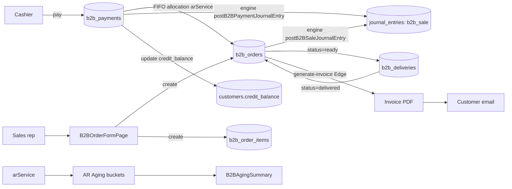

<!-- STALE-V2 -->
> ⚠️ **DOC HISTORIQUE — PÉRIMÉE (V2), NE FAIT PLUS FOI.** Ce fichier décrit en grande partie l'architecture **V2** (mono-app AppGrav, npm/Vercel, PWA/Capacitor, projet Supabase `abjabuniwkqpfsenxljp` = **prod incompatible**, versions RPC obsolètes). **Ne jamais l'appliquer tel quel** (migration, config, archi). Sources de vérité actuelles : `CLAUDE.md` (patterns + workplan) et `docs/workplan/remise-a-plat/` (référence modules réel-vs-demandé). Hiérarchie complète : `docs/README.md`. Régénération depuis le code prévue en Phase 3.

# 09 — B2B / Wholesale

> **Last verified** : 2026-05-13
> **Structure** : ce fichier fusionne la **vue fonctionnelle** (le *pourquoi* et le *quoi* métier) et la **référence technique** (le *comment* implémenté). Pour les tâches à faire, voir [`../../workplan/backlog-by-module/09-b2b-wholesale.md`](../../workplan/backlog-by-module/09-b2b-wholesale.md).
> **Related E2E flows** : [06-b2b-order-to-invoice](../08-flows-end-to-end/06-b2b-order-to-invoice.md).
> **App de rattachement** : Backoffice (le module est exclusivement back-office — toutes les commandes B2B se créent et se pilotent depuis le bureau, distinctement du POS qui gère la vente immédiate au comptoir).

> **En une phrase** : le module B2B est le moteur wholesale de The Breakery — il transforme une boulangerie de comptoir en fournisseur professionnel structuré, suit chaque commande de son brouillon à son paiement intégral, applique automatiquement les prix négociés client par client, et donne au gérant la maîtrise totale de son encours sans transformer la compta en cauchemar — pour qu'aucune commande B2B ne soit ni mal facturée, ni oubliée, ni impayée sans qu'on le sache.

---

## Table des matières

- [Partie I — Vue fonctionnelle](#partie-i--vue-fonctionnelle)
  - [1. Raison d'être](#1-raison-dêtre)
  - [2. Les 6 vues principales du module](#2-les-6-vues-principales-du-module)
  - [3. Les 5 invariants du module](#3-les-5-invariants-du-module)
  - [4. Vue Dashboard B2B — La photo du canal](#4-vue-dashboard-b2b--la-photo-du-canal)
  - [5. Vue Liste des commandes — Le tracker opérationnel](#5-vue-liste-des-commandes--le-tracker-opérationnel)
  - [6. Vue Création / édition commande — Le formulaire central](#6-vue-création--édition-commande--le-formulaire-central)
  - [7. Vue Détail commande — Le pilotage d'une commande](#7-vue-détail-commande--le-pilotage-dune-commande)
  - [8. Status machine — Le cycle de vie d'une commande](#8-status-machine--le-cycle-de-vie-dune-commande)
  - [9. Vue Paiements B2B — Le pilotage du recouvrement](#9-vue-paiements-b2b--le-pilotage-du-recouvrement)
  - [10. Paiement FIFO — La gestion intelligente du multi-encours](#10-paiement-fifo--la-gestion-intelligente-du-multi-encours)
  - [11. Fiche Client B2B — La vue 360° d'une relation](#11-fiche-client-b2b--la-vue-360-dune-relation)
  - [12. Listes de prix B2B — Le pricing négocié](#12-listes-de-prix-b2b--le-pricing-négocié)
  - [13. Facturation B2B — Le document officiel](#13-facturation-b2b--le-document-officiel)
  - [14. Mécaniques transverses — Comment le module dialogue avec le reste](#14-mécaniques-transverses--comment-le-module-dialogue-avec-le-reste)
  - [15. Ce que le module ne fait pas (par design)](#15-ce-que-le-module-ne-fait-pas-par-design)
  - [16. Ce que le module doit (encore) faire — backlog métier](#16-ce-que-le-module-doit-encore-faire--backlog-métier)
- [Partie II — Référence technique](#partie-ii--référence-technique)
  - [17. Vue d'ensemble technique](#17-vue-densemble-technique)
  - [18. State machine commande B2B](#18-state-machine-commande-b2b)
  - [19. Pricing B2B : ordre de priorité](#19-pricing-b2b--ordre-de-priorité)
  - [20. Diagramme de responsabilité](#20-diagramme-de-responsabilité)
  - [21. Tables DB impliquées](#21-tables-db-impliquées)
  - [22. Hooks principaux](#22-hooks-principaux)
  - [23. Services principaux](#23-services-principaux)
  - [24. Composants UI principaux](#24-composants-ui-principaux)
  - [25. Stores Zustand utilisés](#25-stores-zustand-utilisés)
  - [26. RPCs / Edge Functions / Triggers](#26-rpcs--edge-functions--triggers)
  - [27. RLS & Permissions](#27-rls--permissions)
  - [28. Routes](#28-routes)
  - [29. Workflow : allocation FIFO d'un paiement](#29-workflow--allocation-fifo-dun-paiement)
  - [30. Workflow : génération invoice PDF](#30-workflow--génération-invoice-pdf)
  - [31. Flows E2E associés](#31-flows-e2e-associés)
  - [32. Pitfalls spécifiques](#32-pitfalls-spécifiques)
- [Partie III — Backlog opérationnel](#partie-iii--backlog-opérationnel)
- [Partie IV — Design & UX](#partie-iv--design--ux)
  - [33. Thèmes et contextes d'affichage](#33-thèmes-et-contextes-daffichage)
  - [34. Écrans du module (6 vues)](#34-écrans-du-module-6-vues)
  - [35. Layout patterns appliqués](#35-layout-patterns-appliqués)
  - [36. Composants UI signature](#36-composants-ui-signature)
  - [37. États visuels critiques](#37-états-visuels-critiques)
  - [38. Couleurs sémantiques utilisées](#38-couleurs-sémantiques-utilisées)
  - [39. Microcopy et empty states](#39-microcopy-et-empty-states)
  - [40. Références visuelles externes](#40-références-visuelles-externes)
  - [41. À faire côté design (backlog UX)](#41-à-faire-côté-design-backlog-ux)

---

# Partie I — Vue fonctionnelle

## 1. Raison d'être

Le module B2B est le **canal wholesale** de The Breakery. Il répond à une question simple mais stratégique pour une boulangerie qui ne veut pas vivre uniquement de ses tickets de comptoir :

> *"Comment je vends 200 baguettes par semaine à un hôtel, 50 viennoiseries par jour à un café, et 500 cookies en livraison à un événement d'entreprise — avec un prix négocié, une livraison planifiée, une facture officielle et un paiement à 30 jours ?"*

C'est le module qui transforme **un commerçant de quartier en fournisseur** d'hôtels, restaurants, cafés, traiteurs et revendeurs. Sans lui, chaque commande professionnelle se gérait à la main (carnet papier, facture Word, paiement perdu de vue) ; avec lui, chaque relation B2B devient un **flux structuré** : devis → confirmation → préparation → livraison(s) → facturation → encaissement échelonné.

Le module est **complémentaire de la caisse**, pas concurrent. Le POS gère la vente immédiate au comptoir ; le B2B gère la commande différée, livrée et payée plus tard.

---

## 2. Les 6 vues principales du module

| Vue | Job-to-be-done | Route |
|---|---|---|
| **Dashboard B2B** | Vue d'ensemble : top clients, KPI, commandes récentes, aging | `/b2b` |
| **Liste des commandes** | Tracker toutes les commandes B2B avec leur statut | `/b2b/orders` |
| **Création / édition commande** | Formulaire 4 sections : client, items, livraison, notes | `/b2b/orders/new` |
| **Détail commande** | 4 onglets : Items, Deliveries, Payments, History | `/b2b/orders/:id` |
| **Paiements B2B** | 3 onglets : Outstanding, Aging, Received | `/b2b/payments` |
| **Fiche client B2B** | Vue 360° d'un client : commandes, paiements, encours | `/b2b/clients/:id` |

Le tout est complété par la **configuration B2B** (`/settings/b2b`) qui définit les règles transverses (conditions de paiement par défaut, numérotation facture, workflow d'approbation).

---

## 3. Les 5 invariants du module

Quelle que soit la vue consultée, l'utilisateur retrouve toujours les mêmes mécaniques — c'est ce qui rend le module robuste :

1. **Un client B2B est un client de la base partagée**. Pas de doublon avec le module Customers — c'est le flag `customer_type = 'b2b'` qui active la logique wholesale (pricing, crédit, conditions).
2. **Une commande est un cycle complet**. Le module suit la commande de sa création à sa livraison complète et à son paiement intégral — pas juste l'encaissement.
3. **Paiement et livraison sont découplés**. On peut livrer en plusieurs fois, payer en plusieurs fois, et les deux flux sont indépendants. Une facture peut être livrée à 80% et payée à 100% — c'est normal.
4. **Numérotation séquentielle officielle**. Chaque commande et chaque facture ont un numéro séquentiel non réutilisable, pour traçabilité légale.
5. **Tout est tracé dans l'historique commande**. Création, confirmation, modification de quantité, ajout de paiement, génération de facture — chaque événement est daté et signé.

---

## 4. Vue **Dashboard B2B** — La photo du canal

Donner au gérant en charge des B2B une **vue 30 secondes** de son canal wholesale.

### 4.1 KPI principaux

En haut de page, ~6 KPI cards :

- **Total clients B2B** (et actifs).
- **Commandes totales** sur la période.
- **Commandes en cours** (statuts confirmed / processing / ready).
- **Revenu total B2B** sur la période.
- **Encours impayé** (somme des `amount_due` toutes commandes confondues).
- **Aging résumé** (combien de créances dans chaque bucket : courant, 30j, 60j, 90j+).

### 4.2 Top clients B2B

Une grille de cartes des **clients les plus stratégiques** :

- Triés par chiffre d'affaires.
- Chaque carte montre : raison sociale, statut, nombre de commandes, total dépensé, encours impayé.
- Clic → ouvre la fiche client.

### 4.3 Commandes récentes

Les **5 dernières commandes** créées avec : numéro, client, montant, statut, statut paiement, date. Clic → détail commande.

### 4.4 Aging summary visuel

Un mini-graphique répartissant l'encours impayé par tranche d'ancienneté (Courant / 1-30j / 31-60j / 61-90j / 90j+). Permet d'identifier en 5 secondes si le canal B2B a un problème de recouvrement.

Bénéfice métier : **prioriser la journée**. Le gérant voit immédiatement si un client important est en retard de paiement, si une commande importante doit être préparée aujourd'hui, si l'encours global dérape.

---

## 5. Vue **Liste des commandes** — Le tracker opérationnel

Donner à l'équipe **la liste complète** de toutes les commandes B2B, avec ce qu'il faut pour les piloter au quotidien.

### 5.1 Affichage

Chaque ligne : numéro de commande, client, date commande, date de livraison prévue, montant total, statut, statut paiement, montant restant dû.

### 5.2 Filtres

- Par statut (draft, confirmed, processing, ready, partially_delivered, delivered, completed, cancelled).
- Par statut paiement (unpaid, partial, paid).
- Par client.
- Par période (date de commande, date de livraison).
- Par tag (commande prioritaire, événement, récurrente…).

### 5.3 Recherche

Par numéro de commande, nom de client, raison sociale.

### 5.4 Actions

- **Créer une nouvelle commande** (bouton primaire).
- **Cloner une commande existante** (utile pour les commandes récurrentes : "même chose que la semaine dernière").
- **Imprimer** un bon de préparation ou une facture.

Bénéfice métier : **éviter qu'une commande soit oubliée**. Tous les statuts pending sont visibles d'un coup ; chaque commande à livrer demain remonte en haut de la pile.

---

## 6. Vue **Création / édition commande** — Le formulaire central

C'est l'écran le plus utilisé du module. Il est structuré en **4 sections** + **1 sidebar** :

### 6.1 Section Customer

- Sélection du client B2B (autocomplete sur la base partagée, filtré sur `customer_type = 'b2b'`).
- Affichage automatique des **conditions du client** : prix wholesale ou liste de prix dédiée, conditions de paiement (COD / net 7 / 14 / 30 / 60), plafond de crédit, encours actuel.
- Alerte automatique si la commande risque de **dépasser le plafond de crédit** du client.

### 6.2 Section Items

- Ajout de produits ligne par ligne.
- Pour chaque ligne : produit, quantité, prix unitaire (pré-rempli avec le prix wholesale du client), remise éventuelle, total ligne.
- Le prix par défaut respecte la hiérarchie : **liste de prix dédiée du client** > prix wholesale > prix retail.
- Possibilité d'override manuel du prix avec trace dans l'historique.
- Calcul total commande en temps réel (subtotal + tax PB1 10% inclus).

### 6.3 Section Delivery

- Adresse de livraison (par défaut celle du client, modifiable).
- Date et créneau de livraison prévue.
- Mode de livraison (livraison en propre, transporteur, retrait sur place).
- Instructions spéciales (étage, code, contact à prévenir).

### 6.4 Section Notes

- Commentaires internes (vu par le staff).
- Mention sur la facture (vu par le client).
- Tags / étiquettes.

### 6.5 Sidebar — Résumé temps réel

Une colonne fixée à droite qui affiche :

- Sous-total, taxe, total.
- Conditions de paiement appliquées.
- Date d'échéance calculée automatiquement.
- Boutons d'action : "Save as draft", "Confirm order" (passe en statut `confirmed`).

Bénéfice métier : **passer une commande de 30 lignes en 3 minutes** sans risque d'erreur de prix. Le formulaire impose les bonnes données dans le bon ordre, calcule tout en direct, et bloque les commandes au-delà du plafond crédit avant qu'elles ne créent un risque.

---

## 7. Vue **Détail commande** — Le pilotage d'une commande

Une fois la commande créée, son détail s'affiche avec **4 onglets** correspondant aux 4 dimensions d'une commande B2B.

### 7.1 Onglet **Items**

- Récap complet des lignes de la commande.
- Quantités commandées vs livrées (utile pour les livraisons partielles).
- Possibilité d'ajouter / retirer un item tant que la commande n'est pas `delivered` (avec PIN manager si déjà confirmée).
- Bouton "Imprimer bon de préparation" pour la cuisine / le pâtissier.

### 7.2 Onglet **Deliveries**

- Liste des livraisons effectuées pour cette commande.
- Pour chaque livraison : date, items livrés, quantités, statut.
- Bouton "Enregistrer une livraison" — saisir les items réellement remis avec leur quantité.
- Lors d'une livraison, le stock est automatiquement déduit (flag `stock_deducted`).
- Une commande passe à `partially_delivered` après la première livraison incomplète, à `delivered` quand tout est sorti.

### 7.3 Onglet **Payments**

- Liste des paiements reçus pour cette commande.
- Pour chaque paiement : date, méthode (cash, bank transfer, card), montant, numéro de paiement.
- Bouton "Enregistrer un paiement" — saisir un nouveau versement.
- Une commande passe à `partial` après le premier paiement incomplet, à `paid` quand `amount_due = 0`.
- Possibilité de saisir un paiement **FIFO** (mode dédié) qui s'applique automatiquement aux plus vieilles commandes du client.

### 7.4 Onglet **History**

- Journal immuable de tous les événements de la commande.
- Chaque ligne : timestamp, utilisateur, type d'événement (created, confirmed, item_added, item_removed, delivery_recorded, payment_received, invoice_generated, status_changed, cancelled), description.
- Toujours visible, jamais éditable.

Bénéfice métier : **tout savoir d'une commande en un seul écran**, sans avoir à fouiller dans des tableaux séparés. Pour un litige client ("vous m'avez livré quoi le 12 ?", "j'ai bien réglé le 25 ?"), la réponse est dans les onglets en 10 secondes.

---

## 8. Status machine — Le cycle de vie d'une commande

Une commande B2B traverse une **séquence d'états** définie et tracée :

```
draft → confirmed → processing → ready → partially_delivered → delivered → completed
   ↓
cancelled
```

| Statut | Signification métier | Qui peut changer |
|---|---|---|
| **draft** | Brouillon — modifiable librement, pas encore engagée | Auteur |
| **confirmed** | Engagée client — bloque les prix, alerte l'équipe | Manager / sales |
| **processing** | En préparation cuisine / pâtisserie | Staff cuisine |
| **ready** | Prête à être livrée / retirée | Staff cuisine |
| **partially_delivered** | Au moins une livraison effectuée, reste à livrer | Auto (livraison enregistrée) |
| **delivered** | Tous les items livrés | Auto (dernière livraison) |
| **completed** | Livrée ET intégralement payée | Auto (dernier paiement) |
| **cancelled** | Annulée — items retirés du stock si déjà déduit | Manager (PIN) |

Bénéfice métier : **chaque commande sait où elle est** dans son cycle, sans qu'on doive le chercher. Le staff cuisine ne voit que les commandes `confirmed` ou `processing` ; la compta ne voit que les commandes `delivered` non `completed`.

---

## 9. Vue **Paiements B2B** — Le pilotage du recouvrement

Cette page est l'outil **du gérant ou du comptable** qui veille à l'encaissement. Elle est structurée en **3 onglets** :

### 9.1 Onglet **Outstanding** — Les impayés courants

- Liste de toutes les commandes avec `amount_due > 0`.
- Par client : nom, raison sociale, nombre de commandes ouvertes, montant total dû.
- Indicateur de retard : OK (avant échéance), à risque (échéance dans 7j), en retard (passée).
- Action rapide : "Enregistrer un paiement" (peut s'appliquer en FIFO sur les plus vieilles factures).
- Action rapide : "Envoyer relance" (génère un PDF ou un message).

### 9.2 Onglet **Aging** — Le vieillissement des créances

- Tableau avec une ligne par client B2B en encours.
- Pour chaque client : montant courant, montant 1-30j, 31-60j, 61-90j, 90j+, total.
- Trié par retard (plus vieux en haut).
- Export CSV / PDF.

Bénéfice : **identifier les clients toxiques** dont la créance dérape avant qu'elle ne devienne irrécouvrable.

### 9.3 Onglet **Received** — Les paiements encaissés

- Journal des paiements B2B sur la période.
- Filtre par client, par méthode, par période.
- Récap : total encaissé, répartition par méthode, par jour.
- Réconciliation : croiser avec les relevés bancaires.

Bénéfice métier : **arrêter de courir après l'argent à l'aveugle**. Le module sait toujours qui doit quoi, depuis quand, et prioritise les relances par âge et par enjeu.

---

## 10. Paiement **FIFO** — La gestion intelligente du multi-encours

Spécificité métier B2B : un même client peut avoir **plusieurs commandes impayées simultanément**. Quand il envoie un virement de 5M IDR, comment savoir à quelle facture l'imputer ?

Le module propose un **mode FIFO** (First In First Out) :

- Le paiement reçu s'applique automatiquement à la **plus vieille facture impayée** du client.
- Une fois cette facture soldée, le reste s'applique à la suivante, etc.
- Affichage en direct de la répartition avant validation.
- Possibilité de **forcer une imputation manuelle** (le client demande "imputez ce paiement à la facture INV-2024-0156") avec trace dans l'historique.

Bénéfice métier : **automatiser le travail comptable** sans renoncer au contrôle. 90 % des paiements suivent la logique FIFO ; les 10 % spécifiques sont traités à la main mais tracés.

---

## 11. Fiche **Client B2B** — La vue 360° d'une relation

La fiche client B2B est la **vue d'ensemble d'une relation** dans le temps. Accessible via le top clients du dashboard ou via le module Customers.

Elle affiche :

- **Identité** : raison sociale, NPWP, contact référent, adresse, conditions.
- **Conditions appliquées** : plafond de crédit, conditions de paiement, liste de prix dédiée si applicable.
- **KPI** : nombre total de commandes, chiffre d'affaires cumulé, encours actuel, panier moyen, fréquence d'achat.
- **Toutes les commandes** chronologiquement, avec accès rapide au détail.
- **Tous les paiements** chronologiquement.
- **Aging spécifique** au client (combien dans chaque bucket).
- **Historique d'événements** (création compte, changement de conditions, blocage temporaire, alertes).

Bénéfice métier : **préparer un rendez-vous client en 1 minute**. Avant d'appeler un hôtel pour discuter d'un retard de paiement, le gérant a sous les yeux tout l'historique : commandes, encours, antériorité, fréquence — il négocie en position de force.

---

## 12. Listes de prix B2B — Le pricing négocié

Tous les clients B2B ne paient pas la même chose. Le module supporte **trois niveaux de pricing** :

1. **Prix retail** — Le tarif par défaut (utilisé si rien d'autre n'est défini).
2. **Prix wholesale** — Tarif générique B2B (défini sur la fiche produit).
3. **Liste de prix dédiée** — Tarif négocié spécifiquement avec un client (table `b2b_price_lists`).

Une liste de prix dédiée permet de :

- Donner un prix sur-mesure à chaque produit pour un client donné.
- Limiter dans le temps (date de début / fin).
- Cloner d'un client à un autre (utile pour une chaîne d'hôtels).
- Versionner (les anciennes commandes gardent leur prix d'origine).

Bénéfice métier : **honorer les négociations commerciales sans tout coder à la main**. Quand un hôtel signe pour 2 ans à -15%, on crée une liste de prix dédiée et toutes ses commandes appliquent automatiquement le bon tarif.

---

## 13. Facturation B2B — Le document officiel

Chaque commande B2B confirmée peut générer une **facture officielle** :

- **Numérotation séquentielle** non réutilisable (préfixe + année + séquence, configurable dans Settings).
- **Mentions légales** complètes : raison sociale, NPWP de The Breakery, NPWP du client, conditions de paiement, date d'échéance, taxe PB1 détaillée.
- **PDF généré** via l'Edge Function `generate-invoice`, archivé dans Supabase Storage.
- **Téléchargeable** depuis le détail commande ou la liste des commandes.
- **Envoi par e-mail** au client (configurable, utilise `send-test-email` côté serveur).

Bénéfice métier : **un document standardisé, légal et infalsifiable** sortant en 2 secondes, sans risque d'erreur de calcul ou d'oubli de mention.

---

## 14. Mécaniques transverses — Comment le module dialogue avec le reste

### 14.1 Avec Customers

Le client B2B est un enregistrement de la table `customers` avec `customer_type = 'b2b'`. La création / édition de la fiche client passe par le module Customers ; le module B2B n'y touche pas directement.

### 14.2 Avec Inventory

À chaque livraison enregistrée, le module B2B **déduit le stock** des items livrés via les mouvements de stock standards. Pas de double comptage : le `stock_deducted` flag verrouille l'opération.

### 14.3 Avec Accounting

Une commande B2B `delivered` génère automatiquement les écritures comptables (revenu + taxe collectée + créance client). Un paiement reçu génère les écritures de règlement (encaissement + diminution créance). Tout passe par les triggers Postgres du module Accounting.

### 14.4 Avec Reports

Le module alimente plusieurs reports dédiés : **B2B Receivables Aging**, **Sales By Customer** (croisé avec retail), **B2B Self-Approval Risk** (audit fraude — voir module Reports section Logs & Audit).

### 14.5 Avec Settings

Les valeurs par défaut (conditions de paiement, numérotation facture, plafond crédit générique, template facture) sont définies dans `/settings/b2b`. Le module les lit, ne les écrit jamais.

---

## 15. Ce que le module ne fait **pas** (par design)

- Le module **ne crée pas de fiches clients B2B**. Cette opération est dans le module Customers (avec activation du flag `customer_type = 'b2b'`).
- Le module **ne gère pas le catalogue produit**. Pas d'ajout / modification produit ici — uniquement leur pricing dédié via les listes de prix.
- Le module **ne fait pas le suivi de la production**. Si un client commande 200 baguettes, c'est au module Production de planifier le pétrissage — le B2B ne fait que demander.
- Le module **n'envoie pas automatiquement de relances**. La détection des retards est faite (page Outstanding), mais l'envoi reste à initier manuellement par l'utilisateur.
- Le module **ne gère pas les contrats de récurrence**. Une commande hebdomadaire d'hôtel reste à ressaisir (ou cloner) chaque semaine ; pas encore d'abonnement B2B.

---

## 16. Ce que le module doit (encore) faire — backlog métier

| Priorité | Évolution | Bénéfice attendu |
|---|---|---|
| 🔴 | **Auto-approval workflow** | Workflow visuel : commande > X IDR exige validation manager ; commande hors plafond crédit exige validation owner. Aujourd'hui contrôlé en code, à externaliser. |
| 🔴 | **Détection self-approval** | Empêcher qu'un commercial crée et approuve sa propre commande (signal de fraude). Cf. report `b2b_self_approval_risk`. |
| 🟠 | **Commandes récurrentes / abonnements** | Définir une commande type qui se duplique automatiquement chaque lundi pour un hôtel. |
| 🟠 | **Relances automatiques** | Envoi automatique d'un rappel à J-3 de l'échéance, J+0, J+7, J+15. |
| 🟠 | **Devis (quote) avant commande** | Étape `quote` en amont de `draft` — envoyer un PDF de devis, le client confirme par retour. |
| 🟡 | **Avoirs / credit notes** | Générer une note de crédit officielle pour un retour client ou une casse à la livraison. |
| 🟡 | **Multi-livraisons planifiées d'avance** | Planifier une commande 500 baguettes en 5 livraisons sur la semaine, dès la confirmation. |
| 🟡 | **Portal client B2B** | Donner un accès web au client pour consulter ses commandes / factures / encours en self-service. |
| 🟢 | **Tarification par volume** | Prix dégressif automatique selon quantité commandée (baguettes < 50 = prix A, ≥ 50 = prix B). |
| 🟢 | **Intégration comptable export** | Export direct des factures dans le format attendu par le comptable externe (Accurate, MYOB). |

---

# Partie II — Référence technique

## 17. Vue d'ensemble technique

Le module B2B gère le cycle complet des commandes wholesale : création, livraison, facturation
PDF (jsPDF via Edge Function), paiements multi-méthode avec allocation FIFO, suivi des créances
(AR aging par buckets 0-30 / 31-60 / 61-90 / 90+), et invoicing automatique. Il s'appuie sur
`customers.customer_type='b2b'` (cf. module 08) et utilise le pricing wholesale ou des
`b2b_price_lists` dédiées. Le module produit deux types de Journal Entries via l'engine :
JE `b2b_sale` à la confirmation et JE `b2b_payment` à la réception du paiement.

---

## 18. State machine commande B2B

```
draft ─▶ confirmed ─▶ processing ─▶ ready ─▶ partially_delivered ─▶ delivered ─▶ completed
  │
  └─▶ cancelled
```

Transitions clés et déclencheurs :
- **`draft → confirmed`** : `postB2BSaleJournalEntry` génère le JE comptable.
- **`processing → ready` ou `ready → delivered`** : trigger `deduct_b2b_stock`
  matérialise les `stock_movements` `sale_b2b` (idempotent via flag `stock_deducted`).
- **`delivered → completed`** : marque la commande comme finalisée (peut déclencher email satisfaction).
- **`* → cancelled`** : annulation manuelle, requiert raison loggée dans `b2b_order_history`.
  Si stock déjà déduit, mouvement compensatoire `adjustment_in` à créer manuellement.

---

## 19. Pricing B2B : ordre de priorité

Quand `useB2BOrderForm` calcule le prix d'un produit pour un client B2B, il applique
l'ordre suivant :

1. **`b2b_price_list_items`** — si le client est rattaché à une `b2b_price_lists` active
   ET le produit y est listé.
2. **`customer_categories.price_modifier_type='wholesale'`** — utilise `product.wholesale_price`
   (la catégorie B2B par défaut a typiquement ce modifier).
3. **`product.wholesale_price`** direct — fallback si la catégorie est `custom` mais aucun
   prix custom n'existe.
4. **`product.retail_price`** — fallback final.

L'agent saisit en général le prix manuellement (override possible) — le système ne fait
que pré-remplir.

---

## 20. Diagramme de responsabilité



---

## 21. Tables DB impliquées

| Table | Rôle |
|---|---|
| `b2b_orders` | En-tête commande B2B (`order_number` `B2B-NNNNN-XXX`, `status`, `order_date`, `delivery_date`, `total`, `paid_amount`, `amount_due` calculé, `payment_status`, `stock_deducted`, `invoice_number`, `notes`) |
| `b2b_order_items` | Lignes commande (`product_id`, `product_name` figé, `quantity`, `unit_price` figé au moment commande, `total`) |
| `b2b_payments` | Paiements (`payment_number`, `payment_method`: cash/transfer/qris/edc/credit, `amount`, `status`) — un paiement peut couvrir plusieurs orders via FIFO |
| `b2b_deliveries` | Livraisons (`delivery_status`: pending/scheduled/in_transit/delivered/failed/cancelled, `delivery_date`, `driver`, `vehicle`) |
| `b2b_order_history` | Journal d'activité immutable (created, status_changed, payment_received, delivered, cancelled) |
| `b2b_price_lists` | Listes de prix nommées (ex: "Hotel Senggigi 2026") liées à des customers B2B |
| `b2b_price_list_items` | Prix produits dans une liste (`product_id`, `unit_price`) — priorité sur `wholesale_price` |
| `customers` (col `credit_balance`, `credit_limit`, `credit_status`) | État crédit fournisseur (cf. module 08) |

### Views

| View | Rôle |
|---|---|
| `v_b2b_orders` | B2B orders sans soft-deleted |
| `view_ar_aging` | Rapport aging avec buckets 0-30 / 31-60 / 61-90 / 90+ |
| `view_b2b_receivables` | Résumé créances par client |
| `view_b2b_performance` | Métriques performance clients B2B (CA, fréquence, LTV) |

---

## 22. Hooks principaux

| Hook | Chemin | Rôle |
|---|---|---|
| `useB2BOrderForm` | `src/hooks/b2b/useB2BOrderForm.ts` | State form + validation + mutations create/update commande B2B |
| `useB2BOrderDetail` | `src/pages/b2b/useB2BOrderDetail.ts` | Détail commande + items + payments + deliveries + history (jointure complète) |

Le module B2B a relativement peu de hooks dédiés — beaucoup de logique vit dans les services et les composants page-level (`src/pages/b2b/`).

---

## 23. Services principaux

| Service | Chemin | Rôle |
|---|---|---|
| `arService.ts` | `src/services/b2b/arService.ts` | `getOutstandingOrders`, `getAgingReport` (buckets 0-30 / 31-60 / 61-90 / 90+), allocation FIFO de paiement (`allocateFIFO`), export CSV aging |
| `creditService.ts` | `src/services/b2b/creditService.ts` | `getCustomerCredit`, `updateCustomerCreditTerms`, `addToCustomerBalance` (incrément `credit_balance`), `subtractFromCustomerBalance`, `getOverdueInvoices` |
| `b2bPosOrderService.ts` | `src/services/b2b/b2bPosOrderService.ts` | Bridge POS → B2B : convertit une vente POS payée en `store_credit` en commande B2B + JE B2B sale + update credit balance. Évite double-counting via `posOrderId` |

---

## 24. Composants UI principaux

Le module B2B a 37 fichiers dans `src/pages/b2b/` (pas de répertoire `src/components/b2b/` — les pages sont auto-suffisantes). Les composants principaux :

| Composant | Chemin | Rôle |
|---|---|---|
| `B2BHeader` | `src/pages/b2b/B2BHeader.tsx` | Header avec navigation onglets + KPIs |
| `B2BStats` | `src/pages/b2b/B2BStats.tsx` | KPIs dashboard (total CA, outstanding, overdue, top clients) |
| `B2BKpiCard` | `src/pages/b2b/B2BKpiCard.tsx` | Card metric réutilisable |
| `B2BQuickActions` | `src/pages/b2b/B2BQuickActions.tsx` | Boutons rapides (new order, new payment, view aging) |
| `B2BRecentOrders` | `src/pages/b2b/B2BRecentOrders.tsx` | Liste 10 dernières commandes |
| `B2BDashboardClientCard` | `src/pages/b2b/B2BDashboardClientCard.tsx` | Card client (CA, outstanding, last order) |
| `B2BClientsList` | `src/pages/b2b/B2BClientsList.tsx` | Liste clients B2B avec filtres |
| `B2BClientDetailPage` | `src/pages/b2b/B2BClientDetailPage.tsx` | Détail client B2B avec onglets |
| `B2BOrderFormPage` | `src/pages/b2b/B2BOrderFormPage.tsx` | Page formulaire commande (orchestre `B2BOrderFormCustomer`, `B2BOrderFormItems`, `B2BOrderFormDelivery`, `B2BOrderFormNotes`, `B2BOrderFormSidebar`) |
| `B2BOrderDetailPage` | `src/pages/b2b/B2BOrderDetailPage.tsx` | Détail commande avec tabs (`B2BOrderItemsTab`, `B2BOrderDeliveriesTab`, `B2BOrderPaymentsTab`, `B2BOrderHistoryTab`) |
| `B2BOrderInfoCards` | `src/pages/b2b/B2BOrderInfoCards.tsx` | Cards info commande (statut, dates, totaux, payment status) |
| `B2BOrderSummary` | `src/pages/b2b/B2BOrderSummary.tsx` | Sidebar récapitulatif commande |
| `B2BDetailOrderRow` | `src/pages/b2b/B2BDetailOrderRow.tsx` | Ligne item dans détail commande |
| `B2BDetailSidePanels` | `src/pages/b2b/B2BDetailSidePanels.tsx` | Side-panels (timeline, contact, actions) |
| `B2BPaymentModal` | `src/pages/b2b/B2BPaymentModal.tsx` | Modal saisie paiement (montant, méthode, allocation simple) |
| `B2BFIFOPaymentModal` | `src/pages/b2b/B2BFIFOPaymentModal.tsx` | Modal paiement avec allocation FIFO automatique sur plusieurs orders |
| `B2BPaymentsPage` | `src/pages/b2b/B2BPaymentsPage.tsx` | Page paiements avec onglets (`B2BPaymentsAgingTab`, `B2BPaymentsOutstandingTab`, `B2BPaymentsReceivedTab`) |
| `B2BAgingSummary` | `src/pages/b2b/B2BAgingSummary.tsx` | Tableau AR aging par bucket avec drill-down |
| `b2bOrderPrint.ts` | `src/pages/b2b/b2bOrderPrint.ts` | Helper print receipt B2B (impression locale 80mm) |

---

## 25. Stores Zustand utilisés

- `useAuthStore` — `user.id` pour `created_by`, `confirmed_by`, audit history.
- `useCartStore` — quand bridge POS → B2B (paiement `store_credit`), stocke le customer + items pour passage à `b2bPosOrderService.createB2BOrderFromPOS`.
- `useCoreSettingsStore` — `b2b_config.default_payment_terms` (défaut net_30), `b2b_config.invoice_prefix` (défaut INV), `b2b_config.aging_buckets` (configurable).

Pas de store dédié b2b — react-query gère tout (stale 30s).

---

## 26. RPCs / Edge Functions / Triggers

### Edge Functions

| Function | Rôle |
|---|---|
| `generate-invoice` | Génère un PDF invoice via jsPDF (pdf header + table autotable + totaux + footer NPWP). Stocke dans Supabase Storage `invoices/`. Retourne signed URL. Accepte body `{ orderId, customerId, includeQR }`. `verify_jwt: true`, check `sales.view`. |

### Wrappers `accountingEngine` utilisés par B2B

| Wrapper | Rôle | JE produit |
|---|---|---|
| `postB2BSaleJournalEntry` | À création b2b_orders confirmé | Dr `SALE_RECEIVABLE` (total) / Cr `SALE_B2B_REVENUE` (net) + Cr `SALE_PB1_TAX` (tax) |
| `postB2BPaymentJournalEntry` | À insertion b2b_payments | Dr `SALE_CASH_IN` ou `SALE_BANK_IN` / Cr `SALE_RECEIVABLE` |

### Triggers SQL

| Trigger | Rôle |
|---|---|
| `update_b2b_payment_status` | Recalcule `b2b_orders.payment_status` à chaque insertion `b2b_payments` (unpaid → partial → paid) |
| `recalc_b2b_amount_due` | Recalcule `amount_due = total - paid_amount` |
| `log_b2b_history_on_status_change` | Insère dans `b2b_order_history` à chaque transition |
| `deduct_b2b_stock` | Quand `b2b_orders.status` passe à `ready` ou `delivered` ET `stock_deducted=false` → crée stock_movements `sale_b2b` puis met `stock_deducted=true` (idempotent) |

---

## 27. RLS & Permissions

| Table | Action | Permission |
|---|---|---|
| `b2b_orders`, `b2b_order_items`, `b2b_payments`, `b2b_deliveries`, `b2b_price_lists`, `b2b_price_list_items` | SELECT | `is_authenticated()` |
| `b2b_orders` | INSERT | `sales.create` |
| `b2b_orders` | UPDATE | `sales.update` ou `sales.create` (transitions de status) |
| `b2b_payments` | INSERT | `sales.create` |
| `b2b_deliveries` | INSERT/UPDATE | `sales.update` |
| `b2b_price_lists` | INSERT/UPDATE/DELETE | `products.pricing` |
| `b2b_order_history` | INSERT | trigger only / SELECT auth | UPDATE/DELETE | aucune |

---

## 28. Routes

```
/b2b                           — B2BPage (dashboard avec stats + recent orders + clients cards)
/b2b/orders                    — B2BOrdersPage (liste + filtres)
/b2b/orders/new                — B2BOrderFormPage (création)
/b2b/orders/:id                — B2BOrderDetailPage (détail avec tabs)
/b2b/orders/:id/edit           — B2BOrderFormPage (édition)
/b2b/payments                  — B2BPaymentsPage (avec tabs aging / outstanding / received)
/b2b/clients/:id               — B2BClientDetailPage
```

Toutes les routes sont gardées par `RouteGuard permission="sales.view"` (ou `.create`) + `ModuleErrorBoundary moduleName="B2B"`.

---

## 29. Workflow : allocation FIFO d'un paiement

L'allocation FIFO permet d'appliquer un paiement reçu sur plusieurs commandes B2B
outstanding du même client, en commençant par la plus ancienne.

1. Modal `B2BFIFOPaymentModal` ouvert depuis le client ou depuis la liste paiements.
2. Sélection client + saisie montant total reçu + méthode + date.
3. `arService.getOutstandingOrders(customerId)` retourne les commandes non-payées
   triées `order_date ASC`.
4. `arService.allocateFIFO(amount, outstandingOrders)` parcourt la liste :
   - Pour chaque order, calcule `allocatable = min(amount_remaining, order.amount_due)`.
   - Allouer `allocatable` à l'order (insert dans une table d'allocation OU update
     `paid_amount` directement avec link `payment_id`).
   - Si `amount_remaining` > 0 et plus d'orders : reste excédentaire → crédit client
     (incrément `customers.credit_balance` négatif = avoir).
5. Pour CHAQUE allocation, insert un `b2b_payments` (ou un single `b2b_payments` avec
   métadonnées `allocations` JSON selon implementation).
6. Trigger `update_b2b_payment_status` recalcule `payment_status` de chaque order touchée.
7. Wrapper `postB2BPaymentJournalEntry` génère un JE total pour le paiement reçu.

---

## 30. Workflow : génération invoice PDF

1. Bouton "Generate Invoice" sur `B2BOrderDetailPage` (visible si status >= `ready`).
2. Appel Edge Function `generate-invoice` avec `{ orderId, customerId, includeQR }`.
3. Edge Function (Deno) :
   - Vérifie JWT + permission `sales.view`.
   - Fetch order + items + customer + business settings (logo, NPWP, address).
   - Construit PDF via jsPDF (header logo + adresse, table autotable items, totaux, footer).
   - Si `includeQR=true` : ajoute QR code de validation (lien vers détail public read-only).
   - Upload dans bucket Supabase Storage `invoices/`.
   - Génère signed URL (TTL 1h) + persiste dans `b2b_orders.invoice_url` + `invoice_number`.
4. UI redirige vers le PDF ou propose download.

---

## 31. Flows E2E associés

- **06 — B2B Order to Invoice** : sélection client B2B → création commande → confirmation (status `confirmed`, déclenche JE `b2b_sale`) → préparation (`processing` → `ready`) → déduction stock automatique via trigger `deduct_b2b_stock` → livraison (`delivered`) → génération invoice PDF via Edge Function → envoi email → réception paiement (`B2BFIFOPaymentModal` allocation FIFO) → JE payment → update `credit_balance` customer.

---

## 32. Pitfalls spécifiques

- **State machine B2B large** : 8 statuses (draft, confirmed, processing, ready, partially_delivered, delivered, completed, cancelled) — pas de helper centralisé `getValidTransitions` côté client (contrairement à PO). Risque d'incohérence : valider via tests E2E.
- **`stock_deducted` flag idempotency** : le trigger `deduct_b2b_stock` ne déduit qu'une seule fois grâce à ce flag. Si on annule une commande après deduction, il faut RE-créer un mouvement compensatoire `adjustment_in` manuellement (pas de rollback auto).
- **FIFO allocation côté CLIENT** : l'allocation se fait dans `arService.allocateFIFO` JS, pas en SQL. Si deux paiements sont saisis simultanément sur le même client, race condition possible — utiliser optimistic lock (`.eq('paid_amount', currentPaidAmount)`) avant l'update.
- **Pricing B2B priorité** : `b2b_price_list_items` → `customers.category.price_modifier_type='wholesale'` (`wholesale_price`) → `retail_price` (fallback). Le hook `useB2BOrderForm` doit checker dans cet ordre.
- **`amount_due` est calculé** dans le trigger `recalc_b2b_amount_due` — ne JAMAIS le set manuellement au INSERT/UPDATE. Le passer en `null` ou laisser le default.
- **Invoice PDF stocké dans Storage `invoices/`** : le signed URL expire (TTL configurable, défaut 1h). Pour archivage long terme, persister `invoice_url` dans `b2b_orders.invoice_url` AVEC date d'expiration ou utiliser un signed URL ré-généré à la demande.
- **Bridge POS → B2B** : quand un client paie en `store_credit` au POS, `b2bPosOrderService.createB2BOrderFromPOS` crée une commande B2B avec `posOrderId` lié — IMPORTANT : les rapports doivent dédupliquer (pas double-compter le CA POS + B2B sur la même vente). Filtre standard : `WHERE posOrderId IS NULL` pour les rapports B2B purs.
- **`credit_balance` ≠ AR aging** : `credit_balance` est consolidé live, AR aging recalcule à partir des `b2b_orders.amount_due`. Les deux doivent matcher — si discrepance, le job d'audit (`/accounting-audit`) la détecte.
- **Edge Function `generate-invoice`** doit avoir `verify_jwt: true` ET vérifier que `auth.uid()` a le droit `sales.view` AVANT de générer (sinon fuite d'invoices).
- **`b2b_order_history` est append-only** — ne pas patcher rétroactivement, créer une nouvelle ligne (`type='correction'`).
- **Customer en `credit_status='suspended'`** : doit BLOQUER la création d'une nouvelle b2b_order. La validation se fait dans `useB2BOrderForm` (pas en trigger SQL — à durcir).
- **`order_number` racy** : la fonction `getNextOrderNumber` (cf. `b2bPosOrderService.ts`) lit le dernier B2B order, incrémente, suffixe random `XXX` 3 chars uppercase. Le suffix random réduit le risque de collision entre terminaux concurrent mais ne le supprime pas — ajouter `UNIQUE` constraint sur `order_number` (déjà fait) garantit qu'au pire, l'INSERT échoue et l'utilisateur retry.
- **Pricing au moment de la commande figé** : `b2b_order_items.unit_price` est un snapshot — un changement ultérieur de `wholesale_price` ne se répercute PAS sur les commandes existantes (souhaitable pour traçabilité légale).
- **`b2b_price_lists` versioning** : pas de versioning natif. Pour mémoriser un prix historique appliqué pendant une période, dupliquer la liste avec date de validité dans le nom (ex: "Hotel X 2026-Q1"). À industrialiser en V3.
- **Multi-deliveries par order** : une commande peut être splittée en plusieurs `b2b_deliveries` (livraisons partielles). Le composant `B2BOrderDeliveriesTab` doit gérer les status `partially_delivered` correctement et update `b2b_orders.delivery_date` à la dernière livraison effectuée.
- **AR aging buckets configurables** : par défaut 0-30 / 31-60 / 61-90 / 90+. Modifier dans `arService.AGING_BUCKETS` constant. À terme, lire depuis `useCoreSettingsStore.b2b_config.aging_buckets`.
- **Allocation FIFO peut "oublier" un client** : si l'ordre des outstanding orders n'est pas strict (ex: deux orders même date), le tri secondaire par `created_at` doit être garanti. Bug observé en prod si deux commandes même `order_date` — toujours grouper par customer_id puis trier `order_date ASC, created_at ASC`.
- **Edge `generate-invoice` lent** : génération PDF jsPDF + upload Storage = ~3-5s. UX : afficher un spinner explicite. Pour batch (100+ invoices), passer par un job background plutôt qu'appel direct.
- **Email envoi externe** : actuellement pas d'intégration native — l'invoice URL est copiée et envoyée manuellement. Edge `send-test-email` est utilisée pour les tests SMTP — pour automatiser, créer une nouvelle Edge `send-invoice-email` qui consomme le signed URL.
- **Synchronization stock B2B vs POS** : un produit vendu en POS et réservé pour B2B simultanément peut générer un négatif transitoire. `stock_reservations` aide mais n'est PAS bloquant côté POS — le caissier peut quand même vendre. Le KDS / display peut alerter "stock insuffisant" si la qty descend sous 0.
- **Bridge POS → B2B et reporting** : dans `b2bPosOrderService.createB2BOrderFromPOS`, le `posOrderId` est crucial pour éviter de double-compter le CA dans les rapports (le POS rapport l'a déjà comptée comme retail, le B2B l'a comme B2B). Filter strict `posOrderId IS NULL` pour rapports B2B "nouveaux" et `posOrderId IS NOT NULL` pour rapports "POS to B2B credit conversion".
- **Pas de notification fournisseur** : aucune intégration native pour alerter le fournisseur ou la cuisine quand une commande B2B passe en `processing` ou `ready`. Workaround : print receipt B2B via `b2bOrderPrint.ts` ou intégrer Slack / WhatsApp via webhook custom.

---

# Partie III — Backlog opérationnel

Pour les tâches techniques à exécuter (workflow d'approbation, détection self-approval, commandes récurrentes, relances auto, devis avant commande, avoirs/credit notes, multi-livraisons planifiées, portal client B2B, tarification par volume, helper centralisé state machine, durcissement suspended check en trigger, envoi email natif), voir :

→ [`../../workplan/backlog-by-module/09-b2b-wholesale.md`](../../workplan/backlog-by-module/09-b2b-wholesale.md)

Tâches priorisées P0–P3 avec critères d'acceptation, dépendances, estimations et risques identifiés.

---

# Partie IV — Design & UX

> **Source canonique** : [`../../DESIGN_POS_AND_BACKOFFICE.md`](../../DESIGN_POS_AND_BACKOFFICE.md) (design détaillé des deux apps).
> **Tokens techniques** : [`../../../DESIGN.md`](../../../DESIGN.md) (variables CSS, scales, classes Tailwind).
> **Screenshots de référence** : [`../../ux/assets/screens/`](../../ux/assets/screens/) — source de vérité visuelle.
> **Design system global** : [`../02-design-system/`](../02-design-system/) (7 fichiers : Luxe Dark, tokens, shadcn, layouts, responsive).

## 33. Thèmes et contextes d'affichage

Le module B2B est **exclusivement Backoffice** — toutes les commandes wholesale se créent et se pilotent depuis le bureau (formulaire long, tables denses, factures PDF, aging reports). Un seul thème s'applique :

| Contexte | Thème CSS | Pages concernées | Identité |
|---|---|---|---|
| **Backoffice principal** | `.theme-backoffice` (ivoire `#F8F8F6`) | `/b2b/*` (7 routes) | Salle de commandement claire, dense, multi-tabs — dashboard, listes, formulaires longs, fiches client 360°, modales paiement FIFO |

**Variante B2B gold-accent** : la maquette V3 prévoit une accentuation gold plus prononcée sur les pages B2B (la marge wholesale est plus stratégique que le ticket de comptoir, le visuel le reflète). Voir [`../../DESIGN_POS_AND_BACKOFFICE.md`](../../DESIGN_POS_AND_BACKOFFICE.md) §12.2.

**Constante de marque** : l'or `#C9A55C` ressort sur les CTA primaires (Confirm order, Record payment, Generate invoice), les totaux de commande, les status badges `paid` / `completed`, les top clients du dashboard.

---

## 34. Écrans du module (6 vues)

| Route | Type d'écran | Densité | Composants signature |
|---|---|---|---|
| `/b2b` (Dashboard) | Dashboard agrégé KPI + cards | Haute | `B2BStats`, `B2BKpiCard` × 6, `B2BDashboardClientCard` grid, `B2BRecentOrders`, `B2BAgingSummary` mini |
| `/b2b/orders` (Liste) | Liste paginée + filtres | Haute | StatusBadge multi-état (8 status), payment_status badge, action menu kebab, FilterBar |
| `/b2b/orders/new` (Création) | Formulaire long 4 sections + sidebar | Très haute | `B2BOrderFormCustomer`, `B2BOrderFormItems`, `B2BOrderFormDelivery`, `B2BOrderFormNotes`, `B2BOrderFormSidebar` |
| `/b2b/orders/:id` (Détail) | Détail + 4 onglets + sidebar | Maximale | `B2BOrderInfoCards`, tabs (`B2BOrderItemsTab`, `B2BOrderDeliveriesTab`, `B2BOrderPaymentsTab`, `B2BOrderHistoryTab`), `B2BOrderSummary` sidebar |
| `/b2b/orders/:id/edit` (Édition) | Idem /new pre-filled | Très haute | Idem `/new` avec PIN manager si déjà confirmed |
| `/b2b/payments` (Paiements) | Page 3 onglets (Outstanding / Aging / Received) | Très haute | `B2BPaymentsOutstandingTab`, `B2BPaymentsAgingTab`, `B2BPaymentsReceivedTab`, `B2BFIFOPaymentModal` |
| `/b2b/clients/:id` (Fiche 360°) | Détail client + onglets | Très haute | `B2BClientDetailPage` avec identité, KPIs, all orders, all payments, aging |

---

## 35. Layout patterns appliqués

### 35.1 Dashboard B2B (`/b2b`)

Pattern dashboard-like (cf. §4.2 du design doc) avec touch wholesale :

1. **Header de page** : titre "B2B Wholesale" + sous-titre période + actions à droite (DateRangePicker, "+ New order").
2. **Rangée KPI cards** (6 cards uniformes) — `B2BKpiCard` : Total clients, Orders count, In progress, Revenue, Outstanding (montant `Rp` en gold gros), Overdue (rouge si > 0).
3. **Top Clients grid** : 4-6 `B2BDashboardClientCard` triés par CA — chaque card : raison sociale Playfair, badges statut, KPIs inline (orders, spent, due), clic = fiche client.
4. **Recent orders table** : `B2BRecentOrders` — table dense 10 dernières commandes.
5. **Aging summary visuel** : `B2BAgingSummary` mini — barres horizontales par bucket avec colors (vert courant, jaune 1-30j, orange 31-60j, rouge 61j+).

### 35.2 Liste commandes (`/b2b/orders`)

Pattern liste Backoffice standard (cf. [`../../DESIGN_POS_AND_BACKOFFICE.md`](../../DESIGN_POS_AND_BACKOFFICE.md) §4.3) :

1. **Header de page** : titre + actions ("New order" primaire gold, Import, Export CSV/PDF, "Clone last").
2. **Stats cards** : Open orders, Due today, Overdue, Revenue this month.
3. **Filters bar** : recherche (order_number, client name) + dropdowns (status 8 valeurs, payment_status 3 valeurs, customer, période order_date, période delivery_date, tags) + bouton "Reset".
4. **Table** : order_number monospace, customer + company, order_date, delivery_date avec retard badge, total `Rp` gold, status badge, payment_status badge, amount_due monospace.
5. **Pagination** + sélecteur "Items per page".

### 35.3 Formulaire commande (`/b2b/orders/new`)

Pattern formulaire long avec sidebar récap fixe :

- **Header sticky** : "New B2B Order" + boutons "Save as draft" / "Confirm order" (CTA primaire gold).
- **Section Customer** (`B2BOrderFormCustomer`) : autocomplete clients B2B filtré `customer_type='b2b'`, display auto (NPWP, payment_terms badge, credit_limit / credit_balance progress bar avec couleur).
- **Section Items** (`B2BOrderFormItems`) : table éditable lignes (product autocomplete, qty, unit_price pre-rempli, discount, line_total). Bouton "+ Add line", "+ Clone last order".
- **Section Delivery** (`B2BOrderFormDelivery`) : adresse pre-fill, date+time picker, mode dropdown, instructions textarea.
- **Section Notes** (`B2BOrderFormNotes`) : internal notes + invoice notes (visible client) + tags chips.
- **Sidebar fixe droite** (`B2BOrderFormSidebar`) : récap live (subtotal / tax PB1 10% / total en gold), payment_terms appliquées, due_date calculée, alertes (credit warning, self-approval risk), boutons d'action.

### 35.4 Détail commande (`/b2b/orders/:id`)

Pattern fiche détail à maximale densité (cf. §4.4) :

1. **Breadcrumb** : `< Back to Orders` + order_number.
2. **Bloc identité** : order_number gros, badges (status, payment_status), métadonnées (created_at, customer link, delivery_date), actions workflow (Confirm / Process / Mark Ready / Mark Delivered / Cancel selon status).
3. **Info cards row** (`B2BOrderInfoCards`) : Total, Paid, Due, Items count.
4. **Tabs horizontaux** (`B2BOrderDetailPage`) :
   - **Items** (`B2BOrderItemsTab`) : table items avec qty commandée vs livrée, bouton "Print prep slip".
   - **Deliveries** (`B2BOrderDeliveriesTab`) : liste livraisons + bouton "Record delivery".
   - **Payments** (`B2BOrderPaymentsTab`) : liste paiements + bouton "Record payment" + bouton "FIFO payment".
   - **History** (`B2BOrderHistoryTab`) : timeline immutable événements avec user avatar + timestamp.
5. **Sidebar latérale droite** (`B2BOrderSummary`) : résumé permanent (totaux, customer info, contact, actions rapides).

### 35.5 Page Paiements (`/b2b/payments`)

Pattern hub paiements avec 3 onglets :

- **Header** : titre "Payments" + period filter.
- **Tabs horizontaux** : Outstanding / Aging / Received (chacun avec count badge).
- **Onglet Outstanding** : liste clients avec outstanding (sortable par âge), action "Record payment" / "Send reminder" inline.
- **Onglet Aging** (`B2BAgingSummary`) : tableau dense (1 ligne / client) — colonnes : client, current, 1-30j, 31-60j, 61-90j, 90j+, total. Trié par âge. Colors par bucket.
- **Onglet Received** : journal paiements (date, customer, method, amount), filtres, totaux par method.

### 35.6 Fiche client B2B (`/b2b/clients/:id`)

Pattern détail 360° avec multi-sections :

- **Identité card** : raison sociale Playfair, NPWP, contact, address, badges (payment_terms, credit_status).
- **KPIs cards row** : Total orders, Total revenue, Outstanding, Avg order value, Frequency.
- **Sections empilées** : All orders (table chronologique), All payments (table chronologique), Aging spécifique client (mini-bars), Activity history (timeline).
- **Sidebar** optionnelle : credit_limit / credit_balance gauge, payment_terms, dedicated price_list link si existant.

---

## 36. Composants UI signature

| Composant | Type | Usage | Style clé |
|---|---|---|---|
| `B2BHeader` | Header avec nav | Toutes les pages /b2b/* | Sous-nav tabs (Dashboard / Orders / Payments / Clients) |
| `B2BKpiCard` | Card metric | Dashboard | Padding 24px, icon haut-gauche, label uppercase tracking, valeur text-3xl, `Rp` en gold |
| `B2BDashboardClientCard` | Card client | Top clients dashboard | Raison sociale Playfair, badges, métriques inline, hover scale 1.02 |
| `B2BOrderFormSidebar` | Sidebar formulaire fixe | Création/édition commande | Sticky right, récap live (totaux), alertes credit, CTA gold primaire |
| `B2BFIFOPaymentModal` | Modal multi-step | Paiement FIFO | Customer picker, montant input, méthode dropdown, preview répartition par order (table live), bouton "Apply FIFO" gold |
| `B2BPaymentModal` | Modal simple | Paiement direct | Order context, montant, méthode, date, allocation auto |
| `B2BAgingSummary` | Table dense | Onglet Aging | Lignes client, colonnes buckets colorées (current=vert / 1-30j=jaune / 31-60j=orange / 61-90j=rouge clair / 90j+=rouge foncé), tri par âge |
| `B2BOrderInfoCards` | Cards info row | Détail commande | Total, Paid, Due, Items — alignés horizontalement, total en gold gros |
| `B2BDetailSidePanels` | Side-panels collapsibles | Détail commande | Timeline, contact, quick actions (Generate invoice, Print prep slip, Send reminder) |
| `B2BClientDetailPage` | Page composite | Fiche client 360° | Identity + KPIs + sections empilées (orders, payments, aging) |
| `b2bOrderPrint.ts` | Print helper | Action depuis détail | Génère reçu B2B 80mm pour cuisine (bon de préparation) |

---

## 37. États visuels critiques

| État | Visuel | Pourquoi |
|---|---|---|
| **Status `draft`** | Badge gris foncé, actions Edit / Delete dispo | Modifiable librement |
| **Status `confirmed`** | Badge bleu, actions Process / Cancel | Engagement client, JE comptable créée |
| **Status `processing`** | Badge violet + icône `ChefHat` | En cuisine |
| **Status `ready`** | Badge gold + icône `Package` | Prête à livrer |
| **Status `partially_delivered`** | Badge orange + progress bar (livré / total) | Reste à livrer |
| **Status `delivered`** | Badge vert + icône `CheckCircle` | Tout sorti, attend paiement |
| **Status `completed`** | Badge success success + icône `Sparkles` | Cycle terminé (livré + payé) |
| **Status `cancelled`** | Badge rouge barré + raison loggée | Terminal, historique préservé |
| **Payment `unpaid`** | Badge gris "Unpaid" | Aucun versement |
| **Payment `partial`** | Badge orange "Partial" + montant payé / total | Reste à régler |
| **Payment `paid`** | Badge success gold "Paid" | Soldé |
| **Overdue** | Badge rouge pulse + nb jours retard | Échéance dépassée |
| **Credit warning** (formulaire) | Bannière orange : "This order will use 92% of credit limit (15M / 16M)" | Alerte avant validation |
| **Credit suspended** (formulaire) | Bannière rouge bloquante : "Customer credit is suspended — manager override required" + bouton "Request override" | Blocage hard |
| **Self-approval risk** | Bannière rouge : "You created this draft — another user must approve" | Anti-fraude (cf. report `b2b_self_approval_risk`) |
| **FIFO allocation preview** | Modal table dynamique : "5,000,000 IDR will allocate as: Order #45 = 2M, Order #67 = 1.5M, Order #89 = 1.5M" | Confirmation visuelle avant validation |
| **Invoice generated** | Toast gold + icône `FileText` + lien direct au PDF | Cycle facturation visible |
| **Stock deducted on ready** | Toast info : "12 products stock deducted (cf. Inventory)" | Cohérence cross-module |

---

## 38. Couleurs sémantiques utilisées

| Rôle | POS (dark) | Backoffice (light) | Usage B2B |
|---|---|---|---|
| **Success** | `#34D399` | `#16A34A` | Status `delivered` / `completed`, payment `paid` |
| **Warning** | `#FBBF24` | `#D97706` | Status `partially_delivered`, payment `partial`, credit warning |
| **Error** | `#F87171` | `#DC2626` | Status `cancelled`, payment `overdue`, credit suspended, self-approval risk |
| **Info** | `#60A5FA` | `#2563EB` | Status `confirmed`, links order/customer |
| **Gold** | `#C9A55C` | `#C9A55C` | Status `ready` (prête à livrer = moment commercial), CTA primaire "Confirm order" / "Record payment" / "Generate invoice", totaux, top clients |
| **Aging buckets** | n/a | Current `#16A34A` / 1-30j `#D97706` / 31-60j `#F97316` / 61-90j `#DC2626` / 90j+ `#7F1D1D` | Progression visuelle du risque créance |

---

## 39. Microcopy et empty states

### Empty states

| Page | Texte | CTA |
|---|---|---|
| `/b2b` (aucun client B2B) | "No B2B customers yet — start by tagging existing customers as B2B" + icône `Briefcase` grise | "Go to Customers" |
| `/b2b/orders` (aucune commande) | "No B2B orders yet — create your first wholesale order" + icône `FileText` grise | "Create order" |
| `/b2b/orders/:id` Deliveries (aucune livraison) | "No deliveries yet — record one once the order is ready" | "Record delivery" |
| `/b2b/orders/:id` Payments (aucun paiement) | "No payments yet — record one when received" | "Record payment" |
| `/b2b/payments` Outstanding (aucun impayé) | "All clear — every B2B order is paid" + icône `CheckCircle` verte | — |
| `/b2b/payments` Aging (aucun aging) | "No aging issues — receivables are current" | — |
| `/b2b/clients/:id` (aucune commande pour ce client) | "No orders yet for this customer — create the first one" | "New order for this client" |

### Confirmations destructives

- **Cancel confirmed order** : "Cancelling will reverse the JE entry. If stock was deducted, you must manually create an adjustment_in. Confirm cancellation?" + raison obligatoire + bouton "Cancel order" rouge.
- **Edit a confirmed order** : "Modifying a confirmed order requires manager PIN and will log the change in history. Continue?" + PIN field.
- **Manual FIFO override** : "You're overriding FIFO allocation — payment will apply to Order #67 instead of the oldest. Continue?" + raison textarea.
- **Bypass credit limit** : "This customer is over credit limit. Manager override required to confirm this order." + PIN + reason.

### Toast notifications

- Success confirm : "Order B2B-00045-A3F confirmed — JE posted, customer notified (manual)"
- Success delivery : "Delivery recorded — 12 items out, stock deducted from Main Warehouse"
- Success payment : "Payment received — 5M IDR applied via FIFO across 3 orders (1.5M / 1.5M / 2M)"
- Success FIFO with surplus : "Payment applied — 4 orders cleared, 200,000 IDR credited to customer balance as advance"
- Success invoice : "Invoice INV-2026-0156 generated — PDF stored in Storage, link copied to clipboard"
- Error credit suspended : "Cannot confirm — customer credit is suspended (cf. customer settings)"
- Error credit overlimit : "Order exceeds credit (8.5M would be 12.3M / 12M limit) — request manager override"
- Error fiscal period : "Cannot post JE — period 2026-04 is closed. Open the period or change order_date."
- Warning self-approval : "You drafted this order — another user must approve per anti-fraud policy"

---

## 40. Références visuelles externes

| Ressource | Chemin / lien |
|---|---|
| Design doc complet (POS + Backoffice) | [`../../DESIGN_POS_AND_BACKOFFICE.md`](../../DESIGN_POS_AND_BACKOFFICE.md) |
| Tokens canoniques V2 | [`../../../DESIGN.md`](../../../DESIGN.md) à la racine |
| Inventaire tokens V2 | [`../../ux/v2-token-inventory.md`](../../ux/v2-token-inventory.md) |
| Screenshots Backoffice de référence | [`../../ux/assets/screens/backoffice/`](../../ux/assets/screens/backoffice/) |
| Design system feature components | [`../02-design-system/04-feature-components.md`](../02-design-system/04-feature-components.md) |
| Module connexe Customers (consomme `customer_type=b2b`) | [`./08-customers-loyalty.md`](./08-customers-loyalty.md) |
| Module connexe Inventory (déduction stock à livraison) | [`./06-inventory-stock.md`](./06-inventory-stock.md) |
| Module connexe Accounting (JE auto sale + payment) | [`./10-accounting-double-entry.md`](./10-accounting-double-entry.md) |

---

## 41. À faire côté design (backlog UX)

| Priorité | Évolution UX | Bénéfice |
|---|---|---|
| 🔴 | **Workflow d'approbation visuel** | Boutons "Submit for approval" / "Approve" / "Reject" selon rôle, badge `pending_approval` distinct ; cf. tâche backlog métier #1 |
| 🔴 | **Bandeau self-approval risk** | Bannière rouge proactive sur formulaire si l'utilisateur est aussi le créateur — cf. report `b2b_self_approval_risk` |
| 🔴 | **Vue calendrier des livraisons** | Calendrier mensuel avec délivery_date colorés par status — pilotage opérationnel cuisine |
| 🟠 | **Modal récurrence commande** | "Save as template" sur une commande pour la dupliquer chaque lundi (en attendant le vrai abonnement) |
| 🟠 | **Relance email modale** | Bouton "Send reminder" → modal preview email avec template, customer email, attach PDF, log dans history |
| 🟠 | **Visualisation aging heat-map** | Heatmap clients × buckets pour voir d'un coup les zones de risque (rouge = critique, vert = bon) |
| 🟠 | **Drag & drop reorder items** | Réorganiser visuellement les lignes d'une commande long avant confirmation |
| 🟡 | **Devis (quote) avant draft** | État `quote` en amont, PDF de devis envoyable, conversion en draft à la signature |
| 🟡 | **Portal client B2B** | Login dédié pour clients (consultation commandes / factures / encours en self-service) — gros chantier |
| 🟡 | **Mode présentation client** | Vue lecture seule plein écran fiche client pour préparer rendez-vous (export PDF dashboard) |
| 🟡 | **Multi-deliveries planning visuel** | Calendrier interne de la commande : "split 500 baguettes en 5 livraisons lundi/mardi/mercredi/jeudi/vendredi" |
| 🟢 | **Animation paiement reçu** | Effet visuel discret quand un FIFO solde plusieurs commandes d'un coup (each card flips to "paid") |
| 🟢 | **Avoirs / credit notes UI** | UI dédiée pour générer une credit note officielle (geste commercial après retour client) |
