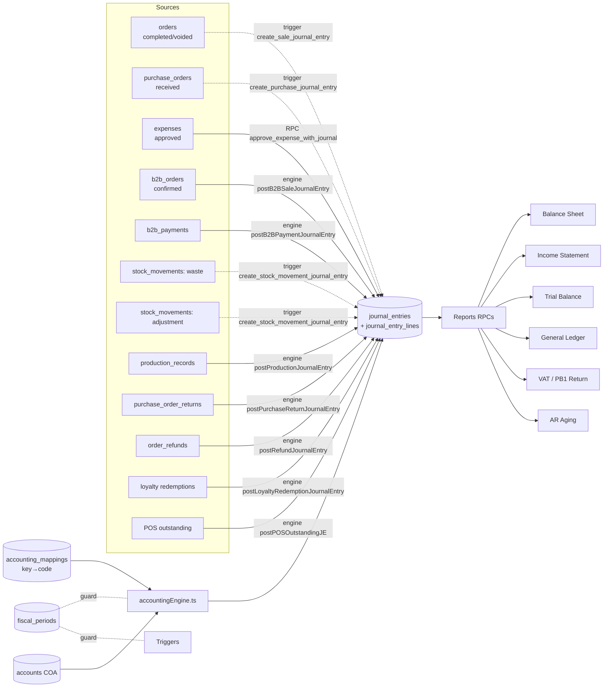

<!-- STALE-V2 -->
> ⚠️ **DOC HISTORIQUE — PÉRIMÉE (V2), NE FAIT PLUS FOI.** Ce fichier décrit en grande partie l'architecture **V2** (mono-app AppGrav, npm/Vercel, PWA/Capacitor, projet Supabase `abjabuniwkqpfsenxljp` = **prod incompatible**, versions RPC obsolètes). **Ne jamais l'appliquer tel quel** (migration, config, archi). Sources de vérité actuelles : `CLAUDE.md` (patterns + workplan) et `docs/workplan/remise-a-plat/` (référence modules réel-vs-demandé). Hiérarchie complète : `docs/README.md`. Régénération depuis le code prévue en Phase 3.

# 10 — Accounting (Double-Entry)

> **Last verified** : 2026-05-13
> **Structure** : ce fichier fusionne la **vue fonctionnelle** (le *pourquoi* et le *quoi* métier) et la **référence technique** (le *comment* implémenté). Pour les tâches à faire, voir [`../../workplan/backlog-by-module/10-accounting-double-entry.md`](../../workplan/backlog-by-module/10-accounting-double-entry.md).
> **Related E2E flows** : [04-purchase-order-cycle](../08-flows-end-to-end/04-purchase-order-cycle.md), [05-stock-opname](../08-flows-end-to-end/05-stock-opname.md), [06-b2b-order-to-invoice](../08-flows-end-to-end/06-b2b-order-to-invoice.md), [12-production-stock-impact](../08-flows-end-to-end/12-production-stock-impact.md), [13-expense-approval-je](../08-flows-end-to-end/13-expense-approval-je.md), [14-loyalty-redemption-je](../08-flows-end-to-end/14-loyalty-redemption-je.md).
> **App de rattachement** : Backoffice.
> **Audit skill** : [`/accounting-audit`](../../../.claude/skills/accounting-audit/) (lance un audit complet conformité SAK EMKM + double-entry integrity).

> **En une phrase** : le module Accounting est la mémoire comptable cohérente et vivante de The Breakery — il transforme chaque vente, achat, dépense, casse, production et paiement en écriture en partie double conforme SAK EMKM via 95 % d'automatisation par triggers, sépare proprement la PB1 du reste, réconcilie la banque au centime près, produit un bilan et un P&L à jour à la seconde, et livre la déclaration PB1 mensuelle prête à imprimer — pour que le gérant connaisse son résultat à J+1 et que le comptable externe ne fasse plus que valider.

---

## Table des matières

- [Partie I — Vue fonctionnelle](#partie-i--vue-fonctionnelle)
  - [1. Raison d'être](#1-raison-dêtre)
  - [2. Les 11 pages du module](#2-les-11-pages-du-module)
  - [3. Les 6 invariants du module](#3-les-6-invariants-du-module)
  - [4. Chart of Accounts — Le plan comptable](#4-chart-of-accounts--le-plan-comptable)
  - [5. Journal Entries — Le journal des écritures](#5-journal-entries--le-journal-des-écritures)
  - [6. General Ledger — Le grand livre](#6-general-ledger--le-grand-livre)
  - [7. Trial Balance — La balance](#7-trial-balance--la-balance)
  - [8. Balance Sheet — Le bilan](#8-balance-sheet--le-bilan)
  - [9. Income Statement — Le compte de résultat](#9-income-statement--le-compte-de-résultat)
  - [10. VAT Management — La PB1](#10-vat-management--la-pb1-taxe-restaurant)
  - [11. AR Aging — Les créances clients](#11-ar-aging--les-créances-clients)
  - [12. Bank Reconciliation](#12-bank-reconciliation--la-réconciliation-bancaire)
  - [13. CALK — Notes annexes SAK EMKM](#13-calk--notes-annexes-aux-états-financiers)
  - [14. Périodes fiscales](#14-les-périodes-fiscales)
  - [15. La génération automatique — Le cœur du module](#15-la-génération-automatique--le-cœur-du-module)
  - [16. Mécaniques transverses](#16-mécaniques-transverses--comment-le-module-dialogue-avec-le-reste)
  - [17. Ce que le module ne fait **pas**](#17-ce-que-le-module-ne-fait-pas-par-design)
- [Partie II — Référence technique](#partie-ii--référence-technique)
  - [18. Architecture conceptuelle](#18-architecture-conceptuelle)
  - [19. Diagramme de responsabilité](#19-diagramme-de-responsabilité)
  - [20. Tables DB impliquées](#20-tables-db-impliquées)
  - [21. Chart of Accounts (COA) seedé](#21-chart-of-accounts-coa-seedé)
  - [22. Account mappings](#22-account-mappings-accounting_mappings)
  - [23. Hooks principaux](#23-hooks-principaux)
  - [24. Services principaux](#24-services-principaux)
  - [25. Composants UI principaux](#25-composants-ui-principaux)
  - [26. Stores Zustand utilisés](#26-stores-zustand-utilisés)
  - [27. RPCs / Edge Functions](#27-rpcs--edge-functions)
  - [28. Triggers SQL critiques](#28-triggers-sql-critiques)
  - [29. RLS & Permissions](#29-rls--permissions)
  - [30. Routes](#30-routes)
  - [31. Flows E2E associés](#31-flows-e2e-associés)
  - [32. Pitfalls spécifiques](#32-pitfalls-spécifiques)
- [Partie III — Backlog opérationnel](#partie-iii--backlog-opérationnel)
- [Partie IV — Design & UX](#partie-iv--design--ux)
  - [33. Thèmes et contextes d'affichage](#33-thèmes-et-contextes-daffichage)
  - [34. Écrans du module (11 routes)](#34-écrans-du-module-11-routes)
  - [35. Layout patterns appliqués](#35-layout-patterns-appliqués)
  - [36. Composants UI signature](#36-composants-ui-signature)
  - [37. États visuels critiques](#37-états-visuels-critiques)
  - [38. Couleurs sémantiques utilisées](#38-couleurs-sémantiques-utilisées)
  - [39. Microcopy et empty states](#39-microcopy-et-empty-states)
  - [40. Références visuelles externes](#40-références-visuelles-externes)
  - [41. À faire côté design (backlog UX)](#41-à-faire-côté-design-backlog-ux)

---

# Partie I — Vue fonctionnelle

## 1. Raison d'être

Le module Accounting est la **comptabilité d'entreprise intégrée** de The Breakery. Il répond à une question simple mais critique pour toute PME indonésienne soumise à la fiscalité locale :

> *"Combien j'ai vraiment gagné ce mois ? Qu'est-ce que je dois au fisc en PB1 ? Combien me doivent mes clients B2B ? Combien je dois à mes fournisseurs ? Mon banque correspond-elle à mes livres ? Et est-ce que je suis en règle avec la norme SAK EMKM si un contrôleur passe demain ?"*

C'est le module qui transforme **un flux quotidien d'opérations métier** (ventes, achats, dépenses, paiements, productions, casses) en **comptabilité en partie double conforme** : plan comptable, journaux, grand livre, balance, états financiers, déclarations fiscales.

Le module est **principalement automatique** : 95 % des écritures sont générées par les triggers Postgres au fur et à mesure des opérations métier. L'utilisateur (gérant, comptable interne ou externe) consulte, vérifie, ajuste à la marge, et exporte pour la déclaration. Il **ne ressaisit jamais une vente** en compta.

Le module respecte la norme indonésienne **SAK EMKM** (Standar Akuntansi Keuangan Entitas Mikro, Kecil dan Menengah) — la norme PME — et publie en format compatible **CALK** (Catatan Atas Laporan Keuangan — notes annexes aux états financiers).

---

## 2. Les 11 pages du module

Le module est structuré en **11 pages** correspondant à 11 jobs comptables distincts :

| Page | Job-to-be-done | Permission |
|---|---|---|
| **Chart of Accounts** | Voir / gérer le plan comptable | `accounting.view` |
| **Journal Entries** | Consulter et créer des écritures journal | `accounting.journal.create` |
| **General Ledger** | Visualiser le grand livre par compte | `accounting.view` |
| **Trial Balance** | Balance des comptes à une date donnée | `accounting.view` |
| **Balance Sheet** | Bilan (actif / passif) | `accounting.view` |
| **Income Statement** | Compte de résultat (P&L) | `accounting.view` |
| **VAT Management** | Gérer la taxe PB1 (collectée, payable, déclarations) | `accounting.vat.manage` |
| **AR Aging** | Vieillissement des créances clients (Accounts Receivable) | `accounting.view` |
| **Bank Reconciliation** | Réconciliation des relevés bancaires | `accounting.manage` |
| **Reconciliation Detail** | Détail d'une réconciliation en cours | `accounting.manage` |
| **CALK** | Notes annexes aux états financiers (norme SAK EMKM) | `accounting.view` |

---

## 3. Les 6 invariants du module

Quelle que soit la page consultée, le module garantit toujours :

1. **Partie double stricte**. Chaque écriture journal a `débit total = crédit total`. Le système refuse une écriture déséquilibrée.
2. **Génération automatique**. 95 % des écritures sont créées par des triggers Postgres sur les opérations métier (vente, achat, paiement, casse, production). L'humain valide et corrige, il ne saisit pas.
3. **Conformité SAK EMKM**. Le plan comptable, la structure des états financiers et le format CALK respectent la norme indonésienne PME.
4. **Période fiscale verrouillable**. Une période clôturée n'accepte plus d'écriture — protection contre les modifications rétroactives.
5. **PB1 séparée des autres taxes**. La taxe restaurant locale 10 % (PB1) a sa propre logique, ses propres comptes (`2143` PB1 Payable), et son propre rapport — distincte d'une éventuelle TVA / PPN nationale.
6. **Toute écriture est traçable**. Source (opération métier d'origine), auteur, date, motif — jamais d'écriture orpheline.

---

## 4. Chart of Accounts — Le plan comptable

Page `ChartOfAccountsPage` : le **squelette** de la comptabilité. Affiche l'arbre hiérarchique du plan comptable.

### 4.1 Structure du plan

Codification à 4-5 chiffres, organisée par classe (norme SAK EMKM) :

| Classe | Comptes | Exemple |
|---|---|---|
| **1xxx** | Actif | 1111 Petty Cash, 1112 Bank, 1131 Inventory, 1121 AR B2B |
| **2xxx** | Passif | 2111 AP (Accounts Payable), 2143 PB1 Tax Payable |
| **3xxx** | Capital / Equity | 3100 Owner Capital, 3200 Retained Earnings |
| **4xxx** | Produits / Revenue | 4111 POS Sales, 4200 B2B Revenue, 4131 Sales Discount (contra) |
| **5xxx** | COGS | 5100 COGS - Direct, 5111 Food Waste |
| **6xxx** | Operating Expense | 6900 Stock Adjustment Expense, OpEx (rent, utilities, salaries…) |
| **7xxx** | Other Income | 7104 Stock Adjustment Income |

### 4.2 Actions disponibles

- **Visualisation en arbre** (`AccountTree`) avec tri par code.
- **Création / édition** d'un compte via `AccountModal` (code, libellé, type, parent, accepte les écritures directes ou pas).
- **Désactivation** d'un compte sans écriture associée (soft delete).
- **AccountPicker** réutilisable dans les modales d'écriture.

Bénéfice métier : **un plan comptable lisible et adapté à la boulangerie**, qu'on n'a pas à reconstruire à chaque déclaration. Le système est livré pré-rempli pour SAK EMKM ; le comptable ajoute ses sous-comptes si besoin.

---

## 5. Journal Entries — Le journal des écritures

Page `JournalEntriesPage` : la liste des **écritures comptables** générées et saisies.

### 5.1 Types d'écritures

| Source | Génération | Exemple |
|---|---|---|
| **Vente POS / B2B** | Auto (trigger `create_sale_journal_entry`) | Débit 1113 Cash 110 k / Crédit 4111 Sales 100 k / Crédit 2143 PB1 10 k |
| **Achat fournisseur** | Auto (trigger `create_purchase_journal_entry`) | Débit 1131 Inventory 500 k / Crédit 2111 AP 500 k |
| **Paiement fournisseur** | Auto | Débit 2111 AP 500 k / Crédit 1112 Bank 500 k |
| **Production** | Auto | Débit 1131 Finished Goods / Crédit 1131 Raw Materials |
| **Casse / Wastage** | Auto | Débit 5111 Wastage / Crédit 1131 Inventory |
| **Dépense** | Auto (via `approve_expense_with_journal` RPC) | Débit 6xxx Operating Expense / Crédit 1111 Cash ou 2111 AP |
| **Écart de caisse** | Auto à la clôture session | Débit/Crédit 4900/5900 selon signe |
| **Ajustement manuel** | Manuel (`JournalEntryForm`) | Toute écriture saisie à la main par le comptable |

### 5.2 Le formulaire d'écriture manuelle

`JournalEntryForm` permet au comptable de :

- Saisir une **date** (refusée si la période est clôturée).
- Choisir un **journal** (général, ventes, achats, banque, OD — opérations diverses).
- Saisir une **description** + référence externe.
- Ajouter des **lignes** (`JournalLineTable`) : compte, débit ou crédit, libellé.
- Vérification temps réel : total débit = total crédit. Bloquant si différent.
- Validation → création de l'écriture en base, avec auteur et timestamp.

### 5.3 Validation comptable (`journalEntryValidation`)

Avant persistance, le service `journalEntryValidation` vérifie :

- Équilibre débit/crédit.
- Tous les comptes existent et sont actifs.
- Tous les comptes acceptent des écritures directes (pas des comptes "parent" agrégateurs).
- La période fiscale est ouverte.
- L'utilisateur a la permission `accounting.journal.create`.

Bénéfice métier : **impossible de saisir une écriture incohérente**. Le système refuse à la source.

---

## 6. General Ledger — Le grand livre

Page `GeneralLedgerPage` : pour un **compte donné**, l'historique complet des mouvements sur une période :

- Soldes d'ouverture, mouvements détaillés, solde de clôture.
- Pour chaque ligne : date, journal source, libellé, débit, crédit, solde courant.
- **Drill-down** : clic sur une ligne → ouvre l'écriture journal d'origine et, plus loin, l'opération métier source (la vente, le PO, le paiement).
- **Filtres** : période, contrepartie, fourchette de montant.
- **Export** CSV / PDF.

Bénéfice métier : **auditer un compte en 30 secondes**. Le comptable demande "pourquoi le compte 1113 Cash a bougé de 2M le 15 ?" — le grand livre montre les 4 transactions à l'origine, drill-down vers les ventes du jour.

---

## 7. Trial Balance — La balance

Page `TrialBalancePage` : à une **date donnée**, l'état des soldes de tous les comptes :

- Une ligne par compte avec : code, libellé, total débit période, total crédit période, solde.
- Totaux en bas : total débit = total crédit (sinon erreur grave dans la base).
- **Filtre par date** (n'importe quelle date, pas que la fin de mois).
- **Filtre par classe** (1xxx actif, 2xxx passif, etc.).
- **Export** CSV / PDF.

Bénéfice métier : **vérifier la cohérence globale** avant de produire le bilan. Si la balance ne balance pas, le bilan sera faux.

---

## 8. Balance Sheet — Le bilan

Page `BalanceSheetPage` : le **bilan** à une date donnée, structure SAK EMKM :

- **Actif** : courant (cash, banque, AR, inventory), non courant (immobilisations, dépôts).
- **Passif** : courant (AP, PB1 payable, salaires à payer), non courant (emprunts).
- **Capitaux propres** : capital, réserves, résultat de l'exercice.
- Égalité Actif = Passif + Capitaux propres affichée en pied.
- **Format `FinancialStatementTable`** lisible avec hiérarchie pliable.
- **Export** PDF officiel pour banque / investisseur / contrôleur.

Bénéfice métier : **un bilan en 5 secondes**, prêt à imprimer, conforme à la norme indonésienne, sans avoir à attendre la clôture mensuelle du comptable externe.

---

## 9. Income Statement — Le compte de résultat

Page `IncomeStatementPage` : le **P&L** sur une période, structure SAK EMKM :

- **Revenus** : ventes retail, B2B, exceptionnel.
- **COGS** : coût des matières premières consommées (via production et ventes directes).
- **Marge brute** = Revenus − COGS.
- **Charges d'exploitation** : salaires, loyer, électricité, marketing, transport, casse.
- **Résultat d'exploitation**.
- **Charges et produits financiers**.
- **Résultat avant impôt**.
- **Impôt sur les sociétés** (si applicable).
- **Résultat net**.

Affichage tabulaire (`IncomeStatementTable`) avec comparaison période-vs-période optionnelle.

Bénéfice métier : **connaître son résultat à J+1**. Le gérant n'attend plus la fin de mois pour savoir s'il est rentable — il regarde son P&L tous les soirs s'il veut.

---

## 10. VAT Management — La PB1 (taxe restaurant)

Page `VATManagementPage` : la gestion spécifique de la **PB1** (Pajak Restoran — taxe restaurant locale).

### 10.1 Spécificités PB1

- **PB1 ≠ PPN / TVA**. C'est une **taxe restaurant locale**, perçue au niveau du gouvernement régional (kabupaten / kota), pas national.
- **Taux fixe 10 %**, inclus dans les prix affichés au client.
- **Formule** : `tax_amount = total × 10/110` (extraction de la part taxe du prix TTC).
- **Comptes** : `2143` PB1 Payable. Pas de mécanisme "PB1 à récupérer" comme la TVA classique — la PB1 collectée est entièrement reversée.
- **Aucun reporting DJP requis** : ce n'est pas la PPN nationale.

### 10.2 Fonctionnalités

- **VATSummaryCard** : carte synthétique mois par mois (PB1 collectée, à reverser).
- **Calculer la PB1 du mois** via RPC `calculate_vat_payable(year, month)`.
- **Filings** (`useVatFilings`) : historique des déclarations passées.
- **Génération de la déclaration mensuelle** : PDF imprimable conforme au format attendu par le service fiscal local.
- **Marquage "déclaré + payé"** une fois la déclaration faite (verrouille la période).

Bénéfice métier : **conformité PB1 sans erreur ni oubli**. Le 10 de chaque mois, le comptable génère la déclaration du mois précédent en 1 clic, paie au trésor public, et marque comme déclarée — trace permanente.

---

## 11. AR Aging — Les créances clients

Page `ARAgingPage` : le **vieillissement des comptes à recevoir** (Accounts Receivable).

- Liste de tous les clients avec encours > 0 (essentiellement B2B + ardoises POS).
- Buckets : Courant (avant échéance) / 1-30 j retard / 31-60 j / 61-90 j / 90 j+.
- Total par bucket et total global.
- Drill-down par client → liste détaillée de ses commandes impayées.
- Filtres : par client, par type (B2B / POS outstanding), par montant.
- **Hook `useARManagement`** pour les actions de relance et imputation.

Bénéfice métier : **piloter le recouvrement** sans formule Excel parallèle. Voir au premier coup d'œil quels clients dérapent et de combien.

---

## 12. Bank Reconciliation — La réconciliation bancaire

Pages `BankReconciliationPage` + `ReconciliationDetailPage` : le **rapprochement** entre les écritures comptables côté banque et le relevé bancaire réel.

### 12.1 Le geste

1. **Importer un relevé bancaire** (`BankStatementUpload`) au format CSV ou Excel — le service `bankStatementParser` interprète et normalise.
2. **Charger les écritures comptables** non encore rapprochées sur la période.
3. **Matcher automatiquement** sur les correspondances triviales (même date, même montant).
4. **Match manuel** (`ManualMatchModal`) pour les cas ambigus (différence de jour, montant légèrement différent à cause de frais).
5. **Ajustements** (`AdjustmentForm`) pour les écarts résiduels (frais bancaires non comptabilisés, intérêts, etc.).
6. **Validation finale** : la réconciliation est figée, marque les écritures comme rapprochées.

### 12.2 Vue détail

`ReconciliationDetailPage` montre, pour une réconciliation donnée :

- Solde de départ banque vs comptabilité.
- Lignes matchées une à une.
- Lignes orphelines (banque sans compta, ou compta sans banque) — à investiguer.
- Solde de fin attendu vs réel.

Bénéfice métier : **les livres de The Breakery collent à la banque** au centime près, semaine après semaine. Aucune dérive ne s'installe.

---

## 13. CALK — Notes annexes aux états financiers

Page `CALKPage` : la **CALK** (*Catatan Atas Laporan Keuangan*) — les **notes annexes** aux états financiers exigées par la norme SAK EMKM.

Contenu type :

- Identification de l'entité (raison sociale, NPWP, adresse, secteur).
- Base de présentation des comptes.
- Méthodes comptables retenues (FIFO, coût moyen, amortissements).
- Détail des principaux postes du bilan.
- Détail des principaux postes du P&L.
- Engagements hors bilan.
- Événements post-clôture.

Le module fournit un **éditeur structuré** (service `calkService`) qui pré-remplit les sections standards à partir des données comptables et permet au comptable d'ajouter les commentaires narratifs.

Bénéfice métier : **un dossier d'états financiers complet** prêt à imprimer / envoyer à la banque / au comptable externe, conforme à la norme PME indonésienne, sans devoir tout reformater dans Word.

---

## 14. Les périodes fiscales

`useFiscalPeriods` + `FiscalPeriodModal` : la gestion des **périodes comptables**.

- Une période ouverte accepte les écritures.
- Une période clôturée les refuse — protection contre la modification rétroactive.
- Trois statuts : `open` / `pending_closure` / `closed` (+ `locked`).
- Clôture nécessite permission `accounting.manage`.
- Le calendrier fiscal indonésien standard : exercice = année civile (1 janv − 31 déc), avec clôtures mensuelles intermédiaires possibles.

Bénéfice métier : **figer le passé** dès qu'il est validé. Une fois mars clôturé, le résultat de mars est définitif — personne ne peut le retoucher sans piste d'audit.

---

## 15. La génération automatique — Le cœur du module

Toute la **valeur quotidienne** du module vient de l'**automatisation**. Les triggers Postgres génèrent les écritures sans intervention humaine :

| Opération métier | Trigger / wrapper | Écriture produite |
|---|---|---|
| Vente POS payée cash | `create_sale_journal_entry` | DR Cash / CR Sales / CR PB1 Payable |
| Vente POS payée card | `create_sale_journal_entry` | DR Bank (à recevoir) / CR Sales / CR PB1 Payable |
| Vente B2B livrée | `postB2BSaleJournalEntry` (engine) | DR AR / CR B2B Sales / CR PB1 Payable |
| Paiement B2B reçu | `postB2BPaymentJournalEntry` | DR Cash/Bank / CR AR |
| Réception PO | `create_purchase_journal_entry` | DR Inventory / CR AP |
| Paiement fournisseur | `postPurchasePaymentJournalEntry` | DR AP / CR Cash/Bank |
| Casse / Wastage | `create_stock_movement_journal_entry` | DR Wastage Expense / CR Inventory |
| Production | `postProductionJournalEntry` | DR Finished Goods / CR Raw Materials |
| Dépense approuvée | RPC `approve_expense_with_journal` | DR Operating Expense / CR Cash/Bank or AP |
| Écart de caisse session | Trigger fermeture | DR/CR Exceptional / CR/DR Cash |
| Refund | `postRefundJournalEntry` | Contre-passation de la vente d'origine |
| Loyalty redemption | `postLoyaltyRedemptionJournalEntry` | DR Loyalty Liability / CR Sales Discount |
| POS Outstanding | `postPOSOutstandingJE` + `postPOSOutstandingPaymentJE` | DR POS Receivable / CR Sales puis DR Cash / CR POS Receivable |

Bénéfice métier : **le comptable n'est plus le goulot d'étranglement**. Il consulte, audite, ajuste à la marge, déclare — il ne saisit plus.

---

## 16. Mécaniques transverses — Comment le module dialogue avec le reste

| Module | Relation |
|---|---|
| **POS / Orders** | Chaque commande payée déclenche une écriture vente automatique. |
| **B2B** | Chaque livraison + chaque paiement B2B alimentent AR et le journal. |
| **Inventory** | Chaque production / casse / opname adjustment écrit en compta. |
| **Purchasing** | Chaque réception PO et chaque paiement fournisseur écrit en compta. |
| **Cash Register** | Chaque clôture session écrit un éventuel écart de caisse. |
| **Expenses** | Chaque dépense approuvée passe par `approve_expense_with_journal`. |
| **Reports** | P&L Monthly Trend, VAT Report, Receivables, Expenses by Category lisent les tables compta. |
| **Settings** | Plan comptable de référence, numérotation écritures, date de clôture exercice configurés dans Settings → Financial. |

---

## 17. Ce que le module ne fait **pas** (par design)

- Le module **ne fait pas la paie**. Pas de gestion des salaires détaillée — juste les écritures globales mensuelles. Pour la paie, un SIRH externe (BPJS, PPh21).
- Le module **ne gère pas les amortissements automatiques** des immobilisations. Saisie manuelle d'OD mensuelle.
- Le module **ne gère pas la TVA / PPN nationale**. The Breakery est sous régime PB1 (taxe restaurant 10 % locale), pas PPN.
- Le module **ne fait pas de consolidation multi-entité**. Une seule entreprise, un seul jeu de livres.
- Le module **ne supporte pas le multi-devise**. Tout en IDR. Une dépense en USD doit être convertie manuellement.
- Le module **n'exporte pas vers Accurate / MYOB** directement. Export CSV générique, à reformater dans le logiciel externe si besoin.

---

# Partie II — Référence technique

## 18. Architecture conceptuelle

Le module implémente une **double-entry accounting** stricte conforme aux normes indonésiennes **SAK EMKM** (Standar Akuntansi Keuangan Entitas Mikro, Kecil dan Menengah) et **SAK ETAP** (norme intermédiaire). Il génère **automatiquement** les écritures (Journal Entries, JE) pour 14+ types de transactions via deux mécanismes complémentaires :

1. **Triggers PostgreSQL** sur les tables métier (`orders`, `purchase_orders`, `stock_movements`).
2. **Engine TypeScript** (`accountingEngine.ts`) avec mapping `key → account_code` pour les transactions complexes (expense, b2b, refund, production, waste, adjustment, loyalty redemption, POS outstanding).

L'engine garantit **idempotency** (anti-double-JE), **balance validation** (débit = crédit), et **fiscal period guard** (refus de poster sur période closed/locked).

Les rapports financiers (Balance Sheet, Income Statement, Trial Balance, General Ledger, AR Aging, VAT/PB1) sont calculés via RPCs PostgreSQL pour performance.

**PB1 vs PPN** : The Breakery applique **PB1 (Pajak Pembangunan / Pajak Restoran)** à 10 % **incluse** dans les prix, perçue localement (Bali / Lombok) par le gouvernement régional — ce n'est PAS la PPN nationale (DJP). Aucun reporting DJP requis. Formule : `tax = total × 10/110`.

---

## 19. Diagramme de responsabilité



---

## 20. Tables DB impliquées

| Table | Rôle |
|---|---|
| `accounts` | Chart of Accounts (`code` UK, `name`, `account_type` ∈ asset/liability/equity/revenue/expense, `account_class` 1-7, `parent_id`, `balance_type` debit/credit, `node_type` HEADER/GROUP/ACCOUNT, `is_postable` bool, `is_system` bool) |
| `journal_entries` | En-tête JE (`entry_number` UK ex `SL-20260503-0042`, `entry_date`, `description`, `reference_type`, `reference_id`, `status` draft/posted/locked, `total_debit`, `total_credit`, `attachment_url`, `memo`, `created_by`) |
| `journal_entry_lines` | Lignes JE (`journal_entry_id`, `account_id`, `debit`, `credit`, `description`) — somme(debit) = somme(credit) toujours |
| `accounting_mappings` | Maps `mapping_key` (ex `SALE_CASH_IN`) → `account_code` (ex `1113`). Permet de changer la COA sans toucher au code JS. |
| `fiscal_periods` | Périodes fiscales (`year`, `month`, `start_date`, `end_date`, `status` open/closed/locked, `locked_at`, `locked_by`, `vat_declaration_date`, `vat_declaration_ref`, `vat_payable`) |
| `vat_filings` | Déclarations PB1 mensuelles (`period_year`, `period_month`, `vat_collected`, `vat_deductible`, `vat_payable`, `status` draft/not_filed/filed/amended, `filed_at`, `filed_by`, `djp_reference`) |
| `bank_statements` + `bank_statement_lines` | Imports relevés bancaires pour réconciliation (`bank_account_id`, `transaction_date`, `amount`, `description`, `matched_journal_entry_line_id`) |

---

## 21. Chart of Accounts (COA) seedé

Schéma 4 chiffres avec hiérarchie HEADER → GROUP → ACCOUNT (seul `is_postable=true` peut recevoir des JE lines). Cf. [03-database/08-seed-data.md](../03-database/08-seed-data.md) pour la liste complète seedée.

| Class | Type | Range | Comptes critiques |
|---|---|---|---|
| 1 | Asset | 1xxx | `1111` Petty Cash · `1112` Bank · `1113` Cash Register · `1114` Card Receivable · `1115` QRIS Receivable · `1116` EDC Receivable · `1121` Accounts Receivable B2B · `1123` AR POS Outstanding · `1131` Inventory General · `1151` VAT Input |
| 2 | Liability | 2xxx | `2111` Accounts Payable · `2143` PB1 Tax Payable (10 % restaurant) · `2200` Store Credit Liability · `2210` Loyalty Points Liability |
| 3 | Equity | 3xxx | `3100` Owner Capital · `3200` Retained Earnings · `3300` Current Year Earnings (manquant historiquement, à seed) |
| 4 | Revenue | 4xxx | `4111` POS Sales Revenue · `4131` Sales Discount (contra-revenue) · `4200` B2B Revenue |
| 5 | COGS | 5xxx | `5100` COGS - Direct (GROUP, non-postable) · `5111` Food Waste / Shrinkage |
| 6 | Operating Expense | 6xxx | `6900` Stock Adjustment Expense + comptes OpEx (rent, utilities, salaries, marketing — seedés via `20260413200100`) |
| 7 | Other Income | 7xxx | `7104` Stock Adjustment Income |

**Hiérarchie validée** : tous les parent-child relationships, `is_postable=false` correctement sur HEADER/GROUP. Le tree est construit par `accountingService.buildAccountTree()`.

---

## 22. Account mappings (`accounting_mappings`)

Le tableau ci-dessous récapitule les **25+ mapping keys** seedées (cf. migrations `20260330600000`, `20260330600100`, `20260330600200`, `20260407200000`, `20260413200200`) :

| Mapping key | Account code | Utilisé par |
|---|---|---|
| `SALE_CASH_IN` | `1113` | B2B Payment, Refund (cash), POS Outstanding Payment |
| `SALE_BANK_IN` | `1112` | B2B Payment, Refund (transfer/qris/edc), POS Outstanding Payment |
| `SALE_RECEIVABLE` | `1121` | B2B Sale, B2B Payment |
| `SALE_B2B_REVENUE` | `4200` | B2B Sale |
| `SALE_PB1_TAX` | `2143` | B2B Sale, Refund, POS Outstanding |
| `SALE_POS_REVENUE` | `4111` | Refund, year-end close |
| `SALE_REVENUE` | `4111` | POS Outstanding (alias historique) |
| `SALE_DISCOUNT` | `4131` | Sale trigger, Loyalty Redemption (contra-revenue) |
| `SALE_PAYMENT_CASH/TRANSFER/QRIS/EDC/CARD` | `1113`/`1112`/`1115`/`1116`/`1114` | Sale trigger (par méthode paiement) |
| `PURCHASE_PAYABLE` | `2111` | PO Payment, Purchase Return |
| `PURCHASE_CASH_OUT` | `1111` | PO Payment (cash) |
| `PURCHASE_BANK_OUT` | `1112` | PO Payment (transfer) |
| `PURCHASE_VAT_INPUT` | `1151` | Expense (avec tax) |
| `EXPENSE_PETTY_CASH` | `1111` | Expense (paid cash) |
| `EXPENSE_BANK` | `1112` | Expense (paid bank) |
| `STOCK_WASTE_FOOD` | `5111` | Stock Waste |
| `INVENTORY_GENERAL` | `1131` | Waste, Adjustment, Production, Purchase Return |
| `STOCK_ADJUSTMENT_INCOME` | `7104` | Stock Adjustment In |
| `STOCK_ADJUSTMENT_EXPENSE` | `6900` | Stock Adjustment Out |
| `PRODUCTION_COGS` | `5100`* | Production (⚠ historiquement broken — voir Pitfalls) |
| `STORE_CREDIT_LIABILITY` | `2200` | Refund (méthode store_credit) |
| `POS_RECEIVABLE` | `1123` | POS Outstanding (sale + payment) |
| `LOYALTY_LIABILITY` | `2210` | Loyalty Redemption |

---

## 23. Hooks principaux

| Hook | Chemin | Rôle |
|---|---|---|
| `useAccounts` | `src/hooks/accounting/useAccounts.ts` | CRUD COA + tree construction (`accountTree` dérive de `buildAccountTree`) |
| `useJournalEntries` | `src/hooks/accounting/useJournalEntries.ts` | Liste paginée JE + filtres (date, reference_type, status, search), création JE manuelle |
| `useJournalEntryDetail` | `src/hooks/accounting/useJournalEntries.ts` | Détail JE + lines avec compte joint |
| `useGeneralLedger` | `src/hooks/accounting/useGeneralLedger.ts` | Mouvements par compte (RPC `get_general_ledger_data`) avec running balance |
| `useTrialBalance` | `src/hooks/accounting/useTrialBalance.ts` | RPC `get_trial_balance_data(p_end_date)` — debit/credit par compte |
| `useBalanceSheet` | `src/hooks/accounting/useBalanceSheet.ts` | RPC `get_balance_sheet_data(p_end_date)` — assets/liabilities/equity hierarchique |
| `useIncomeStatement` | `src/hooks/accounting/useIncomeStatement.ts` | RPC `get_income_statement_data(p_start_date, p_end_date)` — P&L |
| `useFiscalPeriods` | `src/hooks/accounting/useFiscalPeriods.ts` | CRUD périodes + `lockPeriod` / `unlockPeriod` mutations |
| `useVATManagement` | `src/hooks/accounting/useVATManagement.ts` | RPCs `calculate_vat_payable(p_year, p_month)`, `get_vat_by_category` |
| `useVatFilings` | `src/hooks/accounting/useVatFilings.ts` | CRUD `vat_filings` + workflow filed/amended (note : PB1 ne nécessite pas filing DJP) |
| `useARManagement` | `src/hooks/accounting/useARManagement.ts` | AR aging via `arService` (cf. module 09) |
| `useBankReconciliation` | `src/hooks/accounting/useBankReconciliation.ts` | Upload statement, parser, matching auto/manuel JE lines |
| `useCALK` | `src/hooks/accounting/useCALK.ts` | Génération Catatan Atas Laporan Keuangan (notes annexes SAK EMKM) |

---

## 24. Services principaux

| Service | Chemin | Rôle |
|---|---|---|
| `accountingEngine.ts` | `src/services/accounting/accountingEngine.ts` | **Cœur du module**. `createJournalEntry({entryDate, description, referenceType, referenceId, lines})` avec : (1) fiscal period guard via RPC `check_fiscal_period_open`, (2) idempotency check (`reference_type` + `reference_id`), (3) résolution `mappingKey → account_code → UUID` via cache 5 min, (4) balance validation via `isBalanced()`, (5) génération `entry_number` séquentiel via RPC `next_journal_entry_number`, (6) insert header + lines + compensating delete sur erreur. **9+ wrappers** : `postExpenseJournalEntry`, `postB2BSaleJournalEntry`, `postB2BPaymentJournalEntry`, `postPurchasePaymentJournalEntry`, `postStockWasteJournalEntry`, `postStockAdjustmentJournalEntry`, `postRefundJournalEntry`, `postProductionJournalEntry`, `postPurchaseReturnJournalEntry`, `postPOSOutstandingJE`, `postPOSOutstandingPaymentJE`, `postLoyaltyRedemptionJournalEntry`. |
| `accountingService.ts` | `src/services/accounting/accountingService.ts` | Helpers purs : `buildAccountTree`, `groupAccountsByClass`, `flattenAccountTree`, `formatIDR` (arrondi 100), `suggestNextCode`, `isBalanced`, `calculateLineTotals` |
| `journalEntryValidation.ts` | `src/services/accounting/journalEntryValidation.ts` | Validation JE manuelle pré-soumission (entry_date required, lines ≥ 2, balanced, period open, account_id valid) |
| `vatService.ts` | `src/services/accounting/vatService.ts` | `calculateVATFromInclusive` (10/110), `formatVATSummary`, `generateDJPExport` (CSV format DJP — utilisé si bascule vers PPN nationale future) |
| `calkService.ts` | `src/services/accounting/calkService.ts` | Génère Catatan Atas Laporan Keuangan (notes annexes SAK EMKM) — sections fixées (entité, période, accounting policies, breakdown comptes critiques) |
| `bankStatementParser.ts` | `src/services/accounting/bankStatementParser.ts` | Parser CSV/OFX relevés bancaires — extrait date/amount/description, tente matching auto avec JE existants par montant + date ±3 j |

---

## 25. Composants UI principaux

| Composant | Chemin | Rôle |
|---|---|---|
| `AccountTree` | `src/components/accounting/AccountTree.tsx` | Tree view récursif COA avec expand/collapse, badges type, balances |
| `AccountModal` | `src/components/accounting/AccountModal.tsx` | Modal CRUD compte (avec parent_id picker, suggest_next_code, is_postable toggle) |
| `AccountPicker` | `src/components/accounting/AccountPicker.tsx` | Combobox réutilisable (search par code/name, filtre `is_postable=true`) |
| `JournalEntryForm` | `src/components/accounting/JournalEntryForm.tsx` | Formulaire création JE manuelle (date, description, lignes dynamiques) |
| `JournalLineTable` | `src/components/accounting/JournalLineTable.tsx` | Table lignes JE éditable avec totaux debit/credit live et indicateur balanced |
| `FinancialStatementTable` | `src/components/accounting/FinancialStatementTable.tsx` | Table récursive pour Balance Sheet / Income Statement avec subtotals par groupe |
| `FiscalPeriodModal` | `src/components/accounting/FiscalPeriodModal.tsx` | Modal CRUD période + lock/unlock |
| `VATSummaryCard` | `src/components/accounting/VATSummaryCard.tsx` | Card récap PB1 par mois (collected, deductible, payable) |
| `BankStatementUpload` | `src/components/accounting/BankStatementUpload.tsx` | Drop-zone upload CSV/OFX avec preview lignes parsées |
| `ManualMatchModal` | `src/components/accounting/ManualMatchModal.tsx` | Modal matching manuel ligne bancaire ↔ JE line |
| `AdjustmentForm` | `src/components/accounting/AdjustmentForm.tsx` | Form ajustement comptable manuel (réservé manager) |

---

## 26. Stores Zustand utilisés

- `useAuthStore` — résout `user.id` pour `created_by`, `locked_by`, `filed_by`. Permissions vérifiées via `usePermissions(['accounting.view', 'accounting.manage', 'accounting.journal.create', 'accounting.journal.update', 'accounting.vat.manage'])`.
- `useCoreSettingsStore` — `accounting_config.tax_rate` (défaut 10), `accounting_config.tax_inclusive` (défaut true), `accounting_config.fiscal_year_start_month` (défaut 1), `accounting_config.idr_rounding` (défaut 100).

Pas de store dédié accounting — react-query gère tout (stale infinite sur COA et mappings, 30 s sur JE list, 60 s sur statements).

---

## 27. RPCs / Edge Functions

### RPCs PostgreSQL (~20 fonctions)

| RPC | Rôle |
|---|---|
| `next_journal_entry_number(p_prefix)` | Génère `{PREFIX}-YYYYMMDD-NNNN` (ex `SL-20260503-0042`) en comptant les JE du jour |
| `check_fiscal_period_open(p_entry_date)` | Returns BOOLEAN — vérifie que la période contenant `p_entry_date` n'est ni `closed` ni `locked`. Utilisé par engine ET triggers. |
| `get_account_balance(p_account_id, p_end_date)` | Returns DECIMAL — somme(debit−credit) ou (credit−debit) selon balance_type, jusqu'à `p_end_date` |
| `get_balance_sheet_data(p_end_date)` | Returns TABLE (account_id, code, name, level, parent_id, account_type, balance) — hiérarchique pour Balance Sheet |
| `get_income_statement_data(p_start_date, p_end_date)` | Returns TABLE — P&L par compte sur la période |
| `get_trial_balance_data(p_end_date)` | Returns TABLE — debit/credit totaux par compte, équilibré obligatoirement |
| `get_general_ledger_data(p_account_id, p_start_date, p_end_date)` | Returns TABLE des JE lines + running_balance pour un compte |
| `calculate_vat_payable(p_year, p_month)` | Returns TABLE (vat_collected, vat_deductible, vat_payable) — sum 2143 (collected) − sum 1151 (deductible) sur le mois. ⚠ historiquement référençait `2110`/`1400` (codes non-seedés) — fix dans migration `20260322100200_fix_vat_account_alignment.sql`. |
| `get_vat_by_category(p_year, p_month)` | Breakdown PB1 par catégorie produit |
| `approve_expense_with_journal(p_expense_id, p_approved_by)` | **Atomique** : update `expense.status='approved'` + crée JE via wrapper `postExpenseJournalEntry`. Migration `20260323100100`. |
| `update_role_permissions(p_role_id, p_permission_ids)` | Atomique replace permissions d'un rôle (transactionnel) |
| `lock_fiscal_period(p_period_id, p_locked_by)` | Lock période + scelle status |
| `complete_order_with_payments(p_order_id, p_payments_jsonb, p_user_id, p_terminal_id)` | RPC POS atomique split payments — inclut le déclenchement implicite du trigger `create_sale_journal_entry` |

### Edge Functions

| Function | Rôle |
|---|---|
| `calculate-daily-report` | Calcule end-of-day summary (CA, payments par méthode, breakdown PB1, top products). Lit `journal_entries` + `orders` + agrège. |
| `claude-proxy` | Proxy LLM pour analyse comptable assistée (ex explication d'écritures, détection d'anomalies) — `verify_jwt: true`, check `accounting.view`. |

---

## 28. Triggers SQL critiques

| Trigger / Function | Source migration | Rôle |
|---|---|---|
| `create_sale_journal_entry()` | `20260216100200` (puis fixes `20260319030000`, `20260330600100`, `20260330600300`, `20260409180000_fix_accounting_p0_restore_unified_triggers`) | Sur `orders` UPDATE (status → completed/voided) — Dr (méthode payment) + Dr discount / Cr revenue + Cr PB1 payable. Reverse complet sur `voided`. Utilise mapping keys depuis migration `20260330600100`. |
| `create_purchase_journal_entry()` | `20260216100400` (fixes `20260322100200_fix_vat_account_alignment`, `20260330600100`) | Sur `purchase_orders` UPDATE (status → received) — Dr Inventory + Dr VAT Input / Cr Accounts Payable. |
| `create_stock_movement_journal_entry()` | `20260402110000` | Sur `stock_movements` INSERT — déclenche JE pour types `waste`, `adjustment_in`, `adjustment_out` (skippe sale_pos / purchase déjà gérés par leur trigger respectif). |
| `add_fiscal_period_guard_to_journal_triggers()` | `20260402120000` | Wrap les triggers ci-dessus avec `check_fiscal_period_open` — refuse insertion JE si période closed/locked. |
| `enforce_je_balance_constraint` (CHECK) | `20260430010000_add_accounting_constraints_and_views.sql` | Constraint DB-level qui refuse JE non-balanced (`total_debit = total_credit ± 0.01`). |
| `prevent_posted_je_modification` | `20260430010000` | Trigger BEFORE UPDATE/DELETE sur `journal_entries` qui refuse toute modification si `status='posted'` ou `'locked'`. |

---

## 29. RLS & Permissions

| Table | Action | Permission |
|---|---|---|
| `accounts` | SELECT | `is_authenticated()` |
| `accounts` | INSERT/UPDATE/DELETE | `accounting.manage` |
| `journal_entries` | SELECT | `is_authenticated()` |
| `journal_entries` | INSERT (status='draft') | `accounting.journal.create` |
| `journal_entries` | UPDATE (draft only) | `accounting.journal.update` |
| `journal_entries` | UPDATE (post/lock) | `accounting.manage` |
| `journal_entry_lines` | SELECT | `is_authenticated()` |
| `journal_entry_lines` | INSERT (via parent JE) | parent JE policies + cascade |
| `journal_entry_lines` | UPDATE / DELETE | aucune (lignes immutables une fois posted, modif via reverse + nouveau JE) |
| `accounting_mappings` | SELECT | `is_authenticated()` |
| `accounting_mappings` | INSERT/UPDATE | `accounting.manage` |
| `fiscal_periods` | SELECT | `is_authenticated()` |
| `fiscal_periods` | INSERT/UPDATE | `accounting.manage` |
| `vat_filings` | SELECT | `is_authenticated()` |
| `vat_filings` | INSERT/UPDATE | `accounting.vat.manage` |
| `bank_statements`, `bank_statement_lines` | INSERT/UPDATE | `accounting.manage` |

Tous les triggers DB sont en `SECURITY DEFINER` — ils peuvent insérer dans `journal_entries` même quand l'utilisateur métier n'a pas `accounting.journal.create` (cas normal : un caissier complète une vente, le trigger crée le JE en son nom).

---

## 30. Routes

```
/accounting                          — index → ChartOfAccountsPage
/accounting/chart-of-accounts        — ChartOfAccountsPage (tree COA)
/accounting/journal-entries          — JournalEntriesPage (liste + filtres + create modal)
/accounting/general-ledger           — GeneralLedgerPage (par compte avec running balance)
/accounting/trial-balance            — TrialBalancePage
/accounting/balance-sheet            — BalanceSheetPage
/accounting/income-statement         — IncomeStatementPage
/accounting/vat                      — VATManagementPage (PB1 par mois)
/accounting/ar-aging                 — ARAgingPage (cf. module 09)
/accounting/bank-reconciliation      — BankReconciliationPage
/accounting/bank-reconciliation/:id  — ReconciliationDetailPage
/accounting/notes                    — CALKPage (Catatan Atas Laporan Keuangan)
```

Toutes les routes sont gardées par `RouteGuard permission="accounting.view"` + `ModuleErrorBoundary moduleName="Accounting"`. Mutations sur `fiscal_periods`, COA, `accounting_mappings` exigent `accounting.manage`.

---

## 31. Flows E2E associés

- **04 — Purchase Order cycle** : réception PO → trigger `create_purchase_journal_entry` → Dr Inventory + Dr VAT Input / Cr AP. Paiement PO → wrapper `postPurchasePaymentJournalEntry`.
- **05 — Stock Opname** : finalisation session → multiples `adjustment_in`/`adjustment_out` movements → trigger `create_stock_movement_journal_entry` → JE par mouvement (`STOCK_ADJUSTMENT_INCOME` ou `STOCK_ADJUSTMENT_EXPENSE`).
- **06 — B2B Order to Invoice** : confirmation order → `postB2BSaleJournalEntry` (Dr AR / Cr B2B Revenue + PB1) ; paiement → `postB2BPaymentJournalEntry` (Dr Cash / Cr AR).
- **12 — Production stock impact** : `production_record` → `postProductionJournalEntry` (Dr COGS / Cr Inventory).
- **13 — Expense approval & JE** : RPC atomique `approve_expense_with_journal` → update expense + JE Dr Expense + Dr VAT Input / Cr Cash ou Bank.
- **14 — Loyalty redemption JE** : redeem points → `postLoyaltyRedemptionJournalEntry` (Dr Loyalty Liability / Cr Sales Discount).

---

## 32. Pitfalls spécifiques

- **JE postées NON modifiables** : trigger `prevent_posted_je_modification` (migration `20260430010000`) refuse UPDATE/DELETE si `status='posted'` ou `'locked'`. Pour corriger une erreur, créer un **JE inverse** (reverse entry) avec `referenceType='manual'` et description explicite. JAMAIS de UPDATE direct.
- **Période fiscale verrouillée** : `fiscal_periods.status='locked'` empêche TOUT JE sur la période, y compris triggers (via `check_fiscal_period_open`). Une vente postée AVANT lock reste, mais une nouvelle vente avec entry_date dans la période bloque l'opération côté Edge Function `complete_order_with_payments` (raise exception).
- **Mapping key non-résolue → JE skippé silencieusement** : si `accountingEngine.resolveAccountId(key)` retourne `null` (mapping absent ou compte non-postable), `createJournalEntry` retourne `{success: false, error: 'Unresolved account: ...'}` — l'appelant DOIT logger / alerter. Cas connus historiques : `SALE_REVENUE` manquant (P0 audit), `PRODUCTION_COGS` → `5100` GROUP non-postable (P0 audit). Vérifier après chaque migration accounting que tous les `mapping_key` actifs résolvent vers un `is_postable=true`.
- **Trigger version conflict** historique (audit 2026-04-09) : migration `20260402120000` overwrote la version mapping-based de `create_sale_journal_entry` avec une version hardcoded codes (`1110`, `4100`, `2110`) qui n'existaient pas dans la COA seedée. Restauration via `20260409180000_fix_accounting_p0_restore_unified_triggers.sql`. Toujours valider l'ordre d'application des migrations qui touchent les triggers JE.
- **Idempotency engine** : `createJournalEntry` query `WHERE reference_type=X AND reference_id=Y LIMIT 1` AVANT insert. Si un JE existe déjà, retourne `{success: true, skipped: true}`. Mais cette garde marche mal si on a deux types `reference_type` différents pour la même `reference_id` (ex une order qui aurait une JE `sale` ET une JE `void` — c'est OK dans ce cas car types distincts). Attention aux `reference_type` qui changent : un PO `received` puis `cancelled` puis `received` à nouveau peut générer des doublons si on n'utilise pas un type intermédiaire `reverse`.
- **PB1 ≠ PPN** : ne pas appeler le module "VAT" en parlant de la fiscalité The Breakery. PB1 (Pajak Pembangunan / Pajak Restoran) à 10 % incluse. Pas de filing DJP. La fonction `generateDJPExport` existe pour compatibilité future si l'établissement bascule en PPN national. Compte `2143` PB1 Payable, PAS `2110` (qui n'existe que dans certaines migrations historiques cassées).
- **Cache mappings 5 min** : `accountingEngine` cache `accounting_mappings` + `accounts` 5 minutes. Après création/édition d'un mapping ou d'un compte, **appeler `clearAccountingCache()`** ou attendre 5 min. Bug fréquent : nouveau mapping ajouté ne prend pas effet immédiatement.
- **`PRODUCTION_COGS` historiquement broken** : pointe vers `5100` qui est un GROUP avec `is_postable=false`. Le cache filtre `is_postable=true` donc résolution NULL. Solution : seeder un compte enfant `5101` postable et changer le mapping. Vérifier dans `docs/audit/02-accounting-business-audit.md`.
- **Engine NON transactionnel cross-table** : `createJournalEntry` insère header puis lines. Si insert lines échoue, compensating delete du header (lignes 217-219). Mais entre les deux opérations, un crash réseau peut laisser un header orphelin. Le job de réconciliation nightly devrait détecter ces cas (`SELECT * FROM journal_entries WHERE id NOT IN (SELECT DISTINCT journal_entry_id FROM journal_entry_lines)`).
- **Float precision** : `isBalanced` tolère `< 0.01` IDR. Tous les montants sont arrondis 100 IDR via `formatIDR` à l'affichage, mais le STORAGE est `DECIMAL(15,2)`. Ne pas utiliser des `Number` JS sans rounding pour éviter le drift cumulatif.
- **Year-end closing manuel** : aucun job auto pour basculer Income Statement → Retained Earnings au début de l'exercice fiscal suivant. Le compte `3300` Current Year Earnings n'est PAS seedé (cf. audit phase 1). Process manuel via JE `referenceType='manual'` Dr Revenue / Cr Retained Earnings + Dr Retained Earnings / Cr Expenses.
- **Audit régulier obligatoire** : invoke `/accounting-audit` skill après TOUT changement structurant (nouveau type de transaction, nouveau mapping, migration COA). Le skill audit 7 phases : COA completeness, mapping completeness, JE completeness par type, double-entry integrity, fiscal period integrity, RPCs financial statements, SAK EMKM compliance.
- **CALK manuel** : `useCALK` génère du contenu boilerplate. Pour SAK EMKM compliance complète, le comptable doit éditer/valider les notes annexes avant publication des états financiers.
- **Bank reconciliation matching imprécis** : le parser `bankStatementParser` matche par montant exact + date ±3 j. Faux positifs possibles si plusieurs JE de même montant. Toujours review manuel avant valider un match.
- **Permissions séparées** : `accounting.view` (lecture rapports) vs `accounting.journal.create` (création JE manuelle) vs `accounting.journal.update` (édition JE draft) vs `accounting.manage` (COA, mappings, fiscal periods, lock) vs `accounting.vat.manage` (filing PB1). Bien différencier dans les guards UI.
- **`check_fiscal_period_open` retourne `true` par défaut** si aucune période n'existe pour la date — risque de poster sans guard si les périodes ne sont pas créées d'avance. Process : créer les `fiscal_periods` 12 mois en avance au début de chaque année.

---

# Partie III — Backlog opérationnel

Pour les tâches techniques à exécuter (e-Faktur / e-Bupot integration, amortissement automatique des immobilisations, closing checklist mensuelle, comparatif budget vs réel, export Accurate / MYOB, multi-devise, consolidation multi-entité, IA d'aide à la classification, tax planning), voir :

→ [`../../workplan/backlog-by-module/10-accounting-double-entry.md`](../../workplan/backlog-by-module/10-accounting-double-entry.md)

Tâches priorisées P0–P3 avec critères d'acceptation, dépendances, estimations XS/S/M/L/XL et risques identifiés.

---

# Partie IV — Design & UX

> **Source canonique** : [`../../DESIGN_POS_AND_BACKOFFICE.md`](../../DESIGN_POS_AND_BACKOFFICE.md) (design détaillé des deux apps).
> **Tokens techniques** : [`../../../DESIGN.md`](../../../DESIGN.md) (variables CSS, scales, classes Tailwind).
> **Screenshots de référence** : [`../../ux/assets/screens/backoffice/`](../../ux/assets/screens/backoffice/) — source de vérité visuelle.

## 33. Thèmes et contextes d'affichage

Le module Accounting est **exclusivement Backoffice** — c'est l'archétype de la "salle de commandement claire" décrite dans [`../../DESIGN_POS_AND_BACKOFFICE.md`](../../DESIGN_POS_AND_BACKOFFICE.md) §4.

| Contexte | Thème CSS | Pages concernées | Identité |
|---|---|---|---|
| **Backoffice — Accounting** | `.theme-backoffice` (ivoire `#F8F8F6`) | `/accounting/*` (11 routes) | Salle de commandement claire, dense, tabulaire, scrollable — un comptable veut tout voir en un écran |

**Constante de marque** : l'or `#C9A55C` est réservé aux totaux, aux soldes finaux et aux écritures balanced (badge "BALANCED" en bas du `JournalEntryForm`). Voir [`../../DESIGN_POS_AND_BACKOFFICE.md`](../../DESIGN_POS_AND_BACKOFFICE.md) §4.6 — "Pages très tabulaires avec densité maximale d'information".

---

## 34. Écrans du module (11 routes)

| Route | Type d'écran | Densité | Composants signature |
|---|---|---|---|
| `/accounting/chart-of-accounts` | Tree view hiérarchique | Très haute | `AccountTree` avec expand/collapse, badges type (asset/liability/equity/revenue/expense), balances calculées |
| `/accounting/journal-entries` | Liste paginée + modal CRUD | Haute | Table dense avec colonnes Date / Entry # / Reference / Description / Debit Total / Credit Total / Status, filtres sticky |
| `/accounting/general-ledger` | Table par compte avec running balance | Maximale | Colonnes Date / Description / DR / CR / Running Balance (monospace JetBrains) |
| `/accounting/trial-balance` | Table équilibrée par compte | Maximale | Colonnes Code / Account / Period DR / Period CR / Closing DR / Closing CR + totaux en pied avec check `total_debit = total_credit` |
| `/accounting/balance-sheet` | Hiérarchie pliable Asset/Liability/Equity | Très haute | `FinancialStatementTable` récursif, subtotaux par groupe, égalité Actif = Passif + Capitaux propres en pied |
| `/accounting/income-statement` | Hiérarchie P&L | Haute | `FinancialStatementTable` avec Revenues / COGS / Gross Margin / OpEx / Operating Income / Net Income |
| `/accounting/vat` | Synthèse PB1 + filings | Moyenne | `VATSummaryCard` mois courant + table historique filings + bouton "Generate PB1 Report" |
| `/accounting/ar-aging` | Liste avec buckets | Haute | Buckets Current / 1-30 / 31-60 / 61-90 / 90+ avec couleurs progressives |
| `/accounting/bank-reconciliation` | Liste réconciliations | Moyenne | StatusBadge (draft/in_progress/validated) + bouton "Upload Statement" |
| `/accounting/bank-reconciliation/:id` | Workflow matching | Maximale | Deux colonnes : Bank lines (gauche) / JE lines (droite), auto-match indicators, drag-drop manual match |
| `/accounting/notes` | Éditeur CALK structuré | Moyenne | Sections collapsibles (Entity / Policies / Notes by Account / Off-balance / Post-closing) avec rich text |

---

## 35. Layout patterns appliqués

### 35.1 Pages liste — Pattern récurrent

Toutes les pages liste (`/accounting/journal-entries`, `/accounting/bank-reconciliation`) suivent le pattern Backoffice (cf. [`../../DESIGN_POS_AND_BACKOFFICE.md`](../../DESIGN_POS_AND_BACKOFFICE.md) §4.3) :

1. **Header de page** : titre + sous-titre + actions à droite ("New JE", export CSV/PDF, refresh).
2. **Stats cards** en row (4 à 6 KPI compactes) — pour JE : `Total entries`, `Posted`, `Draft`, `Total debit MTD`, `Total credit MTD`, `Balance`.
3. **Filters bar** : date range + reference_type + status + search → URL-synced.
4. **Table** principale avec header sticky, hover row `surface-2`, monospace JetBrains pour les montants.
5. **Pagination** + sélecteur "Items per page".
6. **Export buttons** : CSV (comptable) + PDF (impression/archivage).

### 35.2 Pages report — Pattern Financial Statement

Trial Balance / Balance Sheet / Income Statement (cf. §4.6 du design doc — "densité maximale") :

- **DateRangePicker** ou **DatePicker** (à date) en haut.
- **Toggle "Show empty accounts"** + **Toggle "Compare to previous period"**.
- **Table hiérarchique pliable** :
  - HEADER en bold + uppercase tracking large.
  - GROUP en bold avec subtotaux.
  - ACCOUNT (postable) en regular, drill-down vers General Ledger.
  - Alignement monospace `JetBrains Mono` pour tous les montants.
- **Pied de page** : égalité comptable (Total Assets = Total Liabilities + Equity) en gold massif.
- **Export PDF** formaté A4 portrait pour banque / contrôleur (header avec logo + NPWP + période).

### 35.3 Pages journal — Pattern saisie balanced

`JournalEntryForm` (modal ou page) :

- **Header form** : Date (DatePicker + check période ouverte) / Journal type / Description / Reference.
- **`JournalLineTable`** : lignes éditables avec colonnes Account (AccountPicker filtre `is_postable=true`) / Description / Debit / Credit.
- **Footer sticky** : Total Debit | Total Credit | **Indicateur "BALANCED ✓"** en gold (ou "DIFFERENCE: 50,000 IDR" en rouge si déséquilibré).
- **Bouton "Post Entry"** en or massif (désactivé tant que non-balanced + période fermée).

### 35.4 Page Bank Reconciliation — Workflow matching

`ReconciliationDetailPage` :

- **Header** : nom du bank account + période + soldes (bank vs comptabilité).
- **Two-column layout** :
  - Colonne gauche : `bank_statement_lines` (date / description / amount).
  - Colonne droite : `journal_entry_lines` non rapprochées.
- **Auto-match** : lignes pré-appariées en surbrillance émeraude.
- **Drag-drop manual** : tirer une ligne bank vers une JE line pour match manuel.
- **Modal `ManualMatchModal`** pour cas ambigus (split, partiel).
- **Footer sticky** : "X of Y bank lines matched — variance: -150,000 IDR".

---

## 36. Composants UI signature

| Composant | Type | Usage | Style clé |
|---|---|---|---|
| `AccountTree` | Tree recursive | `/accounting/chart-of-accounts` | Indentation par niveau (level × 16 px), badges type colorés (asset=blue, liability=orange, equity=purple, revenue=green, expense=red), balance en monospace |
| `AccountPicker` | Combobox | Tous formulaires JE | Search par code OU name, filtre `is_postable=true`, affiche `1113 — Cash Register` avec code en gold |
| `JournalEntryForm` | Form multi-lines | Modal /journal-entries | Lignes dynamiques (+/− buttons), indicateur balanced live (couleur gold si OK, rouge si KO) |
| `JournalLineTable` | Table éditable | Dans `JournalEntryForm` | Inputs inline, totaux DR/CR en pied avec monospace + couleur sémantique |
| `FinancialStatementTable` | Table hiérarchique | Balance Sheet / Income Statement | Subtotaux par groupe en bold, drill-down vers General Ledger sur clic compte |
| `VATSummaryCard` | KPI card | `/accounting/vat` | Card gold/10 avec mois courant : PB1 collected / deductible / payable, gros chiffre central en gold |
| `BankStatementUpload` | Drop-zone | `/accounting/bank-reconciliation/:id` | Drag & drop CSV/OFX, preview lignes parsées, bouton "Confirm import" |
| `ManualMatchModal` | Modal | Réconciliation | Side-by-side bank line vs JE line proposée, bouton "Confirm match" |
| `FiscalPeriodModal` | Modal | Période lock/unlock | Confirmation "Lock March 2026 ? Once locked, no JE can be posted on this period." + warning rouge |
| `AdjustmentForm` | Form | Ajustements manuels | Réservé manager, PIN reconfirmation obligatoire, raison + référence externe |

---

## 37. États visuels critiques

| État | Visuel | Pourquoi |
|---|---|---|
| **JE balanced** | Badge "BALANCED ✓" en gold sur fond `gold/10`, ligne footer du form | Pré-requis absolu — le bouton "Post" reste désactivé sinon |
| **JE imbalanced** | Badge "DIFFERENCE: 50,000 IDR" en rouge `#DC2626` + flèche vers la ligne en cause | Aide l'utilisateur à corriger immédiatement |
| **Période locked** | Bandeau sticky rouge "March 2026 is locked — JE on this period are read-only" + icône `Lock` Lucide | Empêche toute saisie rétroactive |
| **JE posted** | Badge "Posted" emerald `#16A34A` + icône `CheckCircle` | Distingue les entries définitives des drafts |
| **Compte non-postable** | Badge "GROUP" gris sur la ligne, désactivé dans AccountPicker | Empêche d'imputer sur un compte parent agrégateur |
| **PB1 non-déclarée mois N-1** | Card orange "PB1 March 2026 not filed yet — declare before April 10" sur dashboard | Rappel conformité fiscale |
| **Variance bancaire** | Footer reconciliation "Variance: -150,000 IDR" en rouge | Signal qu'il manque des écritures à enregistrer |
| **Trial balance imbalanced** | Pied table en rouge clignotant "TOTALS DO NOT MATCH — DB integrity error" | Alerte critique — appeler un dev |
| **Drift JE/lines** | Badge "Header orphan" sur la liste JE | Cf. pitfall §32 — header sans lines (crash réseau historique) |

---

## 38. Couleurs sémantiques utilisées

| Rôle | Backoffice (light) | Usage Accounting |
|---|---|---|
| **Success** | `#16A34A` (emerald) | JE posted, période open, réconciliation validée, balance OK |
| **Warning** | `#D97706` (amber) | PB1 non-déclarée, période pending_closure, variance bancaire faible |
| **Error** | `#DC2626` (red) | JE imbalanced, période locked (lecture seule), variance forte, mapping non-résolu |
| **Info** | `#2563EB` (blue) | Drafts, drill-down breadcrumb, bank lines non-matchées |
| **Gold** | `#C9A55C` | Totaux finaux (Total Assets, Net Income), badge BALANCED, bouton "Post Entry", numéros JE |

**Couleurs par classe de compte** (utilisées dans `AccountTree` et `AccountPicker`) :

- **Asset (1xxx)** : blue `#2563EB`
- **Liability (2xxx)** : orange `#D97706`
- **Equity (3xxx)** : purple `#9333EA`
- **Revenue (4xxx, 7xxx)** : green `#16A34A`
- **Expense (5xxx, 6xxx)** : red `#DC2626`

---

## 39. Microcopy et empty states

### Empty states

| Page | Texte | CTA |
|---|---|---|
| `/accounting/journal-entries` (aucune entry) | "No journal entries yet — the system will create them automatically as you sell, buy and pay." | "Create manual entry" |
| `/accounting/journal-entries` (filtre vide) | "No entries match your filters" | "Reset filters" |
| `/accounting/general-ledger` (compte sans mouvement) | "No movements on this account over the selected period" | — |
| `/accounting/vat` (aucun filing) | "No PB1 filings yet — the next one is due on the 10th of next month" | "Generate current month report" |
| `/accounting/bank-reconciliation` (aucune réconciliation) | "No reconciliations yet — start by uploading a bank statement" | "Upload statement" |
| `/accounting/ar-aging` (aucune créance) | "All clear — no outstanding receivables" + icône `CheckCircle` green | — |
| `/accounting/notes` (CALK vierge) | "CALK template ready — fill in the notes annexes for SAK EMKM compliance" | "Generate from accounts" |

### Confirmations destructives

- **Lock fiscal period** : "Once locked, no journal entry can be posted on March 2026. This action is reversible only by an admin with `accounting.manage`. Confirm ?" + bouton "Lock period" rouge.
- **Delete account** : "Cannot delete account 1131 — it has 247 journal entry lines. Deactivate instead ?" + bouton "Deactivate".
- **Post imbalanced entry** : (bouton désactivé) tooltip "Debit and credit must match before posting".
- **Reverse posted JE** : "Posted entries cannot be edited. The system will create a reverse entry (Dr ↔ Cr) referencing JE #SL-20260503-0042. Confirm ?" + textarea "Reason (required)".

### Toast notifications

- Succès JE post : "Journal entry SL-20260503-0042 posted — Dr 850,000 / Cr 850,000"
- Succès lock period : "March 2026 locked — entries are now read-only"
- Succès PB1 filing : "PB1 March 2026 marked as filed — receipt #DJP-12345"
- Erreur balance : "Cannot post — Debit (850,000) ≠ Credit (800,000). Difference: 50,000 IDR."
- Erreur période : "Cannot post — March 2026 is closed. Use a date in the current period or unlock."
- Erreur mapping : "Unresolved account: PRODUCTION_COGS → 5100 is not postable. Contact admin."

---

## 40. Références visuelles externes

| Ressource | Chemin / lien |
|---|---|
| Design doc complet (POS + Backoffice) | [`../../DESIGN_POS_AND_BACKOFFICE.md`](../../DESIGN_POS_AND_BACKOFFICE.md) — §4.6 "Le module Accounting — Spécificité" |
| Tokens canoniques V2 | [`../../../DESIGN.md`](../../../DESIGN.md) à la racine |
| Screenshots Backoffice de référence | [`../../ux/assets/screens/backoffice/`](../../ux/assets/screens/backoffice/) |
| Design system feature components | [`../02-design-system/04-feature-components.md`](../02-design-system/04-feature-components.md) |
| Module Expenses (couplage JE) | [`./11-expenses.md`](./11-expenses.md) |
| Module Reports (P&L, VAT report) | [`./14-reports-analytics.md`](./14-reports-analytics.md) |

---

## 41. À faire côté design (backlog UX)

| Priorité | Évolution UX | Bénéfice |
|---|---|---|
| 🔴 | **PDF officiel Balance Sheet / Income Statement** template SAK EMKM | Format A4 portrait avec entête NPWP + signature comptable + tampon — utilisable pour banque/investisseur |
| 🔴 | **Closing checklist visuelle** mensuelle | Workflow guidé "Réconcilié banque ? Validé dépenses ? Déclaré PB1 ?" avant lock période |
| 🔴 | **Visualisation chart of accounts complet** | Vue arbre avec ratios (% du total assets/liabilities) et soldes mis en couleur selon variation MoM |
| 🟠 | **Drill-down breadcrumb cross-modules** | Cliquer une ligne `STOCK_WASTE_FOOD` ouvre directement le `stock_movements` source avec photo de casse |
| 🟠 | **Mode "Comparaison" Balance Sheet** | Side-by-side current vs previous period avec deltas en couleurs |
| 🟠 | **Heatmap des écritures par jour** | Calendrier 30 jours avec densité visuelle d'écritures (détection trous = sessions oubliées) |
| 🟡 | **Animation "balanced" sur JE form** | Effet visuel quand les débits/crédits s'équilibrent (légère pulse gold) |
| 🟡 | **Dark mode Accounting** | Pour les sessions tardives du comptable — `.theme-pulse` (variant comptable institutionnel) prévu V3 |
| 🟢 | **Confettis animation** sur PB1 filing | Récompense visuelle quand le comptable valide la déclaration mensuelle dans les temps |
| 🟢 | **Watermark "DRAFT" sur PDFs** | Marquer clairement les états financiers non-finalisés pour éviter une diffusion accidentelle |
