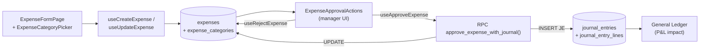
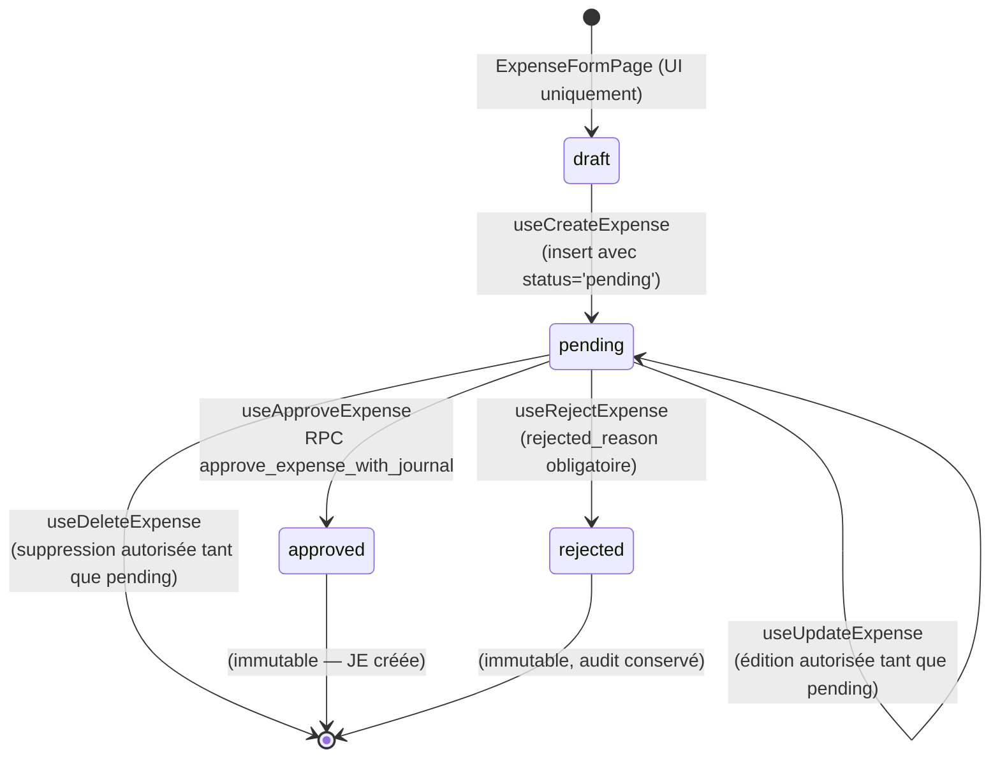

<!-- STALE-V2 -->
> ⚠️ **DOC HISTORIQUE — PÉRIMÉE (V2), NE FAIT PLUS FOI.** Ce fichier décrit en grande partie l'architecture **V2** (mono-app AppGrav, npm/Vercel, PWA/Capacitor, projet Supabase `abjabuniwkqpfsenxljp` = **prod incompatible**, versions RPC obsolètes). **Ne jamais l'appliquer tel quel** (migration, config, archi). Sources de vérité actuelles : `CLAUDE.md` (patterns + workplan) et `docs/workplan/remise-a-plat/` (référence modules réel-vs-demandé). Hiérarchie complète : `docs/README.md`. Régénération depuis le code prévue en Phase 3.

# 11 — Expenses

> **Last verified** : 2026-05-13
> **Structure** : ce fichier fusionne la **vue fonctionnelle** (le *pourquoi* et le *quoi* métier) et la **référence technique** (le *comment* implémenté). Pour les tâches à faire, voir [`../../workplan/backlog-by-module/11-expenses.md`](../../workplan/backlog-by-module/11-expenses.md).
> **Related E2E flows** : [10-end-of-day](../08-flows-end-to-end/10-end-of-day.md), [13-expense-approval-je](../08-flows-end-to-end/13-expense-approval-je.md).
> **App de rattachement** : Backoffice.
> **Prérequis** : [`./10-accounting-double-entry.md`](./10-accounting-double-entry.md) (RPC `approve_expense_with_journal`, comptes 5xxx/6xxx).

> **En une phrase** : le module Expenses est le carnet de comptes des sorties d'argent de The Breakery — il transforme chaque facture, ticket de caisse et note de frais en dépense catégorisée, validée par workflow Draft → Approved → Paid, photographiée et archivée, comptabilisée automatiquement à l'approbation via génération d'écriture journal, cloisonnée par permissions selon les seuils — pour que chaque IDR qui sort de la trésorerie soit justifié, validé, comptabilisé et explicable face à un contrôleur, sans que le gérant ait à tenir un Excel parallèle ni à attendre la fin de mois.

---

## Table des matières

- [Partie I — Vue fonctionnelle](#partie-i--vue-fonctionnelle)
  - [1. Raison d'être](#1-raison-dêtre)
  - [2. Les 4 pages du module](#2-les-4-pages-du-module)
  - [3. Les 5 invariants du module](#3-les-5-invariants-du-module)
  - [4. La liste des dépenses](#4-la-liste-des-dépenses--la-vue-centrale)
  - [5. La création d'une dépense](#5-la-création-dune-dépense)
  - [6. Le détail d'une dépense](#6-le-détail-dune-dépense)
  - [7. Le workflow d'approbation](#7-le-workflow-dapprobation)
  - [8. La gestion des catégories](#8-la-gestion-des-catégories)
  - [9. Le couplage Accounting](#9-le-couplage-accounting)
  - [10. Les expenses récurrentes](#10-les-expenses-récurrentes--le-cas-mensuel)
  - [11. La gestion documentaire](#11-la-gestion-documentaire)
  - [12. Permissions et contrôle d'accès](#12-permissions-et-contrôle-daccès)
  - [13. Mécaniques transverses](#13-mécaniques-transverses--comment-le-module-dialogue-avec-le-reste)
  - [14. Ce que le module ne fait **pas**](#14-ce-que-le-module-ne-fait-pas-par-design)
- [Partie II — Référence technique](#partie-ii--référence-technique)
  - [15. Vue d'ensemble technique](#15-vue-densemble-technique)
  - [16. Tables DB](#16-tables-db)
  - [17. Workflow d'approbation (state machine)](#17-workflow-dapprobation-state-machine)
  - [18. RPC `approve_expense_with_journal`](#18-rpc-approve_expense_with_journal)
  - [19. Hooks](#19-hooks-srchooksexpenses)
  - [20. Service `expenseService.ts`](#20-service-srcservicesexpensesexpenseservicets)
  - [21. Composants UI](#21-composants-ui-srccomponentsexpenses)
  - [22. Pages & routes](#22-pages--routes-srcpagesexpenses)
  - [23. RLS & permissions](#23-rls--permissions)
  - [24. Exemple complet d'écriture comptable](#24-exemple-complet-décriture-comptable-générée)
  - [25. Agrégation `useExpenseSummary`](#25-agrégation-useexpensesummary)
  - [26. Cross-references](#26-cross-references)
  - [27. Pitfalls](#27-pitfalls)
- [Partie III — Backlog opérationnel](#partie-iii--backlog-opérationnel)
- [Partie IV — Design & UX](#partie-iv--design--ux)
  - [28. Thèmes et contextes d'affichage](#28-thèmes-et-contextes-daffichage)
  - [29. Écrans du module (4 routes)](#29-écrans-du-module-4-routes)
  - [30. Layout patterns appliqués](#30-layout-patterns-appliqués)
  - [31. Composants UI signature](#31-composants-ui-signature)
  - [32. États visuels critiques](#32-états-visuels-critiques)
  - [33. Couleurs sémantiques utilisées](#33-couleurs-sémantiques-utilisées)
  - [34. Microcopy et empty states](#34-microcopy-et-empty-states)
  - [35. Références visuelles externes](#35-références-visuelles-externes)
  - [36. À faire côté design (backlog UX)](#36-à-faire-côté-design-backlog-ux)

---

# Partie I — Vue fonctionnelle

## 1. Raison d'être

Le module Expenses est **le gardien des dépenses opérationnelles** de The Breakery. Il répond à une question simple mais omniprésente dans toute boulangerie qui paie chaque jour de l'électricité, des emballages, de l'essence, des réparations et des salaires :

> *"Combien je dépense vraiment ce mois, pour quoi, qui l'a engagé, qui l'a validé, est-ce que c'est passé en compta, et est-ce que je peux justifier chaque sortie d'argent face à un contrôleur ?"*

C'est le module qui transforme **les factures, tickets de caisse et notes de frais** en **données comptables structurées** : catégorisées, datées, validées, rattachées à un fournisseur, comptabilisées en charges et payées par méthode tracée.

Le module est **complémentaire de Purchasing** : Purchasing gère les **achats de marchandises** (matières premières, produits revendus — actif circulant) ; Expenses gère les **charges opérationnelles** (loyer, électricité, services, petits matériels — passées directement en résultat).

Sans lui, les dépenses se règlent à la main, le comptable les ressaisit à la fin du mois, et la trésorerie du gérant est aveuglée jusqu'à l'arrêté comptable.

---

## 2. Les 4 pages du module

Le module est structuré en **4 pages** correspondant à 4 jobs distincts :

| Page | Job-to-be-done | Permission |
|---|---|---|
| **Expenses List** | Voir toutes les dépenses filtrables, leur statut, leur total | `expenses.view` |
| **Expense Form** | Créer ou modifier une dépense | `expenses.create` / `expenses.update` |
| **Expense Detail** | Consulter une dépense + agir (approuver, payer, dupliquer) | `expenses.view` |
| **Expense Categories** | Gérer la nomenclature des catégories de charges | `expenses.update` |

---

## 3. Les 5 invariants du module

Quel que soit le contexte d'utilisation, le module garantit :

1. **Catégorie obligatoire**. Aucune dépense ne se valide sans catégorie — c'est elle qui pilote le compte comptable destinataire.
2. **Workflow Draft → Approved → Paid**. Trois statuts (`pending` / `approved` / `rejected` en DB ; `payment_status` orthogonal `paid` / `unpaid`). Une dépense passe par un cycle de validation explicite avant de toucher la compta.
3. **Écriture comptable automatique à l'approbation**. La RPC `approve_expense_with_journal` génère l'écriture journal en même temps que la validation — pas de saisie compta double, pas d'incohérence possible.
4. **Traçabilité auteur**. `created_by` (qui a saisi) et `approved_by` (qui a validé) sont obligatoires et différents pour les montants élevés (séparation des tâches).
5. **Justificatif rattachable**. Chaque dépense peut porter une pièce jointe (photo de facture, scan de ticket) — preuve archivable dans Supabase Storage.

---

## 4. La liste des dépenses — La vue centrale

Page `ExpensesListPage` : la **liste consolidée** de toutes les dépenses.

### 4.1 Affichage

Chaque ligne : numéro de dépense, date, catégorie, description, fournisseur, méthode de paiement, montant, statut, créateur.

### 4.2 Filtres

- **Status** : Draft / Approved / Paid / Cancelled / Rejected.
- **Catégorie** : Loyer, Électricité, Eau, Internet, Emballages, Maintenance, Marketing, Salaires, Transport, Petites fournitures, etc.
- **Méthode de paiement** : Cash, Bank Transfer, Card, Compte fournisseur.
- **Fourchette de dates** : `from` / `to`.
- **Recherche** texte libre sur la description.
- Limite serveur : **200 dépenses** par requête (pagination cliente au-delà).

### 4.3 Stats agrégées

En haut de page, un résumé (`useExpenseSummary`) :

- **Total dépenses** sur la période filtrée.
- **Par statut** : combien en attente d'approbation, combien approuvées non payées, combien payées.
- **Par catégorie** : top 5 des catégories en montant.
- **Comparaison période précédente** (delta %).

Bénéfice métier : **savoir où passe l'argent** en 10 secondes. Le gérant ouvre la page chaque lundi matin, voit que les expenses Maintenance ont doublé vs le mois précédent → enquête.

---

## 5. La création d'une dépense

`ExpenseFormPage` (`/expenses/new`) : le formulaire de saisie d'une dépense.

### 5.1 Champs collectés

- **Date** de la dépense (peut être antérieure à la saisie — saisie tardive autorisée).
- **Catégorie** (obligatoire — `ExpenseCategoryPicker`).
- **Description** courte ("Facture PLN avril", "Carburant scooter livraison").
- **Montant** en IDR.
- **Fournisseur** optionnel (rattachement à un `supplier` du module Purchasing si récurrent).
- **Méthode de paiement** : Cash / Bank Transfer / Card / QRIS / EDC / À régler (compte fournisseur).
- **Date de paiement** : si déjà payé, date effective ; sinon vide pour règlement futur.
- **Numéro de référence** : N° facture fournisseur, N° ticket caisse.
- **Justificatif** : upload PDF / JPG / PNG dans Supabase Storage (bucket `expense-receipts`).
- **Notes** libres.

### 5.2 Cas d'usage typiques

- Saisie d'une **facture mensuelle** (loyer, internet, électricité) à payer en fin de mois.
- Saisie d'une **dépense cash** déjà engagée (carburant, petites fournitures) — date = aujourd'hui, méthode = cash, payé immédiatement.
- Saisie d'une **note de frais** d'un employé qui a avancé personnellement (remboursement à programmer).

Bénéfice métier : **chaque sortie d'argent a sa fiche**, créée en moins de 60 secondes, avec photo de justificatif si nécessaire.

---

## 6. Le détail d'une dépense

Page `ExpenseDetailPage` : la **fiche complète** d'une dépense avec ses actions.

### 6.1 Bloc identité

- Numéro, date, statut.
- Catégorie + compte comptable cible (visible).
- Description, fournisseur, référence.

### 6.2 Bloc financier

- Montant, méthode de paiement, date de paiement.
- Si payable à terme : date d'échéance.

### 6.3 Bloc traçabilité

- Créé par (qui + quand).
- Approuvé par (qui + quand) — vide si pas encore approuvé.
- Payé par (qui + quand) — vide si pas encore payé.
- Justificatif attaché (preview + download).
- Lien vers le JE associé (`/accounting/journals/:journal_entry_id`).

### 6.4 Bloc actions (`ExpenseApprovalActions`)

Selon le statut et les permissions :

- **Pending** : Modifier, Approuver, Rejeter (avec raison), Supprimer.
- **Approved** : Marquer payée, Imprimer, Cloner.
- **Paid** : Imprimer, Cloner, Consulter écriture compta.
- **Toutes** : Voir l'audit log (qui a fait quoi quand).

Bénéfice métier : **tout est centralisé sur une page** — pas de bascule entre 3 écrans pour traiter une dépense.

---

## 7. Le workflow d'approbation

C'est **le cœur du contrôle interne** sur les dépenses. Cycle standard :

```
Pending → (review) → Approved → (payment) → Paid
            ↓
        Rejected (avec raison)
```

### 7.1 Approbation

- Le créateur saisit une dépense → statut `pending` automatique.
- Un manager / owner consulte, peut **approuver** ou **rejeter avec raison**.
- À l'approbation, la RPC `approve_expense_with_journal` :
  - Bascule le statut en `approved`.
  - Enregistre `approved_by = user_id` et `approved_at = now()`.
  - **Génère automatiquement l'écriture comptable** : DR Compte de charge (selon catégorie) / CR Cash ou Bank ou AP selon la méthode de paiement.
- En cas de rejet : statut `rejected` + raison obligatoire + notification au créateur.

### 7.2 Seuils configurables

Selon Settings → Financial :

- Dépenses < seuil 1 : auto-approuvées si créées par un manager.
- Dépenses < seuil 2 : approbation manager simple.
- Dépenses > seuil 2 : approbation owner + manager (séparation des tâches).

### 7.3 Marquage paiement

Une dépense `approved` mais non payée (`payment_status='unpaid'`) reste **un AP** (Accounts Payable). Une fois payée :

- Bouton "Marquer payée" → date de paiement, méthode confirmée → `payment_status='paid'`.
- (Génération éventuelle de l'écriture de règlement : DR AP / CR Cash ou Bank — selon configuration).

Bénéfice métier : **séparer l'engagement de la dépense (approbation) du décaissement (paiement)**. Permet de provisionner une charge sans avoir encore décaissé — comportement comptable correct.

---

## 8. La gestion des catégories

Page `ExpenseCategoriesPage` : la **nomenclature** des catégories de charges (`expense_categories`).

### 8.1 Structure

Chaque catégorie a :

- **Code** unique (court, ex `LOYER`, `ELEC`, `PACK`).
- **Libellé**.
- **Parent_id** : hiérarchie (catégories / sous-catégories).
- **Compte comptable cible** (`account_id` → référence dans `accounts`, plan comptable du module Accounting).
- **Statut actif / inactif**.
- **Description / notes**.

### 8.2 Catégories standards livrées

| Catégorie | Compte cible typique |
|---|---|
| **Loyer** | 6130 Locations |
| **Électricité / Eau / Gaz** | 6140 Services et fluides |
| **Internet / Téléphone** | 6150 Télécommunications |
| **Emballages** | 6210 Emballages consommables |
| **Maintenance / Réparation** | 6300 Entretien et réparations |
| **Marketing / Publicité** | 6400 Marketing |
| **Salaires** | 6500 Salaires et charges |
| **Transport** | 6610 Transport et déplacements |
| **Petites fournitures** | 6620 Fournitures de bureau |
| **Honoraires** | 6700 Honoraires comptable / juriste |
| **Banque** | 6800 Frais bancaires |
| **Divers** | 6900 Autres charges externes |

### 8.3 Bénéfice métier

**Standardiser le langage des charges** : chaque dépense, peu importe l'opérateur, atterrit dans la bonne catégorie, qui pilote le bon compte comptable, sans qu'il faille connaître le plan comptable par cœur. Un cashier saisit "Électricité" → l'app sait que c'est le 6140.

---

## 9. Le couplage Accounting

Le module Expenses est **fortement intégré** au module Accounting :

- Chaque approbation déclenche `approve_expense_with_journal` qui écrit dans `journal_entries`.
- L'écriture est immédiatement visible dans le grand livre (`GeneralLedgerPage`).
- Le report **Expenses by Category** (module Reports) lit `expenses` directement.
- Le **P&L Monthly Trend** consolide les expenses dans la section "Charges d'exploitation".
- Les expenses approuvées non payées apparaissent en **AP** dans le bilan.

Bénéfice métier : **la comptabilité reste à jour à la seconde**. Le gérant valide une dépense de 5M IDR à 14h ; à 14h01, son P&L mensuel s'est ajusté.

---

## 10. Les expenses récurrentes — Le cas mensuel

Le cas typique : **loyer, électricité, internet** se paient tous les mois pour des montants relativement stables.

### 10.1 Approche actuelle

Le module supporte la **duplication** ("Clone") d'une dépense :

- Bouton sur la fiche détail → recrée une nouvelle dépense pré-remplie avec mêmes catégorie, fournisseur, méthode, montant.
- Modification du montant et date avant validation.
- Validation rapide.

### 10.2 Workflow type "fin de mois"

1. Le gérant ouvre le dernier loyer payé.
2. Clic "Clone".
3. Ajustement de la date à ce mois.
4. Si le montant a changé : modification.
5. Soumission → Approbation → Paiement quand fait.

### 10.3 Évolution prévue

Un système de **dépenses récurrentes programmées** est dans le backlog (Partie III).

Bénéfice métier : **traitement des fixes mensuelles en 30 secondes par dépense** au lieu de tout ressaisir.

---

## 11. La gestion documentaire

Chaque dépense peut porter une **pièce jointe** :

- Format accepté : PDF, JPG, PNG.
- Stockage : Supabase Storage (bucket `expense-receipts`).
- Taille max : 5 MB par fichier (configurable).
- Preview directement dans la fiche détail.
- Téléchargement.

Cas d'usage : prise de photo du ticket caisse par le manager directement avec son téléphone, upload immédiat → la dépense est saisie + justifiée + validée en 90 secondes au comptoir.

Bénéfice métier : **archive numérique des justificatifs** sans classeur physique. Quand le comptable ou un contrôleur demande "tu peux me montrer la facture du loyer de mars ?", la réponse est dans la fiche dépense.

---

## 12. Permissions et contrôle d'accès

| Permission | Action |
|---|---|
| `expenses.view` | Lire la liste, voir le détail |
| `expenses.create` | Créer une dépense en pending |
| `expenses.update` | Modifier une dépense pending |
| `expenses.approve` | Approuver / rejeter une dépense |
| `expenses.pay` | Marquer payée |
| `expenses.delete` | Supprimer une dépense pending (soft delete) |
| `expenses.categories.manage` | Gérer la nomenclature des catégories |

Bénéfice métier : **cloisonner les responsabilités**. Un cashier peut saisir des dépenses cash mais pas les approuver ; un manager approuve mais le owner valide les seuils élevés.

---

## 13. Mécaniques transverses — Comment le module dialogue avec le reste

| Module | Relation |
|---|---|
| **Accounting** | Écriture journal automatique à l'approbation via `approve_expense_with_journal`. |
| **Reports** | `expenses` (par date), `expense_by_category`, `pl_monthly_trend` consomment les données. |
| **Settings** | Catégories par défaut, seuils d'approbation, compte comptable par catégorie. |
| **Users & Permissions** | Permissions `expenses.*` cloisonnent les droits. |
| **Purchasing** | Suppliers partagés. Une réception PO génère un AP côté Purchasing ; une dépense de service génère un AP côté Expenses — deux flux séparés mais convergents en compta. |
| **Cash Register** | Une dépense payée cash sort de la caisse — impact sur la réconciliation de session. |

---

## 14. Ce que le module ne fait **pas** (par design)

- Le module **ne fait pas la paie**. Les salaires apparaissent en bloc mensuel comme une expense agrégée, mais le détail individuel (fiches de paie, BPJS, PPh21) est externe.
- Le module **ne supporte pas les dépenses récurrentes programmées** (auto-créer une dépense le 1ᵉʳ de chaque mois). Cf. backlog.
- Le module **ne gère pas l'OCR de factures**. Pas d'extraction automatique des champs depuis la photo de la facture.
- Le module **ne supporte pas les remboursements de notes de frais** comme un workflow dédié. Une note de frais est une dépense ordinaire avec `payment_method = cash` ou `supplier = nom_employé`.
- Le module **ne gère pas le budget prévisionnel** (budget vs réel). Pas de comparaison "vous avez consommé 80 % du budget marketing". Cf. backlog Accounting.
- Le module **ne traite pas les amortissements**. Achat d'une immobilisation = passer par un autre flux (saisie OD compta), pas par expenses.

---

# Partie II — Référence technique

## 15. Vue d'ensemble technique

Module de saisie et d'approbation des dépenses opérationnelles de The Breakery (loyer, électricité, fournitures, services). Tout `expense` validé déclenche une écriture comptable double-entry via le RPC atomique `approve_expense_with_journal`. La catégorisation hiérarchique permet le mapping automatique vers le compte du PCG (`expense_categories.account_id`).



Trois rôles interagissent : (1) le **créateur** saisit la dépense (status `pending`), (2) le **manager / admin** approuve ou rejette (status `approved` / `rejected`), (3) à l'approbation la **comptabilité** est posée automatiquement dans la même transaction PostgreSQL — pas d'incohérence possible entre journal et expense.

---

## 16. Tables DB

| Table | Rôle | RLS | Réf. |
|---|---|---|---|
| `expense_categories` | Catégories hiérarchiques (parent/enfant via `parent_id`), liées à un compte du PCG | ✅ `is_authenticated()` SELECT, permission writes | `src/types/expenses.ts:38` |
| `expenses` | Une ligne par dépense, FK vers catégorie, fournisseur, créateur, approbateur, JE | ✅ pareil | `src/types/expenses.ts:54` |
| `expense_attachments` | Pièces jointes (justificatifs scannés / photos), URL Supabase Storage | ✅ pareil | bucket `expense-receipts/` |

Colonnes clés de `expenses` :

| Colonne | Type | Notes |
|---|---|---|
| `expense_number` | `TEXT` UNIQUE | Format `EXP-YYYYMMDD-NNN` généré par RPC `next_expense_number()` |
| `category_id` | `UUID` FK | Détermine le compte du débit (via `expense_categories.account_id`) |
| `description` | `TEXT NOT NULL` | Libellé court |
| `amount` | `DECIMAL(12,2)` | Net hors taxe |
| `tax_amount` | `DECIMAL(12,2)` DEFAULT 0 | TVA / PB1 le cas échéant — généralement 0 pour les charges (tax-exempt) |
| `total_amount` | `DECIMAL(12,2)` | `amount + tax_amount` (calculé au create) |
| `expense_date` | `DATE` | Date d'engagement (utilisée comme `date` du JE) |
| `payment_method` | `TEXT` | `cash` / `transfer` / `card` / `qris` / `edc` — sélectionne le compte de crédit (1110 si cash, sinon 1120) |
| `receipt_url` | `TEXT` | URL Supabase Storage du justificatif |
| `supplier_id` | `UUID` FK NULL | Optionnel — lien avec `suppliers` |
| `status` | `TEXT` enum app-level | `pending` / `approved` / `rejected` (cf. `TExpenseStatus`) |
| `payment_status` | `TEXT` enum SQL `expense_payment_status` | `paid` / `unpaid` (gère les dettes en attente de paiement) |
| `payment_date` | `DATE` NULL | Date effective de paiement (peut différer de `expense_date`) |
| `approved_by` / `approved_at` | `UUID` / `TIMESTAMPTZ` | Renseignés par le RPC d'approbation |
| `rejected_reason` | `TEXT` | Motif de rejet (obligatoire en UI quand `useRejectExpense`) |
| `journal_entry_id` | `UUID` FK | Le JE créé par le RPC, NULL avant approbation |
| `created_by` | `UUID` FK `user_profiles` | Auditabilité |

Voir [03-database/02-tables-reference.md](../03-database/02-tables-reference.md) pour les autres colonnes auto.

---

## 17. Workflow d'approbation (state machine)



**Règle** : `useUpdateExpense` et `useDeleteExpense` ajoutent `.eq('status', 'pending')` dans la clause WHERE. Une fois la dépense `approved` ou `rejected`, elle est **figée** côté UI ; toute modification doit passer par un JE manuel d'annulation (cf. flow [10 — End of Day](../08-flows-end-to-end/10-end-of-day.md)).

`payment_status` est orthogonal au workflow : une dépense peut être `approved` + `unpaid` (dette fournisseur) puis `approved` + `paid` une fois le règlement effectué (édition du `payment_date`).

---

## 18. RPC `approve_expense_with_journal`

**Source** : `supabase/migrations/20260323100100_atomic_expense_approval_and_role_permissions.sql`

```sql
SELECT public.approve_expense_with_journal(
    p_expense_id := 'uuid-expense',
    p_approved_by := 'uuid-manager'
) -- Returns JSON expense record
```

Étapes exécutées atomiquement (transaction unique, rollback total sur erreur) :

1. `UPDATE expenses SET status = 'approved', approved_by, approved_at = NOW() WHERE id = $1 AND status = 'pending'` — lock optimiste qui échoue si la dépense n'est plus `pending` (race condition entre managers).
2. `SELECT account_id FROM expense_categories WHERE id = expense.category_id` — résolution du compte de débit. Erreur si la catégorie n'a pas de compte mappé.
3. Détermination du compte de crédit selon `payment_method` :
   - `cash` → compte code `1110` (Petty Cash / Cash)
   - tout autre (`transfer` / `card` / `qris` / `edc`) → code `1120` (Bank)
4. Si `tax_amount > 0` : ligne supplémentaire débit sur compte `1180` (Prepaid VAT) — pas utilisé en pratique pour The Breakery.
5. Création de l'en-tête `journal_entries` + 2 lignes `journal_entry_lines` (debit catégorie / credit cash ou bank).
6. `UPDATE expenses SET journal_entry_id = $new_je_id`.
7. Retourne le record `expenses` complet en JSON.

Échec → exception PostgreSQL → React Query toast d'erreur via `useApproveExpense.onError`. Aucune écriture partielle n'est persistée.

**RPC complémentaire** : `next_expense_number()` génère la chaîne `EXP-YYYYMMDD-NNN` (séquence quotidienne).

---

## 19. Hooks (`src/hooks/expenses/`)

| Hook | Fichier | Rôle |
|---|---|---|
| `useExpenses(filters)` | `useExpenses.ts:15` | Liste paginée (200 max) avec joins catégorie/fournisseur/créateur/approbateur. Filtres : `status`, `category_id`, `payment_method`, `from`, `to`, `search` |
| `useExpense(id)` | `useExpenses.ts:65` | Détail single avec mêmes joins |
| `useCreateExpense()` | `useExpenses.ts:97` | Mutation insert. Génère `expense_number` via RPC, calcule `total_amount`, force `status='pending'` |
| `useUpdateExpense()` | `useExpenses.ts:137` | Mutation update **uniquement si `status='pending'`** |
| `useDeleteExpense()` | `useExpenses.ts:165` | Mutation delete **uniquement si `status='pending'`** |
| `useApproveExpense()` | `useExpenses.ts:187` | Appelle `approve_expense_with_journal`. Invalide aussi les caches `journal-entries` et `accounting.journal-entries` |
| `useRejectExpense()` | `useExpenses.ts:213` | Update `status='rejected'` + `rejected_reason` (uniquement si `pending`) |
| `useExpenseCategories()` | `useExpenseCategories.ts:14` | Liste des catégories + arbre hiérarchique (`buildCategoryTree`) + version flat (`flattenCategoryTree`) pour dropdown |
| `useCreateExpenseCategory()` / `useUpdate*` / `useDelete*` | idem | CRUD catégories |
| `useExpenseSummary(from, to)` | `useExpenseSummary.ts:5` | Agrégats sur `approved` : total, count, avg, par catégorie, par méthode de paiement, count `pending` |

Tous les hooks utilisent `react-query` avec invalidation `['expenses']` + toasts Sonner pour les feedbacks utilisateur.

---

## 20. Service `src/services/expenses/expenseService.ts`

Logique métier pure (pas d'IO Supabase) :

| Fonction | Rôle |
|---|---|
| `buildCategoryTree(categories, parentId?)` | Récursion : transforme la liste plate en arbre `IExpenseCategoryWithChildren[]` trié par `sort_order` |
| `flattenCategoryTree(tree, depth?)` | Inverse : ré-applatit l'arbre avec une colonne `depth` pour rendu indenté dans un `<select>` |
| `validateExpense(input)` | Validation pré-submit : `category_id`, `description`, `amount > 0`, `expense_date`, et si `payment_status='paid'` exige `payment_method` + `payment_date` |
| `calculateExpenseTotals(expenses)` | Agrégats locaux : total / count / avg / `byCategory` / `byPaymentMethod` (utilisé pour les KPIs de la liste) |

---

## 21. Composants UI (`src/components/expenses/`)

| Composant | Rôle |
|---|---|
| `ExpenseApprovalActions.tsx` | Bouton "Approve" + bouton "Reject" (avec dialog motif), gardé par `permissions.expenses.approve`. Affiché uniquement si `status === 'pending'` |
| `ExpenseCategoryPicker.tsx` | Combobox indenté (utilise `flattenCategoryTree`) avec recherche, affiche le code compte mappé (`account_code — Account Name`) |
| `ExpenseStatusBadge.tsx` | Badge coloré (amber `pending` / emerald `approved` / red `rejected`) + tooltip avec `approved_by` / `rejected_reason` |

---

## 22. Pages & routes (`src/pages/expenses/`)

| Page | Route | Garde |
|---|---|---|
| `ExpensesLayout.tsx` | `/expenses` | `ModuleErrorBoundary` + `RouteGuard permission="expenses.view"` |
| `ExpensesListPage.tsx` | `/expenses` (index) | `expenses.view` — Table paginée avec filtres + `<ExpenseApprovalActions>` inline pour les `pending` |
| `ExpenseFormPage.tsx` | `/expenses/new` et `/expenses/:id/edit` | `expenses.create` / `expenses.update` |
| `ExpenseDetailPage.tsx` | `/expenses/:id` | `expenses.view` — Affiche dépense + JE associé (lien vers `/accounting/journals/:journal_entry_id`) |
| `ExpenseCategoriesPage.tsx` | `/expenses/categories` | `expenses.update` — CRUD catégories + arbre drag-drop |
| `ExpensesListComponents.tsx` | helpers internes |  |

Routes définies dans `src/routes/salesRoutes.tsx` lignes 9–35.

---

## 23. RLS & permissions

Pattern standard `is_authenticated()` SELECT + permission code pour les writes.

| Permission | Action UI |
|---|---|
| `expenses.view` | Accès au module + voir la liste |
| `expenses.create` | Saisie d'une nouvelle dépense |
| `expenses.update` | Édition tant que `status='pending'` |
| `expenses.delete` | Suppression tant que `status='pending'` |
| `expenses.approve` | Approbation / rejet (généralement réservé aux rôles `manager` / `admin`) |

Le RPC `approve_expense_with_journal` est `SECURITY DEFINER` mais son appel passe par RLS d'écriture sur `expenses` et `journal_entries` — le caller doit avoir `expenses.approve` **et** `accounting.journal.create`.

---

## 24. Exemple complet d'écriture comptable générée

Saisie d'une dépense d'électricité PLN 850 000 IDR payée par virement bancaire, catégorie "Utilities — Electricity" mappée au compte 5210 :

```sql
-- Avant approbation
expenses { id: 'exp-1', amount: 850000, payment_method: 'transfer',
           category_id: 'cat-utilities-electricity', status: 'pending' }

-- Après useApproveExpense (RPC approve_expense_with_journal)
expenses { id: 'exp-1', status: 'approved', approved_by: 'user-2',
           approved_at: '2026-05-03T10:23:00+08', journal_entry_id: 'je-7' }

journal_entries { id: 'je-7', entry_number: 'JE-2026-0457',
                  date: '2026-05-03', description: 'Expense EXP-20260503-007 — Electricity' }

journal_entry_lines [
  { je_id: 'je-7', account_id: 'acc-5210', debit: 850000, credit: 0 },   -- Utilities (charge)
  { je_id: 'je-7', account_id: 'acc-1120', debit: 0, credit: 850000 },   -- Bank
]
```

Si la même dépense avait été payée en cash, le `credit` serait posté sur le compte 1110 (Petty Cash) à la place du 1120 (Bank). Le mapping est codé en dur dans le RPC : `cash → 1110`, autre → 1120.

---

## 25. Agrégation `useExpenseSummary`

Le hook (`useExpenseSummary.ts:5`) prend un `from`/`to` et retourne un agrégat utilisé par `ExpensesListPage` en haut de la table :

```ts
{
  total: number,         // Σ amount des status='approved'
  count: number,         // nb d'expenses approved
  avg: number,           // total / count
  pending_count: number, // nb d'expenses encore en pending (KPI alerte)
  byCategory: Array<{ name, total, count }>,    // ranked
  byPaymentMethod: Array<{ method, total, count }>, // ranked
}
```

Les expenses `rejected` sont **exclues** de tous les agrégats. Les `pending` ne sont comptées que dans `pending_count`.

---

## 26. Cross-references

- Module [10 — Accounting (Double-entry)](./10-accounting-double-entry.md) — JE structure, COA, account 1110/1120/5xxx
- Module [14 — Reports & Analytics](./14-reports-analytics.md) — rapport `expenses` (catégorie Finance) + `getExpensesByDate` service
- [03-database/03-rpc-functions.md](../03-database/03-rpc-functions.md) — signature complète `approve_expense_with_journal`
- [07-security/03-rbac-permissions.md](../07-security/03-rbac-permissions.md) — codes `expenses.*`
- Migration source : `supabase/migrations/20260317150000_add_expense_payment_fields.sql` (payment fields)
- Migration source : `supabase/migrations/20260323100100_atomic_expense_approval_and_role_permissions.sql` (RPC d'approbation atomique)
- Flow E2E lié : [08-flows-end-to-end/10-end-of-day.md](../08-flows-end-to-end/10-end-of-day.md) — check-list d'approbation des dépenses du jour

---

## 27. Pitfalls

- ⚠️ **Catégorie sans compte mappé** : si `expense_categories.account_id` est NULL, le RPC lève `Expense category has no linked account`. Toujours mapper un compte 5xxx/6xxx (charges) au seed initial des catégories.
- ⚠️ **Édition après approbation** : `useUpdateExpense` filtre sur `status='pending'`, donc tente silencieusement un UPDATE qui retourne 0 ligne — pas d'erreur visible mais aucune modification persistée. Le bouton Edit doit être désactivé en UI quand `status !== 'pending'`.
- ⚠️ **Race d'approbation double** : deux managers cliquent simultanément → le second reçoit l'exception `Expense not found or not in pending status` (lock par `WHERE status='pending'`). Comportement attendu, l'UI affiche toast "Failed to approve".
- ⚠️ **`payment_status` ≠ `status`** : une dépense `approved` peut rester `unpaid` (dette). Bien distinguer les deux dans les rapports — `useExpenseSummary` agrège uniquement `status='approved'` mais sans filtrer `payment_status`.
- ⚠️ **`tax_amount` non utilisé** : The Breakery ne reverse pas de TVA sur ses charges (PB1 est un impôt sur les ventes restaurant uniquement). Le champ existe pour compatibilité multi-pays mais reste à 0 en production.
- ⚠️ **Suppression du JE associé** : ne jamais supprimer manuellement la `journal_entries` row liée — la FK `journal_entry_id` est SET NULL mais le déséquilibre comptable reste. Préférer une écriture d'annulation.

---

# Partie III — Backlog opérationnel

Pour les tâches techniques à exécuter (dépenses récurrentes programmées, approval workflow visuel, OCR de factures, budget par catégorie, remboursement note de frais structuré, multi-devise, lien commande fournisseur ↔ dépense, catégorisation auto par IA, export pour le comptable), voir :

→ [`../../workplan/backlog-by-module/11-expenses.md`](../../workplan/backlog-by-module/11-expenses.md)

Tâches priorisées P0–P3 avec critères d'acceptation, dépendances, estimations XS/S/M/L/XL et risques identifiés.

---

# Partie IV — Design & UX

> **Source canonique** : [`../../DESIGN_POS_AND_BACKOFFICE.md`](../../DESIGN_POS_AND_BACKOFFICE.md) (design détaillé des deux apps).
> **Tokens techniques** : [`../../../DESIGN.md`](../../../DESIGN.md) (variables CSS, scales, classes Tailwind).
> **Screenshots de référence** : [`../../ux/assets/screens/backoffice/`](../../ux/assets/screens/backoffice/) — source de vérité visuelle.

## 28. Thèmes et contextes d'affichage

Le module Expenses est **exclusivement Backoffice** — il vit dans la "salle de commandement claire" décrite dans [`../../DESIGN_POS_AND_BACKOFFICE.md`](../../DESIGN_POS_AND_BACKOFFICE.md) §4.

| Contexte | Thème CSS | Pages concernées | Identité |
|---|---|---|---|
| **Backoffice — Expenses** | `.theme-backoffice` (ivoire `#F8F8F6`) | `/expenses/*` (4 routes) | Liste tabulaire avec workflow d'approbation inline — densité moyenne, focus sur le statut et la traçabilité |

**Constante de marque** : l'or `#C9A55C` réservé aux montants approuvés et au bouton "Approve" primaire. Les status colors (amber/emerald/red) suivent la palette sémantique Backoffice.

---

## 29. Écrans du module (4 routes)

| Route | Type d'écran | Densité | Composants signature |
|---|---|---|---|
| `/expenses` | Liste paginée avec actions inline | Haute | Table dense, `ExpenseStatusBadge` colorés, `ExpenseApprovalActions` inline pour `pending`, filters bar (status/category/payment_method/date range) |
| `/expenses/new` et `/expenses/:id/edit` | Formulaire saisie | Moyenne | `ExpenseCategoryPicker` indenté, upload zone justificatif drag-drop, `DatePicker` x2 (expense_date + payment_date), `AmountInput` IDR |
| `/expenses/:id` | Fiche détail multi-blocs | Moyenne | Bloc identité + financier + traçabilité + actions + preview justificatif + lien JE |
| `/expenses/categories` | CRUD catégories hiérarchiques | Moyenne | Tree drag-drop avec parent/enfant, `AccountPicker` pour mapping compte comptable |

---

## 30. Layout patterns appliqués

### 30.1 Page liste — Pattern Backoffice standard

`ExpensesListPage` suit le pattern liste Backoffice (cf. [`../../DESIGN_POS_AND_BACKOFFICE.md`](../../DESIGN_POS_AND_BACKOFFICE.md) §4.3) :

1. **Header de page** : titre "Expenses" + sous-titre "Manage and approve operational expenses" + actions à droite ("+ New Expense", Export CSV, Refresh).
2. **Stats cards** en row (4 KPI) : `Total this month`, `Pending approval` (badge rouge si > 0), `Approved unpaid` (AP), `Avg per day`.
3. **Filters bar** : Status dropdown + Category dropdown + Payment method dropdown + Date range picker + Search input + Reset button. URL-synced.
4. **Table** principale :
   - Header sticky : Date / # / Category / Description / Supplier / Amount (IDR right-aligned monospace) / Payment / Status / Actions.
   - Row hover `surface-2`, alternance douce.
   - Coloration de cellule Status par `ExpenseStatusBadge`.
   - Actions inline : `ExpenseApprovalActions` (Approve/Reject) pour `pending`, kebab menu sinon.
5. **Pagination** + sélecteur "Items per page" (10/25/50/100/200).
6. **Export buttons** : CSV (comptable) + PDF (archivage).

### 30.2 Page formulaire — Pattern saisie structurée

`ExpenseFormPage` :

1. **Breadcrumb** : `< Back to Expenses` + titre ("New Expense" ou "Edit Expense #EXP-...").
2. **Form en deux colonnes** :
   - Colonne gauche (info métier) : Date, Category (avec preview compte mappé), Description, Amount, Tax (rare), Supplier (autocomplete).
   - Colonne droite (paiement & justif) : Payment method, Payment date, Reference number, Notes, **Upload zone justificatif** (drag-drop ou click).
3. **Aperçu justificatif** thumbnail si fichier ajouté (avec bouton "Replace" / "Remove").
4. **Footer sticky** : "Cancel" (gauche, text-secondary) + "Save as Draft" (secondary) + "Save & Submit for Approval" (primary or).

### 30.3 Page détail — Pattern fiche multi-blocs

`ExpenseDetailPage` (cf. §4.4 du design doc) :

1. **Breadcrumb** : `< Back to Expenses` + numéro + `ExpenseStatusBadge`.
2. **Bloc identité** : Date / Category (avec lien vers `account_id`) / Description / Supplier / Reference.
3. **Bloc financier** : Amount / Payment method / Payment date / Total.
4. **Bloc traçabilité** : Created by + at, Approved by + at, Rejected reason si applicable, Paid by + at.
5. **Bloc justificatif** : preview embed (PDF iframe ou image) + bouton "Download" / "Replace".
6. **Bloc actions** (`ExpenseApprovalActions` étendu) : selon status et permissions.
7. **Bloc Accounting** : si JE existe, mini-table avec lignes Dr/Cr + lien "View full JE →".
8. **Audit timeline** en bas : événements chronologiques (created, edited, approved, paid).

### 30.4 Page catégories — Pattern tree CRUD

`ExpenseCategoriesPage` :

- **Tree view** (`flattenCategoryTree` rendu indenté).
- Chaque ligne : code, libellé, compte mappé (lien `AccountPicker`), nombre d'expenses associées, status actif/inactif, action edit/delete.
- Bouton "+ New Category" en haut.
- Drag-drop pour réorganiser ou changer le parent.

---

## 31. Composants UI signature

| Composant | Type | Usage | Style clé |
|---|---|---|---|
| `ExpenseStatusBadge` | Badge | Toutes pages | Amber pour `pending`, Emerald pour `approved`, Red pour `rejected` — tooltip avec approved_by / rejected_reason |
| `ExpenseApprovalActions` | Action group | Liste + détail | Deux boutons : "Approve" (emerald) et "Reject" (rouge avec dialog motif obligatoire), affichés seulement si `status='pending'` + permission `expenses.approve` |
| `ExpenseCategoryPicker` | Combobox indenté | Form | Tree-aware avec depth (indentation 16 px par niveau), affiche le code compte mappé en suffixe gold (`5210 — Utilities`) |
| `ExpenseReceiptUpload` | Drag-drop zone | Form + Detail | Accepts PDF/JPG/PNG, max 5 MB, preview thumbnail, badge "Required" si dépense > seuil |
| `ExpenseSummaryCards` | KPI cards row | Liste | 4 cards uniformes : Total month / Pending / Approved unpaid / Avg per day — avec `ComparisonKpiCard` vs mois précédent |

---

## 32. États visuels critiques

| État | Visuel | Pourquoi |
|---|---|---|
| **Pending approval** | Badge amber `#D97706` + icône `Clock` Lucide, rangée légèrement teintée `amber/5` | Visibilité immédiate des dépenses qui attendent une décision |
| **Approved** | Badge emerald `#16A34A` + icône `CheckCircle` + lien vers JE | Confirmation que la compta est posée |
| **Rejected** | Badge red `#DC2626` + icône `XCircle` + tooltip avec raison | Trace définitive du refus |
| **Approved unpaid** | Badge emerald + badge orange "Unpaid" | Visibilité de l'AP en cours — signal de trésorerie |
| **Paid** | Badge emerald + badge "Paid" + payment_date | Cycle complet |
| **Justificatif manquant** | Bordure orange sur la card form + tooltip "Required for expenses > 500,000 IDR" | Forcer la conformité documentaire |
| **Catégorie sans compte** | Bordure rouge dans `ExpenseCategoryPicker` + tooltip "No account mapped — cannot approve" | Empêche l'erreur RPC `approve_expense_with_journal` |
| **Approbation auto** | Badge "Auto-approved" gris foncé | Distingue les expenses sous seuil 1 auto-validées |
| **Race condition lock** | Toast "Failed to approve — already processed by another user" | Cf. pitfall §27 |

---

## 33. Couleurs sémantiques utilisées

| Rôle | Backoffice (light) | Usage Expenses |
|---|---|---|
| **Success** | `#16A34A` (emerald) | Status `approved`, status `paid`, JE created |
| **Warning** | `#D97706` (amber) | Status `pending`, `approved+unpaid` (AP), justificatif manquant |
| **Error** | `#DC2626` (red) | Status `rejected`, catégorie sans compte, race condition |
| **Info** | `#2563EB` (blue) | Drafts, "Auto-approved" badge, breadcrumb lien JE |
| **Gold** | `#C9A55C` | Bouton primaire "Approve" / "Save & Submit", numéros expense_number, montants totaux row |

---

## 34. Microcopy et empty states

### Empty states

| Page | Texte | CTA |
|---|---|---|
| `/expenses` (aucune dépense) | "No expenses yet — start tracking operational costs" + icône `Receipt` grise | "+ New Expense" |
| `/expenses` (filtre vide) | "No expenses match your filters" | "Reset filters" |
| `/expenses` (aucun pending) | (rien — la card "Pending approval" affiche `0`) | — |
| `/expenses/categories` (aucune catégorie) | "No expense categories defined yet" | "Create default categories" (seed) |
| `/expenses/:id` (sans JE) | (badge "Pending" + bouton Approve visible) | — |

### Confirmations destructives

- **Reject expense** : "Reject expense EXP-20260503-007 (Electricity, 850,000 IDR) ?" + textarea "Reason (required)" + bouton "Reject" rouge.
- **Delete expense** : "Delete expense EXP-20260503-007 ? This cannot be undone." + bouton "Delete" rouge (uniquement si `status='pending'`).
- **Edit approved expense** : (bouton désactivé) tooltip "Approved expenses are immutable — create a reverse entry instead".
- **Delete category with expenses** : "Cannot delete 'Utilities' — 47 expenses are linked to it. Deactivate instead ?" + bouton "Deactivate".

### Toast notifications

- Succès create : "Expense EXP-20260503-007 created — pending approval"
- Succès approve : "Expense approved — JE-2026-0457 posted (Dr Utilities 850,000 / Cr Bank 850,000)"
- Succès reject : "Expense rejected — creator will be notified"
- Erreur catégorie : "Cannot approve — category has no linked account. Edit category first."
- Erreur race : "Failed to approve — already processed by another user. Refresh and try again."
- Erreur upload : "Receipt upload failed — file must be PDF/JPG/PNG under 5 MB"

---

## 35. Références visuelles externes

| Ressource | Chemin / lien |
|---|---|
| Design doc complet (POS + Backoffice) | [`../../DESIGN_POS_AND_BACKOFFICE.md`](../../DESIGN_POS_AND_BACKOFFICE.md) |
| Tokens canoniques V2 | [`../../../DESIGN.md`](../../../DESIGN.md) à la racine |
| Module Accounting (couplage JE) | [`./10-accounting-double-entry.md`](./10-accounting-double-entry.md) |
| Module Reports (Expenses by Category) | [`./14-reports-analytics.md`](./14-reports-analytics.md) |
| Module Purchasing (suppliers partagés) | [`./07-purchasing-suppliers.md`](./07-purchasing-suppliers.md) |
| Module Settings (catégories + seuils) | [`./19-settings-configuration.md`](./19-settings-configuration.md) |

---

## 36. À faire côté design (backlog UX)

| Priorité | Évolution UX | Bénéfice |
|---|---|---|
| 🔴 | **Workflow visuel recurring expenses** | UI dédiée "Set as recurring" sur la fiche détail → schedule mensuel/hebdo avec rappel et création auto en `pending` |
| 🔴 | **Mobile capture justificatif** | Bouton "Take photo" sur form mobile (Capacitor camera plugin) → upload immédiat, OCR placeholder |
| 🔴 | **Approval workflow visuel multi-niveau** | Diagramme drag-drop des seuils + rôles d'approbation au lieu de coder en permissions |
| 🟠 | **Budget tracker par catégorie** | Progress bar sur card catégorie : "Marketing — 4.5M / 6M (75 %)" avec couleur progressive |
| 🟠 | **OCR auto-fill** | Service externe (Google Vision / Azure) qui pré-remplit montant + date + fournisseur depuis la photo |
| 🟠 | **Bulk approve** | Sélection multi-row + bouton "Approve selected" pour traiter 20 dépenses cash d'un coup |
| 🟡 | **Heatmap dépenses par jour** | Calendrier 30 jours avec densité visuelle (chaud = beaucoup de dépenses) — détecter les pics de petites caisses suspects |
| 🟡 | **Mode "Note de frais employé"** | Workflow dédié : créateur = employé, approbateur = manager, payable au prochain salaire (lien paie) |
| 🟢 | **Tag system** | Étiquettes libres ("Q1 marketing campaign", "Renovation 2026") au-dessus de la catégorie pour reporting transverse |
| 🟢 | **Animation "approved"** | Effet confettis discret quand une dépense passe `pending → approved` (récompense visuelle du workflow) |
