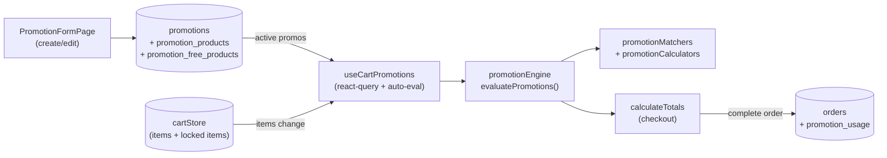

<!-- STALE-V2 -->
> ⚠️ **DOC HISTORIQUE — PÉRIMÉE (V2), NE FAIT PLUS FOI.** Ce fichier décrit en grande partie l'architecture **V2** (mono-app AppGrav, npm/Vercel, PWA/Capacitor, projet Supabase `abjabuniwkqpfsenxljp` = **prod incompatible**, versions RPC obsolètes). **Ne jamais l'appliquer tel quel** (migration, config, archi). Sources de vérité actuelles : `CLAUDE.md` (patterns + workplan) et `docs/workplan/remise-a-plat/` (référence modules réel-vs-demandé). Hiérarchie complète : `docs/README.md`. Régénération depuis le code prévue en Phase 3.

# 13 — Promotions & Combos

> **Last verified** : 2026-05-13
> **Structure** : ce fichier fusionne la **vue fonctionnelle** (le *pourquoi* et le *quoi* métier — promotions configurables + combos, application POS automatique) et la **référence technique** (le *comment* implémenté : tables, moteur `promotionEngine`, hook `useCartPromotions`, RPCs). Pour les tâches à faire, voir [`../../workplan/backlog-by-module/13-promotions-discounts.md`](../../workplan/backlog-by-module/13-promotions-discounts.md).
> **Related E2E flows** : [09-promotion-evaluation](../08-flows-end-to-end/09-promotion-evaluation.md), [15-combo-build](../08-flows-end-to-end/15-combo-build.md).
> **App de rattachement** : Backoffice (configuration sous `/products/promotions` et `/products/combos`) + POS (application automatique au panier via `useCartPromotions`).

> **En une phrase** : le module Promotions & Combos est **le bras commercial automatique** de The Breakery — il transforme une règle écrite ("−15 % le mercredi sur les viennoiseries", "menu petit-déj à 35k") en calcul appliqué sans erreur ni oubli en moins de 100 ms à chaque mutation du panier, plafonne l'usage pour budgétiser une campagne, trace chaque remise sur le ticket pour la transparence client, et libère le commerçant de la mémorisation.

---

## Table des matières

- [Partie I — Vue fonctionnelle](#partie-i--vue-fonctionnelle)
  - [1. Raison d'être](#1-raison-dêtre)
  - [2. Les deux familles d'outils](#2-les-deux-familles-doutils)
  - [3. Les 5 invariants du module](#3-les-5-invariants-du-module)
  - [4. Les 4 types de promotions](#4-les-4-types-de-promotions)
  - [5. Les conditions d'application](#5-les-conditions-dapplication)
  - [6. Le moteur d'évaluation — Le cœur du module](#6-le-moteur-dévaluation--le-cœur-du-module)
  - [7. La création / édition d'une promo](#7-la-création--édition-dune-promo)
  - [8. Les Combos — Produits composés à prix groupé](#8-les-combos--produits-composés-à-prix-groupé)
  - [9. Sélection d'un combo au POS](#9-sélection-dun-combo-au-pos)
  - [10. Le ticket et l'affichage des promos](#10-le-ticket-et-laffichage-des-promos)
  - [11. Les limites d'usage — Le contrôle quantitatif](#11-les-limites-dusage--le-contrôle-quantitatif)
  - [12. Les codes promo — La promo activable manuellement](#12-les-codes-promo--la-promo-activable-manuellement)
  - [13. Mécaniques transverses — Comment le module dialogue avec le reste](#13-mécaniques-transverses--comment-le-module-dialogue-avec-le-reste)
  - [14. Ce que le module ne fait pas (par design)](#14-ce-que-le-module-ne-fait-pas-par-design)
- [Partie II — Référence technique](#partie-ii--référence-technique)
  - [15. Vue d'ensemble technique](#15-vue-densemble-technique)
  - [16. Tables DB](#16-tables-db)
  - [17. Types de promotions](#17-types-de-promotions)
  - [18. Conditions évaluées par `isPromotionValid()`](#18-conditions-évaluées-par-ispromotionvalid)
  - [19. Stacking rules](#19-stacking-rules)
  - [20. Hooks](#20-hooks)
  - [21. Service moteur (`src/services/pos/`)](#21-service-moteur-srcservicespos)
  - [22. Composants UI](#22-composants-ui)
  - [23. RPCs Supabase](#23-rpcs-supabase)
  - [24. Pages (routes)](#24-pages-routes)
  - [25. RLS & permissions](#25-rls--permissions)
  - [26. Exemple d'évaluation cart](#26-exemple-dévaluation-cart)
  - [27. Audit `promotion_usage`](#27-audit-promotion_usage)
  - [28. Cross-references](#28-cross-references)
  - [29. Pitfalls](#29-pitfalls)
- [Partie III — Backlog opérationnel](#partie-iii--backlog-opérationnel)
- [Partie IV — Design & UX](#partie-iv--design--ux)
  - [30. Thèmes et contextes d'affichage](#30-thèmes-et-contextes-daffichage)
  - [31. Écrans du module](#31-écrans-du-module)
  - [32. Layout patterns appliqués](#32-layout-patterns-appliqués)
  - [33. Composants UI signature](#33-composants-ui-signature)
  - [34. États visuels critiques](#34-états-visuels-critiques)
  - [35. Couleurs sémantiques utilisées](#35-couleurs-sémantiques-utilisées)
  - [36. Microcopy et empty states](#36-microcopy-et-empty-states)
  - [37. Références visuelles externes](#37-références-visuelles-externes)
  - [38. À faire côté design (backlog UX)](#38-à-faire-côté-design-backlog-ux)

---

# Partie I — Vue fonctionnelle

## 1. Raison d'être

Le module Promotions & Combos est **le moteur commercial** de The Breakery. Il répond à une question simple mais déterminante pour la marge :

> *"Comment je propose un menu petit-déj à 35 000 IDR au lieu de 42 000 si on achète croissant + café, comment je fais −20 % le mercredi sur toutes les viennoiseries, comment j'offre le 3ᵉ cookie acheté, et comment je suis sûr que le caissier n'oubliera jamais d'appliquer la promo ?"*

C'est le module qui transforme **des règles commerciales écrites au tableau** en **calcul automatique appliqué à chaque panier**. Sans lui, chaque promo est une consigne à mémoriser (avec son lot d'oublis et d'erreurs de calcul) ; avec lui, dès qu'un panier remplit une condition, la remise s'applique d'elle-même, le caissier la voit, le client la voit, le ticket l'imprime.

Le module a **deux faces** :

- **Promotions** — règles automatiques (% sur catégorie, montant fixe, BOGO, produit gratuit).
- **Combos** — produits composés à prix groupés (menu, formule, bundle).

Les deux faces partagent le même moteur d'évaluation et le même invariant : **zéro saisie manuelle au moment de la vente** — le système fait le calcul.

---

## 2. Les deux familles d'outils

| Famille | Quoi | Saisie | Application |
|---|---|---|---|
| **Promotions** | Règles de remise conditionnelles | Page `/products/promotions` (un seul écran de configuration) | Auto-évaluées à chaque changement de panier |
| **Combos** | Produits composés vendus comme un seul SKU à prix groupé | Page `/products/combos` (création de combos + groupes) | Sélectionnés explicitement au POS via `ComboSelectorModal` |

Les deux résident administrativement dans le module [Products](./05-products-categories.md) (page parente) mais constituent un domaine métier autonome avec ses propres règles.

---

## 3. Les 5 invariants du module

Quelle que soit la promo ou le combo, le module garantit :

1. **Évaluation automatique au POS**. Le hook `useCartPromotions` recalcule à chaque changement de panier — ajout, retrait, modification de quantité, application d'une remise manuelle.
2. **Une seule meilleure promo par item**. Si deux promos s'appliquent, le moteur choisit celle qui avantage le plus le client (les promos ne s'empilent pas par défaut — choix de design pour la lisibilité).
3. **Périodes de validité strictes**. Une promo a une date / heure de début et de fin. Le moteur refuse de l'appliquer hors fenêtre.
4. **Pas de modification rétroactive**. Modifier une promo aujourd'hui ne change pas le calcul des ventes passées.
5. **Traçabilité au ticket**. Chaque remise appliquée apparaît sur le reçu client avec son libellé — pas de "ristourne cachée" sans nom.

---

## 4. Les 4 types de promotions

Le module supporte 4 mécaniques de remise via l'enum `promotion_type` :

### 4.1 `percentage` — Remise en pourcentage

La plus courante. Exemples :

- "−15 % sur toute la catégorie Viennoiseries le mercredi."
- "−10 % pour les clients Gold sur tout le panier."
- "−25 % sur les pains du jour après 18h."

Le moteur applique le pourcentage sur le sous-total des items éligibles.

### 4.2 `fixed_amount` — Remise en montant fixe

Une déduction en IDR. Exemples :

- "5 000 IDR de remise dès 50 000 IDR d'achat."
- "10 000 IDR offerts pour l'anniversaire client."

### 4.3 `buy_x_get_y` — Achetez X, obtenez Y (BOGO)

Mécanique d'incitation à l'achat multiple. Exemples :

- "Acheter 2 baguettes, la 3ᵉ offerte" (buy 2, get 1 free).
- "Acheter 4 cookies, payer 3" (buy 3, get 1 free, le 4ᵉ étant facturé).
- "1 boisson achetée = 1 viennoiserie à −50 %."

### 4.4 `free_product` — Produit gratuit

Cadeau automatique. Exemples :

- "Un cookie offert pour tout panier > 100 000 IDR."
- "Café gratuit pour les Platinum à chaque visite."

---

## 5. Les conditions d'application

Chaque promo est définie par une **combinaison de conditions**. Le moteur (`promotionMatchers`) évalue chaque panier contre :

| Condition | Exemple |
|---|---|
| **Période date/heure** | "Du 12 au 18 mai, entre 14h et 18h" |
| **Jours de la semaine** | "Lundi, mardi, jeudi" |
| **Produit(s) spécifique(s)** | "Sur le produit Croissant Tradition uniquement" |
| **Catégorie(s)** | "Sur toute la catégorie Viennoiseries" |
| **Montant minimum panier** | "Dès 75 000 IDR d'achat" |
| **Quantité minimum d'items** | "À partir de 3 viennoiseries" |
| **Type de client** | "Clients B2B uniquement", "Tier Gold+", "Anniversaire du client" |
| **Type de commande** | "Dine-in uniquement", "Takeaway exclu" |
| **Méthode de paiement** | "Si payé par QRIS" |
| **Code promo saisi** | "Si le client tape le code WEEKEND" |
| **Limite d'usage** | "Maximum 100 utilisations / max 1 par client / par jour" |

Les conditions sont **toutes en ET logique** — toutes doivent être remplies pour que la promo s'applique.

Bénéfice métier : **combiner finement les leviers commerciaux** sans devoir coder. "Happy hour viennoiseries Gold le mercredi entre 14h et 17h dans la limite de 50 utilisations" = saisie en 6 cases.

---

## 6. Le moteur d'évaluation — Le cœur du module

`promotionEngine` est le service qui orchestre l'application :

### 6.1 Le flux à chaque évaluation

À chaque changement de panier, le hook `useCartPromotions` :

1. Récupère la liste des promos actives (`usePromotions`).
2. Pour chaque promo : appelle `promotionMatchers` qui teste les conditions sur le panier courant.
3. Pour les promos qui matchent : appelle `promotionCalculators` qui calcule le montant de la remise.
4. Si plusieurs promos s'appliquent au même item : sélection de la plus avantageuse pour le client.
5. Le résultat est injecté dans le calcul des totaux (`calculateTotals`).
6. Le cart affiche les remises ligne par ligne et au sous-total.

### 6.2 Performance et fiabilité

- Évaluation **< 100 ms** sur un panier typique de 10 lignes (objectif UX).
- Pure function — déterministe — testable (couverture dans `promotionEngine.test.ts`).
- Aucun aller-retour serveur — tout est calculé côté client à partir des règles déjà chargées.

Bénéfice métier : **le caissier voit la promo se déclencher en direct** dès qu'il ajoute le bon item. Le client voit le total descendre. Effet "magique" recherché.

---

## 7. La création / édition d'une promo

Page **Promotions list** (`/products/promotions`) :

- Liste de toutes les promos (actives, planifiées, expirées).
- Cards (`PromotionCard`) avec : nom, type, période, conditions résumées, statut, compteur d'utilisations.
- Stats agrégées (`PromotionsStats`) en haut : nombre de promos actives, total remises appliquées sur la période, top promo en volume.
- Bouton "Nouvelle promotion" → formulaire de création.

### 7.1 Le formulaire

Le formulaire suit les conventions de `promotionFormConstants` :

- **Identité** : nom, description (vu sur le ticket), code interne, code promo client optionnel.
- **Type** : percentage / fixed_amount / buy_x_get_y / free_product.
- **Valeur** : selon le type (% ou montant ou ratio X:Y).
- **Période** : date début, date fin, jours de la semaine, plages horaires.
- **Cibles** : produits / catégories / "tout le panier".
- **Conditions** : minimum, type de client, type de commande, méthode de paiement.
- **Limites** : max utilisations totales, max par client, max par jour.
- **Statut** : active / désactivée / brouillon.

### 7.2 Validation

Le formulaire bloque les configurations incohérentes :

- Date fin < date début.
- Pourcentage > 100 %.
- Buy_x_get_y avec X = 0 ou Y = 0.
- Produit gratuit sans produit cible.

Bénéfice métier : **créer une promo en 2 minutes**, sans devoir appeler le dev, sans risque de configuration cassée.

---

## 8. Les Combos — Produits composés à prix groupé

Un **combo** est un produit virtuel composé d'**autres produits**, vendu à un prix global réduit par rapport à la somme des composants.

Exemple type : "Petit-déjeuner Breakery" = 1 viennoiserie + 1 boisson chaude + 1 jus, vendu 45 000 IDR au lieu de 58 000 IDR à la carte.

### 8.1 Structure d'un combo

Un combo a :

- **Une identité** : nom, description, image, prix global, période de disponibilité.
- **Des `combo_groups`** : groupes de composants où le client choisit.

Chaque groupe a :

- Un libellé ("Viennoiserie", "Boisson chaude", "Jus").
- Une **règle de sélection** : "1 parmi" / "exactement N parmi" / "jusqu'à N parmi".
- Une liste de **produits éligibles**.
- Un **surcoût optionnel** par produit (le croissant aux amandes coûte +3 000 IDR par rapport au croissant nature dans le même groupe).

### 8.2 Création — Page `/products/combos`

- Liste des combos existants avec `ComboCard`, header (`CombosHeader`), stats (`CombosStats`).
- Formulaire 3 onglets :
  - **General** (`ComboFormGeneral`) : identité du combo, prix, période.
  - **Groups** (`ComboFormGroupEditor`) : édition des groupes de composants et règles.
  - **Price preview** (`ComboFormPricePreview`) : aperçu du calcul de marge selon les choix possibles du client.

Bénéfice métier : **packager une formule** sans devoir créer un nouveau produit en stock — le combo n'est qu'un assemblage virtuel des produits existants.

---

## 9. Sélection d'un combo au POS

Au POS, l'ajout d'un combo déclenche le **`ComboSelectorModal`** :

- Affichage de chaque groupe avec ses composants éligibles.
- Indication des règles ("Choisissez 1 viennoiserie", "Choisissez 2 boissons").
- Surcoût visible si applicable.
- Validation bloquée tant que toutes les règles ne sont pas satisfaites.
- Une fois confirmé : ajout au panier en une seule ligne avec décomposition technique des composants en dessous.

Bénéfice métier : **le combo se vend comme un produit unique** côté client tout en restant traçable côté stock (chaque composant est déduit individuellement).

---

## 10. Le ticket et l'affichage des promos

Quand une promo est appliquée :

- **Au cart** : la ligne d'item montre son prix unitaire barré + le prix après promo + le nom de la promo.
- **Au sous-total** : ligne explicite "Remise [nom de la promo] −X 000 IDR".
- **Sur le ticket imprimé** : les promos sont listées avec leur libellé et leur montant.
- **Sur le customer display** : le client voit la remise apparaître en direct quand elle se déclenche.
- **Dans l'historique de commande** : la trace est conservée pour audit (quelle promo, quel montant, qui l'a déclenchée).

Bénéfice métier : **la transparence comme outil de confiance**. Le client voit qu'on lui a fait un cadeau ; ça crée la mémoire positive (vs une remise muette qui ne marque pas).

---

## 11. Les limites d'usage — Le contrôle quantitatif

Chaque promo peut être plafonnée :

| Limite | Effet |
|---|---|
| **Max total** | "Cette promo ne peut être utilisée que 100 fois au total." Au 101ᵉ, elle ne s'applique plus. |
| **Max par client** | "Cette promo n'est utilisable qu'une fois par client." (nécessite client lié). |
| **Max par jour** | "Maximum 30 utilisations / jour." |
| **Max par transaction** | "Une seule application par ticket." |

Le moteur tient un **compteur d'utilisations** mis à jour à chaque commande complétée — incrémenté à la validation, décrémenté en cas de void.

Bénéfice métier : **budgétiser une opération promo**. Un lancement de produit avec 200 cadeaux offerts s'arrête tout seul au 201ᵉ — pas de débordement budgétaire.

---

## 12. Les codes promo — La promo activable manuellement

Une promo peut être configurée avec un **code client** (`promo_code`) :

- Le client tape le code à la caisse ou au scan QR.
- Le moteur ne déclenche la promo **que si** le code correspond.
- Permet de cibler des canaux marketing (campagne réseau social, mailing, partenariat) sans rendre la promo automatique.

Cas d'usage : "WEEKEND20" partagé sur Instagram pendant 3 jours → seuls les clients qui ont vu le post et tapent le code en profitent.

Bénéfice métier : **mesurer le ROI d'un canal** d'acquisition. Le compteur d'utilisations du code = preuve d'effet.

---

## 13. Mécaniques transverses — Comment le module dialogue avec le reste

| Module | Relation |
|---|---|
| **POS / Cart** | `useCartPromotions` évalue automatiquement à chaque mutation cart. |
| **Products** | Les combos consomment les produits du catalogue ; les promos ciblent produits ou catégories. |
| **Customers** | Tier loyalty, type retail/B2B, anniversaire client → conditions d'éligibilité. |
| **Reports** | `promotion_effectiveness` (backlog) — mesure de l'impact marge des promos. |
| **Accounting** | La remise est comptabilisée en moins du chiffre d'affaires (compte 4900 ou équivalent). |
| **Settings** | Réglage de la politique "stacking" (cumul autorisé ou pas), seuils par défaut. |
| **Inventory** | Les composants d'un combo sont décrémentés individuellement à la vente. |

---

## 14. Ce que le module ne fait pas (par design)

- Le module **ne supporte pas le stacking** (cumul) de plusieurs promos par défaut. Une seule promo par item — la meilleure pour le client. Cumuler exige une configuration explicite par cas (rare).
- Le module **ne gère pas les promotions négociées B2B**. Pour les prix B2B sur mesure, c'est le système de **listes de prix B2B** (module B2B) qui prend le relais.
- Le module **ne fait pas d'A/B testing** automatique. Pas de "50 % des clients voient la promo A, 50 % la promo B".
- Le module **ne supporte pas les coupons à usage unique** sérialisés (un QR code unique par client). Les codes promo sont des chaînes partagées.
- Le module **ne génère pas de visuels marketing**. Pas d'export d'affiche, de bandeau ; c'est à l'extérieur de l'app.
- Le module **ne gère pas les programmes de parrainage** (referral). Différent de la fidélité.

---

# Partie II — Référence technique

## 15. Vue d'ensemble technique

Module de définition et d'application automatique des promotions sur le cart POS. Quatre types supportés (percentage, fixed_amount, buy_x_get_y, free_product), conditions temporelles fines (jours/heures/dates), restrictions par produit ou catégorie, gestion du stacking. Le moteur tourne **côté client** dans le hook `useCartPromotions` qui réagit aux mutations du `cartStore` et alimente `calculateTotals` — pas d'aller-retour serveur, latence nulle.



**Règle d'or** : les **combos** (cf. module [05 — Products & Categories](./05-products-categories.md)) ne sont **pas** éligibles aux promotions — ils ont leur propre logique de pricing (prix fixe + ajustements). Le moteur les filtre via `if (item.type === 'combo') continue;`.

---

## 16. Tables DB

| Table | Rôle | RLS |
|---|---|---|
| `promotions` | Une ligne par règle promotionnelle (header) | Permission-based |
| `promotion_products` | Cibles d'une promo : un `product_id` **ou** un `category_id` (CHECK XOR). Vide = promo globale (tous produits) | Permission-based |
| `promotion_free_products` | Produits offerts pour types `buy_x_get_y` ou `free_product` | Permission-based |
| `promotion_usage` | Audit log : chaque application de promo sur une `orders` | Permission-based |

Colonnes clés de `promotions` :

| Colonne | Type | Notes |
|---|---|---|
| `code` | `TEXT` UNIQUE | Code court ex. `WEEKEND10`, `BOGO` — saisi à la main au POS pour `validatePromotionCode` |
| `name` / `description` | `TEXT` | Affichage UI |
| `promotion_type` | enum `promotion_type` | `percentage` / `fixed_amount` / `buy_x_get_y` / `free_product` |
| `discount_percentage` | `DECIMAL(5,2)` | Si `percentage` (ex. 10.00 = 10%) |
| `discount_amount` | `DECIMAL(12,2)` | Si `fixed_amount` (IDR) |
| `buy_quantity` / `get_quantity` | `INTEGER` | Si `buy_x_get_y` (ex. 2/1 = 2 achetés, 1 offert) |
| `min_purchase_amount` | `DECIMAL(12,2)` NULL | Seuil panier minimum |
| `max_discount_amount` | `DECIMAL(12,2)` NULL | Cap absolu du discount (utile pour `percentage`) |
| `min_quantity` | `INTEGER` NULL | Quantité min de l'item pour activer |
| `start_date` / `end_date` | `TIMESTAMPTZ` | Fenêtre validité (NULL = pas de borne) |
| `days_of_week` | `INTEGER[]` NULL | Jours actifs (0=Dimanche, 6=Samedi) |
| `time_start` / `time_end` | `TIME` NULL | Plage horaire (HH:MM, ex. happy hour) |
| `max_uses_total` | `INTEGER` NULL | Plafond global de redemptions |
| `max_uses_per_customer` | `INTEGER` NULL | Plafond par client (nécessite `customer_id` au checkout) |
| `current_uses` | `INTEGER` DEFAULT 0 | Compteur incrémenté par `record_promotion_usage()` |
| `priority` | `INTEGER` DEFAULT 0 | Plus élevé = évalué en premier |
| `is_stackable` | `BOOLEAN` DEFAULT FALSE | Cumul autorisé avec d'autres promos stackables |
| `is_active` | `BOOLEAN` DEFAULT TRUE | Désactivation sans suppression |

`promotion_products` : exactement un de `product_id` ou `category_id` (CHECK constraint). Pas de ligne = promo s'applique à **tous** les produits.

`promotion_free_products` : `(promotion_id, free_product_id, quantity)` — produits offerts.

`promotion_usage` : `(promotion_id, customer_id, order_id, discount_amount, used_at)` — alimenté par RPC `record_promotion_usage()` après checkout.

---

## 17. Types de promotions

| Type | Champs requis | Formule de discount |
|---|---|---|
| `percentage` | `discount_percentage` | `Σ(applicable_items.total_price) × discount_percentage / 100`, capé par `max_discount_amount` |
| `fixed_amount` | `discount_amount` | `discount_amount` (constante IDR), réparti au prorata sur les items éligibles |
| `buy_x_get_y` | `buy_quantity`, `get_quantity` (+ optionnel `promotion_free_products`) | `floor(Σ(qty éligibles) / buy_quantity) × get_quantity × prix_item_le_moins_cher` |
| `free_product` | `promotion_free_products` (1+ entrées) | Ajoute les items en cadeau (`free_products` array dans le résultat), pas de discount cash |

Exemples concrets The Breakery :

- "Croissant Mardi" : `percentage` 20% sur catégorie "Viennoiseries", `days_of_week=[2]`, sans `min_purchase_amount`, `priority=10`, `is_stackable=false`
- "Coffee Hour" : `percentage` 15% sur catégorie "Boissons chaudes", `time_start='14:00'`, `time_end='17:00'`
- "BOGO Pain de mie" : `buy_x_get_y` `buy_quantity=2`, `get_quantity=1`, target via `promotion_products(product_id=pain_mie_id)`
- "Welcome 25k" : `fixed_amount` 25000 IDR, `min_purchase_amount=100000`, sans cibles (global)

---

## 18. Conditions évaluées par `isPromotionValid()`

Source : `src/services/promotionService.ts:34`. Une promotion est `valid` si **toutes** les conditions sont vraies :

1. `is_active = true`
2. `start_date IS NULL OR now() >= start_date`
3. `end_date IS NULL OR now() <= end_date`
4. `days_of_week IS NULL OR currentDayIndex IN days_of_week`
5. `time_start IS NULL OR currentTime BETWEEN time_start AND time_end`
6. `max_uses_total IS NULL OR current_uses < max_uses_total`

Conditions cart-level vérifiées en plus par `evaluatePromotions()` :

7. `min_purchase_amount IS NULL OR cartSubtotal >= min_purchase_amount`
8. `min_quantity IS NULL OR item.quantity >= min_quantity` (par item)
9. La cible (produit/catégorie) matche au moins un item (sauf si `promotion_products` vide → global)

---

## 19. Stacking rules

Source : `src/services/promotionService.ts:262` (`applyBestPromotions`).

```mermaid
flowchart TD
    A[Promotions valides triées par discount_amount DESC] --> B{Y a-t-il une promo<br/>is_stackable=false ?}
    B -->|Oui| C[Appliquer UNIQUEMENT<br/>celle avec le plus gros discount]
    B -->|Non| D[Toutes les promos sont stackables]
    D --> E[Appliquer toutes<br/>(pas de plafond explicite)]
```

Implications :

- Une seule promo `is_stackable=false` "gagne" et exclut toutes les autres (même stackables).
- `priority` n'intervient **pas** dans le stacking final ; il sert pour l'ordre d'évaluation au moment du fetch (`ORDER BY priority DESC`).
- Le moteur sélectionne par item le **meilleur** discount disponible (cf. `selectBestDiscounts` dans `src/services/pos/promotionCalculators.ts`) — un même item ne reçoit pas deux discounts cumulés sauf si toutes les promos l'attaquant sont stackables.

---

## 20. Hooks (`src/hooks/promotions/` + `src/hooks/pos/`)

| Hook | Fichier | Rôle |
|---|---|---|
| `usePromotions(filters?)` | `src/hooks/promotions/usePromotions.ts:53` | CRUD complet : `list`, `activePromotions` (côté admin), `getById`, `create`, `update`, `toggleActive`, `remove`, `addProduct`, `removeProduct`, `setFreeProducts`. Realtime via `supabase.channel('promotions-changes')` |
| `useCartPromotions()` | `src/hooks/pos/useCartPromotions.ts` | **Hook critique côté POS** : fetch toutes les promos actives (cache 5 min) + leurs `promotion_products` et `promotion_free_products`, écoute le `cartStore`, ré-évalue à chaque mutation, retourne `{ itemDiscounts, totalDiscount, appliedPromotions }` consommé par `calculateTotals` |

Le hook `useCartPromotions` est instancié dans `Cart.tsx` (parent POS) et son résultat circule via le `cartStore` pour synchroniser le `PaymentModal`.

---

## 21. Service moteur (`src/services/pos/`)

3 fichiers découpés pour respecter la limite des 300 lignes :

| Fichier | Rôle |
|---|---|
| `promotionEngine.ts` | Entrée publique `evaluatePromotions(cartItems, promotions, promotionProducts, freeProducts)` — orchestre matchers + calculators et retourne `IPromotionEvaluationResult` |
| `promotionMatchers.ts` | `buildPromoProductMap`, `buildFreeProductMap`, `getGlobalPromotions`, `findApplicablePromotions(productId, categoryId, ...)` — index O(1) sur les cibles |
| `promotionCalculators.ts` | `calculateDiscount` (4 cas selon `promotion_type`), `selectBestDiscounts` (meilleur par item), `buildAppliedPromotionsSummary` (regroupement par `promotion_id`) |

Service legacy `src/services/promotionService.ts` (390 lignes) : ancien moteur côté serveur (`getApplicablePromotions`, `calculatePromotionDiscount`, `applyBestPromotions`, `validatePromotionCode`, `recordPromotionUsage`) — toujours utilisé pour la validation manuelle de code promo et l'enregistrement d'usage post-checkout. La nouvelle architecture sépare évaluation cart (client, `pos/promotionEngine`) et persistance/validation (serveur, `promotionService`).

Tests : `src/services/pos/__tests__/promotionEngine.test.ts`.

---

## 22. Composants UI

### Côté admin (`src/pages/products/`)

| Composant / Page | Rôle |
|---|---|
| `PromotionsPage.tsx` | Liste + filtres + cards (via `promotions-list/`) |
| `promotions-list/PromotionsHeader.tsx` | Toolbar (search, filter active/all, type) |
| `promotions-list/PromotionsStats.tsx` | KPIs : total promos, actives, redemptions du jour |
| `promotions-list/PromotionCard.tsx` | Card individuelle avec toggle `is_active`, badge type, dates |
| `PromotionFormPage.tsx` | Formulaire create/edit |
| `PromotionConstraintsSection.tsx` | Sous-formulaire : dates, jours, heures, plafonds |
| `PromotionProductSearch.tsx` | Picker produits/catégories pour `promotion_products` |
| `promotionFormConstants.ts` | Options enum/labels |

### Côté POS

Aucun composant dédié — l'affichage des promos appliquées se fait dans `Cart.tsx` (lignes "Promotion: -X IDR" sous le subtotal) et `PaymentModal.tsx` (récap final). Le caissier ne voit jamais de modal de sélection promo : tout est automatique. Pour entrer un code promo manuel, un input "Promo code" appelle `validatePromotionCode()`.

Pour les combos (sélection au POS) : `ComboSelectorModal` vit dans `src/components/pos/modals/` — modal plein écran avec sections pliables par groupe, validation des règles min/max, footer prix + CTA gold.

---

## 23. RPCs Supabase

| RPC | Rôle |
|---|---|
| `record_promotion_usage(p_promotion_id, p_customer_id, p_order_id, p_discount_amount)` | Insert dans `promotion_usage` + `UPDATE promotions SET current_uses = current_uses + 1`. Appelé après chaque order completed |

Pas de RPC d'évaluation : le moteur est 100% client pour zéro latence sur le cart POS.

---

## 24. Pages (routes)

| Route | Composant | Garde |
|---|---|---|
| `/products/promotions` | `PromotionsPage` (sous `ProductsLayout`) | `products.view` |
| `/products/promotions/new` | `PromotionFormPage` | `products.create` |
| `/products/promotions/:id` | `PromotionFormPage` (read-only display) | `products.view` |
| `/products/promotions/:id/edit` | `PromotionFormPage` | `products.update` |

Routes définies dans `src/routes/productRoutes.tsx` lignes 18, 32–34.

---

## 25. RLS & permissions

| Permission | Action |
|---|---|
| `products.view` | Voir la liste des promotions (héritée du module produits) |
| `products.create` | Créer une promotion |
| `products.update` | Modifier / activer / désactiver |
| `products.pricing` | Réservé aux changements de prix sensibles (utilisé pour audit, pas pour gating UI promotions) |

Pattern RLS standard : SELECT `is_authenticated()`, INSERT/UPDATE/DELETE `user_has_permission(auth.uid(), 'products.update')`.

`promotion_usage` : lecture par tous les authentifiés (sert aux rapports de redemption, cf. [14 — Reports](./14-reports-analytics.md)), écriture par RPC `record_promotion_usage` `SECURITY DEFINER`.

---

## 26. Exemple d'évaluation cart

Cart : 3 croissants à 25 000 IDR + 1 café à 35 000 IDR. Subtotal = 110 000.

Promotions actives :

| Code | Type | Cible | Conditions |
|---|---|---|---|
| `WEEKEND10` | percentage 10% | catégorie "Viennoiseries" | `days_of_week=[6,0]`, `is_stackable=true` |
| `BOGO_CROISSANT` | buy_x_get_y 2/1 | product_id=croissant | `is_stackable=false`, `priority=20` |
| `WELCOME25K` | fixed_amount 25 000 | global | `min_purchase_amount=100000`, `is_stackable=true` |

Évaluation un samedi à 10h :

1. **Filtrage validité** : les 3 sont valides (samedi pour `WEEKEND10`, panier ≥ 100k pour `WELCOME25K`).
2. **Calcul par promotion** :
   - `WEEKEND10` : 10% × 75 000 (3 croissants) = 7 500 IDR
   - `BOGO_CROISSANT` : floor(3/2)=1 set × 1 croissant gratuit × 25 000 = 25 000 IDR
   - `WELCOME25K` : 25 000 IDR
3. **Stacking** : `BOGO_CROISSANT` n'est pas stackable → exclut tout le reste.
4. **Résultat** : `appliedPromotions = [{ promotionCode: 'BOGO_CROISSANT', discount: 25000 }]`. Total final = 85 000 IDR.

Si `BOGO_CROISSANT` était stackable : les 3 cumuleraient → 7 500 + 25 000 + 25 000 = 57 500 IDR de discount, total final 52 500 IDR. Comportement très différent — le drapeau `is_stackable` est critique.

---

## 27. Audit `promotion_usage`

Insertion typique post-checkout (via RPC `record_promotion_usage`) :

```sql
INSERT INTO promotion_usage (promotion_id, customer_id, order_id, discount_amount, used_at)
VALUES ('promo-bogo', 'cust-12', 'order-2026-0571', 25000, NOW());

UPDATE promotions SET current_uses = current_uses + 1 WHERE id = 'promo-bogo';
```

Lecture analytics : agrégat consommé par les rapports `loyalty_report` (corrélation promo × tier client) et `discount_details` (catégorie Finance) — voir [14 — Reports](./14-reports-analytics.md).

---

## 28. Cross-references

- Module [02 — POS Cart & Orders](./02-pos-cart-orders.md) — `cartStore.appliedPromotions[]` + `calculateTotals` qui consomme le résultat du moteur
- Module [05 — Products & Categories](./05-products-categories.md) — combos exclus, FK `category_id` des cibles
- Module [08 — Customers & Loyalty](./08-customers-loyalty.md) — `customer_id` requis pour `max_uses_per_customer`
- Module [14 — Reports & Analytics](./14-reports-analytics.md) — rapports `discounts_voids`, `discount_details`, `loyalty_report`
- Flow E2E lié : [09-promotion-evaluation](../08-flows-end-to-end/09-promotion-evaluation.md) pour le déroulé complet (cart event → fetch promotions → match cibles → calcul par item → sélection meilleure → stacking → totaux → record usage post-checkout)
- Migration source : `006_combos_promotions.sql` (tables historiques) + correctifs `055`, `056`, `057`
- Migration source : `supabase/migrations/20260222030033_add_missing_policies_promotion_usage_loyalty.sql` (RLS)

---

## 29. Pitfalls

- **Promo globale = `promotion_products` vide**, pas une ligne avec `product_id=NULL`. La CHECK constraint impose XOR : exactement un de `product_id` ou `category_id`. Pour cibler "tout", **n'insérer aucune ligne** dans `promotion_products` — `getGlobalPromotions()` détecte ce cas.
- **Combos exclus** : `evaluatePromotions()` skip les `cartItem.type === 'combo'`. Les combos ont leur propre pricing (`combo_price + Σ price_adjustments`). Une promo qui cible un produit utilisé dans un combo ne s'applique **pas** quand le produit est consommé via le combo.
- **`time_start`/`time_end` en local time** : la comparaison se fait sur `now().toTimeString().slice(0, 5)`, c'est-à-dire l'heure du **navigateur**. Pour The Breakery (Lombok, WITA UTC+8) c'est cohérent avec la DB. Tester en cas de déploiement multi-timezone.
- **`max_uses_total` race** : `current_uses` est incrémenté **après** checkout via `record_promotion_usage`. Deux checkouts simultanés peuvent dépasser temporairement le plafond. Acceptable pour les volumes The Breakery (~200 tx/jour). Pour des promos très rares à plafond bas, ajouter un trigger `BEFORE UPDATE` qui revalide.
- **`max_uses_per_customer` nécessite un client identifié** : sans `customer_id` au checkout (vente anonyme), cette contrainte est ignorée. Bien afficher l'avertissement en UI si `customer_id IS NULL` au moment où une promo `max_uses_per_customer` est candidate.
- **Stacking imprévisible avec `is_stackable` mixé** : si 3 promos sont candidates et qu'une seule a `is_stackable=false`, **seule celle-ci** est appliquée (même si les 2 autres stackables auraient cumulé un plus gros total). Algorithme volontaire mais à expliquer aux utilisateurs métier.
- **`buy_x_get_y` avec items différents** : le calcul prend l'item **le moins cher** parmi les éligibles comme produit "offert". Si on veut forcer "achète 2 croissants, reçois 1 baguette", utiliser le type `free_product` avec `promotion_free_products` qui pointe explicitement vers la baguette.
- **`days_of_week` indexé 0=Sunday** : compatible JS `Date.getDay()`. Si on inverse, les promos s'activent le mauvais jour. Tester avec `[1, 2, 3, 4, 5]` pour "weekdays".
- **Hook `usePromotions.create`** : la création d'une promotion via le hook ne crée que la row `promotions`. Il faut séparément appeler `addProduct` ou `setFreeProducts` pour les cibles. `PromotionFormPage` gère cette séquence via `Promise.all`.

---

# Partie III — Backlog opérationnel

Pour les tâches techniques à exécuter (stacking configurable, promotion_effectiveness report, coupons sérialisés, segments client, A/B testing, combos dynamiques, parrainage, smart-suggest POS, calendrier visuel des promos), voir :

→ [`../../workplan/backlog-by-module/13-promotions-discounts.md`](../../workplan/backlog-by-module/13-promotions-discounts.md)

Tâches priorisées P0–P3 avec critères d'acceptation, dépendances, estimations XS/S/M/L/XL et risques identifiés.

---

# Partie IV — Design & UX

> **Source canonique** : [`../../DESIGN_POS_AND_BACKOFFICE.md`](../../DESIGN_POS_AND_BACKOFFICE.md) (design détaillé des deux apps).
> **Design system global** : [`../02-design-system/`](../02-design-system/) (7 fichiers : Luxe Dark, tokens, shadcn, layouts, responsive).
> **Screenshots de référence** : [`../../ux/assets/screens/`](../../ux/assets/screens/) — source de vérité visuelle.

## 30. Thèmes et contextes d'affichage

Le module Promotions & Combos a **deux faces UX**, ce qui implique deux thèmes coexistant :

| Contexte | Thème CSS | Pages concernées | Identité |
|---|---|---|---|
| **Backoffice — Configuration** | `.theme-backoffice` (ivoire `#F8F8F6`) | `/products/promotions`, `/products/promotions/new`, `/products/promotions/:id/edit`, `/products/combos`, `/products/combos/new`, `/products/combos/:id/edit` | Salle de commandement claire, dense, scrollable — le gérant configure ses leviers commerciaux |
| **POS — Application automatique** | `.theme-pos` (noir profond `#0C0C0E`) | `/pos` (affichage des promos appliquées dans `Cart.tsx`, ligne discount, badge promo) | Vue théâtrale tactile — la promo apparaît "magiquement" quand elle se déclenche |
| **POS — Combo Selector** | `.theme-pos` | Modal `ComboSelectorModal` ouvert depuis la grille produits | Modal plein écran avec sections par groupe |
| **Customer Display** | `.theme-pos` | `/display` (face client) | Animation discrète d'apparition de la remise sur le total |

**Constante de marque cross-thème** : l'or `#C9A55C` reste identique partout (CTA primaires, totaux après discount, badges combo). Voir [`../../DESIGN_POS_AND_BACKOFFICE.md`](../../DESIGN_POS_AND_BACKOFFICE.md) §2 (Luxe Bakery).

---

## 31. Écrans du module

| Route / Écran | Type | Densité | Composants signature |
|---|---|---|---|
| `/products/promotions` | Liste promotions Backoffice | Moyenne | `PromotionsPage`, `PromotionsHeader`, `PromotionsStats`, `PromotionCard` grid |
| `/products/promotions/new` | Formulaire création promo | Haute | `PromotionFormPage`, `PromotionConstraintsSection`, `PromotionProductSearch` |
| `/products/promotions/:id` | Détail promo (lecture seule) | Moyenne | Idem mais read-only |
| `/products/promotions/:id/edit` | Formulaire édition promo | Haute | Idem `/promotions/new` avec data préchargée |
| `/products/combos` | Liste combos Backoffice | Moyenne | `CombosPage`, `CombosHeader`, `CombosStats`, `ComboCard` grid |
| `/products/combos/new` | Formulaire combo (3 onglets) | Haute | `ComboFormPage`, `ComboFormGeneral`, `ComboFormGroupEditor`, `ComboFormPricePreview` |
| `/products/combos/:id` | Détail combo (lecture seule) | Moyenne | Idem read-only |
| `/products/combos/:id/edit` | Formulaire édition combo | Haute | Idem `/combos/new` avec data préchargée |
| POS — `Cart.tsx` lignes promo | Vue cart POS | (Intégré au cart) | Ligne discount sous subtotal, prix item barré + prix après promo, label promo |
| POS — `ComboSelectorModal` | Modal sélection combo | Très haute | Sections pliables par groupe, tiles produits éligibles, footer prix + CTA |
| POS — Input "Promo code" | Champ texte cart POS | Faible | Input + bouton "Apply" (gold), feedback succès/erreur |
| Customer Display — Remise apparente | Vue client | Faible | Animation fade-in du discount appliqué |

---

## 32. Layout patterns appliqués

### 32.1 Backoffice — Liste promotions (`/products/promotions`)

Pattern liste Backoffice (cf. [`../../DESIGN_POS_AND_BACKOFFICE.md`](../../DESIGN_POS_AND_BACKOFFICE.md) §4.3) :

1. **Header de page** : titre "Promotions" + sous-titre (compteur actif / planifié / expiré) + bouton "New promotion" or massif à droite.
2. **Tabs horizontaux** : `Products` / `Combos` / `Promotions` / `Category Pricing` (onglet actif = bordure inférieure gold 2px).
3. **PromotionsStats row** : 4 KPI compactes — `Active now`, `Scheduled`, `Total redemptions today`, `Best performing promo`.
4. **Filters bar** : recherche (nom/code) + dropdowns (type, status, period) + bouton "Reset".
5. **Grille de `PromotionCard`** : 2-3 colonnes selon viewport, chaque card affiche nom + badge type (couleur sémantique) + période + conditions résumées + compteur utilisations + toggle `is_active`.
6. **Footer** : pagination + export CSV.

### 32.2 Backoffice — Formulaire promotion (`/products/promotions/new`)

Pattern formulaire dense Backoffice (cf. §4.4) :

1. **Breadcrumb** : `< Back to Promotions`.
2. **Header form** : titre "New promotion" + bouton "Save draft" (secondaire) + "Save & activate" (primaire or).
3. **Sections collapsibles** :
   - **Identity** : nom, description (afficher sur ticket), code interne, code client optionnel.
   - **Type** : sélecteur visuel avec 4 cards (percentage / fixed / BOGO / free_product) — la sélection révèle les champs spécifiques.
   - **Value** : champs dépendant du type sélectionné.
   - **Period & schedule** (`PromotionConstraintsSection`) : DateRangePicker pour `start_date`/`end_date`, checkboxes jours de la semaine, TimeRangePicker pour `time_start`/`time_end`.
   - **Targets** (`PromotionProductSearch`) : tabs "All cart" / "Specific products" / "Specific categories", multi-picker avec chips de sélection.
   - **Constraints** : `min_purchase_amount`, `min_quantity`, `max_discount_amount`, `customer_type`, `order_type`, `payment_method`.
   - **Usage limits** : `max_uses_total`, `max_uses_per_customer`, `max_uses_per_day`.
   - **Stacking & priority** : toggle `is_stackable`, slider `priority`.
4. **Sidebar droite** : preview live "How will it look at POS" — mock cart avec une ligne d'item recevant cette promo, label promo et discount affichés.
5. **Footer sticky** : `Save draft` / `Save & activate` (or).

### 32.3 Backoffice — Liste combos (`/products/combos`)

- **CombosHeader** : titre + bouton "New combo" or.
- **CombosStats** : 4 KPI — nombre de combos actifs, prix moyen, top combo en volume, total sold today.
- **Grille de `ComboCard`** : image combo + nom + prix + compteur de groupes + toggle actif.
- **Filters** : status, recherche.

### 32.4 Backoffice — Formulaire combo (3 onglets)

- **Tabs horizontaux** : `General` / `Groups` / `Price preview`.
- **General** (`ComboFormGeneral`) : nom, description, image upload, prix combo (gold input bold), période de disponibilité, status.
- **Groups** (`ComboFormGroupEditor`) :
  - Liste de groupes avec drag-handle pour réordonner.
  - Chaque groupe : nom, `min_selections` / `max_selections`, `is_required` toggle.
  - Picker de produits éligibles (multi-select) avec surcoût optionnel par item.
  - Bouton "Add group" entre les groupes.
- **Price preview** (`ComboFormPricePreview`) :
  - Tableau scénarios : pour chaque combinaison possible, prix individuel cumulé vs prix combo, économie en %, marge théorique colorée (vert si > seuil, orange si faible).
  - Indicateur "Worst case margin" / "Best case margin".

### 32.5 POS — Application au cart

Dans `Cart.tsx` (cf. [`../../DESIGN_POS_AND_BACKOFFICE.md`](../../DESIGN_POS_AND_BACKOFFICE.md) §3.2) :

- **Ligne d'item** affectée : prix unitaire **barré** + prix après promo + petit label "WEEKEND10 −10%" en couleur d'accent.
- **Bloc Totaux** : SUBTOTAL inchangé, ligne dédiée "Promotion: WEEKEND10 −7 500 IDR" en `text-success` ou couleur gold-light, puis TOTAL AMOUNT réduit en gold massif.
- **Toast "Promotion applied"** au moment du déclenchement (1-1.5s, top-right).
- **Animation discrète** : le prix item glisse de prix-plein vers prix-promo en 200ms.

### 32.6 POS — Input "Promo code"

- Champ texte sous le cart avec placeholder "Enter promo code" + bouton "Apply" (gold).
- États : neutre → loading (spinner) → succès (check vert + label promo appliquée) → erreur (rouge + message "Invalid or expired code").
- Si déjà appliqué : badge gold avec X pour retirer.

### 32.7 POS — Combo Selector Modal

- **Modal plein écran** (fond `surface-1` POS, blur derrière).
- **Header** : photo combo + nom Playfair + prix combo or massif + close button.
- **Sections par groupe** :
  - Header de section : nom groupe + règle "Choose 1 of 4" en uppercase tracking large.
  - Grille de tiles produits éligibles : photo + nom + surcoût visible si `price_adjustment > 0`.
  - Sélection active : bordure gold 2px + check mark gold en coin.
- **Footer sticky** : prix total (combo + surcoûts choisis) + bouton "Add to cart" or massif pleine largeur — désactivé tant que toutes les règles min/max ne sont pas satisfaites.

### 32.8 Customer Display — Apparition discrète

- Quand une promo se déclenche, le bloc "Total" se met à jour avec :
  - Animation fade : ancien total fade-out, nouveau total fade-in.
  - Label discret au-dessus : "You saved 7 500 IDR" en gold light.
- Si plusieurs promos appliquées : liste verticale concise avec montants.

---

## 33. Composants UI signature

| Composant | Type | Usage | Style clé |
|---|---|---|---|
| `PromotionCard` | Card | Liste promos | Badge type coloré (gold/blue/violet/green), période visible, toggle `is_active`, compteur utilisations |
| `PromotionConstraintsSection` | Form section | `/promotions/new` | DateRangePicker, checkboxes jours, TimeRangePicker, layout 2 colonnes |
| `PromotionProductSearch` | Multi-picker | `/promotions/new` | Tabs `All cart / Specific products / Specific categories`, chips, search-as-you-type |
| `PromotionsStats` | KPI row | `/promotions` | 4 cards avec icônes Lucide (`Percent`, `Calendar`, `Activity`, `Award`) |
| `ComboCard` | Card | Liste combos | Image combo + prix combo en gold, badges + compteur groups |
| `ComboFormGroupEditor` | Form editor | `/combos/new` | Drag handles, accordéon par groupe, multi-picker produits, input surcoût inline |
| `ComboFormPricePreview` | Table preview | `/combos/new` | Lignes scénarios avec marge colorée (vert/orange/rouge selon seuil) |
| `ComboSelectorModal` | Modal POS | POS `/pos` | Plein écran, sections par groupe, validation min/max bloque CTA, footer gold |
| `PromoCodeInput` | Input + button | Cart POS | États visuels : loading/success/error, badge gold quand appliqué |
| `AppliedPromoLine` | Cart line | Cart POS | Label promo en accent + montant `text-success`, sous subtotal |
| `DiscountAnimation` | Animation | Customer Display | Fade-in 300ms du nouveau total, label "You saved …" |

---

## 34. États visuels critiques

| État | Visuel | Pourquoi |
|---|---|---|
| **Promo active "now"** | Badge vert pulsing `Active now` + pastille verte pulsing à gauche du card title | Indicateur live dans la liste, visible d'un coup d'œil |
| **Promo planifiée** | Badge bleu `Scheduled` + date de début visible | Distingue de active / expired |
| **Promo expirée** | Card opacity 0.5, badge gris `Expired` | Mémoire mais désactivée |
| **Promo désactivée manuellement** | Toggle off + badge gris `Paused` | Distingue de expiration naturelle |
| **Promo presque atteint plafond** | Badge orange `83/100 uses` + progress bar mini | Avertir avant l'épuisement |
| **Promo épuisée (max_uses)** | Badge rouge `Sold out` + grayscale sur card | Plus active mais visible en archive |
| **Type promo — Percentage** | Badge gold-light avec `%` | Identification rapide |
| **Type promo — Fixed amount** | Badge bleu avec `IDR` | Identification |
| **Type promo — BOGO** | Badge violet avec icône `Gift` | Identification |
| **Type promo — Free product** | Badge vert avec icône `Sparkles` | Identification |
| **Validation form bloquante** | Bordure rouge sur champ invalide + texte d'erreur sous le champ + bouton "Save" désactivé | Empêcher config cassée |
| **Combo règles non satisfaites** (POS) | Footer "Choose at least 1 viennoiserie" en orange + CTA "Add to cart" disabled | Bloquer l'ajout invalide |
| **Promo appliquée au cart POS** | Prix item barré + prix après promo + label promo en accent + animation glissement 200ms | Effet "magique" recherché |
| **Promo code invalide (POS)** | Input bordure rouge + message "Invalid or expired code" + shake animation 200ms | Feedback immédiat |
| **Promo code valide** | Input bordure verte + badge gold avec nom de la promo + check icon | Confirmation visuelle |
| **Combo dans cart** | Ligne unique avec icône `Layers` gold + sous-items en indentation grise | Distingue d'un produit simple |
| **Margin warning** (form combo) | Cellule price preview fond rouge + tooltip "Margin below threshold" | Anti-perte commerciale |

---

## 35. Couleurs sémantiques utilisées

| Rôle | POS (dark) | Backoffice (light) | Usage Promotions |
|---|---|---|---|
| **Success** | `#34D399` | `#16A34A` | Promo "Active now", code promo valide, marge combo OK, badge `Free product` |
| **Warning** | `#FBBF24` | `#D97706` | Promo presque épuisée, marge combo faible, condition non remplie, "Choose at least…" |
| **Error** | `#F87171` | `#DC2626` | Promo épuisée, code invalide, validation form échouée, marge combo négative |
| **Info** | `#60A5FA` | `#2563EB` | Promo planifiée, badge `Fixed amount`, info "Stackable" |
| **Violet** | `#A78BFA` | `#7C3AED` | Badge `BOGO` (buy_x_get_y) — distinction marketing |
| **Gold** | `#C9A55C` | `#C9A55C` | Prix combo, total après discount, bouton primaire "Save & activate", CTA "Add to cart" combo |

---

## 36. Microcopy et empty states

### Empty states (EN only)

| Page / contexte | Texte | CTA |
|---|---|---|
| `/products/promotions` (aucune) | "No promotions yet — launch your first campaign to boost sales" + icône `Percent` grise | "Create promotion" (primary gold) |
| `/products/promotions` (filtre vide) | "No promotions match your filters" | "Reset filters" |
| `/products/combos` (aucun) | "No combos yet — bundle your best sellers to lift the average ticket" + icône `Layers` grise | "Create combo" |
| `PromotionProductSearch` (aucun target) | "Select products or categories — leave empty to target the whole cart" | (informational) |
| `ComboFormGroupEditor` (aucun groupe) | "Combos need at least one group of choices — add the first one" | "Add group" |
| POS `Cart.tsx` (aucune promo applicable) | (silent — no message) | — |
| POS PromoCodeInput (champ vide) | Placeholder: "Enter promo code" | — |

### Confirmations destructives

- **Désactiver une promo active** : "Customers in the middle of a checkout will keep the promo until they complete or cancel. Future carts will not see it." + bouton "Pause promotion" (orange).
- **Supprimer une promo** : "This promotion will be removed. Past redemptions remain logged in `promotion_usage` for audit." + bouton "Delete promotion" (rouge) + raison obligatoire si elle a déjà été utilisée.
- **Supprimer un combo** : "This combo will be permanently removed. Historical orders that included it remain intact via JSONB snapshot." + bouton "Delete combo" (rouge).
- **Modifier une promo active** : "Editing an active promotion affects carts evaluated from now on. Past sales keep their snapshot." + bouton "Apply changes" (gold).
- **Reset compteur `current_uses`** : "Resetting will allow more redemptions even if the cap was reached. Sure?" + bouton "Reset counter" (rouge).

### Toast notifications (EN)

- Promo créée : "Promotion 'Weekend 10%' created — activate to make it live"
- Promo activée : "Promotion 'Weekend 10%' is now live until Sunday 23:59"
- Promo désactivée : "Promotion 'Weekend 10%' paused"
- Promo atteint plafond : "Promotion 'Welcome 25K' reached its max uses (100/100). Auto-paused."
- Code promo appliqué (POS) : "Promotion 'WEEKEND10' applied — saved 7 500 IDR"
- Code promo invalide (POS) : "Code 'XYZ' is invalid or expired"
- Code promo déjà utilisé : "You've already used this code on a previous order"
- Promo auto-déclenchée (POS) : "Promotion 'Croissant Tuesday' applied automatically"
- Combo ajouté au cart : "'Breakfast combo' added to cart"
- Erreur evaluation : "Could not evaluate promotions — retrying"

---

## 37. Références visuelles externes

| Ressource | Chemin / lien |
|---|---|
| Design doc complet (POS + Backoffice) | [`../../DESIGN_POS_AND_BACKOFFICE.md`](../../DESIGN_POS_AND_BACKOFFICE.md) |
| Tokens canoniques V2 | [`../../../DESIGN.md`](../../../DESIGN.md) à la racine |
| Inventaire tokens V2 | [`../../ux/v2-token-inventory.md`](../../ux/v2-token-inventory.md) |
| Screenshots Backoffice de référence | [`../../ux/assets/screens/backoffice/`](../../ux/assets/screens/backoffice/) |
| Screenshots POS de référence | [`../../ux/assets/screens/caissapp/v2-reference/`](../../ux/assets/screens/caissapp/v2-reference/) — voir patterns Cart et Combo modal |
| Design system feature components | [`../02-design-system/04-feature-components.md`](../02-design-system/04-feature-components.md) |

---

## 38. À faire côté design (backlog UX)

| Priorité | Évolution UX | Bénéfice |
|---|---|---|
| Critical | **Calendrier visuel des promos** (`/products/promotions/calendar`) | Vue mensuelle des promos planifiées pour anticiper les conflits et les chevauchements |
| Critical | **Preview live "POS view"** dans le formulaire promotion | Voir à droite "voici la promo telle qu'elle apparaîtra au POS" pendant l'édition |
| High | **Smart-suggest POS** : sous le cart, suggestion "Add 1 baguette to activate BOGO" | Aider le caissier à closer l'opportunité — bénéfice CA direct |
| High | **A/B testing tabs** dans `PromotionFormPage` (config 2 variantes A/B) | Tester deux mécaniques en parallèle sans devoir créer 2 promos manuelles |
| High | **Coupons sérialisés UI** : génération QR code unique par client + scanner | Vrai 1-shot redemption avec preuve d'usage |
| Medium | **Heatmap des promos par jour/heure** | Visualiser quand les promos se déclenchent le plus pour optimiser les plages horaires |
| Medium | **Combos dynamiques** : règles conditionnelles dans `ComboFormGroupEditor` ("si vous prenez 3 viennoiseries, la 4ᵉ à −50 %") | Étend la mécanique sans devoir créer 1 combo par scénario |
| Medium | **Programme de parrainage UI** (nouvelle section dédiée) | "Bring a friend, both get 10% next time" — fidélisation par engagement |
| Low | **Confettis** à la création d'une promo "Active now" et à la première redemption | Récompense visuelle au gérant (gamification douce) |
| Low | **Customer Display animation richer** : icône cadeau qui descend du haut quand un `free_product` est déclenché | Surprendre et fidéliser visuellement le client |

---
