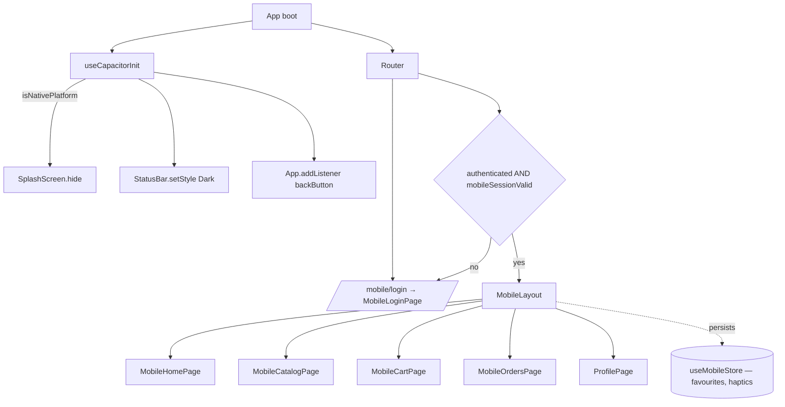

<!-- STALE-V2 -->
> ⚠️ **DOC HISTORIQUE — PÉRIMÉE (V2), NE FAIT PLUS FOI.** Ce fichier décrit en grande partie l'architecture **V2** (mono-app AppGrav, npm/Vercel, PWA/Capacitor, projet Supabase `abjabuniwkqpfsenxljp` = **prod incompatible**, versions RPC obsolètes). **Ne jamais l'appliquer tel quel** (migration, config, archi). Sources de vérité actuelles : `CLAUDE.md` (patterns + workplan) et `docs/workplan/remise-a-plat/` (référence modules réel-vs-demandé). Hiérarchie complète : `docs/README.md`. Régénération depuis le code prévue en Phase 3.

# Module 18 — Mobile Shell

> Mobile-optimised shell for floor servers and managers on phones. Wraps a small set of mobile-first pages with a bottom-tab layout, mobile session management, and Capacitor-native bridges for Android (and PWA installable on iOS Safari).

---

## Vue d'ensemble

The Mobile module is a parallel UI for a smaller surface than the tablet:

- **Form factor**: phones (4.7"–7"), portrait. Bottom-tab navigation, single column, sheet-style modals.
- **Audience**: servers using their own phones (BYOD), managers on the move.
- **Routes**: `/mobile/*`, with `/mobile/login` outside the auth gate.
- **State**: `useMobileStore` (Zustand + persist) — owns mobile-specific concerns (session timeout, lockout, current order draft, sent-orders history, favourites, haptics setting).
- **Auth**: identity (user, roles, permissions) lives in `authStore`. `mobileStore` adds a *mobile session* on top: independent timeout (`sessionTimeoutMinutes`), 3-strike lockout (30 s), session validity check on every render of `MobileLayout`.

Two delivery modes:

| Mode               | Trigger                               | Capabilities                                                         |
| ------------------ | ------------------------------------- | -------------------------------------------------------------------- |
| **PWA**            | Browser visit + "Add to Home Screen"  | Service worker, offline fallback, install prompt via `usePWAInstall` |
| **Capacitor APK**  | Native Android wrap (`npm run android:build`) | Native splash, status bar theming, hardware back button, `VITE_PLATFORM=android` |

---

## Diagramme



---

## Tables DB

The mobile shell does not introduce new tables. It consumes the same schema as POS:

| Table             | Rôle                              |
| ----------------- | --------------------------------- |
| `orders`          | Sent orders                       |
| `order_items`     | Lines                             |
| `products`        | Catalogue                         |
| `categories`      | Filters                           |
| `user_profiles`   | Mobile login (PIN or email+password) |

Stored client-side via Zustand `persist` middleware (key `mobile-store`):

- `favoriteProducts: string[]`
- `hapticEnabled: boolean`
- `sessionTimeoutMinutes: number` (default 30)

Volatile (not persisted) state: current order draft, sent orders, login attempts, lockout.

---

## Hooks

| Hook                 | Path                                         | Rôle                                                             |
| -------------------- | -------------------------------------------- | ---------------------------------------------------------------- |
| `useCapacitorInit`   | `src/hooks/useCapacitorInit.ts`              | Hides splash, configures status bar, intercepts Android back btn |
| `usePWAInstall`      | `src/hooks/usePWAInstall.ts`                 | Tracks `beforeinstallprompt`, exposes `promptInstall()` + `isInstalled` |
| `useMobileAuth`      | `src/hooks/auth/useMobileAuth.ts`            | Mobile-specific PIN/email login flow                             |
| `useSessionTimeout`  | `src/hooks/auth/useSessionTimeout.ts`        | Inactivity logout (configurable via `pos_config.session_timeout_minutes`) |
| `useMobileStore`     | `src/stores/mobileStore.ts`                  | Mobile-only state (see Stores)                                   |
| `useAuthStore`       | `src/stores/authStore.ts`                    | Identity, permissions                                            |
| `useProducts`        | `src/hooks/products/useProducts.ts`          | Product list                                                     |

`useCapacitorInit` is called once from the app root (`App.tsx` or `main.tsx`) — it's a no-op on web (`Capacitor.isNativePlatform()` returns `false`).

---

## Services

The mobile shell reuses standard services. No mobile-only service layer.

| Service                          | Used by                                      |
| -------------------------------- | -------------------------------------------- |
| `src/services/authService.ts`    | Login flow (PIN or Supabase email)           |
| `src/services/storage/`          | Image uploads (avatar, optional attachments) |
| `src/lib/supabase.ts`            | All DB calls                                 |

Capacitor plugin imports (consumed inside hooks/components, not wrapped in a service):

```ts
import { Capacitor } from '@capacitor/core'
import { App } from '@capacitor/app'
import { SplashScreen } from '@capacitor/splash-screen'
import { StatusBar, Style } from '@capacitor/status-bar'
import { Keyboard } from '@capacitor/keyboard'
```

---

## Composants UI

| Composant            | Path                                       | Rôle                                              |
| -------------------- | ------------------------------------------ | ------------------------------------------------- |
| `MobileLayout`       | `src/components/mobile/MobileLayout.tsx`   | Header (logo + user) + `<Outlet />` + bottom-tab nav (Home / Products / Orders / Profile) with badge for ready orders |
| `MobileLoginPage`    | `src/pages/mobile/MobileLoginPage.tsx`     | PIN/email login, lockout countdown                |
| `MobileHomePage`     | `src/pages/mobile/MobileHomePage.tsx`      | Quick stats, ready orders shortcuts               |
| `MobileCatalogPage`  | `src/pages/mobile/MobileCatalogPage.tsx`   | Touch product browser with favourites tab         |
| `MobileCartPage`     | `src/pages/mobile/MobileCartPage.tsx`      | Current draft order + "Send to Kitchen"           |
| `MobileOrdersPage`   | `src/pages/mobile/MobileOrdersPage.tsx`    | Sent-orders list with status updates              |
| `ProfilePage`        | `src/pages/profile/ProfilePage.tsx`        | Shared with desktop (PIN reset, sessions)         |

UI conventions:

- Bottom-tab nav, **64 px** tap targets minimum, thumb-zone optimised.
- Modals = full-screen sheets sliding from bottom.
- Loading = skeletons (`src/components/ui/Skeleton.tsx`).
- Haptic feedback gated on `useMobileStore.hapticEnabled` (Capacitor `Haptics.impact()`).

---

## Stores

### `useMobileStore` (`src/stores/mobileStore.ts`) — `persist` middleware

```ts
{
  // Mobile session (separate from authStore)
  sessionExpiresAt: string | null,
  loginAttempts: number,
  lockoutUntil: string | null,

  // Order draft
  currentOrder: IMobileOrder | null,
  selectedTableNumber: string | null,

  // History
  sentOrders: ISentOrder[],

  // Personalisation (PERSISTED)
  favoriteProducts: string[],
  hapticEnabled: boolean,
  sessionTimeoutMinutes: number,
}
```

Key actions:

- **Session**: `startMobileSession()`, `clearMobileSession()`, `extendSession()`, `isMobileSessionValid()` (returns boolean — `MobileLayout` uses this in a `useEffect` to redirect to `/mobile/login` when invalid).
- **Lockout**: `incrementLoginAttempts()` triggers lockout after **3** attempts (`MAX_LOGIN_ATTEMPTS`) for **30 s** (`LOCKOUT_DURATION_MS`).
- **Order**: `selectTable()`, `addItem()`, `updateItemQuantity()`, `removeItem()`, `clearOrder()`, `markOrderSent(orderId, orderNumber)`.
- **Favourites**: `toggleFavorite(productId)`, `isFavorite(productId)`.

`partialize` whitelists only `favoriteProducts`, `hapticEnabled`, `sessionTimeoutMinutes` for persistence — session tokens, lockouts, and draft orders are intentionally volatile (cleared on app restart).

---

## RPCs / Edge Functions

The mobile shell calls the same standard endpoints as the rest of the app:

| Function              | Used for                                       |
| --------------------- | ---------------------------------------------- |
| `auth-verify-pin`     | PIN login from `MobileLoginPage`               |
| `auth-get-session`    | Session restoration on app cold start          |
| `auth-logout`         | Logout from `ProfilePage`                      |
| `set-user-pin`        | PIN change from profile                        |

No mobile-only Edge Function.

---

## RLS / Permissions

Identical to the rest of the app — mobile users authenticate with the same `user_profiles` row, get the same effective permissions through `usePermissions()`, and are subject to the same RLS policies. The mobile shell does **not** introduce any permission bypass.

Recommended role for floor servers: a `waiter` role with `sales.view`, `sales.create`, `customers.view`. Avoid granting `sales.void` or `payments.process` on phones.

---

## Routes

Defined in `src/routes/mobileRoutes.tsx`:

| Route                | Component             | Guard                                            |
| -------------------- | --------------------- | ------------------------------------------------ |
| `/mobile/login`      | `MobileLoginPage`     | None (public)                                    |
| `/mobile`            | `MobileLayout`        | `isAuthenticated` else redirect `/mobile/login`  |
| `/mobile` (index)    | `MobileHomePage`      | (inherited)                                      |
| `/mobile/catalog`    | `MobileCatalogPage`   | (inherited)                                      |
| `/mobile/cart`       | `MobileCartPage`      | (inherited)                                      |
| `/mobile/orders`     | `MobileOrdersPage`    | (inherited)                                      |
| `/mobile/profile`    | `ProfilePage`         | (inherited)                                      |

`MobileLayout` adds a second-level mobile-session check: `if (!isMobileSessionValid()) navigate('/mobile/login')` on every render.

---

## Capacitor Native Specifics

`capacitor.config.ts`:

```ts
appId: 'com.thebreakery.appgrav',
appName: 'The Breakery POS',
webDir: 'dist',
server: { androidScheme: 'https', cleartext: false },
android: { allowMixedContent: false, captureInput: true, webContentsDebuggingEnabled: false },
plugins: {
  SplashScreen: { launchShowDuration: 2000, backgroundColor: '#111827', showSpinner: false },
  StatusBar:    { style: 'dark', backgroundColor: '#111827' },
  Keyboard:     { resize: 'body', style: 'dark' },
}
```

Highlights:

- **Kiosk-friendly**: `captureInput: true`, `webContentsDebuggingEnabled: false` in production.
- **HTTPS only**: `cleartext: false` — Supabase is HTTPS, no mixed content allowed.
- **Splash branding**: dark navy `#111827` matches Luxe Dark.
- **Back button**: `useCapacitorInit` intercepts and calls `window.history.back()` if `canGoBack`, otherwise no-op (does **not** exit the app — POS kiosk model).

Platform detection at runtime:

- `Capacitor.isNativePlatform()` — true on Android/iOS native, false on web.
- `import.meta.env.VITE_PLATFORM === 'android'` — set in `.env.android` for build-time branching.

---

## PWA

Configured via `vite-plugin-pwa` in `vite.config.ts`. Key behaviours:

- Service worker auto-registered on web build.
- `usePWAInstall` exposes `{ isInstallable, isInstalled, isIOS, isStandalone, promptInstall }`.
- iOS detection (`isIOS`) is needed because `beforeinstallprompt` does not fire on iOS Safari — instead, the page must show a manual "Tap Share → Add to Home Screen" instruction.
- Standalone detection: `(navigator as INavigatorStandalone).standalone === true` OR `window.matchMedia('(display-mode: standalone)').matches`.

---

## Flows E2E

### Flow A — Cold start (PWA)

1. User opens PWA → `App.tsx` mounts → `useCapacitorInit()` is a no-op on web
2. Router mounts → `/` redirects according to auth
3. `useAuthStore` rehydrates session from `localStorage` (or `auth-get-session` Edge Function)
4. If authenticated and on a phone, user navigates to `/mobile` → `MobileLayout` checks `isMobileSessionValid()` → redirects to `/mobile/login` if expired
5. Login → `startMobileSession()` sets `sessionExpiresAt = now + 30 min`
6. Bottom tabs become available

### Flow B — Cold start (Capacitor APK)

1. APK launches → native splash visible (dark navy 2000 ms)
2. JS bundle loads → `useCapacitorInit()`:
   - `SplashScreen.hide()` — splash fades out (500 ms via `launchFadeOutDuration`)
   - `StatusBar.setStyle({ style: Dark })` + `setBackgroundColor({ color: '#111827' })`
   - `App.addListener('backButton', …)` — registered for the app lifetime
3. Same routing flow as PWA

### Flow C — Send order from mobile

1. Server picks products → `useMobileStore.addItem()` builds `currentOrder.items`
2. Server taps "Send to Kitchen" on `MobileCartPage`
3. Page calls Supabase insert (similar pattern to tablet) → returns `orderId`, `orderNumber`
4. `markOrderSent(orderId, orderNumber)` archives the draft into `sentOrders` and clears `currentOrder`
5. KDS picks up via Realtime subscription on `orders`

### Flow D — Failed login + lockout

1. Server enters wrong PIN → `incrementLoginAttempts()` → counter goes from 0 → 1
2. Repeats twice more → counter hits `MAX_LOGIN_ATTEMPTS = 3` → `lockoutUntil = now + 30s` set
3. `MobileLoginPage` shows countdown, disables submit button
4. After 30 s, page polls `lockoutUntil > now` → re-enables form
5. Successful login → `resetLoginAttempts()`

---

## Pitfalls

- **Two session concepts**: `authStore.isAuthenticated` (Supabase identity) is *necessary but not sufficient* for mobile. `useMobileStore.isMobileSessionValid()` adds a stricter timeout. If you patch one, audit the other.
- **`partialize` whitelist**: only `favoriteProducts`, `hapticEnabled`, `sessionTimeoutMinutes` are persisted. Adding a new "must survive restart" field requires updating `partialize` AND verifying the migration story (Zustand persist version bump if shape changes).
- **Hardware back button doesn't exit**: by design — POS kiosk model. If a manager device wants standard exit behaviour, branch on the route or user role inside the `backButton` listener.
- **iOS PWA caveats**: `beforeinstallprompt` never fires on iOS. `isInstallable` is always `false` there — show iOS-specific install instructions when `isIOS && !isStandalone`.
- **Service worker stale cache**: after a deploy, mobile users may run the old bundle until they hard-refresh or the SW updates. The plugin uses `registerType: 'autoUpdate'` (verify in `vite.config.ts`); communicate hot-fixes via in-app banner.
- **`MobileLayout` redirect loop risk**: the `useEffect` that redirects to `/mobile/login` depends on `isMobileSessionValid` being a *stable function*. Calling it inside the deps array works because the Zustand selector returns the same function reference across renders, but be cautious if you refactor to a derived boolean.
- **Capacitor plugin imports on web**: `@capacitor/splash-screen` etc. are safe to import on web — they no-op when not native — but tree-shaking may bundle them anyway. If bundle size matters, dynamic-import inside `useCapacitorInit`.
- **Keyboard overlap**: `Keyboard.resize: 'body'` mostly handles it on Android, but iOS PWA has no equivalent. Use `scroll-padding-bottom` on the form container as a fallback.
- **Test the actual APK**: behaviour can differ from PWA (Android WebView quirks, status bar height, safe areas). Run `npm run android:run` before each release.

---

## Voir aussi

- `05-integrations/04-capacitor-native.md` — Detailed Android/iOS build pipeline
- `05-integrations/05-pwa.md` — Service worker config, install UX, offline strategy
- `04-modules/01-auth-users.md` — Underlying PIN/session flow
- `04-modules/17-tablet-ordering.md` — Sibling shell for tablets (different cart impl)
