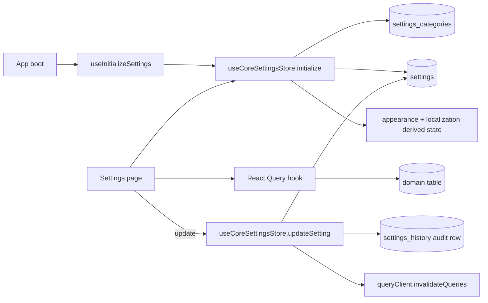

<!-- STALE-V2 -->
> ⚠️ **DOC HISTORIQUE — PÉRIMÉE (V2), NE FAIT PLUS FOI.** Ce fichier décrit en grande partie l'architecture **V2** (mono-app AppGrav, npm/Vercel, PWA/Capacitor, projet Supabase `abjabuniwkqpfsenxljp` = **prod incompatible**, versions RPC obsolètes). **Ne jamais l'appliquer tel quel** (migration, config, archi). Sources de vérité actuelles : `CLAUDE.md` (patterns + workplan) et `docs/workplan/remise-a-plat/` (référence modules réel-vs-demandé). Hiérarchie complète : `docs/README.md`. Régénération depuis le code prévue en Phase 3.

# 19 — Settings & Configuration

> **Last verified** : 2026-05-13
> **Structure** : ce fichier fusionne la **vue fonctionnelle** (le *pourquoi* et le *quoi* métier) et la **référence technique** (le *comment* implémenté). Pour les tâches à faire, voir [`../../workplan/backlog-by-module/19-settings-configuration.md`](../../workplan/backlog-by-module/19-settings-configuration.md).
> **Related E2E flows** : [00-login](../08-flows-end-to-end/00-login.md) (settings hydration boot), [10-end-of-day](../08-flows-end-to-end/10-end-of-day.md) (lecture taxe + payment methods).
> **App de rattachement** : Backoffice (administration).

> **En une phrase** : le module Settings est l'interrupteur central de The Breakery — il transforme une application générique en boulangerie personnalisée, applique chaque changement en temps réel à toutes les caisses, et garde la trace écrite de qui a changé quoi quand — pour qu'aucun réglage ne soit ni perdu, ni anonyme, ni irréversible.

---

## Table des matières

- [Partie I — Vue fonctionnelle](#partie-i--vue-fonctionnelle)
  - [1. Raison d'être](#1-raison-dêtre)
  - [2. Les 6 grandes familles de réglages](#2-les-6-grandes-familles-de-réglages-les-6-groupes-du-menu)
  - [3. Les 5 invariants du module](#3-les-5-invariants-du-module)
  - [4. Groupe **General** — Identité de la boutique](#4-groupe-general--identité-de-la-boutique)
  - [5. Groupe **Sales & POS** — Comportement de la caisse](#5-groupe-sales--pos--comportement-de-la-caisse)
  - [6. Groupe **Operations** — Stock, catalogue, cuisine](#6-groupe-operations--règles-métier-du-stock-du-catalogue-et-de-la-cuisine)
  - [7. Groupe **Commerce** — Conditions B2B](#7-groupe-commerce--conditions-b2b)
  - [8. Groupe **System** — Infra, sécurité, RBAC](#8-groupe-system--infrastructure-sécurité-rbac)
  - [9. Groupe **Layout** — Plan de salle](#9-groupe-layout--plan-de-salle)
  - [10. Mécaniques transverses](#10-mécaniques-transverses--comment-le-module-se-comporte)
  - [11. Ce que le module ne fait **pas**](#11-ce-que-le-module-ne-fait-pas-par-design)
- [Partie II — Référence technique](#partie-ii--référence-technique)
  - [12. Vue d'ensemble technique](#12-vue-densemble-technique)
  - [13. Diagramme](#13-diagramme)
  - [14. Tables DB](#14-tables-db)
  - [15. Hooks](#15-hooks-20)
  - [16. Services](#16-services)
  - [17. Composants UI (30)](#17-composants-ui-30)
  - [18. Stores Zustand utilisés](#18-stores-zustand-utilisés)
  - [19. RPCs / Edge Functions](#19-rpcs--edge-functions)
  - [20. RLS / Permissions](#20-rls--permissions)
  - [21. Routes (24 pages principales)](#21-routes-24-pages-principales)
  - [22. Flows E2E](#22-flows-e2e)
  - [23. Pitfalls](#23-pitfalls)
- [Partie III — Backlog opérationnel](#partie-iii--backlog-opérationnel)
- [Partie IV — Design & UX](#partie-iv--design--ux)
  - [24. Thèmes et contextes d'affichage](#24-thèmes-et-contextes-daffichage)
  - [25. Écrans du module (24+ routes)](#25-écrans-du-module-24-routes)
  - [26. Layout patterns appliqués](#26-layout-patterns-appliqués)
  - [27. Composants UI signature](#27-composants-ui-signature)
  - [28. États visuels critiques](#28-états-visuels-critiques)
  - [29. Couleurs sémantiques utilisées](#29-couleurs-sémantiques-utilisées)
  - [30. Microcopy et empty states](#30-microcopy-et-empty-states)
  - [31. Références visuelles externes](#31-références-visuelles-externes)
  - [32. À faire côté design (backlog UX)](#32-à-faire-côté-design-backlog-ux)

---

# Partie I — Vue fonctionnelle

## 1. Raison d'être

Le module Settings est la **salle de contrôle** de The Breakery. Il répond à une question simple mais structurante pour un gérant qui veut que son ERP/POS colle à *sa* boulangerie et pas à un modèle générique :

> *"Comment je règle l'application pour qu'elle reflète ma boutique : mes horaires, ma taxe, mes méthodes de paiement, mes catégories produits, mes imprimantes, mes droits staff, mon plan de salle, mon programme fidélité ?"*

C'est le module qui transforme une **application générique** en **outil sur-mesure** pour The Breakery. Sans lui, l'app ne sait pas que la TVA s'appelle PB1, qu'elle vaut 10 %, qu'elle est incluse dans les prix, que le café se livre à la table, que le ticket cuisine s'imprime sur la KitchenStar du four, que Made peut faire des remises jusqu'à 10 % mais pas Putu, et que la session caisse se ferme automatiquement après 30 minutes d'inactivité.

Le module est **transverse** : chaque autre module (POS, Inventory, Customers, Accounting, KDS…) **lit** ici sa configuration. Une modification dans Settings se propage en temps réel à toute l'application.

---

## 2. Les 6 grandes familles de réglages (les 6 groupes du menu)

Le module est structuré en **6 groupes** correspondant à 6 territoires de configuration distincts :

| Groupe | Job-to-be-done | Pages |
|---|---|---|
| **General** | Identité de l'entreprise, horaires, taxe | 3 |
| **Sales & POS** | Comportement de la caisse, paiements, fidélité | 3 |
| **Operations** | Stock, catalogue, cuisine, display client | 5 |
| **Commerce** | B2B (wholesale, crédit, conditions) | 1 |
| **System** | Imprimantes, notifications, sécurité, RBAC, audit, réseau LAN | 9 |
| **Layout** | Plan de salle, sections | 2 |

Au total **~23 pages de réglages** (24 routes principales + sous-folders). Toutes partagent la même mécanique : un formulaire, un bouton "Save", un retour visuel "Saved", et une trace écrite dans l'historique pour qui-a-changé-quoi-quand.

---

## 3. Les 5 invariants du module

Quelle que soit la page consultée, l'utilisateur retrouve toujours les mêmes mécaniques — c'est ce qui rend le module rassurant :

1. **Sauvegarde explicite**. Aucune modification n'est appliquée tant que l'utilisateur n'a pas cliqué "Save". Pas d'effet de bord caché en quittant la page.
2. **Historique systématique**. Chaque changement est tracé (qui, quoi, quand, ancienne valeur, nouvelle valeur) dans `settings_history`. Aucune modification n'est anonyme.
3. **Permission requise**. L'accès aux Settings est protégé par `settings.view` (lecture) et `settings.update` (écriture). Certaines pages réseau ont leur propre permission (`settings.network`).
4. **Propagation temps réel**. Les valeurs sont lues via Supabase Realtime + stores Zustand — un changement de taxe à 11 h pendant une vente s'applique sur la transaction suivante sans relogin.
5. **Defaults raisonnables**. Tout réglage a une valeur par défaut cohérente pour une boulangerie indonésienne ; le module ne casse jamais l'app si une valeur manque.

---

## 4. Groupe **General** — Identité de la boutique

C'est le tout premier groupe à remplir le jour où on installe The Breakery. Il définit **qui est l'entreprise** aux yeux du système et de ses tickets.

### 4.1 Company

Permettre au gérant de saisir l'identité officielle de la boutique :

- Nom commercial, adresse, téléphone, e-mail, site web.
- Logo (affiché sur l'en-tête des tickets, factures, PDF de rapports).
- NPWP (identifiant fiscal indonésien) — apparaît sur les factures B2B officielles.
- Devise par défaut (IDR).

Bénéfice métier : **donner une identité visuelle et légale** à tous les documents sortants. Un ticket sans logo et sans NPWP n'a pas la même crédibilité face à un client B2B ou à un contrôleur fiscal.

### 4.2 Business Hours

Définir les horaires d'ouverture par jour de la semaine. Ces horaires servent à :

- Afficher les horaires sur le ticket et la page publique.
- Marquer une transaction comme "hors horaire" dans les rapports d'audit (signal de fraude potentielle).
- Permettre des règles de pricing horaire (happy hour) à terme.

Bénéfice métier : **objectiver ce qui est normal**. Une vente à 23 h dans une boulangerie qui ferme à 19 h ne déclenche pas une notification : elle devient un point rouge dans l'audit, à vérifier.

### 4.3 Tax

Le réglage **le plus critique** du module pour la conformité. Configurer la taxe applicable :

- **Nom** : PB1 (Pajak Restoran — taxe restaurant locale, **pas la TVA / PPN**).
- **Taux** : 10 % (fixé par la réglementation locale, n'a pas vocation à bouger).
- **Mode** : **inclus** dans les prix (formule de calcul : `tax = total × 10/110`).
- **Comptes comptables associés** : 2143 (PB1 payable).

Bénéfice métier : **séparer le chiffre d'affaires de la dette fiscale** sans demander au gérant de faire le calcul. Chaque vente alimente automatiquement la déclaration PB1 mensuelle. Une erreur ici (taux à 11 %, mode "hors taxe") fausserait toute la comptabilité — d'où la protection en édition (permission `settings.update` + log historique).

---

## 5. Groupe **Sales & POS** — Comportement de la caisse

C'est ici que le gérant **personnalise l'expérience caisse** : ce qui s'imprime automatiquement, ce qui est obligatoire, ce qui est interdit.

### 5.1 POS Configuration

Régler ~15 toggles qui pilotent le comportement de la caisse en direct :

| Toggle | Effet métier |
|---|---|
| Auto-print receipt | Imprimer automatiquement le ticket à la fin d'une commande payée. |
| Auto-send to kitchen | Envoyer automatiquement les items à la KDS à la création de la commande. |
| Print kitchen ticket | Imprimer un ticket cuisine en plus de l'envoi KDS. |
| Lock kitchen items | Les items envoyés en cuisine ne peuvent plus être modifiés sans PIN manager. |
| Require PIN to remove locked item | Renforcement de la règle ci-dessus. |
| Sound notifications | Activer / couper les bips de la caisse. |
| Customer display | Afficher la commande sur un second écran client. |
| Require customer on order | Refuser de finaliser une commande sans client assigné (utile pour la fidélité). |
| Allow oversell | Autoriser la vente d'un produit en rupture (mode dépannage). |
| Auto-logout on order complete | Déconnecter le cashier après chaque commande (mode "caisse partagée"). |
| Session timeout | Durée d'inactivité avant déconnexion automatique (défaut 30 min). |
| Virtual keypad default | Activer le clavier virtuel pour les inputs numériques. |

Bénéfice métier : **adapter la caisse au tempo de la boutique**. Une boulangerie tranquille active "Auto-logout" parce que la cashier va et vient en cuisine ; un rush du midi désactive "Require customer on order" pour ne pas ralentir la file.

### 5.2 Payment Methods

Activer / désactiver et ordonner les méthodes de paiement disponibles à la caisse :

- Cash (toujours actif, fond de caisse par session).
- Card (Visa, Mastercard, JCB) avec ou sans commission.
- QRIS (norme Indonésie unifiée).
- E-wallets (GoPay, OVO, DANA, ShopeePay).
- Bank transfer (paiement déféré, validation manuelle).
- B2B credit (paiement à terme, lié au crédit client).
- POS outstanding (ardoise informelle, à régler plus tard).

Pour chaque méthode : libellé, icône, ordre d'affichage, frais éventuels, compte comptable de débit.

Bénéfice métier : **refléter exactement les moyens de paiement réellement acceptés** ce mois-ci. Si la machine carte tombe en panne ou si un nouveau wallet débarque, le gérant l'active / désactive en un clic.

### 5.3 Loyalty Program

Configurer le programme de fidélité The Breakery :

- **Ratio** : 1 point = 1 000 IDR dépensés (modifiable via `loyalty.points_per_currency_unit`).
- **Paliers** : Bronze (0 pts, 0 % de remise), Silver (500 pts, 5 %), Gold (2 000 pts, 8 %), Platinum (5 000 pts, 10 %).
- **Bonus anniversaire** : points doublés / fixe sur l'anniversaire client.
- **Date d'expiration** : durée de validité des points (défaut : jamais).
- **Descriptions par palier** affichées au client.

Bénéfice métier : **garder la main sur la générosité du programme** sans toucher au code. Le gérant peut ajuster les seuils Silver→Gold→Platinum quand le portefeuille client mûrit, ou lancer un événement "x2 points ce week-end" sans développeur.

---

## 6. Groupe **Operations** — Règles métier du stock, du catalogue et de la cuisine

Ce groupe pilote le **fonctionnement opérationnel** de l'arrière-boutique.

### 6.1 Inventory Configuration

Régler les seuils et comportements du stock :

- Seuil d'alerte stock bas (`inventory.low_stock_warning`, défaut < 10).
- Seuil d'alerte critique (`inventory.low_stock_critical`, défaut < 5).
- Activer ou non le suivi en lot (FIFO, dates de péremption).
- Politique de gestion des fractions d'unité (autoriser ou pas les 0,5 kg).
- Auto-recalcul du coût moyen pondéré à chaque réception.

Bénéfice métier : **calibrer les alertes au rythme réel** de chaque produit. Le seuil par défaut est trop bas pour la farine (consommation forte) et trop haut pour la vanille (consommation marginale).

### 6.2 Product Categories

Définir l'**arborescence catalogue** :

- Liste des catégories (Pains, Viennoiseries, Boissons, Plats salés, Sandwichs, Pâtisseries…).
- Couleur de catégorie pour l'affichage caisse.
- Catégorie parente pour les sous-catégories.
- Ordre d'affichage dans la grille produit.

Bénéfice métier : **classer les produits comme on les pense**. Une catégorisation propre divise le temps d'encaissement par deux en heure de pointe.

### 6.3 Product Types

Distinguer les **natures** de produit qui ne se gèrent pas pareil :

- Standard (vendu en pièce, géré en stock simple).
- Recette (produit fini issu d'une recette qui déduit ses ingrédients).
- Combo (produit composé d'autres produits).
- Service (pas de stock — frais de livraison, supplément…).
- Matière première (jamais vendu en caisse, uniquement consommé en production).

Bénéfice métier : **éviter qu'un sandwich décompte simplement "1 sandwich"** alors qu'il devrait décompter 200 g de pain, 50 g de jambon et 30 g de salade. Les types pilotent toute la logique stock du module.

### 6.4 KDS Configuration

Régler la **Kitchen Display System** :

- Stations de préparation (Pain, Pâtisserie, Boissons, Plats salés…) — table `kds_stations`.
- Routage automatique des items vers la bonne station selon la catégorie.
- Seuils de couleur (vert / orange / rouge) selon l'âge de la commande.
- Bip sonore à l'arrivée d'un nouvel item.
- Format d'affichage (gros / petit, ticket par ticket ou liste consolidée).
- `kds.auto_print_kitchen` (défaut true).

Bénéfice métier : **adapter la KDS au workflow réel** de chaque poste. Un poste pâtisserie (commandes lentes, peu de volume) n'a pas les mêmes besoins qu'un poste boissons (rush, commande de 2 minutes).

### 6.5 Customer Display

Configurer l'**écran client** (second écran face au client) :

- `display.idle_timeout_seconds` (défaut 30).
- `display.promo_rotation_seconds` (défaut 10).
- Afficher logo, slogan, message d'accueil rotatif.
- Afficher le détail du ticket en cours.
- Afficher les promotions actives.
- Afficher les points fidélité gagnés à la commande.

Bénéfice métier : **valoriser le programme fidélité et la transparence prix**. Le client voit ses points monter en direct → le programme passe d'abstrait à tangible.

---

## 7. Groupe **Commerce** — Conditions B2B

### 7.1 B2B Settings

Définir les **règles transverses des ventes B2B** :

- Conditions de paiement par défaut pour les nouveaux clients B2B (COD, net 7, net 14, net 30, net 60).
- Plafond de crédit par défaut.
- Workflow d'approbation des commandes B2B (auto / un niveau / deux niveaux).
- Numérotation des factures B2B (préfixe, format, séquence annuelle ou continue).
- Templates de facture (en-tête, mentions légales, conditions générales).
- `b2b.invoice_due_days` (défaut 14).

Bénéfice métier : **standardiser les règles commerciales B2B** sans devoir les ressaisir à chaque nouveau client. Quand un hôtel ouvre un compte, ses conditions par défaut sont déjà calibrées sur ce que le gérant a décidé pour son segment.

---

## 8. Groupe **System** — Infrastructure, sécurité, RBAC

C'est le groupe **administrateur** par excellence. Il pilote tout ce qui touche au système, à la sécurité et à la traçabilité.

### 8.1 Printing

Configurer les **imprimantes physiques** et leur routage :

- Liste des imprimantes connectées (USB, Bluetooth, IP réseau) — table `printer_configurations`.
- Type d'imprimante (thermique 80mm / 58mm, A4, étiquettes).
- Affectation au rôle : reçu client, ticket cuisine, ticket barista, étiquettes prix.
- Largeur du papier, vitesse, marges.
- Test d'impression direct depuis la page.

Bénéfice métier : **router le bon document vers la bonne imprimante** sans avoir à reconfigurer Windows à chaque rotation de matériel. Un changement d'imprimante cuisine se fait dans Settings en 30 secondes, pas en 30 minutes d'IT.

### 8.2 Notifications

Régler les canaux et seuils des notifications :

- Stock bas / critique (par produit ou global).
- Session caisse anormale (écart > X IDR).
- Tentative de PIN manager échouée.
- Commande B2B en attente d'approbation.
- Erreur d'impression / d'envoi cuisine.

Pour chaque type : activer le toast en app, le son, l'e-mail (template via `email_templates`), le push mobile.

Bénéfice métier : **ne pas être noyé sous les alertes inutiles** tout en ne ratant pas les vrais signaux. Chaque gérant calibre son seuil de stress.

### 8.3 Security & PIN

Régler la **politique d'authentification PIN** :

- Longueur minimale (défaut : 4 chiffres).
- Durée de validité d'un PIN avant changement obligatoire.
- Nombre de tentatives avant verrouillage du compte (défaut 5).
- Durée du verrouillage automatique (défaut 15 min).
- `pos.session_timeout_minutes` (défaut 30).
- Activation de la double authentification pour les opérations sensibles (void, refund, settings update).

Bénéfice métier : **équilibrer sécurité et friction**. Un PIN à 4 chiffres avec verrouillage après 5 essais arrête 99 % des tentatives de fraude staff sans gêner les cashiers honnêtes.

### 8.4 Financial / Accounting

Configurer les **paramètres comptables** transverses :

- Plan comptable de référence (SAK EMKM / SAK ETAP).
- Numérotation des écritures journal (préfixe, séquence annuelle / continue).
- Comptes par défaut pour les automatismes (compte cash, compte ventes, compte COGS, compte expenses).
- Date de clôture exercice (défaut : 31 décembre).
- Premier mois fiscal.

Bénéfice métier : **caler la compta automatique sur la réalité indonésienne** sans devoir mapper à la main chaque écriture journal.

### 8.5 Roles & Permissions

Le module **RBAC** (Role-Based Access Control) de l'application. Permet au gérant ou à l'admin de :

- Créer des rôles métier (Owner, Manager, Cashier, Barista, Kitchen, Accountant, Stockman…).
- Affecter ~70 permissions atomiques à chaque rôle (`sales.create`, `sales.void`, `sales.discount`, `inventory.adjust`, `customers.loyalty`, `accounting.manage`…).
- Attribuer un rôle à chaque utilisateur.
- Modifier en masse (mêmes droits pour tous les cashiers).
- Cloner un rôle existant pour créer une variante.

Cette page partage son UI avec `/users/permissions` (cf. [`./01-auth-permissions.md`](./01-auth-permissions.md)) — c'est juste un point d'entrée différent dans la matrice rôles × permissions.

Bénéfice métier : **donner à chacun strictement les droits dont il a besoin**, ni plus ni moins. Un cashier qui ne peut pas voir le P&L ne peut pas le partager dehors ; un barista qui ne peut pas voider une commande ne peut pas frauder par annulation.

### 8.6 Audit Log

Consulter le **journal de tous les événements sensibles** du système (cf. [`./01-auth-permissions.md`](./01-auth-permissions.md) §8). Ce n'est pas un réglage en soi mais une lecture des traces générées par tous les autres modules :

- Connexion / déconnexion utilisateur.
- Modification de permission ou de rôle.
- Modification de paramètre Settings.
- Suppression de produit, de client, d'employé.
- Annulation de commande, remise au-delà du seuil.
- Ajustement manuel de points fidélité ou de stock.

Filtrable par utilisateur, type d'événement, période.

Bénéfice métier : **le filet de sécurité ultime**. En cas de litige ou de fraude soupçonnée, ce journal donne la **réponse datée et signée**.

### 8.7 LAN Network

Visualiser et configurer le **réseau local** multi-appareils de The Breakery (table `lan_nodes`) :

- Hub principal (caisse principale qui orchestre).
- Clients connectés (autres caisses, KDS, displays, tablettes serveur).
- Heartbeat de chaque appareil (dernier signe de vie).
- État des canaux BroadcastChannel et Supabase Realtime.
- Test de connectivité hub ↔ client.

Bénéfice métier : **diagnostiquer en direct un problème réseau** sans appeler l'IT. Si une KDS ne reçoit plus les commandes, le gérant voit immédiatement si c'est un problème hub, client, ou réseau.

### 8.8 Network Devices

Enregistrer et identifier chaque **appareil physique** (table `device_configurations`) — terminal POS, KDS, display, tablette serveur, imprimante réseau :

- Nom de l'appareil et son rôle.
- Adresse IP / hostname.
- Type et modèle.
- Localisation physique (Cuisine, Comptoir, Salle, Caisse 1, Caisse 2…).
- Statut d'activation.

Bénéfice métier : **un inventaire matériel toujours à jour**. Quand un appareil dysfonctionne, le gérant identifie en 5 secondes "la KDS pâtisserie côté four" plutôt que "la deuxième tablette".

### 8.9 Settings History

Consulter l'historique de **tous les changements de paramètres** (table `settings_history`) :

- Quel paramètre a été modifié.
- Ancienne valeur → nouvelle valeur.
- Qui a fait le changement.
- Quand exactement.
- Reason optionnel.

Filtrable et exportable.

Bénéfice métier : **comprendre pourquoi quelque chose ne marche plus**. Le ticket cuisine ne s'imprime plus depuis lundi ? Settings History montre que le toggle "Print kitchen ticket" a été désactivé dimanche soir par tel utilisateur — diagnostic en 10 secondes.

---

## 9. Groupe **Layout** — Plan de salle

### 9.1 Floor Plan

Dessiner le **plan de salle** de la boutique en mode visuel (drag & drop via `FloorPlanEditor`) :

- Positionner les tables avec leur numéro et leur capacité.
- Définir les zones (Salle principale, Terrasse, Comptoir, Privatif).
- Indiquer les éléments fixes (mur, bar, entrée).
- Réutiliser le plan dans le module POS pour le mode Dine-in et la prise de commande à table.

Bénéfice métier : **donner aux serveurs et au caissier la même carte mentale** de la salle. La table 7 est la table 7 dans l'app exactement où elle se trouve physiquement, ce qui supprime les erreurs d'envoi.

### 9.2 Sections

Définir les **sections logiques** au-delà du plan visuel :

- Sections de salle (Terrasse, Salle, Privé, Bar).
- Affectation des tables à une section.
- Affectation des serveurs à une section (un serveur ne voit que ses tables).
- Statut actif / inactif (terrasse fermée en cas de pluie).

Bénéfice métier : **organiser le service** en équipes responsables de leur secteur, et désactiver une zone d'un clic sans réorganiser tout le plan.

---

## 10. Mécaniques transverses — Comment le module se comporte

Au-delà du contenu page par page, le module garantit trois mécaniques essentielles à la robustesse globale de l'application.

### 10.1 Propagation temps réel

Toute modification est :

1. Persistée dans la table `settings` Supabase.
2. Diffusée via Realtime à tous les clients connectés (caisses, KDS, displays).
3. Re-hydratée dans le store Zustand approprié.
4. Re-render automatique des composants qui consomment le réglage.

Latence typique : **< 2 secondes** d'un poste à l'autre.

### 10.2 Versioning et rollback

Chaque modification crée une nouvelle entrée dans `settings_history`. Le rollback se fait en consultant l'historique et en réappliquant manuellement l'ancienne valeur (pas de bouton "revert" automatique — choix de design pour forcer l'utilisateur à comprendre ce qu'il restaure).

### 10.3 Cloisonnement par permissions

| Permission | Donne accès à |
|---|---|
| `settings.view` | Lecture de toutes les pages settings (sauf network) |
| `settings.update` | Écriture sur toutes les pages settings |
| `settings.network` | Lecture + écriture sur Printing, LAN, Network Devices uniquement |
| `users.roles` | Page Roles & Permissions + Audit Log |
| `accounting.vat.manage` | Tax rates uniquement |

Bénéfice métier : **séparer le technicien réseau du gérant**. L'IT externe a `settings.network` pour brancher une imprimante mais ne peut pas modifier la taxe ou les rôles staff.

---

## 11. Ce que le module ne fait **pas** (par design)

- Le module **ne crée pas d'utilisateurs**. La création de comptes utilisateur est dans `/users` (cf. [`./01-auth-permissions.md`](./01-auth-permissions.md)). Settings ne gère que la définition des rôles et l'affectation des permissions à un rôle.
- Le module **ne modifie pas le catalogue produit** (sauf la définition des catégories et des types). L'ajout d'un produit reste dans `/products`.
- Le module **ne change pas les prix produits**. La pricing est dans le module Products / Categories.
- Le module **ne fait pas de migration de données**. Changer une devise ou un plan comptable en cours d'exercice impose de passer par un script dédié — Settings refuse les changements à conséquence rétroactive massive.
- Le module **n'a pas de mode "wizard d'installation"**. Chaque page est autonome et accessible dans n'importe quel ordre — c'est au gérant ou à l'intégrateur de connaître son chemin.

---

# Partie II — Référence technique

## 12. Vue d'ensemble technique

Centralised configuration surface for the entire app. Combine une table générique key/value `settings` (avec catégorie, value-type, history) et des tables business dédiées (tax rates, payment methods, business hours, printers, etc.). Powered by `useCoreSettingsStore` + un fan-out de React Query hooks.

The Settings module is the broadest in the codebase : **42 pages** under `src/pages/settings/`, **30 components** in `src/components/settings/`, **20 hooks** in `src/hooks/settings/`, and a multi-source state machine.

Two storage paradigms coexist :

| Paradigm | Tables | Access |
|---|---|---|
| **Generic key/value** | `settings_categories`, `settings`, `settings_history` | `useCoreSettingsStore.getSetting('appearance.theme')` |
| **Domain-specific tables** | `tax_rates`, `payment_methods`, `business_hours`, `printer_configurations`, `terminal_settings`, `kds_stations`, `display_promotions`, `app_settings`, `roles`, `permissions`, `sound_assets`, `email_templates`, `receipt_templates` | Dedicated React Query hooks (`useTaxRates`, `usePaymentMethods`, …) |

A facade keeps the import surface stable : `src/stores/settingsStore.ts` re-exports from `src/stores/settings/coreSettingsStore.ts` so legacy `import { useSettingsStore } from '@/stores/settingsStore'` continues to work.

---

## 13. Diagramme



---

## 14. Tables DB

### Generic settings core (`009_system_settings`)

| Table | Rôle |
|---|---|
| `settings_categories` | Top-level grouping (`code`, `name_*`, `icon`, `sort_order`, `required_permission`) |
| `settings` | Individual keys (`key`, `value` JSONB, `value_type`, `default_value`, `validation_rules`, `is_system`, `is_readonly`, `is_sensitive`, `requires_restart`) |
| `settings_history` | Audit trail — `setting_id`, `old_value`, `new_value`, `reason`, `changed_by`, `changed_at` |
| `app_settings` | Singleton-ish app-level config (kept for legacy) |

### Domain-specific tables (also in `009`, `010`)

| Table | Rôle |
|---|---|
| `tax_rates` | Tax definitions (PB1 10 %, etc.) |
| `payment_methods` | Cash, card, transfer, voucher, OVO, GoPay, etc. |
| `business_hours` | Per-day open/close + breaks |
| `printer_configurations` | Printer name, IP/serial, role (receipt/kitchen/barista) |
| `terminal_settings` | Per-terminal preferences |
| `email_templates` | Notification templates |
| `receipt_templates` | Custom receipt layouts |
| `kds_stations` | Kitchen station definitions |
| `sound_assets` | Notification chimes (KDS, display) |
| `settings_profiles` | Saved profiles (e.g. "default", "weekend hours") for fast switch |
| `lan_nodes` | LAN device runtime presence (consumed by `/settings/lan`) |
| `device_configurations` | Persistent per-device config (consumed by `/settings/devices`) |

### Important `settings` keys

| Key | Type | Default | Page |
|---|---|---|---|
| `appearance.theme` | string | `light` | (global, app-wide) |
| `appearance.primary_color` | string | `#2563eb` | (global) |
| `appearance.pos_layout` | enum | `grid` | POS Config |
| `appearance.pos_columns` | int | 4 | POS Config |
| `localization.default_language` | enum | `id` | (suspended — English only) |
| `localization.timezone` | string | `Asia/Makassar` | (global) |
| `localization.currency_code` | string | `IDR` | (global) |
| `pos.session_timeout_minutes` | int | 30 | Security PIN page |
| `pos.auto_print_receipt` | boolean | true | POS Config |
| `pos.virtual_keypad_default` | boolean | true | POS Config |
| `display.idle_timeout_seconds` | int | 30 | Display page |
| `display.promo_rotation_seconds` | int | 10 | Display page |
| `kds.auto_print_kitchen` | boolean | true | KDS Config page |
| `loyalty.points_per_currency_unit` | float | 0.001 | Loyalty page |
| `b2b.invoice_due_days` | int | 14 | B2B page |
| `inventory.low_stock_warning` | int | 10 | Inventory Config page |
| `inventory.low_stock_critical` | int | 5 | Inventory Config page |

(non-exhaustive — full list available via `SELECT key FROM settings ORDER BY key`)

---

## 15. Hooks (20)

Located under `src/hooks/settings/` — re-exported through `src/hooks/settings/index.ts`.

| Hook | Rôle |
|---|---|
| `useInitializeSettings` | One-shot bootstrap — calls `useCoreSettingsStore.initialize()` once |
| `useSettingsCategories` | Load `settings_categories` (5 min staleTime) |
| `useSettingsByCategory(code)` | Load `settings` filtered by category code |
| `useBusinessSettings` | (composite) basic company info |
| `useBusinessHolidays` | Holiday calendar overrides on top of `business_hours` |
| `useCategorySettings` | Product category config |
| `useModuleSettings` | Generic per-module getter |
| `useModuleConfigSettings` | Per-module config bundles (e.g. `useDisplaySettings`, `useKdsSettings`) |
| `useNotificationEvents` | Event types subscribable to notifications |
| `useNotificationSettings` | Per-user notification preferences |
| `usePOSAdvancedSettings` | POS advanced toggles (auto-print, virtual keypad, etc.) |
| `usePaymentSettings` | Per-method config (limits, fees, rounding) |
| `useRoles` | Roles + user_count + permission_ids (`update_role_permissions` mutation) |
| `useSections` | Floor sections for table mapping |
| `useSettingsCore` | Core CRUD : `useUpdateSetting`, `useResetSetting`, `useSettingHistory` |
| `useSettingsProfiles` | Manage saved settings profiles |
| `useSoundAssets` | Notification chime catalog |
| `useSystemHealth` | Sync queue depth, edge function up/down (`/settings/sync`) |
| `useTaxSettings` | `useTaxRates`, `useUpsertTaxRate`, `useDeleteTaxRate` |
| `useTerminalSettings` | Terminal registration, naming, station mapping |

`settingsKeys.ts` defines the React Query key factory : e.g. `settingsKeys.businessHours()`, `settingsKeys.settingsByCategory('appearance')`.

---

## 16. Services

| Service | Rôle |
|---|---|
| `src/services/settingsService.ts` | Lower-level wrapper used by `coreSettingsStore` for value coercion / parsing |

Most settings work goes directly through Supabase via the React Query hooks — there is intentionally minimal service indirection.

---

## 17. Composants UI (30)

`src/components/settings/` :

| Composant | Rôle |
|---|---|
| `SettingField` | Polymorphic input — renders text, number, boolean, JSON, enum based on `value_type` |
| `ModuleSettingsSection` | Collapsible card grouping settings of a module |
| `SettingsSectionsTab` | Top-level tab container for SettingsLayout |
| `CompanyFormFields` | Company info form fields |
| `CompanyLogoSection` | Logo upload (Supabase Storage) |
| `ArrayAmountEditor` | Editor for array<number> values (e.g. discount presets) |
| `DiscountPresetEditor` | Specific editor for discount preset list |
| `FloorPlanEditor` | Drag-and-drop floor-plan items editor |
| `NotificationSettingsSection` | Per-event notification toggles |
| `SectionModal` | CRUD modal for floor sections |
| `TaxRateModal`, `TaxRatesSection` | Tax rate CRUD |
| `TerminalRegistrationModal` | Register a new POS terminal |
| `TerminalSettingsSection` | Per-terminal config card |
| Sub-folders : `categories/`, `floor-plan/`, `pos-advanced/`, `roles/` | Specialised editors |

Page-level components live under `src/pages/settings/` (see §21 Routes).

---

## 18. Stores Zustand utilisés

### `useCoreSettingsStore` (`src/stores/settings/coreSettingsStore.ts`) — `persist` + Supabase

```ts
{
  categories: ISettingsCategory[],
  settings: Record<string, ISetting>,    // keyed by setting.key
  isLoading: boolean,
  isInitialized: boolean,
  error: string | null,
  appearance: IAppearanceSettings,        // derived from settings.appearance.*
  localization: ILocalizationSettings,    // derived from settings.localization.*
}
```

Key methods :

- `initialize()` — idempotent boot ; loads categories + all settings ; computes `appearance` and `localization` derived blobs
- `getSetting<T>(key)` — typed accessor with JSON parsing
- `getSettingsByCategory(code)` — filter cached settings by category
- `updateSetting(key, value, reason?)` — `UPDATE settings`, append `settings_history` row, update local cache
- `updateSettings(updates)` — batch update
- `resetSetting(key)` — restore default value
- `resetCategorySettings(code)` — bulk reset
- `setAppearance(updates)` / `setLocalization(updates)` — derived-state setters that fan-out to multiple `settings.*` keys

Persisté via `localStorage` for fast cold-start render of theme + currency before Supabase round-trip resolves.

### Selectors exported via facade

`src/stores/settingsStore.ts` re-exports : `useSettingsStore` (alias for `useCoreSettingsStore`), `selectTheme`, `selectPrimaryColor`, `selectLanguage`, `selectCurrency`, `selectDateFormat`, `selectTimeFormat`.

---

## 19. RPCs / Edge Functions

| Function | Rôle |
|---|---|
| `update_role_permissions(role_id, permission_ids[])` | Atomic permission set replacement (used by `useRoles`) |
| `set_user_pin(user_id, pin)` | Hashes and stores PIN (called from Security PIN settings) |
| `auth-user-management` (Edge) | User CRUD invoked from Roles/Users settings flows |
| `send-test-email` (Edge) | Sanity-check SMTP from Notifications page |

No dedicated settings Edge Function — the table is hit directly from the browser, RLS gates writes.

---

## 20. RLS / Permissions

| Table | Read | Write |
|---|---|---|
| `settings` | `is_authenticated()` | `user_has_permission(uid, 'settings.update')` |
| `settings_categories` | `is_authenticated()` | admin only |
| `settings_history` | `user_has_permission(uid, 'settings.update')` (read) | INSERT only via trigger / RPC |
| `tax_rates` | `is_authenticated()` | `accounting.vat.manage` |
| `payment_methods` | `is_authenticated()` | `settings.update` |
| `business_hours` | `is_authenticated()` | `settings.update` |
| `printer_configurations` | `is_authenticated()` | `settings.network` OR `settings.update` |
| `roles` | `is_authenticated()` | `users.roles` |
| `permissions` | `is_authenticated()` | system-only (seed) |
| `role_permissions` | `is_authenticated()` | `users.roles` via `update_role_permissions` RPC |

A dedicated `settings.network` permission lets cashiers manage printer/LAN devices without granting them full `settings.update` (POS terminals need to register printers without admin rights).

---

## 21. Routes (24 pages principales)

`SettingsLayout` (`src/pages/settings/SettingsLayout.tsx`) is the shell at `/settings`. It does an index redirect based on the user's permissions (sends cashiers straight to `/settings/printing` if they only have `settings.network`).

Wrapped by `ModuleErrorBoundary moduleName="Settings"` and `RouteGuard permissions={['settings.view', 'settings.network']}`.

| Route | Page | Permission |
|---|---|---|
| `/settings/company` | `CompanySettingsPage` | `settings.view` |
| `/settings/hours` | `BusinessHoursPage` | `settings.view` |
| `/settings/tax` | `TaxSettingsPage` | `settings.view` |
| `/settings/pos_config` | `POSConfigSettingsPage` | `settings.view` |
| `/settings/payments` | `PaymentMethodsPage` | `settings.view` |
| `/settings/loyalty` | `LoyaltySettingsPage` | `settings.view` |
| `/settings/inventory_config` | `InventoryConfigSettingsPage` | `settings.view` |
| `/settings/categories` | `CategoriesPage` | `settings.view` |
| `/settings/product-types` | `ProductTypeSettingsPage` | `settings.view` |
| `/settings/kds_config` | `KDSConfigSettingsPage` | `settings.view` |
| `/settings/display` | `DisplaySettingsPage` | `settings.view` |
| `/settings/b2b` | `B2BSettingsPage` | `settings.view` |
| `/settings/printing` | `PrintingSettingsPage` | `settings.view` OR `settings.network` |
| `/settings/notifications` | `NotificationSettingsPage` | `settings.view` |
| `/settings/security` | `SecurityPinSettingsPage` | `settings.view` |
| `/settings/financial` | `FinancialSettingsPage` | `settings.view` |
| `/settings/roles` | `RolesPage` | `users.roles` |
| `/settings/audit` | `AuditPage` | `users.roles` |
| `/settings/sync` | `SyncStatusPage` | `settings.view` |
| `/settings/lan` | `LanMonitoringPage` | `settings.view` OR `settings.network` |
| `/settings/devices` | `NetworkDevicesPage` | `settings.view` OR `settings.network` |
| `/settings/history` | `SettingsHistoryPage` | `settings.view` |
| `/settings/sections` | `SectionsSettingsPage` | `settings.view` |
| `/settings/floorplan` | `FloorPlanSettingsPage` | `settings.view` |

Sub-folders (specialised inner components, not standalone routes) :

- `src/pages/settings/devices/` — `DeviceConfigModal`, `NetworkScanTab`, `PrintersTab`, `RegisteredDevicesTab`, `ScanResultCard`
- `src/pages/settings/lan/` — `DevicesPanel`, `HubStatusCard`
- `src/pages/settings/audit/` — `AuditDetailModal`, `AuditFilters`, `AuditTable`
- `src/pages/settings/notifications/` — `AlertPreferencesSection`, `EventPreferencesSection`, `SmtpConfigSection`
- `src/pages/settings/payment-methods/` — `PaymentMethodModal`
- `src/pages/settings/sync-status/` — `SystemHealthCards`

---

## 22. Flows E2E

### 22.1 Flow A — Boot & hydrate

1. App root mounts → `useInitializeSettings()` called once
2. `useCoreSettingsStore.initialize()` — guard against re-entry (`isInitialized || isLoading`)
3. `Promise.all([loadCategories(), loadSettings()])` fires two Supabase queries
4. After resolution, derives `appearance` + `localization` from `settings.appearance.*` / `settings.localization.*`
5. `localStorage` persist layer caches the result for instant theme on next boot

### 22.2 Flow B — Update a setting

1. User toggles "Auto-print receipt" in `POSConfigSettingsPage`
2. `useUpdateSetting.mutate({ key: 'pos.auto_print_receipt', value: false, reason: 'user toggle' })`
3. Mutation calls `useCoreSettingsStore.updateSetting()` → Supabase `UPDATE settings SET value = false WHERE key = …`
4. DB trigger inserts a row into `settings_history`
5. On success → `queryClient.invalidateQueries({ queryKey: settingsKeys.settingsByCategory('pos') })`
6. Listening pages re-render with new value

### 22.3 Flow C — Role permissions update

1. Admin edits a role in `RolesPage`, ticks/unticks permission checkboxes
2. Save → `useUpdateRole` → calls `update_role_permissions(role_id, permission_ids[])` RPC
3. RPC atomically `DELETE FROM role_permissions WHERE role_id = …` then `INSERT` new set
4. Returns success → `queryClient.invalidateQueries(['roles'])` + `['permissions-matrix']`
5. All users currently logged in still hold their cached permission set until their next `auth-get-session` refresh — affected users may need to log out/in to see changes

### 22.4 Flow D — Reset to defaults

1. Admin clicks "Reset category" in any settings card
2. `useCoreSettingsStore.resetCategorySettings('appearance')`
3. For each setting in category, `UPDATE settings SET value = default_value`
4. History rows logged with `reason: 'category reset'`
5. Cache invalidated, derived `appearance` recomputed

---

## 23. Pitfalls

- ⚠️ **Cache invalidation after mutation** : every settings mutation MUST call `queryClient.invalidateQueries(...)` for both the list query and any composite query (e.g. updating `pos.auto_print_receipt` should invalidate `settingsKeys.settingsByCategory('pos')` AND any module hook that derives from it like `usePOSAdvancedSettings`). Forgetting this causes stale UI until a hard refresh.
- ⚠️ **`requires_restart` flag** : some settings have `requires_restart=true` (e.g. printer driver path). The UI should warn the user and ideally show a "Restart now" CTA — do not silently change without warning.
- ⚠️ **JSON value parsing** : `setting.value` is JSONB. `parseSettingValue<T>` handles both raw values and JSON-stringified values — never assume the raw shape ; always go through `getSetting<T>(key)` for typed access.
- ⚠️ **Sensitive settings** : those flagged `is_sensitive=true` (SMTP password, API tokens) should NOT be rendered in plaintext in the UI. The current `SettingField` shows a "•••••" mask on read and reveals only on explicit "Show" click — keep this behaviour when adding new sensitive keys.
- ⚠️ **System settings lock** : `is_system=true` settings cannot be edited from the UI even by admins (they back app behaviour, e.g. schema versions). Check `setting.is_system` before rendering the edit control.
- ⚠️ **Settings vs domain tables** : don't shoehorn a tax rate into the generic `settings` table — use `tax_rates`. Don't shoehorn a string preference into `app_settings` — use `settings`. The split exists for a reason (history, validation rules, value-type system).
- ⚠️ **Permission-aware index redirect** : `SettingsLayout` redirects on mount based on permissions — if a new permission is introduced, update the redirect logic to avoid sending users to a 403 page.
- ⚠️ **Persisted store version** : `coreSettingsStore` uses `persist`. If you change the store shape, bump the persist `version` and add a `migrate` function — otherwise users with old localStorage will see crashes on boot.

---

# Partie III — Backlog opérationnel

Pour les tâches techniques à exécuter (approval workflows configurables, pricing horaire / happy hour, notification scheduler, templates de tickets éditables, multi-boutique, export/import complet de la configuration, wizard d'installation guidé, multi-devise), voir :

→ [`../../workplan/backlog-by-module/19-settings-configuration.md`](../../workplan/backlog-by-module/19-settings-configuration.md)

Tâches priorisées P0–P3 avec critères d'acceptation, dépendances, estimations XS/S/M/L/XL et risques identifiés.

---

# Partie IV — Design & UX

> **Source canonique** : [`../../DESIGN_POS_AND_BACKOFFICE.md`](../../DESIGN_POS_AND_BACKOFFICE.md) — §4.5 "Les pages settings — Layout dédié".
> **Tokens techniques** : [`../../../DESIGN.md`](../../../DESIGN.md) (variables CSS, scales, classes Tailwind).
> **Screenshots de référence** : [`../../ux/assets/screens/backoffice/`](../../ux/assets/screens/backoffice/) — source de vérité visuelle.

## 24. Thèmes et contextes d'affichage

Le module Settings est **exclusivement Backoffice** — il vit dans la "salle de commandement claire" décrite dans [`../../DESIGN_POS_AND_BACKOFFICE.md`](../../DESIGN_POS_AND_BACKOFFICE.md) §4.5.

| Contexte | Thème CSS | Pages concernées | Identité |
|---|---|---|---|
| **Backoffice — Settings** | `.theme-backoffice` (ivoire `#F8F8F6`) | `/settings/*` (24 routes principales + sub-folders) | Sub-sidebar dans la sidebar : navigation gauche par catégorie, formulaire structuré à droite |

**Constante de marque** : l'or `#C9A55C` réservé au bouton "Save Changes" (sticky en bas), au tab actif dans la sidebar settings, et aux toggles activés. Voir [`../../DESIGN_POS_AND_BACKOFFICE.md`](../../DESIGN_POS_AND_BACKOFFICE.md) §4.5 — "Sidebar settings à gauche regroupe par catégorie + Content settings à droite avec formulaire structuré".

---

## 25. Écrans du module (24+ routes)

Les 24 pages partagent le même squelette via `SettingsLayout` :

| Groupe | Routes | Type d'écran | Composants signature |
|---|---|---|---|
| **General** (3) | `/settings/company`, `/settings/hours`, `/settings/tax` | Form structuré | `CompanyFormFields`, `CompanyLogoSection`, `BusinessHoursEditor`, `TaxRateModal` + `TaxRatesSection` |
| **Sales & POS** (3) | `/settings/pos_config`, `/settings/payments`, `/settings/loyalty` | Form + toggles + tables | `ModuleSettingsSection`, `PaymentMethodModal`, `DiscountPresetEditor`, `LoyaltyTierEditor` |
| **Operations** (5) | `/settings/inventory_config`, `/settings/categories`, `/settings/product-types`, `/settings/kds_config`, `/settings/display` | Form + tree + lists | `CategoriesEditor`, `KdsStationModal`, `DisplayPreviewPanel` |
| **Commerce** (1) | `/settings/b2b` | Form structuré | Form fields + invoice template editor |
| **System** (9) | `/settings/printing`, `/settings/notifications`, `/settings/security`, `/settings/financial`, `/settings/roles`, `/settings/audit`, `/settings/sync`, `/settings/lan`, `/settings/devices`, `/settings/history` | Variés | `PrintersTab`, `EventPreferencesSection`, `SmtpConfigSection`, `PermissionMatrixPanel`, `AuditTable`, `LanMonitorPanel`, `SettingsHistoryTable` |
| **Layout** (2) | `/settings/sections`, `/settings/floorplan` | Visual editor | `FloorPlanEditor` drag-drop, `SectionModal` |

---

## 26. Layout patterns appliqués

### 26.1 SettingsLayout — Layout dédié

Cf. [`../../DESIGN_POS_AND_BACKOFFICE.md`](../../DESIGN_POS_AND_BACKOFFICE.md) §4.5 :

- **Sidebar settings** à gauche (sous la navigation principale) : 6 groupes (GENERAL / SALES & POS / OPERATIONS / COMMERCE / SYSTEM / LAYOUT) avec leurs pages enfants. Group headers en uppercase tracking large gris muted. Page item actif : fond `gold/10` + bordure droite gold 2 px + texte gold-dark.
- **Content settings** à droite : header avec titre page + sous-titre + bouton "Save Changes" en haut à droite + formulaire structuré dans des cards `surface-1`.

### 26.2 Pages form — Pattern standard

Chaque page settings suit :

1. **Header** : titre + sous-titre + bouton "Save Changes" (sticky right) + "Reset to defaults" link.
2. **`ModuleSettingsSection`** : cards collapsibles par sous-thème.
3. **`SettingField`** : polymorphic input (text/number/boolean toggle/JSON editor/enum dropdown) selon `value_type`.
4. **Validation inline** : erreurs sous le champ en rouge.
5. **Footer sticky** : indicator "X changes pending" + "Save" / "Cancel" buttons.

### 26.3 Pages CRUD (tax_rates, payment_methods, kds_stations…) — Pattern liste + modal

- **Table** des entités existantes avec actions inline (Edit / Delete / Toggle active).
- **Bouton "+ New ..."** en haut à droite ouvre la modal CRUD.
- **Modal** avec form fields + Save / Cancel.

### 26.4 Page Floor Plan — Visual editor

`FloorPlanSettingsPage` :

- **Canvas SVG** central avec drag-drop des tables.
- **Toolbar** gauche : "Add table", "Add wall", "Add zone", "Zoom +/-".
- **Properties panel** droite : pour l'item sélectionné (numéro, capacité, section, position).
- **Bouton "Save Floor Plan"** en bas.

### 26.5 Page Audit — Pattern log dense

Cf. [`./01-auth-permissions.md`](./01-auth-permissions.md) §26.6 — table dense + filters + drill-down modal.

### 26.6 Page Settings History — Pattern audit léger

- **Table** filterable : Timestamp / User / Setting key / Old value / New value / Reason.
- **Inline JSON diff** dans une cellule expandable.
- **Bouton "Export CSV"** en haut.

---

## 27. Composants UI signature

| Composant | Type | Usage | Style clé |
|---|---|---|---|
| `SettingField` | Polymorphic input | Toutes pages form | Selon `value_type` : text input, number stepper, toggle switch, JSON textarea, enum dropdown — label uppercase tracking + helper text |
| `ModuleSettingsSection` | Collapsible card | Pages multi-section | Header avec icône Lucide + titre + chevron expand/collapse, body en `surface-1` |
| `CompanyLogoSection` | Upload zone | `/settings/company` | Drag-drop avec preview circulaire, max 2 MB, formats PNG/JPG/SVG |
| `FloorPlanEditor` | Canvas SVG | `/settings/floorplan` | Drag-drop visuel, snap grid 20 px, multi-select, undo/redo |
| `TaxRateModal` | Modal CRUD | `/settings/tax` | Inputs PB1 nom + rate + included toggle + comptes 2143 |
| `PaymentMethodModal` | Modal CRUD | `/settings/payments` | Icon picker + label + active toggle + fee % + account picker |
| `PermissionMatrixPanel` | Table matrice | `/settings/roles` | Cf. [`./01-auth-permissions.md`](./01-auth-permissions.md) §27 |
| `KdsStationModal` | Modal CRUD | `/settings/kds_config` | Station name + category routing + sound asset + color picker |
| `DiscountPresetEditor` | Array editor | `/settings/pos_config` | Add/remove rows avec amount + label, max 10 presets |
| `ArrayAmountEditor` | Array editor | Plusieurs pages | Generic array<number> editor avec drag reorder |
| `SettingsHistoryTable` | Table audit | `/settings/history` | Timestamp / User / Key / Diff (JSON inline) |
| `LanMonitorPanel` | Live dashboard | `/settings/lan` | Heatbeat indicators + ping latency + connected devices grid |
| `SmtpConfigSection` | Sensitive form | `/settings/notifications` | Password mask •••••, "Show/Hide" toggle, "Send test email" button |
| `TerminalRegistrationModal` | Modal | `/settings/devices` | Auto-discovery scan + manual entry, role assignment |

---

## 28. États visuels critiques

| État | Visuel | Pourquoi |
|---|---|---|
| **Unsaved changes** | Sticky footer gold "X changes pending — Save / Cancel" | Empêche perte de modifications en quittant la page |
| **Saved successfully** | Toast green "Settings saved — propagating to all terminals" + indicator "Last saved 2s ago" | Confirmation visuelle de la propagation Realtime |
| **Requires restart** | Banner orange "Some changes require a restart to take effect" + bouton "Restart now" | Cf. pitfall §23 |
| **System setting (locked)** | SettingField désactivé + icône `Lock` Lucide gold + tooltip "System setting — managed automatically" | Empêche modification accidentelle |
| **Sensitive setting masked** | Input avec value "••••••••" + icône `Eye` toggle pour reveal | Empêche fuite SMTP/API tokens lors de partage écran |
| **Validation error** | Border rouge sur le field + helper text rouge sous | Feedback immédiat |
| **Realtime sync indicator** | Petit point vert pulsant en haut sidebar : "All terminals synced" | Confiance dans la propagation |
| **Realtime sync error** | Point rouge + "Sync delayed — retrying..." | Diagnostic réseau immédiat |
| **Tax rate change critical** | Modal confirmation "Changing tax rate will affect all future sales. Past sales are not retroactively adjusted. Confirm ?" | Évite erreur catastrophique |
| **Print test success** | Toast "Test print sent — check your printer" + animation paper-out icon | Feedback test imprimante |
| **LAN device disconnected** | Row table fond `red/5` + icône `WifiOff` + "Last seen 12 min ago" | Détection panne immédiate |
| **Floor plan unsaved** | Bouton "Save Floor Plan" en gold pulsant + warning si on quitte la page | Sauvegarde explicite layout |

---

## 29. Couleurs sémantiques utilisées

| Rôle | Backoffice (light) | Usage Settings |
|---|---|---|
| **Success** | `#16A34A` (emerald) | Saved confirmation, LAN sync OK, test print success, toggle ON |
| **Warning** | `#D97706` (amber) | Requires restart banner, validation soft warnings, LAN delayed sync |
| **Error** | `#DC2626` (red) | Validation hard errors, LAN device disconnected, sensitive field exposed warning |
| **Info** | `#2563EB` (blue) | Helper texts, default values indicators |
| **Gold** | `#C9A55C` | Bouton "Save Changes", tab actif sidebar settings, toggle gold accent, banner unsaved changes |

---

## 30. Microcopy et empty states

### Empty states

| Page | Texte | CTA |
|---|---|---|
| `/settings/payments` (no methods) | "No payment methods configured — start with Cash" | "+ Add Cash method" |
| `/settings/kds_config` (no stations) | "No KDS stations yet — add at least one to enable kitchen routing" | "+ Add station" |
| `/settings/printing` (no printers) | "No printers detected — connect a printer or add manually" | "Scan network" |
| `/settings/lan` (no devices) | "No LAN devices detected — make sure all terminals are on the same network" | "Refresh scan" |
| `/settings/floorplan` (empty canvas) | "Start by dragging a table from the toolbar" | — (drag hint visible) |
| `/settings/history` (no history) | "No settings changes recorded yet" | — |
| `/settings/sections` (no sections) | "No floor sections defined — create one to organize tables" | "+ New Section" |

### Confirmations destructives

- **Change tax rate** : "⚠ Changing tax rate from 10 % to {N} % affects all future sales but does NOT retroactively adjust past sales or journal entries. Confirm ?" + bouton "Change tax rate" rouge.
- **Reset category** : "Reset all settings in 'POS Config' to default values ? Current values will be saved in history but the change is immediate." + bouton "Reset to defaults" orange.
- **Delete payment method** : "Delete 'Cash' ? You cannot delete a method that has been used — it will be soft-deleted (deactivated)." + bouton "Deactivate" rouge.
- **Delete tax rate** : "Cannot delete PB1 — it's used by 1247 orders. Deactivate instead ?" + bouton "Deactivate".
- **Delete KDS station** : "Delete 'Hot Kitchen' station ? Orders currently routed there will be re-routed to {fallback}. Confirm ?" + bouton "Delete".

### Toast notifications

- Succès save : "Settings saved — propagating to all terminals"
- Succès reset : "Settings reset to defaults — history preserved"
- Succès test print : "Test print sent — check your printer"
- Succès test email : "Test email sent to {address} — check inbox"
- Succès LAN scan : "{N} devices detected — review and register them"
- Erreur sync : "Failed to sync — settings saved locally, retrying..."
- Erreur permission : "Cannot edit — you need `settings.update` permission"
- Erreur restart required : "Setting saved but a restart is required to take effect"

### Microcopy clé

- Sidebar group headers : "GENERAL" / "SALES & POS" / "OPERATIONS" / "COMMERCE" / "SYSTEM" / "LAYOUT" (uppercase tracking large gris)
- Sub-header pages : "Configure how your bakery operates"
- Save button text : "Save Changes" (changes count en sub-label : "12 pending")
- Reset link : "Reset this section to defaults"
- Sensitive field tooltip : "Sensitive — masked for security. Click eye to reveal."

---

## 31. Références visuelles externes

| Ressource | Chemin / lien |
|---|---|
| Design doc complet (POS + Backoffice) | [`../../DESIGN_POS_AND_BACKOFFICE.md`](../../DESIGN_POS_AND_BACKOFFICE.md) — §4.5 "Les pages settings — Layout dédié" |
| Tokens canoniques V2 | [`../../../DESIGN.md`](../../../DESIGN.md) à la racine |
| Screenshots Backoffice Settings | [`../../ux/assets/screens/backoffice/`](../../ux/assets/screens/backoffice/) |
| Module Auth, Users & Permissions | [`./01-auth-permissions.md`](./01-auth-permissions.md) (Roles & Permissions page partagée) |
| Module Inventory (low_stock seuils) | [`./06-inventory-stock.md`](./06-inventory-stock.md) |
| Module KDS (station routing) | [`./04-kds-kitchen.md`](./04-kds-kitchen.md) |
| Module Customer Display (idle/promo timeouts) | [`./16-display-customer.md`](./16-display-customer.md) |
| Module B2B (default conditions) | [`./09-b2b-wholesale.md`](./09-b2b-wholesale.md) |
| Module Accounting (tax + financial config) | [`./10-accounting-double-entry.md`](./10-accounting-double-entry.md) |
| Module LAN Architecture | [`../../workplan/backlog-by-module/21-lan-architecture.md`](../../workplan/backlog-by-module/21-lan-architecture.md) (si existe) |

---

## 32. À faire côté design (backlog UX)

| Priorité | Évolution UX | Bénéfice |
|---|---|---|
| 🔴 | **Approval workflows visuels configurables** | Diagramme drag-drop "Si void > 100 k IDR → require manager PIN + supervisor approval" |
| 🔴 | **Pricing horaire / happy hour** | UI dédiée pour configurer des fenêtres horaires avec prix réduits (calendrier hebdo + override exceptions) |
| 🔴 | **Wizard d'installation guidé** | Onboarding pas-à-pas pour nouveau gérant : Company → Tax → Payment Methods → First user → First product |
| 🟠 | **Notification scheduler** | Crontab visuelle : "Stock low alert daily at 7am to manager only" — avec preview de la notification |
| 🟠 | **Templates de tickets éditables** | WYSIWYG editor pour personnaliser receipt header/footer, mentions légales, logo position |
| 🟠 | **Multi-boutique préparation** | UI scoping : sélecteur de site en haut de Settings, paramètres scopés par boutique avec inheritance "default for all" |
| 🟠 | **Comparaison settings vs default** | Vue "diff" pour montrer toutes les valeurs custom vs defaults — facilite l'audit de configuration |
| 🟡 | **Export / Import complet de la configuration** | Bouton "Export config.json" qui dump tout settings + tax_rates + payment_methods etc. pour cloner sur un nouveau poste ou backup |
| 🟡 | **Settings profiles** | "Weekend hours" vs "Weekday hours" : switcher rapide entre profils sauvegardés via `settings_profiles` |
| 🟡 | **Realtime preview Customer Display** | Mini-preview embedded dans `/settings/display` avec mock data — voir comment ça apparaîtra sur le 2nd écran |
| 🟡 | **Floor plan templates** | Bibliothèque de layouts pré-faits (Café 30 places, Restaurant 50 places, Boulangerie comptoir) à importer |
| 🟢 | **Animation "saved" pulse** | Petite pulse gold sur le bouton "Save" puis transformation en checkmark green pour 2 s |
| 🟢 | **Sticky help panel** | Panel droit collapsible avec "Why this setting matters" + lien doc + screenshots |
| 🟢 | **Search across all settings** | Search bar globale en haut de Settings : "tax", "discount", "printer" → filtre les pages concernées |
