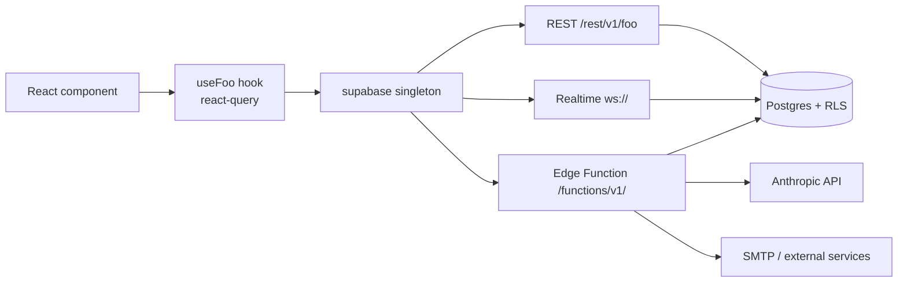

<!-- STALE-V2 -->
> ⚠️ **DOC HISTORIQUE — PÉRIMÉE (V2), NE FAIT PLUS FOI.** Ce fichier décrit en grande partie l'architecture **V2** (mono-app AppGrav, npm/Vercel, PWA/Capacitor, projet Supabase `abjabuniwkqpfsenxljp` = **prod incompatible**, versions RPC obsolètes). **Ne jamais l'appliquer tel quel** (migration, config, archi). Sources de vérité actuelles : `CLAUDE.md` (patterns + workplan) et `docs/workplan/remise-a-plat/` (référence modules réel-vs-demandé). Hiérarchie complète : `docs/README.md`. Régénération depuis le code prévue en Phase 3.

# 01 — Supabase

> **Last verified**: 2026-05-03

Supabase is the primary backend for AppGrav V2 — it provides Postgres, Auth (JWT), Realtime (WebSocket), Storage, and Edge Functions (Deno). The app talks to a single hosted project; there is no self-hosted instance for production.

## Project metadata

| Property | Value |
|----------|-------|
| Project name | `the-breakery-pos` |
| Project ID | `abjabuniwkqpfsenxljp` |
| Region | `ap-southeast-1` (Singapore) |
| API URL | `https://abjabuniwkqpfsenxljp.supabase.co` |
| Studio URL | `https://supabase.com/dashboard/project/abjabuniwkqpfsenxljp` |
| Postgres major version | 17 (per `supabase/config.toml`) |
| SDK version | `@supabase/supabase-js@^2.93.3` |

## Client singleton

The app holds exactly one `SupabaseClient` instance (`src/lib/supabase.ts`). Importing the client elsewhere always returns the same connection — never call `createClient()` from a component or hook.

```ts
// src/lib/supabase.ts (full source)
import { createClient } from '@supabase/supabase-js'

const supabaseUrl = import.meta.env.VITE_SUPABASE_URL
const supabaseAnonKey = import.meta.env.VITE_SUPABASE_ANON_KEY

if (!supabaseUrl || !supabaseAnonKey) {
  throw new Error(`Supabase config missing. URL: ${supabaseUrl}, Key: ${supabaseAnonKey ? 'present' : 'missing'}`)
}

export const supabase = createClient(supabaseUrl, supabaseAnonKey)
```

The singleton uses the `@supabase/supabase-js` defaults:

| Setting | Default | Notes |
|---------|---------|-------|
| `auth.persistSession` | `true` | Stored in `localStorage` under `sb-<ref>-auth-token` |
| `auth.autoRefreshToken` | `true` | JWT refresh ~30s before expiry (1h tokens) |
| `auth.detectSessionInUrl` | `true` | Used for OAuth callbacks (not used in V2 — PIN flow only) |
| `auth.storage` | `localStorage` | See `safeStorage.ts` for SSR/quota fallback elsewhere in the app |
| `realtime.params.eventsPerSecond` | 10 | Hard ceiling; enough for LAN heartbeats + order events |

> The PIN-based session token (`x-session-token`) is **not** the Supabase Auth JWT. See `07-security/01-authentication.md` for the dual-channel model (Supabase Auth JWT for some Edge Functions, custom session token for the PIN flow).

### Untyped helpers

Two escape hatches exist for tables/RPCs not yet present in `database.generated.ts`:

```ts
export function untypedFrom(table: string) {
  return supabase.from(table as never)
}
export function untypedRpc(fn: string, params?: Record<string, unknown>) {
  return supabase.rpc(fn as never, params as never)
}
```

Both use `as never` (not `as any`) so callers must explicitly type the returned data — type-safety is opt-in but never silently lost.

## Environment variables

Loaded by Vite at build time, exposed via `import.meta.env`. Both required.

| Variable | Where set | Notes |
|----------|-----------|-------|
| `VITE_SUPABASE_URL` | `.env`, Vercel project | Public — embedded in bundle |
| `VITE_SUPABASE_ANON_KEY` | `.env`, Vercel project | Public anon key (RLS-protected) |
| `SUPABASE_SERVICE_ROLE_KEY` | Supabase secrets only | **Never** exposed to browser; used by Edge Functions |

Validation is fail-fast: if either of the two `VITE_*` vars is missing, `src/lib/supabase.ts` throws on first import — preventing a half-broken app from loading.

## Authentication flow

The app does **not** use Supabase Auth's built-in email/password UI. Instead:

1. User selects their profile and types a 4-6 digit PIN.
2. `auth-verify-pin` Edge Function (service role) validates the PIN against `user_profiles.pin_hash` (bcrypt) and mints a custom session token stored in `user_sessions` (SHA-256 hashed).
3. The frontend stores the raw token in `localStorage` (`x-session-token`) and replays it on every Edge Function call.
4. `useSessionTimeout` enforces a 30-min idle timeout (configurable via `pos_config`).

Full lifecycle, hashing, and rotation rules live in `07-security/01-authentication.md`.

## Realtime channels

Two channel families are in use:

| Channel | Purpose | Code |
|---------|---------|------|
| `lan-hub` | Hub broadcasts node presence + print routing across LAN devices | `src/services/lan/lanHub.ts`, `lanClient.ts` |
| `appgrav-lan` (BroadcastChannel) | Same-origin tab-to-tab fallback when Realtime is offline | `src/services/lan/lanHub.ts` |

Realtime usage rules:

- **Subscribe in a `useEffect`**, unsubscribe in cleanup. Leaks survive HMR and quietly accumulate.
- **One channel per concern** — do not multiplex unrelated payloads on the same channel.
- **No table-level Realtime** for orders / cart / KDS — those refresh via React Query invalidation after `complete_order_with_payments`. Realtime is reserved for the LAN hub heartbeat and for the few cases below.
- Heartbeat: 30s interval, 120s stale threshold (see `06-lan-architecture/02-hub-client-protocol.md`).

```ts
// Pattern — see lanHub.ts for full impl
useEffect(() => {
  const channel = supabase.channel('lan-hub')
    .on('broadcast', { event: 'PRINT_REQUEST' }, ({ payload }) => routePrint(payload))
    .subscribe()
  return () => { supabase.removeChannel(channel) }
}, [])
```

## Storage

Storage buckets are used sparingly. Active buckets:

| Bucket | Purpose | Public |
|--------|---------|--------|
| `product-images` | Product catalogue images | Yes (signed URLs only via RLS) |
| `customer-avatars` | Customer profile pictures | Yes |
| `receipt-attachments` | Optional supporting docs (expenses) | No |

Operations always go through `supabase.storage.from(bucket).upload(...)` — direct REST calls are forbidden. RLS on `storage.objects` enforces `bucket_id` + `owner` constraints.

## Query conventions

### Targeted selects, never `*`

```ts
// Good
const { data } = await supabase
  .from('products')
  .select('id, name, price, stock_quantity')
  .eq('is_active', true)

// Bad — selects every column, breaks bundle size budgets
.select('*')
```

`select('*')` is banned by lint policy and will fail the schema-audit skill. Targeted selects keep payload + parse cost down and document intent.

### RPC vs. direct table access

| Use direct `.from()` | Use RPC (`.rpc()`) |
|----------------------|--------------------|
| Single-table CRUD with no business logic | Multi-table writes that must be atomic |
| Read filtered by RLS | Operations needing `SECURITY DEFINER` (permission checks, financial calculations) |
| Simple joins via `select('a, b, related(c)')` | Anything that creates a journal entry, mutates stock, or rotates a session |

Critical RPCs in active use:

| RPC | Returns | Used by |
|-----|---------|---------|
| `complete_order_with_payments(order_id, payments[])` | JSON | POS checkout (atomic split-payment) |
| `approve_expense_with_journal(expense_id, approver_id)` | JSON | Expenses module |
| `update_role_permissions(role_id, permission_ids[])` | void | Admin RBAC |
| `verify_user_pin(p_user_id, p_pin)` | bool | Edge Function `auth-verify-pin` |
| `user_has_permission(p_user_id, p_permission_code)` | bool | All Edge Functions, `usePermissions` |
| `get_account_balance(account_id, end_date)` | DECIMAL | Accounting |
| `calculate_vat_payable(year, month)` | TABLE | PB1 reporting |

### Error handling

Every Supabase call returns `{ data, error }`. The convention is:

```ts
const { data, error } = await supabase.from('orders').select('id').eq('id', orderId).single()
if (error) {
  logError('orders.fetch failed', error)
  throw error // let react-query / boundary catch it
}
```

React Query hooks (`src/hooks/`) wrap this and surface `error` to consumers. Components render `<ModuleErrorBoundary>` fallbacks; never silently swallow `error`.

## Distributed tracing

Sentry attaches `sentry-trace` + `baggage` headers to outgoing Supabase API calls when `tracePropagationTargets` matches:

```ts
// src/lib/sentry.ts
tracePropagationTargets: ['localhost', /^https:\/\/abjabuniwkqpfsenxljp\.supabase\.co/]
```

This lets one Sentry transaction span the browser → Edge Function → Postgres path. See `03-sentry-monitoring.md` for the full Sentry config.

## CSP allow-list

`index.html` whitelists Supabase under `connect-src`:

```
connect-src 'self' https://*.supabase.co wss://*.supabase.co ...
```

The `wss://` entry is required for Realtime; dropping it silently kills LAN hub channels.

## Diagram — request fan-out



## Cross-references

- Auth lifecycle: `07-security/01-authentication.md`
- RLS pattern + helper: `07-security/02-rls-policies.md`
- Edge Functions inventory: `02-edge-functions.md`
- LAN Realtime usage: `06-lan-architecture/02-hub-client-protocol.md`
- Schema → types regeneration: `/gen-types` skill
