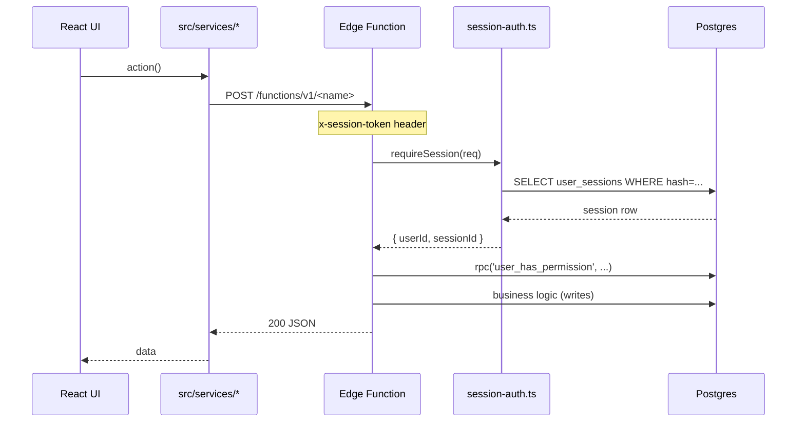

<!-- STALE-V2 -->
> ⚠️ **DOC HISTORIQUE — PÉRIMÉE (V2), NE FAIT PLUS FOI.** Ce fichier décrit en grande partie l'architecture **V2** (mono-app AppGrav, npm/Vercel, PWA/Capacitor, projet Supabase `abjabuniwkqpfsenxljp` = **prod incompatible**, versions RPC obsolètes). **Ne jamais l'appliquer tel quel** (migration, config, archi). Sources de vérité actuelles : `CLAUDE.md` (patterns + workplan) et `docs/workplan/remise-a-plat/` (référence modules réel-vs-demandé). Hiérarchie complète : `docs/README.md`. Régénération depuis le code prévue en Phase 3.

# 02 — Edge Functions

> **Last verified**: 2026-05-03

V2 deploys 15 Supabase Edge Functions (Deno runtime) under `supabase/functions/`. They handle every server-side action that needs the service-role key, third-party secrets, or atomic cross-table writes that RLS alone cannot express.

> **No `config.json` files exist in this repo** — `verify_jwt` and other per-function settings are managed via the Supabase dashboard / `supabase functions deploy --no-verify-jwt` flag at deploy time. The "verify_jwt" column below reflects production-deployed state and the `breakery-lint-disable:public-edge-fn` comments embedded in each `index.ts`.

## Inventory

| Function | Method | verify_jwt | Auth model | Permission | Purpose |
|----------|--------|------------|------------|------------|---------|
| `auth-verify-pin` | POST | **false** | Anonymous (mints session) | None — bcrypt PIN check | Validates PIN, creates `user_sessions` row, returns session token |
| `auth-get-session` | POST | **false** | Custom session token | None | Refreshes session activity, returns user + permissions snapshot |
| `auth-change-pin` | POST | **false** | Custom session token | Self only OR `users.update` for other users | Bcrypt-hashes a new PIN |
| `auth-logout` | POST | **false** | Session token OR JWT | None | Marks `user_sessions.ended_at`, logs the event |
| `auth-user-management` | POST | true | Supabase Auth JWT + `validateSessionToken` | `users.create` / `users.update` / `users.delete` | CRUD users, role assignments |
| `set-user-pin` | POST | **false** | JWT (manual `getUser()`) | Self OR `users.update` | Admin-only PIN reset path |
| `create-admin-user` | POST | true | JWT (anon callable, gated by RPC) | First-run bootstrap | Creates the seed admin profile |
| `list-auth-users` | GET / POST | **false** | Either JWT or session token | None | Lists `auth.users` to link to `user_profiles` |
| `generate-invoice` | POST | true | Session token | `b2b.create` (via UI gate, not server) | HTML / PDF invoice for B2B orders |
| `send-to-printer` | POST | true | Session token | None server-side | LAN print routing fallback when local server is unreachable |
| `calculate-daily-report` | POST | true | Session token | None (cron-style) | Aggregates orders → daily report payload |
| `claude-proxy` | POST | true | Session token | None server-side | Proxies Anthropic API calls (key kept server-side) |
| `purchase_order_module` | GET / POST / PATCH | true | Session token + JWT | `inventory.view` / `inventory.create` | PO CRUD with double-permission check |
| `intersection_stock_movements` | GET / POST | true | Session token + JWT | `inventory.view` / `inventory.update` | Stock-movement cross-references for transfers |
| `send-test-email` | POST | true | Session token | None server-side (admin UI gates) | SMTP smoke test from settings page |

> Two Anthropic-related functions in `package.json` (`@anthropic-ai/sdk`) point only to scripting helpers in `scripts/test-claude.ts` — not Edge Functions.

## Shared modules

`supabase/functions/_shared/` is symlinked into every function via the deploy bundler.

| Module | Exports |
|--------|---------|
| `cors.ts` | `corsHeaders`, `getCorsHeaders(req)`, `handleCors(req)`, `jsonResponse`, `errorResponse`, `securityHeaders` |
| `session-auth.ts` | `validateSessionToken(req)` → `{ userId, sessionId } \| null`, `requireSession(req)` (returns Response on failure) |
| `supabase-client.ts` | `supabaseAdmin` — service-role client singleton |
| `rate-limiter.ts` | `checkRateLimit(ip, { maxRequests, windowMs })`, `rateLimitResponse(retryAfterMs)` |
| `types.ts` | Shared request/response types |

Standard Edge Function skeleton:

```ts
import { serve } from 'https://deno.land/std@0.168.0/http/server.ts'
import { handleCors, jsonResponse, errorResponse } from '../_shared/cors.ts'
import { requireSession } from '../_shared/session-auth.ts'
import { checkRateLimit, rateLimitResponse } from '../_shared/rate-limiter.ts'

serve(async (req: Request) => {
  const cors = handleCors(req); if (cors) return cors
  const ip = req.headers.get('x-forwarded-for')?.split(',')[0]?.trim() || 'unknown'
  const rl = checkRateLimit(ip, { maxRequests: 20, windowMs: 60_000 })
  if (!rl.allowed) return rateLimitResponse(rl.retryAfterMs)
  const session = await requireSession(req)
  if (session instanceof Response) return session
  // ... business logic ...
})
```

---

## auth-verify-pin

- **Trigger**: `POST` from `authService.signIn()` (`src/services/authService.ts:129`).
- **verify_jwt**: false (mints the session — no token yet).
- **Rate limit**: 20 req/min per IP.
- **Body**: `{ user_id: string, pin: string, device_type?: 'desktop'|'tablet'|'pos', device_name?: string }`.
- **Response (200)**: `{ success: true, session: { token, user_id, ... }, user: { id, display_name, ... permissions[] } }`.
- **Errors**: 401 invalid creds, 403 account locked (with `minutes_left`), 429 rate-limited.
- **Secrets**: `SUPABASE_URL`, `SUPABASE_SERVICE_ROLE_KEY`.
- **Notes**: Calls `verify_user_pin` RPC (bcrypt). Increments `failed_login_attempts`; locks account after 5 failures.

## auth-get-session

- **Trigger**: `POST` from `authService.refreshSession()` (`src/services/authService.ts:380`) and on app boot.
- **verify_jwt**: false.
- **Body**: `{ session_token: string }`.
- **Response (200)**: `{ valid: true, user, permissions, expires_at }`.
- **Side effect**: Updates `user_sessions.last_activity_at` (drives the 30-min idle timeout).
- **Secrets**: `SUPABASE_URL`, `SUPABASE_SERVICE_ROLE_KEY`.

## auth-change-pin

- **Trigger**: `POST` from `authService.changePin()` (`src/services/authService.ts:435`).
- **verify_jwt**: false (uses `validateSessionToken`).
- **Body**: `{ user_id, current_pin?, new_pin, admin_override? }`.
- **Permission check**: caller must be the same user OR have `users.update` (server-side via `user_has_permission` RPC).
- **PIN policy**: 4-6 digits, numeric only. Bcrypt cost factor 10.

## auth-logout

- **Trigger**: `POST` from `authService.signOut()` (`src/services/authService.ts:322`).
- **verify_jwt**: false (works with either session token or JWT).
- **Body**: `{ session_id, user_id, reason?: 'logout'|'timeout'|'forced' }`.
- **Side effect**: Sets `user_sessions.ended_at` and writes `auth_events` row.

## auth-user-management

- **Trigger**: `POST` from `userManagementService.ts` (six call sites: 58, 107, 146, 184, 233, 279).
- **verify_jwt**: true + `validateSessionToken`.
- **Body**: `{ action: 'create'|'update'|'delete'|'toggle_active'|'reset_pin'|..., ...payload }`.
- **Permission check**: `users.create` / `users.update` / `users.delete` per action via `user_has_permission` RPC.
- **Returns**: created/updated `user_profile` row.

## set-user-pin

- **Trigger**: `POST` from admin PIN reset UI (`src/pages/users/`).
- **verify_jwt**: false at the platform level — function manually calls `supabaseAuth.auth.getUser()` then a permission RPC.
- **Body**: `{ user_profile_id, pin }`.
- **Permission**: self OR `users.update` (admin path uses bcrypt cost 10).

## create-admin-user

- **Trigger**: One-shot bootstrap; called via dashboard → Edge Functions invoker.
- **verify_jwt**: true.
- **Purpose**: Creates the very first admin profile when the database is empty. Idempotent — refuses if any user already exists.

## list-auth-users

- **Trigger**: `POST` from `useAuthUsers` (`src/hooks/useAuthUsers.ts`) and `userManagementService`.
- **verify_jwt**: false (accepts either JWT or session token).
- **Returns**: `Array<{ id, email, created_at, last_sign_in_at, is_linked }>`.
- **Use case**: UI for linking an existing `auth.users` row to a `user_profiles` row.

## generate-invoice

- **Trigger**: `POST` from B2B order detail UI (`src/pages/b2b/`).
- **verify_jwt**: true.
- **Body**: `{ order_id: string }`.
- **Returns**: `{ html: string, pdf_base64?: string }`.
- **Side effect**: None (read-only generation). Increments `b2b_orders.invoice_generated_count`.
- **Secrets**: `SUPABASE_URL`, `SUPABASE_SERVICE_ROLE_KEY`.
- **Acceptance**: Frontend gates the action; **no granular `b2b.invoice.generate` permission** is enforced server-side (documented technical debt — `breakery-lint-disable:public-edge-fn` comment).

## send-to-printer

- **Trigger**: Fallback path when `printService.checkPrintServer()` returns false.
- **verify_jwt**: true.
- **Body**: `{ type: 'receipt'|'kitchen'|'label', printer?: string, data: ReceiptData|KitchenTicketData }`.
- **Returns**: `{ success: boolean, message?: string }`.
- **Notes**: Used as a buffer when no LAN print server is online — formats the payload for an external print backend.
- **See**: `06-print-server.md` for the local-first flow.

## calculate-daily-report

- **Trigger**: `POST` from end-of-day report UI + scheduled job.
- **verify_jwt**: true.
- **Body**: `{ date?: 'YYYY-MM-DD' }` (defaults to yesterday).
- **Returns**: `DailyReport` — summary, payment_breakdown, category_performance, top_products, hourly_sales, staff_performance.

## claude-proxy

- **Trigger**: `POST` from helper scripts (`scripts/test-claude.ts`, `scripts/repair-system.ts`).
- **verify_jwt**: true + session validation.
- **Rate limit**: 10 req/min per IP.
- **Body**: `{ messages: ClaudeMessage[], system?: string, max_tokens?: number, model?: string }`.
- **Allowed models**: `claude-3-haiku-20240307`, `claude-3-5-haiku-20241022`, `claude-haiku-4-5-20251001`.
- **Secret**: `ANTHROPIC_API_KEY` (server-only, never bundled).
- **See**: `08-claude-proxy.md` for the full contract.

## purchase_order_module

- **Trigger**: `GET` / `POST` / `PATCH` from `src/hooks/usePurchaseOrders.ts`.
- **verify_jwt**: true + session + JWT (defense in depth).
- **Body**: `?resource=suppliers|orders&id=<uuid>` + JSON body for writes.
- **Permission**: `inventory.view` (read), `inventory.create` (write).

## intersection_stock_movements

- **Trigger**: `GET` / `POST` from inventory transfer UI.
- **verify_jwt**: true.
- **Permission**: `inventory.view` (read), `inventory.update` (transfer).
- **Returns**: Cross-referenced movement rows for stock reconciliation.

## send-test-email

- **Trigger**: `POST` from `useNotificationSettings` and `NotificationSettingsPage`.
- **verify_jwt**: true.
- **Body**: `{ to_email | email: string }`.
- **Side effect**: Sends a single test email using SMTP settings stored in `settings` table (`notifications.smtp_*`).
- **Risk**: No granular `admin.diagnostics` permission is enforced server-side (admin gating lives in frontend only — documented in `breakery-lint-disable:public-edge-fn`).

---

## Sequence — typical authenticated call



## Cross-references

- PIN auth flow: `07-security/01-authentication.md`
- Permission catalogue: `07-security/03-permissions.md`
- Print fallback path: `06-print-server.md`
- Claude proxy: `08-claude-proxy.md`
- LAN Realtime: `06-lan-architecture/02-hub-client-protocol.md`
