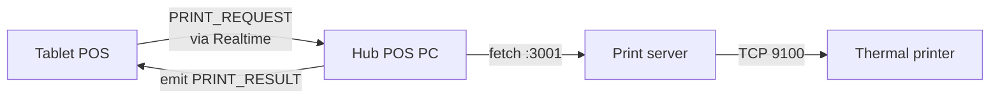

<!-- STALE-V2 -->
> ⚠️ **DOC HISTORIQUE — PÉRIMÉE (V2), NE FAIT PLUS FOI.** Ce fichier décrit en grande partie l'architecture **V2** (mono-app AppGrav, npm/Vercel, PWA/Capacitor, projet Supabase `abjabuniwkqpfsenxljp` = **prod incompatible**, versions RPC obsolètes). **Ne jamais l'appliquer tel quel** (migration, config, archi). Sources de vérité actuelles : `CLAUDE.md` (patterns + workplan) et `docs/workplan/remise-a-plat/` (référence modules réel-vs-demandé). Hiérarchie complète : `docs/README.md`. Régénération depuis le code prévue en Phase 3.

# 06 — Local Print Server

> 🟡 **Note V3 (à promouvoir hors référence V2)** : le chemin d'impression courant V3 est le workspace **`apps/print-bridge`** (contrat V2 octet-exact + scan réseau, **S65**) piloté par le CRUD **LAN Devices** (`/lan-devices`, BO). Le station-routing a été livré **S34**. La description ci-dessous (daemon Express port 3001, `send-to-printer` EF) est **V2** — remplacée par print-bridge. `print_queue` a été **droppée S62**.
>
> **Last verified**: 2026-05-03

The print server is an **optional** local Express daemon that runs on the POS PC (port 3001) and bridges browser print requests to physical thermal printers. It is the primary path; the `send-to-printer` Edge Function exists as a remote-fallback (limited use).

## Topology

| Component | Host | Port | Protocol |
|-----------|------|------|----------|
| POS app (browser/Capacitor) | Tablet / PC | — | `fetch()` |
| Print server | POS PC (Lombok: `192.168.1.92`, dev: `localhost`) | 3001 | HTTP JSON |
| Thermal printer | LAN (e.g. `192.168.1.8:9100`) | 9100 | TCP raw / WebSocket |
| `send-to-printer` Edge Function | Supabase | — | HTTPS JSON |

The print server source code lives outside this repo — it is a small Node Express service that owns the printer drivers (ESC/POS). This document covers the **client side** (`src/services/print/`) and the protocol contract.

## CSP allow-list

`index.html` whitelists localhost + the production print server IP:

```
connect-src 'self' ...
            http://localhost:3001
            http://127.0.0.1:3001
            http://192.168.1.110:3001
            ws://192.168.1.8:9100 ws://192.168.1.13:9100 ws://192.168.1.14:9100
            ws://192.168.1.15:9100 ws://192.168.1.101:9100;
```

The hard-coded IPs are temporary; see the LAN dynamic-CSP design in `06-lan-architecture/05-discovery.md`.

## Endpoints

All endpoints use `Content-Type: application/json` and a 5 s default timeout (configurable via `printing.request_timeout_ms` in `pos_config`). Health check timeout is 2 s.

| Method | Endpoint | Purpose | Body |
|--------|----------|---------|------|
| GET | `/health` | Liveness probe (used by `checkPrintServer`) | — |
| POST | `/print/receipt` | Customer receipt (80 mm thermal) | `{ order: IOrderPrintData }` |
| POST | `/print/kitchen` | Kitchen ticket | `{ order, items }` |
| POST | `/print/barista` | Barista ticket | `{ order, items }` |
| POST | `/print/display` | Display-case ticket | `{ order, items }` |
| POST | `/print/waiter` | Waiter summary | `{ order }` |
| POST | `/drawer/open` | Cash drawer kick | — |

Z-Report (shift close) re-uses `/print/receipt` with a pre-formatted text payload — see `printShiftReport()`.

## Client service

`src/services/print/printService.ts` exports the canonical typed wrappers:

```ts
export const printService = {
  checkPrintServer,
  printReceipt,
  printKitchenTicket,
  printBaristaTicket,
  printDisplayTicket,
  printWaiterTicket,
  printShiftReport,
  openCashDrawer,
}
```

Every print function follows the same shape:

1. `checkPrintServer()` → 2 s `GET /health` probe.
2. If unreachable → return `{ success: false, error: 'Print server not available' }` (no exception).
3. Otherwise `fetch(POST)` with an `AbortController` timeout.
4. Map non-200 responses to `{ success: false, error }`; map fetch failures the same way.

```ts
// printService.ts (excerpt)
export async function checkPrintServer(): Promise<boolean> {
  try {
    const config = getPrintConfig()
    const controller = new AbortController()
    const timeoutId = setTimeout(() => controller.abort(), config.healthCheckTimeout)
    const response = await fetch(`${config.serverUrl}/health`, { signal: controller.signal })
    clearTimeout(timeoutId)
    return response.ok
  } catch { return false }
}
```

Configuration is read from `useCoreSettingsStore.getState().getSetting<...>('printing.*')`. Defaults:

| Setting key | Default |
|-------------|---------|
| `printing.server_url` | `http://localhost:3001` |
| `printing.request_timeout_ms` | `5000` |
| `printing.health_check_timeout_ms` | `2000` |

These can be overridden per-tenant from Settings → Printing.

## Hub-routed printing

Multi-device LANs route through the hub (`src/services/print/hubPrintService.ts`):

- If the calling device **is** the hub, it calls `printService.*` directly.
- Otherwise, it sends a `PRINT_REQUEST` over the LAN (`lanClient.send(LAN_MESSAGE_TYPES.PRINT_REQUEST, payload)`) and the hub executes the local print on its behalf.

```ts
// hubPrintService.ts (excerpt — full file lives in repo)
import { useLanStore } from '@/stores/lanStore'
import { lanClient } from '@/services/lan/lanClient'
import { LAN_MESSAGE_TYPES } from '@/services/lan/lanProtocol'
import { printKitchenTicket, printBaristaTicket } from '@/services/print/printService'
```

This means a tablet in the dining room can press "send to kitchen" without owning the printer — the hub PC is the single point of physical contact.

## DB-driven config

Persistent printer assignments live in `printer_configurations`:

| Column | Purpose |
|--------|---------|
| `name` | Human label (e.g. "Cuisine 1") |
| `type` | `kitchen` / `barista` / `receipt` / `display` / `waiter` |
| `endpoint` | `tcp://192.168.1.8:9100` or `usb://...` |
| `is_default_for_type` | Boolean |
| `is_active` | Boolean |

The print server reads this table at startup and after `LAN_MESSAGE_TYPES.PRINTER_CONFIG_UPDATE`. KDS stations follow the same pattern in `kds_stations`.

## Fallback flow

```mermaid
sequenceDiagram
  participant POS as POS UI
  participant PS as printService
  participant Local as Local print server :3001
  participant EF as Edge Function send-to-printer

  POS->>PS: printReceipt(order)
  PS->>Local: GET /health (2s timeout)
  alt Local UP
    Local-->>PS: 200
    PS->>Local: POST /print/receipt
    Local-->>PS: 200
    PS-->>POS: { success: true }
  else Local DOWN
    Local-->>PS: timeout
    PS-->>POS: { success: false, error }
    Note over POS: UI shows toast; cashier may retry
    Note over POS,EF: Optional: reissue via Edge Function for cloud-routed printer
    POS->>EF: POST /functions/v1/send-to-printer
    EF-->>POS: { success | error }
  end
```

> The fallback to `send-to-printer` is **opt-in**, used only for orders that must reach a remote / off-LAN printer (e.g. ghost kitchen). The default path is local-only.

## Error categories

| Returned `error` | Cause | UI handling |
|------------------|-------|-------------|
| `Print server not available` | Health check failed | Toast: "Printer offline — check the POS PC" |
| `Print failed: <body>` | Server returned non-200 | Toast with body; retry button |
| `AbortError` (mapped to message) | 5 s timeout exceeded | Toast: "Printer didn't respond" |
| Network error | DNS / refused | Toast + Sentry (categorised as `print.network`) |

All errors are logged via `logError` from `@/utils/logger` (which forwards to Sentry in prod).

## Discovery + heartbeat

`networkDiscovery.ts` scans the LAN for print servers on app boot — see `06-lan-architecture/05-discovery.md`. The hub also sends a `PRINTER_HEARTBEAT` every 30 s; clients flag a printer as `STALE` after 120 s without ack.

## Diagram — full print path (hub-routed)



## Operational tips

- Keep the print server running as a Windows service (`pm2-windows-service`) so reboots don't strand cashiers.
- The print server logs every job with `order_number` — match these against `orders.id` when triaging missing receipts.
- The `/drawer/open` endpoint works only if a cash drawer is daisy-chained to the receipt printer (most ESC/POS printers expose drawer kick on RJ11).

## Cross-references

- Edge Function fallback: `02-edge-functions.md` (`send-to-printer`)
- Hub/client protocol: `06-lan-architecture/02-hub-client-protocol.md`
- Print routing & hub responsibilities: `06-lan-architecture/04-print-routing.md`
- Discovery / heartbeat: `06-lan-architecture/05-discovery.md`

## V3 station-routing contract (Session 34 — current code)

> **Last verified**: 2026-06-01 against `apps/pos/src/services/print/printService.ts`.

S34 replaced the V2 per-printer endpoints (`/print/kitchen`, `/print/barista`, …)
with a single station-routing endpoint. The bridge receives the target printer in
the request body and opens an ESC/POS connection to `printer.ip_address:printer.port`.

### Base URL
The POS reads the base URL from `VITE_PRINT_SERVER_URL` (fallback `http://localhost:3001`).
In prod, set it to the bridge's LAN address on the counter PC (e.g. `http://192.168.1.50:3001`).
S35 (F-009) will add a manager-editable override stored in `usePosSettingsStore`
(resolution: store > env var > fallback).

### Endpoints

| Method | Endpoint | Caller | Timeout | Body |
|--------|----------|--------|---------|------|
| GET  | `/health`         | `checkPrintServer`   | 2 s | — |
| POST | `/print/ticket`   | `printStationTicket` | 5 s | `{ printer, ...StationTicketPayload }` |
| POST | `/print/receipt`  | `printReceipt`       | 5 s | `{ ...ReceiptPayload, printer? }` (printer field omitted when absent) |
| POST | `/drawer/open`    | `openCashDrawer`     | 2 s | — |

`Content-Type: application/json` on the two POST-with-body endpoints. The bridge MUST
return a 2xx on success; any non-2xx makes the client return `{ success:false, error:'HTTP <status>' }`.
A network error / abort makes the client return `{ success:false, error:<message> }`.

### `/print/ticket` body — `{ printer, ...StationTicketPayload }`

`printer` is first in the object; the payload fields are spread after it:

- `printer`: `{ ip_address: string, port: number }` — the target station printer.
- `kind`: `'prep' | 'bill' | 'receipt'` (`PrintKind`).
- `role`: one of `'barista' | 'kitchen' | 'bakery' | 'cashier' | 'waiter'` (`PrinterRole`).
- `order_number`: string.
- `table_number?`: string.
- `created_at`: ISO string.
- `server_name`: string.
- `items[]`: `{ name: string, quantity: number, modifiers?: string[], note?: string }`.
- `totals?`: `{ subtotal, tax, total }` (present for `bill` and `receipt`).
- `payment?`: `{ method, amount, change_given }` (present for `receipt` only).

### `/print/receipt` body — `{ ...ReceiptPayload, printer? }`

`printer` is spread **last** and is **omitted** when the POS has no cashier printer to route to:

- `business`: `{ name, address, phone?, tax_id? }`.
- `order`: `{ order_number, created_at, cashier_name, order_type: 'dine_in'|'take_out' }`.
- `customer?`: `{ name, loyalty_tier? }`.
- `items[]`: `{ name, quantity, unit_price, modifiers?: { label, price_adjustment }[], line_total }`.
- `totals`: `{ items_total, redemption_amount, total, tax_amount }`.
- `payment`: `{ method, amount, cash_received?, change_given? }`.
- `loyalty?`: `{ points_earned, balance_after }`.
- `footer?`: string.
- `printer?`: `{ ip_address, port }` when a cashier printer is resolved.

### `/drawer/open` and `/health`
`/drawer/open` takes no body (POST), pulses the cash drawer, returns 2xx on success.
`/health` is a GET liveness probe used by `checkPrintServer` (2 s timeout, returns `res.ok`).

## Bridge deployment runbook (ops — counter PC)

> The bridge source is **outside this monorepo**. This runbook deploys the
> compiled bridge on the counter PC and verifies it against the contract above.

### Prerequisites
- Counter PC on the same LAN as the thermal printers (barista/kitchen/bakery prep
  + cashier/waiter document) — each printer reachable at `ip:9100` (ESC/POS raw).
- Node 18+ on the counter PC.
- A fixed LAN IP for the counter PC (e.g. `192.168.1.50`) so the POS env var is stable.

### Deploy
1. Copy the bridge build to the counter PC (e.g. `C:\breakery-print-bridge\`).
2. Configure the listen port (default `3001`).
3. Start it as a supervised service so it restarts on boot/crash:
   - Windows: register via NSSM or a Scheduled Task at logon.
   - Linux: a `systemd` unit with `Restart=always`.

### Verify (run from the counter PC, then from a POS tablet on the LAN)
```bash
# Liveness — expect HTTP 200.
curl -i http://192.168.1.50:3001/health

# Station ticket — expect 2xx and a physical ticket on the kitchen printer.
curl -i -X POST http://192.168.1.50:3001/print/ticket \
  -H 'Content-Type: application/json' \
  -d '{"printer":{"ip_address":"192.168.1.12","port":9100},"kind":"prep","role":"kitchen","order_number":"TEST-1","created_at":"2026-06-01T00:00:00Z","server_name":"ops","items":[{"name":"Test item","quantity":1}]}'

# Drawer kick — expect 2xx and the cashier drawer opens.
curl -i -X POST http://192.168.1.50:3001/drawer/open
```
Acceptance: `/health` returns 200; `/print/ticket` prints on the addressed printer;
`/drawer/open` pulses the drawer.

### Wire the POS
Set `VITE_PRINT_SERVER_URL=http://192.168.1.50:3001` in `apps/pos/.env.local` on each
tablet (or via S35's Printing tab once shipped) and rebuild/reload the POS.

## Prod `lan_devices` provisioning (ops — per site)

> The dev fixture (`supabase/tests/seed_dev_printers.sql`) is for dev only.
> Prod rows carry the site's **real** printer IPs and must be inserted by an
> account holding `lan.devices.manage` (RLS gate).

For each of the 5 station roles, insert one `lan_devices` row:

| `code` (unique) | `name` | `device_type` | `capabilities` | `ip_address` / `port` |
|---|---|---|---|---|
| e.g. `LBK-PRINTER-BARISTA` | Barista printer | `printer` | `{"station":"barista"}` | real LAN IP / 9100 |
| e.g. `LBK-PRINTER-KITCHEN` | Kitchen printer | `printer` | `{"station":"kitchen"}` | real LAN IP / 9100 |
| e.g. `LBK-PRINTER-BAKERY`  | Bakery printer  | `printer` | `{"station":"bakery"}`  | real LAN IP / 9100 |
| e.g. `LBK-PRINTER-CASHIER` | Cashier printer | `printer` | `{"station":"cashier"}` | real LAN IP / 9100 |
| e.g. `LBK-PRINTER-WAITER`  | Waiter printer  | `printer` | `{"station":"waiter"}`  | real LAN IP / 9100 |

Rules:
- `code` must be unique and non-null (`code UNIQUE NOT NULL`).
- `ip_address` is `INET` — a valid IP literal, not a hostname string.
- `is_active = TRUE`, `deleted_at` NULL.
- A missing role is non-fatal: `useStationPrinters` simply won't resolve it and the
  S34 flow shows "no printer configured for [station]" (no crash).

A BO "Devices" management UI is the intended long-term entry point (out of scope here;
tracked as a separate backlog item).
