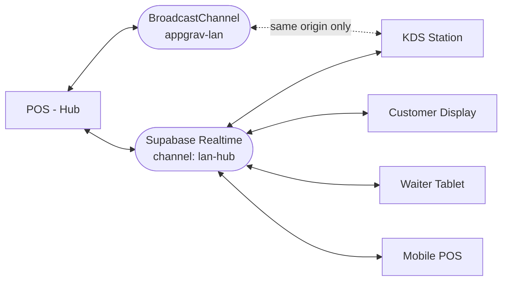
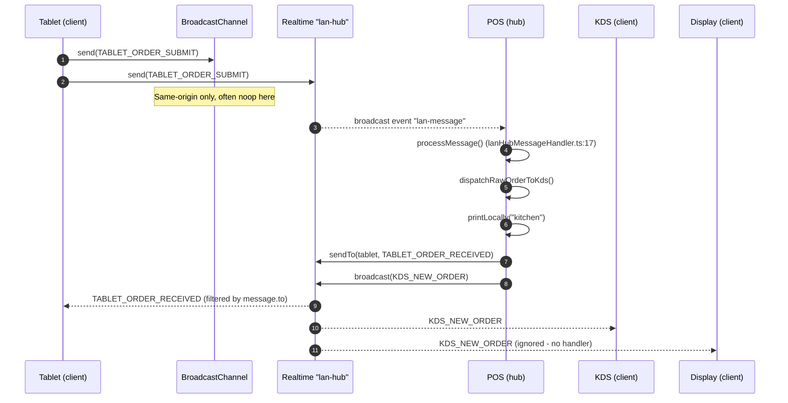

<!-- STALE-V2 -->
> ⚠️ **DOC HISTORIQUE — PÉRIMÉE (V2), NE FAIT PLUS FOI.** Ce fichier décrit en grande partie l'architecture **V2** (mono-app AppGrav, npm/Vercel, PWA/Capacitor, projet Supabase `abjabuniwkqpfsenxljp` = **prod incompatible**, versions RPC obsolètes). **Ne jamais l'appliquer tel quel** (migration, config, archi). Sources de vérité actuelles : `CLAUDE.md` (patterns + workplan) et `docs/workplan/remise-a-plat/` (référence modules réel-vs-demandé). Hiérarchie complète : `docs/README.md`. Régénération depuis le code prévue en Phase 3.

# 01 — Hub / Client Model

> **Last verified**: 2026-05-03

The Breakery POS is built as a multi-device system where one main terminal (POS) acts as a coordination **hub**, and every other in-shop screen (KDS, customer display, waiter tablet, mobile POS) acts as a **client**. This page documents the conceptual model, the underlying transports, and the lifecycle expectations.

---

## 1. Why hub / client

A bakery shift typically runs:

- 1 main POS terminal (cashier) — also the only machine running the local Express **print server** on `:3001`
- 1–2 KDS screens (kitchen, barista)
- 1 customer-facing display
- 1–3 waiter tablets
- Optional mobile POS

Centralising on a hub gives us:

| Concern | Why a hub helps |
|---------|-----------------|
| Print routing | Only the hub talks to the local print server (single LAN-bound process). Clients send `PRINT_REQUEST` instead of poking ESC/POS ports themselves. |
| Order ingestion | Tablet → hub → KDS dispatch + printing + tablet ACK is a single sequenced flow. Avoids race conditions if a tablet talked to KDS directly. |
| Source of truth | Hub holds the connected-device list (`useLanStore.connectedDevices`). Clients only need to know the hub channel name (`'lan-hub'`). |
| Reconnect logic | Hub publishes presence; clients can reconcile state on reconnect. |

There is **at most one hub per LAN**, enforced by `pos_terminals.is_hub` (only one row should be `TRUE`) and surfaced by the `get_lan_hub_node` RPC.

---

## 2. Which device is the hub?

The hub is whichever POS has been registered with `is_hub = true`. This is set during initial terminal registration and persists across sessions.

| Layer | Where the flag lives | Storage |
|-------|----------------------|---------|
| Local (this device) | `useTerminalStore.isHub` (sessionStorage `appgrav-terminal`) | Set by `registerTerminal(name, isHub=true, location)` — see `src/stores/terminalStore.ts:94-109` |
| Local (LAN runtime) | `useLanStore.isHub` (localStorage `appgrav-lan-store`) | Set by `lanHub.start()` at `src/services/lan/lanHub.ts:100` |
| Server (config) | `pos_terminals.is_hub` (BOOLEAN) | Synced via `setServerData()` — see `src/stores/terminalStore.ts:147-158` |
| Server (runtime) | `lan_nodes.is_hub` (BOOLEAN) | Set when `registerLanNode(..., isHub=true)` is called from `lanHub.start()` (`src/services/lan/lanHub.ts:50-57`) |

A device becoming hub is a deliberate setup action. There is no automatic election: the operator picks the main POS at first install, and that flag is preserved.

> **See also**: `06-device-types.md` for how to switch the hub manually.

---

## 3. Two transports, layered

Every LAN message travels through **both** of these channels in parallel; receivers de-duplicate by `message.id` and ignore self-sourced messages.

| Transport | Scope | Latency | When used |
|-----------|-------|---------|-----------|
| **`BroadcastChannel('appgrav-lan')`** | Same origin (same browser, same machine) | ~0 ms (in-process) | Multiple tabs/windows of the same app on the hub machine. Optional — gracefully `null` if the API is unavailable. |
| **Supabase Realtime channel `'lan-hub'`** | Cross-device, internet-mediated | ~50–250 ms (server round-trip) | Default for any cross-device message. Survives different browsers, different machines, and even cross-network as long as Supabase is reachable. |

Both `LanHub.broadcast()` (`src/services/lan/lanHub.ts:162-181`) and `LanClient.send()` (`src/services/lan/lanClient.ts:213-226`) push the **same message** through whichever channel is available — usually both. Receivers identify duplicates using `message.id` (see `lanProtocol.ts:560` `createMessage`).

Despite the name "LAN", the cross-device transport is **internet-relayed via Supabase Realtime**, not raw LAN sockets. The label is historical and reflects that all peers are physically inside the bakery's local network.

---

## 4. Sequence — client message reaching every other client

Notes on the diagram:

- Step 1–2: the tablet emits in parallel; in production only the Realtime path matters for cross-device delivery.
- Step 6–7: `processMessage()` synchronously routes by `message.type` (switch/case in `lanHubMessageHandler.ts:30-54`).
- Step 9: addressed messages set `message.to = deviceId`; clients drop messages where `message.to && message.to !== ownDeviceId` (`lanClient.ts:283-286`).
- Step 11: clients without a handler for a given type log a warning but do not error (`lanClient.ts:296`).

---

## 5. Key files

| File | Role | Critical lines |
|------|------|----------------|
| `src/services/lan/lanHub.ts` | Hub singleton — broker, heartbeat, stale cleanup, reconnection | `start()` 34–114, `broadcast()` 162–181, `sendTo()` 183–202, `attemptReconnect()` 231–286 |
| `src/services/lan/lanClient.ts` | Client singleton — connect, dispatch, queue, reconnect | `connect()` 61–142, `send()` 197–231, `processMessage()` 277–304, `scheduleReconnect()` 355–380 |
| `src/services/lan/lanHubMessageHandler.ts` | Hub-side per-type handlers | `processMessage()` 17–55, `handleTabletOrderSubmit()` 102–253, `handlePrintRequest()` 259–286 |
| `src/services/lan/lanProtocol.ts` | Message envelope, type constants, RPC wrappers | `LAN_MESSAGE_TYPES` 33–88, `ILanMessage` 99–106, `createMessage()` 553–567 |
| `src/services/lan/index.ts` | Barrel export | Re-exports `lanHub`, `lanClient`, all protocol types |

Both `lanHub` and `lanClient` are exported as **module-level singletons** (`export const lanHub = new LanHub()` at `lanHub.ts:312`, `export const lanClient = new LanClient()` at `lanClient.ts:456`). React hooks (`useLanHub`, `useLanClient`) wrap these and never instantiate new ones — see `04-print-routing.md` and `06-device-types.md`.

---

## 6. Shared state — who is online

Per-device knowledge of "who else is on the LAN" lives in **`useLanStore`** (`src/stores/lanStore.ts`):

| State | Type | Maintained by | Purpose |
|-------|------|---------------|---------|
| `connectionStatus` | `'disconnected' \| 'connecting' \| 'connected' \| 'reconnecting' \| 'error'` | hub & client | Drives `LanConnectionIndicator` icon |
| `isHub` | `boolean` | `lanHub.start()` / `.stop()` | Routes print requests locally vs via LAN |
| `connectedDevices` | `IConnectedDevice[]` | only on the hub — `lanHubMessageHandler.handleDeviceRegister/Heartbeat/Deregister` | Hub UI's "connected devices" panel; pruned every 60 s |
| `pendingMessages` | `ILanMessage[]` | `lanClient.send()` when offline | Replayed on reconnect (`onConnected()` 326–338) |
| `lastMessageSeq` | `number` | incremented in `addPendingMessage` | Lightweight ordering hint for queued messages |
| `reconnectAttempts` | `number` | client reconnect loop | Bounded at 10 (`lanClient.ts:361`) |

`connectedDevices` is **not persisted** — it rebuilds itself from incoming `HEARTBEAT` and `NODE_REGISTER` messages each time the hub starts. The persistent record of devices that *should* exist is the `device_configurations` table (see `06-device-types.md`).

---

## 7. Message ordering and idempotency

The protocol does **not** guarantee strict global ordering. It relies on the following weaker properties:

1. Each message carries a `crypto.randomUUID()` ID and an ISO-8601 `timestamp` (`lanProtocol.ts:553-567`).
2. Receivers ignore messages from `message.from === ownDeviceId` (self-loop suppression) — see `lanClient.ts:279-281` and `lanHubMessageHandler.ts:24-26`.
3. Targeted messages set `message.to`; non-target receivers drop them.
4. The Zustand store maintains `lastMessageSeq` as a per-device counter for **queued** messages only (no global sequence).
5. Heartbeats are idempotent — receiving a duplicate just re-stamps `lastHeartbeat`.

For high-stakes events (orders, payments) the actual source of truth is the database. Realtime messages are advisory hints that let the UI react before the next React Query refetch lands.

---

## 8. Reconnect logic

Both the hub and clients implement exponential-backoff reconnect when the Realtime channel transitions to `CLOSED`, `CHANNEL_ERROR`, or `TIMED_OUT`.

| Side | Base | Cap | Max attempts | Code |
|------|------|-----|-------------|------|
| Hub | 2 s × 2^(n-1) | 30 s | 10 | `lanHub.ts:226-286` |
| Client | 1 s × 2^n | 60 s | 10 | `lanClient.ts:355-380` |

Hub-side reconnect re-uses the **same channel name** (`'lan-hub'`) so clients do not need to be told to do anything — they will simply see traffic resume. The hub guards against re-entry with `isReconnecting` and against reconnect-after-stop with `isStopping`.

Client-side reconnect closes the existing Realtime channel and BroadcastChannel, then calls `connect()` again, which re-runs the full registration flow (`lanClient.ts:382-404`). On successful reconnect, queued `pendingMessages` are flushed (`lanClient.ts:326-338`).

After hitting the max attempts:

- The hub goes to `connectionStatus: 'disconnected'` and surfaces a `lastError`. Operators must restart the hub manually (or refresh the POS).
- Clients go to `connectionStatus: 'error'`. Page-level UI (e.g. KDS) shows the `LanConnectionIndicator` in red.

---

## 9. What the hub does NOT do

To avoid scope creep / wrong assumptions:

- The hub is **not** a service worker. It only runs while the POS tab is open.
- The hub does **not** persist messages it forwards. Clients that miss a window must re-fetch from the database.
- The hub does **not** run a TCP listener. All LAN delivery rides on either BroadcastChannel (intra-origin) or Supabase Realtime (cross-device). The only TCP server in the stack is the optional Express **print server** on `:3001`, which is documented in `05-integrations/06-print-server.md`.
- The hub does **not** perform device authentication beyond "you are subscribed to channel `lan-hub`". The Realtime channel itself is gated by Supabase RLS / anon key. There is no per-device JWT for LAN messages.

---

## 10. Cross-references

- Discovery & scan strategy: `02-discovery.md`
- Heartbeat cadence and stale cleanup: `03-heartbeat-and-state.md`
- Print routing through the hub: `04-print-routing.md`
- Full envelope & message-type catalogue: `05-message-protocol.md`
- Device-type capability matrix: `06-device-types.md`
- Print-server API: `05-integrations/06-print-server.md`
- KDS module integration: `04-modules/04-kds.md`
