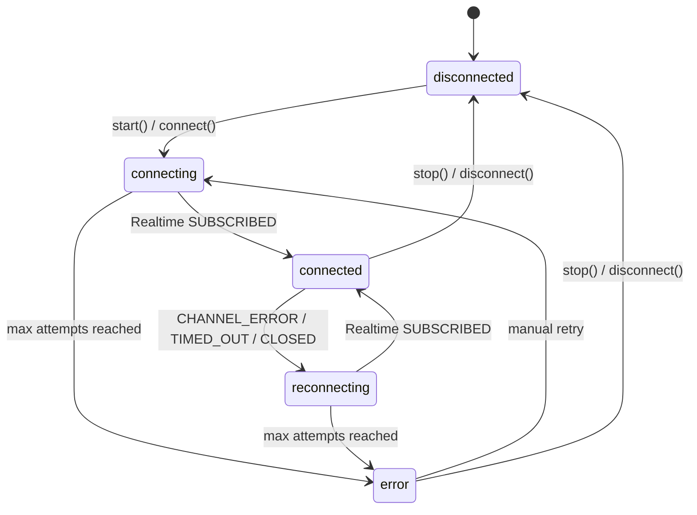

<!-- STALE-V2 -->
> ⚠️ **DOC HISTORIQUE — PÉRIMÉE (V2), NE FAIT PLUS FOI.** Ce fichier décrit en grande partie l'architecture **V2** (mono-app AppGrav, npm/Vercel, PWA/Capacitor, projet Supabase `abjabuniwkqpfsenxljp` = **prod incompatible**, versions RPC obsolètes). **Ne jamais l'appliquer tel quel** (migration, config, archi). Sources de vérité actuelles : `CLAUDE.md` (patterns + workplan) et `docs/workplan/remise-a-plat/` (référence modules réel-vs-demandé). Hiérarchie complète : `docs/README.md`. Régénération depuis le code prévue en Phase 3.

# 03 — Heartbeat & Device State

> **Last verified**: 2026-05-03

Heartbeats are how the LAN knows who is still alive. Every device — hub or client — pings the network on a fixed cadence; any device whose last heartbeat is older than the stale threshold is dropped from the connected list. This page documents the timings, the database tables involved, the resulting state machine, and the UI surface (`LanConnectionIndicator`).

---

## 1. The cadence at a glance

| Action | Interval | Default | Configurable in |
|--------|----------|---------|-----------------|
| Hub sends `HEARTBEAT` to LAN | every 30 s | `useLanHub({ heartbeatInterval })` | `IUseLanHubOptions.heartbeatInterval` |
| Client sends `HEARTBEAT` to hub | every 30 s | `lanClient.connect({ heartbeatInterval })` | `IClientConfig.heartbeatInterval` |
| Hub sweeps stale connected devices | every 60 s | `staleCheckTimer` | hard-coded `lanHub.ts:95-97` |
| Stale threshold (drop a device) | 120 s | `useLanHub({ staleTimeout })` | `IUseLanHubOptions.staleTimeout` |
| Status poll (UI refresh) | 5 s | `useLanHub` internal | hard-coded `useLanHub.ts:215` |

In words: clients heartbeat twice per minute; the hub prunes stale devices once per minute; a device must miss roughly four heartbeats before it disappears.

---

## 2. What a heartbeat actually does

Each `HEARTBEAT` triggers two parallel writes:

1. **Database** — `sendHeartbeat(deviceId)` calls the `update_lan_node_heartbeat(p_device_id)` RPC, which sets `lan_nodes.last_heartbeat = now()` server-side. Source: `lanProtocol.ts:323-340`.
2. **LAN broadcast** — the device sends a `HEARTBEAT` message with payload `{ deviceName, deviceType, status: 'active', uptime }`. Other peers ignore it (no handler) **except the hub**, which calls `useLanStore.updateDeviceHeartbeat(message.from)` to refresh the in-memory `lastHeartbeat` (see `lanHubMessageHandler.ts:74-76`).

The DB write is the durable record (queryable from any client via `getOnlineNodes()`); the LAN broadcast is the live signal that lights up the hub's connected-devices panel.

If the RPC is missing (PostgreSQL code `42883` / PostgREST `PGRST202`), heartbeat is silently treated as a no-op. LAN is considered an optional feature in V2 — see `lanProtocol.ts:20-24` (`OPTIONAL_RPC_ERROR_CODES`).

---

## 3. Tables involved

### 3.1 `lan_nodes` — runtime registry (migration `010_lan_sync_display.sql:8-23`)

Tracks live, currently-online devices. This row is rewritten at every connect / heartbeat / disconnect.

| Column | Type | Purpose |
|--------|------|---------|
| `id` | UUID PK | Surrogate key |
| `device_id` | VARCHAR(100) UNIQUE | Stable per-device identifier (UUID generated client-side, persisted in `lan-device-id` localStorage key for clients) |
| `device_name` | VARCHAR(200) | Human label ("Kitchen Display") |
| `device_type` | VARCHAR(50) | `TDeviceType` — `pos \| kds \| display \| tablet \| mobile \| desktop` |
| `ip_address` | INET | Reported IP (or `127.0.0.1`) |
| `port` | INTEGER | 0 for clients, 8080 for hubs |
| `status` | VARCHAR(20) | `'online' \| 'offline'` (set by RPCs) |
| `is_hub` | BOOLEAN | TRUE for the single hub, FALSE for clients |
| `capabilities` | JSONB | Reserved (currently always `'[]'`) |
| `last_heartbeat` | TIMESTAMPTZ | Updated by `update_lan_node_heartbeat` RPC |

### 3.2 `device_configurations` — persistent config (migration `20260330800000_create_device_configurations.sql`)

Stores **what should exist**, independent of whether it's online. A KDS that's been turned off for the night still has a `device_configurations` row; it just won't have a matching online `lan_nodes` row.

Key columns (full DDL in source):

| Column | Type | Purpose |
|--------|------|---------|
| `id` | UUID PK | Stable config ID |
| `lan_node_id` | UUID FK → `lan_nodes(id)` ON DELETE SET NULL | Optional logical link to current runtime row |
| `printer_config_id` | UUID FK → `printer_configurations(id)` | Set when this device IS a printer |
| `device_type` | TEXT CHECK | `TNetworkDeviceType` — adds `network_printer` and `waiter_tablet` (vs runtime `TDeviceType`) |
| `is_reachable` | BOOLEAN | Updated by reachability probes (UI, `useUpdateDeviceReachability`) |
| `last_seen_at` | TIMESTAMPTZ | Last successful probe |
| `deleted_at` | TIMESTAMPTZ | Soft delete |

### 3.3 Why two tables?

| Question | Table |
|----------|-------|
| "Is this device online right now?" | `lan_nodes` (heartbeat-driven, recreated on reconnect) |
| "Is this device part of our setup?" | `device_configurations` (CRUD by operator, persistent) |
| "Where do I print kitchen tickets?" | `printer_configurations` joined via `device_configurations.printer_config_id` |
| "What hub did the operator pick?" | `pos_terminals.is_hub` (long-term flag) |

The `useLanDevices` hook (referenced from the lan-specialist skill) merges `lan_nodes` (live) with `device_configurations` (persistent) into a single denormalised view consumed by `RegisteredDevicesTab.tsx`.

---

## 4. Local store mirror — `useLanStore.connectedDevices`

The hub maintains its own in-memory copy of who's connected. Clients do not — they only know their own connection status.

```ts
interface IConnectedDevice {
  deviceId: string;
  deviceName: string;
  deviceType: TDeviceType;
  status: 'online' | 'idle' | 'offline';
  ipAddress: string | null;
  lastHeartbeat: string;
  registeredAt: string;
}
```

Source: `src/stores/lanStore.ts:17-25`.

Mutations:

| Trigger | Action |
|---------|--------|
| `NODE_REGISTER` received | `addConnectedDevice()` (idempotent — replaces existing entry by `deviceId`) |
| `HEARTBEAT` received | `updateDeviceHeartbeat()` — sets `lastHeartbeat = now()` and `status = 'online'` |
| `NODE_DEREGISTER` received | `removeConnectedDevice()` and re-broadcast deregister |
| Sweep timer (every 60 s) | `clearStaleDevices(staleTimeout)` — drops any device whose `lastHeartbeat` is older than the threshold |

The in-memory list is **not persisted** — `partialize` in `useLanStore` (lines 213–221) explicitly excludes `connectedDevices` and `pendingMessages`. After a hub restart the list rebuilds from the next 30 s of heartbeats.

---

## 5. Connection state machine



`TLanConnectionStatus` lives in `lanStore.ts:30`. Setter `setConnectionStatus` (line 119) clears `lastError` and resets `reconnectAttempts` whenever it transitions to `connected`.

Important: the hub uses `'reconnecting'` (`lanHub.ts:86`); clients use `'connecting'` for both the initial attempt and reconnects (`lanClient.ts:75`, `:389`). The two are visually distinct via `LanConnectionIndicator`.

---

## 6. Per-device status values

There are two related but distinct status fields:

| Field | Source | Values |
|-------|--------|--------|
| `lan_nodes.status` (DB) | RPC-set | `'online' \| 'offline'` (no `'idle'`) |
| `IConnectedDevice.status` (store) | Hub-set | `'online' \| 'idle' \| 'offline'` |
| `IDeviceConfiguration.is_reachable` (DB) | UI probe-set | boolean |

The `'idle'` value exists in the type but is not currently emitted by any code path — it is reserved for future use (e.g. KDS marked idle when the screensaver kicks in). When a device misses the stale threshold, `clearStaleDevices` simply **removes** it from the array rather than setting it to `'offline'`. The DB-side `'offline'` is set by `mark_stale_lan_nodes_offline` (`lanProtocol.ts:474-489`), which is intended to be called periodically — but in V2 only the in-memory pruning is wired. The DB cleanup is available as an RPC for ops scripts.

---

## 7. Cleanup paths

| Trigger | Effect |
|---------|--------|
| Client calls `lanClient.disconnect()` | Sends `NODE_DEREGISTER` → hub removes from store; calls `deregisterLanNode(deviceId)` → updates `lan_nodes.status = 'offline'` |
| Hub calls `lanHub.stop()` | Calls `deregisterLanNode(deviceId)`; closes BroadcastChannel + Realtime channel; resets store flags |
| Stale sweep (every 60 s) | `clearStaleDevices(staleTimeout)` removes from `connectedDevices` array; does NOT update DB |
| Manual ops cleanup | Run RPC `mark_stale_lan_nodes_offline(p_timeout_seconds)` to mark DB rows offline |
| Page navigation | NOTHING — `useLanHub` and `useLanClient` deliberately omit unmount cleanup so connections persist across page changes (`useLanHub.ts:200-201`, `useLanClient.ts:134-135`) |
| Browser tab close | BroadcastChannel + Realtime channel die with the tab; DB `status` will eventually be marked offline by stale sweep RPC |

---

## 8. The `LanConnectionIndicator` component

`src/components/lan/LanConnectionIndicator.tsx` (83 lines). A small icon + optional label that maps `TLanConnectionStatus` to a Lucide icon and tooltip.

| Status | Icon | Color | Tooltip |
|--------|------|-------|---------|
| `connected` | `Wifi` | green-500 | "Connected to LAN hub" |
| `connecting` (no attempts) | `Loader2` (spinning) | yellow-500 | "Connecting to LAN hub..." |
| `connecting` (with attempts) | `Loader2` (spinning) | yellow-500 | "Reconnecting (n/10)" |
| `error` | `WifiOff` | red-500 | "Connection error - Reconnecting (n/10)" |
| `disconnected` (default) | `WifiOff` | content-muted | "Disconnected from LAN hub" |

Props:

```ts
interface ILanConnectionIndicatorProps {
  status: TLanConnectionStatus;
  reconnectAttempts?: number;       // for the (n/10) suffix
  maxReconnectAttempts?: number;    // default 10
  className?: string;
  showLabel?: boolean;              // false: icon only; true: icon + text
}
```

Used in:
- The POS top bar (always visible)
- KDS station header (always visible)
- Customer display footer (with `showLabel={false}`)
- `LanMonitoringPage` (with `showLabel={true}`)

Pair it with `useLanStore` selectors to wire the live status:

```tsx
const status = useLanStore(s => s.connectionStatus);
const attempts = useLanStore(s => s.reconnectAttempts);
return <LanConnectionIndicator status={status} reconnectAttempts={attempts} />;
```

---

## 9. Tuning recommendations

| Scenario | Suggested change |
|----------|------------------|
| Slow LAN (Wi-Fi only, lots of jitter) | Increase `staleTimeout` to 180 000 ms to avoid flapping device disappearance |
| Many devices (>10) | Keep heartbeat at 30 s; pruning at 60 s is fine; increase Realtime tier if Supabase rate-limits warnings appear |
| Critical kitchen — must detect KDS down within 30 s | Lower `staleTimeout` to 60 000 ms — accepts higher false-positive risk |
| Dev / debug | Lower `heartbeatInterval` to 5 000 ms to see traffic faster in console |

Do **not** lower the heartbeat interval below ~5 s in production: each beat is a Realtime broadcast + a Supabase RPC, so 1 s × 6 devices = 6 RPCs/s baseline, which will dominate the project's quota.

---

## 10. Cross-references

- Hub broker that drives the cadence: `01-hub-client-model.md`
- Message envelope of `HEARTBEAT`: `05-message-protocol.md`
- Device taxonomy and `device_configurations` JSONB shape: `06-device-types.md`
- Discovery / scan that operates orthogonally to heartbeat: `02-discovery.md`
