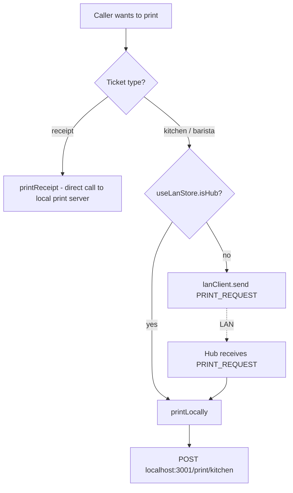
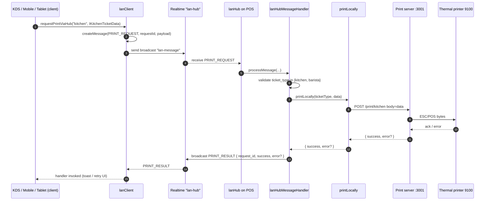
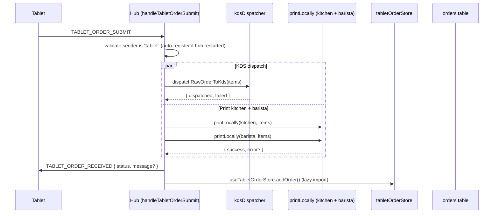

<!-- STALE-V2 -->
> ⚠️ **DOC HISTORIQUE — PÉRIMÉE (V2), NE FAIT PLUS FOI.** Ce fichier décrit en grande partie l'architecture **V2** (mono-app AppGrav, npm/Vercel, PWA/Capacitor, projet Supabase `abjabuniwkqpfsenxljp` = **prod incompatible**, versions RPC obsolètes). **Ne jamais l'appliquer tel quel** (migration, config, archi). Sources de vérité actuelles : `CLAUDE.md` (patterns + workplan) et `docs/workplan/remise-a-plat/` (référence modules réel-vs-demandé). Hiérarchie complète : `docs/README.md`. Régénération depuis le code prévue en Phase 3.

# 04 — Print Routing via the Hub

> **Last verified**: 2026-05-03

The bakery has exactly one machine running the local Express **print server** (port 3001) — the hub. So when a KDS, mobile POS, or waiter tablet needs a kitchen ticket, the request must travel hub-ward over the LAN. This page documents that routing in detail: the message types, the dispatch flow, the per-ticket routing rules, and the failure handling.

---

## 1. The two-rule decision tree

Before any LAN message exists, the calling device decides whether to print **locally** or **route via the hub**:



| Ticket | Always routed via hub? | Code path |
|--------|------------------------|-----------|
| `receipt` | **No** — printed directly by whoever owns the cash drawer | `printService.printReceipt()` |
| `kitchen` | Yes (when caller is not the hub) | `hubPrintService.requestPrintViaHub('kitchen', data)` |
| `barista` | Yes (when caller is not the hub) | `hubPrintService.requestPrintViaHub('barista', data)` |

Receipts are excluded from hub routing because they are tied to the cash drawer of the device that processed payment. Routing them through the LAN would print on the wrong drawer.

The check `if (isHub) return printLocally(...)` short-circuits LAN entirely when the caller IS the hub — see `hubPrintService.ts:25-29`.

---

## 2. Sequence — client print to physical paper



Key references:

- `requestPrintViaHub()` — `src/services/print/hubPrintService.ts:21-47`
- `LanClient.send()` — `src/services/lan/lanClient.ts:197-231`
- `processMessage()` switch landing on `PRINT_REQUEST` — `src/services/lan/lanHubMessageHandler.ts:47-49`
- `handlePrintRequest()` — `src/services/lan/lanHubMessageHandler.ts:259-286`
- `printLocally()` — `src/services/print/hubPrintService.ts:52-70`

---

## 3. Routing rules — ticket type → printer

The hub does not *select* the printer in the LAN handler. It simply calls `printKitchenTicket()` or `printBaristaTicket()` (in `printService.ts`), and the print server resolves the physical printer from `printer_configurations`.

| Ticket type | Print-server endpoint | Printer resolution |
|-------------|----------------------|--------------------|
| `receipt` | `POST /print/receipt` | `pos_terminals.default_printer_id` → `printer_configurations` (per-terminal) |
| `kitchen` | `POST /print/kitchen` | `printer_configurations.settings.category_ids` ∩ ticket items' categories; falls back to `pos_terminals.kitchen_printer_id` |
| `barista` | `POST /print/barista` | Same as kitchen, but matched against barista-mapped printer |

So a category mapping is the operator's lever for "which physical printer prints which order". This mapping lives in:

```sql
printer_configurations.settings JSONB
```

with shape (per the lan-specialist skill reference and `PrintingSettingsPage.tsx`):

```json
{
  "category_ids": ["uuid-1", "uuid-2"],
  "ticket_copies": 1,
  "is_receipt_printer": false,
  "auto_print_receipt": false,
  "cash_drawer_enabled": true,
  "cash_drawer_pin": 2
}
```

The KDS dispatcher (`src/services/pos/kdsDispatcher.ts`, called from `handleTabletOrderSubmit` line 142) computes the destination station per item using each item's `dispatch_station` (`'kitchen' \| 'barista'`).

---

## 4. The PRINT_REQUEST envelope

```ts
interface IPrintRequestPayload {
  request_id: string;     // UUID, used to correlate with PRINT_RESULT
  ticket_type: 'receipt' | 'kitchen' | 'barista';
  data: Record<string, unknown>; // serialised IKitchenTicketData
  timestamp: string;      // ISO-8601
}
```

Source: `lanProtocol.ts:261-266`. Note that `ticket_type` may say `'receipt'` syntactically, but the hub explicitly rejects it (`lanHubMessageHandler.ts:267-276`) since receipts shouldn't be routed.

The corresponding ACK:

```ts
interface IPrintResultPayload {
  request_id: string;     // matches the request
  success: boolean;
  error?: string;
  timestamp: string;
}
```

Source: `lanProtocol.ts:272-277`. The hub broadcasts (not unicasts) the result, so any client interested in this `request_id` can correlate.

---

## 5. Error handling

Failures can happen at four layers. Each is handled idempotently — the network never crashes the order flow.

| Layer | Failure | What happens | Recovery hint |
|-------|---------|--------------|---------------|
| Caller → LAN | `lanClient.send()` throws or client disconnected | Message is queued in `useLanStore.pendingMessages`; replayed on reconnect | Operator may see brief "Print queued" toast |
| LAN → Hub | Realtime channel down on hub side | Reconnect loop kicks in (`lanHub.ts:231-286`); message dropped (no replay from clients on hub side) | If hub never recovers, restart POS |
| Hub → Print server | `printLocally()` returns `{ success: false, error }` | Result broadcast as `PRINT_RESULT` with `success: false`; ticket NOT printed | Operator should fall back to PDF / handwritten ticket |
| Print server → printer | Thermal printer offline / out of paper | Print server returns 5xx; surfaced as `PRINT_RESULT.error` | Refill / power-cycle printer; manually re-trigger from KDS |

For tablet orders specifically, the hub aggregates print errors into the tablet ACK (`handleTabletOrderSubmit` lines 198–207):

```ts
const ackPayload = {
  order_id, order_number,
  status: 'received',
  message: printErrors.length > 0
    ? `Order received. Print warnings: ${printErrors.join('; ')}`
    : undefined,
  timestamp,
};
```

So the waiter sees "received with print warnings" rather than a hard fail — the order was created and dispatched, only the paper is missing.

There is **no automatic retry** for failed prints in V2. The expectation is operator visibility (toast) + manual re-trigger. Adding retries was deferred until empirical pain justified the complexity.

---

## 6. Fallbacks when no printer at all

| Situation | Fallback | Source |
|-----------|----------|--------|
| Print server unreachable from hub | `printLocally()` returns `{ success: false, error }`; PRINT_RESULT carries the error | `hubPrintService.ts:52-70` |
| Print server up, but no `printer_configurations` row matches | Print server endpoint returns success but nothing prints (silent loss) | Future: surface "no printer configured" warning |
| Hub completely unreachable from client | `lanClient.send()` falls into queueing path; nothing prints until hub returns | `lanClient.ts:202-209` |
| Customer requests digital receipt | `generate-invoice` Edge Function emits PDF; `printReceipt` is skipped entirely | `05-integrations/01-edge-functions.md` |

For digital fallback (kitchen ticket as PDF when paper is unavailable), the operator workflow today is: open the order in `/orders`, regenerate the invoice via the **Print** button. There is no automatic kitchen-ticket-to-PDF path — the kitchen prints are throwaway and not stored.

---

## 7. The hub-side handler in detail

`handlePrintRequest()` in `lanHubMessageHandler.ts:259-286`:

```ts
async function handlePrintRequest(message, broadcastFn) {
  const payload = message.payload as IPrintRequestPayload;

  // Reject anything that isn't kitchen/barista
  const ticketType = payload.ticket_type;
  if (ticketType !== 'kitchen' && ticketType !== 'barista') {
    await broadcastFn(LAN_MESSAGE_TYPES.PRINT_RESULT, {
      request_id: payload.request_id,
      success: false,
      error: `Unsupported ticket type: ${ticketType}`,
      timestamp: new Date().toISOString(),
    });
    return;
  }

  // Print on local print server
  const result = await printLocally(ticketType, payload.data);

  // ACK with result
  await broadcastFn(LAN_MESSAGE_TYPES.PRINT_RESULT, {
    request_id: payload.request_id,
    success: result.success,
    error: result.error,
    timestamp: new Date().toISOString(),
  });
}
```

A few things worth noting:

- The `PRINT_RESULT` is a **broadcast**, not a `sendTo`. The original requester filters by `request_id`. This is intentional: it lets ops dashboards observe print success rates without registering as the target.
- There is no auth check on `PRINT_REQUEST` beyond "you reached the hub channel". The hub trusts every subscriber. In a future hardening pass, the hub could verify `message.from` against `useLanStore.connectedDevices` (which it already does for `TABLET_ORDER_SUBMIT`).
- The handler is **fire-and-forget** from the hub's perspective. It does not block other LAN messages.

---

## 8. Tablet-order path — print is one of three side-effects

`TABLET_ORDER_SUBMIT` is the most complex hub flow because a single tablet message triggers three concurrent operations: KDS dispatch, printing, and tablet ACK.



Source: `lanHubMessageHandler.ts:102-253`.

The hub does not write to the `orders` table here — that's the tablet's responsibility before sending `TABLET_ORDER_SUBMIT`. The hub merely *acts on* the order (dispatch + print + UI notify).

---

## 9. Where the print server lives

The Express print server is a **separate Node.js process** running on the hub machine on port 3001. Its codebase is outside `src/` (it's a standalone repo / install). Endpoints used by the LAN flow:

| Method | Path | Used by |
|--------|------|---------|
| `GET` | `/health` | `checkPrintServer()` reachability test |
| `GET` | `/status/probe?ip=&port=` | Network discovery (Tier 1 TCP probe) |
| `GET` | `/scan/printers?prefix=&timeout=` | Network discovery (full subnet scan) |
| `POST` | `/print/receipt` | `printService.printReceipt()` |
| `POST` | `/print/kitchen` | `printService.printKitchenTicket()` (called from `printLocally`) |
| `POST` | `/print/barista` | `printService.printBaristaTicket()` (called from `printLocally`) |
| `POST` | `/drawer/open` | `printService.openCashDrawer()` |

Full server-side documentation: `05-integrations/06-print-server.md`.

If the print server is **not** running, the hub still runs (LAN messaging works), but every PRINT_REQUEST returns `{ success: false }` with a network error. Operators must start the print server (typically a system service) before opening shop.

---

## 10. SSRF protection

Note for security review: a related Edge Function `send-to-printer` (used by some non-LAN paths) restricts target IPs to private ranges (`192.168.x.x`, `10.x.x.x`, `172.16-31.x.x`, `localhost`). The LAN print routing documented here does not go through that Edge Function — it stays entirely on the hub's localhost. So SSRF is not in scope for `PRINT_REQUEST`, but is relevant for `send-to-printer` direct calls.

See `07-security/02-edge-function-security.md` for the SSRF allowlist details.

---

## 11. Cross-references

- The print server itself: `05-integrations/06-print-server.md`
- Message-envelope shape and full `PRINT_REQUEST` / `PRINT_RESULT` definitions: `05-message-protocol.md`
- KDS dispatch logic invoked alongside print: `04-modules/04-kds.md`
- Hub-client transport this rides on: `01-hub-client-model.md`
- Heartbeat that keeps the hub responsive to PRINT_REQUEST: `03-heartbeat-and-state.md`
