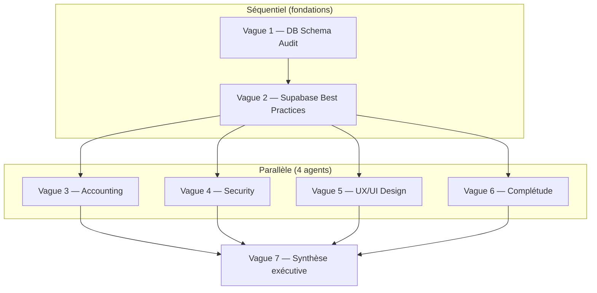

# Plan d'audit intégral V3 — The Breakery ERP

> **Created**: 2026-05-20
> **Status**: READY — à exécuter en nouvelle fenêtre de contexte
> **Estimated effort**: 4-6 heures d'audit + 1 heure de synthèse
> **Délivrables** : 5 rapports markdown + 1 synthèse exécutive consolidée

---

## 📍 Comment utiliser ce document

Ce document est **self-contained** : un Claude démarré en fenêtre vide peut l'exécuter sans contexte préalable.

### Bootstrap obligatoire (à faire avant tout)

1. **Lire les fichiers mémoire du projet** :
   - `C:\Users\guich\.claude\projects\C--Users-guich-a-trier-The-Breakery-ERP\memory\MEMORY.md`
   - `C:\Users\guich\.claude\projects\C--Users-guich-a-trier-The-Breakery-ERP\memory\v2-not-in-production.md`
   - `C:\Users\guich\.claude\projects\C--Users-guich-a-trier-The-Breakery-ERP\memory\v3-mission.md`

2. **Lire le glossaire V2↔V3** : `docs/V2_V3_GLOSSARY.md`

3. **Confirmer git status propre** :
   ```bash
   git status
   git log --oneline -5
   ```

4. **Créer le dossier de sortie des rapports** :
   ```bash
   mkdir -p docs/workplan/audits/2026-05-20-audit-integral-V3
   ```

---

## 1. Contexte critique — Lire avant de démarrer

### 1.1 Cadre du projet

**The Breakery ERP** est un POS/ERP pour boulangerie artisanale à Lombok (Indonésie).

- **V2 (AppGrav monolithe Vite+React+Supabase)** : **JAMAIS DÉPLOYÉE EN PRODUCTION**. Reste comme cahier des charges métier théorique dans `docs/reference/` et `docs/objectif travail/`.
- **V3 (code vivant)** : monorepo **pnpm + turbo** avec `apps/pos` + `apps/backoffice` + 4 packages partagés. Construit depuis Session 1 (2026-05-03), sessions S1→S25+ mergées. **Jamais déployée en prod non plus**.
- **Mission V3** : reprendre la vision V2, l'améliorer, et **diviser en 2 apps spécialisées par persona**.

### 1.2 Hiérarchie BO ↔ POS (principe directeur de l'audit)

**Le BackOffice est le cerveau, le POS est l'outil frontend** :

```
       BackOffice (cerveau)
        ↓ alimente catalogue/prix/perms/settings/recettes/COA
        ↓ mesure via reports + comptabilité
              POS (outil frontend)
              ↓ encaisse
              Cash + KDS + Customer Display + Tablet
```

Sans BO bien construit, le POS ne sait pas quoi vendre, à qui, à quel prix, comment, et le gérant ne mesure rien. **L'audit doit partir du cerveau (BO) et descendre vers ses extensions (POS, KDS, Tablet, Display)**.

### 1.3 Volumétrie actuelle V3 (2026-05-20)

- **285 migrations SQL**
- **~217 fonctions PostgreSQL / RPCs**
- **11 Edge Functions Deno** (`auth-verify-pin`, `auth-change-pin`, `auth-get-session`, `auth-logout`, `process-payment`, `cancel-item`, `refund-order`, `void-order`, `customer-birthday-notify`, `kiosk-issue-jwt`, `notification-dispatch`)
- **26 features Backoffice** (`apps/backoffice/src/features/*`)
- **24 features POS** (`apps/pos/src/features/*`)
- **~28 pages BO**, **~13 pages Reports**, **6 pages Settings**, **1 page Accounting** (`MappingsPage`)
- **4 packages partagés** (`domain` IO-free, `supabase`, `ui` Luxe Dark, `utils`)

### 1.4 État de complétude V3 vs vision V2 (synthèse audit du 2026-05-20)

| Statut | Modules |
|---|---|
| 🟢 **DONE** (parité atteinte ou dépassée) | 14 : Auth, POS, Payments, KDS, Products (S27), Inventory, Purchasing, Customers, Cash, Promotions, Production (sub-recipes ✅), Tablet, Users, LAN |
| 🟡 **PARTIEL** | 4 : B2B (S24 Foundation), Accounting (UI 4/11), Expenses (UI 2/4), Settings (6/23), Customer Display |
| 🔴 **MAJEUR** | 2 : Reports (13/61), Mobile Shell (0) |

### 1.5 Conventions critiques à respecter

À garder en tête pendant l'audit (depuis `CLAUDE.md`) :

1. **PIN auth via fetch wrapper custom** — l'EF `auth-verify-pin` émet HS256 JWT que GoTrue (ES256) ne valide pas. Le client Supabase utilise un wrapper `setSupabaseAccessToken` (`packages/supabase`). **Jamais** de raw `Authorization` headers ni `auth.setSession`.
2. **Channels Realtime suffixés UUID** — StrictMode double-monte les composants, les canaux nommés collident silencieusement.
3. **`packages/domain` est IO-free** — no fetch, no Supabase, no React.
4. **Order writes via RPCs uniquement** — jamais d'inserts bruts. RPCs : `complete_order` v9, `pay_existing_order` v6, `create_tablet_order_v2`, `pickup_tablet_order`, `evaluate_promotions_v1`, `mark_item_served`.
5. **Toutes tables publiques RLS-protected** avec helper `has_permission()` v7.
6. **Audit log nominatif** (table `audit_logs` pluriel — singular `audit_log` dropped S13).

---

## 2. Stratégie d'audit — 6 vagues

### Principe d'orchestration
- **Vagues 1+2** : séquentielles (vague 2 dépend de la propreté DB validée par vague 1)
- **Vagues 3+4+5+6** : parallélisables après vague 2 (4 agents en parallèle, gain de temps)
- **Vague 7** : synthèse finale par le Claude orchestrateur

### Pourquoi cet ordre
- Le **sang** (DB) doit être sain avant de juger le **système nerveux** (RPCs)
- Les **piliers** (Accounting, Sécurité) dépendent de RPCs propres
- L'**ergonomie** (UX) et la **complétude** (gaps) sont indépendants des vagues 1-4

---

## 🩸 VAGUE 1 — Fondations DB (le sang)

### 🎯 Objectif
Vérifier que le schéma DB est **cohérent avec le code**. Détecter les drifts cumulés sur 285 migrations.

### 🧰 Skill à invoquer
```
Skill anthropic-skills:db-schema-audit
```

### 📂 Scope
- `supabase/migrations/*.sql` (285 fichiers — analyse statique)
- `packages/supabase/src/types.generated.ts` (types TypeScript générés)
- Tous les `apps/**/*.ts` qui consomment des RPCs (via `supabase.rpc('xxx')`)
- Tables clés à vérifier : `orders`, `order_items`, `order_payments`, `customers`, `products`, `categories`, `stock_movements`, `journal_entries`, `audit_logs`, `idempotency_keys`, `recipes`, `recipe_versions`, `production_records`, `expenses`, `b2b_orders`, `pos_sessions`, `fiscal_periods`

### 🤖 Prompt suggéré
> "Audit drift schema DB ↔ code TypeScript pour The Breakery V3.
> 
> Working dir : C:\Users\guich\a trier\The_Breakery_ERP
>
> Tâches :
> 1. Détecter les RPCs déclarées dans `supabase/migrations/` mais **jamais appelées** dans `apps/**` (RPCs orphelines mortes)
> 2. Détecter les `supabase.rpc('xxx')` dans `apps/**` qui **n'existent pas** dans les migrations (RPCs fantômes — bug en attente)
> 3. Détecter les colonnes utilisées dans le code via `from('xxx').select('col_x')` qui n'existent **pas** ou plus dans le schéma
> 4. Détecter les enums driftés : valeurs utilisées dans le code mais absentes des enums DB (et vice versa)
> 5. Vérifier que `packages/supabase/src/types.generated.ts` reflète l'état actuel des migrations (`pnpm db:types` à blanc serait-il un diff ?)
> 6. Vérifier la monotonie des migrations (timestamps croissants, pas de gap suspect)
>
> Livrable : rapport markdown dans `docs/workplan/audits/2026-05-20-audit-integral-V3/01-db-schema-audit.md`
> Format : sections par catégorie (orphelines, fantômes, colonnes, enums, types, monotonie) + tableau de findings (sévérité Critique/Élevé/Moyen/Bas + fichier:ligne + remediation suggérée)"

### 📋 Livrables attendus
- `docs/workplan/audits/2026-05-20-audit-integral-V3/01-db-schema-audit.md`
- Liste actionnable de findings classés par sévérité
- Recommandations de migration corrective si nécessaire

### ✅ Critères de succès
- Aucune RPC fantôme (appelée mais inexistante) tolérée
- Tous les findings Critique/Élevé ont une remediation chiffrée

---

## 🧠 VAGUE 2 — Système nerveux (RPCs + RLS + Edge Functions)

### 🎯 Objectif
Auditer la qualité des **~217 RPCs** et patterns Supabase. C'est le système qui pilote toute la logique business depuis le BO et que le POS consomme.

### 🧰 Skill à invoquer
```
Skill anthropic-skills:supabase-best-practices
```

### 📂 Scope
**RPCs critiques BO** (à auditer en priorité) :
- Products : `create_product_v1`, `update_product_v1`, `set_product_units_v1`, `set_product_sections_v1`, `upsert_product_modifiers_v1`, `create_category_v1`, `update_category_v1`, `reorder_categories_v1`
- Inventory : `record_stock_movement_v1`, `adjust_stock_v1`, `receive_stock_v1`, `waste_stock_v1`, `get_stock_levels_v1`, `record_incoming_stock`, `internal_transfer` (4 RPCs)
- Production : `record_production`, `record_batch_production`, `calculate_recipe_cost`, `recipe_bom_full_v1`, `validate_recipe_no_cycle`, `revert_production`, `duplicate_recipe`, `suggest_production_schedule`, `snapshot_recipe_version_helper`
- Purchasing : `create_po`, `receive_po`, `cancel_po`, `update_cost_price_v1`
- B2B : `validate_b2b_credit_limit_v1`, `record_b2b_payment_v1`, `adjust_b2b_balance_v1`, `b2b_order_v1`
- Expenses : 5 RPCs (`create_expense`, etc.)
- Accounting : `init_accounting_mappings`, `pnl_rpc`, `balance_sheet_rpc`, `cash_flow_rpc`, `cash_flow_v1_3sections`, `calculate_vat_payable_rpc`, `retry_sale_je_rpc`, `update_mapping_rpc`
- Users/Auth : 6 RPCs `create_user_rpcs`, `refactor_has_permission`, `update_role_session_timeout_v1`, `record_rate_limit_v1`

**RPCs critiques POS** (consommateurs du BO) :
- Orders : `complete_order` v9, `pay_existing_order` v6, `create_tablet_order_v2`, `pickup_tablet_order_rpc`, `cancel_tablet_order_rpc`, `mark_item_served_rpc`, `send_items_rpc`, `void_order_rpc`, `refund_order_rpc`, `cancel_order_item_rpc`
- Promotions : `evaluate_promotions_v1`
- Customers : `adjust_loyalty_points_v1`, `get_customer_product_price_rpc`, `soft_delete_customer_rpc`
- Shift : `close_shift_rpc`, `record_cash_movement_rpc`

**Edge Functions** (`supabase/functions/`) :
- 11 EFs à auditer pour : structure shared/, CORS, rate limiting, idempotency, PIN header, error handling

**RLS** :
- Helper `has_permission()` v7 (S13+S17 refactor)
- Helper `is_authenticated()`
- GRANT hardening S20 (REVOKE anon tables/views/functions)
- Patterns RLS sur orders, customers, stock_movements, journal_entries, audit_logs

### 🤖 Prompt suggéré
> "Audit Supabase best practices pour The Breakery V3 — BO + POS.
>
> Working dir : C:\Users\guich\a trier\The_Breakery_ERP
>
> Tâches :
> 1. Pour chaque RPC critique listée dans `docs/workplan/plans/2026-05-20-audit-integral-V3-plan.md` §VAGUE 2 :
>    - Vérifier SECURITY DEFINER si écriture, SECURITY INVOKER si lecture
>    - Vérifier que les permissions GRANT sont propres (REVOKE anon ALL)
>    - Vérifier que la RPC a des permissions check via `has_permission()` côté ligne 1
>    - Vérifier qu'elle est idempotente si réseau-sensible (utilise `idempotency_keys` pour les RPCs de mutation cross-EF)
>    - Vérifier qu'elle ne fait pas de `select('*')`
> 2. RLS : vérifier que toutes les tables publiques ont au moins une policy active. Repérer les `USING(true)` résiduels sur tables PII.
> 3. Edge Functions : vérifier auth-verify-pin flow + idempotency helper `_shared/idempotency.ts` (S25) + CORS + rate-limit
> 4. Types : `select('*')` dans le code, `as any`, `as never` — count + locations
> 5. Realtime : channels suffixés UUID (StrictMode-safe), pas de fuite de subscriptions
>
> Livrable : `docs/workplan/audits/2026-05-20-audit-integral-V3/02-supabase-best-practices.md`
> Format : section par catégorie + table de findings (sévérité, RPC/EF, fichier:ligne, remediation)"

### 📋 Livrables attendus
- `docs/workplan/audits/2026-05-20-audit-integral-V3/02-supabase-best-practices.md`
- Score qualité par catégorie (RPCs, RLS, EFs, types, realtime)
- Liste des `select('*')` et `as any` à éradiquer

### ✅ Critères de succès
- 0 RPC sans `has_permission()` check pour les mutations sensibles
- 0 `USING(true)` sur tables PII (S13+S20 doivent être préservés)
- 0 Realtime channel non-suffixé

---

## 🧾 VAGUE 3 — Mémoire (Module Accounting + JE matrix)

### 🎯 Objectif
Vérifier la **complétude comptable** : chaque opération métier génère-t-elle bien une JE conforme SAK EMKM ?

### 🧰 Skill à invoquer
```
Skill anthropic-skills:accounting-audit
```

### 📂 Scope
- COA (Chart of Accounts) — actuellement géré par `init_accounting_mappings` (S17) et `MappingsPage`
- Triggers JE : `create_sale_journal_entry` (refactor S17), `create_purchase_journal_entry_trigger`, `init_je_triggers` (S1), `refactor_refund_je` (S17), `tr_stock_movement_je_function` (S17), `init_refund_je_trigger`
- RPC `calculate_vat_payable_rpc` — PB1 10/110 formula
- RPCs reports financiers : `pnl_rpc`, `balance_sheet_rpc`, `cash_flow_rpc` + `cash_flow_v1_3sections` (S21)
- Tables : `journal_entries`, `journal_entry_lines`, `fiscal_periods`, `accounting_mappings`, `view_ar_aging`, `current_year_earnings_account` (S17)
- Pages BO : `apps/backoffice/src/pages/accounting/MappingsPage.tsx`, `apps/backoffice/src/pages/reports/{BalanceSheet,ProfitLoss,CashFlow}Page.tsx`

### 🤖 Prompt suggéré
> "Audit comptable du module accounting de The Breakery V3.
>
> Working dir : C:\Users\guich\a trier\The_Breakery_ERP
>
> Contexte : conformité **SAK EMKM** (norme PME indonésienne), **PB1 10%** (taxe restaurant locale, formule `total × 10/110`), NPWP, plan comptable 4 classes (1xxx actif, 2xxx passif, 3xxx capital, 4xxx revenu, 5xxx charges).
>
> Tâches :
> 1. JE matrix complétude : pour chaque type d'opération métier (vente cash, vente card, vente B2B, achat PO réception, paiement fournisseur, production, casse, expense approval, refund, void, écart caisse), vérifier qu'un trigger ou RPC génère une JE équilibrée (débit = crédit)
> 2. COA cohérence : tous les comptes utilisés dans les triggers/RPCs existent-ils dans `accounting_mappings` ? Codes 4-5 chiffres conformes SAK EMKM ?
> 3. PB1 formule : `tax_amount = total × 10/110` est-elle appliquée partout (cart, paiement, refund, B2B) ?
> 4. Fiscal periods : RPC `init_fiscal_periods` + statuts open/pending_closure/closed — les RPCs refusent-elles les écritures sur période fermée ?
> 5. Reports financiers : balance sheet, P&L, cash flow 3 sections — formules cohérentes, totaux équilibrés ?
> 6. Gaps UI (vague 1 d'audit précédent) : ChartOfAccounts, JournalEntries, GeneralLedger, TrialBalance, VATManagement, ARAging, BankReconciliation, CALK, FiscalPeriodModal — ces 9 pages absentes sont-elles bloquantes pour la mise en prod ?
>
> Livrable : `docs/workplan/audits/2026-05-20-audit-integral-V3/03-accounting-audit.md`
> Format : JE matrix complète (opération métier × écriture générée) + findings + plan de remediation S26"

### 📋 Livrables attendus
- `docs/workplan/audits/2026-05-20-audit-integral-V3/03-accounting-audit.md`
- JE matrix exhaustive (tableau opération → écriture)
- Score conformité SAK EMKM
- Prep input pour S26 Comptable Cockpit

### ✅ Critères de succès
- Chaque opération métier mappe à au moins une JE équilibrée
- Aucun gap critique pour la conformité fiscale Indonésie

---

## 🛡 VAGUE 4 — Défenses immunitaires (Sécurité)

### 🎯 Objectif
Auditer **RBAC + RLS + auth flow + Edge Functions security** pour s'assurer que personne ne peut faire ce qu'il ne doit pas.

### 🧰 Skill à invoquer
```
Skill anthropic-skills:security-review
```

### 📂 Scope
- **PIN auth flow** : `auth-verify-pin` EF + custom fetch wrapper `setSupabaseAccessToken` dans `packages/supabase/`
- **RBAC matrix** : permissions atomiques (~70) × rôles (7 standards : Owner, Manager, Cashier, Barista, Kitchen, Accountant, Stockman)
- **RLS policies** : toutes tables publiques + helper `has_permission()` v7 (S13+S17 refactor)
- **GRANT hardening** : S20 — REVOKE anon sur tables, vues, fonctions (defense-in-depth)
- **Rate limiting durable** : S19 — `record_rate_limit_v1` RPC + pg_cron purge + 5 EFs câblés
- **Idempotency** : S25 — `idempotency_keys` + `_shared/idempotency.ts` (EFs)
- **Audit log** : table `audit_logs` (renommée S13) — toutes actions sensibles tracées
- **Secrets** : aucun secret dans le code, `.env.example` propre, Supabase vault pour secrets EFs
- **Edge Functions** : CORS allowlist, JWT verification, error handling, PIN header injection
- **Session timeout** : per-role config (S19+S23) — `update_role_session_timeout_v1`
- **PIN strength** : warn S19
- **PII columns** : customers — hardening grants S15

### 🤖 Prompt suggéré
> "Audit sécurité intégral The Breakery V3 (POS/ERP boulangerie Indonésie).
>
> Working dir : C:\Users\guich\a trier\The_Breakery_ERP
>
> Contexte critique :
> - PIN auth wrapper custom (`packages/supabase/src/setSupabaseAccessToken`) — l'EF `auth-verify-pin` émet HS256 JWT que GoTrue ne valide pas en natif. Jamais `auth.setSession` raw.
> - GRANT hardening S20 : REVOKE anon sur tables/vues/functions doit être préservé
> - RLS helper `has_permission()` v7 (S13+S17 refactor) — pattern central
> - Idempotency S25 — `idempotency_keys` table + `_shared/idempotency.ts`
> - Audit log `audit_logs` (pluriel — singular `audit_log` dropped S13)
>
> Tâches :
> 1. RBAC : matrice ~70 permissions × 7 rôles — gaps de cloisonnement ? Owner-only respecté ? Cashier ne peut pas faire `users.roles` ? `accounting.manage` séparé de `accounting.view` ?
> 2. RLS : toutes tables publiques ont au moins une policy ? `USING(true)` résiduels sur PII ? Helper `has_permission()` v7 utilisé partout (pas de duplication)
> 3. PIN auth : flow complet (verify → JWT HS256 → wrapper inject → Supabase client). Pas de raw Authorization header ? Pas de fuite en logs ?
> 4. EFs : CORS allowlist correcte (cible production V3, V2 jamais déployée), JWT verify, rate limit câblé sur les 5 EFs sensibles (auth-verify-pin, process-payment, refund-order, void-order, etc.)
> 5. Idempotency S25 : table `idempotency_keys` + `_shared/idempotency.ts` — utilisée par toutes les EFs mutantes ? Replay envelope ?
> 6. Audit log : actions sensibles tracées (void, refund, discount > seuil, settings update, RBAC change, PIN reset, soft delete) ?
> 7. Secrets : 0 secret dans le code, .env.example propre, gitignore correct
> 8. Session timeout per role : RPC `update_role_session_timeout_v1` (S23) — câblée côté frontend ?
>
> Livrable : `docs/workplan/audits/2026-05-20-audit-integral-V3/04-security-review.md`
> Format : OWASP-like (1 finding par vuln), sévérité Critique/Élevé/Moyen/Bas, CWE si applicable, remediation"

### 📋 Livrables attendus
- `docs/workplan/audits/2026-05-20-audit-integral-V3/04-security-review.md`
- Liste OWASP-like des vulnerabilities
- RBAC matrix consolidée (~70 × 7)
- Plan remediation prioritisé

### ✅ Critères de succès
- 0 vuln Critique ou Élevée non remediée
- RBAC matrix cohérente sans lacune

---

## 🎨 VAGUE 5 — Ergonomie cognitive (UX BO)

### 🎯 Objectif
Auditer l'**expérience utilisateur du BackOffice** — c'est l'écran où le gérant/manager/comptable passe le plus de temps.

### 🧰 Skill à invoquer
```
Skill anthropic-skills:app-design-specialist
```

### 📂 Scope
- `apps/backoffice/src/layouts/` (Sidebar, BackofficeLayout)
- `apps/backoffice/src/pages/*` (28 pages)
- `packages/ui/src/{primitives,components,tokens,themes}/` (Luxe Dark)
- `packages/ui/tailwind.config.*` et tailwind preset
- Composants signature : `CategoryFormDialog`, `NewProductDialog`, `ProductDetailHeader`, `ExpensesListPage`, `BalanceSheetPage`, etc.
- Focus-trap Radix S22 lock-in + ESLint rule `no-raw-modal-overlay`
- Responsive (tablet, desktop) — BO est desktop-first
- Skeleton loaders, dark mode, animations, spacing
- Accessibility (a11y) — `apps/backoffice` doit respecter WCAG AA

### 🤖 Prompt suggéré
> "Audit UI/UX du Backoffice The Breakery V3.
>
> Working dir : C:\Users\guich\a trier\The_Breakery_ERP
> Stack : React + Vite + Tailwind + shadcn/ui (vendu, pas npm) + Luxe Dark theme + Radix primitives
>
> Contexte : le Backoffice est **le cerveau** du système, utilisé par 3 personas (gérant, manager, comptable). Il doit être :
> - Dense en information (tableaux, graphiques) mais lisible
> - Cohérent en design system (Luxe Dark, tokens, espacement)
> - Rapide (skeleton loaders, pas de spinners infinis)
> - Accessible (a11y AA)
> - Cohérent avec V2 vision (mais V2 jamais déployée, V3 = livraison réelle)
>
> Tâches :
> 1. Cohérence design system : tous les composants utilisent-ils les tokens Luxe Dark (`packages/ui/src/tokens/`) ? Pas de hardcoded hex/spacing ?
> 2. shadcn primitives : tous vendus dans `packages/ui/src/primitives/` ? Pas d'import npm direct depuis `apps/`
> 3. Focus trap S22 : `no-raw-modal-overlay` ESLint rule respectée ? Toutes les modales passent par Radix Dialog ?
> 4. Layouts : Sidebar lisible, navigation entre modules claire ? Pages denses (Reports, Inventory, Accounting Mappings) ergonomiques ?
> 5. Tableaux : tri, pagination, filtres, export CSV/PDF — patterns cohérents ?
> 6. Modales : confirm patterns, escape close, focus management
> 7. Dark mode : cohérent partout, lisibilité du texte sur fond dark
> 8. Responsive : breakpoints, touch targets si tablette gérante
> 9. Skeleton loaders : présents sur les chargements > 200ms ?
> 10. Accessibility : labels ARIA, contraste, navigation clavier
>
> Livrable : `docs/workplan/audits/2026-05-20-audit-integral-V3/05-ux-design-audit.md`
> Format : section par catégorie + screenshots cible (si possible) + findings"

### 📋 Livrables attendus
- `docs/workplan/audits/2026-05-20-audit-integral-V3/05-ux-design-audit.md`
- Recommandations design system
- Liste des inconsistances visuelles à corriger

### ✅ Critères de succès
- 0 import shadcn direct depuis npm dans `apps/`
- 0 violation `no-raw-modal-overlay` ESLint
- Design system cohérent

---

## 📊 VAGUE 6 — Complétude fonctionnelle (gaps BO vs vision V2)

### 🎯 Objectif
**Inventaire de chantier** — quelles features de la vision V2 ne sont pas encore livrées en V3 ? Quelles sont prioritaires ?

### 🧰 Skill à invoquer
Pas de skill dédiée — analyse manuelle structurée + lecture des 16 fiches métier.

### 📂 Scope
Pour chaque fiche `docs/objectif travail/*.md` (16 fiches) :
- Identifier les sections "ce que le module doit faire encore — backlog métier"
- Comparer aux features livrées dans `apps/backoffice/src/features/` et `apps/pos/src/features/`
- Croiser avec les sessions planifiées S26→S30

### 🤖 Prompt suggéré
> "Audit complétude fonctionnelle V3 vs vision V2 (cahier des charges).
>
> Working dir : C:\Users\guich\a trier\The_Breakery_ERP
>
> Contexte : V3 (monorepo) construit from scratch sur la vision V2 (jamais déployée). V2 = cahier des charges dans `docs/objectif travail/` (16 fiches) et `docs/reference/04-modules/` (21 modules).
>
> Plan séquencé S26→S30 :
> - S26 Comptable Cockpit (10 pages Accounting BO)
> - S28 Expense Governance (ExpenseFormPage, Categories, workflow)
> - S29 Reports Export + Z-Report PDF (~48 reports manquants)
> - S30 Decision Sprint + Cleanup (Mobile shell decision, Settings, polish)
>
> Tâches :
> 1. Pour chaque fiche objectif travail (16 fiches), lire les sections '§Ce que le module doit (encore) faire — backlog métier' et lister les items P0/P1 vs implémentés
> 2. Croiser avec le glossaire `docs/V2_V3_GLOSSARY.md` pour les renommages
> 3. Construire une matrice : Module × Feature × Statut (✅ DONE / 🟡 PARTIEL / 🔴 ABSENT) × Session cible
> 4. Identifier les WONTFIX (mono-site permanent : multi-établissement loyalty, consolidation multi-entité, multi-tenancy, multi-LAN)
> 5. Identifier les améliorations V3 au-delà de V2 (déjà 15 listées dans le glossaire §6) — à conserver et documenter
>
> Livrable : `docs/workplan/audits/2026-05-20-audit-integral-V3/06-completeness-audit.md`
> Format : matrice exhaustive + plan de finition consolidé"

### 📋 Livrables attendus
- `docs/workplan/audits/2026-05-20-audit-integral-V3/06-completeness-audit.md`
- Matrice exhaustive features × sessions
- Validation du plan S26→S30 (ou propositions d'ajustement)

### ✅ Critères de succès
- Inventaire de chantier complet
- Plan de finition cohérent et chiffré

---

## 🔬 VAGUE 7 — Synthèse exécutive

### 🎯 Objectif
Consolider les 6 rapports en **1 document de décision exécutive** lisible par le propriétaire en 15 minutes.

### Action
Orchestrateur (Claude) lit les 6 rapports + produit :

### 📋 Livrable
`docs/workplan/audits/2026-05-20-audit-integral-V3/00-EXECUTIVE-SUMMARY.md`

Structure :
1. **TL;DR** : 5-10 lignes max — état du projet en une vue
2. **Findings Critiques** (toutes vagues confondues, top 10)
3. **Findings Élevés** (top 20)
4. **Plan de remediation immédiat** (avant S26)
5. **Validation plan S26→S30** ou ajustements proposés
6. **Améliorations V3 à conserver** (gains nets vs V2)
7. **Décisions business à prendre** (Mobile shell, WONTFIX confirmation, prod cutover)
8. **Annexes** : liens vers les 6 rapports détaillés

---

## 3. Ordre d'exécution recommandé



### Temps estimé
- Vague 1 : 30-45 min
- Vague 2 : 60-90 min
- Vagues 3, 4, 5, 6 (en parallèle) : ~60 min (l'agent le plus long)
- Vague 7 (synthèse) : 30-45 min
- **Total** : 3-4 heures si parallélisation, 5-7 heures si séquentiel

### Stratégie de parallélisation (vague 3-6)
Lancer 4 agents en parallèle en un seul message :

```
Agent({ description: "Audit Accounting", subagent_type: "Explore", prompt: "..." })  // skill anthropic-skills:accounting-audit
Agent({ description: "Audit Security", subagent_type: "Explore", prompt: "..." })    // skill anthropic-skills:security-review
Agent({ description: "Audit UX BO", subagent_type: "Explore", prompt: "..." })       // skill anthropic-skills:app-design-specialist
Agent({ description: "Audit Complétude", subagent_type: "Explore", prompt: "..." })  // analyse manuelle
```

**Attention** : les skills s'invoquent au début du prompt de l'agent, pas via Skill tool. Format : "Tu dois invoquer la skill `anthropic-skills:accounting-audit` puis exécuter les tâches ci-dessous : ..."

---

## 4. Structure de sortie

```
docs/workplan/audits/2026-05-20-audit-integral-V3/
├── 00-EXECUTIVE-SUMMARY.md       ← Vague 7 (synthèse pour le propriétaire)
├── 01-db-schema-audit.md         ← Vague 1
├── 02-supabase-best-practices.md ← Vague 2
├── 03-accounting-audit.md        ← Vague 3
├── 04-security-review.md         ← Vague 4
├── 05-ux-design-audit.md         ← Vague 5
└── 06-completeness-audit.md      ← Vague 6
```

---

## 5. Format de rapport standardisé

Chaque rapport de vague suit ce squelette :

```markdown
# [Titre du rapport]

> **Date** : YYYY-MM-DD
> **Skill** : anthropic-skills:xxx
> **Scope** : ...
> **Effort** : N minutes

## TL;DR (5 lignes max)

## Méthodologie
[Ce qu'on a vérifié]

## Findings

### Critiques 🔴 (action immédiate)
| ID | Finding | Fichier:ligne | Remediation |
|---|---|---|---|

### Élevés 🟠 (action prochaine session)
| ID | Finding | Fichier:ligne | Remediation |
|---|---|---|---|

### Moyens 🟡 (backlog)
| ID | Finding | Fichier:ligne | Remediation |
|---|---|---|---|

### Bas 🟢 (info)
| ID | Finding | Fichier:ligne | Remediation |
|---|---|---|---|

## Annexes
[Données brutes, matrices, etc.]
```

---

## 6. Références (à consulter pendant l'audit)

### Documentation projet
- `docs/V2_V3_GLOSSARY.md` — mapping symboles V2↔V3 (RPCs renommés, hooks renommés, pages déplacées, améliorations V3)
- `docs/README.md` — vue d'ensemble doc
- `docs/reference/04-modules/*.md` — 21 modules (référence V2 monolithe)
- `docs/objectif travail/*.md` — 16 fiches business V2 cible (avec headers V2/V3 ajoutés 2026-05-20)
- `docs/workplan/backlog-by-module/00-roadmap-globale.md` — roadmap globale avec audit synthèse
- `docs/workplan/plans/2026-05-19-S24-to-S30-plan.md` — plan séquencé S24-S30
- `docs/workplan/refs/2026-05-13-v2-v3-path-translation.md` — pont V2→V3 paths (figé S13)

### Code projet
- `apps/backoffice/src/features/*` (26 features) et `apps/backoffice/src/pages/*` (~28 pages)
- `apps/pos/src/features/*` (24 features)
- `packages/{domain,supabase,ui,utils}/src/`
- `supabase/migrations/*.sql` (285 fichiers)
- `supabase/functions/*` (11 EFs)
- `supabase/tests/*.test.sql` (pgTAP)

### Configuration projet
- `CLAUDE.md` (root) — conventions critiques à respecter
- `package.json`, `pnpm-workspace.yaml`, `turbo.json` — orchestration monorepo

### Mémoire Claude (PERSISTENT)
- `~\.claude\projects\C--Users-guich-a-trier-The-Breakery-ERP\memory\MEMORY.md`
- `~\.claude\projects\C--Users-guich-a-trier-The-Breakery-ERP\memory\v2-not-in-production.md`
- `~\.claude\projects\C--Users-guich-a-trier-The-Breakery-ERP\memory\v3-mission.md`

---

## 7. Commandes utiles pendant l'audit

```bash
# Vérifier état git
git status
git log --oneline -10

# Compter les migrations
ls supabase/migrations | wc -l

# Compter les RPCs
grep -ri "^create function\|^CREATE FUNCTION\|^create or replace function" supabase/migrations | wc -l

# Lister les pages BO
find apps/backoffice/src/pages -name "*.tsx" | wc -l

# Lister les features BO et POS
ls apps/backoffice/src/features/
ls apps/pos/src/features/

# Tests
pnpm test
pnpm typecheck
pnpm lint

# Types DB
pnpm db:types  # Régénère packages/supabase/src/types.generated.ts
git diff packages/supabase/src/types.generated.ts  # Drift?

# RLS check rapide
grep -r "USING(true)" supabase/migrations | wc -l   # Devrait être ≈0 sur PII

# Idempotency S25
grep -r "idempotency_keys" supabase/migrations | head
grep -r "_shared/idempotency" supabase/functions | head
```

---

## 8. Critères de succès global de l'audit

L'audit intégral est un **succès** si à la fin :

1. ✅ Les 6 rapports + 1 executive summary existent dans `docs/workplan/audits/2026-05-20-audit-integral-V3/`
2. ✅ Chaque finding Critique/Élevé a une remediation chiffrée + assignée à une session future (ou à un fix immédiat)
3. ✅ Le plan S26→S30 est validé ou ajusté avec justifications
4. ✅ Les améliorations V3 au-delà de V2 sont documentées (mises à jour dans `docs/V2_V3_GLOSSARY.md` §6 si nouvelles découvertes)
5. ✅ Les drifts schema/code sont remédiés (vague 1) — pas de RPC fantôme tolérée
6. ✅ La sécurité est validée — 0 vuln Critique
7. ✅ Le propriétaire peut prendre des décisions business éclairées sur Mobile Shell, prod cutover, WONTFIX

---

## 9. Workflow Claude pour exécuter ce plan

### Étape 1 — Bootstrap (5 min)
Lire la doc, charger la mémoire, vérifier git, créer le dossier de sortie.

### Étape 2 — Vague 1 séquentielle (30-45 min)
Invoquer `anthropic-skills:db-schema-audit` avec le prompt §VAGUE 1.

### Étape 3 — Lecture du rapport vague 1 (5 min)
Décider si les findings Critiques bloquent l'enchaînement (si OUI : remediation immédiate avant vague 2; si NON : on continue).

### Étape 4 — Vague 2 séquentielle (60-90 min)
Invoquer `anthropic-skills:supabase-best-practices` avec le prompt §VAGUE 2.

### Étape 5 — Vagues 3+4+5+6 en parallèle (60 min)
Lancer 4 agents en parallèle (1 message, 4 tool calls Agent).

### Étape 6 — Synthèse vague 7 (30-45 min)
Le Claude orchestrateur lit les 6 rapports et écrit `00-EXECUTIVE-SUMMARY.md`.

### Étape 7 — Commit et présentation (5 min)
```bash
git add docs/workplan/audits/2026-05-20-audit-integral-V3/
git commit -m "audit(integral): V3 — 6 rapports + executive summary

Couvre: DB schema, Supabase best practices, accounting (JE matrix + SAK EMKM),
sécurité (RBAC/RLS/PIN/idempotency), UX BackOffice, complétude vs vision V2.

Cadre: V3 = V2 améliorée + splitée POS/BackOffice. V2 jamais déployée
en production. Audit BO-centric (le BO est le cerveau du POS).

Refs:
- Plan: docs/workplan/plans/2026-05-20-audit-integral-V3-plan.md
- Glossaire: docs/V2_V3_GLOSSARY.md
- Memory: v2-not-in-production, v3-mission

Co-Authored-By: Claude Opus 4.7 <noreply@anthropic.com>"
```

Présenter le `00-EXECUTIVE-SUMMARY.md` au propriétaire.

---

## 10. Que faire si une vague échoue ?

### Si la skill ne déclenche pas
- Vérifier que la skill est listée dans la liste des skills disponibles (visible dans system-reminder au démarrage de Claude Code)
- Tenter `Skill anthropic-skills:db-schema-audit` directement (avec `Skill` tool)
- Si la skill n'est pas disponible : faire l'audit manuellement avec un agent `Explore` + un prompt très détaillé (les prompts fournis ici sont autosuffisants)

### Si un agent retourne un rapport vide ou hallucine
- Ne pas faire confiance — relancer avec prompt plus contraint
- Préciser explicitement les fichiers exacts à lire (paths absolus)
- Limiter le scope (ex: "audit uniquement les RPCs créées en S17+")

### Si la session est interrompue
- Le plan est en `docs/workplan/plans/2026-05-20-audit-integral-V3-plan.md` — reprendre depuis la dernière vague terminée
- Vérifier l'existence des fichiers `01-*.md`, `02-*.md`, etc. — savoir où on en est

---

**Fin du plan d'audit intégral V3.**
Bonne chance pour l'exécution. Le rapport `00-EXECUTIVE-SUMMARY.md` est le livrable final qui valide ou réoriente la suite du projet.
