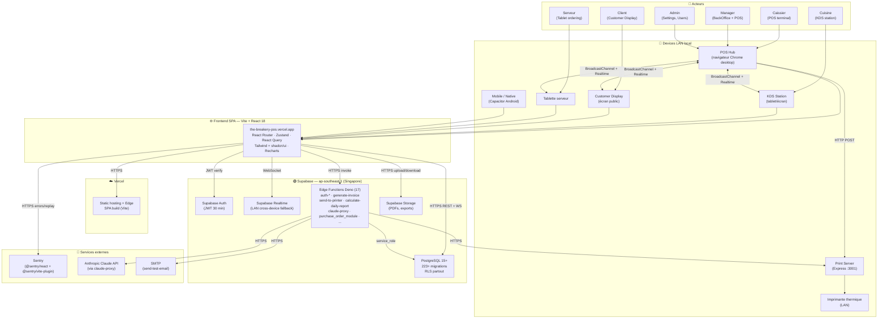
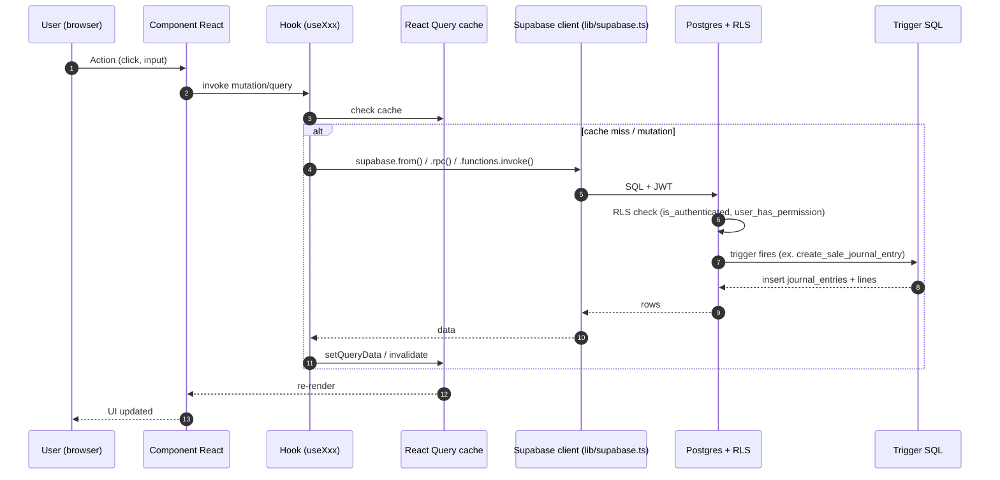

# 01 — System Architecture

> **Last verified**: 2026-05-03

Vue système globale d'AppGrav V2 — niveau **C4 Container** (acteurs, systèmes, conteneurs, intégrations).

## Diagramme global

## Conteneurs et responsabilités

| Conteneur | Stack | Responsabilité |
|---|---|---|
| **SPA `the-breakery-pos`** | Vite 5 + React 18 + TS 5.2 | Toute l'UI, le state local, l'orchestration des appels Supabase |
| **Vercel hosting** | Static + Edge | Déploiement build SPA, preview deployments par PR |
| **PostgreSQL** | Supabase Managed | Source de vérité des données, RLS, triggers JE auto |
| **Supabase Auth** | JWT | Sessions, refresh, custom claims via `user_has_permission` |
| **Supabase Realtime** | WebSocket | Synchronisation cross-device (fallback du BroadcastChannel) |
| **Edge Functions** | Deno | Logique privilégiée (PIN auth, invoice gen, print routing, daily reports, LLM proxy) |
| **Storage** | S3-compatible | PDFs factures, exports XLSX |
| **Print Server** | Express :3001 (local LAN) | Pont navigateur ↔ imprimantes thermiques |
| **Sentry** | SaaS | Monitoring erreurs + replay + sourcemaps `hidden` |
| **Capacitor (mobile)** | Bridge natif | Wrapper Android/iOS — partage 100 % du code SPA |

## Flux de données canonique

## Patterns architecturaux clés

### 1. SPA stateful avec Zustand + React Query

- **Zustand** : state local persistant et orchestré (cart, auth, paiement, lan, terminal). 14 stores. Voir [`03-state-management.md`](03-state-management.md).
- **React Query** : data fetching Supabase — toutes les listes/détails passent par un hook `useXxx`. ~150 hooks. Voir [`05-data-flow.md`](05-data-flow.md).

### 2. Backend "thin" — logique dans la DB

La majorité de la logique métier vit dans **Postgres** (triggers + RPCs) :
- **Triggers** : création automatique des JE comptables sur `orders.completed`, `purchase_orders.received`, etc.
- **RPCs atomiques** : `complete_order_with_payments(order_id, payments[])` pour split payment, `approve_expense_with_journal`, `update_role_permissions`.
- **RLS systématique** : toute table a au moins une politique `SELECT` basée sur `is_authenticated()`.

Détail : [`03-database/`](../03-database/).

### 3. Edge Functions pour les opérations sensibles

Les opérations qui requièrent :
- **Privilèges** (`service_role` ou bypass RLS) → Edge Function avec `verify_jwt: true`
- **Secrets externes** (Anthropic API key, SMTP creds) → Edge Function
- **Génération de fichiers** (PDF invoice, report XLSX lourd) → Edge Function

Liste : [`05-integrations/02-edge-functions.md`](../05-integrations/02-edge-functions.md).

### 4. Multi-device LAN hub/client

Pour le multi-écran (POS + KDS + Display + Tablet) :
- **BroadcastChannel** API browser pour latence quasi-nulle entre onglets/devices sur même origine
- **Supabase Realtime** comme fallback cross-network
- Voir [`06-lan-architecture/`](../06-lan-architecture/).

### 5. RBAC granulaire au niveau permission code

- Permissions sont des chaînes `module.action` (`sales.create`, `accounting.vat.manage`)
- Vérifiées côté UI (`<PermissionGuard>`, `usePermissions`)
- **Et** côté DB (`user_has_permission(auth.uid(), 'code')` dans toutes les politiques RLS d'écriture)
- **Et** côté Edge Function (vérification explicite avant action)

Détail : [`07-security/03-rbac-permissions.md`](../07-security/03-rbac-permissions.md).

### 6. Monitoring production-ready

- **Sentry** init dans `src/lib/sentry.ts` — actif uniquement en prod (`import.meta.env.PROD`)
- Sourcemaps `hidden` uploadées au build (`@sentry/vite-plugin`)
- PII scrubbing avant envoi
- Replay 10 % normal / 100 % sur erreur

Détail : [`05-integrations/03-sentry-monitoring.md`](../05-integrations/03-sentry-monitoring.md).

## Périmètres clairement délimités

| Espace UI | Route | Layout | Guard |
|---|---|---|---|
| **POS fullscreen** | `/pos`, `/pos/*` | (aucun layout — fullscreen) | `POSAccessGuard` |
| **BackOffice** | `/orders`, `/products`, `/inventory`, `/customers`, `/b2b`, `/purchasing`, `/expenses`, `/accounting`, `/reports`, `/settings`, `/users` | `BackOfficeLayout` (sidebar + header) | `BackOfficeAccessGuard` |
| **KDS** | `/kds`, `/kds/station` | (custom KDS layout) | Auth + `kds.access` |
| **Customer Display** | `/display` | (fullscreen public) | (aucun — destiné au client) |
| **Tablet** | `/tablet/*` | (custom tablet layout) | Auth |
| **Mobile** | `/mobile/*` | (custom mobile layout) | Auth |

Mapping complet des ~116 routes : [`04-routing.md`](04-routing.md).

## Limites architecturales connues

| Limite | Impact | Mitigation actuelle | Référence |
|---|---|---|---|
| Online-only (pas d'offline POS) | Si Internet down → POS HS | SLA local + 4G backup recommandé | [`12-appendices/01-business-rules.md`](../12-appendices/01-business-rules.md) |
| Monolithic SPA bundle | Bundle initial gros (mais split par route via `React.lazy`) | Code-splitting + `build:analyze` pour suivi | [`06-build-and-bundling.md`](06-build-and-bundling.md) |
| Pas de message queue | Triggers DB en synchrone, peuvent allonger une transaction | Triggers JE optimisés, pas de side-effects externes | [`03-database/04-triggers.md`](../03-database/04-triggers.md) |
| Print server local non-redondant | Si crash → pas d'impression | Skill `/lan-specialist` documente le runbook | [`05-integrations/06-print-server.md`](../05-integrations/06-print-server.md) |
| 9 tests Edge Function en échec connu | CI passe mais avec exclusions | Tests requièrent Supabase live, à mocker | [`09-testing/04-known-failures.md`](../09-testing/04-known-failures.md) |

## Suite

- **Frontend détaillé** → [`02-frontend-architecture.md`](02-frontend-architecture.md)
- **Stores Zustand** → [`03-state-management.md`](03-state-management.md)
- **Routes** → [`04-routing.md`](04-routing.md)
- **Database overview** → [`../03-database/01-schema-overview.md`](../03-database/01-schema-overview.md)
