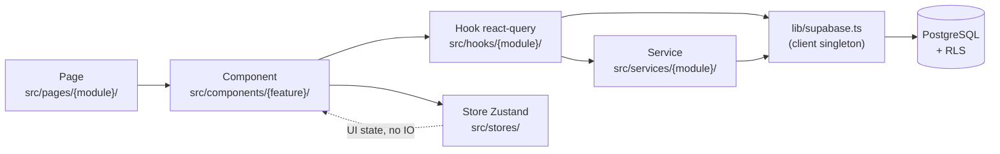
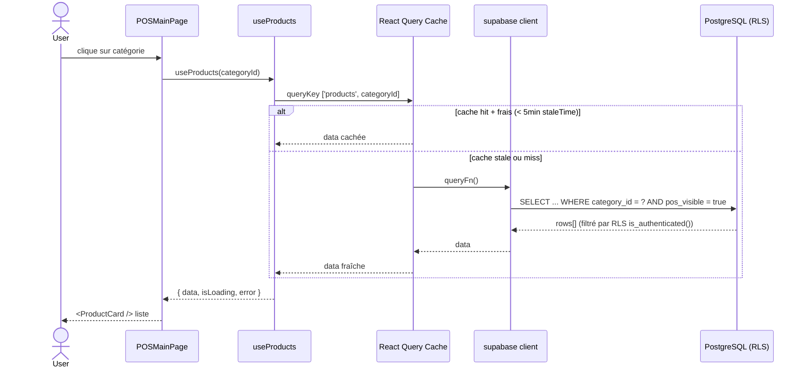

# 02 — Frontend Architecture

> **Last verified**: 2026-05-03

Anatomie du dossier `src/` du SPA Vite + React 18 d'AppGrav V2 — découpage par responsabilité, conventions de nommage, et flux canonique d'une donnée du composant jusqu'à PostgreSQL.

## Vue d'ensemble



Règle d'or : **les composants n'appellent jamais Supabase directement**. Ils consomment soit un hook react-query (lecture / écriture distante), soit un store Zustand (état UI local). Les services encapsulent la logique métier non-triviale (calcul prix, génération PDF, dispatch KDS, etc.).

## Arbre `src/` — sommaire chiffré

Comptage `find -type f -name "*.ts*"` au 2026-05-03 :

| Dossier | Fichiers | Rôle |
|---|---|---|
| `src/components/` | 248 | Composants React groupés par feature (16 sous-dossiers) |
| `src/pages/` | 364 | Composants de page route-based (19 sous-dossiers) |
| `src/hooks/` | 166 | Hooks custom react-query, regroupés par module métier |
| `src/services/` | 101 | Logique métier pure (TS sans React), regroupée par module |
| `src/stores/` | 24 | 14 stores Zustand + tests + facade settings |
| `src/types/` | 19 | Types partagés — source de vérité TS |
| `src/routes/` | 9 | Définition centralisée de toutes les routes (~116) |
| `src/layouts/` | 1 | `BackOfficeLayout.tsx` (POS / KDS / Display ont leurs propres shells) |
| `src/lib/` | 7 | Singletons techniques : `supabase`, `sentry`, `subdomain`, `utils`, stubs |
| `src/utils/` | 7 | Helpers stateless : `logger`, `helpers`, `audio`, `sanitize`, etc. |
| `src/styles/` | 1 | `index.css` — design tokens "Hybrid Pro" (cf. `DESIGN.md`) |
| `src/constants/` | n/a | Constantes métier non chiffrées ici |

Total `.ts/.tsx` (composants + pages + hooks + services + stores + types) : **879 fichiers** (hors tests).

## `src/components/` — 16 features × 248 fichiers

Chaque sous-dossier suit la convention : `{Feature}{ComponentName}.tsx` ou regroupement par sous-feature.

| Sous-dossier | Rôle | Exemples représentatifs |
|---|---|---|
| `accounting/` | UI comptabilité (JE, COA, états financiers) | `JournalEntryForm.tsx`, `AccountTreePicker.tsx` |
| `auth/` | Guards de routes + login UI | `ModuleAccessGuard.tsx`, `PermissionGuard.tsx`, `index.ts` |
| `customers/` | Cards, formulaires, fidélité | `CustomerCard.tsx`, `LoyaltyTierBadge.tsx` |
| `expenses/` | Workflow dépenses + approbation | `ExpenseForm.tsx`, `ApprovalWorkflowBadge.tsx` |
| `inventory/` | Stock, transferts, opname | `StockAlertsBadge.tsx`, `OpnameVarianceTable.tsx` |
| `kds/` | Kitchen Display System UI | `OrderTicket.tsx`, `StationFilter.tsx` |
| `lan/` | Hub/client LAN UI | `DeviceList.tsx`, `HeartbeatIndicator.tsx` |
| `mobile/` | Layout + composants Capacitor | `MobileLayout.tsx`, `BottomTabBar.tsx` |
| `orders/` | Listes + détails commandes | `OrderRow.tsx`, `OrderItemsList.tsx` |
| `permissions/` | Matrice RBAC | `RolePermissionsMatrix.tsx` |
| `pos/` | Le plus gros — caisse + virtual keypad + paiement split | `Cart.tsx`, `PaymentModal.tsx`, `virtual-keypad/VirtualKeypadProvider.tsx` |
| `products/` | Catalogue, combos, promotions | `ProductCard.tsx`, `ComboBuilder.tsx`, `ModifierGroupForm.tsx` |
| `purchasing/` | PO + suppliers | `POReceptionForm.tsx`, `SupplierCard.tsx` |
| `reports/` | 47+ rapports + charts Recharts | `ReportFilters.tsx`, `SalesByCategoryChart.tsx` |
| `settings/` | Préférences entreprise | `BusinessHoursEditor.tsx`, `PaymentMethodForm.tsx` |
| `ui/` | **29 primitives shadcn/ui + helpers** | `button.tsx`, `dialog.tsx`, `CommandPalette.tsx`, `ErrorBoundary.tsx`, `ModuleErrorBoundary.tsx` |

Le sous-dossier `ui/` est le seul à mélanger PascalCase (composants custom : `BreakeryLogo.tsx`, `Card.tsx`) et lowercase (primitives shadcn/ui : `button.tsx`, `dialog.tsx`). Voir [`src/components/ui/`](../../src/components/ui/) pour la liste complète.

## `src/pages/` — 19 modules × 364 fichiers

Chaque sous-dossier `pages/{module}/` correspond à un espace de routes. Convention : `{Feature}Page.tsx` pour une route feuille, `{Module}Layout.tsx` pour un wrapper avec `<Outlet />`.

| Sous-dossier | Pages clés | Couverture |
|---|---|---|
| `accounting/` | `AccountingLayout.tsx`, `ChartOfAccountsPage.tsx`, `JournalEntriesPage.tsx`, `BalanceSheetPage.tsx`, `IncomeStatementPage.tsx`, `VATManagementPage.tsx`, `ARAgingPage.tsx`, `BankReconciliationPage.tsx`, `CALKPage.tsx` | 13 pages |
| `auth/` | `LoginPage.tsx` (eager), `EmailLoginPage.tsx`, `PasswordResetPage.tsx`, `UpdatePasswordPage.tsx` | PIN + email login |
| `b2b/` | `B2BPage.tsx`, `B2BOrdersPage.tsx`, `B2BClientDetailPage.tsx`, `B2BPaymentsPage.tsx` | Wholesale workflow |
| `customers/` | `CustomersPage.tsx`, `CustomerFormPage.tsx`, `CustomerDetailPage.tsx`, `CustomerCategoriesPage.tsx` | CRM + loyalty |
| `dashboard/` | `DashboardPage.tsx` | Page d'accueil BackOffice (KPIs) |
| `display/` | `CustomerDisplayPage.tsx` | Public display (pas de garde) |
| `expenses/` | `ExpensesLayout.tsx`, `ExpensesListPage.tsx`, `ExpenseFormPage.tsx`, `ExpenseDetailPage.tsx`, `ExpenseCategoriesPage.tsx` | Approval workflow |
| `inventory/` | `InventoryLayout.tsx` (tabs), `StockPage.tsx`, `StockOpnameForm.tsx`, `StockMovementsPage.tsx`, `InternalTransfersPage.tsx`, `ProductInventoryDashboard.tsx` | Multi-tab UX |
| `kds/` | `KDSStationSelector.tsx`, `KDSMainPage.tsx` | Station picker → board |
| `mobile/` | `MobileLoginPage.tsx`, `MobileHomePage.tsx`, `MobileCatalogPage.tsx`, `MobileCartPage.tsx`, `MobileOrdersPage.tsx` | Capacitor-first |
| `orders/` | `OrdersPage.tsx` | Historique commandes |
| `pos/` | `POSMainPage.tsx` (eager), `POSOutstandingPage.tsx`, `CafeStockReceptionPage.tsx`, `POSShiftModals.tsx`, `posCheckoutHandler.ts` | Caisse fullscreen |
| `products/` | `ProductsLayout.tsx`, `ProductsPage.tsx`, `ProductFormPage.tsx`, `CombosPage.tsx`, `ComboFormPage.tsx`, `PromotionsPage.tsx`, `PromotionFormPage.tsx`, `ProductCategoryPricingPage.tsx` | Catalogue + promos |
| `profile/` | `ProfilePage.tsx` | User profile + PIN change |
| `purchasing/` | `SuppliersPage.tsx`, `PurchaseOrdersPage.tsx`, `PurchaseOrderFormPage.tsx`, `PurchaseOrderDetailPage.tsx`, `suppliers/SupplierDetailPage.tsx` | PO complet |
| `reports/` | `ReportsPage.tsx`, `ReportsConfig.tsx`, `components/` | 47+ rapports config-driven |
| `settings/` | `SettingsLayout.tsx` + 27 pages : `CompanySettingsPage`, `TaxSettingsPage`, `PaymentMethodsPage`, `LanMonitoringPage`, `NetworkDevicesPage`, `RolesPage`, `AuditPage`, `POSConfigSettingsPage`, etc. | Le plus gros split |
| `tablet/` | `TabletLayout.tsx`, `TabletOrderPage.tsx`, `TabletOrdersPage.tsx` | Waiter tablet UI |
| `users/` | `UsersPage.tsx`, `PermissionsPage.tsx` | RBAC management |

`POSMainPage` et `LoginPage` sont chargés **eagerly** (cf. [`src/routes/posRoutes.tsx:8`](../../src/routes/posRoutes.tsx) et [`src/App.tsx:19`](../../src/App.tsx)) ; toutes les autres pages utilisent `React.lazy()`. Détails dans [`04-routing.md`](./04-routing.md).

## `src/hooks/` — 166 hooks groupés par module

Sous-dossiers : `accounting/`, `auth/`, `b2b/`, `customers/`, `expenses/`, `inventory/`, `kds/`, `lan/`, `orders/`, `pos/`, `pricing/`, `products/`, `promotions/`, `purchasing/`, `reports/`, `settings/`, `shift/`, `tablet/`.

Plus 16 hooks "feuille" à la racine `src/hooks/` :
`useActiveUsers`, `useAuditLogs`, `useAuthUsers`, `useB2BOrders`, `useCapacitorInit`, `useDashboardData`, `useLanDevices`, `useOrders`, `usePWAInstall`, `usePermissions`, `usePermissionsData`, `useSettings`, `useShift`, `useStorageUpload`, `useTerminal`, `useUsers`, `use-toast`.

Chaque hook suit le pattern react-query. Exemple représentatif — [`src/hooks/products/useProductList.ts:11`](../../src/hooks/products/useProductList.ts) :

```ts
export function useProducts(categoryId: string | null = null) {
    const safeCategoryId = categoryId && !UI_SENTINELS.has(categoryId) ? categoryId : null
    return useQuery({
        queryKey: ['products', safeCategoryId],
        queryFn: async (): Promise<ProductWithCategory[]> => {
            let query = supabase
                .from('products')
                .select('id, name, sku, retail_price, ...')
                .eq('pos_visible', true)
                .order('name')
            if (safeCategoryId) query = query.eq('category_id', safeCategoryId)
            const { data, error } = await query
            if (error) throw error
            return (data ?? []) as unknown as ProductWithCategory[]
        },
    })
}
```

Détail des conventions queryKey + invalidation dans [`05-data-flow.md`](./05-data-flow.md).

## `src/services/` — 101 fichiers, logique métier pure

Sous-dossiers : `accounting/`, `b2b/`, `customers/`, `display/`, `expenses/`, `export/`, `financial/`, `inventory/`, `kds/`, `lan/`, `payment/`, `pos/`, `print/`, `products/`, `purchasing/`, `reporting/`, `reports/`, `storage/`.

Plus 7 services "feuille" : `KdsSoundService.ts`, `ReportingService.ts`, `authService.ts`, `errorReporting.ts`, `promotionService.ts`, `settingsService.ts`, `userManagementService.ts`.

Conventions :
- Pas d'import React (logique pure TS)
- Exposent des fonctions/classes consommées par les hooks
- Encapsulent les interactions complexes : `services/payment/paymentService.ts` (split paiement), `services/print/` (routing print server LAN), `services/lan/lanProtocol.ts` (protocole BroadcastChannel + Realtime), `services/pos/promotionEngine.ts` (moteur de promotions)

## `src/stores/` — 14 stores Zustand

Détaillés dans [`03-state-management.md`](./03-state-management.md). Liste : `authStore`, `cartStore`, `orderStore`, `paymentStore`, `displayStore`, `lanStore`, `mobileStore`, `terminalStore`, `tabletOrderStore`, `posLocalSettingsStore`, `splitItemStore`, `settingsStore` (facade) + `settings/coreSettingsStore`. Plus l'utilitaire [`src/stores/resetAllStores.ts`](../../src/stores/resetAllStores.ts) qui réinitialise tous les stores au logout.

## `src/types/` — 19 fichiers

Source de vérité TypeScript. Hiérarchie :

| Fichier | Contenu |
|---|---|
| `database.generated.ts` | **Auto-généré** par `/gen-types` depuis Supabase — NE PAS éditer à la main |
| `database.enums.ts` | Enums Postgres exportés vers TS (single source of truth pour valeurs) |
| `database.ts` | Re-exports + types dérivés (ex. `ProductWithCategory`) |
| `auth.ts` | `IRole`, `IEffectivePermission` |
| `cart.ts` | `ICartItem`, `ICartModifier`, `IComboSelectedItem`, `ISelectedVariant` |
| `payment.ts` | `TPaymentMethod`, `IPaymentInput`, `ISplitPaymentState` |
| `splitItem.ts` | `IPayer`, `IPayerItem`, constantes `PAYER_COLORS`, `MAX_PAYERS` |
| `orders.ts`, `accounting.ts`, `bankReconciliation.ts`, `expenses.ts`, `kds.ts`, `promotions.ts`, `reporting.ts`, `settings.ts`, `settingsModuleConfig.ts`, `tablet.ts`, `units.ts`, `errors.ts` | Types par module |

## `src/routes/` — 9 fichiers, ~116 routes

| Fichier | Routes | Espace |
|---|---|---|
| `index.tsx` | barrel re-export | — |
| `posRoutes.tsx` | 7 routes | POS + KDS + Display + Tablet |
| `mobileRoutes.tsx` | 6 routes | `/mobile/*` (Capacitor) |
| `inventoryRoutes.tsx` | 13 routes | `/inventory/*` |
| `salesRoutes.tsx` | 14 routes | `/orders`, `/b2b/*`, `/expenses/*`, redirects legacy |
| `customerRoutes.tsx` | 5 routes | `/customers/*` |
| `productRoutes.tsx` | 11 routes | `/products/*`, combos, promotions |
| `accountingRoutes.tsx` | 12 routes | `/accounting/*` (sous-routes via `<Outlet />`) |
| `adminRoutes.tsx` | 48 routes | Dashboard + Users + Reports + Settings (le plus gros) |

Détails dans [`04-routing.md`](./04-routing.md).

## `src/layouts/` — 1 layout principal

[`BackOfficeLayout.tsx`](../../src/layouts/BackOfficeLayout.tsx) — sidebar collapsible avec navigation, logo, command palette (⌘K), bouton logout, notification bell, stock alerts badge. Wrappe toutes les routes BackOffice via `<Outlet />`.

Les autres espaces ont leur propre shell embarqué dans la page :
- POS : `POSMainPage.tsx` est fullscreen, pas de layout
- KDS : `KDSMainPage.tsx` gère son propre header
- Display : `CustomerDisplayPage.tsx` plein écran
- Tablet : `TabletLayout.tsx` (dans `src/pages/tablet/`)
- Mobile : `MobileLayout.tsx` (dans `src/components/mobile/`)

## `src/lib/` — singletons techniques

| Fichier | Rôle |
|---|---|
| [`supabase.ts`](../../src/lib/supabase.ts) | Client Supabase singleton + helpers `untypedFrom()` / `untypedRpc()` pour tables non encore générées |
| [`sentry.ts`](../../src/lib/sentry.ts) | `initSentry()` + `setSentryUser()` + `captureError()` + `addBreadcrumb()` — actif uniquement en prod |
| [`subdomain.ts`](../../src/lib/subdomain.ts) | `getAppContext()` — détecte `pos` / `backoffice` / `all` selon le sous-domaine |
| [`utils.ts`](../../src/lib/utils.ts) | `cn()` (tailwind-merge + clsx), `generateUUID()` |
| [`safeStorage.ts`](../../src/lib/safeStorage.ts) | Wrapper localStorage/sessionStorage tolérant aux erreurs |
| [`exportFilename.ts`](../../src/lib/exportFilename.ts) | Génération nom fichier export PDF/XLSX |
| [`stubs/`](../../src/lib/stubs/) | Stubs `html2canvas`, `dompurify`, `canvg` pour réduire le bundle jspdf (~107KB économisés — cf. [`vite.config.ts:166-172`](../../vite.config.ts)) |

## `src/utils/` — helpers stateless

`logger.ts` (wrap console + Sentry breadcrumbs), `helpers.ts`, `audio.ts` (KDS sound), `colorContrast.ts` (WCAG), `sanitize.ts`, `stockStatus.ts` (warning/critical thresholds), `unitConversion.ts`.

## Flux canonique : du composant à la DB



`staleTime` global = 5 min (cf. [`src/main.tsx:34`](../../src/main.tsx)). Détails dans [`05-data-flow.md`](./05-data-flow.md).

## Conventions de nommage récap

| Élément | Convention | Exemple |
|---|---|---|
| Composant | PascalCase | `ProductCard.tsx` |
| Page | `{Feature}Page.tsx` | `POSMainPage.tsx` |
| Layout | `{Module}Layout.tsx` | `BackOfficeLayout.tsx`, `InventoryLayout.tsx` |
| Hook | `use{Feature}.ts` | `useProducts.ts`, `usePOSOrders.ts` |
| Service | `{module}Service.ts` ou `{verb}{Noun}.ts` | `paymentService.ts`, `orderActivityService.ts` |
| Store | `{domain}Store.ts` | `cartStore.ts`, `authStore.ts` |
| Type interface | `I` prefix | `IProduct`, `ICartItem`, `IRole` |
| Type alias | `T` prefix | `TOrderType`, `TPaymentMethod` |
| Path alias | `@/` → `src/` | `import { supabase } from '@/lib/supabase'` |

## Liens internes

- [`01-system-architecture.md`](./01-system-architecture.md) — Vue C4 globale (acteurs, conteneurs, intégrations)
- [`03-state-management.md`](./03-state-management.md) — 14 stores Zustand + patterns react-query
- [`04-routing.md`](./04-routing.md) — Mapping exhaustif des ~116 routes
- [`05-data-flow.md`](./05-data-flow.md) — Diagrammes séquence query / mutation / realtime / RPC / Edge Function
- [`06-build-and-bundling.md`](./06-build-and-bundling.md) — Vite, code splitting, PWA, Sentry sourcemaps
