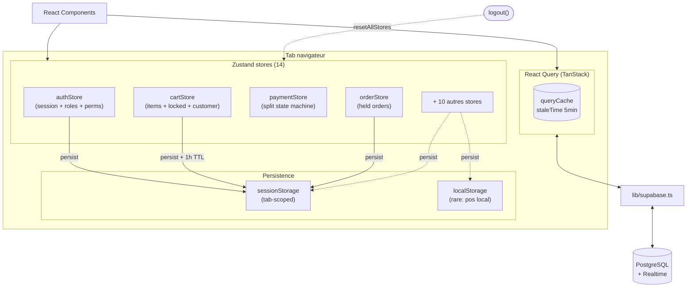
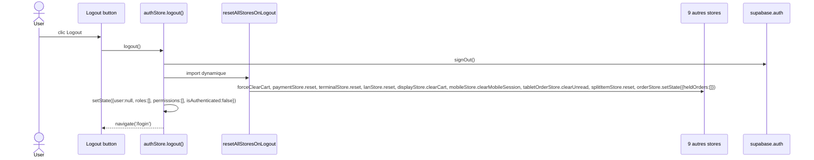

# 03 — State Management

> **Last verified**: 2026-05-03

Deux couches d'état dans AppGrav V2 :
1. **Zustand** (14 stores) — état UI local, transient ou persisté tab-scoped en `sessionStorage`
2. **React Query** (~150 hooks) — cache des données serveur, source de vérité pour tout ce qui vient de PostgreSQL

Aucun Redux. Aucun Context API global hors de `QueryClientProvider`.

## Diagramme global du flux d'état



## Inventaire des 14 stores Zustand

| Store | Chemin | Persistence | Rôle (1 ligne) |
|---|---|---|---|
| `authStore` | [`src/stores/authStore.ts`](../../src/stores/authStore.ts) | `sessionStorage` `breakery-auth` (tab) | Session PIN/email + roles + permissions effectives |
| `cartStore` | [`src/stores/cartStore.ts`](../../src/stores/cartStore.ts) | `sessionStorage` + TTL 1h | Items panier POS, locked items, customer, discount |
| `paymentStore` | [`src/stores/paymentStore.ts`](../../src/stores/paymentStore.ts) | volatile | State machine split paiement |
| `orderStore` | [`src/stores/orderStore.ts`](../../src/stores/orderStore.ts) | `sessionStorage` (storage custom) | Held orders + générateur de numéros |
| `displayStore` | [`src/stores/displayStore.ts`](../../src/stores/displayStore.ts) | volatile | Cart broadcast + queue commandes prêtes pour Customer Display |
| `lanStore` | [`src/stores/lanStore.ts`](../../src/stores/lanStore.ts) | `sessionStorage` (champs filtrés) | Connexion LAN + devices connectés + heartbeat |
| `mobileStore` | [`src/stores/mobileStore.ts`](../../src/stores/mobileStore.ts) | `localStorage` (config + favoris) | Orders + favoris + settings mobile (Capacitor) |
| `terminalStore` | [`src/stores/terminalStore.ts`](../../src/stores/terminalStore.ts) | `sessionStorage` `appgrav-terminal` | Identité du terminal POS (deviceId, isHub, name) |
| `tabletOrderStore` | [`src/stores/tabletOrderStore.ts`](../../src/stores/tabletOrderStore.ts) | volatile | Inbox commandes entrantes depuis tablettes serveur |
| `posLocalSettingsStore` | [`src/stores/posLocalSettingsStore.ts`](../../src/stores/posLocalSettingsStore.ts) | `localStorage` `appgrav-pos-local-settings` | Favoris produits + auto-print receipt |
| `splitItemStore` | [`src/stores/splitItemStore.ts`](../../src/stores/splitItemStore.ts) | volatile | Découpe d'items entre payeurs (split by item) |
| `settingsStore` (facade) | [`src/stores/settingsStore.ts`](../../src/stores/settingsStore.ts) | délègue à core | Re-export de `coreSettingsStore` (compat) |
| `coreSettingsStore` | [`src/stores/settings/coreSettingsStore.ts`](../../src/stores/settings/coreSettingsStore.ts) | partiel (appearance, localization) | Settings entreprise depuis DB + appearance/localization locales |

`resetAllStoresOnLogout()` ([`src/stores/resetAllStores.ts`](../../src/stores/resetAllStores.ts)) reset 9 stores au logout : `cartStore`, `paymentStore`, `terminalStore`, `lanStore`, `displayStore`, `mobileStore`, `tabletOrderStore`, `splitItemStore`, `orderStore` (plus `authStore` qui se reset lui-même).

## Détail par store

### authStore — [`src/stores/authStore.ts`](../../src/stores/authStore.ts)

**State shape** (`IAuthState`, lignes 15-26) :
- `user: UserProfile | null`
- `roles: IRole[]`
- `permissions: IEffectivePermission[]`
- `isAuthenticated: boolean`
- `sessionId: string | null` / `sessionToken: string | null`

**Actions** : `loginWithPin(userId, pin)`, `logout()`, `refreshSession()`, `setLoading(b)`.

**Persistence** : `sessionStorage` clé `breakery-auth`, **partialize** ne stocke QUE `user` + `sessionId` + `sessionToken` + `isAuthenticated` ([`authStore.ts:198`](../../src/stores/authStore.ts)). Roles + permissions sont rechargés serveur-side à chaque restauration via `auth-get-session` Edge Function pour éviter le drift.

**Sécurité** : sessionStorage tab-scoped (cleared on close), CSP `script-src 'self'` empêche XSS de lire le token (cf. commentaires lignes 9-13).

### cartStore — [`src/stores/cartStore.ts`](../../src/stores/cartStore.ts)

**State shape** (lignes 16-50) :
- `items: ICartItem[]` (produits + combos)
- `orderType`, `tableNumber`, `guestCount`, `customerId`, `customerName`
- `discountType`, `discountValue`, `discountReason`
- `lockedItemIds: string[]` — items envoyés en cuisine (PIN requis pour modifier)
- `activeOrderId`, `activeOrderNumber`
- `promotionDiscounts`, `promotionTotalDiscount`, `appliedPromotions`
- Computed : `subtotal`, `discountAmount`, `total`, `itemCount`

**Actions** : `addItem`, `addCombo`, `updateItem`, `removeItem`, `clearCart`, `forceClearCart`, `lockCurrentItems`, `setActiveOrder`, `restoreCartState`, `setDiscount`, `setCustomer`, `setOrderType`.

**Middleware** : `subscribeWithSelector` + `persist` avec storage custom `sessionStorage` ([`cartStore.ts:579`](../../src/stores/cartStore.ts)). TTL 1h via `_persistedAt` timestamp + merge guard (lignes 596-610) pour éviter la restauration de paniers obsolètes.

### paymentStore — [`src/stores/paymentStore.ts`](../../src/stores/paymentStore.ts)

**State shape** (`IPaymentStore`, lignes 23-45) :
- `orderTotal`, `payments: IPaymentEntry[]`, `totalPaid`, `remainingAmount`
- `status: 'idle' | 'collecting' | 'complete' | ...`
- `currentMethod`, `currentAmount`

**Actions** : `initialize(orderTotal)`, `setCurrentMethod`, `setCurrentAmount`, `addPayment`, `removePayment`, `reset`. Computed : `isComplete()`, `canAddPayment()`, `getPaymentInputs()`.

**Persistence** : volatile (state machine éphémère du modal de paiement).

**ADR** : voir `docs/adr/ADR-001-payment-system-refactor.md`.

### orderStore — [`src/stores/orderStore.ts`](../../src/stores/orderStore.ts)

**State shape** : `heldOrders: HeldOrder[]`, `orderCounter: number`.

**Actions** : `generateOrderNumber()`, `holdOrder()`, `restoreHeldOrder()`, `removeHeldOrder()`, `sendToKitchenAsHeldOrder()`, `removeItemFromHeldOrder()`, `transferTable()`.

**Persistence** : `sessionStorage` via storage custom (lignes 218-234). Reset à `{ heldOrders: [], orderCounter: 1000 }` au logout pour éviter fuite entre utilisateurs.

### displayStore — [`src/stores/displayStore.ts`](../../src/stores/displayStore.ts)

**State shape** :
- `cart: { items, subtotal, total, customerName, orderType, tableNumber }` (broadcast depuis POS)
- `orderQueue: IQueuedOrder[]`, `readyOrders: IQueuedOrder[]`
- `isIdle`, `idleTimeout`, `currentPromoIndex`, `promoRotationInterval`

**Actions** : `updateCart`, `clearCart`, `updateOrderStatus`, `removeReadyOrder`, `nextPromo`, `checkIdle`, `clearAllTimeouts`.

**Persistence** : volatile. Auto-removal des ready orders après 5 min via `setTimeout` (`READY_ORDER_VISIBLE_DURATION`, ligne 71).

### lanStore — [`src/stores/lanStore.ts`](../../src/stores/lanStore.ts)

**State shape** (`ILanState`, lignes 35-56) :
- `connectionStatus: TLanConnectionStatus` ('disconnected' | 'connecting' | 'connected' | 'reconnecting' | 'error')
- `isHub: boolean`, `hubAddress: string | null`
- `deviceId`, `deviceType`, `deviceName`
- `connectedDevices: IConnectedDevice[]`
- `pendingMessages`, `lastMessageSeq`
- `lastError`, `reconnectAttempts`

**Actions** : ~15 actions dont `setConnectionStatus`, `addConnectedDevice`, `updateDeviceHeartbeat`, `clearStaleDevices`, `addPendingMessage`, `incrementReconnectAttempts`, `reset`.

**Persistence** : `sessionStorage` avec partialize sur quelques champs uniquement + merge guard (lignes 215-225).

### mobileStore — [`src/stores/mobileStore.ts`](../../src/stores/mobileStore.ts)

State pour serveurs sur tablette/téléphone : orders draft (`IMobileOrder`), favoris produits, settings mobile, mobile session timeout. Persistence `localStorage` (favoris + settings persistent entre tabs).

Note : l'identité (user, roles, permissions) reste dans `authStore`, **pas ici**.

### terminalStore — [`src/stores/terminalStore.ts`](../../src/stores/terminalStore.ts)

**State** : `deviceId`, `terminalName`, `isHub`, `location`, `status`, `isRegistered`, `serverSynced`, `serverId` (UUID `pos_terminals`).

**Actions** : `registerTerminal(name, isHub, location)`, `generateDeviceId()`, `updateTerminalName`, `setIsHub`, `setLocation`, `setServerSynced`, `setServerData`, `reset`.

**Persistence** : `sessionStorage` clé `appgrav-terminal` (storage custom).

### tabletOrderStore — [`src/stores/tabletOrderStore.ts`](../../src/stores/tabletOrderStore.ts)

**State** : `incomingOrders: ITabletOrderEntry[]` (max 50), `unreadCount`.

**Actions** : `addOrder` (dedup par orderId), `markPaid`, `markCancelled`, `clearUnread`, `removeOrder`. Volatile. Alimenté par Realtime + LAN hub.

### posLocalSettingsStore — [`src/stores/posLocalSettingsStore.ts`](../../src/stores/posLocalSettingsStore.ts)

**State** : `favoriteProductIds: string[]`, `autoPrintReceipt: boolean`.

**Actions** : `toggleFavorite(id)`, `setAutoPrintReceipt(b)`. Persistence `localStorage` clé `appgrav-pos-local-settings` (préférences durables côté terminal physique).

### splitItemStore — [`src/stores/splitItemStore.ts`](../../src/stores/splitItemStore.ts)

**State** : `payers: IPayer[]` (max 8 — `MAX_PAYERS`), `activePayer`, `currentPayerIndex`.

**Actions** : `initializePayers(count)`, `addPayer`, `removePayer`, `setActivePayer`, `assignItem(cartItemId, qty, items, discountFactor)`, `unassignItem`, `markPayerPaid`, `mapOrderItemIds`, `reset`. Computed : `allItemsAssigned`, `allPayersPaid`, `getUnassignedQuantity`, `getPayerPayments`. Volatile.

### coreSettingsStore — [`src/stores/settings/coreSettingsStore.ts`](../../src/stores/settings/coreSettingsStore.ts)

**State** : `categories: ISettingsCategory[]`, `settings: Record<string, ISetting>`, `appearance: IAppearanceSettings`, `localization: ILocalizationSettings`, `isLoading`, `isInitialized`, `error`.

**Actions** : `initialize()`, `loadCategories()`, `loadSettings()`, `loadSettingsByCategory(code)`, `getSetting<T>(key)`, `updateSetting(key, value, reason)`, `updateSettings(updates)`, `resetSetting(key)`, `resetCategorySettings(code)`, `setAppearance(updates)`, `setLocalization(updates)`.

Defaults : appearance theme `light`, primary `#2563eb` ; localization `id` (Indonesian), `Asia/Makassar`, `IDR Rp`.

**Persistence** : partial — appearance + localization en `localStorage`, settings DB rechargés à l'init.

Re-exporté par `settingsStore.ts` (facade) avec selectors : `selectTheme`, `selectPrimaryColor`, `selectLanguage`, `selectCurrency`, `selectDateFormat`, `selectTimeFormat`.

## Diagramme : reset au logout



Pattern d'import dynamique pour éviter les cycles d'imports — voir [`resetAllStores.ts:8-30`](../../src/stores/resetAllStores.ts).

## React Query — patterns

### QueryClient global

Configuré dans [`src/main.tsx:31-40`](../../src/main.tsx) :

```ts
new QueryClient({
    defaultOptions: {
        queries: {
            staleTime: 1000 * 60 * 5,        // 5 minutes
            refetchOnWindowFocus: false,
            retry: 3,
            retryDelay: (attempt) => Math.min(1000 * 2 ** attempt, 30000),
        },
    },
})
```

Pas de `gcTime` custom — défaut TanStack 5 min après dernier observer.

### Conventions queryKey

Format : `[resource, ...filters]`.

| Type de query | Pattern | Exemple |
|---|---|---|
| Liste filtrée | `[resource, filterValue]` | `['products', categoryId]` ([`useProductList.ts:14`](../../src/hooks/products/useProductList.ts)) |
| Liste simple/lookup | `[resource, 'list-simple']` ou `[resource, suffix]` | `['products-list-simple']`, `['products', 'next-sku']` |
| Détail par id | `[resource, id]` | `['product', id]` ([`useProductForm.ts:6`](../../src/hooks/products/useProductForm.ts)) |
| Sous-ressource | `[parent, parentId, child]` | `['order', orderId, 'items']` |
| Realtime | clé partagée + invalidation à l'event | `['kds-orders', station]` |

### Pattern hook canonique (read)

Source : [`src/hooks/products/useProductList.ts`](../../src/hooks/products/useProductList.ts) — voir snippet dans [`02-frontend-architecture.md`](./02-frontend-architecture.md#srchooks--166-hooks-groupés-par-module).

### Pattern hook canonique (write + invalidation)

```ts
export function useUpdateProduct() {
  const qc = useQueryClient()
  return useMutation({
    mutationFn: async (input: ProductUpdate) => {
      const { data, error } = await supabase
        .from('products')
        .update(input)
        .eq('id', input.id)
        .select()
        .single()
      if (error) throw error
      return data
    },
    onSuccess: (data) => {
      qc.invalidateQueries({ queryKey: ['products'] })
      qc.setQueryData(['product', data.id], data)  // optimistic update
    },
  })
}
```

Détails dans [`05-data-flow.md`](./05-data-flow.md).

### Optimistic updates

Utilisés notamment dans `cartStore` (mutations cart locales sans round-trip), et pour les statuts KDS via `setQueryData` avant l'invalidation pour éviter le flicker.

## Quand utiliser quoi ?

| Type d'état | Outil | Exemples |
|---|---|---|
| Données serveur (lecture) | React Query | products, orders, customers, reports |
| UI éphémère (modal open, tab actif) | `useState` local | toggles |
| Wizard multi-étapes (cart, paiement, split) | Zustand | `cartStore`, `paymentStore`, `splitItemStore` |
| Identité utilisateur + permissions | Zustand persisté | `authStore` |
| Settings rechargés depuis DB | Zustand + lazy fetch | `coreSettingsStore` |
| Communication inter-tab | BroadcastChannel + Zustand | `lanStore`, `displayStore` |
| Préférences durables locales | Zustand + `localStorage` | `posLocalSettingsStore` (favoris) |

## Liens internes

- [`02-frontend-architecture.md`](./02-frontend-architecture.md) — Anatomie `src/`
- [`04-routing.md`](./04-routing.md) — Routes et guards
- [`05-data-flow.md`](./05-data-flow.md) — Diagrammes séquence read/write/realtime/RPC
- [`06-build-and-bundling.md`](./06-build-and-bundling.md) — Code splitting + PWA cache strategy
