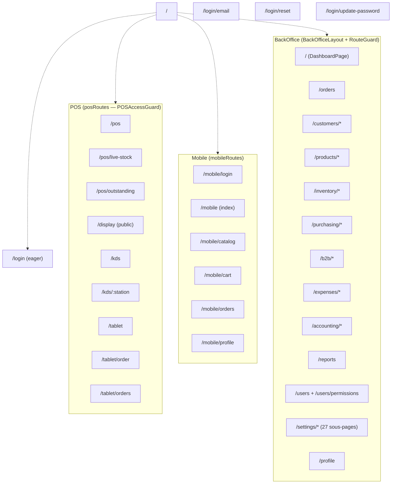

# 04 — Routing

> **Last verified**: 2026-05-03

Routage SPA basé sur **React Router 6** (`BrowserRouter` web, `HashRouter` Capacitor — décidé dans [`src/main.tsx:42`](../../src/main.tsx)). Toutes les routes sont définies dans `src/routes/*.tsx` (9 fichiers, ~116 routes), composées dans [`src/App.tsx`](../../src/App.tsx) selon le **contexte applicatif** détecté par sous-domaine.

## Contextes applicatifs (sous-domaines)

`getAppContext()` ([`src/lib/subdomain.ts`](../../src/lib/subdomain.ts)) retourne :

| Contexte | Exemple URL | Routes montées |
|---|---|---|
| `pos` | `pos.the-breakery.com` ou `the-breakery-pos.vercel.app` | `posRoutes` + `mobileRoutes` uniquement |
| `backoffice` | `admin.the-breakery.com` | `adminRoutes` + `inventoryRoutes` + `salesRoutes` + `customerRoutes` + `productRoutes` + `accountingRoutes` (sous `BackOfficeLayout`) |
| autre (`localhost`, `all`) | dev | TOUTES les routes |

Logique de switch : [`src/App.tsx:251-294`](../../src/App.tsx).

## Arbre des routes par espace

## Wrappers communs

Toutes les routes protégées sont enveloppées par une combinaison de :

| Wrapper | Source | Rôle |
|---|---|---|
| `POSAccessGuard` | [`src/components/auth/ModuleAccessGuard.tsx`](../../src/components/auth/ModuleAccessGuard.tsx) | Vérifie accès POS (cashier+) |
| `BackOfficeAccessGuard` | idem | Vérifie accès BackOffice (manager/admin) |
| `RouteGuard permission="X"` | [`src/components/auth/PermissionGuard.tsx`](../../src/components/auth/PermissionGuard.tsx) | Vérifie une permission précise (ou liste : `permissions={['a', 'b']}`) |
| `ModuleErrorBoundary moduleName="X"` | [`src/components/ui/ModuleErrorBoundary.tsx`](../../src/components/ui/ModuleErrorBoundary.tsx) | Capture les erreurs React du module et affiche un fallback |
| `VirtualKeypadProvider` | [`src/components/pos/virtual-keypad/VirtualKeypadProvider.tsx`](../../src/components/pos/virtual-keypad/VirtualKeypadProvider.tsx) | Contexte clavier virtuel (POS uniquement) |
| `Suspense fallback={<PageLoader />}` | [`src/App.tsx:243`](../../src/App.tsx) | Wrap global pour `React.lazy()` |

`React.lazy()` est utilisé sur **toutes** les pages sauf 2 critiques chargées eagerly : `LoginPage` et `POSMainPage` (pour minimiser le TTI sur les deux entry points principaux).

---

## `posRoutes.tsx` — POS / KDS / Display / Tablet

Source : [`src/routes/posRoutes.tsx`](../../src/routes/posRoutes.tsx).

| Path | Component | Guard(s) | Lazy |
|---|---|---|---|
| `/display` | `CustomerDisplayPage` | aucun (public) | oui |
| `/pos` | `POSMainPage` | `POSAccessGuard` + `ModuleErrorBoundary` + `VirtualKeypadProvider` | **non (eager)** |
| `/pos/live-stock` | `CafeStockReceptionPage` | `POSAccessGuard` + `ModuleErrorBoundary` + `VirtualKeypadProvider` | oui |
| `/pos/outstanding` | `POSOutstandingPage` | `POSAccessGuard` + `ModuleErrorBoundary` | oui |
| `/kds` | `KDSStationSelector` | `POSAccessGuard` + `ModuleErrorBoundary` | oui |
| `/kds/:station` | `KDSMainPage` | `POSAccessGuard` + `ModuleErrorBoundary` | oui |
| `/tablet` | `TabletLayout` (avec `<Outlet />`) | `POSAccessGuard` + `ModuleErrorBoundary` | oui |
| `/tablet/order` | `TabletOrderPage` | hérite | oui |
| `/tablet/orders` | `TabletOrdersPage` | hérite | oui |

Total : **9 routes**.

---

## `mobileRoutes.tsx` — Capacitor / mobile web

Source : [`src/routes/mobileRoutes.tsx`](../../src/routes/mobileRoutes.tsx).

| Path | Component | Guard | Lazy |
|---|---|---|---|
| `/mobile/login` | `MobileLoginPage` | aucun | oui |
| `/mobile` | `MobileLayout` | `isAuthenticated` ou `Navigate /mobile/login` | oui |
| `/mobile` (index) | `MobileHomePage` | hérite | oui |
| `/mobile/catalog` | `MobileCatalogPage` | hérite | oui |
| `/mobile/cart` | `MobileCartPage` | hérite | oui |
| `/mobile/orders` | `MobileOrdersPage` | hérite | oui |
| `/mobile/profile` | `ProfilePage` (réutilisé) | hérite | oui |

Total : **7 routes**.

---

## `inventoryRoutes.tsx` — Stock & transferts

Source : [`src/routes/inventoryRoutes.tsx`](../../src/routes/inventoryRoutes.tsx). Toutes sous `BackOfficeLayout` (montées via `<Outlet />` parent).

| Path | Component | Permission | Lazy |
|---|---|---|---|
| `/inventory` | `InventoryLayout` (tabs) | `inventory.view` | oui |
| `/inventory` (index) | `StockPage` | hérite | oui |
| `/inventory/incoming` | `IncomingStockPage` | hérite | oui |
| `/inventory/wasted` | `WastedPage` | hérite | oui |
| `/inventory/production` | `StockProductionPage` | hérite | oui |
| `/inventory/opname` | `StockOpnameList` | hérite | oui |
| `/inventory/movements` | `StockMovementsPage` | hérite | oui |
| `/inventory/transfers` | `InternalTransfersPage` | hérite | oui |
| `/inventory/product/:id` | `ProductDetailPage` | `inventory.view` | oui |
| `/inventory/product/:id/dashboard` | `ProductInventoryDashboard` | `inventory.view` | oui |
| `/inventory/stock-opname/:id` | `StockOpnameForm` | `inventory.view` | oui |
| `/inventory/transfers/new` | `TransferFormPage` | `inventory.create` | oui |
| `/inventory/transfers/:id` | `TransferDetailPage` | `inventory.view` | oui |
| `/inventory/transfers/:id/edit` | `TransferFormPage` | `inventory.update` | oui |
| `/inventory/stock-by-location` | `StockByLocationPage` | `inventory.view` | oui |
| `/inventory/suppliers` | redirect → `/purchasing/suppliers` | — | — |
| `/stock` | redirect → `/inventory` | — | — |
| `/production` | redirect → `/inventory/production` | — | — |

Total : **15 routes + 3 redirects**.

---

## `salesRoutes.tsx` — Orders / B2B / Expenses

Source : [`src/routes/salesRoutes.tsx`](../../src/routes/salesRoutes.tsx).

| Path | Component | Permission | Lazy |
|---|---|---|---|
| `/orders` | `OrdersPage` | `sales.view` | oui |
| `/b2b` | `B2BPage` | `sales.view` | oui |
| `/b2b/orders` | `B2BOrdersPage` | `sales.view` | oui |
| `/b2b/orders/new` | `B2BOrderFormPage` | `sales.create` | oui |
| `/b2b/orders/:id` | `B2BOrderDetailPage` | `sales.view` | oui |
| `/b2b/orders/:id/edit` | `B2BOrderFormPage` | `sales.create` | oui |
| `/b2b/payments` | `B2BPaymentsPage` | `sales.view` | oui |
| `/b2b/clients/:id` | `B2BClientDetailPage` | `sales.view` | oui |
| `/purchases` | redirect → `/purchasing/purchase-orders` | — | — |
| `/internal-moves` | redirect → `/inventory/transfers` | — | — |
| `/expenses` | `ExpensesLayout` | `expenses.view` | oui |
| `/expenses` (index) | `ExpensesListPage` | hérite | oui |
| `/expenses/categories` | `ExpenseCategoriesPage` | hérite | oui |
| `/expenses/new` | `ExpenseFormPage` | `expenses.create` | oui |
| `/expenses/:id` | `ExpenseDetailPage` | `expenses.view` | oui |
| `/expenses/:id/edit` | `ExpenseFormPage` | `expenses.update` | oui |

Total : **14 routes + 2 redirects**.

---

## `customerRoutes.tsx`

Source : [`src/routes/customerRoutes.tsx`](../../src/routes/customerRoutes.tsx).

| Path | Component | Permission | Lazy |
|---|---|---|---|
| `/customers` | `CustomersPage` | `customers.view` | oui |
| `/customers/new` | `CustomerFormPage` | `customers.create` | oui |
| `/customers/categories` | `CustomerCategoriesPage` | `customers.view` | oui |
| `/customers/:id` | `CustomerDetailPage` | `customers.view` | oui |
| `/customers/:id/edit` | `CustomerFormPage` | `customers.update` | oui |

Total : **5 routes**.

---

## `productRoutes.tsx`

Source : [`src/routes/productRoutes.tsx`](../../src/routes/productRoutes.tsx).

| Path | Component | Permission | Lazy |
|---|---|---|---|
| `/products` | `ProductsLayout` (tabs) | `products.view` | oui |
| `/products` (index) | `ProductsPage` | hérite | oui |
| `/products/combos` | `CombosPage` | hérite | oui |
| `/products/promotions` | `PromotionsPage` | hérite | oui |
| `/products/new` | `ProductFormPage` | `products.create` | oui |
| `/products/combos/new` | `ComboFormPage` | `products.create` | oui |
| `/products/combos/:id` | `ComboFormPage` | `products.view` | oui |
| `/products/combos/:id/edit` | `ComboFormPage` | `products.update` | oui |
| `/products/promotions/new` | `PromotionFormPage` | `products.create` | oui |
| `/products/promotions/:id` | `PromotionFormPage` | `products.view` | oui |
| `/products/promotions/:id/edit` | `PromotionFormPage` | `products.update` | oui |
| `/products/:id` | `ProductDetailPage` (depuis `pages/inventory/`) | `products.view` | oui |
| `/products/:id/edit` | `ProductFormPage` | `products.update` | oui |
| `/products/:id/pricing` | `ProductCategoryPricingPage` | `products.pricing` | oui |

Total : **14 routes**.

---

## `accountingRoutes.tsx`

Source : [`src/routes/accountingRoutes.tsx`](../../src/routes/accountingRoutes.tsx). Toutes nestées sous `<Route path="/accounting">` qui rend `AccountingLayout` (avec `<Outlet />`).

| Path | Component | Permission | Lazy |
|---|---|---|---|
| `/accounting` | `AccountingLayout` | `accounting.view` | oui |
| `/accounting` (index) | `ChartOfAccountsPage` | hérite | oui |
| `/accounting/chart-of-accounts` | `ChartOfAccountsPage` | hérite | oui |
| `/accounting/journal-entries` | `JournalEntriesPage` | hérite | oui |
| `/accounting/general-ledger` | `GeneralLedgerPage` | hérite | oui |
| `/accounting/trial-balance` | `TrialBalancePage` | hérite | oui |
| `/accounting/balance-sheet` | `BalanceSheetPage` | hérite | oui |
| `/accounting/income-statement` | `IncomeStatementPage` | hérite | oui |
| `/accounting/vat` | `VATManagementPage` | hérite | oui |
| `/accounting/ar-aging` | `ARAgingPage` | hérite | oui |
| `/accounting/bank-reconciliation` | `BankReconciliationPage` | hérite | oui |
| `/accounting/bank-reconciliation/:id` | `ReconciliationDetailPage` | hérite | oui |
| `/accounting/notes` | `CALKPage` | hérite | oui |

Total : **12 routes**.

---

## `adminRoutes.tsx` — Dashboard / Users / Reports / Settings / Purchasing

Source : [`src/routes/adminRoutes.tsx`](../../src/routes/adminRoutes.tsx). Le plus gros fichier — 48 routes.

### Dashboard + Profile

| Path | Component | Permission | Lazy |
|---|---|---|---|
| `/` (index) | `DashboardPage` | implicite (BackOfficeAccessGuard) | oui |
| `/profile` | `ProfilePage` | aucune | oui |

### Purchasing

| Path | Component | Permission | Lazy |
|---|---|---|---|
| `/purchasing/suppliers` | `SuppliersPage` | `inventory.view` | oui |
| `/purchasing/suppliers/:id` | `SupplierDetailPage` | `inventory.view` | oui |
| `/purchasing/purchase-orders` | `PurchaseOrdersPage` | `inventory.view` | oui |
| `/purchasing/purchase-orders/new` | `PurchaseOrderFormPage` | `inventory.create` | oui |
| `/purchasing/purchase-orders/:id` | `PurchaseOrderDetailPage` | `inventory.view` | oui |
| `/purchasing/purchase-orders/:id/edit` | `PurchaseOrderFormPage` | `inventory.update` | oui |

### Reports + Users

| Path | Component | Permission | Lazy |
|---|---|---|---|
| `/reports` | `ReportsPage` | `reports.sales` | oui |
| `/users` | `UsersPage` | `users.view` | oui |
| `/users/permissions` | `PermissionsPage` | `users.roles` | oui |

### Settings (27 sous-routes nestées sous `/settings`)

`/settings` → `SettingsLayout` (avec `<Outlet />`), permission `settings.view` ou `settings.network` :

| Sous-path | Component | Permission |
|---|---|---|
| `company` | `CompanySettingsPage` | `settings.view` |
| `hours` | `BusinessHoursPage` | `settings.view` |
| `tax` | `TaxSettingsPage` | `settings.view` |
| `pos_config` | `POSConfigSettingsPage` | `settings.view` |
| `payments` | `PaymentMethodsPage` | `settings.view` |
| `loyalty` | `LoyaltySettingsPage` | `settings.view` |
| `inventory_config` | `InventoryConfigSettingsPage` | `settings.view` |
| `categories` | `CategoriesPage` | `settings.view` |
| `product-types` | `ProductTypeSettingsPage` | `settings.view` |
| `kds_config` | `KDSConfigSettingsPage` | `settings.view` |
| `display` | `DisplaySettingsPage` | `settings.view` |
| `b2b` | `B2BSettingsPage` | `settings.view` |
| `printing` | `PrintingSettingsPage` | `settings.view` OU `settings.network` |
| `notifications` | `NotificationSettingsPage` | `settings.view` |
| `security` | `SecurityPinSettingsPage` | `settings.view` |
| `financial` | `FinancialSettingsPage` | `settings.view` |
| `roles` | `RolesPage` | `users.roles` |
| `audit` | `AuditPage` | `users.roles` |
| `sync` | `SyncStatusPage` | `settings.view` |
| `lan` | `LanMonitoringPage` | `settings.view` OU `settings.network` |
| `devices` | `NetworkDevicesPage` | `settings.view` OU `settings.network` |
| `history` | `SettingsHistoryPage` | `settings.view` |
| `sections` | `SectionsSettingsPage` | `settings.view` |
| `floorplan` | `FloorPlanSettingsPage` | `settings.view` |

Total adminRoutes : **48 routes** (1 dashboard + 1 profile + 6 purchasing + 1 reports + 2 users + 1 settings layout + 24 settings sous-routes + redirect `SettingsLayout` index décidé runtime selon permissions).

---

## Catch-all et redirects

Définis dans [`src/App.tsx:256-291`](../../src/App.tsx) :

| Contexte | Path catch | Redirect |
|---|---|---|
| `pos` | `*` | `/pos` (auth) ou `/login` |
| `backoffice` | `*` | `/` (auth) ou `/login` |
| `all` | `*` | idem backoffice |

## Routes publiques (aucun guard)

- `/login`, `/login/email`, `/login/reset`, `/login/update-password`
- `/display` (Customer Display, exposé en kiosque)
- `/mobile/login`

## Récapitulatif global

| Source | Routes effectives | Redirects | Total |
|---|---|---|---|
| `posRoutes.tsx` | 9 | 0 | 9 |
| `mobileRoutes.tsx` | 7 | 0 | 7 |
| `inventoryRoutes.tsx` | 15 | 3 | 18 |
| `salesRoutes.tsx` | 14 | 2 | 16 |
| `customerRoutes.tsx` | 5 | 0 | 5 |
| `productRoutes.tsx` | 14 | 0 | 14 |
| `accountingRoutes.tsx` | 12 | 0 | 12 |
| `adminRoutes.tsx` | 35 | 0 | 35 |
| Auth (App.tsx) | 4 | 0 | 4 |
| Catch-all + index | 2 | — | 2 |
| **Total** | **117** | **5** | **122** |

(Le chiffre "~116" du repo CLAUDE.md correspond aux routes effectives hors redirects et catch-all.)

## Liens internes

- [`02-frontend-architecture.md`](./02-frontend-architecture.md) — `src/pages/` détail
- [`03-state-management.md`](./03-state-management.md) — Stores liés au routing (auth, terminal, lan)
- [`05-data-flow.md`](./05-data-flow.md) — Pattern de fetch par route
- [`06-build-and-bundling.md`](./06-build-and-bundling.md) — Code splitting via `React.lazy()` par route
