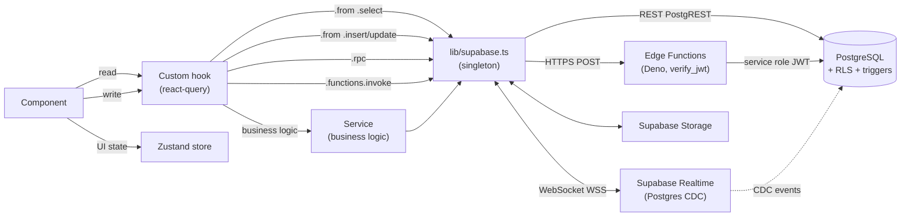
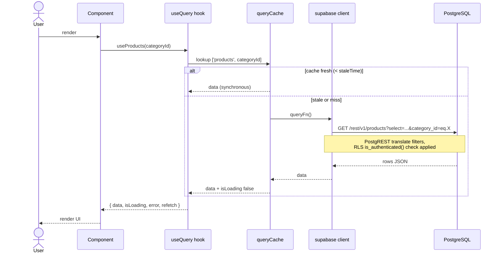
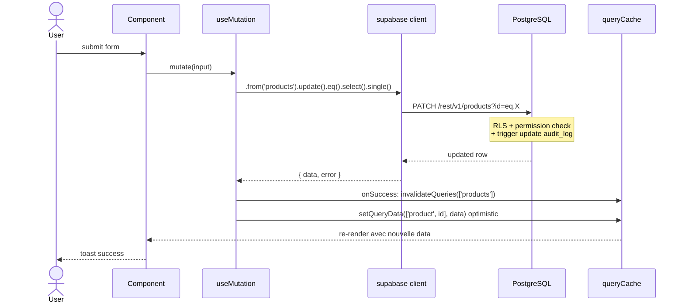
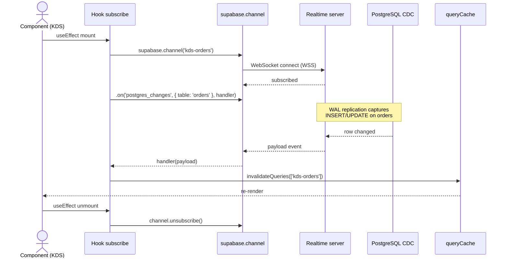
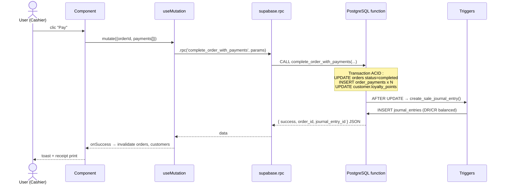
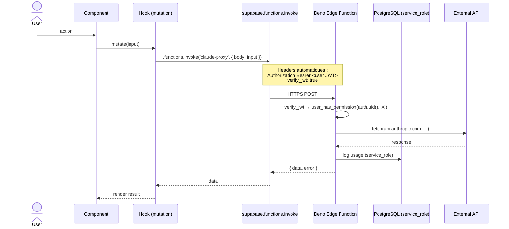

# 05 — Data Flow

> **Last verified**: 2026-05-03

Comment la donnée circule entre les composants React et PostgreSQL via Supabase. Cinq scénarios canoniques : **query (read)**, **mutation (write)**, **realtime subscription**, **RPC**, **Edge Function invoke**.

## Pile data en un coup d'œil



## QueryClient global

[`src/main.tsx:31-40`](../../src/main.tsx) :

```ts
new QueryClient({
    defaultOptions: {
        queries: {
            staleTime: 1000 * 60 * 5,        // 5 minutes
            refetchOnWindowFocus: false,
            retry: 3,
            retryDelay: (attempt) => Math.min(1000 * 2 ** attempt, 30000),
        },
    },
})
```

- `staleTime: 5 min` — pendant 5 min après un fetch réussi, la donnée est considérée fraîche et n'est pas refetchée
- `gcTime` non surchargé — défaut TanStack v5 = 5 min après le dernier observer
- `refetchOnWindowFocus: false` — pas de refetch automatique au focus (POS reste statique entre actions)
- `retry: 3` avec backoff exponentiel plafonné à 30s

## 1) Query (read) — pattern canonique

### Flux



### Hook canonique (15 lignes)

Source : [`src/hooks/products/useProductList.ts:11-34`](../../src/hooks/products/useProductList.ts) :

```ts
import { useQuery } from '@tanstack/react-query'
import { supabase } from '@/lib/supabase'

export function useProducts(categoryId: string | null = null) {
    return useQuery({
        queryKey: ['products', categoryId],
        queryFn: async (): Promise<ProductWithCategory[]> => {
            let query = supabase
                .from('products')
                .select('id, name, sku, retail_price, category_id, ...')
                .eq('pos_visible', true)
                .order('name')
            if (categoryId) query = query.eq('category_id', categoryId)
            const { data, error } = await query
            if (error) throw error
            return (data ?? []) as ProductWithCategory[]
        },
    })
}
```

### Règles de performance

- **Targeted SELECT obligatoire** : ne JAMAIS utiliser `select('*')` (cf. CLAUDE.md "Pitfalls")
- Joindre les relations dans le même round-trip via le syntax `select('a, b, related:other_table(c, d)')`
- Sentinels UI (`'__combos__'`, `'favorites'`) sont filtrés AVANT envoi à Supabase pour éviter des `WHERE category_id = '__combos__'` invalides

## 2) Mutation (write) + invalidation

### Flux



### Pattern canonique

```ts
export function useUpdateProduct() {
  const qc = useQueryClient()
  return useMutation({
    mutationFn: async (input: ProductUpdate) => {
      const { data, error } = await supabase
        .from('products')
        .update(input)
        .eq('id', input.id)
        .select()
        .single()
      if (error) throw error
      return data
    },
    onSuccess: (data) => {
      qc.invalidateQueries({ queryKey: ['products'] })
      qc.setQueryData(['product', data.id], data)
    },
  })
}
```

### Stratégies d'invalidation

| Pattern | Quand l'utiliser |
|---|---|
| `invalidateQueries({ queryKey: ['products'] })` | Refetch toutes les listes products dans le cache |
| `invalidateQueries({ queryKey: ['products', categoryId] })` | Cible une seule liste filtrée |
| `setQueryData(['product', id], data)` | Optimistic — éviter le flicker, pas de round-trip |
| `removeQueries({ queryKey: ['products', oldCategory] })` | Forcer la réécriture complète |

### Optimistic updates avec rollback

Pour les UX critiques (ex. toggle stock, change order status) :

```ts
useMutation({
  mutationFn: ...,
  onMutate: async (input) => {
    await qc.cancelQueries({ queryKey: ['order', input.id] })
    const previous = qc.getQueryData(['order', input.id])
    qc.setQueryData(['order', input.id], (old) => ({ ...old, status: input.status }))
    return { previous }
  },
  onError: (err, input, context) => {
    qc.setQueryData(['order', input.id], context.previous)  // rollback
  },
  onSettled: (_, __, input) => {
    qc.invalidateQueries({ queryKey: ['order', input.id] })
  },
})
```

## 3) Realtime subscription

Utilisé pour les flux temps réel : KDS (nouvelles commandes), Customer Display (status orders), Tablet orders (inbox).

### Flux



### Pattern hook

```ts
export function useKdsOrdersRealtime(station: string) {
  const qc = useQueryClient()
  useEffect(() => {
    const channel = supabase
      .channel(`kds-orders-${station}`)
      .on(
        'postgres_changes',
        { event: '*', schema: 'public', table: 'orders' },
        (payload) => {
          qc.invalidateQueries({ queryKey: ['kds-orders', station] })
        },
      )
      .subscribe()
    return () => { supabase.removeChannel(channel) }
  }, [station, qc])
}
```

Note : La table `orders` doit avoir `REPLICA IDENTITY FULL` et être incluse dans la publication `supabase_realtime` (cf. migrations).

## 4) RPC (PostgreSQL function call)

Pour les opérations atomiques métier (split paiement, approbation expense, calcul VAT, etc.). RPCs sont définis en SQL côté DB et appelés via `.rpc()`.

### Flux



### Pattern hook

```ts
export function useCompleteOrder() {
  const qc = useQueryClient()
  return useMutation({
    mutationFn: async ({ orderId, payments }: CompleteOrderInput) => {
      const { data, error } = await supabase.rpc('complete_order_with_payments', {
        p_order_id: orderId,
        p_payments: payments,
      })
      if (error) throw error
      return data
    },
    onSuccess: () => {
      qc.invalidateQueries({ queryKey: ['orders'] })
      qc.invalidateQueries({ queryKey: ['customers'] })
    },
  })
}
```

### RPCs critiques de l'app (cf. CLAUDE.md)

- `complete_order_with_payments(order_id, payments[])` — paiement atomique split
- `approve_expense_with_journal(expense_id, approver_id)` — approbation expense + JE
- `update_role_permissions(role_id, permission_ids[])` — RBAC bulk update
- `get_account_balance(account_id, end_date)` — solde comptable
- `calculate_vat_payable(year, month)` — VAT mensuel
- `add_loyalty_points` / `redeem_loyalty_points`
- `get_customer_product_price(product_id, category_slug)` — pricing custom

### Helper untyped

Quand un RPC n'est pas encore dans `database.generated.ts`, utiliser [`untypedRpc()`](../../src/lib/supabase.ts#L24) :

```ts
const { data, error } = await untypedRpc('my_new_rpc', { foo: 'bar' })
```

Préfère **toujours** régénérer `database.generated.ts` via `/gen-types` plutôt que de laisser des `untypedRpc` à long terme.

## 5) Edge Function invoke

Pour la logique nécessitant des secrets (Anthropic API), accès admin au DB (service_role JWT), ou intégrations tierces (envoi email, génération PDF côté serveur).

### Flux



### Pattern hook

```ts
export function useClaudeProxy() {
  return useMutation({
    mutationFn: async (input: ClaudeRequest) => {
      const { data, error } = await supabase.functions.invoke('claude-proxy', {
        body: input,
      })
      if (error) throw error
      return data
    },
  })
}
```

### Edge Functions de l'app (16 — cf. CLAUDE.md)

| Function | Usage hook | Rôle |
|---|---|---|
| `auth-get-session` / `auth-verify-pin` / `auth-change-pin` / `auth-logout` | `authService.ts` | PIN auth flow |
| `set-user-pin` / `auth-user-management` / `create-admin-user` / `list-auth-users` | `userManagementService.ts` | User CRUD |
| `generate-invoice` | `services/export/` | PDF invoice |
| `send-to-printer` | `services/print/` | Print routing |
| `calculate-daily-report` | `services/reporting/` | EOD summary |
| `claude-proxy` | LLM features | Anthropic API |
| `purchase_order_module` | `useB2BOrders`, etc. | PO logic |
| `intersection_stock_movements` | `useInventory` | Stock calc |
| `send-test-email` | `NotificationSettingsPage` | SMTP test |

Toutes ont `verify_jwt: true` dans `supabase/functions/*/config.toml` + appellent `user_has_permission(auth.uid(), 'module.action')` en première ligne.

## Cache strategy récap

| Couche | TTL | Invalidation |
|---|---|---|
| React Query `staleTime` | 5 min | manuel via `invalidateQueries` ou expiration |
| React Query `gcTime` | 5 min après dernier observer | auto |
| PWA Service Worker (Supabase REST) | 1 jour, NetworkFirst, timeout 10s | au refresh |
| PWA SW (Auth endpoints) | **NetworkOnly** (jamais caché — sécurité) | n/a |
| PWA SW (Google Fonts) | 1 an, CacheFirst | manuel |
| PWA SW (images) | 30 jours, CacheFirst, max 100 entries | LRU |
| Vercel CDC (assets) | 1 an immutable | hash dans nom de fichier |
| `cartStore` sessionStorage | 1h TTL `_persistedAt` | merge guard à la restauration |
| `authStore` sessionStorage | tab lifetime | logout ou tab close |

Détails PWA dans [`06-build-and-bundling.md`](./06-build-and-bundling.md).

## Erreurs et observabilité

### Capture côté client

- `ErrorBoundary` global ([`src/main.tsx:47`](../../src/main.tsx)) wrappe `<App />` avec fallback Sentry
- `ModuleErrorBoundary` par module (POS, Inventory, etc.) — cf. routes
- `window.addEventListener('error')` + `unhandledrejection` ([`src/main.tsx:21-29`](../../src/main.tsx)) → `reportError`
- `errorReporting.ts` envoie à Sentry + log structuré

### Sentry config

[`src/lib/sentry.ts`](../../src/lib/sentry.ts) — `tracesSampleRate: 0.2`, `replaysSessionSampleRate: 0.1`, `replaysOnErrorSampleRate: 1.0`, `maskAllText: true`. Filtrage des erreurs réseau attendues (Failed to fetch, JWT expired) pour ne pas polluer le dashboard.

### React Query error handling

```ts
const { data, error, isError } = useQuery(...)
if (isError) {
  // afficher fallback UI
}
```

Pour erreurs globales : pas de `QueryClient.setDefaultOptions().queries.onError` — chaque hook gère son fallback. `QueryErrorFallback.tsx` ([`src/components/ui/QueryErrorFallback.tsx`](../../src/components/ui/QueryErrorFallback.tsx)) est le composant standard de fallback.

## Liens internes

- [`02-frontend-architecture.md`](./02-frontend-architecture.md) — Anatomie hooks/services/stores
- [`03-state-management.md`](./03-state-management.md) — Conventions queryKey + invalidation
- [`04-routing.md`](./04-routing.md) — Quelle page consomme quels hooks
- [`06-build-and-bundling.md`](./06-build-and-bundling.md) — PWA cache + Sentry sourcemaps
