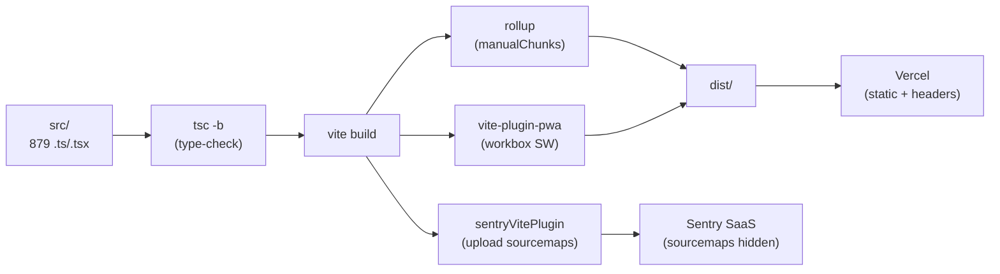

# 06 — Build & Bundling

> **Last verified**: 2026-05-03

Pipeline de build d'AppGrav V2 : **Vite 5** + **TypeScript 5.2** + **rollup**, avec Sentry sourcemap upload, PWA via vite-plugin-pwa, code splitting agressif, et double cible web/Capacitor.

## Vue d'ensemble



## Commandes

| Commande | Effet | Source |
|---|---|---|
| `npm run dev` | `vite` (port 3000, host 0.0.0.0) | [`package.json:scripts.dev`](../../package.json) |
| `npm run build` | `tsc -b && vite build` | type-check puis bundle |
| `npm run lint` | `eslint . --max-warnings 80` | budget warnings |
| `npm run preview` | `vite preview` | preview du bundle |
| `npm run build:analyze` | `set ANALYZE=true && vite build` | génère `dist/bundle-stats.html` (rollup-plugin-visualizer) |
| `npm run android:sync` | `set CAPACITOR_BUILD=true && npm run build && npx cap sync android` | build relative paths + sync natif |
| `npm run android:open` | `npx cap open android` | ouvre Android Studio |
| `npm run android:build` | `npm run android:sync && npx cap open android` | build complet Android |
| `npx vitest run` | tests | exclus : `breakery-platform/**`, `node_modules` |

## `vite.config.ts` — détaillé

Source : [`vite.config.ts`](../../vite.config.ts).

### Plugins

```ts
plugins: [
  react(),                                   // @vitejs/plugin-react
  ...(analyzer ? [analyzer] : []),           // rollup-plugin-visualizer si ANALYZE=true
  ...(!isCapacitor ? [VitePWA({...})] : []), // PWA désactivée en Capacitor
  sentryVitePlugin({                         // upload sourcemaps à Sentry SaaS
    authToken: process.env.SENTRY_AUTH_TOKEN,
    org: 'the-breakery',
    project: 'appgrav-v2',
    reactComponentAnnotation: { enabled: true },
  }),
]
```

### Aliases

[`vite.config.ts:163-173`](../../vite.config.ts) :

```ts
resolve: {
  alias: {
    '@': path.resolve(__dirname, './src'),
    // Stubs jspdf — économise ~107KB gzip (html2canvas, dompurify, canvg sont importés
    // par jspdf mais on n'utilise que .text() et autoTable, pas .html() ni SVG)
    'html2canvas': path.resolve(__dirname, './src/lib/stubs/html2canvas.ts'),
    'dompurify':   path.resolve(__dirname, './src/lib/stubs/dompurify.ts'),
    'canvg':       path.resolve(__dirname, './src/lib/stubs/canvg.ts'),
  },
}
```

L'alias `@/` matche `tsconfig.json:paths` (`"@/*": ["src/*"]`) pour cohérence type-check / runtime.

### Server (dev)

```ts
server: {
  port: parseInt(process.env.PORT || '3000', 10),
  host: true,  // bind 0.0.0.0 (accessible LAN — utile pour KDS/tablets en dev)
}
```

### Base path conditionnelle

[`vite.config.ts:25`](../../vite.config.ts) : `base: isCapacitor ? './' : '/'` — Capacitor charge depuis `file://`, donc paths relatifs obligatoires. Web Vercel : paths absolus `/`.

### esbuild (production)

[`vite.config.ts:179-184`](../../vite.config.ts) :

```ts
esbuild: {
  drop: mode === 'production' ? ['debugger'] : [],
  pure: mode === 'production' ? ['console.log', 'console.debug', 'console.info'] : [],
}
```

`console.warn` et `console.error` sont **conservés** en prod pour Sentry breadcrumbs.

## Code splitting — `manualChunks`

[`vite.config.ts:192-222`](../../vite.config.ts). Chunks vendor :

| Chunk | Contenu | Pourquoi |
|---|---|---|
| `vendor-supabase` | `@supabase/*` | Backend layer isolé, lazy si possible |
| `vendor-pdf` | `jspdf`, `jspdf-autotable` | Lazy-load via `import()` quand l'utilisateur exporte |
| `vendor-xlsx` | `xlsx` | Idem export Excel |
| `vendor-react` | React + react-dom + react-router + @tanstack + recharts + d3 + redux + immer + reselect + decimal.js + scheduler + clsx | **Mergés** pour éviter cycles circulaires (~620KB). Recharts dépend de react-redux qui dépend de react-dom — split = circular dep |
| `vendor-ui` | lucide-react + sonner + @radix-ui/* + tailwind-merge + cva + react-remove-scroll + aria-hidden | UI atoms |

`chunkSizeWarningLimit: 650` ([`vite.config.ts:191`](../../vite.config.ts)) — vendor-react est ~620KB, on tolère 650KB avant warning.

### Code splitting via `React.lazy`

Toutes les pages (sauf 2 critiques `LoginPage` et `POSMainPage`) sont chargées via `React.lazy()` dans les fichiers `src/routes/*.tsx`. Le chunk généré porte le nom de la page (Vite l'extrait du chemin import).

Exemple — [`src/routes/adminRoutes.tsx`](../../src/routes/adminRoutes.tsx) lazy-load 47 pages, chacune devenant un chunk séparé chargé à la demande.

`<Suspense fallback={<PageLoader />}>` global dans [`src/App.tsx:243`](../../src/App.tsx) absorbe le chargement.

## PWA — vite-plugin-pwa

[`vite.config.ts:30-154`](../../vite.config.ts). **Désactivée en Capacitor** (Service Workers conflictent avec WebView natif).

### Manifest

```ts
{
  name: 'AppGrav - The Breakery POS',
  short_name: 'AppGrav',
  theme_color: '#0f172a',
  background_color: '#0f172a',
  display: 'standalone',
  display_override: ['window-controls-overlay'],
  start_url: '/pos',
  scope: '/',
  icons: [192x192, 512x512, 512x512 maskable],
  shortcuts: [
    { name: 'Point of Sale', url: '/pos' },
    { name: 'Kitchen Display', url: '/kds' },
  ],
}
```

### Workbox runtime caching

| URL pattern | Strategy | Cache name | TTL / max entries |
|---|---|---|---|
| `https://fonts.googleapis.com/*` | CacheFirst | google-fonts-cache | 1 an, 10 entries |
| `https://fonts.gstatic.com/*` | CacheFirst | gstatic-fonts-cache | 1 an, 10 entries |
| Supabase REST `(user_profiles\|roles\|permissions\|role_permissions\|user_roles\|user_permissions\|user_sessions)` | **NetworkOnly** | (jamais caché) | sécurité QUAL-08 |
| Autre `*.supabase.co/rest/v1/*` | NetworkFirst | supabase-api-cache | 1 jour, 100 entries, timeout 10s |
| Images `(png\|jpg\|jpeg\|svg\|gif\|webp)` | CacheFirst | images-cache | 30 jours, 100 entries |

### Pre-cache

```ts
globPatterns: ['**/*.{js,css,html,ico,png,svg,woff,woff2}']
globIgnores:  ['**/logo-breakery-original*']  // gros original non utilisé
```

### SPA fallback

```ts
navigateFallback: '/index.html',
navigateFallbackDenylist: [/^\/api\//],
```

Combiné avec [`vercel.json`](../../vercel.json) `rewrites` : `/((?!assets/).*) → /index.html` pour rendre le SPA tolérant au refresh sur n'importe quelle route profonde.

## Sentry sourcemaps

[`vite.config.ts:155-161, 188-189`](../../vite.config.ts) :

```ts
sentryVitePlugin({
  authToken: process.env.SENTRY_AUTH_TOKEN,
  org: 'the-breakery',
  project: 'appgrav-v2',
  reactComponentAnnotation: { enabled: true },
}),
// ...
build: {
  sourcemap: 'hidden',
}
```

- **`sourcemap: 'hidden'`** : sourcemaps générées + uploadées à Sentry, mais **pas exposées publiquement** (pas de `//# sourceMappingURL=` dans le JS livré). Empêche reverse-engineering depuis le navigateur.
- `reactComponentAnnotation: true` : Sentry tag les erreurs avec le nom du composant React via Babel plugin
- `SENTRY_AUTH_TOKEN` doit être défini en build (Vercel env + `.env`)

Init runtime dans [`src/lib/sentry.ts`](../../src/lib/sentry.ts) — voir [`05-data-flow.md`](./05-data-flow.md#erreurs-et-observabilité).

## Capacitor build vs web build

Switch via env `CAPACITOR_BUILD=true` :

| Setting | Web | Capacitor |
|---|---|---|
| `base` | `/` | `./` (paths relatifs pour `file://`) |
| PWA plugin | activé | **désactivé** (conflit SW vs WebView) |
| Router | `BrowserRouter` ([`main.tsx:42`](../../src/main.tsx)) | `HashRouter` |
| Output | `dist/` → Vercel | `dist/` → `npx cap copy android` → `android/app/src/main/assets/` |
| Splash + StatusBar | n/a | `useCapacitorInit()` ([`src/hooks/useCapacitorInit.ts`](../../src/hooks/useCapacitorInit.ts)) |

## Bundle analyzer

```bash
npm run build:analyze
# → ouvre dist/bundle-stats.html avec treemap interactif
```

Génère via `rollup-plugin-visualizer` ([`vite.config.ts:9-15`](../../vite.config.ts)) avec `gzipSize: true`.

## Tests — Vitest

[`vite.config.ts:225-265`](../../vite.config.ts) :

```ts
test: {
  globals: true,
  environment: 'jsdom',
  setupFiles: './src/setupTests.ts',
  testTimeout: 15000,
  exclude: ['**/node_modules/**', '.claude/worktrees/**', 'breakery-platform/**'],
  coverage: {
    provider: 'v8',
    reporter: ['text', 'html', 'lcov'],
    thresholds: { statements: 8, branches: 6, functions: 6, lines: 8 },  // ratchet up only
  },
}
```

`breakery-platform/**` exclu — V3 a son propre `vitest.config` dans son monorepo Turborepo.

## Sortie typique du build

Après `npm run build` (estimation basée sur `manualChunks` config) :

```
dist/
├── index.html
├── manifest.webmanifest
├── sw.js                              # Service Worker workbox
├── workbox-*.js
├── registerSW.js
├── pwa-*.png
├── apple-touch-icon.png
├── assets/
│   ├── index-[hash].js                # entry point
│   ├── index-[hash].css               # tailwind compiled (~80KB)
│   ├── vendor-react-[hash].js         # ~620KB (React + router + tanstack + recharts + d3)
│   ├── vendor-supabase-[hash].js      # ~120KB
│   ├── vendor-ui-[hash].js            # ~150KB (lucide + radix + sonner)
│   ├── vendor-pdf-[hash].js           # ~250KB (jspdf, lazy)
│   ├── vendor-xlsx-[hash].js          # ~280KB (lazy)
│   ├── POSMainPage-[hash].js          # eager
│   ├── LoginPage-[hash].js            # eager
│   ├── DashboardPage-[hash].js        # lazy
│   ├── KDSMainPage-[hash].js          # lazy
│   ├── ... (~120 chunks lazy par page)
│   └── ... (.map files générés mais NON exposés — uploadés Sentry)
└── bundle-stats.html                  # si ANALYZE=true
```

Total ~2.5MB gzip pour l'app complète, avec `vendor-react` + `vendor-ui` + `index` + `POSMainPage` chargés au boot (~1MB), le reste lazy.

## Headers Vercel — `vercel.json`

[`vercel.json`](../../vercel.json) :

```json
{
  "rewrites": [
    { "source": "/((?!assets/).*)", "destination": "/index.html" }
  ],
  "headers": [
    {
      "source": "/assets/(.*)\\.css",
      "headers": [
        { "Content-Type": "text/css; charset=utf-8" },
        { "Cache-Control": "public, immutable, max-age=31536000" }
      ]
    },
    {
      "source": "/assets/(.*)\\.js",
      "headers": [{ "Cache-Control": "public, immutable, max-age=31536000" }]
    },
    {
      "source": "/(.*)",
      "headers": [
        { "X-Frame-Options": "DENY" },
        { "X-Content-Type-Options": "nosniff" },
        { "Referrer-Policy": "strict-origin-when-cross-origin" },
        { "Permissions-Policy": "camera=(), microphone=(), geolocation=()" },
        { "Strict-Transport-Security": "max-age=31536000; includeSubDomains" },
        { "Content-Security-Policy": "default-src 'self'; script-src 'self'; ..." }
      ]
    }
  ]
}
```

- Assets fingerprintés (`-[hash].js`) : cache 1 an immutable
- Fallback SPA : toute URL non-asset → `index.html`
- CSP strict : `script-src 'self'` (pas d'inline script), connect-src whitelist Supabase + Sentry + print server localhost:3001 + Anthropic

## TypeScript config

[`tsconfig.json`](../../tsconfig.json) :

```json
{
  "compilerOptions": {
    "target": "ES2020",
    "module": "ESNext",
    "moduleResolution": "bundler",
    "jsx": "react-jsx",
    "strict": true,
    "noUnusedLocals": true,
    "noUnusedParameters": true,
    "noFallthroughCasesInSwitch": true,
    "paths": { "@/*": ["src/*"] },
    "types": ["vitest/globals", "node"]
  },
  "include": ["src"],
  "references": [{ "path": "./tsconfig.node.json" }]
}
```

`tsc -b` (build mode) résout les project refs (`tsconfig.node.json` pour vite.config.ts qui tourne en Node).

## Index HTML

[`index.html`](../../index.html) head :
- CSP meta tag (mirror du header Vercel mais avec IPs LAN print server hardcoded)
- Google Fonts preconnect + load (Inter, Playfair Display, Fraunces, JetBrains Mono)
- PWA meta : `theme-color`, `mobile-web-app-capable`, `apple-touch-icon`
- Class racine `<html class="theme-pos">` (design tokens "Hybrid Pro")
- Mount points : `<div id="root">` + `<div id="modal-root">` (Radix portals)

## Variables d'environnement

| Variable | Build/Runtime | Exemple |
|---|---|---|
| `VITE_SUPABASE_URL` | runtime (client) | `https://abjabuniwkqpfsenxljp.supabase.co` |
| `VITE_SUPABASE_ANON_KEY` | runtime | anon JWT |
| `VITE_SENTRY_DSN` | runtime | DSN Sentry |
| `VITE_APP_VERSION` | runtime | `1.0.0` (release tag Sentry) |
| `VITE_PLATFORM` | runtime | `android` (Capacitor) |
| `SENTRY_AUTH_TOKEN` | **build only** | upload sourcemaps |
| `CAPACITOR_BUILD` | build | `true` pour cible native |
| `ANALYZE` | build | `true` pour bundle analyzer |
| `PORT` | dev | port serveur Vite (défaut 3000) |
| `NODE_ENV` | both | `production` / `development` |

Les variables `VITE_*` sont injectées dans le bundle (publiques par construction) ; les autres restent côté Node build/server.

## Liens internes

- [`02-frontend-architecture.md`](./02-frontend-architecture.md) — Anatomie `src/`
- [`03-state-management.md`](./03-state-management.md) — Stores et persistence
- [`04-routing.md`](./04-routing.md) — `React.lazy()` par route
- [`05-data-flow.md`](./05-data-flow.md) — Cache strategy détaillée (PWA + React Query)
