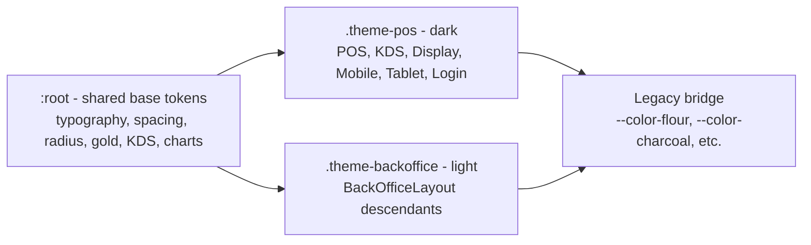

# 01 — Luxe Dark Overview

> **Last verified**: 2026-05-03
> **Source of truth**: [`/DESIGN.md`](../../../DESIGN.md) (~397 lines, 2026-04-09)
> **Implementation**: [`src/styles/index.css`](../../../src/styles/index.css), [`tailwind.config.js`](../../../tailwind.config.js)

The Luxe Dark design language is the visual signature of AppGrav V2 for The Breakery. This document distills the philosophy. For every concrete token value and decoration rule, read `DESIGN.md` directly.

## 1. Concept — "Premium Dark Bakery ERP"

The Breakery operates inside a French artisan bakery in Lombok. The interface borrows that physical world: dim warm lighting, brass fixtures, gilded shop signs, dark walnut display cases. Translated to a screen, this becomes:

- **Theatrical contrast** — content emerges from `--surface-0: #0C0C0E` (near-black) like pastries from an unlit display, lit only by typography weight and the warm `--gold: #C9A55C` accent.
- **Restrained color** — color is reserved for semantic meaning. Gold = brand/action, green = success, orange = warning, red = critical. Everything else is grayscale.
- **Typographic formality** — Italic Playfair Display for the brand "B" and dashboard headlines; Inter geometric sans for everything operational; Fraunces optical-size serif for analytics numerals; JetBrains Mono for tabular numerics.
- **Whisper-thin borders** — `--border: #2A2A32` (POS) is so close to surface that it structures without weighing — like watermark dividers on heavy paper.
- **Utilitarian density with elegance** — operational screens (POS, KDS) pack many products / orders into the viewport, but each row breathes thanks to generous vertical padding (`--space-md` = 12px minimum) and tracking on labels.

> **Atmosphere words**: Moody, Artisanal, Nocturnal, Refined, Theatrical, Dense-yet-Elegant.

## 2. Foundational Principles

| Principle | How it is enforced |
|---|---|
| **High contrast** | `text-content-primary` (`#F0F0F2` on POS) over `bg-surface-0` (`#0C0C0E`) yields a contrast ratio above 18:1, well past WCAG AAA. Muted text (`#A8A8B0`) stays above 7:1. |
| **Soigné typography** | Section headers use `text-[10px] uppercase font-semibold tracking-[0.2em]` — the signature label style. Brand moments use Playfair Display italic. Numeric displays use `font-light` 1.5–3rem with `tabular-nums`. |
| **Generous white-space** | All operational screens use `h-[100dvh] flex overflow-hidden` — no body scroll, only panel scroll. Card padding is `p-lg` (16px) minimum; section gutters are `p-xl` (24px). |
| **Discreet micro-interactions** | Buttons translate `-2px` on hover with a gold glow shadow; KDS cards pulse with `animate-pulse-critical` (2s) only when an order exceeds 15 minutes. Animations honor `prefers-reduced-motion: reduce`. |
| **Token-driven everything** | No hard-coded colors in components; every value resolves through a CSS variable on `:root`, `.theme-pos`, or `.theme-backoffice`. |

## 3. Palette Atmosphere

The palette feels like a candle-lit Parisian patisserie at closing time. Surfaces step from `#0C0C0E` → `#151517` → `#1E1E22` → `#28282E` (POS) — each ~7% brighter — providing four progressive elevation tiers without ever feeling flat. The single brand accent, **Artisan Gold `#C9A55C`**, is the color of brass cake stands and gilded signage. A complementary set of semantic colors (`#34D399` jade green, `#FBBF24` warm amber, `#F87171` muted coral, `#60A5FA` cool sky) is always rendered through 8% transparency on dark surfaces, so semantic feedback never overwhelms the warm baseline. Indonesian POS category tags use a fixed 10-color palette (red → cyan) for at-a-glance parsing of menu sections.

## 4. Target Users & Their Modes

| Persona | Primary surface | What the design serves |
|---|---|---|
| **Cashier** (rapid-fire) | POS Terminal (`/pos`) | Three-column dense layout: nav (w-24) + product grid (flex-1) + cart (w-[480px]). High contrast tiles, large gold "Pay" button, full keypad sized for thumbs. Speed > exploration. |
| **Kitchen / Barista** (functional) | KDS (`/kds`) | Tile grid with timing-color borders (`--kds-fresh` → `--kds-critical`). Every order card is glanceable in <1 second. Bump buttons fill `min-h-[48px]` for fast taps. |
| **Manager / Analyst** (analytical) | Back-Office (`/`, `/reports`, `/accounting`) | Light theme (`.theme-backoffice`), data-dense tables, charts in 6-color palette, Playfair Display titles, Fraunces analytics numerals. Built for desktop, scrollable, sidebars stay visible. |
| **Customer** (passive) | Customer Display (`/display`) | Fullscreen `.theme-pos`, large product list, big total, brand "B" mark. No interaction. |
| **Tablet waiter / Mobile manager** (touch) | `/tablet/*`, `/mobile/*` | Same Luxe Dark palette, 44×44 minimum tap targets, bottom navigation, slide-up sheets. |

## 5. Why Dark-Only in Production

- **`html` always boots with `class="theme-pos"`** in [`index.html`](../../../index.html#L2) — dark is the default and the only theme exposed to POS, KDS, Display, Tablet, Mobile, and Login.
- The light theme **`.theme-backoffice`** is applied only by `BackOfficeLayout` (the back-office is data-dense and benefits from a paper-white surface; Indonesian managers expect spreadsheet-like contrast).
- `next-themes` is installed but **not wired to any toggle**; the theme is route-based, not user-preference-based. There is no "dark/light switch" in settings.
- Rationale: in a bakery serving 200 transactions/day, the cashier surface stays dim to (a) reduce screen glare in low-light morning prep, (b) produce a calm visual environment for staff, (c) reinforce the brand's premium positioning to customers viewing the display screen.

## 6. Dual-Theme Architecture (recap)

Both themes resolve **the same token names** (`--surface-0`, `--text-primary`, `--border`, …) to different values. Components that consume tokens (`bg-surface-1 text-content-primary border-line`) automatically work in both contexts.

## 7. Surface, Text, Border at a Glance

| Token | POS (Dark) | Back-Office (Light) | Tailwind |
|---|---|---|---|
| `--surface-0` | `#0C0C0E` | `#F8F8F6` | `bg-surface-0` |
| `--surface-1` | `#151517` | `#FFFFFF` | `bg-surface-1` |
| `--surface-2` | `#1E1E22` | `#F2F2EE` | `bg-surface-2` |
| `--surface-3` | `#28282E` | `#EAEAE6` | `bg-surface-3` |
| `--text-primary` | `#F0F0F2` | `#1A1A1D` | `text-content-primary` |
| `--text-secondary` | `#A8A8B0` | `#6B7280` | `text-content-secondary` |
| `--text-muted` | `#6E6E78` | `#9CA3AF` | `text-content-muted` |
| `--border` | `#2A2A32` | `#E5E7EB` | `border-line` |
| `--border-strong` | `#3A3A44` | `#D1D5DB` | `border-line-strong` |
| `--gold` (fixed) | `#C9A55C` | `#C9A55C` | `bg-gold`, `text-gold` |

Every other token (semantic colors, shadows, scrollbar, shimmer) is detailed in [02-tokens.md](./02-tokens.md).

## 8. Where to Read More

| Topic | File |
|---|---|
| Every token (color, type, spacing, radius, shadow, z-index, animation) | [02-tokens.md](./02-tokens.md) |
| The 29 shadcn/ui primitives in `src/components/ui/` | [03-shadcn-primitives.md](./03-shadcn-primitives.md) |
| Feature-level component patterns (POS, KDS, Reports, Customers, Inventory, Accounting) | [04-feature-components.md](./04-feature-components.md) |
| Layouts (BackOfficeLayout, POS three-column, KDS grid, Customer Display, Tablet, Mobile) | [05-layouts.md](./05-layouts.md) |
| Lucide React, PWA icons, brand assets | [06-iconography-illustrations.md](./06-iconography-illustrations.md) |
| Breakpoints, touch targets, Capacitor, safe-area, PWA install | [07-responsive-mobile.md](./07-responsive-mobile.md) |

For the canonical visual specification with every CSS rule and decoration, always defer to **[`/DESIGN.md`](../../../DESIGN.md)**.

## 9. Quick-Reference Atmosphere Recipe

When prompting an LLM (or briefing a designer) for a new screen:

> Premium dark bakery ERP with theatrical contrast and artisan gold accents. Inter sans-serif for all UI, Playfair Display italic for brand moments only. Surfaces use `--surface-0` through `--surface-3` for progressive elevation. Borders are whisper-thin (`--border`). Buttons use bold uppercase Inter with `tracking-[0.05em]`. Token-driven spacing via the `--space-*` scale. Full-viewport immersive layout, no page scroll, only panel scroll.
