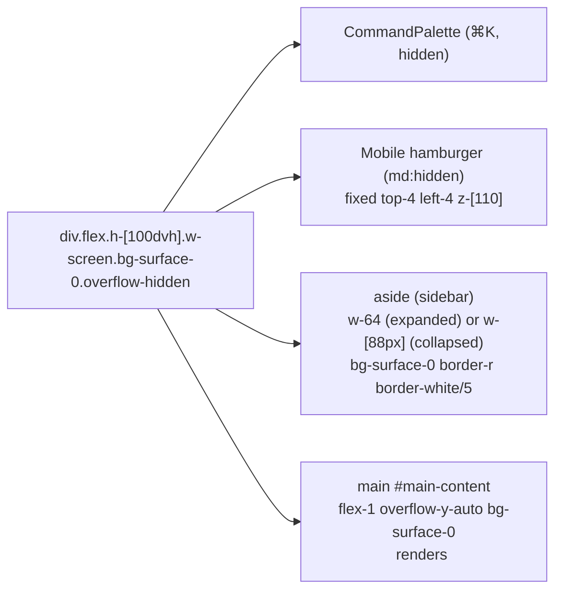
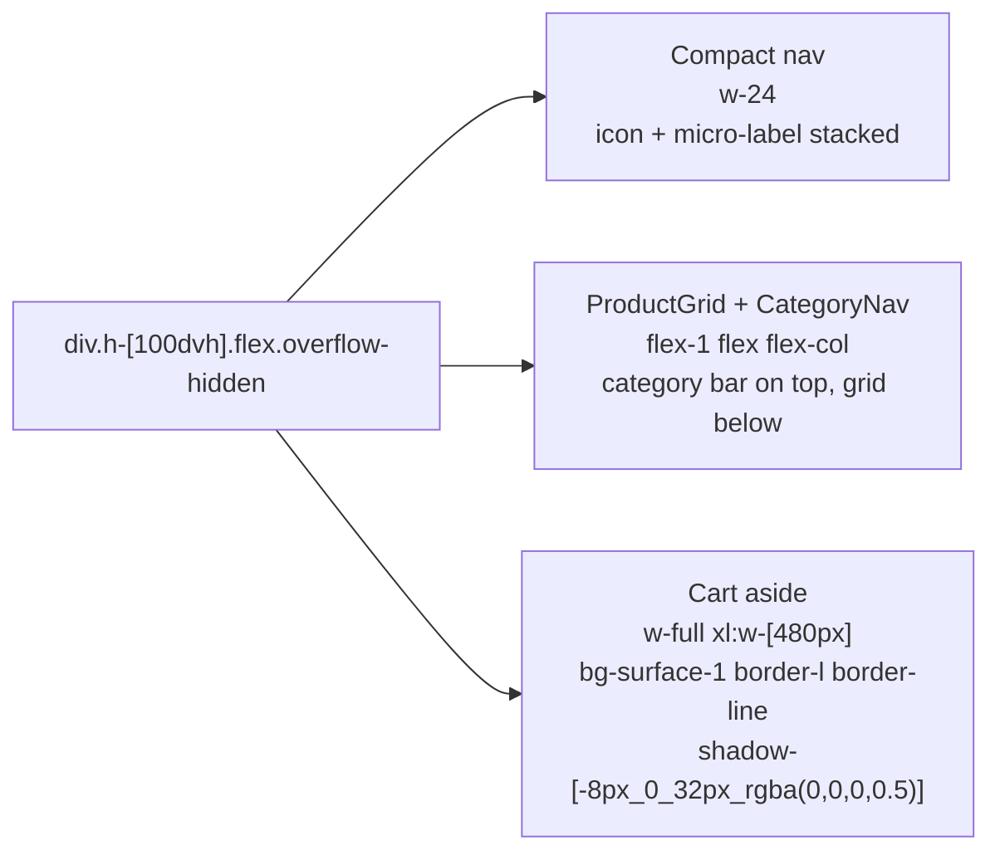
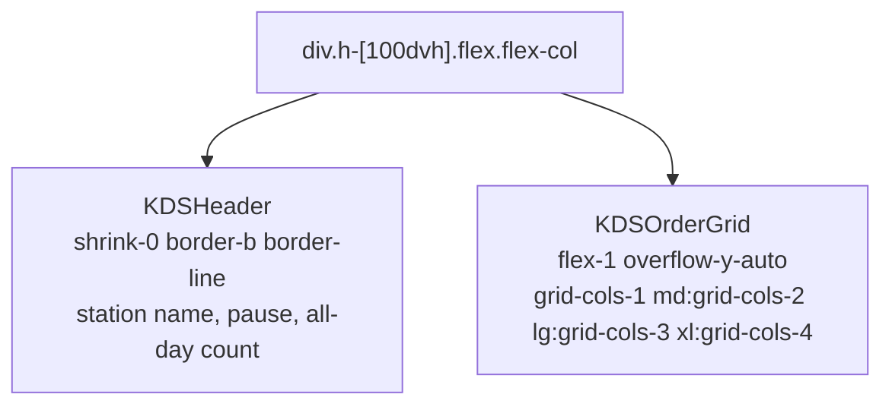
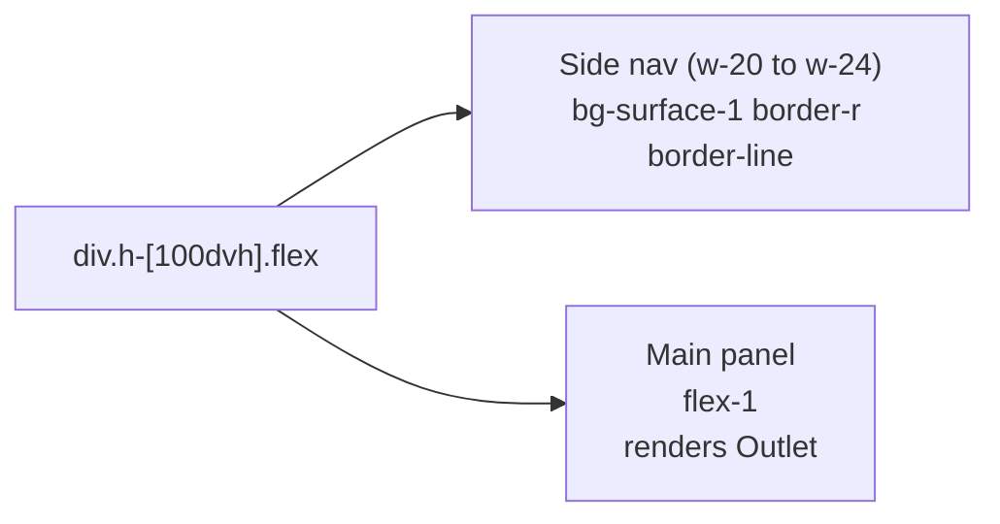
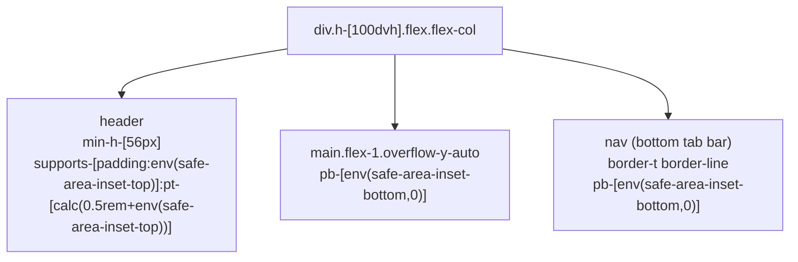
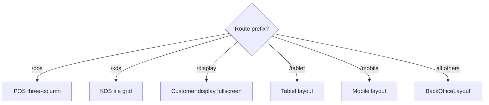

# 05 — Layouts

> **Last verified**: 2026-05-03
> **Sources**: [`src/layouts/BackOfficeLayout.tsx`](../../../src/layouts/BackOfficeLayout.tsx), [`src/components/mobile/MobileLayout.tsx`](../../../src/components/mobile/MobileLayout.tsx), [`src/pages/pos/POSMainPage.tsx`](../../../src/pages/pos/POSMainPage.tsx), [`src/pages/kds/KDSMainPage.tsx`](../../../src/pages/kds/KDSMainPage.tsx), [`src/pages/tablet/TabletLayout.tsx`](../../../src/pages/tablet/TabletLayout.tsx)

AppGrav V2 uses six distinct layouts, each tuned to its surface. All operational screens follow the same rule: **`h-[100dvh]` viewport, `overflow-hidden` on the root, scroll only inside named panels**.

---

## 1. BackOfficeLayout (Sidebar + Main)

**Path**: [`src/layouts/BackOfficeLayout.tsx`](../../../src/layouts/BackOfficeLayout.tsx)
**Theme**: `.theme-backoffice` (light) — applied indirectly because BackOffice routes inherit the light theme via the parent `App` shell.
**Used by**: `/`, `/orders`, `/products`, `/inventory`, `/customers`, `/b2b`, `/purchasing`, `/expenses`, `/accounting`, `/reports`, `/users`, `/settings`.

### Composition

### Sidebar internals

| Block | Classes | Notes |
|---|---|---|
| **Brand header** | `h-[88px] flex items-center border-b border-white/5` | `BreakeryLogo size="md" variant="full"` collapses to `size="sm"` |
| **Status row** | `px-4 py-2 border-b border-white/5` | `NotificationBell` |
| **Nav** | `flex-1 px-4 py-6 overflow-y-auto custom-scrollbar` | 3 sections: Operations / Management / Admin. Each section heading: `text-[10px] font-semibold text-content-muted uppercase tracking-wider` |
| **Nav item** | `flex items-center gap-3 h-11 rounded-md` | Active: `text-gold bg-gold/[0.05] border-r-2 border-r-gold` |
| **Footer** | `p-4 border-t border-white/5` | Collapse toggle (`ChevronLeft`/`ChevronRight`) + user pill + logout |

### Behaviors

- **Sidebar toggle**: `useState(isCollapsed)` — sidebar transitions `w-64 ↔ w-[88px]` over `duration-300 ease-in-out`. Tooltips appear on hover when collapsed (`bo-nav-tooltip` class).
- **Mobile drawer**: below `md` (`max-md`) the sidebar is `fixed -translate-x-full` and slides in when `isMobileOpen` is true. A `bg-black/60` backdrop appears.
- **Skip link**: `<a href="#main-content" class="sr-only focus:not-sr-only">` for keyboard / screen-reader accessibility.
- **Scroll**: only the `<main>` scrolls; sidebar nav has its own `overflow-y-auto`.

### Active breakpoints

| Breakpoint | Behavior |
|---|---|
| `< md` (< 768px) | Sidebar hidden by default, hamburger visible |
| `≥ md` (≥ 768px) | Sidebar always visible, can collapse to icon-only |

---

## 2. POS Fullscreen Layout (Three-Column)

**Path**: [`src/pages/pos/POSMainPage.tsx`](../../../src/pages/pos/POSMainPage.tsx)
**Theme**: `.theme-pos` (dark)
**Wrapper**: no `BackOfficeLayout` — bare `div.theme-pos.flex.flex-col.h-[100dvh].overflow-hidden.bg-surface-0`

### Composition

### Behaviors

- **Three columns** lock at `xl:` breakpoint (≥ 1280px). Below `xl`, the cart drops below the grid in a single column.
- **No body scroll** — only the product grid and the cart item list scroll independently.
- **VirtualKeypadProvider** wraps the route to expose a fullscreen keypad overlay (`fixed inset-0 z-[2000]`) for PIN / qty / price inputs — important for touch terminals without hardware keyboards.
- **Cart bottom sticky** — `CartActions` is a `border-t border-line` sticky footer with `pb-[calc(1rem+env(safe-area-inset-bottom))]` for iPad / Android home-indicator clearance.

### Sidebar (POS)

The POS uses a **compact** sidebar (w-24) rather than the BackOffice w-64 — icon + tiny label stacked vertically. Active state: `bg-gold/[0.08] text-gold`.

---

## 3. KDS Layout (Tile Grid)

**Path**: [`src/pages/kds/KDSMainPage.tsx`](../../../src/pages/kds/KDSMainPage.tsx)
**Theme**: `.theme-pos`
**Wrapper**: bare `div.theme-pos.h-[100dvh].flex.flex-col.overflow-hidden`

### Composition

### Behaviors

- **Tile reflow**: orders enter from top-left, oldest cards bubble up. CSS Grid auto-places them.
- **Status colors**: each tile's border color reflects elapsed time — `--kds-fresh` (green), `--kds-normal` (yellow), `--kds-late` (orange), `--kds-critical` (red).
- **Pulse animations**: `animate-pulse-critical` on tiles past 15 min (red glow), `animate-pulse-preparing` on cards in active prep.
- **Drag-and-drop**: optional reordering via `@dnd-kit` for stations that prioritize manually.
- **Auto-remove**: completed tiles fade out via `animate-card-exit` after the configurable hold window (`useOrderAutoRemove`).
- **Multiple stations**: `kds_stations` table filters cards per station (Hot / Cold / Barista / Plating); each station opens at `/kds/station?id=...`.

### Active breakpoints

| Breakpoint | Columns |
|---|---|
| `< md` | 1 |
| `md` (≥ 768) | 2 |
| `lg` (≥ 1024) | 3 |
| `xl` (≥ 1280) | 4 |

---

## 4. Customer Display Layout

**Path**: [`src/pages/display/`](../../../src/pages/display/)
**Theme**: `.theme-pos`
**Wrapper**: fullscreen `div.h-[100dvh].w-screen.bg-surface-0`

### Composition

- **Top branding strip** — large Playfair Display "B" lockup, current order number `text-4xl tabular-nums`.
- **Item list** — each cart item rendered with `text-2xl`, qty × name, price right-aligned `font-mono-num text-gold`.
- **Total band** — fixed bottom: `bg-surface-1 border-t border-line`, total in `text-5xl font-light tabular-nums text-gold`.

### Behaviors

- **Read-only**: no inputs, no nav — driven by `BroadcastChannel('appgrav-lan')` messages from the POS hub.
- **Always portrait or landscape** depending on the screen orientation; no responsive breakpoints (the display is a fixed device).
- **Idle state**: when no order is active, shows the Breakery brand logo + tagline + animated "B" mark.

---

## 5. Tablet Layout (`/tablet/*`)

**Path**: [`src/pages/tablet/TabletLayout.tsx`](../../../src/pages/tablet/TabletLayout.tsx)
**Theme**: `.theme-pos`
**Use case**: waiter taking orders on a 10" tablet (typical: iPad or Android tab).

### Composition

### Behaviors

- **Larger touch targets**: minimum `min-h-[48px]` on every interactive control, `min-w-[44px]` for icon buttons (WCAG 2.2 AA).
- **Bottom sheets** for filters and product details (slide-up via `animate-slide-up`).
- **Order cart** is a slide-in `Sheet` from the right rather than a permanent panel.

---

## 6. Mobile Layout

**Path**: [`src/components/mobile/MobileLayout.tsx`](../../../src/components/mobile/MobileLayout.tsx)
**Theme**: `.theme-pos`
**Use case**: manager on phone, mobile catalog browsing, mobile order taking.

### Composition

### Behaviors

- **Top header** — `min-h-[56px]`, brand on left, optional action icons on right. Honors the iOS notch with `safe-area-inset-top` padding.
- **Bottom nav** — typically 4–5 tabs (Home / Catalog / Cart / Orders / Profile) with Lucide icons + label below. Honors the iOS home indicator with `safe-area-inset-bottom` padding.
- **Single column** — content lives in `main.flex-1.overflow-y-auto` with `p-lg` (16px) gutter.
- **Bottom sheets** — filter / detail panels slide up from the bottom (`animate-slide-up`), `rounded-t-2xl`, `max-h-[80vh]`. Same safe-area handling at the bottom.
- **Floating action button** — `MobileCatalogPage` puts a `w-14 h-14 bg-gold rounded-full` FAB at `bottom-[calc(72px+1rem+env(safe-area-inset-bottom,0px))] right-4` to clear the bottom nav.

---

## 7. Layout-Level Conventions

| Convention | Why |
|---|---|
| `h-[100dvh]` (not `h-screen`) | `dvh` accounts for mobile browser chrome (Safari URL bar). |
| `overflow-hidden` on root | Prevents body scroll; only named panels scroll. |
| `flex` composition | All layouts are flex — no CSS Grid for the top-level structure (except KDS). |
| `safe-area-inset-*` everywhere on mobile/POS | iPad / Android-with-gestures clearance. |
| `border-line` over hard hex | Theme-portable. |
| Sidebars use `bg-surface-0`, panels use `bg-surface-1` | Convention: page = darker, panels = lighter. The Cart breaks this in POS by using `bg-surface-1` against the grid's `bg-surface-0` to create a tactile lift. |
| Sticky headers use `z-sticky` (200) | Below modals, above content. |

---

## 8. Layout Selection Rule

For more on responsive behavior across these layouts, read [07-responsive-mobile.md](./07-responsive-mobile.md).
