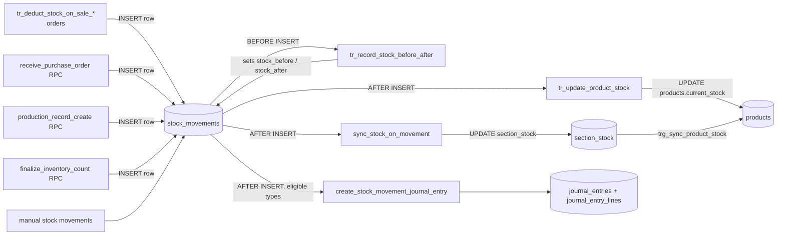
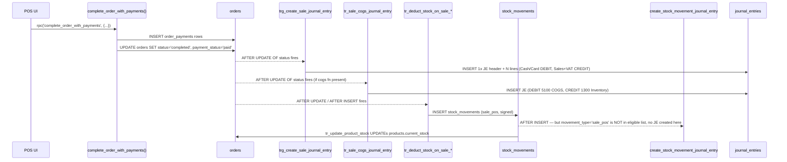

# 04 — Triggers

> **Last verified**: 2026-05-03
> **Source of truth**: `supabase/migrations/`. Search via `grep -E "CREATE TRIGGER" supabase/migrations/*.sql`.
> **Companion**: [01-schema-overview.md](01-schema-overview.md), [02-tables-reference.md](02-tables-reference.md), [03-rpc-functions.md](03-rpc-functions.md).

This document catalogues every active SQL trigger in the AppGrav V2 production database. Triggers are the spine of the system's automatic behaviour: timestamp maintenance, number generation, stock deduction, automatic accounting journal entries, audit logging, and status-transition guards.

---

## 1. Trigger taxonomy

| Category | Count | Lead migration |
|----------|------:|----------------|
| `updated_at` maintenance | 25+ | `011_functions_triggers.sql`, then per-domain `trg_*_updated_at` from `20260323100200_create_accounting_tables.sql` |
| Auto-numbering (BEFORE INSERT) | 11 | `011_functions_triggers.sql` |
| Stock deduction on sale | 3 | `20260205100000_…`, refit in `20260308130000_restore_stock_deduction_triggers.sql` |
| Stock movement bookkeeping | 3 | `011_functions_triggers.sql`, `20260203110000_section_stock_model.sql`, `20260323140000_add_stock_sync_trigger.sql` |
| Accounting JE auto-creation | 4 | `20260216100300_…`, `20260216100500_…`, `20260402110000_…`, `20260414120000_…` |
| Audit log capture | 12 | `20260321160000_add_general_audit_triggers.sql` |
| Status-transition enforcement | 2 | `20260330600300_p3_accounting_audit_fixes.sql` |
| Cost propagation | 2 | `20260320111245_fix_cost_propagation.sql` |
| B2B totals maintenance | 2 | `011_functions_triggers.sql` |
| Settings sync notification | 3 | `20260428190000_settings_sync_trigger.sql` |
| Auth bridge (auth.users → user_profiles) | 1 | `20260222035037_add_handle_new_user_trigger.sql` |
| Customer QR code generation | 1 | `011_functions_triggers.sql` |
| PO line totals | 3 | `20260204100000_fix_missing_functions_and_views.sql` |
| Internal-transfer totals | 1 | `20260203120000_internal_transfers_sections.sql` |
| Session token hashing | 1 | `016_integrity_fixes.sql` |

---

## 2. `updated_at` maintenance

A single function `update_updated_at()` (defined in `011_functions_triggers.sql`) is wired to most tables that have an `updated_at` column.

```sql
CREATE OR REPLACE FUNCTION update_updated_at()
RETURNS TRIGGER AS $$
BEGIN
  NEW.updated_at = NOW();
  RETURN NEW;
END;
$$ LANGUAGE plpgsql;
```

| Trigger name | Table | Migration |
|--------------|-------|-----------|
| `tr_update_categories_timestamp` | `categories` | 011 |
| `tr_update_sections_timestamp` | `sections` | 011 |
| `tr_update_products_timestamp` | `products` | 011 |
| `tr_update_customers_timestamp` | `customers` | 011 |
| `tr_update_user_profiles_timestamp` | `user_profiles` | 011 |
| `tr_update_pos_sessions_timestamp` | `pos_sessions` | 011 |
| `tr_update_orders_timestamp` | `orders` | 011 |
| `tr_update_order_items_timestamp` | `order_items` | 011 |
| `tr_update_recipes_timestamp` | `recipes` | 011 |
| `tr_update_production_records_timestamp` | `production_records` | 011 |
| `tr_update_suppliers_timestamp` | `suppliers` | 011 |
| `tr_update_purchase_orders_timestamp` | `purchase_orders` | 011 |
| `tr_update_b2b_orders_timestamp` | `b2b_orders` | 011 |
| `tr_update_roles_timestamp` | `roles` | 011 |
| `tr_update_settings_timestamp` | `settings` | 011 |
| `tr_update_customer_categories_timestamp` | `customer_categories` | 011 |
| `tr_update_loyalty_tiers_timestamp` | `loyalty_tiers` | 011 |
| `tr_update_promotions_timestamp` | `promotions` | 011 |
| `tr_update_product_combos_timestamp` | `product_combos` | 011 |
| `tr_update_internal_transfers_timestamp` | `internal_transfers` | 011 |

In addition, the accounting tables migration `20260323100200_create_accounting_tables.sql` registers `trg_<table>_updated_at` for every accounting table via a DO loop calling `set_updated_at()` (a sibling helper):

| Trigger | Table |
|---------|-------|
| `trg_accounts_updated_at` | `accounts` |
| `trg_journal_entries_updated_at` | `journal_entries` |
| `trg_journal_entry_lines_updated_at` | `journal_entry_lines` |
| `trg_accounting_mappings_updated_at` | `accounting_mappings` |
| `trg_vat_filings_updated_at` | `vat_filings` |
| `trg_fiscal_periods_updated_at` | `fiscal_periods` |

All fire `BEFORE UPDATE` and run `FOR EACH ROW`.

---

## 3. Auto-numbering (BEFORE INSERT)

Every numbered entity has a generator function and a trigger guarded by `WHEN (NEW.<col> IS NULL)` so manual overrides are honored.

| Trigger | Table | Function | Format |
|---------|-------|----------|--------|
| `tr_generate_order_number` | `orders` | `generate_order_number()` | `POS-YYYYMMDD-0001` |
| `tr_generate_session_number` | `pos_sessions` | `generate_session_number()` | `SESSION-YYYYMMDD-01` |
| `tr_generate_movement_id` | `stock_movements` | `generate_movement_id()` | `MVT-YYYYMMDD-00001` |
| `tr_generate_po_number` | `purchase_orders` | `generate_po_number()` | `PO-YYYYMMDD-001` |
| `tr_generate_b2b_order_number` | `b2b_orders` | `generate_b2b_order_number()` | `B2B-YYYYMMDD-001` |
| `tr_generate_production_id` | `production_records` | `generate_production_id()` | `PROD-YYYYMMDD-001` |
| `tr_generate_transfer_number` | `internal_transfers` | `generate_transfer_number()` | `TRF-YYYYMMDD-001` |
| `tr_generate_count_number` | `inventory_counts` | `generate_count_number()` | `CNT-YYYYMMDD-01` |
| `tr_generate_b2b_payment_number` | `b2b_payments` | `generate_b2b_payment_number()` | `PAY-YYYYMMDD-001` |
| `tr_generate_b2b_delivery_number` | `b2b_deliveries` | `generate_b2b_delivery_number()` | `DLV-YYYYMMDD-001` |
| `tr_generate_customer_qr_code` | `customers` | `generate_customer_qr_code()` | `BRK-XXXXXX-YYMM` |

Source: `011_functions_triggers.sql`. The generators count `today's existing rows + 1`. For thread-safe behaviour under concurrency, the newer pattern (since `20260212130000_thread_safe_invoice_number.sql`) uses `sequence_tracker` row-locking — it is recommended for any new numbered entity.

---

## 4. Stock deduction on sale

Three triggers exist in production — multiple migrations refined the firing conditions across 2026-02 → 2026-03. The current canonical set is from `20260308130000_restore_stock_deduction_triggers.sql`:

| Trigger | Event | Function |
|---------|-------|----------|
| `tr_deduct_stock_on_sale_insert` | `AFTER INSERT ON orders WHEN status='completed'` | `deduct_stock_on_sale_items()` |
| `tr_deduct_stock_on_sale_payment` | `AFTER UPDATE ON orders WHEN payment_status='paid' AND OLD.payment_status<>'paid' AND NEW.status='completed'` | `deduct_stock_on_sale_items()` |
| `tr_deduct_stock_on_sale_completed` | `AFTER UPDATE ON orders WHEN status='completed' AND OLD.status<>'completed'` | `deduct_stock_on_sale_items()` |

The function (`deduct_stock_on_sale_items`, defined `20260205100000_…` and reused) iterates `order_items` and:

- **Pre-made product** (`products.deduct_ingredients = FALSE`) → inserts a single `stock_movements` row of `movement_type = 'sale_pos'` (or `'sale_b2b'` for `order_type='b2b'`) with negative quantity.
- **Made-to-order product** (`deduct_ingredients = TRUE`):
  - If `order_items.selected_variants` JSONB contains `materials[]`, deducts those material quantities (`* order_item.quantity`).
  - Else, falls back to `recipes` for the product and deducts each `material_id` proportionally.
  - Graceful fallback: if no recipe exists, the loop simply does nothing (no error).

The actual `products.current_stock` update happens via the AFTER-INSERT trigger on `stock_movements` (see §5).

---

## 5. Stock movement bookkeeping



| Trigger | Event | Function | Purpose |
|---------|-------|----------|---------|
| `tr_record_stock_before_after` | BEFORE INSERT on `stock_movements` | `record_stock_before_after()` | Reads `products.current_stock`, sets `stock_before` / `stock_after` based on signed quantity |
| `tr_update_product_stock` | AFTER INSERT on `stock_movements` | `update_product_stock()` | Updates `products.current_stock` (signed) |
| `sync_stock_on_movement` | AFTER INSERT on `stock_movements` | `sync_product_stock_from_movement()` | Updates `section_stock.current_stock` (per-section) — migration `20260323140000_…` |
| `trg_sync_product_stock` | AFTER INSERT/UPDATE/DELETE on `section_stock` | `sync_product_total_stock()` | Recomputes `products.current_stock` as SUM(section_stock.current_stock) — migration `20260203110000_section_stock_model.sql` |

The dual-update pattern (movement → product, then section_stock → product) was introduced when the section-stock model was added on 2026-02-03 — the section trigger is authoritative for products that have section_stock rows.

---

## 6. Automatic Accounting Journal Entries

These are the most business-critical triggers — they keep the double-entry ledger in lockstep with operational events.

### 6.1 Sale JE — `trg_create_sale_journal_entry`

**Migration**: `20260216100300_trigger_sale_journal_entry.sql` (function in `20260216100200_create_sale_journal_entry_function.sql`).
**Hardened by**: `20260409180000_fix_accounting_p0_restore_unified_triggers.sql`, `20260413200000_fix_void_discount_reversal.sql`, `20260414120000_audit_fix_recreate_rpcs_add_cogs.sql`.

```sql
CREATE TRIGGER trg_create_sale_journal_entry
  AFTER UPDATE OF status ON public.orders
  FOR EACH ROW
  WHEN (
    (NEW.status = 'completed' AND OLD.status IS DISTINCT FROM 'completed')
    OR
    (NEW.status = 'voided'    AND OLD.status IS DISTINCT FROM 'voided')
  )
  EXECUTE FUNCTION public.create_sale_journal_entry();
```

**Behaviour** (function `create_sale_journal_entry()`, `SECURITY DEFINER`):

For a **completed** sale, splits the order total (PB1-inclusive) into:
- VAT amount = `total × 10 / 110`
- Net = `total − VAT`

Creates one `journal_entries` row + N lines:

| Side | Account | Amount |
|------|---------|--------|
| DEBIT | `1110` Cash *or* `1130` Card *or* `1131` QRIS *or* `1132` EDC | per `order_payments` row (split-payment aware) |
| CREDIT | `4100` Sales Revenue | net |
| CREDIT | `2110` PB1 Payable | VAT |
| DEBIT (optional) | `4190` Sales Discount | `discount_amount` |

For **voided** orders, posts a reversal JE (debits become credits and vice versa) using the original `payment_method`.

Accounts are looked up by code first, then by name pattern as a safety fallback. If essential accounts (Sales 4100 or VAT 2110) are missing, JE creation is skipped and a NOTICE is logged.

### 6.2 Purchase JE — `trg_create_purchase_journal_entry`

**Migration**: `20260216100500_trigger_purchase_journal_entry.sql` (function in `20260216100400_create_purchase_journal_entry_function.sql`).

```sql
CREATE TRIGGER trg_create_purchase_journal_entry
  AFTER UPDATE OF status ON public.purchase_orders
  FOR EACH ROW
  WHEN (NEW.status = 'received' AND OLD.status IS DISTINCT FROM 'received')
  EXECUTE FUNCTION public.create_purchase_journal_entry();
```

**Behaviour**:

| Side | Account | Amount |
|------|---------|--------|
| DEBIT | `1300` Inventory (if `expense_type IN ('ingredients','raw_materials')`) *or* `5100` COGS | net |
| DEBIT | `1400` VAT Input | VAT (from `tax_amount` or computed from `tax_rate`) |
| CREDIT | `2100` Accounts Payable | total |

If `tax_amount` is null and `tax_rate > 0`, computes VAT from subtotal. Skips if AP account (2100) cannot be resolved.

### 6.3 Sale COGS JE — `tr_sale_cogs_journal_entry`

**Migration**: `20260414120000_audit_fix_recreate_rpcs_add_cogs.sql`.

Conditional creation — only attached if the function `create_sale_cogs_journal_entry()` exists. Fires `AFTER UPDATE OF status ON orders` for completed sales and books:

| Side | Account | Amount |
|------|---------|--------|
| DEBIT | `5100` COGS | sum(order_items.quantity × products.cost_price) |
| CREDIT | `1300` Inventory | same |

### 6.4 Stock movement JE — `trg_create_stock_movement_journal_entry`

**Migration**: `20260402110000_create_stock_movement_journal_entry_trigger.sql`.

Fires `AFTER INSERT ON stock_movements` for movement types in `{waste, production_out, production_in, adjustment_in, adjustment_out}`. Skips if `unit_cost` is null/zero. Resolves accounts via `accounting_mappings` keyed by mapping codes:

| `movement_type` | Mapping key | Effect |
|-----------------|-------------|--------|
| `waste` | `WASTE_EXPENSE` | DEBIT Cost-of-Waste, CREDIT Inventory |
| `production_out` | `PRODUCTION_OUT` | DEBIT WIP, CREDIT Raw Materials |
| `production_in` | `PRODUCTION_IN` | DEBIT Finished Goods, CREDIT WIP |
| `adjustment_in` | `ADJUSTMENT_IN` | DEBIT Inventory, CREDIT Adjustment Gain |
| `adjustment_out` | `ADJUSTMENT_OUT` | DEBIT Adjustment Loss, CREDIT Inventory |

Amount = `quantity × unit_cost`.

### 6.5 End-to-end flow: order completion → JE



The matching reversal (`status → 'voided'`) is handled by the same `trg_create_sale_journal_entry` (`v_is_reversal` branch) which posts a contra-JE.

---

## 7. Audit log capture

**Migration**: `20260321160000_add_general_audit_triggers.sql`. One function `audit_trigger_func()` is attached to 12 high-value tables. Fires `AFTER INSERT OR UPDATE OR DELETE`.

| Trigger | Table | Module |
|---------|-------|--------|
| `audit_orders` | `orders` | sales |
| `audit_order_payments` | `order_payments` | sales |
| `audit_products` | `products` | products |
| `audit_categories` | `categories` | products |
| `audit_customers` | `customers` | customers |
| `audit_stock_movements` | `stock_movements` | inventory |
| `audit_production_records` | `production_records` | inventory |
| `audit_purchase_orders` | `purchase_orders` | purchasing |
| `audit_expenses` | `expenses` | expenses |
| `audit_journal_entries` | `journal_entries` | accounting |
| `audit_user_profiles` | `user_profiles` | users |
| `audit_user_roles` | `user_roles` | users |

Behaviour: writes one `audit_logs` row per change. For UPDATEs, only the *changed* fields are stored in `old_values` / `new_values` JSONB (excluding `created_at`/`updated_at`). DELETEs are tagged `severity='warning'`.

---

## 8. Status-transition enforcement

**Migration**: `20260330600300_p3_accounting_audit_fixes.sql`.

### `trg_enforce_journal_status` on `journal_entries`

```sql
CREATE TRIGGER trg_enforce_journal_status
  BEFORE UPDATE OF status ON public.journal_entries
  FOR EACH ROW EXECUTE FUNCTION public.enforce_journal_status_transition();
```

Allowed transitions:
- `draft` → `posted`
- `posted` → `locked`

Any other transition raises `EXCEPTION 'Invalid journal entry status transition: % → %'`.

### `trg_enforce_fiscal_period_status` on `fiscal_periods`

Allowed transitions:
- `open` → `closed`
- `closed` → `locked`
- Reopen (`closed`/`locked` → `open`) **only if** no `vat_filings` row with status `filed`/`amended` exists for that year/month — otherwise raises an exception.

The accompanying `check_fiscal_period_open(p_date DATE) → BOOLEAN` is also used by JE-creation triggers (since `20260402120000_add_fiscal_period_guard_to_journal_triggers.sql`) to refuse posting into a closed period.

---

## 9. Cost propagation

**Migration**: `20260320111245_fix_cost_propagation.sql`.

| Trigger | Event | Function |
|---------|-------|----------|
| `tr_propagate_cost_change` | `AFTER UPDATE OF cost_price ON products` | `fn_propagate_cost_change()` |
| `tr_update_cost_on_recipe_change` | `AFTER INSERT OR UPDATE OR DELETE ON recipes` | `fn_update_parent_cost_on_recipe_change()` |

When a raw material's `cost_price` changes (or a recipe is edited), the trigger walks the BOM tree upwards and recomputes `cost_price` for every dependent finished/semi-finished product so margin reports stay coherent.

---

## 10. B2B totals

**Migration**: `011_functions_triggers.sql`.

| Trigger | Event | Function |
|---------|-------|----------|
| `tr_update_b2b_totals_on_items` | AFTER INSERT/UPDATE/DELETE on `b2b_order_items` | `update_b2b_order_totals()` |
| `tr_update_b2b_totals_on_payments` | AFTER INSERT/UPDATE/DELETE on `b2b_payments` | `update_b2b_order_totals()` |

Recomputes `b2b_orders.subtotal`, `tax_amount`, `total_amount`, `paid_amount` after every change to lines or payments.

---

## 11. Settings sync notification

**Migration**: `20260428190000_settings_sync_trigger.sql`. Three triggers (one per table) all named `settings_sync_on_update`:

| Table | Effect |
|-------|--------|
| `pos_config` | AFTER UPDATE → `notify_settings_sync()` (uses `pg_notify` channel `settings_sync` so all connected POS clients refetch) |
| `business_config` | same |
| `kds_stations` | same (only created if the table exists) |

Used by realtime subscribers in `src/services/settingsService.ts` to invalidate caches.

---

## 12. Auth bridge

**Migration**: `20260222035037_add_handle_new_user_trigger.sql`.

```sql
CREATE TRIGGER on_auth_user_created
  AFTER INSERT ON auth.users
  FOR EACH ROW EXECUTE FUNCTION public.handle_new_user();
```

The function inserts a corresponding row into `public.user_profiles` (auth_user_id, name from raw_user_meta_data, email, is_active=TRUE) on conflict do nothing. Without it, every RLS policy that walks `user_profiles` fails for fresh sign-ups.

---

## 13. PO line totals

**Migration**: `20260204100000_fix_missing_functions_and_views.sql`.

| Trigger | Event |
|---------|-------|
| `purchase_order_items_insert_trigger` | AFTER INSERT on `purchase_order_items` |
| `purchase_order_items_update_trigger` | AFTER UPDATE on `purchase_order_items` |
| `purchase_order_items_delete_trigger` | AFTER DELETE on `purchase_order_items` |

All call `recompute_purchase_order_totals()` which reads all surviving lines and writes back `purchase_orders.subtotal / tax_amount / total_amount`.

---

## 14. Internal-transfer totals

**Migration**: `20260203120000_internal_transfers_sections.sql`. `trg_update_transfer_totals` on `transfer_items` recomputes the parent `internal_transfers` row's totals after each line change.

---

## 15. Session token hashing

**Migration**: `016_integrity_fixes.sql`. Re-hardened by `20260212120000_secure_session_tokens.sql`.

```sql
CREATE TRIGGER tr_hash_session_token
  BEFORE INSERT ON public.user_sessions
  FOR EACH ROW EXECUTE FUNCTION public.hash_session_token();
```

If the application accidentally provides a plaintext `token` in addition to or instead of `token_hash`, the trigger replaces it with `digest(token, 'sha256')`. Defence-in-depth — the application should always send `token_hash` directly.

---

## 16. Migration timeline (key trigger drops & re-creates)

A handful of triggers were redrafted multiple times to fix correctness regressions. The current production state always reflects the *last* migration that recreated a given trigger.

| Trigger | First created | Latest revision | Notes |
|---------|---------------|-----------------|-------|
| `tr_deduct_stock_on_sale_*` | `20260205100000_…` | `20260308130000_restore_stock_deduction_triggers.sql` | Three variants (insert, payment, completed) restored after a regression |
| `trg_create_sale_journal_entry` | `20260216100300_…` | `20260409180000_fix_accounting_p0_restore_unified_triggers.sql` | Unified after split-payment refactor |
| `create_sale_journal_entry()` | `20260216100200_…` | `20260413200000_fix_void_discount_reversal.sql` | Void path now correctly reverses discount lines |
| `recompute_*_totals` (PO/B2B) | `011_functions_triggers.sql` | `20260204100000_…` | PO version recreated after schema mismatch fix |
| `notify_settings_sync` | `20260428190000_…` | (current) | Newest settings hot-reload mechanism |

---

## 17. Cross-references

- Function-by-function descriptions of the trigger bodies: see migration source files above.
- RPCs that fire these triggers indirectly: [03-rpc-functions.md](03-rpc-functions.md) — esp. `complete_order_with_payments`, `receive_purchase_order`, `production_record_create`, `finalize_inventory_count`, `refund_pos_transaction`.
- Tables targeted by these triggers: [02-tables-reference.md](02-tables-reference.md).
- End-to-end flow narrations (sale → JE → reports): [../08-flows-end-to-end/](../08-flows-end-to-end/).
- Module specs: [../04-modules/](../04-modules/) — each module documents the user-visible behaviour these triggers implement.
