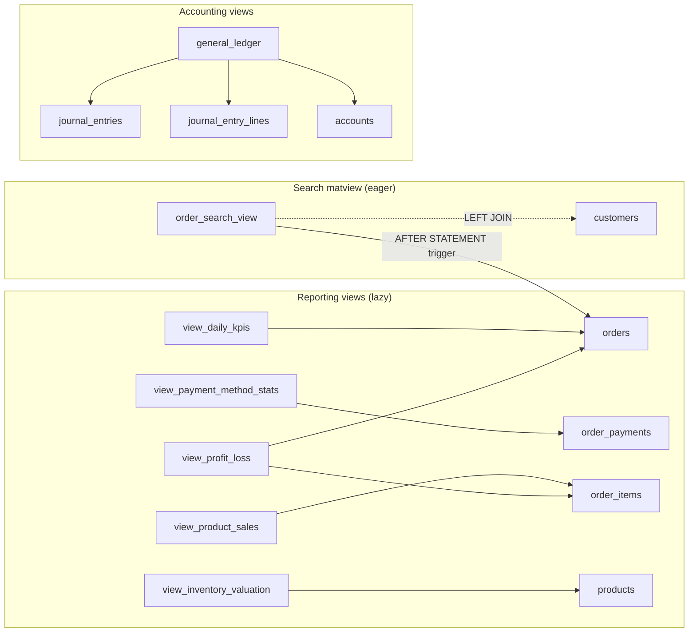

# 05 — Views & Materialized Views

> **Last verified**: 2026-05-03
> **Source migrations**: 223 SQL files in `supabase/migrations/` (range `001_extensions_enums.sql` → `20260503002703_create_receive_purchase_order_rpc.sql`)
> **Total views surveyed (RLS audit 2026-02-22)**: 39 standard views + 1 materialized view (`order_search_view`, added 2026-05-01)

---

## 1. Overview

AppGrav V2 uses two complementary patterns for derived data:

| Pattern | Count | Purpose | Refresh |
|---------|-------|---------|---------|
| **Standard views** (`CREATE VIEW`) | ~39 | Reporting aggregations, denormalized lookups, security wrappers | On-demand (lazy) |
| **Materialized views** (`MATERIALIZED VIEW`) | **1** (`order_search_view`) | Indexed full-text search over orders × customers (Cmd+K) | Trigger-driven on `orders` writes |

All standard views were converted to `WITH (security_invoker = true)` via migration `20260212170000_fix_views_security_invoker.sql` and reinforced by `20260222030141_fix_security_definer_views.sql`. This means **the view inherits the calling user's RLS policies on the base tables** — never the view-creator's privileges. See `06-rls-policies.md` for implications.



---

## 2. Materialized views

### 2.1 `order_search_view`

| Field | Value |
|-------|-------|
| **Type** | MATERIALIZED VIEW |
| **Migration** | `20260501000000_create_order_search_view.sql` |
| **Story** | epic-016b 016b-001 |
| **Refresh policy** | `AFTER INSERT OR UPDATE OR DELETE ON orders FOR EACH STATEMENT` → `REFRESH MATERIALIZED VIEW CONCURRENTLY` |
| **Refresh function** | `public.refresh_order_search_view()` (SECURITY DEFINER, search_path=public,pg_catalog) |
| **Trigger** | `orders_search_refresh_trigger` |
| **Privileges** | `GRANT SELECT TO authenticated, service_role` (NO anon; matview cannot host RLS) |
| **PII** | `customer_email`, `customer_phone` exposed — staff-only via GRANT |
| **Indexes** | `order_search_view_pkey` (UNIQUE on `order_id` — prereq for CONCURRENTLY); `order_search_view_idx_created_desc`; `order_search_view_idx_customer` (partial WHERE customer_id IS NOT NULL); `order_search_view_idx_search_gin` (GIN trigram on `order_number || customer_name || customer_email`) |
| **Extensions** | `pg_trgm` (created via `CREATE EXTENSION IF NOT EXISTS pg_trgm WITH SCHEMA public`) |

**Query (summary)**:

```sql
SELECT
    o.id AS order_id, o.order_number, o.customer_id,
    COALESCE(o.customer_name, c.name) AS customer_name,
    c.email, c.phone,
    o.total, o.payment_method::TEXT, o.status::TEXT,
    o.created_at, o.completed_at
FROM public.orders o
LEFT JOIN public.customers c ON c.id = o.customer_id;
```

**Consumers**: `<GlobalSearchCmdK>` component (BackOffice topbar), `useGlobalSearch` hook. Target SLO: p95 < 10s on 73K rows.

**Pitfall**: `cmdk`'s `<Command>` defaults `shouldFilter={true}` — this matview drives results server-side via Supabase, so the consumer must pass `shouldFilter={false}`. See `CLAUDE.md` Pitfalls.

**Fallback strategy**: If 016b-003 charge test measures p95 write > 50 ms in staging, fallback to `pg_cron` 5-min refresh (documented but not implemented as of 2026-05-03).

---

## 3. Reporting views (Class 1 — Sales/POS)

All views below are defined in `013_views_reporting.sql` and progressively patched by 9+ subsequent migrations. The query below summarises the **current** definition after the latest patch (`20260414100100_fix_views_timezone_wita.sql` for `view_daily_kpis`, `view_hourly_sales`, `view_order_type_distribution`, `view_payment_method_stats`, `view_profit_loss`, `view_sales_by_hour`).

### 3.1 `view_daily_kpis`

| Field | Value |
|-------|-------|
| Type | VIEW |
| Latest migration | `20260414100100_fix_views_timezone_wita.sql` |
| Predecessors | `013_views_reporting.sql` → `20260212150000_fix_split_payment_views.sql` → `20260321170000_fix_audit_trigger_and_daily_kpis.sql` → `20260330100000_fix_reporting_views_remove_hardcoded_dates.sql` → `20260330700000_fix_daily_kpis_restore_items_sold.sql` → `20260406100000_fix_payment_method_stats_use_order_payments.sql` |
| Sources | `orders` (filtered `created_at >= NOW() - INTERVAL '90 days'`) + `order_payments` (split payment aggregation, since 2026-02-12) + `order_items` (items_sold restore, 2026-03-30) |
| Output | `report_date`, `total_orders`, `completed_orders`, `cancelled_orders`, `total_revenue`, `total_discounts`, `total_tax`, `avg_order_value`, `unique_customers`, `cash_sales`, `card_sales`, `qris_sales`, `edc_sales`, `items_sold` |
| Timezone | All `DATE(o.created_at)` casts now use `AT TIME ZONE 'Asia/Makassar'` (WITA) — fixed 2026-04-14 |
| Hooks | `useDailyKpis`, dashboard tile in `/reports` |
| Reports | Sales Dashboard, Daily Sales Summary |

### 3.2 `view_hourly_sales` / `view_sales_by_hour`

| Field | Value |
|-------|-------|
| Type | VIEW |
| Migration | `013_views_reporting.sql` (hourly_sales), `20260206120000_create_missing_report_views.sql` (sales_by_hour), `20260414100100_fix_views_timezone_wita.sql` (timezone fix) |
| Sources | `orders WHERE payment_status = 'paid' AND created_at >= NOW() - INTERVAL '90 days'` |
| Output | `sale_date`/`report_date`, `hour_of_day`, `order_count`, `total_sales`/`total_revenue`, `avg_order_value` |
| Reports | Hourly Sales Heatmap, Peak Hours Report |

> **Note** — `view_hourly_sales` and `view_sales_by_hour` are near-duplicates kept for backward compatibility with old report consumers. The newer `_sales_by_hour` exposes a stable schema that matches `ISalesByHourReport`.

### 3.3 `view_payment_method_stats`

| Field | Value |
|-------|-------|
| Type | VIEW |
| Migration | `013_views_reporting.sql` → `20260212150000_fix_split_payment_views.sql` → `20260406100000_fix_payment_method_stats_use_order_payments.sql` (now uses `order_payments`, not `orders.payment_method`) |
| Sources | `order_payments` JOIN `orders` (filtered last 30 days, status=completed) |
| Output | `report_date`, `payment_method`, `transaction_count`, `total_amount`, `avg_amount` |
| Reports | Payment Mix Report, Daily Payment Breakdown |

### 3.4 `view_product_sales`

| Field | Value |
|-------|-------|
| Type | VIEW |
| Migration | `013_views_reporting.sql` → `20260210110006_db011_order_items_quantity_decimal.sql` (decimal qty) → `20260330100000_fix_reporting_views_remove_hardcoded_dates.sql` |
| Sources | `order_items` JOIN `products` JOIN `categories` JOIN `orders WHERE payment_status='paid' AND created_at >= NOW() - INTERVAL '30 days'` |
| Output | `product_id`, `sku`, `product_name`, `category_name`, `order_count`, `total_quantity`, `total_revenue`, `avg_unit_price`, `current_price`, `cost_price`, `gross_profit` |
| Reports | Product Performance, Top/Bottom Sellers, Margin Analysis |

### 3.5 `view_category_sales`

| Field | Value |
|-------|-------|
| Type | VIEW |
| Migration | `013_views_reporting.sql` → `20260210110006_db011_order_items_quantity_decimal.sql` → `20260330100000_fix_reporting_views_remove_hardcoded_dates.sql` |
| Sources | `categories` LEFT JOIN `products` LEFT JOIN `order_items` LEFT JOIN `orders` (last 30 days, paid) |
| Output | `category_id`, `category_name`, `icon`, `color`, `order_count`, `items_sold`, `total_revenue`, `avg_item_value` |
| Reports | Category Mix, Category Margin |

### 3.6 `view_order_type_distribution`

| Field | Value |
|-------|-------|
| Type | VIEW |
| Migration | `013_views_reporting.sql` → `20260330100000_fix_reporting_views_remove_hardcoded_dates.sql` → `20260414100100_fix_views_timezone_wita.sql` |
| Sources | `orders WHERE payment_status='paid' AND created_at >= NOW() - INTERVAL '30 days'` |
| Output | `report_date`, `order_type` (dine_in/takeaway/delivery/b2b), `order_count`, `total_revenue`, `avg_order_value` |
| Reports | Channel Mix Report |

### 3.7 `view_staff_performance`

| Field | Value |
|-------|-------|
| Type | VIEW |
| Migration | `013_views_reporting.sql` → `20260330100000_fix_reporting_views_remove_hardcoded_dates.sql` |
| Sources | `user_profiles` LEFT JOIN `orders ON staff_id = up.id AND created_at >= NOW() - INTERVAL '30 days'` |
| Output | `staff_id`, `staff_name`, `role`, `orders_processed`, `total_sales`, `avg_order_value`, `cancelled_orders`, `total_discounts_given` |
| Reports | Staff Leaderboard, Cashier Comparison |

---

## 4. Reporting views (Class 2 — Profit & Loss / Financial)

### 4.1 `view_profit_loss`

| Field | Value |
|-------|-------|
| Type | VIEW |
| Migration | `20260206120000_create_missing_report_views.sql` → `20260210110006_db011_order_items_quantity_decimal.sql` → `20260414100100_fix_views_timezone_wita.sql` |
| Sources | `orders` LEFT JOIN aggregated `(order_items + products.cost_price)` (subquery) |
| Output | `report_date`, `order_count`, `gross_revenue`, `tax_collected`, `total_discounts`, `cogs`, `gross_profit`, `margin_percentage` |
| Filter | `payment_status='paid' AND created_at >= NOW() - INTERVAL '90 days'` |
| Reports | P&L Daily, Margin Trend |

### 4.2 `general_ledger` (accounting)

| Field | Value |
|-------|-------|
| Type | VIEW (security_invoker) |
| Migration | `20260430010000_add_accounting_constraints_and_views.sql` |
| Sources | `journal_entries je JOIN journal_entry_lines jel JOIN accounts a` |
| Filter | `WHERE je.status IN ('posted', 'locked', 'reversed')` — excludes drafts |
| Output | `je_id`, `entry_number`, `entry_date`, `je_description`, `reference_type`, `reference_id`, `status`, `je_created_at`, `created_by`, `line_id`, `account_id`, `account_code`, `account_name`, `account_type`, `account_class`, `balance_type`, `debit`, `credit`, `line_description`, `net_movement` |
| Hooks | `useGeneralLedger`, RPC consumers (`get_trial_balance`, `get_profit_loss_statement`, `get_balance_sheet`) |
| Reports | General Ledger, Trial Balance, P&L Statement, Balance Sheet |

### 4.3 `view_session_summary`

| Field | Value |
|-------|-------|
| Type | VIEW |
| Migration | `013_views_reporting.sql` → `20260320111245_fix_cost_propagation.sql` |
| Sources | `pos_sessions ps LEFT JOIN user_profiles up_open LEFT JOIN user_profiles up_close` |
| Output | `session_id`, `session_number`, `opened_at`, `closed_at`, `status`, `opened_by_name`, `closed_by_name`, `opening_cash`, `closing_cash`, `total_orders`, `total_cash_sales`, `total_card_sales`, `total_qris_sales`, `total_discounts`, `total_refunds`, `total_sales`, `expected_cash`, `cash_difference`, `difference_reason` |
| Reports | Cashier Session Reports, End-of-day Z-report |

### 4.4 `view_session_cash_balance`

| Field | Value |
|-------|-------|
| Type | VIEW |
| Migration | `20260206120000_create_missing_report_views.sql` |
| Sources | `pos_sessions ps LEFT JOIN user_profiles up ON ps.opened_by = up.id` |
| Output | Matches `ISessionCashBalanceReport` interface (terminal_id, cashier_name, opening/closing/expected/difference cash, totals, status) |
| Reports | Cash Balance Audit Report |

---

## 5. Reporting views (Class 3 — Inventory)

### 5.1 `view_inventory_valuation`

| Field | Value |
|-------|-------|
| Type | VIEW |
| Migration | `013_views_reporting.sql` → `20260218170000_create_product_types.sql` (added product_type) → `20260320111245_fix_cost_propagation.sql` |
| Sources | `products LEFT JOIN categories WHERE is_active = TRUE` |
| Output | `product_id`, `sku`, `name`, `product_type`, `category_name`, `current_stock`, `unit`, `cost_price`, `retail_price`, `stock_value_cost`, `stock_value_retail`, `min_stock_level`, `stock_status` (in_stock/low_stock/out_of_stock) |
| Reports | Stock Valuation, Inventory Worth |

### 5.2 `view_stock_alerts`

| Field | Value |
|-------|-------|
| Type | VIEW |
| Migration | `013_views_reporting.sql` |
| Sources | `products LEFT JOIN categories WHERE is_active=TRUE AND current_stock < min_stock_level` |
| Output | `product_id`, `sku`, `product_name`, `category_name`, `current_stock`, `min_stock_level`, `unit`, `quantity_needed`, `alert_level` (critical/warning/low) |
| Reports | Stock Alert Dashboard, Reorder Suggestions |

### 5.3 `view_stock_warning`

| Field | Value |
|-------|-------|
| Type | VIEW |
| Migration | `20260206120000_create_missing_report_views.sql` |
| Sources | `products LEFT JOIN categories WHERE is_active=TRUE` |
| Output | Aligned with `IStockWarningReport`: `stock_percentage`, `alert_level` (out_of_stock/critical/warning/ok), `suggested_reorder`, `value_at_risk` |
| Reports | Stock Warning Report |

### 5.4 `view_expired_stock`

| Field | Value |
|-------|-------|
| Type | VIEW |
| Migration | `20260206120000_create_missing_report_views.sql` |
| Sources | `products JOIN (SELECT DISTINCT ON (product_id) ... FROM stock_movements WHERE expiry_date IS NOT NULL ORDER BY product_id, expiry_date ASC) nearest_expiry` |
| Output | `expiry_date`, `days_until_expiry`, `expiry_status` (expired/expiring_soon/expiring/ok), `potential_loss` |
| Reports | Expiry Tracking, FIFO Audit |

### 5.5 `view_unsold_products`

| Field | Value |
|-------|-------|
| Type | VIEW |
| Migration | `20260206120000_create_missing_report_views.sql` → `20260210110006_db011` (decimal qty) → `20260218170000_create_product_types.sql` (filter `product_type='finished'`) |
| Sources | `products LEFT JOIN categories LEFT JOIN (last_sale subquery from order_items + orders)` |
| Output | `last_sale_at`, `days_since_sale`, `total_units_sold`, `stock_value` |
| Reports | Slow-moving Items, Dead Stock Report |

### 5.6 `view_section_stock_details`

| Field | Value |
|-------|-------|
| Type | VIEW |
| Migration | `20260203110000_section_stock_model.sql` → `20260218170000_create_product_types.sql` → `20260320111245_fix_cost_propagation.sql` |
| Sources | `section_stock JOIN products JOIN sections` |
| Output | Per-section stock breakdown (POS terminals, kitchen, bakery, bar, display) |
| Reports | Section Stock Snapshot, Live Stock Page (`/pos/live-stock`) |

### 5.7 `view_section_transfers`

| Field | Value |
|-------|-------|
| Type | VIEW |
| Migration | `20260203120000_internal_transfers_sections.sql` |
| Sources | `internal_transfers JOIN transfer_items JOIN sections` |
| Output | Inter-section transfer history with section names resolved |
| Reports | Internal Transfer Log |

### 5.8 `view_stock_waste`

| Field | Value |
|-------|-------|
| Type | VIEW |
| Migration | First seen in `20260320111245_fix_cost_propagation.sql` |
| Sources | `stock_movements WHERE movement_type = 'waste'` |
| Reports | Waste Report, COGS Reconciliation |

### 5.9 `view_production_summary`

| Field | Value |
|-------|-------|
| Type | VIEW |
| Migration | `013_views_reporting.sql` → `20260320111245_fix_cost_propagation.sql` → `20260330300000_p2_fix_production_view.sql` |
| Sources | `production_records pr JOIN products p LEFT JOIN sections s` |
| Filter | `production_date >= NOW() - INTERVAL '30 days'` |
| Output | `production_date`, `product_id`, `product_name`, `section_name`, `total_produced`, `total_waste`, `production_batches` |
| Reports | Production Summary, Yield/Waste Analytics |

---

## 6. Reporting views (Class 4 — Customer / B2B)

### 6.1 `view_customer_insights`

| Field | Value |
|-------|-------|
| Type | VIEW |
| Migration | `013_views_reporting.sql` → `20260320111245_fix_cost_propagation.sql` |
| Sources | `customers c LEFT JOIN customer_categories cc WHERE c.is_active = TRUE` |
| Output | Loyalty tier, lifetime points, total visits/spent, avg order value, days_since_last_visit |
| Reports | Customer 360, Top Spenders, Lapsing Customers |

### 6.2 `view_sales_by_customer`

| Field | Value |
|-------|-------|
| Type | VIEW |
| Migration | `20260206120000_create_missing_report_views.sql` |
| Sources | `customers LEFT JOIN customer_categories LEFT JOIN orders WHERE payment_status='paid'` |
| Output | Aligned with `ISalesByCustomerReport`: order_count, total_spent, avg_basket, first_order_at, last_order_at, days_since_last_order |
| Reports | Sales by Customer Report, B2B Customer Activity |

### 6.3 `view_b2b_performance`

| Field | Value |
|-------|-------|
| Type | VIEW |
| Migration | `013_views_reporting.sql` → `20260320111245_fix_cost_propagation.sql` |
| Sources | `customers c JOIN b2b_orders bo WHERE c.customer_type = 'wholesale'` |
| Output | `customer_id`, `customer_name`, `company_name`, `total_orders`, `total_revenue`, `avg_order_value`, `total_paid`, `total_outstanding`, `last_order_date` |
| Reports | B2B Performance Dashboard |

### 6.4 `view_b2b_receivables`

| Field | Value |
|-------|-------|
| Type | VIEW |
| Migration | `20260206120000_create_missing_report_views.sql` → `20260320111245_fix_cost_propagation.sql` |
| Sources | `customers c LEFT JOIN b2b_orders bo WHERE c.customer_type='wholesale' AND c.is_active=TRUE` |
| Output | `credit_limit`, `credit_balance`, `outstanding_amount`, `unpaid_order_count`, `oldest_unpaid_at`, `days_overdue` |
| Reports | B2B AR Aging Report, Collections Dashboard |

---

## 7. Reporting views (Class 5 — KDS, POS Outstanding)

### 7.1 `view_kds_queue_status`

| Field | Value |
|-------|-------|
| Type | VIEW |
| Migration | `013_views_reporting.sql` |
| Sources | `kds_order_queue WHERE status IN ('pending','preparing')` |
| Output | `station_type`, `status`, `order_count`, `avg_wait_seconds` |
| Hooks | `useKdsQueueStatus`, KDS dashboard tile |

### 7.2 `view_pos_outstanding` and `view_pos_outstanding_history`

| Field | Value |
|-------|-------|
| Type | VIEW |
| Migration | `20260407200000_pos_outstanding.sql` |
| Sources | `orders o LEFT JOIN customers c LEFT JOIN order_payments paid` |
| Output | Open POS tickets with unpaid balance, customer credit limit, payment history |
| Hooks | `usePosOutstanding`, used by `/pos` outstanding tab |

---

## 8. Security & utility views

### 8.1 `active_products` (and `v_products`)

| Field | Value |
|-------|-------|
| Type | VIEW |
| Migration | `016_integrity_fixes.sql` → `20260218170000_create_product_types.sql` → `20260320111245_fix_cost_propagation.sql` |
| Source | `products WHERE deleted_at IS NULL AND is_active = TRUE` |
| Purpose | Convenience filter for "live catalog only"; used by POS and customer display |

### 8.2 `user_profiles_safe`

| Field | Value |
|-------|-------|
| Type | VIEW |
| Migration | `016_integrity_fixes.sql` |
| Source | `user_profiles` projecting only safe columns (id, auth_user_id, name, first_name, …) — excludes `pin_code`, `password_hash`, etc. |
| Purpose | Realtime-safe projection for client-side subscriptions |

### 8.3 `purchase_order_items` (compatibility view)

| Field | Value |
|-------|-------|
| Type | VIEW |
| Migration | `20260204100000_fix_missing_functions_and_views.sql` |
| Source | Wraps the canonical `po_items` table for legacy frontend code expecting `purchase_order_items` |
| Status | Legacy — new code should query the underlying table directly |

---

## 9. View security model

All views (after `20260212170000_fix_views_security_invoker.sql` + `20260222030141_fix_security_definer_views.sql`) carry `WITH (security_invoker = true)`. This means:

1. The view query runs **with the calling user's RLS** on the base tables.
2. If the calling user has no SELECT policy on `orders`, querying `view_daily_kpis` returns 0 rows (not a permission error).
3. Views joining tables with mixed RLS policies (e.g. `view_b2b_receivables` joins `customers` and `b2b_orders`) require SELECT on **both** tables.

Implications for the audit findings (see `06-rls-policies.md` §W4):
- Views like `view_session_summary`, `view_profit_loss` were flagged as W4 because they joined tables with `anon SELECT` policies — those anon SELECT policies have since been removed (migrations `20260222025719`, `20260222025747`, etc.).
- Matview `order_search_view` is the **only** exception: Postgres does not support RLS on matviews, so PII protection relies on the GRANT SELECT being limited to `authenticated, service_role`.

---

## 10. Refresh strategy summary

| Object | Strategy | Latency | Cost |
|--------|----------|---------|------|
| Standard views | Lazy (on each query) | Real-time but slow on large joins | None at write time |
| `order_search_view` | AFTER STATEMENT trigger → REFRESH CONCURRENTLY | < 1 s after order mutation | One full matview rebuild per write batch |
| `view_daily_kpis` | Lazy + 90-day rolling window in WHERE | Filtered to recent data, fast enough | None |

---

## 11. Migration sequence cheat-sheet

When updating any view:
1. Always issue `CREATE OR REPLACE VIEW` (not `DROP/CREATE`) — preserves dependent privileges.
2. If renaming columns, prepare clients first (downstream hooks).
3. After altering, run `/gen-types` to refresh `database.generated.ts`.
4. For matview index changes, you must `DROP MATERIALIZED VIEW` (cannot ALTER) — coordinate downtime.
5. For timezone fixes, always use `AT TIME ZONE 'Asia/Makassar'` (precedent: `20260414100100_fix_views_timezone_wita.sql`).

---

## 12. Cross-references

- `06-rls-policies.md` — RLS implications of `security_invoker` views
- `07-migrations-history.md` — chronological context for view churn
- [../04-modules/14-reports-analytics.md](../04-modules/14-reports-analytics.md) — which view powers which report
- 2026-02-22 RLS audit §W4 (pre-fix state of view security, now consolidated in [06-rls-policies.md](./06-rls-policies.md))
