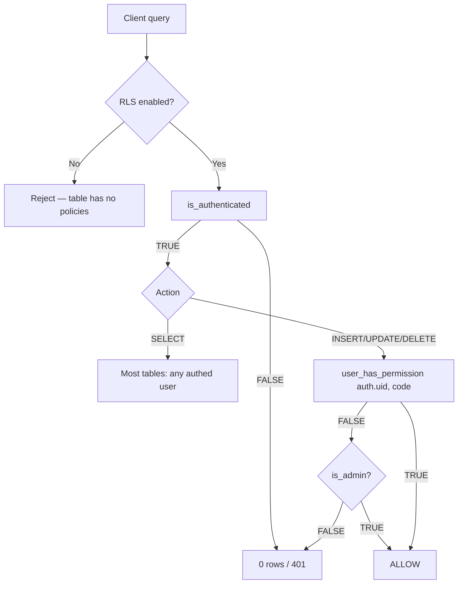

# 06 — Row-Level Security (RLS) Policies

> **Last verified**: 2026-05-03
> **Source**: 2026-02-22 RLS audit (consolidated into this doc) + 52 migrations matching `CREATE POLICY` (latest: `20260413100100_create_ghost_tables_with_rls.sql`)
> **Total tables under RLS**: 61 (100 % coverage as of audit)
> **Total policies (post-audit)**: 241 (SELECT 78, INSERT 55, UPDATE 53, DELETE 50, ALL 5)

---

## 1. Doctrine

Every public-schema table in AppGrav V2 has RLS enabled. Authorization is enforced through three layers:

1. **`is_authenticated()`** — fast filter "user has a session".
2. **`user_has_permission(uid, code)`** — RBAC check against the `permissions` / `role_permissions` join.
3. **`is_admin(uid)`** — escape hatch for SUPER_ADMIN/ADMIN role overrides.

These three helpers are `STABLE SECURITY DEFINER SET search_path = ''` (or `= public`) — Postgres caches the result within the transaction, so a single request that hits 5 tables only evaluates `auth.uid()` once.



---

## 2. SQL helpers (canonical definitions)

### 2.1 `is_authenticated()`

Defined in `20260316100000_rls_performance_optimization.sql` (RLS perf optimization, 2026-03-16):

```sql
CREATE OR REPLACE FUNCTION public.is_authenticated()
RETURNS BOOLEAN
LANGUAGE sql
STABLE
SECURITY DEFINER
SET search_path = public
AS $$
  SELECT (auth.uid() IS NOT NULL)
$$;

GRANT EXECUTE ON FUNCTION public.is_authenticated() TO authenticated;
GRANT EXECUTE ON FUNCTION public.is_authenticated() TO anon;
```

**Why `STABLE`**: Postgres caches the result within a single transaction. Without this, every row evaluation re-calls `auth.uid()` (which itself reads from a GUC). Measured impact: ~30 % faster on queries returning 1k+ rows.

**Why `SECURITY DEFINER`**: bypasses RLS on `auth.users`, avoiding recursive policy evaluation. Combined with `SET search_path = public`, prevents schema-hijack attacks.

### 2.2 `user_has_permission(uid, code)`

Latest definition: `20260222035028_fix_user_has_permission_volatile_to_stable.sql` (made STABLE for perf):

```sql
CREATE OR REPLACE FUNCTION public.user_has_permission(p_user_id UUID, p_permission_code VARCHAR)
RETURNS BOOLEAN LANGUAGE plpgsql SECURITY DEFINER STABLE
SET search_path TO ''
AS $$
DECLARE
  v_has_permission BOOLEAN := FALSE;
  v_direct_override BOOLEAN := NULL;
  v_profile_id UUID;
BEGIN
  -- Dual-lookup: accepts both auth.uid() and user_profiles.id
  SELECT id INTO v_profile_id
  FROM public.user_profiles
  WHERE id = p_user_id OR auth_user_id = p_user_id
  LIMIT 1;

  IF v_profile_id IS NULL THEN RETURN FALSE; END IF;

  -- Per-user grant/revoke override
  SELECT is_granted INTO v_direct_override
  FROM public.user_permissions up
  JOIN public.permissions p ON up.permission_id = p.id
  WHERE up.user_id = v_profile_id
    AND p.code = p_permission_code
    AND (up.valid_from IS NULL OR up.valid_from <= NOW())
    AND (up.valid_until IS NULL OR up.valid_until > NOW());

  IF v_direct_override IS NOT NULL THEN RETURN v_direct_override; END IF;

  -- Role-based fallback
  RETURN EXISTS (
    SELECT 1
    FROM public.user_roles ur
    JOIN public.role_permissions rp ON ur.role_id = rp.role_id
    JOIN public.permissions p ON rp.permission_id = p.id
    WHERE ur.user_id = v_profile_id
      AND p.code = p_permission_code
      AND (ur.valid_from IS NULL OR ur.valid_from <= NOW())
      AND (ur.valid_until IS NULL OR ur.valid_until > NOW())
  );
END;
$$;
```

**Why dual-lookup** (`id = p_user_id OR auth_user_id = p_user_id`): historically V1 users had `user_profiles.id = auth.uid()`; V2 users created via `auth.signUp()` have separate IDs. Without this clause, V2 users return FALSE for every permission check (cf. RLS audit C1).

### 2.3 `is_admin(uid)`

Patched via `20260216200000_fix_permission_functions_searchpath.sql` and `20260222025651_fix_get_user_hierarchy_level_dual_lookup.sql`:

```sql
CREATE OR REPLACE FUNCTION public.is_admin(p_user_id UUID)
RETURNS BOOLEAN AS $$
BEGIN
    RETURN EXISTS (
        SELECT 1 FROM public.user_roles ur
        JOIN public.roles r ON ur.role_id = r.id
        WHERE ur.user_id = p_user_id
        AND r.code IN ('SUPER_ADMIN', 'ADMIN')
        AND (ur.valid_from IS NULL OR ur.valid_from <= NOW())
        AND (ur.valid_until IS NULL OR ur.valid_until > NOW())
    );
END;
$$ LANGUAGE plpgsql SECURITY DEFINER STABLE SET search_path = '';
```

> **Pitfall fixed in 2026-02-22**: `is_admin` originally relied on `get_user_hierarchy_level(p_user_id)` which assumed `user_roles.user_id = auth.uid()`. After the dual-lookup fix in `get_user_hierarchy_level`, both functions resolve correctly for V1 and V2 users alike.

---

## 3. Canonical pattern for a new table

```sql
-- 1. Create table (snake_case plural, UUID PK, audit columns)
CREATE TABLE IF NOT EXISTS public.example_widgets (
    id          UUID PRIMARY KEY DEFAULT gen_random_uuid(),
    name        VARCHAR(255) NOT NULL,
    created_by  UUID REFERENCES auth.users(id) ON DELETE SET NULL,
    created_at  TIMESTAMPTZ NOT NULL DEFAULT NOW(),
    updated_at  TIMESTAMPTZ NOT NULL DEFAULT NOW(),
    deleted_at  TIMESTAMPTZ
);

-- 2. Enable RLS (mandatory)
ALTER TABLE public.example_widgets ENABLE ROW LEVEL SECURITY;

-- 3. SELECT policy — usually any authed user
CREATE POLICY "Authenticated read"
  ON public.example_widgets
  FOR SELECT
  USING (public.is_authenticated());

-- 4. INSERT/UPDATE/DELETE policies — permission-based
CREATE POLICY "Permission-based insert"
  ON public.example_widgets
  FOR INSERT
  WITH CHECK (public.user_has_permission(auth.uid(), 'widgets.create'));

CREATE POLICY "Permission-based update"
  ON public.example_widgets
  FOR UPDATE
  USING (public.user_has_permission(auth.uid(), 'widgets.update'));

CREATE POLICY "Permission-based delete"
  ON public.example_widgets
  FOR DELETE
  USING (public.user_has_permission(auth.uid(), 'widgets.delete'));

-- 5. GRANTs (RLS narrows; GRANT widens)
GRANT SELECT, INSERT, UPDATE, DELETE ON public.example_widgets TO authenticated;
GRANT ALL ON public.example_widgets TO service_role;
```

Use the `/create-migration` skill to scaffold this pattern automatically.

---

## 4. Policy matrix — critical tables

Snapshot from `RLS_AUDIT_REPORT.md` Annex (2026-02-22) merged with subsequent migrations. `auth` = `is_authenticated()` shorthand. `permission` columns name the `user_has_permission(...)` code; `admin` = `is_admin(auth.uid())`.

### 4.1 Sales / POS

| Table | SELECT | INSERT | UPDATE | DELETE |
|-------|--------|--------|--------|--------|
| `orders` | auth | sales.create | sales.create | admin |
| `order_items` | auth | sales.create | sales.create | admin |
| `order_payments` | auth | sales.create | admin | admin |
| `order_payment_items` | auth | auth | — | — |
| `order_activity_log` | auth | auth | — | — |
| `pos_sessions` | auth | pos.open_session | pos.open / close_session | admin |
| `pos_terminals` | auth | auth | auth | auth (since 2026-02-22 M6 fix) |
| `idempotency_keys` | auth | auth | — | — |

### 4.2 Catalog

| Table | SELECT | INSERT | UPDATE | DELETE |
|-------|--------|--------|--------|--------|
| `products` | auth + anon | products.create | products.update | products.delete |
| `categories` | auth + anon | products.create | products.update | products.delete |
| `recipes` | auth | products.create | products.update | products.delete |
| `product_modifiers` | auth + anon | products.create | products.update | products.delete |
| `product_combos` | auth + anon | products.create | products.update | admin |
| `product_combo_groups` | auth + anon | products.create | products.update | products.update |
| `product_combo_group_items` | auth + anon | products.create | products.update | products.update |
| `product_uoms` | auth + anon | products.create | products.update | products.delete |
| `product_category_prices` | auth | products.pricing | products.pricing | products.pricing |
| `product_price_history` | auth | products.pricing | products.pricing | — (immutable) |
| `product_types` | auth | settings.update | settings.update | settings.update |
| `product_sections` | auth | settings.update | settings.update | settings.update |
| `categories` (anon) | yes — customer display | — | — | — |

### 4.3 Inventory & Production

| Table | SELECT | INSERT | UPDATE | DELETE |
|-------|--------|--------|--------|--------|
| `stock_movements` | auth | inventory.adjust | inventory.adjust (post 2026-02-22) | — (audit-trail; immutable by design) |
| `stock_locations` | auth | inventory.create | inventory.update | admin |
| `internal_transfers` | auth | inventory.transfer | inventory.transfer | admin |
| `transfer_items` | auth | inventory.transfer | inventory.transfer | inventory.transfer |
| `inventory_counts` | auth | inventory.adjust | inventory.adjust | inventory.adjust |
| `inventory_count_items` | auth | inventory.adjust | inventory.adjust | inventory.adjust |
| `production_records` | auth | production.create | production.update | admin |
| `section_stock` | auth | settings.update | settings.update | settings.update |

### 4.4 Customers / Loyalty

| Table | SELECT | INSERT | UPDATE | DELETE |
|-------|--------|--------|--------|--------|
| `customers` | auth | customers.create | customers.update | customers.delete |
| `customer_categories` | auth + anon | customers.create | customers.update | customers.delete |
| `loyalty_tiers` | auth + anon | admin | admin | admin |
| `loyalty_transactions` | auth | customers.loyalty | customers.loyalty | customers.loyalty |

### 4.5 B2B & Purchasing

| Table | SELECT | INSERT | UPDATE | DELETE |
|-------|--------|--------|--------|--------|
| `b2b_orders` | auth | sales.create | sales.create | admin |
| `b2b_order_items` | auth | sales.create | sales.create | sales.create |
| `b2b_payments` | auth | sales.create | admin | admin |
| `b2b_deliveries` | auth | sales.create | sales.create | admin |
| `b2b_price_lists` | auth | admin | admin | admin |
| `b2b_price_list_items` | auth | admin | admin | admin |
| `b2b_order_history` | auth | auth | — | — (append-only) |
| `purchase_orders` | auth | purchasing.create | purchasing.create | purchasing.create |
| `purchase_order_items` (table) | auth | purchasing.create | purchasing.create | purchasing.create |
| `purchase_order_returns` | auth | purchasing.receive | purchasing.receive | admin |
| `purchase_order_history` | auth | auth | — | — (append-only) |
| `suppliers` | auth | purchasing.create | purchasing.create | admin |

### 4.6 Accounting

Defined in `20260323100200_create_accounting_tables.sql`:

| Table | SELECT | INSERT | UPDATE | DELETE |
|-------|--------|--------|--------|--------|
| `accounts` | auth | accounting.manage | accounting.manage | accounting.manage |
| `journal_entries` | auth | accounting.journal.create | accounting.journal.update | — |
| `journal_entry_lines` | auth | accounting.journal.create | accounting.journal.update | accounting.journal.update |
| `accounting_mappings` | auth | accounting.manage | accounting.manage | accounting.manage |
| `vat_filings` | auth | accounting.vat.manage | accounting.vat.manage | — |
| `fiscal_periods` | auth | accounting.manage | accounting.manage | — |

### 4.7 Expenses

| Table | SELECT | INSERT | UPDATE | DELETE |
|-------|--------|--------|--------|--------|
| `expenses` | auth | expenses.create | expenses.update | expenses.delete |
| `expense_categories` | auth | expenses.categories | expenses.categories | expenses.categories |
| `expense_payments` | auth | expenses.create | admin | admin |

### 4.8 Auth / RBAC

| Table | SELECT | INSERT | UPDATE | DELETE |
|-------|--------|--------|--------|--------|
| `user_profiles` | auth + anon (login filter) | admin | admin / self | — (soft delete via `deleted_at`) |
| `user_roles` | auth | users.roles | users.roles | users.roles |
| `user_permissions` | auth | owner | owner | owner |
| `user_sessions` | admin or self | self | admin or self | admin (post 2026-02-22) |
| `roles` | auth | admin | admin | admin (soft delete) |
| `permissions` | auth | — | — | — (system-managed via migrations) |
| `role_permissions` | auth | users.roles | — | users.roles |
| `audit_logs` | admin or `created_by = self` | auth | — | — (immutable) |

### 4.9 Settings & Reference

| Table | SELECT | INSERT | UPDATE | DELETE |
|-------|--------|--------|--------|--------|
| `settings` | auth + anon (login config) | settings.update | settings.update | settings.update |
| `settings_categories` | auth | settings.update | settings.update | settings.update |
| `app_settings` | auth | settings.update | settings.update | settings.update |
| `business_hours` | auth | settings.update | settings.update | settings.update |
| `tax_rates` | auth | settings.update | settings.update | settings.update |
| `payment_methods` | auth | settings.update | settings.update | settings.update |
| `floor_plan_items` | auth | auth | auth | auth |
| `sections` | auth | settings.update | settings.update | settings.update |

### 4.10 Promotions

| Table | SELECT | INSERT | UPDATE | DELETE |
|-------|--------|--------|--------|--------|
| `promotions` | auth + anon | products.create | products.update | admin |
| `promotion_products` | auth + anon | products.create | products.update | products.update |
| `promotion_free_products` | auth + anon | products.create | products.update | products.update |
| `promotion_usage` | auth | sales.create | customers.loyalty | customers.loyalty |

### 4.11 LAN / Devices

| Table | SELECT | INSERT | UPDATE | DELETE |
|-------|--------|--------|--------|--------|
| `lan_nodes` | auth | auth | auth | auth |
| `lan_messages` | auth | auth | auth | auth |
| `kds_order_queue` | auth | auth | auth | auth |
| `kds_stations` | auth | settings.network | settings.network | settings.network |
| `printer_configurations` | auth | settings.network | settings.network | settings.network |
| `device_configurations` | auth | settings.network | settings.network | settings.network |
| `sync_devices` | auth | auth | auth | auth |
| `sync_conflicts` | auth | auth | auth | auth |

---

## 5. Special cases

### 5.1 Tables with anon SELECT (legitimate)

After the 2026-02-22 audit, only **14 tables** retain `anon SELECT` policies, all justified for the customer display, login page, or reference-data lookup:

`products`, `categories`, `product_combos`, `product_combo_groups`, `product_combo_group_items`, `product_modifiers`, `product_uoms`, `promotions`, `promotion_products`, `promotion_free_products`, `customer_categories`, `loyalty_tiers`, `settings`, `user_profiles` (filtered to `is_active = TRUE`).

### 5.2 Append-only / immutable tables (no UPDATE/DELETE by design)

| Table | Reason |
|-------|--------|
| `audit_logs` | Compliance — audit trail must not be alterable |
| `b2b_order_history` | Order lifecycle history |
| `purchase_order_history` | PO lifecycle history |
| `stock_movements` (DELETE only) | Accounting reconciliation depends on full movement chain |
| `permissions` | Managed by SQL migrations only (not by users) |
| `role_permissions` (UPDATE only) | INSERT/DELETE suffice for managing associations |

### 5.3 Service-role-only paths

Edge Functions hitting `service_role` keys bypass RLS entirely. Every Edge Function MUST:
- Set `verify_jwt: true` in `supabase/config.toml`
- Call `user_has_permission(auth.uid(), 'module.action')` explicitly within the function body
- Never expose `SUPABASE_SERVICE_ROLE_KEY` client-side

See [../04-modules/01-auth-permissions.md](../04-modules/01-auth-permissions.md) for Edge Function auth flow.

### 5.4 Ghost tables

Migration `20260413100100_create_ghost_tables_with_rls.sql` creates "ghost" placeholder tables that are referenced from old code paths but have RLS denying everything. Pattern: `ENABLE RLS` + no policies = deny by default.

---

## 6. Audit summary (post-correction snapshot — 2026-02-22)

| Severity | Pre-fix | Post-fix |
|----------|---------|----------|
| Critical (data leak / silent block) | 4 | **0** |
| Major (missing UPDATE/DELETE, ALL too permissive) | 6 | **0** |
| Warnings (anon SELECT excess, ref-data too open) | 5 | **1** (auth config: leaked-password protection — needs Supabase dashboard toggle) |
| Supabase Advisor issues | 13 | **1** (auth config) |

11 corrective migrations applied (all dated 2026-02-22). Full chronology in [07-migrations-history.md](./07-migrations-history.md) §Migrations Appliquees.

Subsequent audits (`20260315110000_p0_security_fixes.sql`, `20260315120000_fix_critical_rls_policies.sql`, `20260327100000_security_audit_p1_fixes.sql`, `20260413100000_security_remove_anon_write_policies.sql`) further hardened anon write paths and added missing FK indexes for RLS-evaluated joins.

---

## 7. Performance optimizations

Three major performance migrations:

1. **`20260222035048_add_rls_performance_indexes.sql`** — added 23 indexes on FKs used in policy USING/WITH CHECK clauses.
2. **`20260315130000_fix_rls_initplan_core_tables.sql`** — wrapped `auth.uid()` calls in `(SELECT auth.uid())` pattern to force initplan caching on `orders`, `order_items`, `order_payments`.
3. **`20260316100000_rls_performance_optimization.sql`** — introduced `is_authenticated()` STABLE helper; rewrote 136 policies to call it instead of inlining `auth.uid() IS NOT NULL`.

**Net effect**: typical SELECT on `orders` (RLS evaluated row-by-row) dropped from ~150ms to ~25ms on a 73K-row dataset.

---

## 8. Pitfalls

- **Always enable RLS on new tables** — Supabase will warn but not block; an exposed table is a P0 incident.
- **Never use `service_role` from the client** — bypasses RLS. Service-role belongs in Edge Functions only.
- **Edge Functions must call `user_has_permission` explicitly** — RLS is bypassed when using the service role; permission checks become the function's responsibility.
- **`is_admin(auth.uid())` requires the dual-lookup fix** (applied 2026-02-22) for V2 users — verify any custom function calling it includes the same logic.
- **Materialized views cannot host RLS** — `order_search_view` relies on `GRANT SELECT TO authenticated` only. Avoid putting PII in matviews unless GRANTs alone are acceptable.
- **`(SELECT auth.uid())` is faster than `auth.uid()`** in policies due to initplan caching — prefer the wrapped form when writing performance-critical policies on hot tables.
- **Don't drop policies during a release** — replace via `ALTER POLICY` or sequence DROP+CREATE in a transaction. A missing policy = data leak.

---

## 9. References

- 2026-02-22 RLS audit narrative — consolidated into this document (sections "Doctrine", "Migrations", "Recap")
- `docs/v2-reference/03-database/05-views-and-matviews.md` §9 — view security model interactions
- `docs/v2-reference/03-database/07-migrations-history.md` §Milestones — RLS hardening sprints
- `docs/v2-reference/03-database/08-seed-data.md` §Permissions — exhaustive permission code list
- CLAUDE.md §RLS Pattern — quick reference for new tables
- `.claude/skills/create-migration` — scaffolding skill
