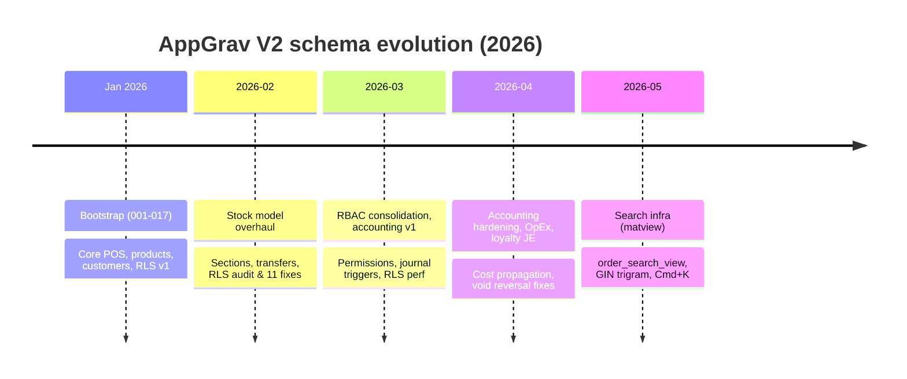

# 07 — Migrations History

> **Last verified**: 2026-05-03
> **Source**: `supabase/migrations/` directory
> **Total migrations**: **222 SQL files** (+ 1 README) — first: `001_extensions_enums.sql`, latest: `20260503002703_create_receive_purchase_order_rpc.sql`
> **Schema spans**: 17 numbered legacy migrations (`001`–`017`) + 205 timestamped migrations (`20260203…` → `20260503…`)

---

## 1. Conventions

### 1.1 File naming

Two epochs:

| Epoch | Pattern | Example | Period |
|-------|---------|---------|--------|
| **Legacy (numbered)** | `NNN_short_slug.sql` | `001_extensions_enums.sql`, `014_seed_data.sql` | Initial bootstrap (Jan 2026 — pre-CLI) |
| **Timestamped (current)** | `YYYYMMDDHHMMSS_slug.sql` | `20260322100000_create_complete_order_with_payments_rpc.sql` | All migrations from 2026-02-03 onward |

The Supabase CLI sorts files lexicographically; the timestamped form is a strict superset of the numbered form (a 14-digit prefix sorts after any 3-digit prefix), so the two epochs interleave correctly.

### 1.2 Slug guidance

- `slug` is `snake_case`, max ~60 chars
- Use a verb prefix: `create_`, `add_`, `fix_`, `remove_`, `secure_`, `seed_`, `align_`, `restore_`
- Indicate area: `add_missing_fk_indexes`, `tighten_rls_policies`
- For audit-driven fixes, prefix with severity: `p0_security_fixes`, `p1_security_reports_rpcs`, `p2_accounting_audit_fixes`

### 1.3 Iron rules

1. **Never edit an applied migration.** Once a file is in `supabase/migrations/` and pushed, treat it as immutable. Create a new dated migration to fix or extend.
2. **Always idempotent.** Use `IF NOT EXISTS`, `CREATE OR REPLACE`, `ON CONFLICT DO NOTHING`, `DROP POLICY IF EXISTS` — production sometimes runs migrations twice.
3. **Additive over destructive.** Prefer `ALTER COLUMN ADD` over `DROP COLUMN`. If you must drop, write the new state in one migration and leave a comment explaining why.
4. **Smoke tests inline.** Heavier migrations (matviews, RLS overhauls) embed `DO $$ … RAISE EXCEPTION … $$` blocks that fail loudly if a postcondition is violated. See `20260501000000_create_order_search_view.sql` for the canonical pattern (TEST 1–7).
5. **Trigger functions** (returning `TRIGGER`) cannot be invoked standalone — verify via `SELECT 1 FROM pg_proc WHERE proname='<fn>'`, not `PERFORM <fn>()`. (CLAUDE.md pitfall §epic-016b 016b-001 §15.4.)
6. **Matview privileges** — use `has_table_privilege('<role>', '<schema>.<matview>', 'SELECT')`, NOT `information_schema.role_table_grants` (which doesn't enumerate matview privileges).

---

## 2. Milestone timeline



### 2.1 Phase 1 — Bootstrap (`001`–`017`, January 2026)

The "consolidated schema" — 17 numbered SQL files, each scoped to one functional area.

| File | Theme |
|------|-------|
| `001_extensions_enums.sql` | `pgcrypto`, `uuid-ossp`; all base ENUMs (TOrderStatus, TPaymentStatus, TOrderType, TMovementType, …) |
| `002_core_products.sql` | `categories`, `products`, `product_uoms`, `recipes` |
| `003_customers_loyalty.sql` | `customers`, `customer_categories`, `loyalty_tiers`, `loyalty_transactions` |
| `004_sales_orders.sql` | `orders`, `order_items`, `order_payments`, `pos_sessions`, `pos_terminals` |
| `005_inventory_stock.sql` | `stock_movements`, `stock_locations`, `inventory_counts`, `internal_transfers` |
| `006_combos_promotions.sql` | `product_combos`, `promotions`, `promotion_products`, `promotion_usage` |
| `007_b2b_wholesale.sql` | `b2b_orders`, `b2b_payments`, `b2b_deliveries`, `b2b_price_lists` |
| `008_users_permissions.sql` | `roles`, `permissions`, `user_roles`, `user_permissions`, `user_profiles`, `audit_logs` |
| `009_system_settings.sql` | `settings`, `settings_categories`, `tax_rates`, `payment_methods`, `business_hours` |
| `010_lan_sync_display.sql` | `lan_nodes`, `lan_messages`, `kds_order_queue`, `sync_devices` |
| `011_functions_triggers.sql` | First `user_has_permission`, `is_admin`, journal triggers v1, `add_loyalty_points`, `redeem_loyalty_points` |
| `012_rls_policies.sql` | Initial RLS bulk-enable (215 policies) |
| `013_views_reporting.sql` | First 14 reporting views |
| `014_seed_data.sql` | Default sections, roles, permissions, loyalty tiers, customer categories, tax rates, payment methods, business hours |
| `015_security_fixes.sql` | Early RLS hardening |
| `016_integrity_fixes.sql` | FK constraints, `active_products`, `user_profiles_safe` views |
| `017_add_missing_fk.sql` | Late-discovered FK additions |

### 2.2 Phase 2 — Section stock & remote sync (Feb 2026)

| Date | Migration | Significance |
|------|-----------|--------------|
| 2026-02-03 | `20260203100000_import_recipes.sql` … `20260203120000_internal_transfers_sections.sql` | Section-level stock model added; recipes imported |
| 2026-02-04 | `20260204100000_fix_missing_functions_and_views.sql` … | Patch wave after live test |
| 2026-02-05 | `20260205070000_add_missing_shift_lan_functions.sql` … | LAN/shift function gaps |
| 2026-02-06–08 | `remote_schema.sql` (×3) | Initial Supabase pull from production |
| 2026-02-10 | `20260210100000_remove_plaintext_pin.sql` … `20260210110006_db011_order_items_quantity_decimal.sql` | DB-* security & data-integrity batch (DB001–DB014) |
| 2026-02-12 | `20260212170000_fix_views_security_invoker.sql` | All 39 views switched to `security_invoker = true` |

### 2.3 Phase 3 — RBAC, accounting v1 (March 2026)

| Date | Migration | Significance |
|------|-----------|--------------|
| 2026-02-22 | `20260222025651` … `20260222035048` (11 migrations) | **RLS audit corrective wave** — see `RLS_AUDIT_REPORT.md`. Critical/major/warning issues all closed. |
| 2026-03-15 | `20260315110000_p0_security_fixes.sql` | Added accounting permissions (accounting.view, .manage, .journal.create/.update, .vat.manage, expenses.*, admin.roles, .permissions, .audit) |
| 2026-03-15 | `20260315120000_fix_critical_rls_policies.sql` + `20260315130000_fix_rls_initplan_core_tables.sql` | Wrapped `auth.uid()` calls in `(SELECT auth.uid())` for initplan caching |
| 2026-03-16 | `20260316100000_rls_performance_optimization.sql` | Introduced `is_authenticated()` STABLE helper; rewrote 136 policies |
| 2026-03-22 | `20260322100000_create_complete_order_with_payments_rpc.sql` | Atomic split-payment RPC (replaces createOrder + processPayment chain) |
| 2026-03-23 | `20260323100200_create_accounting_tables.sql` | `accounts`, `journal_entries`, `journal_entry_lines`, `accounting_mappings`, `vat_filings`, `fiscal_periods` (idempotent CREATE IF NOT EXISTS) |
| 2026-03-23 | `20260323130000_auth_security_hardening.sql` | Removed plaintext PIN columns, secured session tokens |

### 2.4 Phase 4 — Accounting hardening, P0/P1/P2/P3 audits (March–April 2026)

The accounting module went through 4 audit waves (`P0`–`P3`) named after their priority bucket:

| Migration | Audit findings closed |
|-----------|----------------------|
| `20260330600000_fix_accounting_p0_audit.sql` | P0-1 unbalanced discount JE; P0-2 entry-number race; P0-3 seed COA + accounting_mappings |
| `20260330600100_unify_trigger_account_codes.sql` | P1-6 unify hardcoded account codes via `resolve_mapping_account()` helper |
| `20260330600200_p2_accounting_audit_fixes.sql` | P2 audit fixes |
| `20260330600300_p3_accounting_audit_fixes.sql` | P3 audit fixes |
| `20260409180000_fix_accounting_p0_restore_unified_triggers.sql` | Re-applied unified triggers after a regression |
| `20260413200100_seed_opex_accounts.sql` | Seeded 6100–6800 OpEx sub-accounts |
| `20260413200200_add_loyalty_accounting.sql` | Added 2210 Loyalty Liability + LOYALTY_LIABILITY mapping |
| `20260413200000_fix_void_discount_reversal.sql` | Fixed void path for discounted orders |

### 2.5 Phase 5 — POS live stock, LAN/devices (March 2026)

| Migration | Purpose |
|-----------|---------|
| `20260330500000_pos_live_stock_schema.sql` + `20260330500100_pos_live_stock_rpcs.sql` + `20260330500200_pos_live_stock_triggers.sql` | Cafe live stock surface — RPCs + triggers feeding `view_section_stock_details` for `/pos/live-stock` page |
| `20260330800000_create_device_configurations.sql` | Persistent device registry (LAN hub/clients) |
| `20260414110000_add_settings_network_permission.sql` | `settings.network` permission (LAN admin gate) |

### 2.6 Phase 6 — Reporting timezone, payments incidents (April 2026)

| Migration | Purpose |
|-----------|---------|
| `20260330100000_fix_reporting_views_remove_hardcoded_dates.sql` | Removed `'2026-01-01'` literal filters; switched to `NOW() - INTERVAL` |
| `20260330700000_fix_daily_kpis_restore_items_sold.sql` | Restored `items_sold` aggregation in `view_daily_kpis` |
| `20260406100000_fix_payment_method_stats_use_order_payments.sql` | Switched payment stats source to `order_payments` (split-payment correct) |
| `20260414100100_fix_views_timezone_wita.sql` | All time-bucketed views now cast to `'Asia/Makassar'` (WITA) |
| `20260428185000_create_payment_incidents.sql` | Incident-tracking table for failed/contested payments |
| `20260428190000_settings_sync_trigger.sql` | Realtime settings broadcast trigger |
| `20260429234000_add_idempotency_to_complete_order_rpc.sql` | Idempotency keys on `complete_order_with_payments` (prevents double-charge on retry) |
| `20260430010000_add_accounting_constraints_and_views.sql` | `general_ledger` view + balanced JE constraints |
| `20260430180000_caissapp_shift_snapshots_and_close_rpc.sql` | Shift snapshots + close-shift RPC for V3 caissapp |

### 2.7 Phase 7 — Search infra (May 2026)

| Migration | Purpose |
|-----------|---------|
| `20260501000000_create_order_search_view.sql` | First (and only) materialized view: `order_search_view`. Brings GIN trigram search + AFTER STATEMENT refresh trigger. epic-016b story 016b-001. |
| `20260502061925_create_production_record_rpc.sql` | Atomic production-record RPC |
| `20260503002703_create_receive_purchase_order_rpc.sql` | Atomic PO receipt RPC (latest as of writing) |

---

## 3. How to apply migrations locally

### 3.1 Create a new migration

```bash
# Use the canonical scaffolding skill — handles RLS, indexes, soft delete
# (invoked via /create-migration in Claude Code)

# Or manually:
supabase migration new add_my_feature
# Creates supabase/migrations/<timestamp>_add_my_feature.sql
```

### 3.2 Apply locally (reset full DB)

```bash
supabase db reset
# - Drops local DB
# - Replays ALL migrations in order
# - Reseeds (if seed.sql exists)
# Use whenever you change a migration that hasn't shipped yet
```

### 3.3 Push to remote (production)

```bash
supabase db push
# Sends only NEW (unrecorded) migrations to the remote
# Records them in supabase_migrations.schema_migrations
```

### 3.4 Pull remote schema (rare — only after manual SQL via dashboard)

```bash
supabase db pull
# Generates a new <timestamp>_remote_schema.sql capturing drift
# Already done 3 times: 20260207, 20260208 (×2)
```

---

## 4. Verifying state

### 4.1 Local migration status

```bash
supabase migration list
# Shows local-only / remote-only / both columns
```

### 4.2 Direct against remote (DDL audit)

```bash
# Count tables under RLS
psql "$DATABASE_URL" -c "
  SELECT tablename, rowsecurity
  FROM pg_tables
  WHERE schemaname = 'public' AND rowsecurity = true
  ORDER BY tablename;
"

# Count policies
psql "$DATABASE_URL" -c "
  SELECT tablename, COUNT(*) AS policies
  FROM pg_policies
  WHERE schemaname = 'public'
  GROUP BY tablename
  ORDER BY policies DESC;
"
```

### 4.3 After ANY migration

```bash
# Mandatory:
#   1. Regenerate TypeScript types (skill: /gen-types)
#   2. Run /security-review on the new migration
#   3. Run /db-schema-audit if you added/renamed tables
```

---

## 5. Skills & hooks reference

- **`/create-migration`** — scaffolds RLS + indexes + soft delete pattern
- **`/gen-types`** — regenerates `src/types/database.generated.ts` from current Supabase schema
- **`/security-review`** — audits RLS, auth, injection vectors, secrets, Edge Functions
- **`/db-schema-audit`** — cross-references DB schema vs. application code; detects drift, orphan types
- **`/accounting-audit`** — verifies JE completeness for every transaction type
- **Hook `protect-files.sh`** — pre-edit guard that **blocks** modifications to `database.generated.ts` (must regenerate via `/gen-types`)

---

## 6. Pitfalls & lessons learned

- **Trigger function smoke tests** — `PERFORM <trigger_fn>()` raises `"trigger functions can only be called as triggers"`. Always verify trigger function existence via `pg_proc`. (epic-016b 016b-001 §15.4 amendment)
- **Matview privileges** — `information_schema.role_table_grants` does NOT enumerate matview privileges. Use `has_table_privilege('<role>', '<schema>.<matview>', 'SELECT')`. (epic-016b 016b-001 §15.5 amendment)
- **`database.generated.ts` is protected** — the `protect-files.sh` hook blocks direct edits. After any DB change, run `/gen-types` to regenerate it.
- **Trigger ordering** — Postgres runs row-level triggers FIRST, then statement-level triggers. The `order_search_view` AFTER STATEMENT trigger fires LAST in the AFTER pipeline; it does not conflict with the row-level `tr_deduct_stock_*` or `trg_create_sale_journal_entry` triggers.
- **Three `remote_schema.sql` files** — `20260207043009`, `20260208045308`, `20260208084428` are pulls from production after manual dashboard SQL. Treat them as read-only baselines; never edit.
- **Idempotency in long migrations** — most production migrations include retry-safe guards (`DO $$ IF NOT EXISTS … $$`). Look at `20260323100200_create_accounting_tables.sql` for the gold-standard pattern.
- **Anon write policies** — `20260413100000_security_remove_anon_write_policies.sql` removed the last anon INSERT/UPDATE on `orders`, `order_items`, `order_payments`. If a future migration adds one back, it MUST be flagged in security review.
- **Migration count drift** — the README in `supabase/migrations/` is *not* counted in the 222 SQL files; some auditing scripts include it (giving 223). Treat 222 as the canonical SQL count as of 2026-05-03.

---

## 7. Cross-references

- 2026-02-22 RLS hardening narrative (11 migrations) — consolidated in [06-rls-policies.md](./06-rls-policies.md)
- [06-rls-policies.md](./06-rls-policies.md) — current RLS state
- [05-views-and-matviews.md](./05-views-and-matviews.md) — view churn chronicled by migration
- [08-seed-data.md](./08-seed-data.md) — initial data inserted by `014_seed_data.sql` and successors
- CLAUDE.md §New Feature Workflow — full lifecycle of a schema-touching feature
