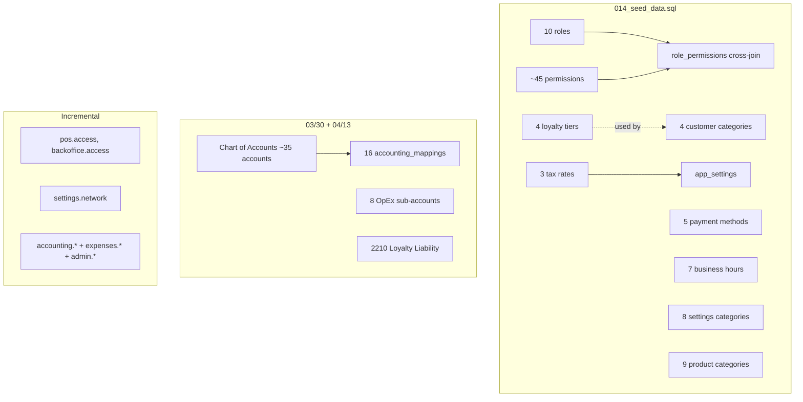

# 08 — Seed Data

> **Last verified**: 2026-05-03
> **Primary source**: `supabase/migrations/014_seed_data.sql`
> **Secondary sources** (incremental seeds): `20260318212600_add_module_access_permissions.sql`, `20260315110000_p0_security_fixes.sql`, `20260330600000_fix_accounting_p0_audit.sql`, `20260330600100_unify_trigger_account_codes.sql`, `20260413200100_seed_opex_accounts.sql`, `20260413200200_add_loyalty_accounting.sql`, `20260414110000_add_settings_network_permission.sql`

---

## 1. Overview

Seed data lives **inside migrations**, not in `supabase/seed.sql` (the file is reserved for local dev fixtures). Every seed insert uses `ON CONFLICT (...) DO NOTHING` so re-applying is safe.



---

## 2. Chart of Accounts (COA)

### 2.1 Structure

5-class structure, 4-digit codes, hierarchical via `parent_id`. From `20260330600000_fix_accounting_p0_audit.sql` (P0-3 seed).

| Class | Type | Range | Balance | Examples |
|-------|------|-------|---------|----------|
| 1 | Asset | 1000–1999 | debit | 1100 Cash & Equivalents, 1300 Inventory |
| 2 | Liability | 2000–2999 | credit | 2100 Current Liabilities, 2143 PB1 Payable |
| 3 | Equity | 3000–3999 | credit | 3100 Owner Capital, 3200 Retained Earnings |
| 4 | Revenue | 4000–4999 | credit | 4111 POS Sales, 4131 Sales Discount, 4200 B2B |
| 5 | Cost of Goods Sold | 5000–5999 | debit | 5100 COGS-Direct, 5111 Food Waste |
| 6 | Operating Expenses | 6000–6999 | debit | 6100 Salaries, 6200 Rent, … |
| 7 | Other Income/Expense | 7000–7999 | credit | 7104 Stock Adjustment Income |

### 2.2 Class 1 — Assets

| Code | Name | Type | Postable | Used by |
|------|------|------|----------|---------|
| 1000 | Assets | header | no | grouping |
| 1100 | Cash & Equivalents | group | no | grouping |
| 1111 | Petty Cash | account | yes | EXPENSE_PETTY_CASH, PURCHASE_CASH_OUT |
| 1112 | Bank | account | yes | SALE_BANK_IN, EXPENSE_BANK, PURCHASE_BANK_OUT, SALE_PAYMENT_TRANSFER |
| 1113 | Cash Register | account | yes | SALE_CASH_IN, SALE_PAYMENT_CASH |
| 1114 | Card Receivable | account | yes | SALE_PAYMENT_CARD |
| 1115 | QRIS Receivable | account | yes | SALE_PAYMENT_QRIS |
| 1116 | EDC Receivable | account | yes | SALE_PAYMENT_EDC |
| 1120 | Receivables | group | no | grouping |
| 1121 | Accounts Receivable | account | yes | SALE_RECEIVABLE (B2B) |
| 1130 | Inventory | group | no | grouping |
| 1131 | Inventory - General | account | yes | INVENTORY_GENERAL |
| 1150 | Tax Assets | group | no | grouping |
| 1151 | VAT Input (PPN Masukan) | account | yes | PURCHASE_VAT_INPUT |

### 2.3 Class 2 — Liabilities

| Code | Name | Used by |
|------|------|---------|
| 2000 | Liabilities (header) | — |
| 2100 | Current Liabilities (group) | — |
| 2111 | Accounts Payable | PURCHASE_PAYABLE |
| 2143 | PB1 Tax Payable (PPN Keluaran) | SALE_PB1_TAX |
| 2210 | Loyalty Points Liability | LOYALTY_LIABILITY (added 2026-04-13) |

### 2.4 Class 3 — Equity

| Code | Name |
|------|------|
| 3000 | Equity (header) |
| 3100 | Owner Capital |
| 3200 | Retained Earnings |

### 2.5 Class 4 — Revenue

| Code | Name | Used by |
|------|------|---------|
| 4000 | Revenue (header) | — |
| 4100 | Sales Revenue (group) | — |
| 4111 | POS Sales Revenue | SALE_POS_REVENUE |
| 4131 | Sales Discount (contra) | SALE_DISCOUNT |
| 4200 | B2B Revenue | SALE_B2B_REVENUE |

### 2.6 Class 5 — Cost of Goods Sold

| Code | Name | Used by |
|------|------|---------|
| 5000 | COGS (header) | — |
| 5100 | COGS - Direct (group) | — |
| 5111 | Food Waste / Shrinkage | STOCK_WASTE_FOOD |

### 2.7 Class 6 — Operating Expenses

Seeded by `20260413200100_seed_opex_accounts.sql`:

| Code | Name |
|------|------|
| 6000 | Operating Expenses (header) |
| 6100 | Salaries & Wages |
| 6200 | Rent |
| 6300 | Utilities |
| 6400 | Marketing & Advertising |
| 6500 | Repairs & Maintenance |
| 6600 | Depreciation |
| 6700 | Insurance |
| 6800 | Supplies & Packaging |
| 6900 | Stock Adjustment Expense (STOCK_ADJUSTMENT_EXPENSE) |

### 2.8 Class 7 — Other Income / Expense

| Code | Name | Used by |
|------|------|---------|
| 7000 | Other Income & Expense (header) | — |
| 7104 | Stock Adjustment Income | STOCK_ADJUSTMENT_INCOME |

---

## 3. Accounting mappings (`accounting_mappings`)

Symbolic-key → account-code lookups consumed by `accountingEngine.ts` (TS) and DB triggers via `resolve_mapping_account(<key>)`. Sources: `20260330600000_fix_accounting_p0_audit.sql`, `20260330600100_unify_trigger_account_codes.sql`, `20260413200200_add_loyalty_accounting.sql`, `20260407200000_pos_outstanding.sql`, `20260430180000_caissapp_shift_snapshots_and_close_rpc.sql`.

### 3.1 Sales mappings

| Mapping key | Account | Description |
|-------------|---------|-------------|
| SALE_CASH_IN | 1113 | Cash receipt from sales (legacy single-payment) |
| SALE_BANK_IN | 1112 | Bank receipt from sales |
| SALE_RECEIVABLE | 1121 | Accounts receivable (B2B) |
| SALE_B2B_REVENUE | 4200 | B2B sales revenue |
| SALE_PB1_TAX | 2143 | PB1 tax payable (10 % of total) |
| SALE_POS_REVENUE | 4111 | POS sales revenue (net of discount) |
| SALE_DISCOUNT | 4131 | Sales discount (contra-revenue) |
| SALE_PAYMENT_CASH | 1113 | Per-method split-payment routing |
| SALE_PAYMENT_TRANSFER | 1112 | |
| SALE_PAYMENT_QRIS | 1115 | |
| SALE_PAYMENT_EDC | 1116 | |
| SALE_PAYMENT_CARD | 1114 | |

### 3.2 Purchase mappings

| Mapping key | Account | Description |
|-------------|---------|-------------|
| PURCHASE_PAYABLE | 2111 | Accounts payable (suppliers) |
| PURCHASE_CASH_OUT | 1111 | Petty cash outflow (purchases) |
| PURCHASE_BANK_OUT | 1112 | Bank outflow (purchases) |
| PURCHASE_VAT_INPUT | 1151 | VAT input (PPN Masukan) |

### 3.3 Expenses mappings

| Mapping key | Account | Description |
|-------------|---------|-------------|
| EXPENSE_PETTY_CASH | 1111 | Petty cash outflow |
| EXPENSE_BANK | 1112 | Bank outflow |

### 3.4 Inventory & adjustments mappings

| Mapping key | Account | Description |
|-------------|---------|-------------|
| INVENTORY_GENERAL | 1131 | General inventory account |
| STOCK_WASTE_FOOD | 5111 | Food waste / shrinkage expense |
| STOCK_ADJUSTMENT_INCOME | 7104 | Stock surplus (positive variance) |
| STOCK_ADJUSTMENT_EXPENSE | 6900 | Stock shortage (negative variance) |

### 3.5 Loyalty mapping

| Mapping key | Account | Description |
|-------------|---------|-------------|
| LOYALTY_LIABILITY | 2210 | Loyalty points deferred revenue |

> **Additional mappings from POS-outstanding (`20260407200000`) and caissapp shift-close (`20260430180000`)** exist but are not exhaustively listed here — query `accounting_mappings` directly. Not found in current migrations as of 2026-05-03 — verify via `supabase db dump --data-only --schema public --table accounting_mappings` for the complete production list.

---

## 4. Roles (`roles`)

Seeded by `014_seed_data.sql`.

| Code | Name (EN) | Hierarchy | System | Description |
|------|-----------|-----------|--------|-------------|
| SUPER_ADMIN | Super Administrator | 100 | yes | Full system access |
| ADMIN | Administrator | 90 | yes | Full access except some system settings |
| MANAGER | Manager | 70 | yes | Store management and reports |
| CASHIER | Cashier | 50 | yes | POS operations |
| BAKER | Baker | 40 | yes | Production and recipes |
| INVENTORY | Inventory Manager | 40 | yes | Stock management |
| SERVER | Server | 30 | yes | Order taking |
| BARISTA | Barista | 30 | yes | Beverage preparation |
| KITCHEN | Kitchen | 30 | yes | Food preparation |
| VIEWER | Viewer | 10 | yes | Read-only access |

> **OWNER role** — referenced by `20260315110000_p0_security_fixes.sql` and `20260315100000_fix_owner_role_and_permissions.sql` but not in the original `014_seed_data.sql` insert. Created later via the OWNER fix migration. Verify via `SELECT * FROM roles WHERE code = 'OWNER'` if needed.

---

## 5. Permissions (`permissions`)

### 5.1 Bootstrap set (014_seed_data.sql)

41 permissions grouped by module:

| Module | Codes | Sensitive flag |
|--------|-------|----------------|
| sales | sales.view, sales.create, sales.void, sales.discount, sales.refund, sales.report | void/discount/refund = sensitive |
| inventory | inventory.view, inventory.create, inventory.update, inventory.delete, inventory.adjust, inventory.transfer | delete/adjust = sensitive |
| products | products.view, products.create, products.update, products.delete, products.pricing | delete/pricing = sensitive |
| customers | customers.view, customers.create, customers.update, customers.delete, customers.loyalty | delete = sensitive |
| reports | reports.sales, reports.inventory, reports.financial | financial = sensitive |
| users | users.view, users.create, users.update, users.delete, users.roles | create/update/delete/roles = sensitive |
| settings | settings.view, settings.update | update = sensitive |
| production | production.view, production.create, production.recipes | — |
| purchases | purchases.view, purchases.create, purchases.approve | approve = sensitive |
| pos | pos.open_drawer, pos.close_session, pos.price_override | close_session/price_override = sensitive |
| kds | kds.view, kds.update | — |

### 5.2 Module access (20260318212600)

| Code | Description |
|------|-------------|
| pos.access | Granted to SUPER_ADMIN, MANAGER, CASHIER, BAKER, SERVER, BARISTA |
| backoffice.access | Granted to SUPER_ADMIN, ADMIN, MANAGER, INVENTORY, VIEWER (sensitive) |

### 5.3 Accounting & expenses (20260315110000)

| Code | Description |
|------|-------------|
| accounting.view | View accounting data |
| accounting.manage | Manage accounting settings (sensitive) |
| accounting.journal.create | Create journal entries (sensitive) |
| accounting.journal.update | Update journal entries (sensitive) |
| accounting.vat.manage | Manage VAT filings (sensitive) |
| expenses.view | — |
| expenses.create | — |
| expenses.update | — |
| expenses.delete | sensitive |
| expenses.approve | sensitive |
| expenses.categories | sensitive |
| reports.audit | View audit logs (sensitive) |
| admin.roles | Manage user roles (sensitive) |
| admin.permissions | Manage permissions (sensitive) |
| admin.audit | View audit logs (sensitive) |

### 5.4 Network admin (20260414110000)

| Code | Description |
|------|-------------|
| settings.network | Access network device discovery, printer configuration, LAN monitoring |

### 5.5 Default permission grants

| Role | Permissions strategy |
|------|---------------------|
| SUPER_ADMIN | ALL permissions (CROSS JOIN) |
| ADMIN | ALL permissions (CROSS JOIN) — plus accounting.* + expenses.* via 20260315110000 |
| MANAGER | Curated list (~30 permissions: sales.*, inventory.*, products.*, customers.*, reports.sales/inventory, users.view, settings.view, production.*, purchases.*, pos.*, kds.*) |
| CASHIER | Minimal: sales.view, sales.create, products.view, customers.view/create/loyalty, pos.open_drawer, kds.view |

> **OWNER role** receives all accounting.*, expenses.*, admin.* via 20260315110000 (CROSS JOIN with `code IN ('OWNER', 'SUPER_ADMIN')`).

---

## 6. Loyalty tiers (`loyalty_tiers`)

| Slug | Name | Min lifetime points | Color | Multiplier | Discount % | Birthday bonus |
|------|------|---------------------|-------|------------|-----------|----------------|
| bronze | Bronze | 0 | #CD7F32 | 1.0× | 0 % | 50 |
| silver | Silver | 500 | #C0C0C0 | 1.25× | 2 % | 100 |
| gold | Gold | 2000 | #FFD700 | 1.5× | 5 % | 200 |
| platinum | Platinum | 5000 | #E5E4E2 | 2.0× | 10 % | 500 |

> **Note** — `CLAUDE.md` documents discount rates of 0/5/8/10 %. The seed file (014) uses 0/2/5/10 %. The discrepancy reflects post-bootstrap business-rule iteration — verify the live values via `SELECT slug, discount_percentage FROM loyalty_tiers` if business-critical. Source: `014_seed_data.sql` lines 148–153.

---

## 7. Customer categories (`customer_categories`)

| Slug | Name | Type | Loyalty | Points/IDR | Discount | Default |
|------|------|------|---------|-----------|----------|---------|
| retail | Client Standard | retail | yes | 1000 | 0 % | yes |
| wholesale | B2B / Wholesale | wholesale | no | 0 | 0 % | no |
| vip | Membre VIP | discount_percentage | yes | 500 | 15 % | no |
| staff | Staff | discount_percentage | no | 0 | 25 % | no |

---

## 8. Tax rates (`tax_rates`)

| Code | Name | Rate | Inclusive | Default |
|------|------|------|-----------|---------|
| PPN_10 | PPN 10 % | 10.00 | yes | yes |
| PPN_11 | PPN 11 % | 11.00 | yes | no |
| NO_TAX | No tax | 0.00 | yes | no |

> **Doctrinal clarification** — although the seed labels these `PPN_*` (Indonesian VAT), production uses the 10 % rate as **PB1** (Pajak Restoran, restaurant tax). Codepath: `accounting_mappings.SALE_PB1_TAX → 2143 PB1 Payable` (NOT a generic VAT account). Formula: `tax = total × 10 / 110` (price-inclusive). Account 1151 (VAT Input / PPN Masukan) is reserved for purchase VAT only.

---

## 9. Payment methods (`payment_methods`)

| Code | Name (EN) | Type | Icon | Default |
|------|-----------|------|------|---------|
| cash | Cash | cash | Banknote | yes |
| card | Card | card | CreditCard | no |
| qris | QRIS | digital | QrCode | no |
| edc | EDC | card | Smartphone | no |
| transfer | Bank Transfer | transfer | Building | no |

---

## 10. Business hours (`business_hours`)

| day_of_week | Open | Close | Closed? |
|-------------|------|-------|---------|
| 0 (Sun) | 08:00 | 17:00 | no |
| 1 (Mon) | 07:00 | 18:00 | no |
| 2 (Tue) | 07:00 | 18:00 | no |
| 3 (Wed) | 07:00 | 18:00 | no |
| 4 (Thu) | 07:00 | 18:00 | no |
| 5 (Fri) | 07:00 | 18:00 | no |
| 6 (Sat) | 07:00 | 18:00 | no |

---

## 11. Settings categories (`settings_categories`)

| Code | Name (EN) | Required permission | Sort |
|------|-----------|---------------------|------|
| company | Company | settings.view | 10 |
| pos | Point of Sale | settings.view | 20 |
| tax | Taxation | settings.view | 30 |
| inventory | Inventory | settings.view | 40 |
| printing | Printing | settings.view | 50 |
| localization | Localization | settings.view | 60 |
| security | Security | settings.update | 70 |
| advanced | Advanced | settings.update | 100 |

---

## 12. Default app settings (`app_settings`)

| Key | Value | Description |
|-----|-------|-------------|
| tax_rate | "0.10" | Default tax rate (10 % PPN/PB1) |
| currency | "IDR" | Currency |
| currency_symbol | "Rp" | Currency symbol |
| loyalty_points_rate | "1000" | IDR per 1 loyalty point earned |
| loyalty_points_value | "100" | Redemption value of 1 point in IDR |
| discount_manager_threshold | "10" | Discount % threshold requiring manager PIN |
| receipt_header | `{"line1":"THE BREAKERY","line2":"French Bakery & Coffee","line3":"Lombok, Indonesia"}` | Receipt header |
| receipt_footer | `{"line1":"Merci de votre visite!","line2":"See you soon!"}` | Receipt footer |
| business_hours | `{"open":"07:00","close":"18:00"}` | Business hours summary |
| timezone | "Asia/Makassar" | Default timezone (WITA) |

> **Session timeout** is configurable via `pos_config` (separate from `app_settings`). Default 30 minutes per CLAUDE.md. Not seeded in 014 — set via the Settings UI on first install.

---

## 13. Default sections, stock locations, product categories

### 13.1 `sections`

| Code | Name (FR) | Sort |
|------|-----------|------|
| BAKERY | Boulangerie | 1 |
| PASTRY | Pâtisserie | 2 |
| KITCHEN | Cuisine | 3 |
| BAR | Bar | 4 |
| DISPLAY | Vitrine | 5 |

### 13.2 `stock_locations`

| Code | Name (FR) | Type | Default |
|------|-----------|------|---------|
| MAIN | Entrepôt Principal | main_warehouse | yes |
| KITCHEN | Cuisine | kitchen | no |
| BAKERY | Boulangerie | section | no |
| BAR | Bar | section | no |
| DISPLAY | Vitrine | storage | no |

### 13.3 `categories` (product)

| Name | Icon | Color | Dispatch | Raw material? | Sort |
|------|------|-------|----------|---------------|------|
| Café | ☕ | #6F4E37 | barista | no | 1 |
| Thé | 🍵 | #90EE90 | barista | no | 2 |
| Boissons Froides | 🧊 | #87CEEB | barista | no | 3 |
| Viennoiseries | 🥐 | #DEB887 | display | no | 4 |
| Pains | 🍞 | #D2691E | display | no | 5 |
| Pâtisseries | 🍰 | #FFB6C1 | display | no | 6 |
| Sandwiches | 🥪 | #F5DEB3 | kitchen | no | 7 |
| Salades | 🥗 | #90EE90 | kitchen | no | 8 |
| Matières Premières | 📦 | #808080 | none | yes | 99 |

---

## 14. Other seeded data

- **Suppliers** — `20260218180100_seed_suppliers.sql` (initial supplier list — not exhaustive in this doc; query `SELECT * FROM suppliers` for production state)
- **Modifiers** — `20260218180000_seed_products_modifiers.sql` (product modifier groups + items)
- **Admin user** — `20260218180200_seed_admin_user.sql` + `20260220010000_set_owner_pin.sql` (initial OWNER user with secure PIN; PIN must be rotated on first login)

---

## 15. PostgreSQL enums

Mirror in `src/types/database.enums.ts` — must stay synchronized via `/gen-types`. Source migrations: `001_extensions_enums.sql` + many additive `ALTER TYPE … ADD VALUE` migrations (e.g. `20260322100300_sync_enum_values.sql`, `20260319020000_fix_pos_transaction_enum_casts.sql`).

| TypeScript type | DB type | Values |
|-----------------|---------|--------|
| TOrderStatus | order_status | new, preparing, ready, served, dispatched, completed, cancelled, voided |
| TPaymentStatus | payment_status | unpaid, partial, paid |
| TOrderType | order_type | dine_in, takeaway, delivery, b2b |
| TPaymentMethod | payment_method | cash, card, qris, edc, transfer (+ credit, store_credit handled in trigger) |
| TDiscountType | discount_type | percentage, fixed, free |
| TDeviceType | device_type | desktop, tablet, pos, mobile, kds, display |
| TSessionStatus | session_status | open, recounting, closed |
| TItemStatus | item_status | new, preparing, ready, served, cancelled |
| TDispatchStation | dispatch_station | barista, kitchen, display, none |
| TMovementType | movement_type | purchase, stock_in, waste, adjustment_in, adjustment_out, transfer, ingredient, sale_pos, sale_b2b, production_in, production_out, cafe_receive |
| SectionType | section_type | warehouse, production, sales |
| CustomerType | customer_type | retail, b2b |
| PaymentTerms | payment_terms | cod, net_7, net_14, net_30, net_60 |
| B2bStatus | b2b_status | draft, confirmed, processing, ready, partially_delivered, delivered, completed, cancelled |
| PoStatus | po_status | draft, sent, confirmed, partially_received, received, cancelled, modified |
| PoPaymentStatus | po_payment_status | unpaid, partially_paid, paid |
| TransferStatus | transfer_status | draft, pending, in_transit, received, cancelled |
| CountStatus | count_status | draft, in_progress, finalized, validated |
| TPromotionType | promotion_type | percentage, fixed_amount, buy_x_get_y, free_product |
| AuditAction | audit_action | login, login_failed, logout, create, update, delete, void, refund, discount, password_change, pin_change, permission_grant, permission_revoke, role_assign, role_remove, pin_change_failed |
| AuditSeverity | audit_severity | info, warning, critical |
| ModifierGroupType | modifier_group_type | single, multiple |
| PriceModifierType | price_modifier_type | retail, wholesale, discount_percentage, custom |
| LocationType | location_type | main_warehouse, section, kitchen, storage |
| SessionEndReason | session_end_reason | logout, timeout, forced, device_change |
| B2bDeliveryStatus | b2b_delivery_status | pending, scheduled, in_transit, delivered, failed, cancelled |
| PoHistoryAction | po_history_action | created, sent, confirmed, partially_received, received, cancelled, modified, payment_made, item_returned |
| LoyaltyTransactionType | loyalty_transaction_type | earn, redeem, expire, adjust, bonus, refund |
| TProductType | product_type | finished, semi_finished, raw_material |

> **Pitfall** — adding an enum value requires `ALTER TYPE … ADD VALUE` in a dedicated migration, then `/gen-types`. Failure to regenerate `database.generated.ts` causes silent HTTP 400s on inserts.

---

## 16. Verification checklist (after `supabase db reset`)

```sql
-- All seeds idempotent — counts should match these baselines:
SELECT COUNT(*) FROM roles;             -- ≥ 10
SELECT COUNT(*) FROM permissions;       -- ≥ 60 (41 base + 2 access + 15 acct/expenses + 1 network)
SELECT COUNT(*) FROM loyalty_tiers;     -- 4
SELECT COUNT(*) FROM customer_categories; -- 4
SELECT COUNT(*) FROM tax_rates;         -- 3
SELECT COUNT(*) FROM payment_methods;   -- 5
SELECT COUNT(*) FROM business_hours;    -- 7
SELECT COUNT(*) FROM settings_categories; -- 8
SELECT COUNT(*) FROM accounts WHERE is_system; -- ≥ 30
SELECT COUNT(*) FROM accounting_mappings WHERE is_active; -- ≥ 18
```

If any count is below the baseline, the seed migration likely failed silently (check Supabase logs for `ON CONFLICT` interactions or trigger errors).

---

## 17. Cross-references

- `docs/reference/03-database/05-views-and-matviews.md` — view-level data shape
- `docs/reference/03-database/06-rls-policies.md` — permission codes used by RLS USING/WITH CHECK clauses
- `docs/reference/03-database/07-migrations-history.md` — chronological context for additive seeds
- `src/types/database.enums.ts` — TypeScript mirror of all enums
- `src/types/database.generated.ts` — auto-generated full schema (do NOT edit manually; use `/gen-types`)
- CLAUDE.md §Business Rules — production semantics (PB1 vs PPN, loyalty discounts, currency rounding)
