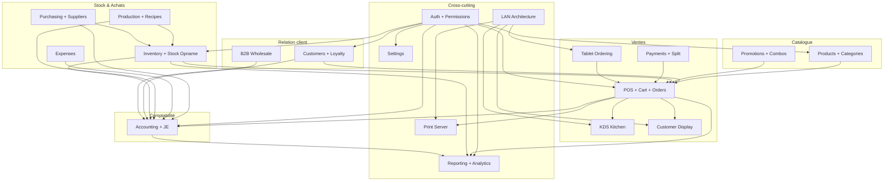

# 00 — Modules Index

> **Last verified**: 2026-06-12
> **Scope**: Catalogue exhaustif des 21 modules métier d'AppGrav V2 et leurs dépendances inter-modules.
> **Note V3** : ce fichier est le catalogue **V2 historique** (conservé pour la carte des dépendances) ; l'index V3 vivant, ce sont les 19 modules `01-…19-*.md` (+ annexe `02b-orders.md`) de ce même dossier — en cas de divergence, les fichiers numérotés font foi.

## Vue d'ensemble

AppGrav V2 est organisé en **21 modules métier** répartis sur trois axes :

- **Frontend** — découpage `src/{components,pages,hooks,services}/<module>/`
- **Backend** — tables Postgres (`supabase/migrations/`), RPCs, triggers et 16 Edge Functions
- **Cross-cutting** — Auth, LAN, Settings, Print, Reporting, qui irriguent tous les autres modules

Le module **Auth** est la racine : tout module métier dépend de lui (RLS + permissions).
Le module **POS** est le hub central des transactions : il orchestre Products, Customers, Promotions, Inventory, Payments et déclenche KDS + Print.
Le module **Accounting** est le terminal : il consomme les événements de Sales, Purchases, Expenses et Production via triggers Postgres.

## Carte des dépendances inter-modules

## Catalogue des 21 modules

| # | Module | Scope | Composants | Hooks | Services | Doc |
|---|---|---|---|---|---|---|
| 01 | Auth & Permissions | PIN login, sessions, RBAC, permission guards | 2 | 4 | 2 | [01-auth-permissions](./01-auth-permissions.md) |
| 02 | POS Cart & Orders | Terminal POS fullscreen, cart, kitchen send | ~50 | 26 | 11 | [02-pos-cart-orders](./02-pos-cart-orders.md) |
| 03 | Payments & Split | Méthodes paiement, split par item, encaissement | 12 modals | 0 dédié | 4 | [03-payments-split](./03-payments-split.md) |
| 04 | KDS Kitchen | Multi-station kitchen display + drag/drop | 6 | 5 | 3 | [04-kds-kitchen](./04-kds-kitchen.md) |
| 05 | Products & Categories | Catalogue, catégories, modifiers, combos, variants, pricing | 4 + 8 sous | 14 | 4 | [05-products-categories](./05-products-categories.md) |
| 06 | Customers & Loyalty | CRM, tiers loyalty, points, category pricing | ~8 | 5+ | 3 | TBD |
| 07 | Inventory | Stock, transferts, opname, mouvements | ~12 | 12+ | 5 | TBD |
| 08 | Production & Recipes | Recettes, batches, déduction ingrédients | ~6 | 4 | 2 | TBD |
| 09 | Purchasing & Suppliers | PO, GRN, fournisseurs | ~10 | 8 | 4 | TBD |
| 10 | Expenses | Dépenses opérationnelles, approbation | ~5 | 4 | 2 | TBD |
| 11 | B2B Wholesale | Commandes B2B, factures, crédit client | ~8 | 6 | 5 | TBD |
| 12 | Accounting | Double-entry, COA, GL, états financiers, PB1 | ~15 | 15+ | 6 | TBD |
| 13 | Promotions & Combos | Engine promotions, règles, combos multi-groupes | ~6 | 3 | 3 | TBD |
| 14 | Reporting & Analytics | 50+ reports, charts Recharts, exports | ~30 | 5 | 4 | TBD |
| 15 | Settings | Préférences, COA, taxes, devices, modules config | ~20 | 8 | 2 | TBD |
| 16 | LAN Architecture | Hub/client, BroadcastChannel, Realtime | 5 | 6 | 5 | [06-lan-architecture/01-overview](../06-lan-architecture/01-overview.md) (à créer) |
| 17 | Print Server | Receipts, kitchen, barista, drawer | 0 | 0 | 3 | TBD |
| 18 | Customer Display | Affichage public client, broadcast | 1 | 1 | 1 | TBD |
| 19 | Tablet Ordering | Interface serveur tablette | ~10 | 4 | 2 | TBD |
| 20 | Mobile (Capacitor) | Routes mobile-optimized, PWA, native Android | ~15 | 2 | 1 | TBD |
| 21 | Users & RBAC Admin | Gestion utilisateurs, rôles, audit logs | ~10 | 5 | 1 | TBD |

## Conventions de découpage

- **Composants** : `src/components/<module>/` — UI pure, importe hooks
- **Pages** : `src/pages/<module>/` — composition route-level, branche store + hooks
- **Hooks** : `src/hooks/<module>/` — react-query (`useQuery` + `useMutation`), Zustand selectors
- **Services** : `src/services/<module>/` — logique métier pure (pas de React), accès Supabase
- **Stores** : `src/stores/` — Zustand global state (cart, auth, payment, …)
- **Types** : `src/types/database.generated.ts` (auto), `src/types/<domain>.ts` (manuel, préfixés `I`/`T`)

## Modules cross-cutting

| Cross-cutting | Effet sur les modules métier |
|---|---|
| **Auth** | Permission guards (`usePermissions`, `<PermissionGuard>`), RLS Postgres (`is_authenticated()`, `user_has_permission()`) |
| **Settings** | Hooks `useModuleConfigSettings`, `usePOSConfigSettings`, `useKDSConfigSettings` exposent la config dynamique à chaque module |
| **LAN** | Hub broadcast (`'appgrav-lan'` BroadcastChannel + `'lan-hub'` Supabase Realtime) — branché par KDS, Display, Tablet, Print |
| **Print** | Service `printService.ts` consommé par POS (receipt), KDS (kitchen ticket), Cash drawer trigger |
| **Reporting** | Read-only sur tables ventes/stock/compta, exports XLSX/PDF |

## Volumes (snapshot 2026-05-03)

- 16 répertoires `src/components/`
- 19 répertoires `src/services/`
- 19 répertoires `src/hooks/`
- 19 répertoires `src/pages/`
- 14 stores Zustand
- 211+ migrations Supabase
- 16 Edge Functions Deno
- ~150 hooks custom
- ~1770 tests Vitest

## Ordre de lecture recommandé

1. [01-auth-permissions](./01-auth-permissions.md) — fondations sécurité
2. [05-products-categories](./05-products-categories.md) — catalogue (input du POS)
3. [02-pos-cart-orders](./02-pos-cart-orders.md) — flux principal
4. [03-payments-split](./03-payments-split.md) — encaissement
5. [04-kds-kitchen](./04-kds-kitchen.md) — exécution cuisine
6. (Modules suivants à créer dans le sprint documentation)

## Légende des dépendances

- **→** signifie « dépend de » au sens code (import, hook query) ou données (FK, événement)
- Les liens vers `LAN` traduisent une dépendance runtime (subscription au hub) ; les autres sont compile-time
