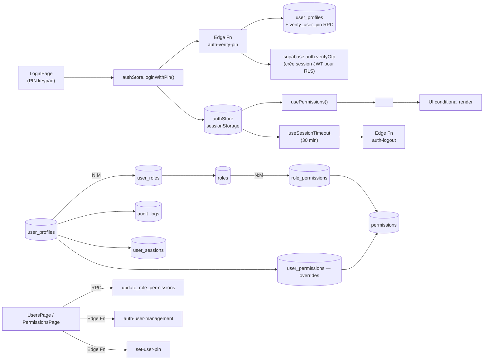

# 01 — Auth, Users & Permissions (RBAC)

> **Last verified** : 2026-05-13
> **Structure** : ce fichier fusionne la **vue fonctionnelle** (le *pourquoi* et le *quoi* métier) et la **référence technique** (le *comment* implémenté). Pour les tâches à faire, voir [`../../workplan/backlog-by-module/01-auth-permissions.md`](../../workplan/backlog-by-module/01-auth-permissions.md).
> **Related E2E flows** : [00-login](../08-flows-end-to-end/00-login.md), [01-pos-sale-cash](../08-flows-end-to-end/01-pos-sale-cash.md), [03-void-refund](../08-flows-end-to-end/03-void-refund.md) (PIN manager), [04-session-timeout](../08-flows-end-to-end/04-session-timeout.md).
> **App de rattachement** : Backoffice (administration) + POS (auth PIN runtime).
> **Module unifié** : ce fichier intègre l'ancien `20-users-rbac.md` (administration users + matrice permissions) et `01-auth-permissions.md` (auth flow + RLS). Pour le détail de la table `permissions`, voir [`../12-appendices/02-permissions.md`](../12-appendices/02-permissions.md) (à créer).

> **En une phrase** : le module Users & Permissions est le gardien des frontières internes de The Breakery — il transforme une équipe en comptes nommés, attribue à chacun strictement les droits dont il a besoin via un système de rôles cloisonnés, authentifie chaque geste sensible par un PIN à 4 chiffres en moins de 2 secondes, et trace tout dans un audit log nominatif et daté — pour qu'aucune action dans l'application ne soit ni anonyme, ni hors contrôle.

---

## Table des matières

- [Partie I — Vue fonctionnelle](#partie-i--vue-fonctionnelle)
  - [1. Raison d'être](#1-raison-dêtre)
  - [2. Les 3 grandes vues + Audit Log](#2-les-3-grandes-vues-du-module)
  - [3. Les 4 invariants du module](#3-les-4-invariants-du-module)
  - [4. Vue **Users** — Gérer les fiches employés](#4-vue-users--gérer-les-fiches-employés)
  - [5. Vue **Permissions Matrix** — Le cœur du RBAC](#5-vue-permissions-matrix--le-cœur-du-rbac)
  - [6. Vue **Roles** — Définir les profils métier](#6-vue-roles--définir-les-profils-métier)
  - [7. Sous-système **PIN** — Authentification rapide caisse](#7-sous-système-pin--authentification-rapide-caisse)
  - [8. Audit Log — La trace écrite](#8-audit-log--la-trace-écrite)
  - [9. Mécaniques transverses](#9-mécaniques-transverses--comment-le-module-se-comporte)
  - [10. Ce que le module ne fait **pas**](#10-ce-que-le-module-ne-fait-pas-par-design)
- [Partie II — Référence technique](#partie-ii--référence-technique)
  - [11. Vue d'ensemble auth](#11-vue-densemble-auth)
  - [12. Diagramme de responsabilité](#12-diagramme-de-responsabilité)
  - [13. Tables DB impliquées](#13-tables-db-impliquées)
  - [14. Hooks principaux](#14-hooks-principaux)
  - [15. Services principaux](#15-services-principaux)
  - [16. Composants UI principaux](#16-composants-ui-principaux)
  - [17. Stores Zustand utilisés](#17-stores-zustand-utilisés)
  - [18. RPCs / Edge Functions](#18-rpcs--edge-functions)
  - [19. RLS & Permissions](#19-rls--permissions)
  - [20. Matrice rôle × permission (extrait par défaut)](#20-matrice-rôle--permission-extrait-par-défaut)
  - [21. Routes](#21-routes)
  - [22. Flows E2E](#22-flows-e2e)
  - [23. Pitfalls spécifiques](#23-pitfalls-spécifiques)
- [Partie III — Backlog opérationnel](#partie-iii--backlog-opérationnel)
- [Partie IV — Design & UX](#partie-iv--design--ux)
  - [24. Thèmes et contextes d'affichage](#24-thèmes-et-contextes-daffichage)
  - [25. Écrans du module (8 routes)](#25-écrans-du-module-8-routes)
  - [26. Layout patterns appliqués](#26-layout-patterns-appliqués)
  - [27. Composants UI signature](#27-composants-ui-signature)
  - [28. États visuels critiques](#28-états-visuels-critiques)
  - [29. Couleurs sémantiques utilisées](#29-couleurs-sémantiques-utilisées)
  - [30. Microcopy et empty states](#30-microcopy-et-empty-states)
  - [31. Références visuelles externes](#31-références-visuelles-externes)
  - [32. À faire côté design (backlog UX)](#32-à-faire-côté-design-backlog-ux)

---

# Partie I — Vue fonctionnelle

## 1. Raison d'être

Le module Users & Permissions est la **carte d'identité interne** de The Breakery. Il répond à une question simple mais structurante pour un gérant qui n'est jamais seul derrière son comptoir :

> *"Qui a le droit de faire quoi dans mon application ? Qui peut encaisser, qui peut annuler une commande, qui peut voir la marge des produits, qui peut changer les prix, qui peut donner une remise de plus de 10 % ?"*

C'est le module qui transforme une **équipe de personnes physiques** en **système de comptes nommés, authentifiés et bridés**. Sans lui, n'importe qui pouvait tout faire ; avec lui, chaque clic est attribué à un humain identifié, autorisé pour cette action précise, et tracé dans l'audit.

Le module a deux faces complémentaires :

- **Users** — créer, modifier, désactiver les fiches employés (qui ils sont).
- **Permissions** — décider via les rôles ce que chacun a le droit de faire (ce qu'ils peuvent).

Les deux faces convergent sur **une mécanique d'authentification par PIN** rapide, adaptée au tempo caisse d'une boulangerie.

---

## 2. Les 3 grandes vues du module

| Vue | Job-to-be-done | Accès |
|---|---|---|
| **Users** (`/users`) | Créer / modifier / activer / désactiver les fiches employés, attribuer leurs rôles, gérer leur PIN | `users.view`, `users.create` |
| **Permissions Matrix** (`/users/permissions`) | Définir qui-peut-quoi via une grille rôles × permissions | `users.roles` |
| **Roles** (`/settings/roles`) | Créer / cloner / renommer / supprimer des rôles métier | `users.roles` |
| **Audit Log** (`/settings/audit`) | Tracer toutes les actions sensibles attribuées à un utilisateur | `users.roles` (ou admin) |

Le module est complété par le sous-système **PIN** (Edge Functions `auth-verify-pin`, `auth-change-pin`, `set-user-pin`) qui fournit le mécanisme d'authentification rapide à la caisse, sans clavier ni mot de passe long.

---

## 3. Les 4 invariants du module

Quelle que soit la vue consultée, l'utilisateur retrouve toujours les mêmes principes — c'est ce qui rend le RBAC robuste :

1. **Tout est nommé**. Aucune action sensible n'est anonyme — chaque commande, chaque void, chaque modif de prix porte le nom de l'utilisateur authentifié.
2. **Pas de droit hérité**. Une permission n'est jamais donnée à un humain en direct (sauf overrides exceptionnels via `user_permissions`) : elle est donnée à un **rôle**, et le rôle est attribué à l'humain. Cloisonnement par construction.
3. **Le rôle Owner est verrouillé**. Le rôle système "Owner" a *toutes* les permissions, il est non modifiable et indélétable. Il garantit qu'on ne peut jamais se retrouver enfermé hors de sa propre application.
4. **Soft delete uniquement**. On ne supprime jamais un utilisateur — on le désactive (`is_active = false`). L'historique des commandes, ventes, audits reste intact et attribué.

---

## 4. Vue **Users** — Gérer les fiches employés

C'est la vue **opérationnelle** : la liste de toute l'équipe avec ce qu'on a besoin de savoir au quotidien.

### 4.1 Liste des utilisateurs

Donner au gérant ou à l'admin une **vue centralisée et filtrable** de tous les comptes employés :

- Chaque ligne affiche : nom complet, code employé, téléphone, e-mail, rôle(s), statut actif / inactif, dernière connexion.
- **Recherche** par nom, code employé, téléphone.
- **Filtrer** par rôle (Manager / Cashier / Barista / Kitchen / Accountant…), par statut actif / inactif.
- **Toggle "Show inactive"** pour afficher ou masquer les comptes désactivés.
- **Statistiques agrégées** en haut : nombre total d'employés actifs, nombre par rôle, nombre connectés récemment.

Actions disponibles ligne par ligne :

- Modifier la fiche.
- Réinitialiser le PIN.
- Désactiver (ou réactiver) le compte.

Bénéfice métier : **avoir l'équipe sous les yeux**. En 5 secondes le gérant voit qui est cashier, qui est en congé prolongé (inactif), qui ne s'est pas connecté depuis 2 semaines.

### 4.2 Création / édition d'une fiche

Permettre au gérant de **créer rapidement** un compte pour un nouvel employé ou de **mettre à jour** une fiche existante.

Champs collectés :

- **Identité** : prénom, nom, nom d'affichage (celui qui apparaît sur les tickets), code employé (court, ex `MADE01`).
- **Contact** : téléphone, e-mail.
- **Auth** : liaison à un compte Supabase Auth (`auth_user_id`) optionnelle — permet à l'employé de se connecter par e-mail/password depuis le BackOffice en plus du PIN caisse.
- **Langue préférée** : id / fr / en (pour l'affichage app — actuellement EN forcé).
- **PIN** : 4 chiffres pour l'auth caisse rapide.
- **Rôles** : liste cochable de rôles attribués à cet employé.
- **Rôle principal** : un rôle parmi les rôles attribués est désigné "primary" — c'est lui qui s'affiche dans l'audit log et sur les tickets.

Bénéfice métier : **embaucher un cashier en 2 minutes**. Saisie nom + code employé + PIN + rôle Cashier → l'employé peut encaisser dès l'instant suivant.

### 4.3 Réinitialisation du PIN

Permettre à un manager de **régénérer un PIN** quand un employé l'oublie ou quand on soupçonne une fuite :

- Demande d'un nouveau PIN à 4 chiffres.
- Application immédiate (l'ancien PIN est invalide à la seconde suivante).
- Trace dans l'audit log avec l'identité du manager qui a fait la réinit.

Bénéfice métier : **dépanner un employé sans avoir à appeler l'IT**. Le manager fait la manipulation en 30 secondes au comptoir, l'employé reprend la caisse.

### 4.4 Désactivation (soft delete)

Permettre au gérant de **fermer un compte** sans casser l'historique :

- `is_active = false` → l'utilisateur ne peut plus se connecter, ni en PIN ni en email.
- Ses commandes passées, ses sessions caisse, ses entrées d'audit restent attribuées à son nom.
- Réactivable d'un clic si l'employé revient.

Bénéfice métier : **respecter la durée légale de conservation** des données employés tout en bloquant immédiatement l'accès. Un licenciement à 14h bloque l'accès à 14h01 sans rien casser dans la compta du jour.

---

## 5. Vue **Permissions Matrix** — Le cœur du RBAC

C'est ici que se décide **qui peut quoi dans toute l'application**. La page affiche une **matrice rôles × permissions** : les rôles sont en colonnes, les permissions en lignes.

### 5.1 Structure de la matrice

Lignes (les permissions) sont regroupées par **module** :

| Module | Exemples de permissions |
|---|---|
| **Sales** | `sales.view`, `sales.create`, `sales.void`, `sales.discount`, `sales.refund` |
| **Products** | `products.view`, `products.create`, `products.update`, `products.pricing` |
| **Inventory** | `inventory.view`, `inventory.create`, `inventory.update`, `inventory.delete`, `inventory.adjust` |
| **Customers** | `customers.view`, `customers.create`, `customers.update`, `customers.loyalty` |
| **Reports** | `reports.sales`, `reports.inventory`, `reports.financial`, `reports.audit` |
| **Accounting** | `accounting.view`, `accounting.manage`, `accounting.journal.create`, `accounting.journal.update`, `accounting.vat.manage` |
| **Users** | `users.view`, `users.create`, `users.update`, `users.delete`, `users.roles` |
| **Settings** | `settings.view`, `settings.update`, `settings.network` |
| **Expenses**, **Production**, **Purchases**, **Kitchen**, **Admin** | … |

Au total **~70 permissions atomiques** réparties sur ~11 modules.

Colonnes (les rôles) : un par rôle existant — Owner, Manager, Cashier, Barista, Kitchen, Accountant, Stockman, etc.

### 5.2 Le geste métier

Le gérant ou l'admin coche / décoche **une case à la fois** :

- Case cochée = ce rôle a cette permission.
- Case décochée = ce rôle ne l'a pas.
- La colonne **Owner** est verrouillée (toutes les cases pré-cochées, non éditables) — c'est la garantie qu'on ne peut jamais perdre l'accès complet.
- Bouton "Save" en haut → push global de toute la matrice via RPC `update_role_permissions`.

Bénéfice métier : **piloter la sécurité au niveau du geste**, pas du concept. Le gérant ne raisonne pas "le rôle Cashier devrait avoir tel niveau de droit" — il coche directement "Cashier peut faire `sales.discount`" ou pas.

### 5.3 Permissions atomiques typiques et leur enjeu

Quelques permissions à fort impact métier :

| Permission | Enjeu si donnée à la mauvaise personne |
|---|---|
| `sales.void` | Annuler une commande = potentiel d'encaisser puis annuler pour empocher le cash. Doit être un manager. |
| `sales.refund` | Rembourser = sortir de l'argent de la caisse. Même enjeu que `sales.void`. |
| `sales.discount` | Remises non contrôlées = sweethearting (remise à un complice). À encadrer. |
| `products.pricing` | Modifier les prix = manipulation directe de la marge. Manager / Owner uniquement. |
| `inventory.adjust` | Ajuster le stock = peut masquer un détournement. À tracer + limiter. |
| `customers.loyalty` | Ajouter / retirer des points → vol potentiel de valeur fidélité. |
| `accounting.manage` | Modifier les écritures = falsification comptable. Comptable / Owner uniquement. |
| `users.roles` | Modifier les permissions = **escalade de privilèges**. Owner uniquement. |
| `settings.update` | Modifier la taxe, la fidélité, les rôles = pouvoir absolu sur l'app. À verrouiller. |

Bénéfice métier : **chaque permission est un curseur risque/productivité**. Le module force le gérant à arbitrer explicitement à qui il fait confiance pour quoi.

---

## 6. Vue **Roles** — Définir les profils métier

Avant de remplir la matrice, il faut **créer les rôles**. La page Roles (dans `/settings/roles`) permet de :

### 6.1 Créer un rôle

- Donner un code court (`cashier`, `barista`, `manager`).
- Un libellé en anglais (affiché dans l'UI : "Cashier", "Manager").
- Une description optionnelle.
- Un `hierarchy_level` (10-100) pour l'ordre d'affichage et l'enforcement de hiérarchie.

Les rôles standards livrés à l'installation :

| Code | Libellé | Profil cible |
|---|---|---|
| `owner` | Owner | Le propriétaire — toutes permissions, verrouillé, `is_system=true` |
| `admin` | Admin | Administrateur global (sub-set de Owner) |
| `manager` | Manager | Responsable de salle / opérations |
| `cashier` | Cashier | Caissier — ventes, encaissement |
| `waiter` | Waiter | Serveur (tablet ordering, table service) |
| `barista` | Barista | Préparateur boissons |
| `kitchen` | Kitchen | Personnel cuisine — KDS uniquement |
| `accountant` | Accountant | Comptable — reports financiers + accounting |
| `stockman` | Stockman | Gestion stock + réceptions |

### 6.2 Cloner un rôle

Permettre au gérant de **dupliquer un rôle existant** pour créer une variante :

- Cloner "Cashier" → "Cashier Senior" qui hérite des mêmes permissions de base.
- Puis ajouter dans la matrice les permissions supplémentaires (`sales.discount` jusqu'à 10 %).

Bénéfice métier : **évoluer la structure RH** sans repartir de zéro. Quand l'équipe grandit, on crée des grades intermédiaires sans tout reconfigurer.

### 6.3 Supprimer un rôle

Soft delete. Si un utilisateur a encore ce rôle attribué, suppression refusée. Le rôle Owner (`is_system=true`) est non supprimable par construction.

---

## 7. Sous-système **PIN** — Authentification rapide caisse

Le module Users s'appuie sur un **système d'authentification PIN** dédié à la caisse, distinct de l'auth e-mail/password du BackOffice.

### 7.1 Le geste utilisateur

À la caisse, pour une action sensible (ouvrir une session, annuler une commande, valider une remise), l'app affiche un **clavier numérique virtuel** :

- L'utilisateur tape ses 4 chiffres.
- Vérification serveur via `auth-verify-pin` (Edge Function).
- En cas de succès → action autorisée et tracée à son nom.
- En cas d'échec → message d'erreur sans révéler si c'est le PIN ou l'utilisateur qui est faux.

### 7.2 Politique de sécurité

- **Longueur** : 4-8 chiffres (configurable dans Settings, défaut 4).
- **Tentatives** : 5 essais avant lockout 15 min du compte (configurable).
- **Stockage** : bcrypt hash dans `user_profiles.pin_hash`, **jamais** transmis en clair. La colonne `pin_code` plaintext a été retirée dans la migration `20260210100000_remove_plaintext_pin.sql`.
- **Session timeout** : 30 min d'inactivité avant déconnexion forcée (configurable via `pos.session_timeout_minutes`).
- **Session storage** : sessionStorage (tab-scoped, vidé à la fermeture du tab), pas localStorage.

### 7.3 Changement de PIN

- L'utilisateur peut changer son PIN à tout moment (via `auth-change-pin` Edge Function, requiert l'ancien PIN).
- Le manager peut **réinitialiser** un PIN sans connaître l'ancien (cas oubli, via `set-user-pin` Edge Function avec permission `users.update`).
- Chaque changement / reset est tracé dans l'audit log.

Bénéfice métier : **rapidité caisse compatible avec sécurité staff**. Un cashier tape 4 chiffres en 2 secondes — pas de mot de passe long qui ralentit la file pendant le rush.

---

## 8. Audit Log — La trace écrite

Le module s'accompagne d'un **journal d'audit** (page `/settings/audit`) qui trace toutes les actions sensibles attribuées à un utilisateur.

### 8.1 Événements tracés

- Connexion / déconnexion.
- Échec d'authentification PIN (potentiel signal de fraude).
- Création / modification / désactivation d'utilisateur.
- Création / modification / suppression de rôle.
- Modification de permissions (ajout / retrait dans la matrice).
- Reset de PIN.
- Toute action portant l'attribut `audit: true` côté code (void, refund, large discount, settings update…).

### 8.2 Les filtres utiles

- Par utilisateur (que faisait Made cette semaine ?).
- Par type d'événement (toutes les modifications de rôle).
- Par période (l'historique du dernier mois).
- Par sévérité (info / warning / critical).

### 8.3 Détail d'un événement

Un clic sur une ligne ouvre le détail :

- Qui (utilisateur).
- Quoi (action exacte).
- Quand (timestamp précis).
- Avant / après (pour les modifications — anciennes vs nouvelles valeurs, stockées en JSONB).
- Adresse IP / device si applicable.

Bénéfice métier : **dissuasion + résolution de litige**. Le simple fait que tous les staff sachent que tout est tracé réduit drastiquement les tentations. En cas de problème, la preuve est datée et nominative.

---

## 9. Mécaniques transverses — Comment le module se comporte

### 9.1 PermissionGuard et ModuleAccessGuard

Côté frontend, le module fournit deux composants utilisés partout :

- **`<PermissionGuard permission="sales.void">`** — enveloppe un bouton, un menu, une page. Si l'utilisateur n'a pas la permission, l'élément n'est pas rendu (pas juste masqué : pas envoyé au DOM).
- **`<ModuleAccessGuard module="accounting">`** — enveloppe une route entière. Si l'utilisateur n'a aucune des permissions du module, redirige vers le dashboard.

Bénéfice : **un utilisateur ne voit même pas ce qu'il ne peut pas faire**. Pas de bouton grisé, pas de tentation, pas de surface d'attaque côté UI.

### 9.2 Vérification serveur double

Toutes les permissions sont vérifiées **deux fois** :

1. **Côté frontend** (PermissionGuard) — pour la fluidité UX.
2. **Côté Supabase** (RLS policies + `user_has_permission()` SECURITY DEFINER) — pour la sécurité réelle.

Bénéfice : **un utilisateur qui contournerait le frontend** (via un appel API direct, un curl, un client compromis) tombe immédiatement sur le mur RLS côté base. La sécurité ne dépend jamais du browser.

### 9.3 Cache et propagation

- Les permissions de l'utilisateur courant sont chargées au login dans `authStore` (Zustand).
- Elles sont vérifiées via `usePermissions()` hook côté frontend (lookup O(1) en mémoire).
- Une modification de la matrice (par un admin) ne se propage qu'à la prochaine reconnexion de l'utilisateur affecté → pas de risque d'effet de bord en pleine session.

---

## 10. Ce que le module ne fait **pas** (par design)

- Le module **ne gère pas la paie**. Pas de feuille de temps, pas de calcul salaire, pas de fiche de paie. Ce n'est pas un SIRH.
- Le module **ne planifie pas les shifts**. Le planning staff est dans le module Operations à venir (cf. backlog reports : Peak Hour Staffing).
- Le module **ne synchronise pas avec un AD / LDAP externe**. The Breakery est une PME, l'auth est autonome.
- Le module **ne supprime jamais physiquement** un utilisateur ou un rôle qui a un historique. Soft delete uniquement.
- Le module **ne fait pas de SSO**. Pas de Google Sign-In, pas de Apple Sign-In — par choix de sobriété (et de contrôle).
- Le module **ne permet pas à un utilisateur de s'auto-attribuer un rôle**. Toute affectation passe par un admin avec `users.roles`.

---

# Partie II — Référence technique

## 11. Vue d'ensemble auth

Authentification PIN à 4-8 chiffres adossée à Supabase Auth via magiclink. RBAC fin (modules + actions) servi côté Postgres via fonctions STABLE et côté React via hooks et guards. Sessions persistées en `sessionStorage` (tab-scoped), validées server-side à chaque refresh. Timeout d'inactivité 30 min (configurable via `pos_config`).

Identity verification supporte deux modes :

- **Email + password** — Supabase Auth, suitable for back-office users. `auth_user_id` links `user_profiles` to `auth.users`.
- **PIN** — 4–8 digit code stored as bcrypt hash in `user_profiles.pin_hash` (plaintext column was removed in `20260210100000_remove_plaintext_pin.sql`). Used for fast in-store login at POS, KDS, tablets.

---

## 12. Diagramme de responsabilité



---

## 13. Tables DB impliquées

Tables seedées par migration `008_users_permissions`.

| Table | Rôle | Colonnes clés |
|---|---|---|
| `user_profiles` | Profil utilisateur app-side | `id`, `auth_user_id`, `employee_code`, `first_name`, `last_name`, `display_name`, `phone`, `preferred_language`, `timezone`, `pin_hash`, `last_login_at`, `failed_login_attempts`, `locked_until`, `is_active`, `created_by`, `updated_by` |
| `roles` | Rôles métier | `id`, `code` (`SUPER_ADMIN`, `OWNER`, `ADMIN`, `MANAGER`, `CASHIER`, `WAITER`, `KITCHEN`, `ACCOUNTANT`, …), `name_fr/en/id`, `description`, `is_system`, `is_active`, `hierarchy_level` (10-100) |
| `permissions` | Catalogue permissions | `id`, `code` (`module.action`), `module`, `action`, `name_*`, `description`, `is_sensitive` — system seed, immutable |
| `role_permissions` | M:N junction | `(role_id, permission_id)` PK |
| `user_roles` | M:N junction users ↔ roles | `(user_id, role_id)` + `is_primary BOOLEAN` |
| `user_permissions` | Overrides directs user-level (allow/deny) | Bypass role grants |
| `user_sessions` | Sessions actives | `session_token`, `device_type`, `device_name`, `ip_address`, `user_agent`, `started_at`, `last_activity_at`, `ended_at`, `end_reason` |
| `audit_logs` | Journal d'audit immuable | `user_id`, `action`, `module`, `table_name`, `record_id`, `old_values`, `new_values`, `ip_address`, `severity`, `created_at` |

Indexes clés :

- `idx_user_profiles_auth ON user_profiles(auth_user_id) WHERE auth_user_id IS NOT NULL`
- `idx_user_roles_primary ON user_roles(is_primary) WHERE is_primary = TRUE`
- `idx_audit_logs_created ON audit_logs(created_at DESC)`
- `idx_audit_logs_severity ON audit_logs(severity)`

---

## 14. Hooks principaux

| Hook | Chemin | Rôle |
|---|---|---|
| `useAuthStore` (Zustand) | `src/stores/authStore.ts` | State + actions auth (`loginWithPin`, `logout`, `refreshSession`) |
| `usePermissions` | `src/hooks/usePermissions.ts` | `hasPermission(code)`, `hasAnyPermission(codes)`, `hasAllPermissions(codes)`, `canAccessModule(module)`, `hasRole(code)`, `isAdmin`, `isManagerOrAbove` |
| `useSessionTimeout` | `src/hooks/auth/useSessionTimeout.ts` | Activity tracking + warning + auto-logout (30 min) |
| `useAuthService` | `src/hooks/auth/useAuthService.ts` | Wrapper service auth (helpers PIN/email) |
| `useMobileAuth` | `src/hooks/auth/useMobileAuth.ts` | Spécifique Capacitor (biometric optional) |
| `useUsers` / `useUsersWithRoles` | `src/hooks/useUsers.ts` | Liste users (UserSelector du PIN keypad + admin UI) |
| `useAuthUsers` | `src/hooks/useAuthUsers.ts` | Liste Supabase `auth.users` (via `list-auth-users` Edge Fn) |
| `useActiveUsers` | `src/hooks/useActiveUsers.ts` | Live `user_sessions` count |
| `useAuditLogs` | `src/hooks/useAuditLogs.ts` | Paginated audit log query with filters |
| `usePermissionsData` | `src/hooks/usePermissionsData.ts` | Catalogue permissions + roles (RBAC admin UI) |
| `usePermissionsList` | `src/hooks/settings/useRoles.ts` | All `permissions` rows (for matrix rendering) |
| `useRoles` | `src/hooks/settings/useRoles.ts` | Roles + user_count + permissions[] + CRUD mutations |

---

## 15. Services principaux

| Service | Chemin | Rôle |
|---|---|---|
| `authService` | `src/services/authService.ts` | `loginWithPin` (Edge Fn + fallback RPC client-side, ligne 192-296), `logout`, `validateSession`, `changePin`, `setSessionTokenGetter` |
| `userManagementService` | `src/services/userManagementService.ts` | CRUD users orchestration. Méthodes : `createUser`, `updateUser`, `deleteUser`, `toggleUserActive`, `createUserDirect`, `updateUserDirect`, `deleteUserDirect`, `toggleUserActiveDirect`, `getUsers`, `getRoles`, `getPermissions`, `getAuditLogs`. Les variantes `*Direct` bypassent Edge Functions et appellent Supabase directement ; les non-Direct routent via `auth-user-management` Edge Function (préféré — fait auth.users sync + audit). |

Le fallback client-side (`_loginWithPinFallback`) déclenche `verify_user_pin` RPC + lockout 15 min après 5 tentatives, exactement comme l'Edge Function.

`buildAuthHeaders()` dans `userManagementService` inclut à la fois `x-session-token` (PIN sessions) et `Authorization: Bearer …` (Supabase JWT for email-login users) — Edge Functions picky ce qui est présent.

---

## 16. Composants UI principaux

| Composant | Chemin | Rôle |
|---|---|---|
| `PermissionGuard` | `src/components/auth/PermissionGuard.tsx:54` | Conditional render avec props `permission` / `permissions` / `requireAll` / `role` / `roles` |
| `RouteGuard` | `src/components/auth/PermissionGuard.tsx:102` | Variante full-page (renvoie `<AccessDeniedPage>`) |
| `AdminOnly` / `ManagerOnly` | `src/components/auth/PermissionGuard.tsx:167-188` | Shortcuts pour rendus admin/manager |
| `POSAccessGuard` | `src/components/auth/ModuleAccessGuard.tsx:25` | Guard route POS — exige `pos.access`, redirige vers `/` si user a `backoffice.access` |
| `BackOfficeAccessGuard` | `src/components/auth/ModuleAccessGuard.tsx:51` | Guard route BackOffice — exige `backoffice.access` |
| `LoginPage` | `src/pages/auth/LoginPage.tsx` | PIN keypad (clavier numérique tactile) |
| `EmailLoginPage` | `src/pages/auth/EmailLoginPage.tsx` | Login email (admin uniquement) |
| `PinVerificationModal` | `src/components/pos/modals/PinVerificationModal.tsx` | Re-vérification PIN manager (void, refund, locked items) |
| `UsersPage` | `src/pages/users/UsersPage.tsx` | User list + filters (role/status), stat cards, create/edit/delete CTA |
| `PermissionsPage` | `src/pages/users/PermissionsPage.tsx` | Matrix layout : roles as columns, permissions as rows. Owner role is locked |
| `UserFormModal` | `src/pages/users/UserFormModal.tsx` | Create/edit user form (multi-role select, primary role, PIN, employee_code) |
| `UserTableRow` | `src/pages/users/UserTableRow.tsx` | Row renderer with quick actions |
| `ResetPinModal` | `src/pages/users/ResetPinModal.tsx` | Manager-initiated PIN reset for a user |
| `StatCard` | `src/pages/users/StatCard.tsx` | Reusable stat tile (Total / Active / Admins / Recent logins) |
| `PermissionMatrixPanel` | `src/components/permissions/PermissionMatrixPanel.tsx` | Core matrix renderer (used by RolesPage et PermissionsPage) |
| `PermissionModuleSection` | `src/components/permissions/PermissionModuleSection.tsx` | Collapsible section per module |
| `PermissionRow` | `src/components/permissions/PermissionRow.tsx` | Single permission row (label + per-role checkboxes) |
| `RoleListPanel` | `src/components/permissions/RoleListPanel.tsx` | Side rail with role list + create/edit |
| `RoleListItem` | `src/components/permissions/RoleListItem.tsx` | One row in the role list |

---

## 17. Stores Zustand utilisés

`authStore` est le store le plus critique. Persisté en **sessionStorage** sous la clé `'breakery-auth'` (tab-scoped, vidé à la fermeture). Voir [`01-architecture/03-state-management.md`](../01-architecture/03-state-management.md) (à créer).

State shape :

```ts
{
  user: IUserProfileExtended | null,
  roles: IRole[],            // [{ id, code, hierarchy_level }, ...]
  permissions: IEffectivePermission[],  // [{ permission_code, permission_module, is_granted, is_sensitive, source }]
  isAuthenticated: boolean,
  isLoading: boolean,
  sessionId: string | null,
  sessionToken: string | null,
}
```

`permissions` est le **set effectif** : role grants merged with `user_permissions` overrides, deduped by `permission_code`. Computed server-side by `auth-get-session` and cached in the store.

Actions clés (toutes async) :

- `loginWithPin(userId, pin)` — `authStore.ts:49-91`
- `logout()` — `authStore.ts:96-126` (invoque `resetAllStoresOnLogout` pour purger cart, payment, terminal, …)
- `refreshSession()` — `authStore.ts:131-188` (préserve la session sur erreur transitoire réseau)
- `initializeAuth()` (export module) — `authStore.ts:229-296` (recovery PIN session sans token via fetch direct DB)

Selectors exportés : `selectIsAdmin`, `selectIsSuperAdmin`, `selectIsManager`, `selectPrimaryRole`, `selectHasPermission(code)`.

---

## 18. RPCs / Edge Functions

| Type | Nom | Rôle |
|---|---|---|
| Edge Function | `auth-verify-pin` | Vérifie PIN, mint session token + Supabase Auth via `verifyOtp` magiclink (`verify_jwt: false` — bootstrap) |
| Edge Function | `auth-get-session` | Valide token, renvoie user + roles + permissions effectives |
| Edge Function | `auth-change-pin` | Change le PIN courant (manager / self) |
| Edge Function | `auth-logout` | Termine la session côté serveur (`user_sessions.ended_at`) |
| Edge Function | `set-user-pin` | Définit/reset PIN (admin only) |
| Edge Function | `auth-user-management` | CRUD users — `action: 'create' \| 'update' \| 'delete' \| 'toggle_active'`. `verify_jwt: true`. Fait auth.users sync + audit_log insert |
| Edge Function | `create-admin-user` | Bootstrap initial admin |
| Edge Function | `list-auth-users` | Liste users Supabase Auth (debug admin) |
| RPC | `verify_user_pin(p_user_id, p_pin)` | Bcrypt-compare PIN (utilisé par fallback client-side) |
| RPC | `get_user_permissions(p_user_id)` | Renvoie tableau `IEffectivePermission` agrégé (rôles + overrides) |
| RPC | `update_role_permissions(p_role_id, p_permission_ids[])` | Atomic replace of role's permission set ; granted to `authenticated`. Défini dans `20260323100100_atomic_expense_approval_and_role_permissions.sql` |
| RPC STABLE | `is_authenticated()` | Renvoie `auth.uid() IS NOT NULL`, cached per-transaction |
| RPC STABLE SECURITY DEFINER | `user_has_permission(uid, code)` | Vérifie permission via SECURITY DEFINER. Défini dans `011_functions_triggers.sql` |
| RPC STABLE | `is_admin(uid)` | True si user a SUPER_ADMIN/OWNER/ADMIN |
| RPC | `set_user_pin(p_user_id, p_pin)` | Bcrypt-hash et stocke le PIN. Colonne plaintext retirée dans `20260210100000_remove_plaintext_pin.sql` |

Voir [`05-integrations/02-edge-functions.md`](../05-integrations/02-edge-functions.md) (à créer) et [`03-database/03-rpc-functions.md`](../03-database/03-rpc-functions.md) (à créer).

---

## 19. RLS & Permissions

Toutes les tables auth sont en RLS strict. Pattern :

```sql
ALTER TABLE public.user_profiles ENABLE ROW LEVEL SECURITY;

-- Lecture : authentifié
CREATE POLICY "Authenticated read" ON public.user_profiles
    FOR SELECT USING (public.is_authenticated());

-- Écriture : permission users.update OU self
CREATE POLICY "Permission-based update" ON public.user_profiles
    FOR UPDATE USING (
        public.user_has_permission(auth.uid(), 'users.update')
        OR id = auth.uid()
    );
```

| Table | SELECT | INSERT/UPDATE/DELETE |
|---|---|---|
| `user_profiles` | `is_authenticated()` (own row) ; `users.view` pour les autres | `users.create` / `users.update` / `users.delete` |
| `roles` | `is_authenticated()` | `users.roles` |
| `permissions` | `is_authenticated()` | system seed only — no user write |
| `role_permissions` | `is_authenticated()` | `users.roles` (via `update_role_permissions` RPC) |
| `user_roles` | `is_authenticated()` | `users.roles` |
| `user_permissions` | `is_authenticated()` | `users.roles` |
| `user_sessions` | own rows + admin | INSERT via Edge Fn ; UPDATE last_activity_at via session refresh |
| `audit_logs` | `users.roles` (admin viewer) | INSERT via triggers / Edge Fns ; never updated/deleted |

### Permission codes du module

| Code | Description |
|---|---|
| `pos.access` | Accès route `/pos` (vérifié par `POSAccessGuard`) |
| `backoffice.access` | Accès BackOffice (vérifié par `BackOfficeAccessGuard`) |
| `users.view` | Liste users |
| `users.create` | Créer un user |
| `users.update` | Modifier user |
| `users.delete` | Soft-delete user |
| `users.roles` | Assigner rôles + manage roles + view audit log |
| `audit.view` | Lire `audit_logs` (alias de `users.roles` historique) |
| `settings.view` / `settings.update` | Lire/modifier settings |
| `settings.network` | Réseau / imprimantes |

**Permissions sensibles** (`is_sensitive=true`, requièrent une re-confirmation PIN dans l'UI) : `sales.void`, `sales.refund`, `accounting.journal.update`, `users.delete`, `users.roles`, `accounting.vat.manage`.

---

## 20. Matrice rôle × permission (extrait par défaut)

| Permission | Owner | Admin | Manager | Cashier | Waiter | Kitchen | Accountant |
|---|:-:|:-:|:-:|:-:|:-:|:-:|:-:|
| `sales.view` | * | * | * | * | * | - | * |
| `sales.create` | * | * | * | * | * | - | - |
| `sales.void` | * | * | * | - | - | - | - |
| `sales.discount` | * | * | * | - | - | - | - |
| `inventory.view` | * | * | * | * | - | * | * |
| `inventory.adjust` | * | * | * | - | - | - | - |
| `accounting.view` | * | * | * | - | - | - | * |
| `accounting.manage` | * | * | - | - | - | - | * |
| `users.view` | * | * | * | - | - | - | - |
| `users.create` | * | * | - | - | - | - | - |
| `users.roles` | * | * | - | - | - | - | - |
| `settings.view` | * | * | * | - | - | - | * |
| `settings.update` | * | * | - | - | - | - | - |
| `settings.network` | * | * | * | * | - | - | - |
| `reports.sales` | * | * | * | - | - | - | * |
| `reports.financial` | * | * | * | - | - | - | * |
| `reports.audit` | * | * | * | - | - | - | - |

(Full reference : [`../12-appendices/02-permissions.md`](../12-appendices/02-permissions.md). Owner role est **locked / read-only** dans la matrix UI — system role granting all permissions.)

---

## 21. Routes

| Route | Page component | Guard |
|---|---|---|
| `/login` | `src/pages/auth/LoginPage.tsx` | Public |
| `/login/email` | `src/pages/auth/EmailLoginPage.tsx` | Public |
| `/auth/reset` | `src/pages/auth/PasswordResetPage.tsx` | Public |
| `/auth/update-password` | `src/pages/auth/UpdatePasswordPage.tsx` | Auth (Supabase recovery token) |
| `/users` | `UsersPage` | `BackOfficeAccessGuard` + `users.view` |
| `/users/permissions` | `PermissionsPage` | `BackOfficeAccessGuard` + `users.roles` |
| `/settings/roles` | `RolesPage` | `users.roles` |
| `/settings/audit` | `AuditPage` | `users.roles` |

All wrapped in `ModuleErrorBoundary moduleName="Users"` (or `"Settings"` for the role/audit pages inside `SettingsLayout`). Routes définies dans `src/routes/adminRoutes.tsx`.

---

## 22. Flows E2E

### 22.1 Flow A — Create a user

1. Admin navigates to `/users`, clicks "+ New user"
2. `UserFormModal` collects : first/last name, employee_code, phone, preferred_language, role_ids[], primary_role_id, optional initial PIN
3. Submit → `userManagementService.createUser()` → `POST /functions/v1/auth-user-management { action: 'create', … }`
4. Edge Function :
   a. Validates caller has `users.create` via `user_has_permission`
   b. Inserts `user_profiles` row
   c. Inserts `user_roles` rows (one per role_id, marks primary)
   d. If PIN provided : hashes via bcrypt and updates `pin_hash`
   e. If email also provided : creates a corresponding `auth.users` row (Supabase Auth API)
   f. Inserts `audit_logs` row (action='user.create')
5. Returns the created user → React Query cache invalidated, table refreshes

### 22.2 Flow B — Edit role permissions

1. Admin opens `/users/permissions`
2. `usePermissionsMatrix()` parallel-fetches `roles`, `permissions`, `role_permissions`
3. Matrix rendered — Owner column locked (system role)
4. Admin toggles checkboxes — local state diff tracked
5. Click "Save" → for each modified role : `useSavePermissions.mutate({ roleId, permissionIds })`
6. Mutation calls `supabase.rpc('update_role_permissions', { p_role_id, p_permission_ids })`
7. RPC atomically `DELETE` + `INSERT` rows in `role_permissions`
8. Cache invalidated for `['permissions-matrix']` and `['roles']`
9. Toast : "Permissions saved"
10. **Note** : users currently logged in still hold their cached effective set — they need to log out/in (or wait for next `auth-get-session` refresh) for changes to take effect

### 22.3 Flow C — Reset a user's PIN

1. Admin clicks "Reset PIN" on a user row → `ResetPinModal` opens
2. Admin enters new PIN (4–8 digits) and their own admin PIN for confirmation
3. Submit → calls `set-user-pin` Edge Function with target user_id + new PIN + admin auth header
4. Edge Function verifies caller has `users.update` (or is the user themselves), then calls `set_user_pin(target_id, new_pin)` RPC
5. RPC bcrypt-hashes the PIN, updates `user_profiles.pin_hash`, and `pin_changed_at`
6. Audit log row inserted
7. Toast : "PIN reset for {user}"

### 22.4 Flow D — Permission check at runtime

1. User clicks a guarded button : `<PermissionGuard permission="sales.void">…</PermissionGuard>`
2. `usePermissions().hasPermission('sales.void')` reads from `useAuthStore.permissions` (in-memory, zero network)
3. If `is_granted=true` → renders children, otherwise renders fallback (or nothing)
4. Server-side enforcement is independent — RLS on `orders` and the `void_order` RPC will both re-check via `user_has_permission()`. UI guards are UX-only.

### 22.5 Flow E — Audit log review

1. Admin opens `/settings/audit`
2. `useAuditLogs({ filters })` paginates `audit_logs` (DESC by `created_at`)
3. `AuditFilters` component lets filter by user, module, action, severity, date range
4. Click a row → `AuditDetailModal` shows `old_values` / `new_values` JSON diff and full metadata

### 22.6 Flow F — Login PIN (bootstrap session)

1. User opens `/login` → `LoginPage` displays user selector + PIN keypad
2. User picks profile + types PIN → `authStore.loginWithPin(userId, pin)`
3. Service calls `auth-verify-pin` Edge Function (`verify_jwt: false` — bootstrap)
4. Edge Function : compares bcrypt hash, mint session token, returns magiclink for `supabase.auth.verifyOtp`
5. `loginWithPin` consume le `data.auth.token` retourné par l'Edge Fn pour appeler `supabase.auth.verifyOtp({ type: 'magiclink' })` et **créer une vraie session JWT** — sans elle les writes RLS échouent (`authService.ts:147-163`).
6. `authStore` hydrate roles + permissions, persists in sessionStorage
7. Redirect vers `/` (POS ou Backoffice selon les permissions)

---

## 23. Pitfalls spécifiques

- **Session token stocké en sessionStorage**, pas localStorage — exposition limitée au tab. Documenté en commentaire de `authStore.ts:9-13`.
- **Fallback client-side critique** : si `auth-verify-pin` Edge Fn est down (500 / réseau), `_loginWithPinFallback` exécute `verify_user_pin` RPC directement. Lockout 15 min après 5 tentatives ratées géré côté client (`authService.ts:233-262`) — alignement strict requis avec la logique Edge Fn.
- **`refreshSession` distingue erreur transitoire et vraie invalidation** : sur `Network error` ou `Server error`, garde la session active (`authStore.ts:144-151`). Sinon logout. Sans cette logique, un Wi-Fi flaky log out tout le monde.
- **`initializeAuth` recovery PIN** : si l'utilisateur est persisté mais sans `sessionToken` (cas d'un PIN login avec edge fn KO), recharge `roles`+`permissions` directement via `supabase.from('user_roles')` (`authStore.ts:244-293`). Sans ça les guards renvoient false même si user présent.
- **Magiclink Supabase Auth obligatoire** : `loginWithPin` consomme le `data.auth.token` retourné par l'Edge Fn pour appeler `supabase.auth.verifyOtp({ type: 'magiclink' })` et **créer une vraie session JWT** — sans elle les writes RLS échouent (`authService.ts:147-163`).
- **Default deny dans `PermissionGuard`** : si ni `permission` ni `role` n'est passé, `hasAccess = false` (`PermissionGuard.tsx:83-85`). Ne jamais utiliser `<PermissionGuard>` sans prop.
- **`useSessionTimeout` clear le manager PIN avant logout** : si `verifiedUser` (override manager actif) existe, l'inactivité clear seulement l'override puis reset le timer (`useSessionTimeout.ts:67-75`). Logout user complet seulement au cycle suivant.
- **`setSessionTokenGetter`** : `authService` ne peut pas importer `authStore` (cycle), donc `authStore.ts:219` enregistre un getter au boot. Si oublié, tous les Edge Fn calls partent sans `x-session-token`.
- **Last-admin protection** : do NOT allow deletion or deactivation of the only remaining user with the Owner or Admin role. The Edge Function `auth-user-management` MUST guard against this — count active admins before delete/deactivate ; reject if count would drop to zero. (Ajouter un `check_admin_count_after_change()` validation si pas présent.)
- **PIN reset workflow** : only managers/admins (or the user themselves with old PIN) can change a PIN. The `set-user-pin` Edge Function uses `verify_jwt: true` AND re-checks permissions server-side — never trust the client's self-reported permission set.
- **Plaintext PIN removed** : as of `20260210100000_remove_plaintext_pin.sql`, the `pin_code` column was dropped. All PIN reads/writes must go through `pin_hash` (bcrypt). Do not reintroduce a plaintext column.
- **Effective permissions caching** : `authStore.permissions` is loaded once at session start. Permission changes by an admin do **not** retroactively affect already-authenticated users until they log out/in. Either accept this latency or implement a Realtime subscription on `role_permissions` + `user_roles` to invalidate the cache.
- **`*Direct` vs Edge Function variants** : `userManagementService` exposes both. Prefer Edge Function variants (`auth-user-management`) — they handle auth.users sync and audit logging. Only use `*Direct` if the caller is already privileged at the DB layer (rare).
- **Owner role is system-locked** : never allow editing of the Owner role's permissions through any UI. The matrix renders it disabled (`<Lock />` icon). The `update_role_permissions` RPC additionally rejects updates to `is_system=true` roles.
- **Audit log immutability** : never UPDATE or DELETE rows in `audit_logs`. Compliance and forensic integrity depend on append-only behaviour. RLS denies UPDATE/DELETE ; do not add policies to allow them.
- **Hierarchy enforcement** : a user with `hierarchy_level=5` (Manager) should not be able to edit a user with `hierarchy_level=10` (Owner) even if granted `users.update`. This check is currently UI-side ; back-end enforcement should be added in the Edge Function (TODO tracked separately — verify before granting `users.update` to non-admins).
- **`auth_user_id` nullable** : PIN-only users have `auth_user_id = NULL` (no Supabase Auth row). Anything joining `auth.users` must `LEFT JOIN` and handle nulls.
- **Role code uniqueness** : role `code` is the lookup key in code (`hasRole('cashier')`). Renaming a role's `code` will break those checks — prefer adding a new role + migrating users + retiring the old one.
- **Session timeout vs permission changes** : a long session (e.g. 8h before timeout) can hold stale permissions for hours. For high-security changes (revoking `sales.void` from a cashier mid-shift), force-terminate their `user_sessions` row to make them re-authenticate.

---

# Partie III — Backlog opérationnel

Pour les tâches techniques à exécuter (détection auto d'escalade de privilèges, approval workflow pour permissions sensibles, permissions à seuil, sessions multiples par utilisateur, 2FA, délégation temporaire, groupes d'utilisateurs, import en masse depuis CSV, export annuaire), voir :

→ [`../../workplan/backlog-by-module/01-auth-permissions.md`](../../workplan/backlog-by-module/01-auth-permissions.md)

Tâches priorisées P0–P3 avec critères d'acceptation, dépendances, estimations XS/S/M/L/XL et risques identifiés.

---

# Partie IV — Design & UX

> **Source canonique** : [`../../DESIGN_POS_AND_BACKOFFICE.md`](../../DESIGN_POS_AND_BACKOFFICE.md) (design détaillé des deux apps).
> **Tokens techniques** : [`../../../DESIGN.md`](../../../DESIGN.md) (variables CSS, scales, classes Tailwind).
> **Screenshots de référence** : [`../../ux/assets/screens/`](../../ux/assets/screens/) — source de vérité visuelle.

## 24. Thèmes et contextes d'affichage

Le module Users & Permissions **traverse les deux apps** :

| Contexte | Thème CSS | Pages concernées | Identité |
|---|---|---|---|
| **POS — Login PIN** | `.theme-pos` (noir profond `#0C0C0E`) | `/login` (PIN keypad), `PinVerificationModal` | Plein écran tactile, gros boutons numériques, focus sur le tempo caisse |
| **Backoffice — User admin** | `.theme-backoffice` (ivoire `#F8F8F6`) | `/users`, `/users/permissions`, `/settings/roles`, `/settings/audit` | Salle de commandement claire, dense — listes + matrice + audit |

**Constante de marque** : l'or `#C9A55C` réservé aux actions sensibles (bouton "Save permissions", logo Breakery dans LoginPage) et aux états actifs (rôle Owner en gold dans la matrice).

---

## 25. Écrans du module (8 routes)

| Route | App | Type d'écran | Densité | Composants signature |
|---|---|---|---|---|
| `/login` | POS | Plein écran auth | Faible | UserSelector + PinKeypad tactile, logo Breakery, indicateur lockout si applicable |
| `/login/email` | Backoffice | Form auth | Faible | Email + password fields, lien "Forgot ?", logo |
| `/auth/reset` et `/auth/update-password` | Backoffice | Form auth | Faible | Email reset / new password fields |
| `/users` | Backoffice | Liste paginée | Haute | UserTable, filters bar, StatCards (Total/Active/Admins/Recent), `UserFormModal`, `ResetPinModal` |
| `/users/permissions` | Backoffice | Matrice rôles × permissions | Maximale | `PermissionMatrixPanel` avec checkboxes denses, Owner column locked, sticky save bar |
| `/settings/roles` | Backoffice | CRUD rôles | Moyenne | `RoleListPanel` (side rail) + `PermissionMatrixPanel` (main) |
| `/settings/audit` | Backoffice | Log immutable | Maximale | `AuditTable` dense, `AuditFilters`, `AuditDetailModal` avec JSON diff |
| `PinVerificationModal` | POS overlay | Modal centrée | Faible | PIN keypad + label action "Confirm void", auto-clear après 30 s |

---

## 26. Layout patterns appliqués

### 26.1 POS — LoginPage (`.theme-pos`)

Layout plein écran sombre (cf. [`../../DESIGN_POS_AND_BACKOFFICE.md`](../../DESIGN_POS_AND_BACKOFFICE.md) §3) :

- **Logo Breakery** en haut (croissant + "B" Playfair italique gold).
- **Sélecteur utilisateur** : grille de cards avec avatar + nom + rôle (Cashier, Manager…), tap pour sélectionner.
- **PIN keypad** virtuel grand format (3×4 grille de chiffres + delete + clear) ≥ 48 px chaque touche.
- **Indicateur visuel** : 4 dots qui se remplissent au fur et à mesure de la frappe.
- **Lockout warning** si `failed_login_attempts ≥ 5` : "Account locked — try again in 15 min".
- **Sound feedback** : bip doux à chaque touche, bip succès, bip erreur.

### 26.2 POS — PinVerificationModal

Modal centrée plein écran flou derrière :

- **Header** : "Manager PIN required to void order #4315".
- **PIN keypad** virtuel (idem LoginPage mais en modal).
- **Footer** : "Cancel" (gauche) + auto-validate à 4 chiffres.

### 26.3 Backoffice — UsersPage liste

Pattern liste Backoffice (cf. [`../../DESIGN_POS_AND_BACKOFFICE.md`](../../DESIGN_POS_AND_BACKOFFICE.md) §4.3) :

1. **Header de page** : titre "Users" + sous-titre + actions ("+ New User", Export, Refresh).
2. **Stats cards** : Total / Active / Admins / Recently logged in.
3. **Filters bar** : search by name/code/phone + role dropdown + status toggle + "Show inactive" toggle.
4. **Table** : Avatar / Name / Code / Role(s) / Status / Last login / Actions.
5. **Action kebab** par ligne : Edit / Reset PIN / Deactivate / Delete (soft).

### 26.4 Backoffice — PermissionsPage matrice

Layout matriciel **dense** :

1. **Header** : titre + sous-titre + bouton "Save Changes" (sticky, gold) avec compteur de modifications.
2. **Sticky first column** : permissions par module (groupes pliables avec `PermissionModuleSection`).
3. **Columns scrollables horizontalement** : un par rôle, header avec nom + nombre d'users assignés.
4. **Checkboxes** dans chaque cellule, hover ligne pour mettre en évidence.
5. **Colonne Owner** : pré-cochée et désactivée avec icône `Lock` Lucide.
6. **Footer sticky** : "X changes — Save" / "Cancel" buttons.

### 26.5 Backoffice — RolesPage

Layout split-view :

- **Left rail** (`RoleListPanel`) : liste des rôles avec `hierarchy_level` (badge), `users_count`, bouton "+ New Role" / "Clone".
- **Right pane** : pour le rôle sélectionné, sous-matrice de ses permissions (édition inline) + métadonnées.

### 26.6 Backoffice — AuditPage

Layout audit dense :

1. **Filters** : User picker, Module dropdown, Action search, Severity (info/warning/critical), Date range.
2. **Table** : Timestamp / User / Action / Module / Target / Severity badge / Details button.
3. **Row hover** : surlignage `surface-2`.
4. **AuditDetailModal** sur clic ligne : JSON diff `old_values` vs `new_values` en colonne, full metadata, lien vers ressource source si applicable.

---

## 27. Composants UI signature

| Composant | Type | Usage | Style clé |
|---|---|---|---|
| `LoginPage` PIN keypad | Plein écran tactile | `/login` | Grille 3×4 boutons numériques ≥ 48 px, dots indicateur, gold accent sur action |
| `PinVerificationModal` | Modal | POS actions sensibles | Centré, flou backdrop, auto-validate 4 chiffres |
| `UserFormModal` | Modal CRUD | `/users` | Multi-section : Identity, Contact, Auth, Roles (multi-select), PIN |
| `ResetPinModal` | Modal | `/users` | New PIN input + confirmation PIN admin caller, audit warning |
| `PermissionMatrixPanel` | Table dense | `/users/permissions`, `/settings/roles` | Sticky first column, sticky save bar, Owner locked, checkbox state tracking |
| `PermissionModuleSection` | Collapsible | Matrice | Header uppercase tracking large gold, expand/collapse chevron |
| `PermissionRow` | Row | Matrice | Label permission + tooltip `is_sensitive` + cells checkbox |
| `RoleListPanel` | Side rail | `/settings/roles` | List items avec badges `users_count` + `hierarchy_level`, hover surface-2, active border-l gold |
| `RoleListItem` | List row | Dans `RoleListPanel` | Code (mono) + Name + badges + kebab menu |
| `UserTableRow` | Row | `/users` | Avatar circulaire + Name + Code + Roles chips + Status badge + Last login (relative time) |
| `StatCard` | KPI card | `/users` | Total / Active / Admins / Recent logins — uppercase tracking, gros chiffre |
| `AuditTable` | Table dense | `/settings/audit` | Timestamp mono + User + Action + Severity colored badge |
| `AuditDetailModal` | Modal | Audit drill-down | JSON diff side-by-side, full metadata, IP + device |
| `AuditFilters` | Filter bar | `/settings/audit` | URL-synced user/module/action/severity/date pickers |
| `PermissionGuard` (code wrapper) | Logical | App-wide | Pas de rendu visible, juste guard logic |

---

## 28. États visuels critiques

| État | Visuel | Pourquoi |
|---|---|---|
| **PIN keypad erreur** | Shake animation + dots flash rouge + bip erreur | Feedback immédiat sans révéler quel champ est faux |
| **Lockout actif** | LoginPage : message rouge "Account locked — retry in 12 min", keypad désactivé | Empêche brute force |
| **User inactive** | UserTableRow : avatar grayscale + badge "Inactive" gris foncé | Visibilité immédiate |
| **Owner role lock** | Matrice : colonne Owner avec icône `Lock` Lucide gold + cells pré-cochées disabled | Empêche modification accidentelle |
| **Permission sensitive** | Cell matrice : badge "⚠" rouge inline + tooltip "Requires PIN re-confirmation" | Distingue les permissions à risque |
| **Modifications unsaved** | Sticky save bar gold avec compteur "12 changes pending" + bouton "Save" + "Cancel" | Empêche perte de modifications |
| **Audit critical event** | Row table fond `red/10` + icône `AlertTriangle` rouge | Attention immédiate sur fraudes potentielles |
| **Self-edit warning** | UserFormModal : "You are editing your own profile" warning bleu | Évite l'auto-déconnexion accidentelle |
| **Last admin protection** | UsersPage : action "Delete" disabled + tooltip "Cannot delete — last active admin" | Cf. pitfall §23 |
| **PIN reset confirmation** | ResetPinModal : double champ "New PIN" + "Your admin PIN to confirm" | Empêche reset accidentel par hover-click |
| **Cache stale permissions** | Banner jaune si permissions ont changé serveur-side mais user pas re-loggé : "Permissions have been updated — please log out and log in again" | Force la re-hydration |
| **Session timeout warning** | Toast 5 min avant logout : "You'll be logged out in 5 minutes due to inactivity" + bouton "Stay logged in" | UX courtoise |

---

## 29. Couleurs sémantiques utilisées

| Rôle | POS (dark) | Backoffice (light) | Usage Users & Permissions |
|---|---|---|---|
| **Success** | `#34D399` | `#16A34A` | User active, login success, permissions saved, PIN valid |
| **Warning** | `#FBBF24` | `#D97706` | Failed login attempts ≥ 3 (pre-lockout), audit warning, session timeout warning |
| **Error** | `#F87171` | `#DC2626` | Lockout, PIN invalid, audit critical event, last admin protection |
| **Info** | `#60A5FA` | `#2563EB` | Drafts, breadcrumb links, self-edit warning |
| **Gold** | `#C9A55C` | `#C9A55C` | Logo Breakery, bouton "Save Changes" matrice, Owner role badge, PIN keypad active |

### Severity badges (audit log)

- `info` : grey `#6B7280`
- `warning` : amber `#D97706`
- `critical` : red `#DC2626` + animation pulse

---

## 30. Microcopy et empty states

### Empty states

| Page | Texte | CTA |
|---|---|---|
| `/users` (aucun user actif) | "No users yet — invite your team to The Breakery" | "+ Create first user" |
| `/users` (filtre vide) | "No users match your filters" | "Reset filters" |
| `/users/permissions` (aucun rôle) | "No roles defined — start with default seed" | "Seed default roles" |
| `/settings/roles` (aucun custom role) | "Only system roles exist — clone one to start customizing" | "Clone 'Cashier'" |
| `/settings/audit` (aucun event sur période) | "No audit events for the selected period" | "Adjust date range" |
| `/login` (lockout) | "Account locked. Try again in {N} minutes." | — |

### Confirmations destructives

- **Delete user** : "Soft-delete user Made Putu ? Their orders and audit trail remain. They can be reactivated later." + bouton "Deactivate" rouge.
- **Delete role with users** : "Cannot delete — 7 users still have role 'Cashier'. Reassign them first." + bouton "View users".
- **Lock period (last admin)** : "You are the last active admin. Confirming will disable your own account. This is irreversible without DB access." + double confirmation typed "DELETE".
- **Revoke `users.roles` from self** : (bouton désactivé) tooltip "You cannot remove this permission from yourself — ask another admin".

### Toast notifications

- Succès login : "Welcome back, Made !"
- Succès user create : "User MADE01 created — share PIN with the employee securely"
- Succès permissions save : "Permissions saved — 12 changes applied across 3 roles"
- Succès PIN reset : "PIN reset for Made — share the new PIN securely"
- Erreur lockout : "Too many failed attempts. Account locked for 15 minutes."
- Erreur last admin : "Cannot deactivate — you are the last active admin"
- Warning permissions stale : "Permission set has changed — log out and back in for full effect"

### Microcopy clé

- LoginPage placeholder : "Enter your 4-digit PIN"
- UserFormModal section labels : "IDENTITY" / "CONTACT" / "AUTHENTICATION" / "ROLES & PERMISSIONS"
- Matrice tooltip Owner : "Owner role is system-locked — all permissions granted by design"
- Matrice tooltip sensitive : "Sensitive permission — re-confirmation PIN required at runtime"
- Audit detail JSON diff labels : "Before" (gauche, fond `red/5`) / "After" (droite, fond `green/5`)

---

## 31. Références visuelles externes

| Ressource | Chemin / lien |
|---|---|
| Design doc complet (POS + Backoffice) | [`../../DESIGN_POS_AND_BACKOFFICE.md`](../../DESIGN_POS_AND_BACKOFFICE.md) |
| Tokens canoniques V2 | [`../../../DESIGN.md`](../../../DESIGN.md) à la racine |
| Screenshots POS LoginPage | [`../../ux/assets/screens/caissapp/v2-reference/`](../../ux/assets/screens/caissapp/v2-reference/) |
| Screenshots Backoffice Users | [`../../ux/assets/screens/backoffice/`](../../ux/assets/screens/backoffice/) |
| Module Settings (Roles & Audit pages) | [`./19-settings-configuration.md`](./19-settings-configuration.md) |
| Appendix permissions complète | [`../12-appendices/02-permissions.md`](../12-appendices/02-permissions.md) (à créer) |
| Security RLS patterns | [`../07-security/`](../07-security/) (à créer) |

---

## 32. À faire côté design (backlog UX)

| Priorité | Évolution UX | Bénéfice |
|---|---|---|
| 🔴 | **Détection visuelle d'escalade de privilèges** | Bannière rouge temps réel dans audit log si un user modifie ses propres permissions ou celles d'un complice |
| 🔴 | **Approval workflow modal pour permissions sensibles** | UI dédiée "Grant `accounting.manage` to Made requires 2 admin approvals" — workflow Pending → Approved |
| 🔴 | **Visuel permissions à seuil** | Slider "Discount limit" dans la matrice : 0-100 % par rôle (au lieu de checkbox binaire) |
| 🟠 | **Sessions actives panel** | Vue temps réel des `user_sessions` actives avec bouton "Force logout" — utile pour gérer un départ employé |
| 🟠 | **2FA enrollment flow** | UI dédiée pour Owner/Manager : QR code TOTP ou SMS verification |
| 🟠 | **Délégation temporaire UI** | Modal "Grant Manager rights to Made for 2 hours" avec countdown visible + auto-revoke |
| 🟡 | **Groupes d'utilisateurs** | Au-dessus du rôle, un concept de "Morning Team" / "Evening Team" pour filtrage et reporting RH |
| 🟡 | **Import en masse CSV** | Page dédiée `/users/import` avec preview + validation row-by-row avant insert |
| 🟡 | **Audit timeline visuelle** | Vue chronologique alternative au tableau, par user, avec icons par type d'événement |
| 🟢 | **Export annuaire** | Bouton "Print directory" qui génère un PDF avec photos, rôles, contacts — affichable en back-office |
| 🟢 | **Biometric login (Capacitor)** | TouchID/FaceID sur Android tablette pour login encore plus rapide |
| 🟢 | **Mode "Shadow" admin** | Possibilité pour Owner de voir l'app comme un Cashier (sans changer son user) — pour test UX |
