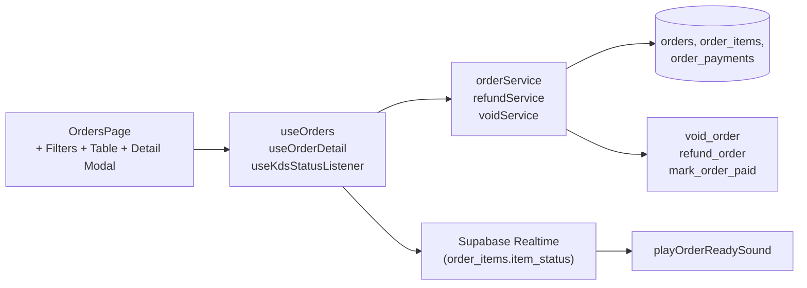

# 02b — Orders (inspection & history)

> **Last verified** : 2026-05-13
> **Structure** : ce fichier fusionne la **vue fonctionnelle** (le *pourquoi* et le *quoi* métier de la page Orders) et la **référence technique** (le *comment* implémenté). Pour la création des commandes au comptoir, voir [`./02-pos-cart-orders.md`](./02-pos-cart-orders.md). Pour les tâches à faire, voir [`../../workplan/backlog-by-module/02b-orders.md`](../../workplan/backlog-by-module/02b-orders.md) (à créer).
> **Related E2E flows** : [01-pos-sale-cash](../08-flows-end-to-end/01-pos-sale-cash.md), [02-pos-sale-split-payment](../08-flows-end-to-end/02-pos-sale-split-payment.md), [07-locked-item-cancel](../08-flows-end-to-end/07-locked-item-cancel.md), [09-refund-flow](../08-flows-end-to-end/09-refund-flow.md).
> **App de rattachement** : Backoffice (`/orders`).

> **En une phrase** : la page Orders est la **tour de contrôle des commandes** de The Breakery — elle transforme le flux brut des tickets caisse en panorama filtrable et temps réel, joue un son quand une commande sort de cuisine, donne au manager les 5 KPI qui décrivent l'état de son service, et permet de traiter en 30 secondes les 95 % d'incidents de comptoir (refund, annulation, retrouvaille d'un ticket) — pour qu'aucune commande ne passe entre les mailles entre la cuisine, la caisse et le client.

---

## Table des matières

- [Partie I — Vue fonctionnelle](#partie-i--vue-fonctionnelle)
  - [1. Raison d'être](#1-raison-dêtre)
  - [2. Les 4 sections de la page](#2-les-4-sections-de-la-page)
  - [3. Les 5 invariants de la page](#3-les-5-invariants-de-la-page)
  - [4. Le Header — La barre d'orientation](#4-le-header--la-barre-dorientation)
  - [5. Les Stats — 5 KPI lus en 3 secondes](#5-les-stats--5-kpi-lus-en-3-secondes)
  - [6. Les Filters — Le pivot par axe d'analyse](#6-les-filters--le-pivot-par-axe-danalyse)
  - [7. La Table — La liste actionnable](#7-la-table--la-liste-actionnable)
  - [8. La modale de détail — La vue 360°](#8-la-modale-de-détail--la-vue-360-dune-commande)
  - [9. Les statuts item-level — La granularité cuisine](#9-les-statuts-item-level--la-granularité-cuisine)
  - [10. Le couplage avec le KDS — Le son et la mise à jour](#10-le-couplage-avec-le-kds--le-son-et-la-mise-à-jour)
  - [11. Le rapport avec les autres modules](#11-le-rapport-avec-les-autres-modules)
  - [12. Mécaniques transverses — Comment la page se comporte](#12-mécaniques-transverses--comment-la-page-se-comporte)
  - [13. Ce que la page ne fait pas (par design)](#13-ce-que-la-page-ne-fait-pas-par-design)
  - [14. Utilisateurs cibles](#14-utilisateurs-cibles)
- [Partie II — Référence technique](#partie-ii--référence-technique)
  - [15. Architecture conceptuelle](#15-architecture-conceptuelle)
  - [16. Diagramme de responsabilité](#16-diagramme-de-responsabilité)
  - [17. Tables DB impliquées](#17-tables-db-impliquées)
  - [18. Hooks principaux](#18-hooks-principaux)
  - [19. Services principaux](#19-services-principaux)
  - [20. Composants UI principaux](#20-composants-ui-principaux)
  - [21. Stores Zustand utilisés](#21-stores-zustand-utilisés)
  - [22. RPCs / Edge Functions](#22-rpcs--edge-functions)
  - [23. RLS & Permissions](#23-rls--permissions)
  - [24. Routes](#24-routes)
  - [25. Pitfalls spécifiques](#25-pitfalls-spécifiques)
- [Partie III — Backlog opérationnel](#partie-iii--backlog-opérationnel)
- [Partie IV — Design & UX](#partie-iv--design--ux)
  - [26. Thèmes et contextes d'affichage](#26-thèmes-et-contextes-daffichage)
  - [27. Écrans du module (1 route principale + modal)](#27-écrans-du-module-1-route-principale--modal)
  - [28. Layout patterns appliqués](#28-layout-patterns-appliqués)
  - [29. Composants UI signature](#29-composants-ui-signature)
  - [30. États visuels critiques](#30-états-visuels-critiques)
  - [31. Couleurs sémantiques utilisées](#31-couleurs-sémantiques-utilisées)
  - [32. Microcopy et empty states](#32-microcopy-et-empty-states)
  - [33. Références visuelles externes](#33-références-visuelles-externes)
  - [34. À faire côté design (backlog UX)](#34-à-faire-côté-design-backlog-ux)

---

# Partie I — Vue fonctionnelle

## 1. Raison d'être

La page Orders est le **tableau de bord opérationnel des commandes** de The Breakery. Elle répond à une question simple mais constante dans le quotidien d'un gérant ou d'un manager de salle :

> *"Qu'est-ce qui se passe en ce moment dans la boutique ? Quelles commandes sont en cours, lesquelles attendent un paiement, lesquelles sortent de la cuisine, qu'est-ce qu'on a vendu aujourd'hui ?"*

C'est l'écran qui transforme **un flux de tickets caisse anonymes** en **un panorama lisible et actionnable** : par statut, par type, par paiement, par client. Sans lui, le gérant doit aller voir la cuisine *et* la caisse *et* le KDS pour reconstituer mentalement l'activité ; avec lui, il a en une page la même information consolidée.

La page est à mi-chemin entre **opérationnel** (suivi temps réel des commandes en cours) et **historique** (consultation des ventes du jour, de la semaine, du mois). Le même écran sert au manager qui supervise le rush et au gérant qui clôture sa journée.

---

## 2. Les 4 sections de la page

La page est structurée en **4 blocs verticaux** lus de haut en bas :

| Section | Job-to-be-done |
|---|---|
| **Header** | Indicateur d'activité Realtime, bouton refresh, accès rapide aux actions |
| **Stats** | 5 KPI cards : total commandes, montant total, taux de complétion, payées vs impayées |
| **Filters** | Filtres status, type, payment, search, date range |
| **Table** | Liste des commandes paginées, clic pour ouvrir le détail |

Une **modale de détail** se superpose à la liste quand on clique sur une commande, sans changer de page.

---

## 3. Les 5 invariants de la page

Quel que soit le contexte d'utilisation, la page garantit toujours les mêmes mécaniques :

1. **Mise à jour temps réel**. La page s'auto-rafraîchit via un listener sur les changements KDS (`useKdsStatusListener`) et joue un **son** quand une commande passe en `ready` cuisine — le manager n'a pas besoin de cliquer "Refresh" pour voir l'état actuel.
2. **Pagination défensive**. Maximum 500 commandes chargées par requête (limite serveur), avec pagination cliente — la page reste rapide même un samedi à 18h.
3. **Filtre par défaut : aujourd'hui**. À l'ouverture, la page n'affiche que les commandes du jour — c'est 95 % du cas d'usage et ça évite de noyer l'utilisateur dans l'historique.
4. **Une seule source de vérité**. Les statuts affichés (`status`, `payment_status`, `item_status`) sont ceux de la base — pas de cache local divergent. Une commande payée à la caisse apparaît payée sur la page Orders à la seconde suivante.
5. **Read-mostly**. La page est principalement de la consultation. Les actions destructives (annulation, refund, modification) passent par la modale détail et exigent un PIN manager — pas de bouton "delete" sur la ligne.

---

## 4. Le Header — La barre d'orientation

En haut de page, une bande compacte qui sert de **repère permanent** :

- Titre "Orders" + badge "Live" indiquant que Realtime est connecté.
- Compteur de commandes affichées (sur les 500 maximum).
- Bouton **Refresh** manuel (en cas de doute sur le Realtime).
- Indicateur de chargement (`isFetching`) discret pendant les requêtes.
- Bouton secondaire pour exporter la sélection en CSV (utile pour le comptable).

Bénéfice métier : **savoir tout de suite si la page est synchronisée avec la réalité**. Le badge "Live" actif rassure le gérant que ce qu'il voit est ce qui se passe.

---

## 5. Les Stats — 5 KPI lus en 3 secondes

Une rangée de cartes condensées affiche les **chiffres clés du périmètre filtré** :

| KPI | Définition | À quoi ça sert |
|---|---|---|
| **Total** | Nombre de commandes dans le périmètre filtré | Volume brut du jour / de la période |
| **Total Amount** | Somme du `total` (taxe PB1 10% incluse) | Chiffre d'affaires brut |
| **Completion Rate** | Pourcentage de commandes en statut `completed` ou `paid` | Santé du flux opérationnel — si <80 %, c'est qu'il y a un blocage |
| **Paid count + amount** | Combien de commandes encaissées et combien d'argent rentré | Trésorerie réalisée |
| **Unpaid count + amount** | Combien de commandes pas encore payées et combien d'argent en attente | Encours du jour (ardoises, B2B différé, en cours d'encaissement) |

Les chiffres se **recalculent à la volée** dès qu'on change un filtre. Changer la date → les KPI suivent.

Bénéfice métier : **transformer 200 lignes de commandes en 5 chiffres parlants**. Le gérant qui ouvre la page à 14h sait en 3 secondes que sa matinée a fait 4,5M IDR sur 80 tickets dont 12 encore à encaisser.

---

## 6. Les Filters — Le pivot par axe d'analyse

Une rangée de filtres permet de croiser les axes d'analyse :

### 6.1 Status

Filtrer par statut de commande. Les statuts disponibles :

| Statut | Signification métier |
|---|---|
| **All** | Tout afficher |
| **Pending** | Créée mais pas encore en cuisine (rare, transitoire) |
| **Preparing** | En cours de préparation cuisine / KDS |
| **Ready** | Prête à être servie / remise au client |
| **Completed** | Servie et payée — vie de la commande terminée |
| **Voided** | Annulée (par manager, PIN exigé) |
| **Refunded** | Remboursée |

Bénéfice : **filtrer instantanément** ce qui demande une action (Preparing, Ready) vs ce qui est consultable (Completed).

### 6.2 Order Type

Filtrer par type de commande :

- **Dine-in** — service en salle, payée souvent en fin de repas.
- **Takeaway** — emporter, payée d'avance.
- **Delivery** — livraison.
- **B2B** — commande wholesale liée au module B2B.

Bénéfice : isoler les flux selon la logique de paiement (en différé pour le dine-in, immédiat pour le takeaway).

### 6.3 Payment Status

- **All** / **Paid** / **Unpaid** / **Partial**.

Bénéfice : retrouver les **ardoises et impayés** d'un coup, indépendamment du statut opérationnel.

### 6.4 Search

Recherche libre sur :

- Numéro de commande (`order_number`).
- Nom du client (`customer_name`).
- Numéro de table (`table_number`).

Bénéfice : **retrouver une commande spécifique en 5 secondes** quand un client se présente avec son ticket ("j'ai commandé tout à l'heure sous le nom de Maya").

### 6.5 Date Range

Plage de dates `from` / `to`, par défaut "today only".

Bénéfice : **basculer entre temps réel** (aujourd'hui) **et historique** (semaine, mois) sur le même écran, sans changer de page.

---

## 7. La Table — La liste actionnable

La table affiche une **ligne par commande** avec les colonnes les plus utiles :

- **Order #** — numéro de commande (cliquable).
- **Heure** — heure de création.
- **Type** — badge dine-in / takeaway / delivery / B2B.
- **Table / Client** — si dine-in, numéro de table ; sinon nom client.
- **Items count** — nombre d'items dans la commande.
- **Total** — montant total tax incluse, formaté IDR.
- **Status** — badge coloré.
- **Payment** — badge paid / unpaid / partial.
- **Actions** — bouton "Voir détail" (ouvre la modale).

Comportements :

- **Tri** par date décroissante (la plus récente en haut) par défaut.
- **Pagination** côté client (page taille configurée dans `ITEMS_PER_PAGE`).
- **Clic ligne** → ouvre la modale détail.
- **Coloration douce** des lignes selon le statut (subtile, pour ne pas saturer l'œil).

Bénéfice métier : **scroller un service entier en quelques secondes**, repérer l'anormal (une commande à 1M IDR sortant du gabarit, un dine-in encore impayé deux heures après) et plonger dans le détail au clic.

---

## 8. La modale de détail — La vue 360° d'une commande

Au clic sur une ligne, une modale s'ouvre **par-dessus la liste** sans navigation, et affiche toutes les informations d'une commande :

### 8.1 Bloc Header

- Numéro, type, statut, statut paiement.
- Heure de création, heure de complétion.
- Table / client / nom personnalisé.

### 8.2 Bloc Items

Liste détaillée des items :

- Nom du produit, quantité, prix unitaire.
- **Modifiers** appliqués (sucre +, lait d'amande, sans glace…) avec leur surcoût.
- **Item status** indépendant par item : `pending`, `preparing`, `ready`, `served`, `cancelled`.
- **Dispatch station** : à quelle station KDS l'item est routé (boissons, cuisine chaude, pâtisserie…).

C'est crucial pour une commande dine-in où une partie peut être servie pendant que l'autre est encore en cuisine.

### 8.3 Bloc Financial

- Subtotal.
- Discount appliqué.
- Service charge (si applicable).
- Tax PB1 (10% inclus, calculée comme `total × 10/110`).
- Total.
- Méthode de paiement, cash reçu, monnaie rendue.

### 8.4 Bloc Actions

Selon le statut et les permissions :

- **Imprimer reçu** (re-print depuis le journal).
- **Imprimer ticket cuisine** (re-print kitchen ticket).
- **Annuler la commande** (exige PIN manager + raison obligatoire).
- **Refund partiel ou total** (exige PIN manager + raison).
- **Marquer payée** (pour les ardoises encaissées plus tard).
- **Modifier le client** (rattacher une commande anonyme à un client après coup).

Toutes ces actions sont **tracées dans l'audit log** avec qui-quoi-quand.

Bénéfice métier : **résoudre 95 % des situations de comptoir sans changer d'écran**. Un client revient pour un remboursement → retrouver la commande, vérifier les items, traiter le refund en moins de 30 secondes.

---

## 9. Les statuts item-level — La granularité cuisine

Spécificité du module : une commande n'a pas un seul statut, elle en a deux niveaux :

- **Order status** — état global de la commande (pending / preparing / ready / completed).
- **Item status** par ligne — état individuel de chaque item (pending / preparing / ready / served / cancelled).

Pourquoi : un cappuccino sort de la machine en 1 minute, un croque-monsieur prend 8 minutes au four. Tracer un seul statut sur la commande masquerait que le client peut déjà avoir son café devant lui pendant qu'il attend son sandwich.

Avantage métier :

- Le serveur sait quoi apporter à quel moment.
- Le client a la moitié de sa commande tout de suite (perception de service rapide).
- Le KDS reflète la réalité granulaire de la cuisine.

La page Orders **affiche ces statuts dans la modale détail** mais ne les agrège pas dans le statut commande — la commande passe à `ready` quand **tous** ses items sont `ready`.

---

## 10. Le couplage avec le KDS — Le son et la mise à jour

Le hook `useKdsStatusListener` écoute en permanence les changements de statut KDS et déclenche :

- Un **rafraîchissement automatique** de la liste (invalidation de la query React Query).
- Un **bip sonore** (`playOrderReadySound`) quand un item passe en `ready` cuisine — le manager entend l'événement même s'il regarde un autre écran.

Configurable : le son peut être désactivé dans Settings → POS Configuration (toggle "Sound notifications").

Bénéfice métier : **le manager n'a pas besoin de fixer la page**. Il vaque à ses tâches, et le bip le ramène à la page Orders quand quelque chose change.

---

## 11. Le rapport avec les autres modules

| Module | Relation |
|---|---|
| **POS** | Les commandes affichées sont créées au POS — la page Orders en est la **vue d'inspection**, jamais la création. Voir [`./02-pos-cart-orders.md`](./02-pos-cart-orders.md). |
| **KDS** | Les changements de statut KDS se propagent en direct à la page Orders. Voir [`./04-kds-kitchen.md`](./04-kds-kitchen.md). |
| **B2B** | Les commandes B2B sont visibles ici avec le type `b2b` ; mais leur cycle complet (livraisons, paiements échelonnés) se gère dans le module B2B. Voir [`./09-b2b-wholesale.md`](./09-b2b-wholesale.md). |
| **Customers** | Une commande est rattachable à un client → la page Orders permet de **lier après coup** une commande anonyme à un client (pour fidélité). Voir [`./08-customers-loyalty.md`](./08-customers-loyalty.md). |
| **Accounting** | Une commande `completed` + `paid` déclenche automatiquement les écritures journal (revenu, taxe PB1, encaissement). Voir [`./10-accounting-double-entry.md`](./10-accounting-double-entry.md). |
| **Reports** | Les reports ventes consomment la même table `orders` que la page Orders — mais avec une vue agrégée (KPI, graphique) plutôt que la liste détaillée. Voir [`./14-reports-analytics.md`](./14-reports-analytics.md). |
| **Payments** | La modale détail expose les `order_payments` (split, refunds, monnaie rendue). Voir [`./03-payments-split.md`](./03-payments-split.md). |

---

## 12. Mécaniques transverses — Comment la page se comporte

### 12.1 Limites de performance

- Maximum **500 commandes** par requête. Au-delà, la pagination serveur prend le relais.
- Pagination cliente sur la sélection retournée pour la fluidité du scroll.
- Date range par défaut "aujourd'hui" pour ne pas tirer 30 jours de données inutilement.

### 12.2 Erreurs et recovery

- Erreurs Supabase logguées via `logError` + remontées dans Sentry (`@sentry/react`).
- En cas d'erreur de chargement, la page affiche un message + le bouton Refresh — pas de page blanche.
- Si Realtime se déconnecte, le badge "Live" s'éteint — l'utilisateur peut continuer à utiliser la page en mode "manuel" avec le bouton Refresh.

### 12.3 Permissions

- Accès via `sales.view` (lecture).
- Action "Annuler" exige `sales.void` **et** PIN manager.
- Action "Refund" exige `sales.refund` **et** PIN manager.
- Export CSV exige `reports.sales`.

---

## 13. Ce que la page ne fait pas (par design)

- La page **ne crée pas de commande**. La création se fait au POS, jamais ici.
- La page **ne modifie pas les items** d'une commande (ajouter / retirer un produit). Pour ajouter un item, il faut retourner au POS sur la commande ouverte.
- La page **n'imprime pas en masse**. L'impression est ticket par ticket via la modale.
- La page **ne fait pas d'analytics avancée**. Pas de graphique, pas de comparaison période — c'est le rôle du module Reports.
- La page **ne change pas l'item status en direct**. Le KDS est la seule interface qui pilote `item_status` côté cuisine.
- La page **ne supporte pas l'export PDF**. CSV uniquement (PDF est dans Reports avec mise en forme).

---

## 14. Utilisateurs cibles

| Rôle | Ce qu'il fait dans la page |
|---|---|
| **Manager de salle** | Surveille les commandes en cours pendant le rush (Preparing / Ready), repère les anomalies (dine-in trop long, impayé qui traîne), valide annulations / refunds via PIN. |
| **Gérant / Owner** | Consulte les KPI agrégés du jour, exporte CSV pour le comptable, audite les voids / refunds via la modale détail. |
| **Comptable** | Filtre par date range mensuel, exporte CSV pour rapprochement avec les écritures comptables. |
| **Cashier (lecture)** | Recherche rapide par numéro / nom client pour retrouver un ticket à reimprimer ou pour comprendre un litige client. |
| **Serveur** | Vérifie l'item status d'une commande dine-in pour savoir quoi apporter à la table. |

---

# Partie II — Référence technique

> **TODO** : référence technique à rédiger à partir du code existant — `src/pages/Orders.tsx`, `src/hooks/orders/*`, `src/components/orders/*`, `useKdsStatusListener`. Cette section est une **stub structurée** : les chemins exacts, signatures de hooks et noms de composants doivent être vérifiés contre le code avant publication.

## 15. Architecture conceptuelle

La page Orders est une **vue read-mostly** assise sur :

1. **Une query React Query** sur la table `orders` (avec join sur `order_items` et `order_payments`) — limite 500 lignes, filtre par défaut "today only".
2. **Un listener Realtime** via `useKdsStatusListener` qui invalide la query à chaque changement KDS et joue un son sur `ready`.
3. **Un store local de filtres** (useState ou Zustand léger) pour status, type, payment_status, search, date range.
4. **Une modale détail** ouverte via state local, chargeant à la demande les `order_payments` et `order_items` non-stockés dans la liste.
5. **Des actions sensibles** (void, refund, mark paid) qui passent par `PinVerificationModal` puis appellent des RPC dédiées (`void_order`, `refund_order`).

---

## 16. Diagramme de responsabilité



---

## 17. Tables DB impliquées

| Table | Rôle | Lien |
|---|---|---|
| `orders` | Source primaire de la liste (status, type, total, customer, staff, session) | [details](../03-database/02-tables-reference.md#orders) |
| `order_items` | Items détaillés affichés dans la modale (modifiers, item_status, dispatch_station) | [details](../03-database/02-tables-reference.md#order_items) |
| `order_payments` | Paiements multi-lignes affichés dans bloc Financial de la modale | [details](../03-database/02-tables-reference.md#order_payments) |
| `order_activity_log` | Audit trail consultable depuis la modale (qui a fait quoi quand) | [details](../03-database/02-tables-reference.md#order_activity_log) |
| `customers` | Join pour afficher le nom client dans la table | [details](../03-database/02-tables-reference.md#customers) |
| `pos_sessions` | Join pour afficher la session caisse / cashier | [details](../03-database/02-tables-reference.md#pos_sessions) |
| `audit_logs` | Trace des actions sensibles (void, refund, edit customer) | [details](../03-database/02-tables-reference.md#audit_logs) |

---

## 18. Hooks principaux

> **TODO** : vérifier chemins exacts et signatures dans `src/hooks/orders/*` et `src/pages/Orders.tsx`.

| Hook (présumé) | Chemin présumé | Rôle |
|---|---|---|
| `useOrders` | `src/hooks/orders/useOrders.ts` | Query principale avec filtres (status, type, payment_status, date range, search) — limite 500 |
| `useOrderDetail` | `src/hooks/orders/useOrderDetail.ts` | Chargement détaillé d'une commande (items + payments + activity log) à l'ouverture de la modale |
| `useOrderStats` | `src/hooks/orders/useOrderStats.ts` | Agrégation des 5 KPI à partir de la sélection courante |
| `useKdsStatusListener` | `src/hooks/pos/useKdsStatusListener.ts` | Listener Realtime partagé avec POS — invalide la query Orders et joue le son `ready` |
| `useOrderActions` | `src/hooks/orders/useOrderActions.ts` | Wrappers `voidOrder`, `refundOrder`, `markPaid`, `relinkCustomer` (avec PIN manager) |
| `useExportOrdersCSV` | `src/hooks/orders/useExportOrdersCSV.ts` | Export CSV de la sélection filtrée |

---

## 19. Services principaux

> **TODO** : vérifier `src/services/orders/*` et `src/services/pos/orderService.ts`.

| Service (présumé) | Chemin présumé | Rôle |
|---|---|---|
| `orderService` | `src/services/pos/orderService.ts` | Partagé avec POS — `getOrder`, `getOrders`, `markOrderPaid` |
| `refundService` | `src/services/pos/refundService.ts` | Flow refund (partiel / total) avec PIN manager + audit |
| `voidService` | `src/services/orders/voidService.ts` (à confirmer) | Flow void avec stock reversal + loyalty reversal + JE contre-passation |
| `orderActivityService` | `src/services/pos/orderActivityService.ts` | Lecture de l'activity log pour la timeline d'une commande |
| `ordersCsvExporter` | `src/services/orders/ordersCsvExporter.ts` (à confirmer) | Sérialisation CSV avec mapping localisé |

---

## 20. Composants UI principaux

> **TODO** : vérifier `src/components/orders/*` et `src/pages/Orders.tsx`.

| Composant (présumé) | Chemin présumé | Rôle |
|---|---|---|
| `OrdersPage` | `src/pages/Orders.tsx` | Page racine, orchestration filtres + table + modale |
| `OrderStatsRow` | `src/components/orders/OrderStatsRow.tsx` | 5 KPI cards en row |
| `OrderFiltersBar` | `src/components/orders/OrderFiltersBar.tsx` | Status / Type / Payment / Search / DateRange |
| `OrdersTable` | `src/components/orders/OrdersTable.tsx` | Table principale avec sort + pagination cliente |
| `OrderRow` | `src/components/orders/OrderRow.tsx` | Ligne avec badges colorés et bouton détail |
| `OrderDetailModal` | `src/components/orders/OrderDetailModal.tsx` | Modale 360° (header + items + financial + actions) |
| `OrderItemsList` | `src/components/orders/OrderItemsList.tsx` | Liste items avec item_status + dispatch_station |
| `OrderFinancialBlock` | `src/components/orders/OrderFinancialBlock.tsx` | Subtotal / discount / tax / total / payments breakdown |
| `OrderActionsBlock` | `src/components/orders/OrderActionsBlock.tsx` | Boutons void / refund / mark paid / relink customer (avec PIN) |
| `OrderActivityTimeline` | `src/components/orders/OrderActivityTimeline.tsx` | Timeline des changements de statut |
| `OrderStatusBadge` | `src/components/orders/OrderStatusBadge.tsx` | Badge coloré par statut |
| `PaymentStatusBadge` | `src/components/orders/PaymentStatusBadge.tsx` | Badge paid / unpaid / partial |

---

## 21. Stores Zustand utilisés

> **TODO** : à vérifier — la page Orders pourrait n'utiliser que React Query + useState local pour les filtres, sans store Zustand dédié.

| Store (présumé) | Rôle |
|---|---|
| `ordersFiltersStore` (à confirmer) | Filtres persistés entre sessions (date range, status préféré) |
| `useAuthStore` | Résolution `user.id` pour les actions et l'audit |

Cache React Query : stale-time ~10s pour la liste (Realtime invalide), 60s pour les détails modale.

---

## 22. RPCs / Edge Functions

> **TODO** : vérifier exactement quelles RPC sont appelées depuis la page Orders.

| Type | Nom | Rôle |
|---|---|---|
| RPC | `void_order(p_order_id, p_reason, p_manager_user_id)` | Annule la commande, ré-crédite le stock, retire les points fidélité, génère JE contre-passation |
| RPC | `refund_order(p_order_id, p_items[], p_method, p_reason)` | Refund partiel ou total, génère `order_payments` négatif et JE |
| RPC | `mark_order_paid(p_order_id, p_payments[])` | Solde une commande `unpaid` (B2B / outstanding) |
| RPC | `relink_order_customer(p_order_id, p_customer_id)` | Rattache une commande anonyme à un client (avec attribution rétroactive des points fidélité) |
| Edge Function | `send-to-printer` | Re-print reçu / kitchen ticket depuis la modale |

Voir [`../03-database/03-rpc-functions.md`](../03-database/03-rpc-functions.md) et [`../05-integrations/02-edge-functions.md`](../05-integrations/02-edge-functions.md).

---

## 23. RLS & Permissions

Permission codes : `sales.view`, `sales.void`, `sales.refund`, `sales.update`, `reports.sales`.

Pattern RLS (héritage du module POS) :
```sql
ALTER TABLE public.orders ENABLE ROW LEVEL SECURITY;
CREATE POLICY "Authenticated read" ON public.orders FOR SELECT USING (public.is_authenticated());
CREATE POLICY "Sales void" ON public.orders FOR UPDATE USING (
  public.user_has_permission(auth.uid(), 'sales.void')
  AND status IN ('completed', 'preparing', 'ready')
);
CREATE POLICY "Sales refund" ON public.orders FOR UPDATE USING (
  public.user_has_permission(auth.uid(), 'sales.refund')
  AND status = 'completed'
);
```

Le **manager PIN override** déverrouille temporairement `sales.void` / `sales.refund` pour un cashier sans permission native — tracé dans `audit_logs`.

---

## 24. Routes

| Route | Page component | Guard |
|---|---|---|
| `/orders` | `src/pages/Orders.tsx` | `RouteGuard permission="sales.view"` + `ModuleErrorBoundary moduleName="Orders"` |

Pas de sous-routes : la modale détail est gérée par state local, pas par URL. La page est mono-route.

---

## 25. Pitfalls spécifiques

> **TODO** : compléter après audit du code. Les pitfalls ci-dessous sont **inférés** du contexte métier et de la pratique POS adjacente.

- **Limite 500 commandes** : la query a une `.limit(500)` côté serveur. Au-delà, l'utilisateur ne voit pas le reste sans changer la date range. Il faut afficher un warning UI explicite "Showing first 500 of N orders — narrow the date range to see more".
- **Realtime can drop silently** : `useKdsStatusListener` peut perdre la connexion sans erreur visible. Si le badge "Live" devient gris, l'utilisateur doit cliquer Refresh — sinon les nouveaux statuts n'arrivent jamais.
- **Item status agrégation côté client** : l'order status (`ready`) est calculé depuis le `MIN(item_status)` côté client, donc une commande peut paraître `ready` côté Orders alors que côté KDS un item est encore `preparing` si la query Orders est stale.
- **Tax PB1 est INCLUSE** dans `total`. Ne pas re-calculer 10% sur le subtotal pour afficher la taxe — utiliser `tax = total × 10/110`. Sinon double-comptabilisation visible.
- **`order_activity_log` peut être volumineux** : pour une commande modifiée 30 fois, la timeline charge 30 events. Paginer côté client si > 50.
- **Permission cascade** : un cashier sans `sales.refund` voit le bouton "Refund" disabled. Avec PIN manager, le bouton devient actif — mais le bouton lui-même doit afficher un tooltip "Manager PIN required" pour éviter la confusion.
- **CSV export depuis backoffice** : encoding UTF-8 BOM nécessaire pour Excel Windows (sinon caractères accentués cassés).
- **Date range côté client vs serveur** : si l'utilisateur choisit "Last 30 days" puis 10 commandes arrivent en temps réel, le scope grandit. Décider explicitement si Realtime injecte hors du range courant ou pas (recommandé : oui, mais avec badge "New since you opened the page").
- **Filtre Search côté client uniquement** : la recherche par order_number / customer_name / table_number filtre la sélection déjà chargée. Une commande hors des 500 ne sera jamais trouvée par search — il faut élargir la date range d'abord.
- **Action "Mark paid"** sur une commande B2B : doit déclencher la même cascade que `pay_existing_order` (création JE encaissement, attribution points fidélité, etc.) — vérifier que la RPC utilisée ne raccourcit pas le flow.

---

# Partie III — Backlog opérationnel

Backlog métier (priorités R/O/Y/G) — les tâches techniques détaillées (filtres avancés, bulk actions, heatmap, édition après coup, vue calendrier, export PDF par commande, lien direct vers KDS) restent à formaliser dans :

→ [`../../workplan/backlog-by-module/02b-orders.md`](../../workplan/backlog-by-module/02b-orders.md) *(à créer)*

| Priorité | Évolution | Bénéfice attendu |
|---|---|---|
| 🔴 | **Filtre par cashier / serveur** | Voir d'un coup toutes les commandes d'un staff (audit, performance). |
| 🔴 | **Bulk actions** | Marquer payées plusieurs commandes d'un coup (utile pour solder des ardoises de groupe). |
| 🟠 | **Heatmap visuelle des commandes en cours** | Vue compacte montrant l'âge de chaque commande (vert / orange / rouge selon attente). |
| 🟠 | **Filtre rapide "Mes commandes"** | Pour un serveur, ne voir que les commandes qu'il a saisies. |
| 🟠 | **Notification toast riche** | À chaque commande qui passe en `ready`, afficher un toast cliquable qui ouvre la modale détail. |
| 🟡 | **Édition de la commande après coup** | Ajouter / retirer un item avec PIN manager + audit, sans devoir voider et recréer. |
| 🟡 | **Vue calendrier des commandes différées** | Pour les pré-commandes / réservations, voir le planning visuel des prochains jours. |
| 🟢 | **Export PDF par commande** | Re-générer le ticket en PDF pour envoi par e-mail au client. |
| 🟢 | **Lien direct vers le KDS** | Un bouton "voir au KDS" qui ouvre la station correspondante avec l'item surligné. |

---

# Partie IV — Design & UX

> **Source canonique** : [`../../DESIGN_POS_AND_BACKOFFICE.md`](../../DESIGN_POS_AND_BACKOFFICE.md) §4.3 (pages liste — pattern récurrent) et §4.4 (pages détail — pattern récurrent).
> **Tokens techniques** : [`../../../DESIGN.md`](../../../DESIGN.md) (variables CSS, scales, classes Tailwind).
> **Screenshots de référence** : [`../../ux/assets/screens/backoffice/`](../../ux/assets/screens/backoffice/) — source de vérité visuelle Backoffice.

## 26. Thèmes et contextes d'affichage

La page Orders vit **uniquement dans le Backoffice** — thème `.theme-backoffice` clair (ivoire `#F8F8F6`).

| Contexte | Thème CSS | Pages concernées | Identité |
|---|---|---|---|
| **Backoffice** | `.theme-backoffice` (ivoire `#F8F8F6`) | `/orders` | Salle de commandement claire, table dense, modale détail centrée |

L'or `#C9A55C` reste constant (boutons primaires, totaux, statut actif). Voir [`../../DESIGN_POS_AND_BACKOFFICE.md`](../../DESIGN_POS_AND_BACKOFFICE.md) §4 (Backoffice — La salle de commandement claire).

---

## 27. Écrans du module (1 route principale + modal)

| Route / Surface | Type d'écran | Densité | Composants signature |
|---|---|---|---|
| `/orders` | Liste paginée + KPI cards + filtres | Haute | `OrderStatsRow`, `OrderFiltersBar`, `OrdersTable`, `OrderStatusBadge`, `PaymentStatusBadge` |
| `OrderDetailModal` (modal overlay) | Modale 360° centrée | Très haute | `OrderItemsList`, `OrderFinancialBlock`, `OrderActionsBlock`, `OrderActivityTimeline` |

---

## 28. Layout patterns appliqués

### 28.1 Page liste — Pattern récurrent Backoffice

Pattern décrit en [`../../DESIGN_POS_AND_BACKOFFICE.md`](../../DESIGN_POS_AND_BACKOFFICE.md) §4.3 :

1. **Header de page** : titre "Orders" + sous-titre "Live operations dashboard — today's activity" + actions à droite (badge "Live" avec pastille verte clignotante, bouton Refresh, bouton Export CSV).
2. **Stats cards** en row (5 KPI compactes) — `Total orders`, `Total amount`, `Completion rate`, `Paid (count + amount)`, `Unpaid (count + amount)`. Cards uniformes blanches avec ombre douce, icône en haut à gauche, label uppercase wide tracking en gris, valeur en très gros caractère noir + `Rp` en or pour les montants.
3. **Filters bar** : Status dropdown + Type dropdown + Payment dropdown + Search input + DateRangePicker + bouton "Reset filters".
4. **Table** principale : header sticky, lignes en `surface-1` alternées doucement, hover row `surface-2`, badges colorés pour status / payment_status, action "View detail" en fin de ligne (icône kebab + click row).
5. **Pagination** en bas : navigation page + sélecteur "Items per page" (défaut 25).
6. **Export CSV** déjà dans le header (`top-right`).

### 28.2 Modale détail — Pattern fiche centrée

Pattern décrit en §4.4 :

1. **Header modale** : numéro commande `#4315` en Playfair italique + close button + badges status / payment / type.
2. **Bloc identité** : créée à 14h22, complétée à 14h28, par Mamat sur Terminal-1, Table T12.
3. **Tabs horizontaux** : Items / Financial / Activity log / Actions. Onglet actif = bordure inférieure gold 2px + texte gold-dark.
4. **Content par tab** :
   - **Items** : liste détaillée avec qty, modifiers en sous-ligne couleur d'accent, item_status badge par ligne, dispatch_station chip.
   - **Financial** : breakdown clair Subtotal / Discount / Service charge / Tax PB1 / Total + détail payments (cash reçu, monnaie rendue, méthode).
   - **Activity log** : timeline verticale avec icônes Lucide (Plus pour add, Pencil pour edit, X pour cancel) + horodatage + user.
   - **Actions** : grid de boutons (Print receipt / Print kitchen ticket / Void / Refund / Mark paid / Relink customer) — actions sensibles avec icône cadenas si permission manquante.
5. **Footer modale** : bouton "Close" à gauche (`text-secondary`), pas de bouton primaire global (chaque action a son propre bouton dans le tab Actions).

### 28.3 Header avec Live indicator

- Pastille verte clignotante quand Realtime connecté (`pulse animation`).
- Pastille rouge si déconnecté + tooltip "Reconnecting…".
- Compteur "Showing 234 of 500" si proche limite, en `text-secondary`.
- Bouton Refresh avec spinner pendant `isFetching`.

---

## 29. Composants UI signature

| Composant | Type | Usage | Style clé |
|---|---|---|---|
| `OrderStatsRow` | Row de 5 KPI cards | Header de page | Cards blanches uniformes, icône Lucide top-left, valeur en `text-3xl` + `Rp` en or pour montants |
| `OrderFiltersBar` | Filters horizontaux | Sous les stats | 5 contrôles compacts, `Reset filters` à droite (texte gris cliquable) |
| `OrderStatusBadge` | Badge coloré | Table + modale header | `bg-{status}-bg text-{status}-text border border-{status}-border`, jamais d'aplat saturé |
| `PaymentStatusBadge` | Badge coloré | Table + modale financial | Idem mais palette payment (paid green / unpaid red / partial yellow) |
| `OrdersTable` | Table dense | Corps de page | Header sticky, row hover `surface-2`, sort indicators dans le header |
| `OrderDetailModal` | Modal centrée | Click sur ligne | Fond `surface-1`, blur derrière, header Playfair, tabs avec bordure gold 2px |
| `OrderItemsList` | Liste détaillée | Tab Items de la modale | Une ligne par item avec qty bold préfixe + nom + modifiers sous-ligne accent + item_status badge à droite |
| `OrderFinancialBlock` | Card breakdown | Tab Financial | Lignes alignées droite en JetBrains Mono pour les montants, TOTAL en gros + or |
| `OrderActivityTimeline` | Timeline verticale | Tab Activity log | Ligne verticale avec dots et icônes Lucide, timestamps en `text-secondary` |
| `OrderActionsBlock` | Grid de boutons | Tab Actions | 2×3 grid avec icônes, boutons disabled si permission manquante (avec tooltip) |
| `DateRangePicker` | Popover calendrier | Filters bar | Calendrier double mois + presets (Today, Yesterday, Last 7 days, This month) |
| `LiveIndicator` | Pastille + texte | Header de page | Pulse animation verte si connecté, rouge si déconnecté |

---

## 30. États visuels critiques

| État | Visuel | Pourquoi |
|---|---|---|
| **Realtime connected** | Pastille verte avec `pulse` animation + texte "Live" en `text-success` | Rassure le manager que la page suit le réel |
| **Realtime disconnected** | Pastille rouge fixe + texte "Reconnecting…" + bouton Refresh en gold | Alerte l'utilisateur de la déconnexion |
| **Order ready** | Ligne table avec border-left vert 3px + animation flash subtil (1s) à l'arrivée du Realtime event | Attire l'œil sans perturber le scroll |
| **Order voided** | Ligne table en opacity 60% + strikethrough sur le total + badge rouge "VOIDED" | Indique visuellement la mort de la commande |
| **Order unpaid (aging)** | Badge payment + cellule "Created at" colorée selon l'âge (vert <30min, orange 30-120min, rouge >120min pour dine-in) | Repère visuel d'incident |
| **Loading state** | Skeleton lines (5-10) pour la table + skeleton cards pour les KPI | Charger sans flash blanc |
| **Empty state filtered** | Centre de la table : icône `SearchX` grise + "No orders match your filters" + bouton "Reset filters" | Guide l'utilisateur vers l'action |
| **Empty state date range** | Centre de la table : icône `Calendar` grise + "No orders in this period" + bouton "Switch to today" | Pour les dates passées vides |
| **Pagination limit hit** | Banner gold/10 au-dessus de la table : "Showing first 500 of 1234 orders — narrow the date range to see more" | Transparence sur la limite serveur |
| **Action permission denied** | Bouton action disabled + tooltip "Manager PIN required" + icône cadenas | Indique qu'une élévation est possible |
| **PIN verification in modal** | Inset modal numpad par-dessus la modale détail, fond noir 80%, blur du contenu derrière | Interruption claire pour l'auth |
| **CSV export running** | Bouton Export en spinner + progress hint "Generating CSV…" | Feedback pour les gros exports |
| **Sound on ready** | Pas de visuel, mais bip discret + (optionnel) toast non-intrusif "Order #4314 ready at Hot Kitchen" | Augmente la conscience situationnelle sans saturer l'écran |

---

## 31. Couleurs sémantiques utilisées

| Rôle | Backoffice (light) | Usage Orders |
|---|---|---|
| **Success** | `#16A34A` | Status `completed`, payment `paid`, Realtime "Live" badge, completion rate >90% |
| **Warning** | `#D97706` | Status `preparing`, payment `partial`, aging 30-120min, completion rate 70-90% |
| **Error** | `#DC2626` | Status `voided` / `refunded`, payment `unpaid` aged >120min, Realtime disconnected, completion rate <70% |
| **Info** | `#2563EB` | Status `ready` (en attente service), order type `b2b`, items info chips |
| **Gold** | `#C9A55C` | Bouton primary "Export CSV", totaux dans KPI cards, navigation tab actif modale, "Mark paid" button |

Les **status colors** sont déclinées en `-bg` (pale), `-text` (saturé), `-border` (intermédiaire) pour les badges arrondis non-aplats.

---

## 32. Microcopy et empty states

### Empty states

| Contexte | Texte | CTA |
|---|---|---|
| Aucune commande aujourd'hui | "No orders yet today" + icône `Coffee` grise | "Open POS" (lien vers `/pos`) |
| Filtres trop restrictifs | "No orders match your filters" + icône `SearchX` grise | "Reset filters" |
| Date range vide (passé) | "No orders in this period" + icône `Calendar` grise | "Switch to today" |
| Date range futur | "No orders scheduled" + icône `CalendarPlus` grise | — |
| Modale items vide (rare) | "This order has no items" + icône `PackageOpen` grise | — |
| Activity log vide | "No activity logged for this order" | — |
| Realtime degraded | "Live updates paused — click Refresh or check your connection" + icône `WifiOff` | "Refresh now" |

### Confirmations destructives

- **Void order** : "Voiding will reverse stock, remove loyalty points, and post a reversal journal entry. This action is irreversible. Reason required."
- **Refund order (total)** : "This will refund Rp 245,000 to the original payment method (Cash) and post a journal entry. Continue?"
- **Refund order (partial)** : "Refund {amount} for {item_count} items? The remaining order stays completed."
- **Mark paid (B2B)** : "Mark this outstanding order as paid? A journal entry will be created and loyalty points (if applicable) attributed."
- **Relink customer** : "Linking to customer Maya will retroactively attribute 24 loyalty points. Continue?"

### Toast notifications

- Voided success : "Order #4315 voided — stock reversed, JE posted"
- Refund success : "Refund of Rp 50,000 processed — receipt printed"
- Mark paid : "Order #4310 marked paid — payment method: Cash"
- CSV export ready : "CSV exported (234 rows) — check your downloads"
- Realtime reconnected : "Connection restored — refreshing orders…"
- Order ready (sound) : "Order #4314 ready at Hot Kitchen"
- Search no results (inline) : "No orders found matching 'Maya' in this period"
- PIN failed : "Incorrect manager PIN — try again"

### Header subtitles

- Page subtitle : "Live operations dashboard — today's activity"
- Status filter label : "Order status"
- Payment filter label : "Payment status"
- Type filter label : "Order type"
- Search placeholder : "Search by order #, customer name, or table"
- Date range button : "Today" (default) → expands to picker

---

## 33. Références visuelles externes

| Ressource | Chemin / lien |
|---|---|
| Design doc complet (POS + Backoffice) | [`../../DESIGN_POS_AND_BACKOFFICE.md`](../../DESIGN_POS_AND_BACKOFFICE.md) |
| Tokens canoniques V2 | [`../../../DESIGN.md`](../../../DESIGN.md) à la racine |
| Inventaire tokens V2 | [`../../ux/v2-token-inventory.md`](../../ux/v2-token-inventory.md) |
| Screenshots Backoffice de référence | [`../../ux/assets/screens/backoffice/`](../../ux/assets/screens/backoffice/) — voir `Dashboard.jpg` pour pattern KPI / table |
| Design system feature components | [`../02-design-system/04-feature-components.md`](../02-design-system/04-feature-components.md) |
| Module POS (création des commandes) | [`./02-pos-cart-orders.md`](./02-pos-cart-orders.md) |
| Module KDS (statuts cuisine remontés) | [`./04-kds-kitchen.md`](./04-kds-kitchen.md) |
| Spec V3 (foundation) | `_bmad/output/planning-artifacts/ux-design-specification/design-system-foundation.md` |

---

## 34. À faire côté design (backlog UX)

| Priorité | Évolution UX | Bénéfice |
|---|---|---|
| 🔴 | **Heatmap des commandes en cours** | Vue compacte (calendar-strip ou row) montrant l'âge de chaque commande active avec gradient vert → orange → rouge |
| 🔴 | **Filtre par cashier visuel** | Avatar + nom dans le filtres bar, sélection multi (plusieurs cashiers en même temps) |
| 🟠 | **Bulk actions selection mode** | Checkbox par ligne + barre d'actions flottante "Mark X paid" / "Export selection" / "Print Y receipts" |
| 🟠 | **Toast cliquable enrichi** | À chaque `ready`, toast non-intrusif avec photo produit + numéro commande + bouton "Open details" |
| 🟠 | **Mini-timeline cuisine** | Ligne par item dans la modale Items avec sa progression `pending → preparing → ready → served` en stepper visuel |
| 🟡 | **Comparison row aging** | Bandeau en haut "Today: 47 orders / Avg 0:18 prep time / 3 voids — vs last Tuesday: 52 / 0:22 / 1" |
| 🟡 | **Vue calendrier pré-commandes** | Onglet "Scheduled" avec calendrier mensuel des commandes différées (anniversaires, B2B planifiées) |
| 🟢 | **Drill-down vers KDS surligné** | Bouton "View in KDS" depuis modale → ouvre `/kds/{station}` avec item surligné via query param |
| 🟢 | **Export PDF stylisé par commande** | Re-générer le reçu en PDF formaté Luxe Bakery (logo + Playfair + or) pour envoi e-mail |
| 🟢 | **Dark mode pour sessions tardives** | Variante `.theme-backoffice-dark` pour le gérant qui consulte le soir (basculement manuel) |
