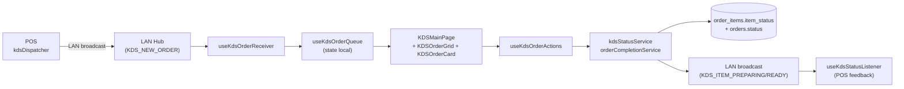
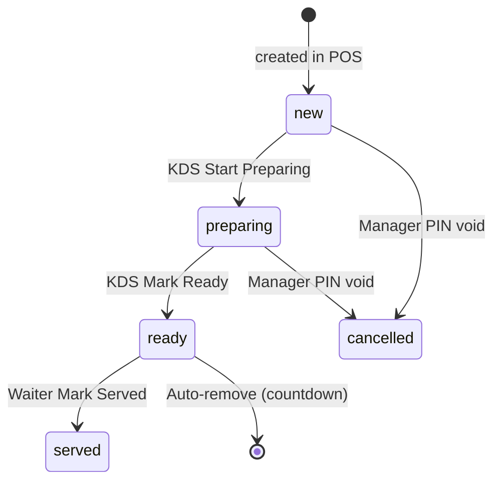

# 04 — KDS Kitchen

> **Last verified** : 2026-05-13
> **Structure** : ce fichier fusionne la **vue fonctionnelle** (le *pourquoi* et le *quoi* métier) et la **référence technique** (le *comment* implémenté). Pour les tâches à faire, voir [`../../workplan/backlog-by-module/04-kds-kitchen.md`](../../workplan/backlog-by-module/04-kds-kitchen.md).
> **Related E2E flows** : [08-kds-order-lifecycle](../08-flows-end-to-end/08-kds-order-lifecycle.md), [01-pos-sale-cash](../08-flows-end-to-end/01-pos-sale-cash.md).
> **App de rattachement** : POS (écran cuisine dédié `/kds`, `/kds/:station`).

> **En une phrase** : le module KDS est l'œil et l'oreille de la cuisine de The Breakery — il transforme un envoi caisse en mission claire affichée sur l'écran de la bonne station selon la catégorie produit, gère chaque item avec son propre tempo via `item_status`, alerte avec un code couleur progressif vert→orange→rouge et un son d'urgence quand le temps file, signale au comptoir quand tout est prêt, et s'insère dans l'architecture LAN avec fallback Realtime — pour que la cuisine soit toujours informée, jamais débordée par surprise, et que personne ne crie plus jamais "commande 124 pour la table 7 !" dans l'atelier.

---

## Table des matières

- [Partie I — Vue fonctionnelle](#partie-i--vue-fonctionnelle)
  - [1. Raison d'être](#1-raison-dêtre)
  - [2. Les 4 stations supportées](#2-les-4-stations-supportées)
  - [3. Les 5 invariants du module](#3-les-5-invariants-du-module)
  - [4. Le sélecteur de station — La porte d'entrée](#4-le-sélecteur-de-station--la-porte-dentrée)
  - [5. La grille de commandes — Le cœur opérationnel](#5-la-grille-de-commandes--le-cœur-opérationnel)
  - [6. Le cycle de vie d'un item](#6-le-cycle-de-vie-dun-item)
  - [7. Les alertes sonores — Le KdsSoundService](#7-les-alertes-sonores--le-kdssoundservice)
  - [8. Le mode Waiter — Vue serveur](#8-le-mode-waiter--vue-serveur)
  - [9. Auto-remove — Le nettoyage automatique](#9-auto-remove--le-nettoyage-automatique)
  - [10. Réception des commandes — Le couplage POS/KDS](#10-réception-des-commandes--le-couplage-poskds)
  - [11. Les actions cuisinier — Le geste minimaliste](#11-les-actions-cuisinier--le-geste-minimaliste)
  - [12. Le rôle dans l'architecture LAN](#12-le-rôle-dans-larchitecture-lan)
  - [13. Configuration — Settings → KDS Configuration](#13-configuration--settings--kds-configuration)
  - [14. Mécaniques transverses](#14-mécaniques-transverses)
  - [15. Ce que le module ne fait pas](#15-ce-que-le-module-ne-fait-pas)
  - [16. Utilisateurs cibles](#16-utilisateurs-cibles)
- [Partie II — Référence technique](#partie-ii--référence-technique)
  - [17. Vue d'ensemble technique](#17-vue-densemble-technique)
  - [18. Diagramme de responsabilité](#18-diagramme-de-responsabilité)
  - [19. Tables DB impliquées](#19-tables-db-impliquées)
  - [20. Hooks principaux](#20-hooks-principaux)
  - [21. Services principaux](#21-services-principaux)
  - [22. Composants UI principaux](#22-composants-ui-principaux)
  - [23. Stores Zustand utilisés](#23-stores-zustand-utilisés)
  - [24. RPCs / Edge Functions / LAN messages](#24-rpcs--edge-functions--lan-messages)
  - [25. RLS & Permissions](#25-rls--permissions)
  - [26. Routes](#26-routes)
  - [27. Status flow](#27-status-flow)
  - [28. Drag & drop](#28-drag--drop)
  - [29. Real-time via lanHub](#29-real-time-via-lanhub)
  - [30. Pitfalls spécifiques](#30-pitfalls-spécifiques)
- [Partie III — Backlog opérationnel](#partie-iii--backlog-opérationnel)
- [Partie IV — Design & UX](#partie-iv--design--ux)
  - [31. Thèmes et contextes d'affichage](#31-thèmes-et-contextes-daffichage)
  - [32. Écrans du module](#32-écrans-du-module)
  - [33. Layout patterns appliqués](#33-layout-patterns-appliqués)
  - [34. Composants UI signature](#34-composants-ui-signature)
  - [35. États visuels critiques](#35-états-visuels-critiques)
  - [36. Couleurs sémantiques utilisées](#36-couleurs-sémantiques-utilisées)
  - [37. Microcopy et empty states](#37-microcopy-et-empty-states)
  - [38. Références visuelles externes](#38-références-visuelles-externes)
  - [39. À faire côté design (backlog UX)](#39-à-faire-côté-design-backlog-ux)

---

# Partie I — Vue fonctionnelle

## 1. Raison d'être

Le module KDS est **l'œil et l'oreille de la cuisine** de The Breakery. Il répond à la question simple qui détermine la qualité du service en restauration :

> *"Quand le caissier envoie une commande, comment le boulanger / barista / serveur sait quoi préparer, dans quel ordre, depuis combien de temps il attend, et comment il signale au comptoir que c'est prêt — sans crier dans tout l'atelier et sans gribouillis papier ?"*

C'est l'écran qui transforme **un envoi caisse** en **mission cuisine claire** : commandes affichées par poste, items routés à la bonne station, timers visuels, alertes d'urgence sonores, bouton "Ready" qui prévient la salle. Sans lui, la cuisine fonctionne au cri ; avec lui, chaque item est une carte sur un mur numérique qui passe du jaune au orange au rouge à mesure que le temps file.

Le KDS est **un client du POS sur le LAN local** : il reçoit les commandes en direct, ne crée jamais rien, et renvoie uniquement des changements de statut (preparing → ready → served).

---

## 2. Les 4 stations supportées

Le module distingue **4 postes de travail** correspondant à 4 réalités cuisine d'une boulangerie/café :

| Station | Code | Quoi | Couleur |
|---|---|---|---|
| **Hot Kitchen** | `hot_kitchen` | Cuisine chaude — sandwichs, plats salés, four | Rouge (urgence) |
| **Barista** | `barista` | Boissons chaudes et froides | Or (signature The Breakery) |
| **Display** | `display` | Vitrine — produits déjà prêts à servir | Vert (frais) |
| **Waiter** | `waiter` | Vue serveur — toutes stations consolidées | Gris (lecture seule) |

Le **routage** d'un item vers une station est déterminé par sa **catégorie produit** (champ `categories.dispatch_station`). Le café route `barista`, les pains routent `display`, les sandwichs routent `hot_kitchen`.

Le **mode Waiter** est une vue spéciale : il agrège **toutes les stations** pour donner au serveur la vue d'ensemble du service en salle.

---

## 3. Les 5 invariants du module

Quelle que soit la station, le module garantit toujours :

1. **Lecture seule sauf statut d'item**. Le KDS n'ajoute, ne supprime ni ne modifie d'items. Il ne change que `item_status` (preparing → ready → served).
2. **Routage par catégorie**. Un item s'affiche uniquement sur la station correspondant à sa catégorie. Un café ne pollue jamais l'écran cuisine chaude.
3. **Granularité item-level**. Chaque item d'une commande a son propre statut, indépendant des autres. Le cappuccino sort en 1 minute, le croque-monsieur en 8 — chacun a son tempo.
4. **Temps réel via LAN**. Le KDS est un client `lanClient` connecté au hub POS. Une commande envoyée caisse apparaît à la KDS en <1 seconde.
5. **Alertes sonores progressives**. Bip discret à l'arrivée, alerte sonore plus forte si l'item dépasse un seuil critique (`useKdsUrgentAlertLoop`).

---

## 4. Le sélecteur de station — La porte d'entrée

Page `KDSStationSelector` (`/kds`) : la première vue au démarrage d'un écran KDS.

Affiche **4 grosses cartes** (Hot Kitchen / Barista / Display / Waiter) avec leur icône et leur couleur. Le membre d'équipe choisit son poste d'un seul tap.

Ce sélecteur est volontairement **plein écran et sans fioritures** :

- Pas de menu, pas de retour back-office.
- Pas de login séparé : le KDS hérite de la session ouverte sur le terminal physique.
- Une fois la station choisie, le retour au sélecteur exige une action explicite (long press, geste réservé) — pour éviter qu'un cuisinier sorte par erreur.

Bénéfice métier : **un appareil = un poste**. La tablette posée sur le plan de travail du four est sur la station Hot Kitchen toute la journée ; celle du bar est sur Barista. Personne ne se trompe d'écran.

---

## 5. La grille de commandes — Le cœur opérationnel

Page `KDSMainPage` (`/kds/:station`) — l'écran de travail à plein temps.

### 5.1 Structure

- **Header** (`KDSHeader`) en haut : nom de la station, compteur de commandes en cours, accès All-Day Count, bouton refresh.
- **All Day Count** (`KDSAllDayCount`) optionnel : compteur cumulé d'items préparés sur la journée par produit (utile pour la communication entre équipes).
- **Order Grid** (`KDSOrderGrid`) : grille de cartes commandes, scrollable horizontalement ou verticalement selon réglage.

### 5.2 Une carte commande (`KDSOrderCard`)

Chaque commande est une **carte** affichant :

- **Numéro de commande** + table (si dine-in) ou nom client (si pris).
- **Type** : badge Dine-in / Takeaway / Delivery / B2B.
- **Heure de réception** + **timer** (countdown bar `KDSCountdownBar`).
- **Liste des items routés à cette station uniquement** (les autres items sont invisibles ici).
- Pour chaque item :
  - Nom du produit + quantité.
  - Modifiers / variantes (sucre +, sans lait, etc.).
  - Notes spéciales (allergie, préparation).
  - Bouton **Ready** individuel par item.
  - Badge `item_status` (pending → preparing → ready → served).
- **Progress bar** (`OrderProgressBar`) : pourcentage d'items ready sur le total.
- **Bouton "All Ready"** quand tous les items sont prêts → signale au comptoir.

### 5.3 Comportement visuel

Code couleur **progressif** :

| Âge | Couleur | Signal |
|---|---|---|
| < 3 min | Vert / blanc | Frais, pas de stress |
| 3-7 min | Orange | Attention, à surveiller |
| 7-12 min | Rouge | Urgent |
| > 12 min | Rouge clignotant + alerte sonore | Critique — l'équipe doit agir |

Les seuils sont **configurables** dans Settings → KDS Configuration (par station).

Bénéfice métier : **discipline visuelle sans micro-management**. Le chef ne dit jamais "dépêche-toi !" — c'est l'écran qui le dit, et personne ne le prend mal.

---

## 6. Le cycle de vie d'un item

Chaque item d'une commande traverse un parcours **statutaire** :

```
pending → preparing → ready → served
                                ↓
                            cancelled
```

| Statut | Qui change | Quand |
|---|---|---|
| **pending** | Auto à l'envoi caisse | L'item est arrivé sur la station, personne ne l'a touché. |
| **preparing** | Cuisinier tape "Start" (optionnel) | L'item est en cours de préparation. Active le timer "en cours". |
| **ready** | Cuisinier tape "Ready" | Plus de travail à faire — à servir / remettre. |
| **served** | Auto via Waiter ou auto-remove timer | L'item est sorti de la cuisine vers le client. Auto-archive de la carte. |
| **cancelled** | Cashier voide la commande | L'item est rayé visuellement, retiré de la file. |

La **commande globale** passe à `ready` quand **tous ses items** sont `ready`. C'est ce statut qui déclenche le **son de notification côté POS** ("order ready") qu'on entend depuis la caisse.

Bénéfice métier : **chaque item a son tempo propre**. Le cappuccino part avant le croque-monsieur — le client a quelque chose dans les mains immédiatement, et son sandwich arrive 6 minutes plus tard. Service perçu comme rapide même si le plat principal prend du temps.

---

## 7. Les alertes sonores — Le KdsSoundService

Le KDS s'accompagne d'un **moteur sonore** (`kdsSoundService`) qui joue plusieurs sons selon le contexte :

| Événement | Son | Volume |
|---|---|---|
| **Nouvelle commande arrive** | Bip court neutre | Moyen |
| **Item passe en urgent** (`useKdsUrgentAlertLoop`) | Alerte répétée | Fort |
| **All Ready confirmé** | Bip de validation positif | Doux |
| **Erreur réseau (LAN déconnecté)** | Alerte d'erreur | Moyen |

Les volumes et l'activation sont **configurables par station** dans Settings → KDS Configuration. Une cuisine bruyante peut mettre fort, un display silencieux peut couper.

Bénéfice métier : **éveiller l'attention sans dépendre du regard**. Le cuisinier qui sort le four entend le bip et sait qu'il a une nouvelle mission, même sans regarder l'écran.

---

## 8. Le mode Waiter — Vue serveur

La station `waiter` est un mode spécial qui agrège **toutes les stations** :

- Toutes les commandes en cours apparaissent, peu importe leur destination cuisine.
- Le serveur voit la **progression globale** de chaque table.
- Quand une commande est `all ready` → le serveur prend l'écran pour signal d'apporter.
- Bouton "Served" final qui passe la commande en `served` côté système et la fait disparaître de toutes les KDS.

Bénéfice métier : **dispatcher le service à table** depuis un seul écran. Le serveur ne fait plus la tournée des stations pour voir ce qui est prêt — il regarde son écran et fonce sur la table prête.

---

## 9. Auto-remove — Le nettoyage automatique

Hook `useOrderAutoRemove` : les commandes terminées **disparaissent automatiquement** après un délai configurable.

- Une fois `all ready` confirmé → bouton "Served" optionnel sinon retrait auto après 2-5 minutes.
- Si l'item passe en `served` → retrait immédiat de la KDS source.
- Évite l'encombrement visuel — l'écran reflète uniquement le **travail en cours**.

Bénéfice métier : **clarté permanente**. La cuisine ne voit que ce qui reste à faire, jamais ce qui est déjà fait — réduit la charge cognitive.

---

## 10. Réception des commandes — Le couplage POS/KDS

Le hook `useKdsOrderReceiver` écoute en permanence :

- Les **broadcasts LAN** depuis le hub POS (canal `'appgrav-lan'`).
- Les **Supabase Realtime** comme fallback (canal `'lan-hub'`).

Quand une nouvelle commande arrive :

1. Filtrage des items par station (le hot_kitchen ne voit pas les cafés).
2. Insertion dans la queue (`useKdsOrderQueue`) avec timestamp local.
3. Tri automatique par âge décroissant (plus vieux en haut par défaut).
4. Bip de notification.

Si la connexion LAN saute, le KDS bascule automatiquement sur Realtime — pas d'interruption perçue.

Bénéfice métier : **synchro <1s sans perte de commande**. Une commande envoyée à 14h32:15 apparaît en cuisine à 14h32:16, dans le pire des cas via fallback Realtime.

---

## 11. Les actions cuisinier — Le geste minimaliste

Le module `useKdsOrderActions` expose un nombre **volontairement restreint** d'actions :

| Action | Effet |
|---|---|
| **Tap item "Ready"** | Bascule item_status → `ready`, met à jour Supabase. |
| **Tap item "Undo"** | Repasse à `preparing` si erreur de clic. |
| **Tap commande "All Ready"** | Passe tous les items en `ready` en un coup. |
| **Long press item** | Affiche les notes spéciales en grand (cas allergie). |
| **Bouton refresh global** | Recharge la queue depuis Supabase (en cas de doute). |

Pas de modification d'item, pas d'annulation, pas de remise en file. Le KDS **ne défait pas** ce que la caisse a fait — il l'exécute.

Bénéfice métier : **le cuisinier reste dans son geste métier**. Pas de clavier, pas de menu, pas de risque d'opération destructrice. Un tap, c'est fini.

---

## 12. Le rôle dans l'architecture LAN

Le KDS s'insère dans la mécanique **hub/client** de l'app :

- La **caisse principale POS** est le hub (`lanHub`).
- Chaque appareil KDS est un client (`lanClient`) qui s'enregistre auprès du hub via heartbeat (30s, stale à 120s).
- Les commandes voyagent **hub → clients** via BroadcastChannel local + Realtime cloud en backup.
- Les changements de statut voyagent **client → hub** via Supabase direct (le KDS update Postgres → trigger Realtime → POS notifié).
- Le hub utilise les statuts retournés pour mettre à jour le **son order ready** sur la caisse.

Bénéfice métier : **résilience réseau**. Si le wifi vacille, le LAN local prend le relais. Si le LAN tombe, Supabase prend le relais. Le KDS ne se déconnecte qu'en cas de double panne.

---

## 13. Configuration — Settings → KDS Configuration

Réglages disponibles dans Settings :

- **Stations actives** : activer / désactiver une station (pas de KDS pâtisserie chez The Breakery par exemple).
- **Seuils de couleur** : à partir de combien de minutes l'item passe orange / rouge.
- **Sons** : activer / désactiver par station, volume par défaut.
- **Auto-remove delay** : 0 = bouton manuel obligatoire ; 120s = auto après 2 minutes.
- **Layout** : grille horizontale (façon ticket rail) ou verticale (façon liste).
- **Police** : grande (mauvaise vue / poste loin) ou compacte (beaucoup d'items en parallèle).

Bénéfice métier : **chaque cuisine a son tempo**. Le four cuisson rapide met les seuils à 5/10 min ; la pâtisserie longue à 15/30 min.

---

## 14. Mécaniques transverses

| Module | Relation |
|---|---|
| **POS / Orders** | Les commandes sont créées au POS, le KDS les reçoit. Les changements de statut KDS sont écoutés par la page Orders. |
| **Products / Categories** | Le `dispatch_station` de la catégorie pilote le routage cuisine. |
| **Settings** | Configuration KDS centralisée dans Settings → KDS Configuration. |
| **LAN** | Le KDS est un client LAN avec heartbeat et fallback Realtime. |
| **Customer Display** | Quand le KDS marque all ready, le Customer Display peut afficher "Votre commande est prête". |
| **Reports** | `service_speed` (backlog) — temps cuisinier par item via `dispatch_station`. |
| **Permissions** | Pas de permission propre — le KDS est lisible par toute personne ayant un terminal physique configuré. |

---

## 15. Ce que le module ne fait pas

- Le KDS **ne crée pas de commande**. Pas de saisie manuelle "ajouter un café" depuis la cuisine — tout passe par la caisse.
- Le KDS **ne modifie pas les items** (ajouter un modificateur, retirer un ingrédient). Pour ça, le cuisinier doit appeler le caissier qui modifiera depuis le POS.
- Le KDS **n'a pas de mode "tickets imprimés"**. Si une station perd l'écran, pas de papier de secours. Le KDS papier (`Print kitchen ticket` dans Settings POS Config) est un *complément* du POS, pas du KDS.
- Le KDS **ne planifie pas la production**. Pas d'agrégation "tu vas avoir 50 baguettes demain matin à préparer" — ça relève du module Production.
- Le KDS **ne supporte pas la persistance offline**. Une coupure complète d'internet + LAN bloque la réception (pas de mode hors-ligne dégradé).
- Le KDS **ne communique pas entre cuisiniers**. Pas de chat, pas de messagerie. Si une station veut alerter une autre, c'est à la voix.

---

## 16. Utilisateurs cibles

| Rôle | Ce qu'il fait dans le module |
|---|---|
| **Cuisinier / Boulanger** | Reçoit les missions sur Hot Kitchen, tape "Ready" item par item, gère les notes allergie. |
| **Barista** | Station Barista — produit chaque boisson, signale "Ready" → barista compte tient la file de cafés. |
| **Vendeur vitrine** | Station Display — réception des produits finis prêts à servir, confirmation sortie. |
| **Serveur de salle** | Mode Waiter — vue agrégée pour dispatcher le service à table. |
| **Chef de cuisine / Manager** | Consulte All Day Count, surveille les goulots, ajuste les seuils de couleur. |

---

# Partie II — Référence technique

## 17. Vue d'ensemble technique

Kitchen Display System multi-stations (Hot Kitchen, Barista, Display, Waiter) avec dispatch automatique selon `categories.dispatch_station` et overrides produit. Les commandes sont propagées via LAN hub (BroadcastChannel + Supabase Realtime) puis statuées (`new` → `preparing` → `ready` → `served`) item par item. Auto-remove après countdown configurable. Sound alerts pour nouvelles commandes urgentes (>10 min).

---

## 18. Diagramme de responsabilité



---

## 19. Tables DB impliquées

| Table | Rôle | Lien |
|---|---|---|
| `order_items` | Champs `item_status` (`new`/`preparing`/`ready`/`served`/`cancelled`), `dispatch_station`, `is_dispatch_copy`, `is_held`, `sent_to_kitchen_at`, `prepared_at`, `prepared_by` | [details](../03-database/02-tables-reference.md#order_items) |
| `orders` | `status` (`new`/`preparing`/`ready`/`completed`/`voided`), `completed_at` | [details](../03-database/02-tables-reference.md#orders) |
| `kds_stations` | Stations enregistrées (`station_type`, `device_id`, `is_active`) — déclarée dans [`010_lan_sync_display.sql:158-172`](../../../supabase/migrations/010_lan_sync_display.sql) | [details](../03-database/02-tables-reference.md#kds_stations) |
| `categories` | Champ `dispatch_station` (résolution route KDS par défaut) | [details](../03-database/02-tables-reference.md#categories) |
| `lan_nodes` | Stations KDS visibles dans le hub (heartbeat) | [details](../03-database/02-tables-reference.md#lan_nodes) |
| `device_configurations` | Config persistante des stations (sound, layout) | [details](../03-database/02-tables-reference.md#device_configurations) |

---

## 20. Hooks principaux

5 hooks dans `src/hooks/kds/` :

| Hook | Chemin | Rôle |
|---|---|---|
| `useKdsOrderQueue` | `src/hooks/kds/useKdsOrderQueue.ts` | State local de la queue : ajout/update/remove, séparation urgent vs normal (FIFO sort par `created_at`, threshold default 600s) |
| `useKdsOrderReceiver` | `src/hooks/kds/useKdsOrderReceiver.ts` | Subscribe aux messages `KDS_NEW_ORDER` / `KDS_ITEM_HOLD_TOGGLE` du LAN hub, ingest dans la queue |
| `useKdsOrderActions` | `src/hooks/kds/useKdsOrderActions.ts` | Handlers `handleStartPreparing`, `handleMarkReady`, `handleMarkServed`, `handleToggleHold`, `handleOrderComplete` — optimistic update + rollback on error |
| `useKdsUrgentAlertLoop` | `src/hooks/kds/useKdsUrgentAlertLoop.ts` | Joue le son urgent en boucle tant qu'au moins une commande dépasse le seuil |
| `useOrderAutoRemove` | `src/hooks/kds/useOrderAutoRemove.ts` | Countdown post-`ready` puis suppression automatique de la queue + `completeOrder` |

---

## 21. Services principaux

3 fichiers dans `src/services/kds/` + `KdsSoundService` racine :

| Service | Chemin | Rôle |
|---|---|---|
| `kdsStatusService.markItemsPreparing` | `src/services/kds/kdsStatusService.ts:32-94` | Update `order_items.item_status='preparing'` + check si tous items en preparing → bump `orders.status='preparing'` + LAN broadcast |
| `kdsStatusService.markItemsReady` | `src/services/kds/kdsStatusService.ts` | Idem pour `'ready'` + broadcast `KDS_ITEM_READY` |
| `orderCompletionService.completeOrder` | `src/services/kds/orderCompletionService.ts:33-90` | Update `orders.status='ready'` + `completed_at` + LAN broadcast `ORDER_COMPLETE` |
| `KdsSoundService` | `src/services/KdsSoundService.ts` | Singleton son (new order chime, urgent loop, mute toggle) |

Côté POS (dispatch en amont) :
- `dispatchStationResolver.batchGetDispatchStationsMulti()` — `src/services/pos/dispatchStationResolver.ts` — résout la station finale par item (catégorie + override produit + multi-dispatch via migration `20260324100000_product_multi_dispatch_stations.sql`)
- `kdsDispatcher.dispatchOrderToKds()` — `src/services/pos/kdsDispatcher.ts` — split l'order par station, broadcast `KDS_NEW_ORDER` distinct par station

---

## 22. Composants UI principaux

6 composants dans `src/components/kds/` :

| Composant | Chemin | Rôle |
|---|---|---|
| `KDSHeader` | `src/components/kds/KDSHeader.tsx` | Header station (nom, icon, sound toggle, all-day count toggle, time, refresh) |
| `KDSOrderGrid` | `src/components/kds/KDSOrderGrid.tsx` | Grille responsive (1/2/4/5/6 colonnes selon viewport), urgent en haut, normal ensuite |
| `KDSOrderCard` | `src/components/kds/KDSOrderCard.tsx` | Carte commande — items individuellement statuables, hold toggle, source badge (pos/mobile/web/lan) |
| `KDSCountdownBar` | `src/components/kds/KDSCountdownBar.tsx` | Barre countdown pré-auto-remove |
| `KDSAllDayCount` | `src/components/kds/KDSAllDayCount.tsx` | Vue agrégée par produit (overlay) |
| `OrderProgressBar` | `src/components/kds/OrderProgressBar.tsx` | Barre progression (n items ready / total) |

---

## 23. Stores Zustand utilisés

KDS n'a **pas de store dédié** — l'état est local au composant `KDSMainPage` via `useKdsOrderQueue`. Cette décision tient au fait qu'une station = un device, donc pas besoin de partage cross-tab.

Lectures externes :
- `useLanClient` (`src/hooks/lan/`) — connexion au hub LAN
- `useKDSConfigSettings` (`src/hooks/settings/useModuleConfigSettings`) — config (urgent threshold, auto-remove delay, sound volume)

---

## 24. RPCs / Edge Functions / LAN messages

| Type | Nom | Rôle |
|---|---|---|
| Direct table update | `order_items.update({ item_status })` | `markItemsPreparing` / `markItemsReady` (`kdsStatusService.ts:42-49`) |
| Direct table update | `orders.update({ status, completed_at })` | `completeOrder` (`orderCompletionService.ts:42-49`) |
| LAN message | `KDS_NEW_ORDER` | Push commande vers stations |
| LAN message | `KDS_ITEM_PREPARING` | Feedback POS qu'un item est en cours |
| LAN message | `KDS_ITEM_READY` | Feedback POS qu'un item est prêt |
| LAN message | `KDS_ITEM_HOLD_TOGGLE` | Hold/unhold item |
| LAN message | `ORDER_COMPLETE` | Fin de commande (déclenche customer display, print receipt si configuré) |

Pas d'Edge Function dédiée — KDS ne fait que des updates directes (RLS + permissions au niveau DB suffisent). Protocole LAN défini dans `src/services/lan/lanProtocol.ts`.

---

## 25. RLS & Permissions

Permission codes : `kitchen.view`, `kitchen.update`, `pos.access`.

Pattern RLS sur `kds_stations` (extrait `012_rls_policies.sql:82+`) :
```sql
ALTER TABLE public.kds_stations ENABLE ROW LEVEL SECURITY;
CREATE POLICY "Authenticated read" ON public.kds_stations
    FOR SELECT USING (public.is_authenticated());
```

`order_items.update` (status change) est gardé par :
```sql
CREATE POLICY "Kitchen update item status" ON public.order_items
    FOR UPDATE USING (
        public.user_has_permission(auth.uid(), 'kitchen.update')
        OR public.user_has_permission(auth.uid(), 'sales.update')
    );
```

---

## 26. Routes

| Route | Page component | Guard |
|---|---|---|
| `/kds` | `src/pages/kds/KDSStationSelector.tsx` | `POSAccessGuard` (`posRoutes.tsx:76-86`) |
| `/kds/:station` | `src/pages/kds/KDSMainPage.tsx` (param: `hot_kitchen`/`barista`/`display`/`waiter`) | `POSAccessGuard` (`posRoutes.tsx:87-100`) |

Le param `:station` est mappé dans `STATION_CONFIG` (`KDSMainPage.tsx:20-45`) qui définit le `dbStation` (`kitchen`/`barista`/`display`/`all` pour waiter) — ce dernier filtre les `order_items.dispatch_station` à afficher.

---

## 27. Status flow



Ordre des updates côté DB :
1. `markItemsPreparing(itemIds, station)` → `order_items.item_status='preparing'`
2. Si tous les items primary du `order` sont != `'new'` → `orders.status='preparing'` (`kdsStatusService.ts:51-68`)
3. `markItemsReady(itemIds, station)` → `order_items.item_status='ready'`
4. `completeOrder(orderId, station)` → `orders.status='ready'` + `completed_at`
5. Auto-remove → suppression de la queue locale + ORDER_COMPLETE LAN

---

## 28. Drag & drop

Le repo a `@dnd-kit` listé dans `package.json` (utilisé par d'autres modules — accounting, products), **mais le KDS V2 actuel ne l'utilise pas**. Les actions station sont déclenchées par tap/click (status badges interactifs sur `KDSOrderCard`). Réordonnancement par drag est dans le backlog.

---

## 29. Real-time via lanHub

KDS est un client typique du LAN hub :
- Subscribe au boot via `useLanClient` (auto-reconnect)
- Filtre les messages destinés à sa station (`payload.station === dbStation` ou `'all'`)
- Push ses propres status updates via `lanClient.send(LAN_MESSAGE_TYPES.KDS_ITEM_PREPARING, payload)` (`kdsStatusService.ts:71-82`)

Voir `src/services/lan/lanClient.ts`, `src/services/lan/lanHub.ts`, `src/services/lan/lanProtocol.ts`.

---

## 30. Pitfalls spécifiques

- **`is_dispatch_copy` exclu du calcul `allPreparing`** : `kdsStatusService.ts:55-57` filtre `is_dispatch_copy=false` pour ne pas inclure les copies multi-station dans le check de bump `orders.status`. Sinon une commande à 2 stations ne bumperait jamais.
- **Optimistic update + rollback** : `useKdsOrderActions.handleStartPreparing` (`useKdsOrderActions.ts:32-53`) update la queue locale d'abord, puis rollback (`previousStatuses`) si le service échoue. Toast d'erreur visible.
- **Station `'all'` (waiter)** : `STATION_CONFIG.waiter.dbStation = 'all'` (`KDSMainPage.tsx:42`) — affiche TOUS les items, pour vue serveur. Cas spécial à filtrer dans receiver.
- **Sound urgent loop** : `useKdsUrgentAlertLoop` joue en continu tant qu'`urgentOrders.length > 0`. Mute toggle dans le header — persisté localement (`posLocalSettingsStore` ou `device_configurations`).
- **Auto-remove ≠ DB delete** : la commande `ready` est retirée de la queue locale mais reste en DB avec `status='ready'`. Le passage à `'completed'` ne survient qu'au paiement final.
- **KDS threshold default 600s = 10 min** : configurable via `useKDSConfigSettings`. Si modifié runtime, `useKdsOrderQueue` re-évalue les urgent au prochain tick.
- **Pas de Realtime Supabase** sur les `order_items` côté KDS — tout passe par LAN. Si le hub est down (Wi-Fi), les nouvelles commandes n'arrivent pas. Fallback : refresh périodique manuel via `fetchOrders` dans `KDSMainPage`.
- **Source badge** : un order peut venir de `pos`, `mobile`, `web` ou `lan`. Le KDS peut filtrer / colorer selon la source pour distinguer un order tablette vs caisse.
- **Trigger functions returning TRIGGER** : si on ajoute un trigger custom sur `order_items` (ex. notifier KDS), Postgres ne permet pas `PERFORM trigger_fn()` standalone. Smoke test via `SELECT 1 FROM pg_proc WHERE proname='...'` (cf. CLAUDE.md pitfall epic-016b).

---

# Partie III — Backlog opérationnel

Pour les tâches techniques à exécuter (Service Speed report, throttling intelligent, chat inter-stations, mode urgences, reroute manuel, persistance offline, KDS recall, mode présentation), voir :

→ [`../../workplan/backlog-by-module/04-kds-kitchen.md`](../../workplan/backlog-by-module/04-kds-kitchen.md)

---

# Partie IV — Design & UX

> **Source canonique** : [`../../DESIGN_POS_AND_BACKOFFICE.md`](../../DESIGN_POS_AND_BACKOFFICE.md) §3.5 (KDS).
> **Tokens techniques** : [`../../../DESIGN.md`](../../../DESIGN.md) (variables CSS, scales, classes Tailwind).
> **Screenshots de référence** : [`../../ux/assets/screens/`](../../ux/assets/screens/) — source de vérité visuelle.
> **Design system global** : [`../02-design-system/`](../02-design-system/) (7 fichiers).

## 31. Thèmes et contextes d'affichage

Le module KDS vit **exclusivement** dans l'app POS, donc un seul thème :

| Contexte | Thème CSS | Pages concernées | Identité |
|---|---|---|---|
| **KDS Station** | `.theme-pos` (noir profond `#0C0C0E`) | `/kds`, `/kds/:station` | Écran cuisine haute lisibilité, code couleur progressif âge-item |

**Constante de marque** : l'or `#C9A55C` reste identique partout (CTA secondaires, branding). Les couleurs sémantiques des stations (rouge Hot Kitchen / or Barista / vert Display / gris Waiter) sont **fixes** et ne suivent pas les sémantiques success/warning/error standard.

---

## 32. Écrans du module

| Route | Type d'écran | Densité | Composants signature |
|---|---|---|---|
| `/kds` | Sélecteur station plein écran | Faible | 4 grandes cards station (Hot Kitchen / Barista / Display / Waiter), icône + couleur identitaire |
| `/kds/:station` | Grille de cartes commandes temps réel | Très haute | `KDSHeader`, `KDSOrderGrid`, `KDSOrderCard`, `KDSCountdownBar`, `KDSAllDayCount`, `OrderProgressBar` |

---

## 33. Layout patterns appliqués

### 33.1 KDS Station Selector (`/kds`)

Pattern entrée plein écran (cf. [`../../DESIGN_POS_AND_BACKOFFICE.md`](../../DESIGN_POS_AND_BACKOFFICE.md) §3) :

- **Fond noir profond** (`surface-0`), aucune sidebar, aucun breadcrumb.
- **4 cards XXL** centrées (2x2 grid en landscape, 1x4 en portrait) :
  - Icône Lucide grand format (96px) avec couleur identitaire de la station.
  - Nom station en MAJUSCULES tracking large + Playfair italique.
  - Hover → légère élévation + glow gold.
- **Pas de footer**, pas d'auth séparée — la session est héritée du terminal physique.

### 33.2 KDS Main Page (`/kds/:station`)

Pattern grille temps réel (cf. §3.5 du design doc) :

- **Header sticky** (`KDSHeader`) :
  - Nom station + icône colorée à gauche (ChefHat rouge pour Hot Kitchen, Coffee or pour Barista, Store vert pour Display, Users gris pour Waiter).
  - Compteur commandes en cours.
  - Toggle All-Day Count (overlay).
  - Sound toggle (Lucide Speaker gold actif / gris muet).
  - Time courant.
  - Bouton refresh discret.
- **Grille `KDSOrderGrid`** responsive 1/2/4/5/6 colonnes selon viewport :
  - **Urgent en haut** (> seuil 600s par défaut, triés par âge décroissant).
  - **Normal en dessous** triés FIFO par `created_at`.
- **Cards `KDSOrderCard`** uniformes :
  - Header : numéro commande + table + source badge (pos/mobile/web/lan/tablet).
  - `KDSCountdownBar` couleur progressive vert→jaune→orange→rouge.
  - Items listés un par un avec checkbox Ready, modifiers en sous-ligne, notes spéciales mises en valeur.
  - `OrderProgressBar` : ratio n items ready / total.
  - Bouton "All Ready" vert massif quand tous items prêts.

---

## 34. Composants UI signature

| Composant | Type | Usage | Style clé |
|---|---|---|---|
| `KDSHeader` | Header sticky | En haut de `/kds/:station` | Fond `surface-1`, identité station à gauche, contrôles à droite (sound, all-day, time, refresh) |
| `KDSOrderGrid` | Grille responsive | Page principale | Auto-fit colonnes, urgent groupés en haut |
| `KDSOrderCard` | Card commande | Une par order | Fond `surface-1`, bordure top de couleur d'âge, items en blocs cliquables individuels |
| `KDSCountdownBar` | Barre horizontale | En haut de chaque card | Largeur 100%, gradient progressif vert → orange → rouge clignotant |
| `KDSAllDayCount` | Overlay | Toggle depuis header | Vue agrégée par produit "Cappuccino: 47 préparés" — utile pour communication entre équipes |
| `OrderProgressBar` | Barre progression | Footer de card | "3/5 ready" + bar gold |

---

## 35. États visuels critiques

| État | Visuel | Pourquoi |
|---|---|---|
| **Nouveau (< 3 min)** | Fond card vert pâle / bordure top verte `#22C55E`, texte normal | Frais, pas de stress |
| **Attention (3-7 min)** | Bordure top jaune `#EAB308` | Surveiller |
| **Urgent (7-12 min)** | Bordure top orange `#F97316`, badge "URGENT" coin top-right | Le cuisinier doit prioriser |
| **Critique (>12 min)** | Bordure top rouge `#EF4444` **clignotante**, son répété en boucle (`useKdsUrgentAlertLoop`) | Action immédiate requise |
| **Item Ready** | Checkbox cochée vert, ligne barrée optionnelle | Cuisinier voit ce qui reste à faire |
| **All Ready** | Bouton vert massif full-width "All Ready" | Geste final qui notifie le comptoir |
| **Held item** | Badge "HOLD" gris + opacity réduite sur l'item | Item mis en pause (allergie, vérif) |
| **Source badge** | Pastille colorée (pos/mobile/web/lan/tablet) en coin top-left | Distinguer une commande tablette d'une commande caisse |
| **LAN déconnecté** | Point rouge clignotant + tooltip "LAN offline — fallback Realtime active" | Cuisinier sait que la latence peut être dégradée |

---

## 36. Couleurs sémantiques utilisées

| Rôle | POS (dark) | Usage KDS |
|---|---|---|
| **Vert frais** | `#22C55E` | Order âge < 3 min, item ready, "All Ready" CTA |
| **Jaune attention** | `#EAB308` | Order âge 3-7 min |
| **Orange urgent** | `#F97316` | Order âge 7-12 min |
| **Rouge critique** | `#EF4444` | Order âge > 12 min, clignotant + son urgent loop |
| **Gold** | `#C9A55C` | Identité station Barista, sound icon actif, branding |
| **Identité Hot Kitchen** | Rouge `#DC2626` | Card sélecteur Hot Kitchen + icône ChefHat |
| **Identité Barista** | Or `#C9A55C` | Card sélecteur Barista + icône Coffee |
| **Identité Display** | Vert `#16A34A` | Card sélecteur Display + icône Store |
| **Identité Waiter** | Gris `#6B7280` | Card sélecteur Waiter + icône Users |

---

## 37. Microcopy et empty states

### Empty states (EN)

| Page | Texte | CTA |
|---|---|---|
| `/kds` (jamais empty — toujours 4 stations) | — | — |
| `/kds/:station` (no orders) | "No orders pending — kitchen is clear" + icône `ChefHat` grise | — |
| All Day Count (no production yet today) | "No items prepared yet today" | — |

### Confirmations destructives (EN)

- **Long-press "Back to station selector"** : "Leave this station? Any unsent status updates will sync once you reopen." + bouton "Leave" rouge.
- **Sound toggle off** : pas de confirmation (mute en 1 tap).
- **Refresh manuel** : "Refresh queue from server? Local optimistic updates may be reset." + bouton "Refresh".

### Toast notifications (EN)

- New order arrives: "Order #4315 — 2 items routed here" + bip court neutre.
- Item marked ready: "Cappuccino ready" + check mark green.
- All ready: "Order #4315 — all items ready" + bip de validation positif.
- LAN reconnect: "Connection restored — syncing queue".
- LAN lost: "Connection lost — using cloud fallback".

---

## 38. Références visuelles externes

| Ressource | Chemin / lien |
|---|---|
| Design doc complet (POS + Backoffice) — KDS §3.5 | [`../../DESIGN_POS_AND_BACKOFFICE.md`](../../DESIGN_POS_AND_BACKOFFICE.md) |
| Tokens canoniques V2 | [`../../../DESIGN.md`](../../../DESIGN.md) à la racine |
| Inventaire tokens V2 | [`../../ux/v2-token-inventory.md`](../../ux/v2-token-inventory.md) |
| Screenshots POS / KDS de référence | [`../../ux/assets/screens/caissapp/v2-reference/`](../../ux/assets/screens/caissapp/v2-reference/) |
| Design system feature components | [`../02-design-system/04-feature-components.md`](../02-design-system/04-feature-components.md) |
| Module Display (couplage) | [`./16-display-customer.md`](./16-display-customer.md) |
| Module Tablet (source orders) | [`./17-tablet-ordering.md`](./17-tablet-ordering.md) |

---

## 39. À faire côté design (backlog UX)

| Priorité | Évolution UX | Bénéfice |
|---|---|---|
| Critical | **Mockup Service Speed dashboard** par station | Visualiser les goulots — temps moyen item par station / par cuisinier |
| Critical | **Mode urgence visuel** : bouton "URGENT" qui force un item en haut de la pile avec bordure pulsante | Cas VIP / complainte client |
| High | **Mockup throttling alert** : "20 cafés en 30 secondes — saturation imminente" overlay au-dessus de la grille | Prévenir le caissier d'arrêter de prendre des cafés |
| High | **Chat inter-stations** : popup discret en bas pour échanges courts entre stations | Cas borderline ("le sandwich #124 attend la frite") |
| High | **Reroute manuel** : long-press item + "Move to Barista" | Cas erreur de catégorisation produit |
| Medium | **Animation transition item Ready** | Effet visuel satisfaisant (check + slide hors de la liste) |
| Medium | **Mode présentation public** | Affichage cuisine ouverte côté client — masquer notes allergie, montrer numéros |
| Low | **Reconnaissance vocale "Ready 124"** | Cuisinier mains pleines |
| Low | **Caméra QC** sortie cuisson — photo auto à la sortie pour audit qualité | Tracer la qualité dans le temps |
