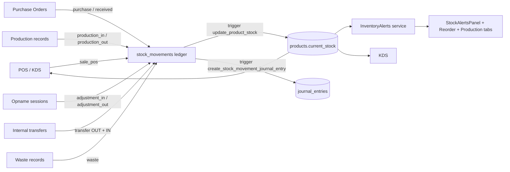

# 06 — Inventory & Stock

> **Last verified** : 2026-05-17
> **Structure** : ce fichier fusionne la **vue fonctionnelle** (le *pourquoi* et le *quoi* métier) et la **référence technique** (le *comment* implémenté). Pour les tâches à faire, voir [`../../workplan/backlog-by-module/06-inventory-stock.md`](../../workplan/backlog-by-module/06-inventory-stock.md).
> **Related E2E flows** : [05-stock-opname](../08-flows-end-to-end/05-stock-opname.md), [12-production-stock-impact](../08-flows-end-to-end/12-production-stock-impact.md), [04-purchase-order-cycle](../08-flows-end-to-end/04-purchase-order-cycle.md).
> **App de rattachement** : Backoffice (avec extensions POS — Live Stock, Cafe Reception).

> **En une phrase** : le module Inventory est le système nerveux du stock de The Breakery — il sait à chaque instant combien il y a de quoi, où c'est physiquement, ce qui est promis à un B2B et ce qui reste vendable, comment le stock a évolué et pourquoi — pour qu'on ne tombe jamais en rupture devant un client, qu'on ne jette plus de marchandise oubliée, qu'aucune commande B2B confirmée ne soit vendue par erreur en caisse, et que la cuisine, le comptoir, le bureau et le grand livre comptable racontent tous la même histoire.

---

## Table des matières

- [Partie I — Vue fonctionnelle](#partie-i--vue-fonctionnelle)
  - [1. Raison d'être](#1-raison-dêtre)
  - [2. Les 7 outils + les 3 vues satellites POS](#2-les-7-outils--les-3-vues-satellites-pos)
  - [3. Objectif Stock (BackOffice)](#3-objectif-stock-backoffice)
  - [4. Objectif Live Stock (POS)](#4-objectif-live-stock-pos)
  - [5. Objectif Incoming Stock](#5-objectif-incoming-stock)
  - [6. Objectif Cafe Stock Reception](#6-objectif-cafe-stock-reception)
  - [7. Objectif Internal Transfers](#7-objectif-internal-transfers)
  - [8. Objectif Wastage](#8-objectif-wastage)
  - [9. Objectif Production](#9-objectif-production)
  - [10. Objectif Opname](#10-objectif-opname)
  - [11. Objectif Movements (ledger)](#11-objectif-movements-ledger)
  - [12. Dashboard produit (analytique)](#12-dashboard-produit-analytique)
  - [13. Alertes (panneau dédié)](#13-alertes-panneau-dédié)
  - [14. Réservations de stock B2B](#14-réservations-de-stock-b2b)
  - [15. Couplage comptable](#15-couplage-comptable)
  - [16. Sections et locations](#16-sections-et-locations)
  - [17. Stock by Location](#17-stock-by-location)
  - [18. Objectifs transverses](#18-objectifs-transverses)
  - [19. Limites assumées V2](#19-limites-assumées-v2)
  - [20. Utilisateurs cibles](#20-utilisateurs-cibles)
- [Partie II — Référence technique](#partie-ii--référence-technique)
  - [21. Architecture conceptuelle](#21-architecture-conceptuelle)
  - [22. Diagramme de responsabilité](#22-diagramme-de-responsabilité)
  - [23. Tables DB impliquées](#23-tables-db-impliquées)
  - [24. Hooks principaux](#24-hooks-principaux)
  - [25. Services principaux](#25-services-principaux)
  - [26. Composants UI principaux](#26-composants-ui-principaux)
  - [27. Stores Zustand utilisés](#27-stores-zustand-utilisés)
  - [28. RPCs / Edge Functions](#28-rpcs--edge-functions)
  - [29. RLS & Permissions](#29-rls--permissions)
  - [30. Routes](#30-routes)
  - [31. Movement types détaillés](#31-movement-types-détaillés)
  - [32. Workflow : Internal Transfer](#32-workflow--internal-transfer)
  - [33. Workflow : Stock Opname](#33-workflow--stock-opname)
  - [34. Pitfalls spécifiques](#34-pitfalls-spécifiques)
- [Partie III — Backlog opérationnel](#partie-iii--backlog-opérationnel)
- [Partie IV — Design & UX](#partie-iv--design--ux)
  - [35. Thèmes et contextes d'affichage](#35-thèmes-et-contextes-daffichage)
  - [36. Écrans du module (16 routes)](#36-écrans-du-module-16-routes)
  - [37. Layout patterns appliqués](#37-layout-patterns-appliqués)
  - [38. Composants UI signature](#38-composants-ui-signature)
  - [39. États visuels critiques](#39-états-visuels-critiques)
  - [40. Couleurs sémantiques utilisées](#40-couleurs-sémantiques-utilisées)
  - [41. Microcopy et empty states](#41-microcopy-et-empty-states)
  - [42. Références visuelles externes](#42-références-visuelles-externes)
  - [43. À faire côté design (backlog UX)](#43-à-faire-côté-design-backlog-ux)

---

# Partie I — Vue fonctionnelle

## 1. Raison d'être

Le module Inventory est le **gardien du stock physique** de The Breakery. Il répond à une question simple mais critique pour une boulangerie :

> *"Combien j'ai de chaque ingrédient et de chaque produit fini, à quel endroit, et est-ce que ça colle avec ce que je vois sur les étagères ?"*

C'est le module qui transforme la cuisine, le frigo, l'arrière-boutique et la vitrine en **données fiables et chiffrées**, mises à jour à chaque vente, chaque production, chaque livraison, chaque casse — pour que personne ne tombe en rupture devant un client et que personne ne jette de la marchandise oubliée au fond d'un placard.

---

## 2. Les 7 outils + les 3 vues satellites POS

Le module est structuré en **7 onglets back-office** correspondant à 7 jobs-to-be-done distincts :

| Onglet | Job-to-be-done |
|---|---|
| **Stock** | Voir d'un coup d'œil le niveau de chaque produit + ajuster une quantité |
| **Incoming** | Enregistrer une marchandise qui arrive sans bon de commande formel |
| **Transfers** | Déplacer du stock d'une section à une autre (entrepôt → cuisine) |
| **Wastage** | Déclarer une perte (casse, péremption, brûlé, etc.) |
| **Production** | Enregistrer une fabrication et déduire automatiquement les ingrédients |
| **Opname** | Faire un inventaire physique et corriger les écarts |
| **Movements** | Consulter l'historique complet de tous les mouvements de stock |

Ces 7 onglets couvrent **toute la vie d'un produit** entre son entrée et sa sortie.

Le module s'étend par ailleurs sur **trois vues opérationnelles satellites** accessibles hors back-office, qui lisent les mêmes données mais avec un geste adapté à un autre poste :

| Vue satellite | Poste cible | Job |
|---|---|---|
| **Live Stock** (`/pos/live-stock`) | Caisse principale | Surveiller en direct le stock pendant le service, voir ce qui tombe |
| **Cafe Stock Reception** (`/pos/cafe`) | Comptoir café | Réceptionner rapidement les produits préparés par la cuisine sur place |
| **Stock by Location** | Manager / chef | Vue pivotée par emplacement physique : "qu'est-ce qu'il y a sur chaque étagère ?" |

---

## 3. Objectif Stock (BackOffice)

Donner au gérant ou au chef une **vue agrégée du stock disponible**, avec les bonnes alertes pour anticiper :

- Liste de tous les produits avec leur niveau de stock courant.
- Recherche par nom, code, catégorie.
- **Indicateurs visuels** d'alerte : stock faible (<10 unités) en orange, stock critique (<5 unités) en rouge.
- **Ajustement manuel** ponctuel (ajustement+ ou ajustement−) avec raison obligatoire — pour corriger une coquille de saisie sans devoir lancer un opname complet.
- Accès direct à la **fiche détaillée** d'un produit (dashboard analytique : timeline de stock, consommation hebdo, achats récents, recettes qui le consomment, opnames passés).

Bénéfice métier : **éviter les ruptures** sans surstocker. Le module remonte les alertes au lieu d'attendre que le chef ouvre un placard vide.

---

## 4. Objectif Live Stock (POS)

C'est la **vue de surveillance** du stock pendant le service, accessible directement depuis la caisse (`/pos/live-stock`) sans devoir aller dans le back-office.

Elle est conçue pour répondre au geste typique du caissier ou du manager de salle pendant le rush :

> *"Il me reste combien de pain au chocolat ? Et de baguettes ?"*

Caractéristiques :

- **Lecture seule** : pas d'ajustement, pas d'édition. Une erreur de manipulation pendant le service serait dramatique.
- **Mise à jour en direct via Supabase Realtime** : chaque vente caisse, chaque production, chaque casse se reflète à la seconde sur l'écran.
- **Affichage condensé** : grille de cartes par produit, couleur d'alerte forte (rouge / orange) au premier coup d'œil.
- **Filtre par section** (vitrine, cuisine, entrepôt) pour ne voir que ce qui concerne son poste.
- **Recherche rapide** pour les produits à fort volume.

Bénéfice métier : **anticiper les ruptures pendant le rush** sans bouger de la caisse. Le caissier voit que les croissants tombent à 3 et peut crier à la cuisine "il faut relancer" avant que le 4ᵉ client ne soit refusé.

---

## 5. Objectif Incoming Stock

Permettre d'enregistrer une **marchandise qui arrive sans bon de commande formel** : achat cash & carry au supermarché, dépannage en urgence chez un voisin, don, retour client, etc.

Le responsable saisit :

- Produit reçu, quantité, unité, prix d'achat.
- Section de destination (entrepôt, cuisine, vitrine).
- Optionnel : fournisseur, note libre.

Le stock est mis à jour immédiatement, un mouvement `stock_in` est tracé dans le ledger, et le prix de revient du produit est rafraîchi si nécessaire.

Pour les commandes formelles avec négociation et suivi de paiement, on passe en revanche par le module **Purchasing** (et la réception PO alimente automatiquement le même ledger).

---

## 6. Objectif Cafe Stock Reception

Sous-flux dédié au **poste café / comptoir** (`/pos/cafe`) pour réceptionner sans friction les produits préparés en cuisine et qui arrivent en vitrine prêts à la vente.

Le cas typique : la cuisine sort une fournée de 60 viennoiseries à 7h ; le barista doit constater cette arrivée pour que le stock vitrine devienne fiable et que les ventes commencent à les décrémenter correctement.

Le sous-flux est :

- **Ultra-simplifié** : pas de saisie comptable, pas de prix, juste produit + quantité + bouton "Réceptionner".
- **Réservé à un sous-ensemble de produits** : ceux flaggés comme passant en vitrine.
- **Sans permission lourde** : un barista junior peut le faire sans avoir accès au module Inventory complet.
- **Tracé dans le ledger** comme un transfert `cuisine → vitrine` finalisé.

Bénéfice métier : **garder le stock vitrine synchronisé** sans transformer chaque réception interne en formalité bureaucratique. Le barista valide en 5 secondes ce qui arrive sur sa table chaude.

---

## 7. Objectif Internal Transfers

Tracer les **déplacements physiques de stock entre les sections** de The Breakery :

- Entrepôt principal → cuisine (sortie de matière pour la prod du jour).
- Cuisine → vitrine sales (sortie de produits finis pour la vente).
- Vitrine → cuisine (rappel d'un produit non vendu).
- Section A → section B (réorganisation).

Le transfert a son propre cycle de vie :

1. **Draft** — le bon est en préparation.
2. **Pending / In transit** — la marchandise circule.
3. **Received** — la section destinataire confirme la réception (avec validation possible des quantités, comme une réception PO).
4. **Cancelled** — annulation si le transfert ne se fait pas.

Bénéfice métier : **savoir où est physiquement chaque produit** dans la boutique. Une farine "en stock" mais coincée au sous-sol n'est pas la même qu'une farine "en stock" déjà en cuisine, prête à pétrir.

---

## 8. Objectif Wastage

Permettre de **déclarer une perte** sans tricher avec le stock :

- Casse accidentelle d'un produit (tasse, bocal).
- Péremption (yaourt, lait).
- Brûlé / raté de production.
- Vol ou disparition.
- Test produit, dégustation, geste commercial offert.

Saisie typique :

- Produit, quantité perdue, unité.
- **Raison** (catégorisée pour les rapports).
- Note libre pour le détail.
- Date.

Le stock est diminué, un mouvement `waste` est inscrit au ledger, et la perte alimente des indicateurs de pilotage (taux de gâche, coût des pertes, fournisseurs problématiques).

Bénéfice métier : **chiffrer le coût réel** de la casse / péremption — souvent invisible pour le gérant — et **identifier les causes récurrentes** (ce produit périme toujours, ce fournisseur livre trop de marchandise abîmée…).

---

## 9. Objectif Production

C'est le **cœur métier d'une boulangerie** : la transformation d'ingrédients en produits finis. Voir le module dédié [`15-production-recipes.md`](./15-production-recipes.md) pour la spec complète. Côté Inventory, retenir :

- Déclarer un **lot de production** : "j'ai produit 50 baguettes le 12 mai".
- **Déduction automatique des ingrédients** via la recette (avec conversion d'unités kg/g).
- **Incrémentation du stock produit fini** : les 50 baguettes apparaissent en stock prêtes à vendre.
- **Gestion de la casse de production** : `quantity_waste` décomptée sans aller en stock vendable.
- Écriture comptable automatique transférant le coût des matières vers le stock de produits finis.

Une vue de **suggestions de production** est également disponible : à partir de la vitesse de vente des produits finis et du stock courant, le module propose "tu devrais relancer une fournée de croissants demain matin".

---

## 10. Objectif Opname

L'opname est l'opération de **vérité comptable** : on compte physiquement, on compare avec le système, on corrige les écarts.

Le module permet de :

1. **Créer une session d'opname** sur une section précise (entrepôt, cuisine, vitrine) ou un emplacement précis.
2. **Lister les produits à compter** dans cette section.
3. **Saisir les quantités physiques** réellement présentes (souvent à plusieurs sur un même opname).
4. **Visualiser les écarts** par rapport au stock système (en plus = surplus inexpliqué ; en moins = perte / vol / oubli de saisie).
5. **Valider et finaliser** l'opname : les écarts sont automatiquement convertis en mouvements `adjustment_in` / `adjustment_out` qui alignent le stock système sur la réalité physique.
6. Statuts du cycle : `draft` → `in_progress` → `finalized` → `validated`.

Bénéfice métier : **garder un système fiable** dans la durée. Une boulangerie qui ne fait pas d'opname régulier finit toujours par avoir un stock système complètement déconnecté du réel — et donc des alertes faussées, des ruptures imprévues, des marges fausses.

---

## 11. Objectif Movements (ledger)

Toute action ayant impacté le stock laisse une trace dans le **journal des mouvements** :

| Type de mouvement | Source |
|---|---|
| `purchase` / `stock_in` | Réception PO ou incoming stock |
| `sale_pos` | Vente caisse |
| `sale_b2b` | Vente B2B / wholesale |
| `waste` | Saisie wastage |
| `ingredient` | Consommation via recette de production |
| `production_in` | Sortie usine (produit fini créé) |
| `production_out` | Entrée matière première dans la prod |
| `transfer` | Transfert inter-sections |
| `adjustment_in` / `adjustment_out` | Ajustement manuel ou écart d'opname |

Le module offre :

- **Liste filtrable** des mouvements (par produit, par type, par section, par période, par utilisateur).
- **Stats agrégées** sur la période (volume in, volume out, types les plus fréquents).
- **Drill-down** vers la référence d'origine (le PO, l'opname, la production, la vente).

Le ledger est **immutable** : on ne supprime jamais un mouvement, on en crée un nouveau pour corriger. Cette discipline garantit la traçabilité et permet un audit complet.

Bénéfice métier : pouvoir **reconstituer à tout moment** comment on est arrivé au stock courant.

---

## 12. Dashboard produit (analytique)

Pour chaque produit, le module propose un **tableau de bord détaillé** consultable depuis sa fiche :

- **Stock overview KPIs** : niveau courant, valeur, vitesse de rotation.
- **Stock timeline chart** : évolution graphique du stock dans le temps.
- **Movement breakdown** : répartition par type de mouvement.
- **Recent movements** : derniers événements impactant ce produit.
- **Purchase pattern** : à quelle fréquence on l'achète, quel volume moyen.
- **Purchase price trend** : évolution du prix d'achat dans le temps (utile pour détecter les hausses fournisseur).
- **Weekly consumption** : combien on en consomme par semaine.
- **Recipe usage** : si c'est une matière première, quelles recettes l'utilisent.
- **Incoming / Production / Transfers / Wastage / Opname sections** : agrégats sur ce produit spécifique.

Bénéfice métier : **piloter chaque produit individuellement** — décider d'arrêter ceux qui se gâchent trop, négocier avec le fournisseur d'un produit dont le prix monte, ajuster une recette dont l'ingrédient principal flambe.

---

## 13. Alertes (panneau dédié)

Un panneau d'alertes synthétique remonte trois familles de signaux :

- **Low Stock** : produits sous le seuil critique, à recommander d'urgence.
- **Reorder Suggestions** : produits où la vitesse de vente vs le stock courant suggère qu'il faut passer commande (avec proposition de quantité et de fournisseur historique). Action directe : créer un PO pré-rempli depuis l'alerte.
- **Production Suggestions** : produits finis qu'il faut relancer en production (basé sur vitesse de vente vs stock).

Bénéfice métier : **passer en mode pull plutôt que push** — le module pousse les actions à faire au lieu d'attendre que le gérant s'en rende compte trop tard.

---

## 14. Réservations de stock B2B

Au-delà du stock courant, le module gère un concept de **stock réservé** pour les commandes qui sont engagées mais pas encore livrées — typiquement les commandes B2B confirmées qui doivent partir demain ou la semaine prochaine.

### Mécanique

- Quand une commande B2B passe en statut `confirmed`, ses items peuvent être **réservés** dans le stock avec une date `reserved_until`.
- Le stock physique n'est **pas encore décrémenté** (le produit n'est pas sorti).
- Mais le **stock disponible à la vente** (`available_stock = stock_total − reservations`) est minoré du montant réservé.
- À la livraison effective, la réservation se résorbe et le stock réel est décrémenté.
- Si la commande est annulée ou si la date `reserved_until` est dépassée, la réservation est automatiquement libérée.

### Vues associées

- **Liste des réservations actives** par produit (combien de chaque, pour quelle commande, jusqu'à quand).
- **Liste des réservations d'un client** (utile pour vérifier ce qu'on lui a déjà bloqué).
- **Indicateur "available vs reserved"** sur la fiche produit et sur la grille POS pour bloquer une vente caisse qui mettrait le stock réservé à découvert.

Bénéfice métier : **honorer les engagements B2B** sans risque d'avoir vendu en caisse ce qui était promis à un hôtel pour le lendemain. Le caissier ne peut pas vendre les 50 baguettes que la cuisine a déjà mises de côté pour la commande du matin.

---

## 15. Couplage comptable

Le module Inventory **génère automatiquement des écritures comptables** pour les opérations qui affectent la valeur du stock :

| Événement | Écriture comptable (logique) |
|---|---|
| Production (sortie matière + entrée produit fini) | Sortir le coût des matières premières du stock, le transférer vers le stock produits finis. |
| Wastage | Sortir la marchandise du stock, passer la perte en charge. |
| Ajustement d'opname (écart) | Sortir ou entrer la valeur de l'écart en charge / produit exceptionnel. |
| Transfert inter-sections | Pas d'écriture comptable (le bien reste dans le périmètre de l'entreprise). |

Ces écritures sont **invisibles pour l'utilisateur** mais **auditables**, et respectent la norme indonésienne SAK EMKM. Voir [`10-accounting-double-entry.md`](./10-accounting-double-entry.md) pour le détail comptable.

---

## 16. Sections et locations

Pour refléter la **réalité physique** de la boulangerie, le module introduit deux notions :

- **Sections** : grandes zones fonctionnelles (warehouse / production / sales). Permet de répondre à "où est mon stock fonctionnellement ?"
- **Stock locations** : emplacements précis hiérarchiques (main_warehouse > rayon A > étagère 3). Permet de répondre à "où est physiquement ce sac de farine ?"

Chaque mouvement de stock peut référencer une section source et/ou destination. L'opname peut être ciblé sur une section précise pour ne pas avoir à tout compter d'un coup.

Bénéfice métier : adapter le système à la **vraie organisation spatiale** de The Breakery au lieu de tout mettre dans un grand sac "stock".

---

## 17. Stock by Location

Si le modèle Sections/Locations décrit la **structure**, la page **Stock by Location** (`/inventory/stock-by-location`) en donne la **lecture pivotée**.

Là où la vue Stock principale liste les produits avec un total agrégé, la vue Stock by Location renverse la perspective :

- **En lignes** : les emplacements (entrepôt principal, rayon A, étagère 3, cuisine, vitrine, frigo, congélateur…).
- **En colonnes** : les produits présents à cet emplacement.
- **Filtres** : par section, par emplacement parent, par catégorie produit.
- **Drill-down** : un clic sur une cellule ouvre l'historique des mouvements vers / depuis cet emplacement pour ce produit.

Cas d'usage typique :

> *"On va faire l'opname du rayon A demain — montre-moi tout ce qui doit y être physiquement."*

Bénéfice métier : **préparer un opname** ou **rechercher physiquement un produit** sans avoir à parcourir l'ensemble du catalogue. Inverse la question "où est ce produit ?" en "qu'y a-t-il sur cette étagère ?".

---

## 18. Objectifs transverses

| Objectif | Pourquoi |
|---|---|
| **Ledger immutable** | Aucun mouvement de stock ne disparaît ; toute correction passe par un mouvement compensatoire. Garantit l'auditabilité. |
| **Cohérence stock ↔ ventes** | Toute vente caisse (POS) ou B2B décrémente automatiquement le stock concerné, sans saisie manuelle. |
| **Cohérence stock ↔ production** | Toute production déclenche la déduction recette automatiquement, sans risque d'oubli. |
| **Cohérence stock ↔ réservations** | Le stock disponible à la vente intègre toujours les réservations actives — pas de double promesse possible. |
| **Conversion d'unités** | Le système gère les conversions kg ↔ g, L ↔ mL, etc. Une réception en kg met à jour un stock en g correctement. |
| **Mise à jour temps réel** | Le stock se rafraîchit immédiatement sur toutes les interfaces (caisse, KDS, backoffice, Live Stock) via Supabase Realtime. |
| **Multi-utilisateur** | Plusieurs personnes peuvent saisir simultanément (opname à plusieurs, production en parallèle), sans collision. |
| **Traçabilité utilisateur** | Chaque mouvement enregistre qui l'a effectué (`staff_id`) et quand. |
| **Permissions** | Les profils `inventory.view / .create / .update / .delete / .adjust` contrôlent qui peut faire quoi. |

---

## 19. Limites assumées V2

- **Pas de FEFO / FIFO strict par batch** — le stock est suivi en quantité agrégée par produit, pas par lot avec date de péremption individuelle. La péremption se gère manuellement (wastage déclaré).
- **Réservations à durée limitée seulement** — les réservations supportent une date `reserved_until` et se libèrent automatiquement après. Pas de réservation glissante sans date limite.
- **Pas de prévision de demande** statistique avancée — les suggestions de réapprovisionnement et de production sont basées sur des règles simples (vitesse récente vs stock courant), pas du machine learning.
- **Pas de gestion native multi-site** — un seul établissement (1 site Lombok). Les sections suffisent.
- **Pas d'import en masse** des stocks historiques (à faire via SQL si reprise de données).
- **Pas de scanner code-barres natif** sur web — la saisie est au clavier (l'app Android peut compléter ce manque côté terrain).
- **Pas de seuils d'alerte par produit** — les seuils <10 / <5 sont globaux ; impossible aujourd'hui de dire "alerte à 50 pour la farine et à 2 pour la vanille". Voir [Partie III — Backlog](#partie-iii--backlog-opérationnel).

---

## 20. Utilisateurs cibles

| Rôle | Ce qu'il fait dans le module |
|---|---|
| **Gérant** | Consulte les alertes, valide les opnames, surveille les pertes globales, pilote par les dashboards produits. |
| **Chef de production / boulanger** | Déclare les productions, reçoit les transferts en cuisine, signale les ratés. |
| **Responsable achats** | Consulte les niveaux de stock pour ses commandes (via le module Purchasing, qui s'appuie sur Inventory). |
| **Personnel de vente / caisse** | Consulte le stock en temps réel via Live Stock ("est-ce qu'on a encore des croissants ?"), saisit les casses simples. |
| **Barista / comptoir** | Utilise Cafe Stock Reception pour valider en 5 secondes l'arrivée des viennoiseries en vitrine. |
| **Inventoriste** | Lance et complète les opnames, recompte les sections, exploite Stock by Location pour préparer ses passages. |
| **Comptable** | Audite les mouvements `adjustment`, vérifie la cohérence des écarts d'opname et leur impact sur la valeur stock. |

---

# Partie II — Référence technique

## 21. Architecture conceptuelle

Le stock est modélisé sur **3 niveaux** :

1. **Sections** (`sections` table — 5 seedées : Main Warehouse, Production Kitchen, Pastry,
   Cafe Storage, Front Sales) — la zone physique de l'établissement.
2. **Stock locations** (`stock_locations` table) — emplacements hiérarchiques sous une section
   (étagère, frigo, sous-section).
3. **Movements** (`stock_movements` ledger) — chaque variation de stock est inscrite avec
   `from_section_id` / `to_section_id`, `quantity` (signée), `unit`, `movement_type`,
   `reference_type` + `reference_id` (lien vers la transaction métier source).

La colonne `products.current_stock` est un **cache dénormalisé** maintenu par triggers DB ;
toute lecture autoritaire passe par `SUM(stock_movements.quantity)` filtré par produit
(et optionnellement par section).

---

## 22. Diagramme de responsabilité



---

## 23. Tables DB impliquées

| Table | Rôle |
|---|---|
| `products` | Carte produit + colonne `current_stock`, `min_stock_level`, `cost_price`, `unit`, `section_id` |
| `sections` | Zones physiques (warehouse, production, sales), 5 seedées |
| `stock_locations` | Emplacements hiérarchiques sous une section |
| `stock_movements` | Ledger immutable de TOUS les mouvements (sale, purchase, transfer, waste, adjustment, production, opname) — append-only |
| `inventory_counts` | Sessions d'inventaire physique (opname) |
| `inventory_count_items` | Lignes par produit dans une session opname (qty théorique vs réelle) |
| `internal_transfers` | En-tête transfert inter-sections (status: draft / pending / in_transit / received / cancelled) |
| `transfer_items` | Lignes de transfert (`quantity_requested` vs `quantity_received`) |
| `stock_reservations` | Réservations de stock pour commandes B2B (`active`, `fulfilled`, `cancelled`, `expired`) |
| `waste_records` | Enregistrements de gaspillage (lié à `stock_movements.movement_type='waste'`) |
| `recipes` + `recipe_ingredients` | Formules production (consommation matières premières) |
| `production_records` | Sessions production (output produit fini) |

---

## 24. Hooks principaux

| Hook | Chemin | Rôle |
|---|---|---|
| `useStockMovements` | `src/hooks/inventory/useStockMovements.ts` | Lecture filtrée du ledger (par type, date, produit) |
| `useProductStockMovements` | `src/hooks/inventory/useStockMovements.ts` | Historique d'un produit unique |
| `useInternalTransfers` | `src/hooks/inventory/useInternalTransfers.ts` | Liste + filtres transferts |
| `useTransfer` | `src/hooks/inventory/useInternalTransfers.ts` | Détail transfert + items |
| `useCreateTransfer` | `src/hooks/inventory/useInternalTransfers.ts` | Création (avec option `sendDirectly` qui auto-réceptionne) |
| `useReceiveTransfer` | `src/hooks/inventory/useInternalTransfers.ts` | Réception : update items qty + création des stock_movements OUT/IN avec garde idempotence |
| `useStockOpname` | `src/hooks/inventory/useStockOpname.ts` | Cycle opname : create session → count items → finalize → adjustments JE |
| `useStockAdjustment` | `src/hooks/inventory/useStockAdjustment.ts` | Ajustement manuel (adjustment_in / adjustment_out) |
| `useInventoryAlerts` | `src/hooks/inventory/useInventoryAlerts.ts` | Wrap `inventoryAlerts.ts` (low stock, reorder, production suggestions) |
| `useInventoryItems` | `src/hooks/inventory/useInventoryItems.ts` | Liste agrégée pour `StockPage` avec filtre catégorie |
| `useStockByLocation` | `src/hooks/inventory/useStockByLocation.ts` | Vue stock par section/location |
| `useLocations` | `src/hooks/inventory/useLocations.ts` | CRUD sections + locations |
| `useSections` | `src/hooks/inventory/useSections.ts` | Liste sections (5 seedées) |
| `useIncomingStock` | `src/hooks/inventory/useIncomingStock.ts` | Réception cafés / produits sans PO |
| `useWasteRecords` | `src/hooks/inventory/useWasteRecords.ts` | CRUD waste — déclenche `STOCK_WASTE_FOOD` JE |
| `useStockReservations` | `src/hooks/inventory/useStockReservations.ts` | Réservations B2B (Story 10.3) |
| `useProduction` | `src/hooks/inventory/useProduction.ts` | Cycle production (consommation ingrédients + output produit fini) |
| `useProductRecipe` | `src/hooks/inventory/useProductRecipe.ts` | Lecture recette d'un produit + ingrédients |
| `useProductInventoryDashboard` | `src/hooks/inventory/useProductInventoryDashboard.ts` | Données enrichies pour le dashboard produit (KPIs + charts) |
| `useStockProduction` | `src/pages/inventory/useStockProduction.ts` | Wrapper page-level pour production sessions |

---

## 25. Services principaux

| Service | Chemin | Rôle |
|---|---|---|
| `inventoryAlerts.ts` | `src/services/inventory/inventoryAlerts.ts` | `getLowStockItems`, `getReorderSuggestions`, `getProductionSuggestions` (RPCs `get_reorder_suggestions_data`, `get_production_suggestions_data`) — calcule sévérité `critical` / `warning` selon settings `inventory_config.stock_percentage_*` |
| `opnameImportService.ts` | `src/services/inventory/opnameImportService.ts` | Import CSV/XLSX comptage opname avec validation et preview |
| `stockReservation.ts` | `src/services/inventory/stockReservation.ts` | `getActiveReservations`, `getAvailableStock` (RPC `get_available_stock` avec fallback manuel) |
| `stockProductionService.ts` | `src/pages/inventory/stockProductionService.ts` | Logique page production : aggregation des recipes + quantités suggérées |

---

## 26. Composants UI principaux

| Composant | Chemin | Rôle |
|---|---|---|
| `InventoryTable` | `src/components/inventory/InventoryTable.tsx` | Liste paginée des produits avec stock, severity badge, action quick-adjust |
| `StockAdjustmentModal` | `src/components/inventory/StockAdjustmentModal.tsx` | Modal saisie ajustement (avec raison + JE auto via accountingEngine) |
| `StockAlertsPanel` | `src/components/inventory/StockAlertsPanel.tsx` | Panel agrégé alertes accessible depuis topbar |
| `StockAlertsBadge` | `src/components/inventory/StockAlertsBadge.tsx` | Badge notif (rouge si critique, orange si warning) |
| `InventoryAlertsPanel` | `src/components/inventory/InventoryAlertsPanel.tsx` | Panel détaillé avec onglets `LowStockTab`, `ReorderTab`, `ProductionTab` (`src/components/inventory/alerts/`) |
| `RecipeViewerModal` | `src/components/inventory/RecipeViewerModal.tsx` | Vue read-only d'une recette + ingrédients dispo |
| `OpnameCountTable` | `src/pages/inventory/components/OpnameCountTable.tsx` | Tableau saisie comptage opname avec écart théo/réel |
| `ProductionForm` | `src/pages/inventory/components/ProductionForm.tsx` | Formulaire production (recette + qty batches) |
| `MovementBreakdownChart` | `src/pages/inventory/dashboard/MovementBreakdownChart.tsx` | Recharts pie/bar mouvements par type (sales / purchase / production…) |
| `StockTimelineChart` | `src/pages/inventory/dashboard/StockTimelineChart.tsx` | Évolution stock sur 30/90j |
| `RecipeUsageTable` | `src/pages/inventory/dashboard/RecipeUsageTable.tsx` | Top recettes consommatrices d'un ingrédient |

---

## 27. Stores Zustand utilisés

- `useCoreSettingsStore` — lit `inventory_config.stock_percentage_critical` (défaut 25%), `stock_percentage_warning` (défaut 50%), `reorder_lookback_days`, `max_stock_multiplier`, `production_lookback_days`, `production_priority_high_threshold`, `po_lead_time_days`.
- `useAuthStore` — résout `user.id` pour les colonnes audit `staff_id`, `approved_by`, `created_by`.

Pas de store dédié inventory : la state vit dans React Query (cache 30s pour les transferts, 60s pour le ledger).

---

## 28. RPCs / Edge Functions

### RPCs PostgreSQL

| RPC | Rôle |
|---|---|
| `get_reorder_suggestions_data(p_lookback_days, p_max_multiplier)` | Batch unique remplaçant 1+2N queries — retourne `current_stock`, `avg_daily_usage`, `last_purchase_price`, `days_until_stockout`, `suggested_quantity` |
| `get_production_suggestions_data(p_lookback_days, p_priority_high_threshold, p_priority_medium_threshold)` | Batch unique pour production avec `priority` calculée |
| `get_available_stock(p_product_id)` | `current_stock` − somme reservations actives non-expirées |
| `check_fiscal_period_open(p_entry_date)` | Garde anti-modification quand JE auto déclenchée par mouvement |

### Edge Functions

| Function | Rôle |
|---|---|
| `intersection_stock_movements` | Calcule l'intersection des mouvements pour audit / réconciliation cross-section (POST avec date range) — appelée par les pages dashboard et reports |

---

## 28bis. Architecture V3 (S13-S17) — RPCs SECURITY DEFINER & WAC

> **Pourquoi cette section** : §24 (Hooks) liste des hooks legacy V2 (`useStockAdjustment`, `useReceiveTransfer`, `useStockOpname`, `useIncomingStock`, `useWasteRecords`) qui faisaient des INSERT directs sur `stock_movements`. Ce pattern est **interdit en V3** (cf. CLAUDE.md : "`stock_movements` est un append-only ledger — RLS revokes UPDATE/DELETE pour `authenticated`. Toutes les écritures passent par SECURITY DEFINER RPCs"). Cette section liste les RPCs canonical à utiliser.

### RPCs primitives SECURITY DEFINER (V3 obligatoire)

| RPC | Rôle | Accepte `p_idempotency_key UUID` ? |
|---|---|---|
| `record_stock_movement_v1` | Primitive de bas niveau — auto-résout `unit` depuis `products.unit` si NULL passé. NE PAS appeler directement depuis le code app. | Oui |
| `adjust_stock_v1` | Ajustement manuel positif/négatif avec raison. Remplace les INSERT directs de `useStockAdjustment`. | Oui |
| `receive_stock_v1` | Réception PO (purchase). **Déclenche le trigger WAC `tr_update_product_cost_on_purchase` (S17) qui auto-recalcule `products.cost_price` via moyenne pondérée**, qui à son tour cascade vers les snapshots `recipe_versions` ancestres (voir module 15 §25bis). | Oui |
| `record_incoming_stock_v1` | Réception sans PO (transferts entrants, retours fournisseur hors workflow). | Oui |
| `waste_stock_v1` | Casse/perte avec auto-JE `STOCK_WASTE_FOOD`. | Oui |

**Futurs (planifiés Session 19+)** : `record_transfer_v1` (remplacera `useReceiveTransfer`), `record_production_v1` (déjà bumpé S15 pour cascade sub-recipes), `finalize_opname_v1`.

### Convention `p_idempotency_key UUID`

Toutes les RPCs ci-dessus acceptent un `UUID` côté client. Replay safe : si une row existe déjà pour cette clé, le RPC retourne la row existante au lieu de créer un doublon. **Toujours passer une clé pour les mutations retry-ables** (réseau flaky, navigation back/forward, double-click).

### Contraintes append-only sur `stock_movements`

- **RLS** : SELECT autorisé `authenticated` ; UPDATE/DELETE **revoked** pour `authenticated` — seules les SECURITY DEFINER RPCs ci-dessus peuvent écrire.
- **`unit NOT NULL`** : la primitive auto-résout depuis `products.unit` si NULL passé (migration `20260516000019`). Ne jamais bypass avec un raw INSERT.
- **Section constraint movement-type-aware** (migration `20260516000020`) : `transfer_in/out` requièrent `from_section_id` ET `to_section_id` ; `adjustment*`, `waste`, `incoming`, `purchase`, `sale*`, `production*`, `opname*` requièrent au moins l'un des deux. Ne pas tighten sans re-vérifier toutes les RPCs.

### RPCs cost / lecture (S17+)

| RPC | Rôle |
|---|---|
| `recipe_bom_full_v1(p_product_id)` | Leaves-only WITH RECURSIVE depth-5, retourne la BoM atomique d'un produit fini (S17, remplace BFS client-side). Utilisée par `IngredientAggregatePreview`. |
| `product_cost_at_version(p_product_id, p_version_id)` | Full-cascade cost depth-5 pour une version donnée de la recette. |

Migrations : `20260521000020..021` (avec corrective fix numeric cast) + `20260521000030` refresh.

### Triggers automatiques (V3)

- `tr_update_product_cost_on_purchase` (S17) — WAC sur `products.cost_price` à chaque `stock_movements.purchase/incoming` INSERT.
- `tr_snapshot_on_product_cost_change` (S17) — cascade snapshot ancestres dans `recipe_versions` quand `products.cost_price` change (manuel ou via WAC).
- Cf. module 15 §25bis pour les triggers liés à la production.

**Follow-ups Session 19+** :
- DEV-S17-1.B-01 : manual `UPDATE products.cost_price` (hors purchase) bypasse WAC et n'émet pas de `stock_movements` audit row.
- DEV-S17-1.C-01 : WAC s'applique uniformément à tous les `purchase` movements, pas d'opt-out pour sample stock / promo (low).
- DEV-S17-1.C-02 : WAC garbage-in si `current_stock` stale (informational).

---

## 29. RLS & Permissions

Toutes les tables (`stock_movements`, `inventory_counts`, `internal_transfers`, `transfer_items`, `sections`, `stock_locations`, `stock_reservations`, `waste_records`, `production_records`) ont RLS activé.

| Action | Permission requise |
|---|---|
| Lecture | `is_authenticated()` |
| INSERT mouvements | `inventory.create` (sauf triggers SECURITY DEFINER) |
| Ajustement | `inventory.adjust` |
| UPDATE / DELETE locations | `inventory.update` / `inventory.delete` |

`stock_movements` est **append-only** : aucune policy UPDATE/DELETE n'est définie côté code applicatif (les triggers DB peuvent insérer, jamais modifier les lignes existantes).

---

## 30. Routes

```
/inventory                         — StockPage (liste + alerts badge)
/inventory/incoming                — IncomingStockPage (réception sans PO)
/inventory/wasted                  — WastedPage
/inventory/production              — StockProductionPage
/inventory/opname                  — StockOpnameList
/inventory/stock-opname/:id        — StockOpnameForm (saisie + finalisation)
/inventory/movements               — StockMovementsPage (ledger filtrable)
/inventory/transfers               — InternalTransfersPage
/inventory/transfers/new           — TransferFormPage
/inventory/transfers/:id           — TransferDetailPage
/inventory/transfers/:id/edit      — TransferFormPage (edit)
/inventory/stock-by-location       — StockByLocationPage
/inventory/product/:id             — ProductDetailPage
/inventory/product/:id/dashboard   — ProductInventoryDashboard (KPIs + charts)
```

Routes legacy redirigées : `/stock` → `/inventory`, `/production` → `/inventory/production`, `/inventory/suppliers` → `/purchasing/suppliers`, `/internal-moves` → `/inventory/transfers`.

Toutes les routes sont gardées par `RouteGuard permission="inventory.view"` (ou `.create`, `.update`) + `ModuleErrorBoundary moduleName="Inventory"`.

---

## 31. Movement types détaillés

| Type | Quantité | Source | JE déclenchée |
|---|---|---|---|
| `sale_pos` | négative | trigger orders.completed | par `create_sale_journal_entry` (Cr Inventory n'est pas créé — POS direct) |
| `sale_b2b` | négative | trigger b2b_orders.delivered (`deduct_b2b_stock`) | par engine B2B sale (cf. module 09) |
| `purchase` | positive | trigger purchase_orders.received | `create_purchase_journal_entry` (Dr Inventory) |
| `transfer` | OUT négative + IN positive (deux lignes) | hook `useReceiveTransfer` | aucune (mouvement neutre) |
| `adjustment_in` / `adjustment_out` | positive / négative | hook `useStockAdjustment` ou opname finalize | `create_stock_movement_journal_entry` |
| `waste` | négative | hook `useWasteRecords` | `create_stock_movement_journal_entry` (Dr `STOCK_WASTE_FOOD`) |
| `production_in` | positive (produit fini) | hook `useProduction` | `postProductionJournalEntry` |
| `production_out` | négative (ingrédients) | hook `useProduction` | (regroupée dans le JE production) |
| `opname` | calculée par session | finalisation `useStockOpname` | identique à adjustment_in/out |

---

## 32. Workflow : Internal Transfer

Le hook `useCreateTransfer` supporte deux modes :

1. **Standard** (default) : crée le transfer en status `draft` ou `pending`, attend une étape
   séparée `useReceiveTransfer` qui va matérialiser les `stock_movements`.
2. **Send directly** (`sendDirectly: true`) : status passe immédiatement à `received`,
   les mouvements OUT/IN sont créés dans la même mutation, `approved_by` rempli avec
   `auth.user.id`. Utile pour transferts express entre sections du même bâtiment.

Le `useReceiveTransfer` applique un **optimistic lock** via
`.in('status', ['pending', 'in_transit'])` pour empêcher deux utilisateurs de réceptionner
le même transfer simultanément. Si le verrou échoue, l'erreur "Transfer has already been
received or cancelled by another user. Please refresh the page." est levée.

---

## 33. Workflow : Stock Opname

1. Créer une session `inventory_counts` (status `draft`) avec section ciblée (ou globale).
2. Inscrire les `inventory_count_items` : `expected_quantity` (lecture cache) +
   `counted_quantity` (saisie utilisateur). Status `in_progress`.
3. Review des écarts (composant `OpnameCountTable`) — chaque écart > 0 deviendra
   `adjustment_in`, chaque écart < 0 deviendra `adjustment_out`.
4. Finalize : status passe à `finalized`, génération atomique des `stock_movements` +
   triggers JE comptables.
5. Validation manager (status `validated`) — verrouille définitivement la session.

Import CSV/XLSX possible via `opnameImportService.ts` avec preview et validation per-row
avant injection.

---

## 34. Pitfalls spécifiques

- **`stock_movements` n'a pas de policy UPDATE/DELETE** — c'est un ledger immutable. Toute correction se fait par mouvement compensatoire (`adjustment_in` ou `adjustment_out`), JAMAIS par UPDATE direct.
- **`useReceiveTransfer` n'est PAS atomique** (Supabase ne supporte pas de transactions client-side). L'ordre est : 1) update status `received` (optimistic lock via `.in('status', ['pending', 'in_transit'])`), 2) update items qty, 3) check idempotency via `existingMovements` query, 4) insert stock_movements. Si l'étape 4 échoue, le transfert est marqué `received` mais sans mouvements — un log `CRITICAL` est émis et l'utilisateur voit un message d'erreur explicite.
- **Garde idempotence transferts** : avant d'insérer les `stock_movements` à la réception, le hook query `WHERE reference_type='transfer' AND reference_id=...` — si des mouvements existent déjà, skip l'insertion (récupération d'une tentative précédente).
- **`current_stock` peut diverger** du `SUM(stock_movements.quantity)` si un trigger a échoué. Le job d'audit `db-schema-audit` peut détecter ces écarts ; un `stock-opname` complet recale les valeurs.
- **`unit` est OBLIGATOIRE sur stock_movements** depuis le UNIT-FIX : ne jamais insérer sans `unit` (fallback : `product.unit ?? 'pcs'`).
- **Sections vs locations** : `stock_movements` utilise `from_section_id`/`to_section_id` (NOUVEAU modèle), pas `from_location_id`. Le hook `useCreateTransfer` accepte les deux pour compat mais préfère sections.
- **Trigger waste/adjustment crée le JE automatiquement** via `create_stock_movement_journal_entry` — ne pas appeler `accountingEngine` côté client si le mouvement est déjà inséré (double JE).
- **`InventoryAlerts` filtre côté client** car PostgreSQL ne permet pas la comparaison `current_stock < min_stock_level` directement dans une `WHERE` Supabase REST sans RPC. Pour large catalogues (>500 produits actifs), envisager une view matérialisée.
- **Réservations expirent silencieusement** : la query `getActiveReservations` filtre `gt('reserved_until', NOW())`. Aucun job nettoie les `expired` automatiquement — la table grossit. À surveiller.
- **`current_stock` n'est pas RLS-filtré** par section : un utilisateur voit le stock global même si physiquement il opère dans une seule section. Pour multi-tenant strict (futur V3), revoir.
- **Settings dynamiques pour les seuils alertes** : `stock_percentage_critical` (défaut 25%) et `stock_percentage_warning` (défaut 50%) lus depuis `useCoreSettingsStore`. Un changement de settings par un admin n'invalide PAS automatiquement le cache react-query — l'utilisateur doit refresh ou la query stale-time (60s sur alerts) finit par re-fetch.
- **Recettes : `is_active=true` requis** — `getProductionSuggestions` filtre `eq('is_active', true)`. Une recette désactivée ne propose plus de production. Pour archiver sans désactiver, utiliser un flag séparé.
- **Hooks legacy V2 dans §24** : `useStockAdjustment`, `useIncomingStock`, `useWasteRecords`, `useReceiveTransfer`, `useStockOpname` sont documentés ci-dessus tels qu'historiquement implémentés (INSERT directs sur `stock_movements`). **Ce pattern est interdit en V3** depuis l'append-only ledger lock (RLS REVOKE UPDATE/DELETE pour `authenticated`). Les nouveaux appels doivent passer par les RPCs SECURITY DEFINER listées en §28bis (`adjust_stock_v1`, `receive_stock_v1`, `record_incoming_stock_v1`, `waste_stock_v1`). Migration progressive Session 19+.
- **Stock par section non-géré nativement** : la query `useStockByLocation` agrège côté client en sommant les `stock_movements` filtrés par `to_section_id` − `from_section_id`. C'est lent pour un catalogue large ; envisager une view matérialisée `mv_stock_by_section` rafraîchie périodiquement.
- **Production : `recipe.output_quantity` est central** — un changement de `output_quantity` après création de recettes peut casser le calcul `batches_needed = ceil(suggested_qty / output_quantity)`. Toujours review les recettes existantes avant migration.
- **Pas de batch / lot tracking natif** : le module ne gère pas les batch numbers ou expirations FEFO (First Expired First Out). Pour produits à DLC courte (croissants, viennoiseries), c'est une limite — workaround : produire en petite qty et synchroniser KDS pour vendre en priorité les anciens. Voir [Partie III — Backlog](#partie-iii--backlog-opérationnel) TASK-06-001.
- **Cleanup réservations expirées** : aucun job auto. La table `stock_reservations` peut grossir indéfiniment. Créer un cron Vercel ou Supabase pg_cron pour cleanup quotidien des `expired`.
- **Mouvements `transfer` en double** : chaque transfer génère DEUX `stock_movements` (OUT + IN). Quand on agrège par produit, attention à ne pas compter doublement — filter par `from_section_id IS NOT NULL` pour OUT only OU faire un `SUM` propre sur la quantité signée.
- **Section `is_active=false` non-bloquant** : on peut encore créer des transfers vers/depuis une section désactivée (juste un warning UI). Pour bloquer, ajouter une CHECK ou un trigger.
- **Edge `intersection_stock_movements` lent** : pour audit cross-section sur >30j et catalogue large, peut prendre 10-30s. Caching côté client ou pagination conseillé.
- **`useInventoryItems` agrège le total stock** côté client (somme des `stock_movements` par produit) si pas de `current_stock` à jour. Pour large catalogue, ce calcul est lent — préférer `current_stock` cache + audit nightly de cohérence.
- **Audit drift cache vs ledger** : recommandé `db-schema-audit` skill périodique pour détecter les produits où `current_stock != SUM(stock_movements.quantity)`. Un drift signale un trigger raté ou un cleanup manuel non-loggé.

---

# Partie III — Backlog opérationnel

Pour les tâches techniques à exécuter (F1 Expiry tracking, phantom tables `stock_reservations` / `stock_balances`, RPC `finalize_inventory_count`, opname workflow streamlining, ghost stock cleanup, transfer locations workflow, waste tracking UX, stock variance reporting), voir :

→ [`../../workplan/backlog-by-module/06-inventory-stock.md`](../../workplan/backlog-by-module/06-inventory-stock.md)

10 tâches priorisées P0–P3 avec critères d'acceptation, dépendances, estimations XS/S/M/L/XL et risques identifiés.

---

# Partie IV — Design & UX

> **Source canonique** : [`../../DESIGN_POS_AND_BACKOFFICE.md`](../../DESIGN_POS_AND_BACKOFFICE.md) (design détaillé des deux apps).
> **Tokens techniques** : [`../../../DESIGN.md`](../../../DESIGN.md) (variables CSS, scales, classes Tailwind).
> **Screenshots de référence** : [`../../ux/assets/screens/`](../../ux/assets/screens/) — source de vérité visuelle.
> **Design system global** : [`../02-design-system/`](../02-design-system/) (7 fichiers : Luxe Dark, tokens, shadcn, layouts, responsive).

## 35. Thèmes et contextes d'affichage

Le module Inventory **traverse les deux apps** AppGrav, donc deux thèmes coexistent :

| Contexte | Thème CSS | Pages concernées | Identité |
|---|---|---|---|
| **Backoffice principal** | `.theme-backoffice` (ivoire `#F8F8F6`) | `/inventory/*` (14 routes back-office) | Salle de commandement claire, dense, scrollable |
| **POS Live Stock** | `.theme-pos` (noir profond `#0C0C0E`) | `/pos/live-stock` | Vue de surveillance temps réel pendant le service |
| **POS Cafe Reception** | `.theme-pos` (noir profond) | `/pos/cafe` | Sous-flux barista ultra-simplifié |

**Constante de marque cross-thème** : l'or `#C9A55C` reste identique partout (CTA primaires, totaux, statut actif, alerte critique selon contexte). Voir [`../../DESIGN_POS_AND_BACKOFFICE.md`](../../DESIGN_POS_AND_BACKOFFICE.md) §2 (Luxe Bakery).

---

## 36. Écrans du module (16 routes)

| Route | Type d'écran | Densité | Composants signature |
|---|---|---|---|
| `/inventory` | Liste paginée + alertes | Haute | `InventoryTable`, `StockAlertsBadge`, `StockAlertsPanel`, FilterBar (catégorie + recherche) |
| `/inventory/incoming` | Formulaire saisie + liste | Moyenne | Form ProductPicker + sectionPicker + qty/price, history table |
| `/inventory/wasted` | Liste filtrable + bouton "+ Quick Waste" | Moyenne | `QuickWasteModal` (à créer), table avec raison catégorisée |
| `/inventory/production` | Formulaire production multi-items | Haute | `ProductionForm`, `ProductionHistory`, `ProductionSummary` |
| `/inventory/opname` | Liste sessions opname | Faible | StatusBadge, dateRange filter |
| `/inventory/stock-opname/:id` | Saisie comptage multi-step | Très haute | `OpnameCountTable`, ProgressBar (X/Y counted), AutoSaveToast |
| `/inventory/movements` | Ledger filtrable | Maximale | Table dense avec drill-down par référence |
| `/inventory/transfers` | Liste transferts | Moyenne | StatusBadge (draft/pending/in_transit/received/cancelled) |
| `/inventory/transfers/new` | Formulaire création | Moyenne | SectionFromTo picker, items multi-row |
| `/inventory/transfers/:id` | Détail + workflow | Moyenne | Timeline status, items qty requested vs received |
| `/inventory/transfers/:id/edit` | Formulaire édition | Moyenne | Idem que /new |
| `/inventory/stock-by-location` | Tableau pivoté locations × produits | Maximale | `StockByLocationPivot` (lignes locations, colonnes produits) |
| `/inventory/product/:id` | Fiche produit | Haute | Tabs (Overview / Stock / Movements / Recipe / Suppliers) |
| `/inventory/product/:id/dashboard` | Dashboard analytique | Très haute | KPI cards × 4, `StockTimelineChart`, `MovementBreakdownChart`, `RecipeUsageTable` |
| `/pos/live-stock` | Grille temps réel POS | Très haute | StockCard grid 3-4 cols, badges severity forts, Realtime updates |
| `/pos/cafe` | Réception barista simplifiée | Faible | Product picker + qty + bouton "Réceptionner" |

---

## 37. Layout patterns appliqués

### 37.1 Backoffice — Pages liste (`/inventory`, `/inventory/movements`, `/inventory/transfers`, `/inventory/wasted`)

Pattern récurrent de toute liste Backoffice (cf. [`../../DESIGN_POS_AND_BACKOFFICE.md`](../../DESIGN_POS_AND_BACKOFFICE.md) §4.3) :

1. **Header de page** : titre + sous-titre + actions à droite (boutons "New", export, refresh).
2. **Stats cards** en row (3 à 5 KPI compactes) — pour Inventory : `Total products`, `Low stock items`, `Critical stock`, `Stock value at cost`, `Last opname date`.
3. **Filters bar** : recherche + dropdowns (catégorie, section, période) + bouton "Reset".
4. **Table** principale avec header sticky, lignes alternées doucement, hover row `surface-2`.
5. **Pagination** + sélecteur "Items per page".
6. **Export buttons** : CSV + PDF en haut à droite.

### 37.2 Backoffice — Pages détail (`/inventory/product/:id`, `/inventory/transfers/:id`)

Pattern fiche détail (cf. §4.4 du design doc) :

1. **Breadcrumb** : `< Back to Products` + titre.
2. **Bloc identité** : SKU, nom, catégorie, type, badges de statut.
3. **Tabs horizontaux** : Overview / Stock / Movements / Recipe / Suppliers. Onglet actif = bordure inférieure gold 2px + texte gold-dark.
4. **Content par tab** : cards blanches avec sections internes.
5. **Sidebar latérale droite** parfois : résumé permanent (current stock, value, last movement).
6. **Footer d'actions** : Edit / Delete / Print.

### 37.3 Backoffice — Dashboard produit (`/inventory/product/:id/dashboard`)

Pattern Reports-like (cf. §4.7) :

- **DateRangePicker** en haut + filtres.
- **5 KPI cards** avec `ComparisonKpiCard` (delta vs période précédente).
- **2 graphiques Recharts** : `StockTimelineChart` (line), `MovementBreakdownChart` (donut).
- **Tables détaillées** en bas : recent movements, recipes consuming this product.

### 37.4 Backoffice — Opname multi-step (`/inventory/stock-opname/:id`)

Layout dédié saisie haute densité :

- **Header sticky** : nom session + progress bar `47/200 counted` + auto-save indicator.
- **Filters** : catégorie, location, search par barcode.
- **Table dense** : produit, expected qty (lecture cache), counted qty (input avec focus auto suivant), variance (calculée temps réel avec couleur).
- **Footer sticky** : bouton "Save draft" / "Finalize" / "Validate" selon status.
- **Quick-add button** "Add zero" pour les sans-stock.

### 37.5 POS — Live Stock (`/pos/live-stock`)

Layout grille temps réel (cf. §3 du design doc, thème dark) :

- **Header** : sélecteur section + recherche rapide.
- **Grille de cards** 3-4 colonnes par défaut, chaque card = un produit :
  - Photo produit en fond avec overlay sombre dégradé.
  - Nom produit + qty courante en gros.
  - **Badge severity** en coin top-right : `<5 = critical (rouge)`, `<10 = warning (orange)`, sinon rien.
  - **Animation pulse** sur les badges critical.
- **Realtime via Supabase** — Cf. doc : "Une commande envoyée caisse apparaît à la KDS en <1s" — même latence ici.
- **Aucune action** : lecture seule (pas d'edit pendant le service).

### 37.6 POS — Cafe Reception (`/pos/cafe`)

Layout ultra-simplifié pour barista :

- **Product picker** : autocomplete sur produits flaggés "passe en vitrine" (côté DB : à confirmer — probablement `section_id` pointant vers la section "Front Sales", à valider lors de l'implémentation cf. TASK design).
- **Qty input** numérique.
- **Bouton "Réceptionner"** en or massif, plein écran width.
- **Toast confirmation** : "60 viennoiseries réceptionnées en vitrine".
- Pas de modal, pas d'étape supplémentaire — fini en 5 secondes.

---

## 38. Composants UI signature

| Composant | Type | Usage | Style clé |
|---|---|---|---|
| `InventoryTable` | Table dense | `/inventory` | Header sticky, row hover `surface-2`, severity badge en coin |
| `StockAdjustmentModal` | Modal | Quick-adjust depuis liste | Plein écran POS, raison obligatoire, PIN si seuil |
| `StockAlertsPanel` | Panel top-bar | Header backoffice | Slide-down avec 3 onglets : Low Stock / Reorder / Production |
| `StockAlertsBadge` | Badge notif | Header backoffice | Pastille rouge (critical) ou orange (warning), compteur en blanc |
| `RecipeViewerModal` | Modal lecture | Depuis fiche produit | Cards ingrédients, dispo en temps réel, conversion d'unités visible |
| `OpnameCountTable` | Table input | Saisie opname | Cellules `counted` éditables, variance temps réel avec couleur (vert=match, orange=écart faible, rouge=écart fort) |
| `ProductionForm` | Formulaire | `/inventory/production` | Multi-row avec checkbox waste, conversion d'unités auto visible |
| `StockTimelineChart` | Recharts line | Dashboard produit | Courbe gold lissée sur fond ivoire, hover tooltip avec date + valeur |
| `MovementBreakdownChart` | Recharts donut | Dashboard produit | Couleurs charts (gold/bleu/rouge/vert/violet) par type de mouvement |
| `RecipeUsageTable` | Table compacte | Dashboard produit | Recettes consommatrices + qty par batch |
| `StockByLocationPivot` | Table pivotée | `/inventory/stock-by-location` | Lignes locations × colonnes produits, drill-down cellule = mouvements vers/depuis cet emplacement pour ce produit |

---

## 39. États visuels critiques

| État | Visuel | Pourquoi |
|---|---|---|
| **Stock critique (<5)** | Badge rouge `#DC2626` (light) / `#F87171` (dark), icône `AlertTriangle` Lucide, **pulse animation** | Geste d'urgence — le manager doit voir au premier coup d'œil |
| **Stock low (<10)** | Badge orange `#D97706` (light) / `#FBBF24` (dark), pas d'animation | Avertissement préventif |
| **Réservation B2B active** | Badge bleu "Reserved 50/120" sur card produit POS | Bloquer une vente sur stock promis à un B2B |
| **Opname en cours** | Bandeau sticky `gold/10` en haut : "Opname session #34 in progress — 47/200 counted" + bouton "Resume" | Permet de reprendre à n'importe quel moment |
| **Transfer in_transit** | Badge bleu animé avec icône `Truck` Lucide | Marchandise en mouvement, ne pas double-réceptionner |
| **Production en cours** | Indicateur progress sur card produit + ETA | Suggéré par `useProductionSuggestions` |
| **Mouvement compensatoire** | Badge "Compensation" gris foncé + lien vers mouvement original | Traçabilité du ledger immutable |
| **Variance opname forte** | Cellule fond rouge `error-bg` + tooltip "Écart de 15 unités — investiguer" | Détection précoce ghost stock |
| **Ledger error (`current_stock` ≠ `SUM(movements)`)** | Badge "⚠️ Drift detected" rouge sur fiche produit | Cf. pitfall #28 du Partie II — un trigger a échoué |

---

## 40. Couleurs sémantiques utilisées

| Rôle | POS (dark) | Backoffice (light) | Usage Inventory |
|---|---|---|---|
| **Success** | `#34D399` | `#16A34A` | Opname `validated`, transfer `received`, production OK |
| **Warning** | `#FBBF24` | `#D97706` | Stock <10, opname en cours, écart faible |
| **Error** | `#F87171` | `#DC2626` | Stock <5, ghost stock détecté, drift cache/ledger |
| **Info** | `#60A5FA` | `#2563EB` | Reservation B2B, transfer in_transit |
| **Gold** | `#C9A55C` | `#C9A55C` | Bouton primaire "Finalize Opname", bouton "Réceptionner" cafe |

---

## 41. Microcopy et empty states

### Empty states

| Page | Texte | CTA |
|---|---|---|
| `/inventory` (aucun produit) | "No products tracked yet" + icône `Box` grise | "Add your first product" (vers `/products`) |
| `/inventory` (aucune alerte) | "All good — no items below critical threshold" | — |
| `/inventory/movements` (filtre vide) | "No movements match your filters" | "Reset filters" |
| `/inventory/transfers` (aucun transfert) | "No internal transfers yet — your stock is at rest" + icône `Truck` grise | "Create transfer" |
| `/inventory/opname` (aucune session) | "No opname sessions yet — start with a section count" | "New opname" |
| `/inventory/wasted` (aucune perte sur période) | "No waste this period — clean operations" | — |
| `/pos/live-stock` (toutes en stock) | (rien, juste la grille) | — |

### Confirmations destructives

- **Annuler un mouvement** : "Cette opération est irréversible. Un mouvement compensatoire `adjustment_in/out` sera créé pour annuler celui-ci." + bouton "Continuer" rouge + raison obligatoire.
- **Finalize opname** : "Une fois finalisé, les écarts deviendront des `adjustment_in/out` non modifiables et déclencheront les écritures comptables. Confirmer ?" + double confirmation manager PIN si > seuil.
- **Cancel transfer in_transit** : "La marchandise est marquée en transit. Annuler implique qu'elle doit être physiquement revérifiée." + raison obligatoire.

### Toast notifications

- Succès opname finalize : "Opname #34 finalized — 12 adjustments created, JE posted"
- Succès production : "Batch recorded: 50 baguettes / 2 waste — 12.5 kg flour consumed"
- Erreur recette infaisable : "Insufficient raw materials — missing 2.5 kg of flour to produce 100 baguettes" + bouton "Adjust qty"
- Stock alert urgente : "3 items now at critical stock — Croissant tradition, Pain au chocolat, Latte au lait d'amande"

---

## 42. Références visuelles externes

| Ressource | Chemin / lien |
|---|---|
| Design doc complet (POS + Backoffice) | [`../../DESIGN_POS_AND_BACKOFFICE.md`](../../DESIGN_POS_AND_BACKOFFICE.md) |
| Tokens canoniques V2 | [`../../../DESIGN.md`](../../../DESIGN.md) à la racine |
| Inventaire tokens V2 | [`../../ux/v2-token-inventory.md`](../../ux/v2-token-inventory.md) |
| Screenshots Backoffice de référence | [`../../ux/assets/screens/backoffice/`](../../ux/assets/screens/backoffice/) — voir `Dashboard.jpg` pour pattern KPI / charts |
| Screenshots POS de référence | [`../../ux/assets/screens/caissapp/v2-reference/`](../../ux/assets/screens/caissapp/v2-reference/) |
| Design system feature components | [`../02-design-system/04-feature-components.md`](../02-design-system/04-feature-components.md) |
| Spec V3 (foundation) | `_bmad/output/planning-artifacts/ux-design-specification/design-system-foundation.md` |

---

## 43. À faire côté design (backlog UX)

| Priorité | Évolution UX | Bénéfice |
|---|---|---|
| 🔴 | **Mockups Opname mobile** (tablette portrait) | Permettre opname à plusieurs avec tablette en main — actuellement pensé desktop uniquement |
| 🔴 | **Visuel ghost stock investigation** (`/inventory/ghost-stock` à créer cf. TASK-06-007) | UI dédiée pour investiguer les écarts inexpliqués avec drill-down audit |
| 🔴 | **Quick Waste Modal** depuis POS (cf. TASK-06-009) | Bouton accessible depuis `/pos` pour saisie casse en 5s avec photo Capacitor |
| 🟠 | **Animation transition "stock épuisé"** sur Live Stock | Effet visuel quand un produit passe de 1 à 0 (fade-to-gray) |
| 🟠 | **Heatmap par section** | Vue thermique des locations avec densité de mouvements (chaud = beaucoup d'activité) |
| 🟠 | **Visuel F1 Expiry tracking** (cf. TASK-06-001) | Badge "Expires in 3h" sur cards produit, tooltip avec batch number |
| 🟡 | **Drill-down breadcrumb cross-modules** | Cliquer un mouvement `sale_b2b` ouvre directement la commande B2B source dans nouvel onglet |
| 🟡 | **Dark mode complet du Backoffice** | Pour les sessions de saisie tardives (gérant le soir) — pas prioritaire mais sympa |
| 🟢 | **Confettis animation** sur opname zéro-écart | Récompense visuelle si l'opname colle parfaitement (gamification douce) |
| 🟢 | **Mode présentation grand écran** pour Live Stock | Affichage en vitrine cuisine pour que toute l'équipe voie les stocks bas |

