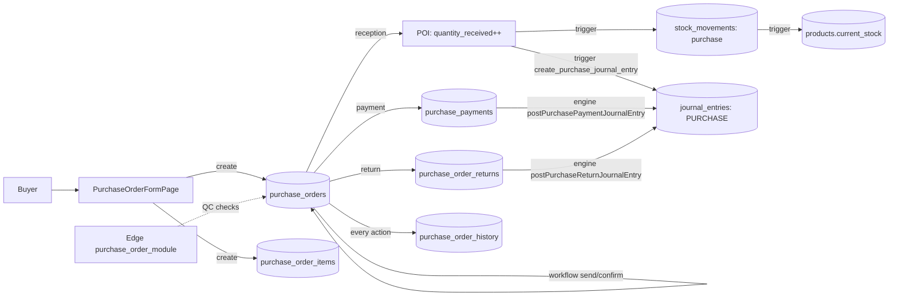

# 07 — Purchasing & Suppliers

> **Last verified** : 2026-05-17
> **Structure** : ce fichier fusionne la **vue fonctionnelle** (le *pourquoi* et le *quoi* métier) et la **référence technique** (le *comment* implémenté). Pour les tâches à faire, voir [`../../workplan/backlog-by-module/07-purchasing-suppliers.md`](../../workplan/backlog-by-module/07-purchasing-suppliers.md).
> **Related E2E flows** : [04-purchase-order-cycle](../08-flows-end-to-end/04-purchase-order-cycle.md).
> **App de rattachement** : Backoffice (le module est exclusivement back-office — pas d'extension POS).

> **En une phrase** : le module Purchasing & Suppliers est l'outil unique où The Breakery centralise tous ses fournisseurs et toutes ses commandes d'approvisionnement, de la rédaction du bon jusqu'au paiement, en alimentant automatiquement le stock et la comptabilité — pour que rien ne se perde entre la cuisine, le bureau et le grand livre.

---

## Table des matières

- [Partie I — Vue fonctionnelle](#partie-i--vue-fonctionnelle)
  - [1. Raison d'être](#1-raison-dêtre)
  - [2. Objectif côté Suppliers (fournisseurs)](#2-objectif-côté-suppliers-fournisseurs)
  - [3. Objectif côté Purchase Orders (bons de commande)](#3-objectif-côté-purchase-orders-bons-de-commande)
  - [4. Objectif comptable (couplage avec Accounting)](#4-objectif-comptable-couplage-avec-accounting)
  - [5. Objectif côté reporting et pilotage](#5-objectif-côté-reporting-et-pilotage)
  - [6. Objectifs transverses (non-fonctionnels)](#6-objectifs-transverses-non-fonctionnels)
  - [7. Limites assumées V2](#7-limites-assumées-v2)
  - [8. Utilisateurs cibles](#8-utilisateurs-cibles)
- [Partie II — Référence technique](#partie-ii--référence-technique)
  - [9. Vue d'ensemble technique](#9-vue-densemble-technique)
  - [10. Architecture conceptuelle](#10-architecture-conceptuelle)
  - [11. State machine PO](#11-state-machine-po)
  - [12. Diagramme de responsabilité](#12-diagramme-de-responsabilité)
  - [13. Tables DB impliquées](#13-tables-db-impliquées)
  - [14. Hooks principaux](#14-hooks-principaux)
  - [15. Services principaux](#15-services-principaux)
  - [16. Composants UI principaux](#16-composants-ui-principaux)
  - [17. Stores Zustand utilisés](#17-stores-zustand-utilisés)
  - [18. RPCs / Edge Functions / Triggers](#18-rpcs--edge-functions--triggers)
  - [19. RLS & Permissions](#19-rls--permissions)
  - [20. Routes](#20-routes)
  - [21. Workflow détaillé : QC à la réception](#21-workflow-détaillé--qc-à-la-réception)
  - [22. Workflow détaillé : retours fournisseur](#22-workflow-détaillé--retours-fournisseur)
  - [23. Flows E2E associés](#23-flows-e2e-associés)
  - [24. Pitfalls spécifiques](#24-pitfalls-spécifiques)
- [Partie III — Backlog opérationnel](#partie-iii--backlog-opérationnel)
- [Partie IV — Design & UX](#partie-iv--design--ux)
  - [25. Thèmes et contextes d'affichage](#25-thèmes-et-contextes-daffichage)
  - [26. Écrans du module](#26-écrans-du-module)
  - [27. Layout patterns appliqués](#27-layout-patterns-appliqués)
  - [28. Composants UI signature](#28-composants-ui-signature)
  - [29. États visuels critiques](#29-états-visuels-critiques)
  - [30. Couleurs sémantiques utilisées](#30-couleurs-sémantiques-utilisées)
  - [31. Microcopy et empty states](#31-microcopy-et-empty-states)
  - [32. Références visuelles externes](#32-références-visuelles-externes)
  - [33. À faire côté design (backlog UX)](#33-à-faire-côté-design-backlog-ux)

---

# Partie I — Vue fonctionnelle

## 1. Raison d'être

Le module Purchasing & Suppliers existe pour piloter **toute la chaîne d'approvisionnement** de la boulangerie : depuis le moment où l'on identifie un besoin (farine à recommander, nouveau fournisseur de packaging) jusqu'au paiement de la facture et à l'impact sur les comptes.

En un mot : **transformer un besoin matière en stock disponible en cuisine, avec une trace comptable propre.**

---

## 2. Objectif côté Suppliers (fournisseurs)

Tenir le **carnet d'adresses opérationnel** des partenaires d'approvisionnement de The Breakery.

Le module doit permettre à un responsable achat (ou au gérant) de :

- **Référencer** chaque fournisseur avec ses informations utiles : contact, adresse, NPWP (identifiant fiscal indonésien), coordonnées bancaires, conditions de paiement (cash on delivery, net 7/14/30/60 jours), catégorie (farine, boissons, packaging, services…).
- **Retrouver rapidement** un fournisseur (recherche par nom, par catégorie).
- **Désactiver** un fournisseur qui n'est plus sollicité, sans casser l'historique des commandes passées avec lui.
- **Visualiser la relation commerciale** sur la durée : combien on a dépensé chez lui, combien de commandes passées, combien reste impayé, quel est son délai moyen de livraison, comment ses prix évoluent sur les produits clés.
- **Importer en masse** un fichier de fournisseurs existant (Excel/CSV) pour démarrer rapidement ou intégrer une reprise de données.

Bénéfice métier : **objectiver les décisions d'achat** (qui est fiable, qui est cher, qui paie en retard) au lieu de naviguer à l'intuition.

---

## 3. Objectif côté Purchase Orders (bons de commande)

Donner à The Breakery un **vrai cycle de commande structuré**, à la place de WhatsApp + post-its.

Concrètement, le module doit permettre de :

### 3.1 Préparer une commande

- Créer un bon de commande adressé à un fournisseur précis.
- Lister les produits commandés avec quantité, unité (kg, L, pcs…), prix unitaire négocié et TVA applicable.
- Appliquer un escompte global (montant ou pourcentage) ou par ligne.
- Ajouter des frais de livraison (`shipping_cost`).
- Sauvegarder en brouillon (`draft`) pour finaliser plus tard.

### 3.2 Envoyer et faire confirmer

- Marquer la commande comme envoyée au fournisseur (`sent`).
- La passer en confirmée (`confirmed`) une fois que le fournisseur a accusé réception.
- Pouvoir annuler tant que la marchandise n'est pas arrivée.

### 3.3 Réceptionner la marchandise

C'est l'étape la plus sensible. Le module doit gérer :

- **Réception partielle** : si le fournisseur ne livre que 8 sacs sur 10 commandés, on saisit 8 et le bon passe en `partially_received`. Le solde reste ouvert pour la prochaine livraison.
- **Contrôle qualité (QC)** par ligne : chaque article peut être marqué accepté ou rejeté. Un article rejeté déclenche un retour fournisseur.
- **Mise à jour automatique du stock** : la quantité reçue alimente immédiatement le stock du produit en cuisine, avec gestion des conversions d'unité (commandé en kg, stocké en g, par exemple).
- **Recalcul automatique du prix de revient** du produit à partir du dernier prix d'achat — essentiel pour que les marges affichées restent justes.
- **Date de réception** modifiable (utile si on enregistre la livraison le lendemain).

### 3.4 Tracer chaque action

Tout événement sur le bon de commande (création, envoi, confirmation, réception, retour, paiement, annulation, modification) est consigné dans une **timeline horodatée** avec l'utilisateur qui l'a fait. Aucune action n'est silencieuse.

### 3.5 Gérer les retours fournisseur

- Sélectionner les articles à renvoyer (qty ≤ qty reçue).
- Indiquer la raison (défaut, mauvais produit, périmé, surstock, autre).
- Saisir le montant remboursé attendu.
- L'opération réduit le stock et déclenche l'écriture comptable correspondante.

### 3.6 Payer et clôturer

- Marquer un bon comme payé partiellement ou totalement.
- Renseigner la méthode (cash, virement bancaire, carte).
- Conserver la date de paiement pour le suivi cash-flow.

### 3.7 Joindre des documents

Attacher au bon de commande la facture du fournisseur, le bon de livraison, une photo des marchandises endommagées… stockés dans Supabase Storage et accessibles depuis la fiche du PO.

### 3.8 Importer / exporter

- Exporter en XLSX la liste des PO (pour reporting externe, comptable).
- Importer un fichier de PO historiques (reprise de données).

---

## 4. Objectif comptable (couplage avec Accounting)

Le module a pour mission de **produire automatiquement les écritures comptables** correspondant aux flux d'achat, pour respecter les standards SAK EMKM / SAK ETAP indonésiens — sans ressaisie manuelle dans le grand livre.

Trois moments génèrent une écriture :

| Moment | Écriture comptable (logique) |
|---|---|
| **Réception** des marchandises | Augmenter le stock + la TVA récupérable, créer une dette envers le fournisseur. |
| **Paiement** du fournisseur | Solder la dette, sortir l'argent de la caisse ou de la banque. |
| **Retour** au fournisseur | Réduire la dette, sortir la marchandise du stock. |

Le responsable des achats ne pense pas à ces écritures — elles sont créées automatiquement, mais auditables. La période fiscale doit rester ouverte au moment où l'opération est saisie (sinon le système refuse la réception, pour préserver l'intégrité des comptes déjà clôturés).

---

## 5. Objectif côté reporting et pilotage

À partir des données alimentées par ce module, The Breakery doit pouvoir répondre à :

- Quel est mon **top fournisseur** en montant dépensé sur les 90 derniers jours ?
- Quelles **factures impayées** s'accumulent (PO Aging) ?
- Comment se répartit ma **dépense par catégorie** (matières premières vs packaging vs services) ?
- Quel est le **taux de livraison à temps** de chaque fournisseur ?
- Comment **évolue le prix d'achat** de mes produits-clés (farine, beurre, café) dans le temps ?

Ces questions sont adressées par les rapports dédiés du module Reports, alimentés par les données saisies ici.

---

## 6. Objectifs transverses (non-fonctionnels)

| Objectif | Pourquoi |
|---|---|
| **Aucune saisie en double** | Le stock et la compta se mettent à jour automatiquement à partir des actions purchasing. Le responsable achat n'a pas à ressaisir ailleurs. |
| **Traçabilité totale** | Chaque action sur un PO est horodatée et attribuée à un utilisateur. L'historique est immutable (append-only) — on ne peut pas réécrire le passé. |
| **Contrôle d'accès** | Seuls les profils habilités (`inventory.create`, `inventory.update`, etc.) peuvent créer/modifier/recevoir. La lecture est autorisée à tout utilisateur authentifié pour la transparence. |
| **Résilience aux erreurs** | Un PO en brouillon peut être supprimé sans conséquence. Une fois envoyé, on doit l'annuler explicitement (avec raison loggée). Un PO reçu est figé — la correction passe par un retour fournisseur. |
| **Numérotation fiable** | Chaque PO a un numéro unique `PO-YYYYMM-XXXX` généré côté serveur, anti-collision si deux utilisateurs créent en même temps. |

---

## 7. Limites assumées V2

- **Pas d'envoi d'email automatique** au fournisseur — le bouton "Send" change juste le statut. L'envoi réel se fait hors-outil (WhatsApp, email manuel).
- **Pas de génération PDF** du PO côté V2 (envisagé V3).
- **Pas de multi-devise** — tout est en IDR. Pour un fournisseur étranger, conversion manuelle à saisir dans les notes.
- **Pas de gestion automatique du landed cost** — les frais de port gonflent le total payé au fournisseur mais ne sont pas répartis pro-rata sur le coût de revient produit. Ajustement manuel si on veut intégrer.
- **Pas d'avoir comptable automatique** sur retour après paiement intégral — géré manuellement à la prochaine facture.
- **Pas de workflow d'approbation** multi-niveaux (un seul utilisateur crée et envoie). Suffisant pour ~20 utilisateurs / 1 site.

---

## 8. Utilisateurs cibles

| Rôle | Ce qu'il fait dans le module |
|---|---|
| **Gérant** | Référence un nouveau fournisseur, valide les conditions de paiement, consulte les KPIs (dépense, impayés). |
| **Responsable achats** | Crée et envoie les bons de commande, suit les confirmations, déclenche les paiements. |
| **Chef de production / cuisine** | Réceptionne la marchandise, fait le QC, signale les retours. |
| **Comptable** | Consulte les écritures générées, contrôle la cohérence des montants, paie les factures. |

---

# Partie II — Référence technique

## 9. Vue d'ensemble technique

Le module Purchasing gère le répertoire fournisseurs, le cycle complet des bons de commande
(draft → sent → confirmed → partially_received → received), le QC à réception, les retours
fournisseur, et l'historique d'activité immutable. À la réception, il déclenche un mouvement
de stock `purchase` et un Journal Entry `PURCHASE` via le trigger
`create_purchase_journal_entry`. Le module est étroitement couplé à Inventory (création
de mouvements stock) et Accounting (génération JE pour Inventory + VAT Input + AP).

---

## 10. Architecture conceptuelle

Un Purchase Order (PO) suit un cycle de vie strict modélisé par une **state machine**
(cf. `usePurchaseOrderWorkflow.getValidTransitions`). À chaque transition, une ligne
est insérée dans `purchase_order_history` (append-only). À la réception (`received`),
le trigger SQL `create_purchase_journal_entry` génère automatiquement le JE comptable :
**Dr Inventory + Dr VAT Input / Cr Accounts Payable**. Le paiement ultérieur du PO
(`purchase_payments`) génère un second JE via `postPurchasePaymentJournalEntry` :
**Dr Accounts Payable / Cr Cash ou Bank**. Ainsi le cycle "from order to cash" est
entièrement traçable comptablement.

---

## 11. State machine PO

```
draft ─send──▶ sent ─confirm──▶ confirmed ─receive (partial)──▶ partially_received
  │              │                  │                                    │
  │              │                  └─receive (full)──▶ received         │
  │              │                                                        │
  │              ▼                  ▼                                    ▼
  └────────▶ cancelled       receive (full)──▶ received          receive (more)──▶ received

modified ─confirm──▶ confirmed (re-soumission après édition d'un PO déjà sent)
```

`received` et `cancelled` sont **terminaux** (aucune transition sortante).
Helper `getValidTransitions(status)` retourne les actions UI disponibles.

---

## 12. Diagramme de responsabilité



---

## 13. Tables DB impliquées

| Table | Rôle |
|---|---|
| `suppliers` | Répertoire fournisseurs (nom, contact, NPWP, payment_terms, category) |
| `supplier_categories` | Catégorisation fournisseurs (alimentation, boissons, packaging…) |
| `purchase_orders` | En-tête PO (PO number `PO-YYYYMMDD-XXXX`, status, dates, totaux, payment_status) |
| `purchase_order_items` | Lignes PO (`quantity`, `quantity_received`, `quantity_returned`, `unit_price`, `tax_rate`, `qc_passed` tri-state) |
| `purchase_order_returns` | Retours fournisseur (lié à un item, raison, qty, refund) |
| `purchase_order_history` | Journal d'activité PO immutable (created, sent, confirmed, partially_received, received, cancelled, modified, payment_made, item_returned) |
| `purchase_order_attachments` | Pièces jointes (factures, BL) stockées dans Supabase Storage |
| `supplier_pricing` | Prix négociés par fournisseur×produit (auto-fill PO form) |

---

## 14. Hooks principaux

| Hook | Chemin | Rôle |
|---|---|---|
| `usePurchaseOrders` | `src/hooks/purchasing/usePurchaseOrders.ts` | Liste PO paginée + filtres (`status`, `paymentStatus`, `supplierId`, dates) — types `TPOStatus`, `TPaymentStatus` exportés |
| `useCreatePurchaseOrder` | `src/hooks/purchasing/usePurchaseOrders.ts` | Crée header + items + log history `created` |
| `useUpdatePurchaseOrder` | `src/hooks/purchasing/usePurchaseOrders.ts` | Modification (status optionnel — passe en `modified` si déjà sent) |
| `usePurchaseOrderDetail` | `src/hooks/purchasing/usePurchaseOrderDetail.ts` | Détail PO + items + supplier + history (jointure complète) |
| `usePurchaseOrderActions` | `src/hooks/purchasing/usePurchaseOrderActions.ts` | Actions ponctuelles : duplicate, archive, restore |
| `usePurchaseOrderWorkflow` | `src/hooks/purchasing/usePurchaseOrderWorkflow.ts` | State machine : `getValidTransitions`, `isValidTransition`, mutations `useSendPurchaseOrder`, `useConfirmPurchaseOrder`, `useCancelPurchaseOrder` + `logPOHistory` helper |
| `usePurchaseOrderReception` | `src/hooks/purchasing/usePurchaseOrderReception.ts` | Réception items (qty + QC pass/fail) → update items, statut, déclenche stock_movement + JE |
| `usePOActivityLog` | `src/hooks/purchasing/usePOActivityLog.ts` | Lecture timeline `purchase_order_history` enrichie avec user info |
| `usePOAttachments` | `src/hooks/purchasing/usePOAttachments.ts` | Upload/list/delete attachments (Supabase Storage bucket `po-attachments`) |
| `useSuppliers` | `src/hooks/purchasing/useSuppliers.ts` | Liste fournisseurs paginée + filtres |
| `useSuppliersCrud` | `src/hooks/purchasing/useSuppliersCrud.ts` | Mutations create / update / soft-delete fournisseur |
| `useSupplierDetail` | `src/hooks/purchasing/useSupplierDetail.ts` | Détail fournisseur + KPIs (total dépensé, dernier PO, top produits) |
| `useRawMaterials` | `src/hooks/purchasing/useRawMaterials.ts` | Liste produits filtrés par `product_type='raw_material'` pour les combobox PO |

---

## 15. Services principaux

| Service | Chemin | Rôle |
|---|---|---|
| `poImportExportService.ts` | `src/services/purchasing/poImportExportService.ts` | Import / export PO depuis CSV/XLSX (validation lignes + upsert) |
| `supplierImportExportService.ts` | `src/services/purchasing/supplierImportExportService.ts` | Import bulk fournisseurs avec normalisation NPWP + dédup par phone |

Pas de service `accountingEngine`-spécifique pour purchasing : les wrappers (`postPurchasePaymentJournalEntry`, `postPurchaseReturnJournalEntry`) vivent dans `src/services/accounting/accountingEngine.ts`.

---

## 16. Composants UI principaux

| Composant | Chemin | Rôle |
|---|---|---|
| `PODetailHeader` | `src/components/purchasing/PODetailHeader.tsx` | En-tête détail PO : status badge, actions workflow, supplier link |
| `POItemsTable` | `src/components/purchasing/POItemsTable.tsx` | Table items éditable (réception qty + QC checkbox) |
| `POSummarySidebar` | `src/components/purchasing/POSummarySidebar.tsx` | Sidebar totaux (subtotal, discount, tax, shipping, total) + paiement |
| `POInfoCard` | `src/components/purchasing/POInfoCard.tsx` | Card métadonnées (dates, supplier, PO number) |
| `POHistoryTimeline` | `src/components/purchasing/POHistoryTimeline.tsx` | Timeline chronologique des actions (purchase_order_history) |
| `POReturnModal` | `src/components/purchasing/POReturnModal.tsx` | Modal retour fournisseur (sélection items, qty, raison) |
| `POReturnsSection` | `src/components/purchasing/POReturnsSection.tsx` | Section liste retours d'un PO |
| `POCancelModal` | `src/components/purchasing/POCancelModal.tsx` | Modal annulation avec raison (loggée dans history) |
| `POAttachmentsSection` | `src/components/purchasing/POAttachmentsSection.tsx` | Drop-zone upload + liste pièces jointes |
| `POFormHeader` | `src/pages/purchasing/po-form/POFormHeader.tsx` | En-tête formulaire création/edit PO |
| `POFormItems` | `src/pages/purchasing/po-form/POFormItems.tsx` | Lignes éditables avec `POProductCombobox` |
| `POFormSummary` | `src/pages/purchasing/po-form/POFormSummary.tsx` | Récapitulatif live + boutons sauvegarder / envoyer |
| `PODiscountModal` | `src/pages/purchasing/po-form/PODiscountModal.tsx` | Modal application discount global (montant ou %) |
| `SupplierFormModal` | `src/pages/purchasing/suppliers/SupplierFormModal.tsx` | Modal CRUD fournisseur |
| `SupplierImportModal` | `src/pages/purchasing/suppliers/SupplierImportModal.tsx` | Import CSV/XLSX fournisseurs |

---

## 17. Stores Zustand utilisés

- `useAuthStore` — résout `user.id` pour `created_by`, `confirmed_by`, `received_by`, audit history.
- `useCoreSettingsStore` — lit `inventory_config.po_lead_time_days` (utilisé par `inventoryAlerts.createPoFromLowStock` pour pré-remplir `expected_date`).

Pas de store dédié purchasing — react-query gère tout (stale 30s sur la liste).

---

## 18. RPCs / Edge Functions / Triggers

### Edge Function

| Function | Rôle |
|---|---|
| `purchase_order_module` | Endpoint Deno avec `verify_jwt: true` qui centralise les opérations PO sensibles : validation QC batch, calcul totaux server-side (anti-tampering), vérification permissions par action. Sert de fallback / sanity-check pour les mutations critiques. Les hooks privilégient l'écriture directe via Supabase client mais peuvent appeler cette function pour les opérations multi-tables atomiques. |

### Triggers SQL

| Trigger | Rôle |
|---|---|
| `create_purchase_journal_entry()` | Sur `purchase_orders` UPDATE, quand `NEW.status = 'received'` (et `OLD.status != 'received'`) → crée JE balanced : Dr `INVENTORY_GENERAL` (subtotal) + Dr `PURCHASE_VAT_INPUT` (tax) / Cr `PURCHASE_PAYABLE` (total). Avec garde fiscal period via `check_fiscal_period_open`. Idempotency via clé `(reference_type='purchase', reference_id=PO.id)`. |
| `update_po_payment_status` | Recalcule `purchase_orders.payment_status` quand un `purchase_payment` est inséré (unpaid → partially_paid → paid). |
| `log_po_history_on_status_change` | Insère automatiquement une ligne `purchase_order_history` à chaque changement de status. |
| `tr_update_product_cost_on_purchase` (S17) | À chaque INSERT dans `stock_movements` avec `movement_type IN ('purchase', 'incoming')`, recalcule `products.cost_price` via formule WAC (Weighted Average Cost) : `new_cost = (old_cost × old_stock + receive_cost × receive_qty) / (old_stock + receive_qty)`. **Effet cascade** : ce nouveau `cost_price` déclenche en chaîne `tr_snapshot_on_product_cost_change` qui propage des snapshots dans `recipe_versions` pour **toutes les recettes ancestres** via WITH RECURSIVE walk (depth-5). Concrètement : recevoir un PO de farine met automatiquement à jour le coût matière de la farine, puis le coût de la pâte à pain (recette qui contient farine), puis le coût du sandwich (recette qui contient pâte à pain), etc. Migrations `20260521000012..013`. |

### RPCs PostgreSQL

| RPC | Rôle |
|---|---|
| `next_journal_entry_number(p_prefix)` | Génère `PO-YYYYMMDD-NNNN` séquentiel pour les JE de purchasing |
| `check_fiscal_period_open(p_entry_date)` | Garde côté trigger : refuse réception si la période fiscale est closed/locked |

---

## 19. RLS & Permissions

Toutes les tables (`suppliers`, `purchase_orders`, `purchase_order_items`, `purchase_order_returns`, `purchase_order_history`, `purchase_order_attachments`) ont RLS activé.

| Action | Permission requise |
|---|---|
| Lecture | `is_authenticated()` (toutes les tables) |
| INSERT supplier / PO / item / return | `inventory.create` (alias historique pour le module purchasing) |
| UPDATE PO / supplier | `inventory.update` |
| DELETE supplier (soft) | `inventory.delete` |
| Modification status workflow | Validée par `usePurchaseOrderWorkflow.isValidTransition` côté client + check trigger côté DB |

`purchase_order_history` est append-only (aucune policy UPDATE/DELETE).

---

## 20. Routes

```
/purchasing/suppliers                      — SuppliersPage
/purchasing/suppliers/:id                  — SupplierDetailPage
/purchasing/purchase-orders                — PurchaseOrdersPage
/purchasing/purchase-orders/new            — PurchaseOrderFormPage (création)
/purchasing/purchase-orders/:id            — PurchaseOrderDetailPage
/purchasing/purchase-orders/:id/edit       — PurchaseOrderFormPage (édition)
```

Routes legacy : `/purchases` → `/purchasing/purchase-orders`, `/inventory/suppliers` → `/purchasing/suppliers`.

Toutes les routes sont gardées par `RouteGuard permission="inventory.view"` (ou `.create`, `.update`).

---

## 21. Workflow détaillé : QC à la réception

À la réception d'un PO, chaque `purchase_order_item` doit être inspecté :

- `qc_passed = NULL` (initial) — en attente d'inspection.
- `qc_passed = TRUE` — accepté, `quantity_received` peut être incrémenté.
- `qc_passed = FALSE` — rejeté, déclenche obligatoirement un `purchase_order_returns`
  pour la quantité refusée. Le PO peut quand même passer en `partially_received` ou
  `received` selon la qty restante.

Le composant `POItemsTable` permet la saisie batch (cocher tous, qc_pass tous, set qty
all-to-ordered) et appelle `usePurchaseOrderReception.receivePO()` qui fait un single
batch upsert + transition status (validée par state machine).

> **Effet de bord cost depuis S17** : la réception qui déclenche `INSERT INTO stock_movements (movement_type='purchase')` (via `receive_stock_v1` RPC SECURITY DEFINER — voir module 06 §28bis) active automatiquement `tr_update_product_cost_on_purchase` qui recalcule `products.cost_price` via WAC, puis cascade des snapshots `recipe_versions` aux recettes ancestres. Conséquence métier : à chaque réception, les marges théoriques de tous les produits finis utilisant cet ingrédient (directement ou indirectement via sub-recipes) sont automatiquement à jour. Voir module 15 §25bis pour la cascade complète.
>
> Side-effects connus :
> - DEV-S17-1.B-01 : un `UPDATE products.cost_price` manuel par un manager (hors purchase) **bypasse** la WAC et n'émet pas de `stock_movements` audit row — possibilité de drift silencieux.
> - DEV-S17-1.C-01 : WAC s'applique uniformément à tous les `purchase` movements ; pas d'opt-out pour réception d'échantillon ou stock promo (low priority).
> - DEV-S17-1.C-02 : WAC garbage-in si `current_stock` est stale au moment du calcul.
> - TASK-07-012 landed cost (shipping/douane pro-rata) reste **TODO** — la WAC consomme le `base_price` de la ligne PO, pas un landed cost composé.

---

## 22. Workflow détaillé : retours fournisseur

Un retour (`purchase_order_returns`) est créé via `POReturnModal` :

1. Sélection items + qty à retourner (≤ `quantity_received`).
2. Choix raison (defective, wrong_item, expired, overstock).
3. Insert `purchase_order_returns` lié au PO + items concernés.
4. `quantity_returned` incrémenté sur `purchase_order_items`.
5. Wrapper `postPurchaseReturnJournalEntry` génère JE :
   **Dr Accounts Payable / Cr Inventory General** (réduction de la dette + sortie de stock).
6. Ligne `purchase_order_history` `item_returned` avec metadata.

Si retour AVANT paiement, le `payment_status` reste cohérent (`amount_due` recalculé).
Si retour APRÈS paiement intégral, génère un avoir fournisseur à la prochaine facture
(géré manuellement, pas d'avoir comptable auto).

---

## 23. Flows E2E associés

- **04 — Purchase Order cycle** : create → send (status `sent`) → confirm (`confirmed`) → reception partielle (`partially_received`) → reception complète (`received`) → JE auto via trigger → payment (`partially_paid` puis `paid`) → JE payment via `postPurchasePaymentJournalEntry`. Chaque étape log dans `purchase_order_history`. Inclut variants : retour fournisseur (`item_returned`) avec JE `postPurchaseReturnJournalEntry`, annulation (`cancelled`).

---

## 24. Pitfalls spécifiques

- **State machine stricte** : `getValidTransitions(status)` empêche les transitions invalides (ex: `received` n'a aucune transition possible — figé). Toute UI de bouton doit consulter ce helper avant d'afficher l'action.
- **`qc_passed` est tri-state** (`NULL` / `TRUE` / `FALSE`) — ne pas typer en `boolean` strict côté TS. Un item `NULL` reste en attente d'inspection ; `FALSE` bloque la réception complète et impose un retour fournisseur.
- **JE créée par trigger** quand status passe à `received` — ne pas appeler `accountingEngine.postPurchaseJournalEntry()` côté client (n'existe pas d'ailleurs : seuls `postPurchasePaymentJournalEntry` et `postPurchaseReturnJournalEntry` sont exposés). Doublonner causerait deux JE.
- **`PRODUCTION_COGS` mapping cassé** historiquement (cf. `docs/audit/02-accounting-business-audit.md` Phase 2) — pointait vers code `5100` qui est un GROUP non-postable. Vérifier après chaque migration accounting que les mappings purchasing pointent bien vers des comptes `is_postable=true`.
- **Réception partielle sans rollback** : si on saisit qty reçue > qty commandée, le trigger acceptera mais `payment_status` peut sembler incohérent. Le composant `POItemsTable` doit valider `quantityReceived <= quantityOrdered + tolerance`.
- **Suppliers soft-delete** (colonne `deleted_at`) — toutes les queries doivent filtrer `is_null('deleted_at')` ou utiliser la view `v_active_suppliers`.
- **Edge Function `purchase_order_module`** doit avoir `verify_jwt: true` et appeler `user_has_permission(auth.uid(), 'inventory.create')` au début de chaque endpoint (pattern AppGrav strict).
- **Attachments dans Supabase Storage** : le bucket `po-attachments` doit avoir des policies RLS qui filtrent par `purchase_order_id` dans le path. Vérifier que les uploads passent bien le check authent.
- **PO modifiable après envoi** : transition `sent` → `modified` autorisée, mais le trigger n'envoie PAS de notif au fournisseur — c'est manuel. À surveiller dans les workflows automatisés.
- **`tax_rate` constant 10% côté code** (cf. `inventoryAlerts.createPoFromLowStock` ligne 433) — la valeur n'est PAS lue depuis settings dynamiques. Si l'établissement bascule sur un taux différent (ex: 11% futur), refactor requis.
- **Total PO calculé côté client** par défaut : `subtotal + tax_amount + shipping_cost − discount_amount`. L'Edge Function `purchase_order_module` recalcule server-side comme contre-vérification (anti-tampering). Toute incohérence devrait alerter.
- **`supplier_pricing` non-utilisée systématiquement** : le combobox `POProductCombobox` peut pré-remplir le `unit_price` depuis `supplier_pricing` si présent, sinon fallback sur `cost_price`. Activer cette feature pour assurer cohérence des prix négociés.
- **Réception sans PO** : pour les achats spontanés (cash & carry, dépannage), passer par `IncomingStockPage` du module Inventory qui crée directement un `stock_movement` `purchase` sans PO. Le JE peut être créé manuellement via `accounting/journal-entries`.
- **Logs `purchase_order_history` cumulés** : pour PO long ou souvent modifié, la timeline peut devenir volumineuse. Pas de mécanisme de cleanup — à surveiller si l'on dépasse 100 actions par PO.
- **Permissions purchasing alignées sur inventory** : historiquement le code utilise `inventory.create` / `inventory.update` / `inventory.view` même pour purchasing. Si on veut séparer `purchasing.*` permissions à l'avenir, refactor requis (currently confusing pour les RH qui paramètrent les rôles).
- **PO depuis low stock alerts** : `inventoryAlerts.createPoFromLowStock(supplierId, items)` permet de générer un PO draft depuis les suggestions reorder. Le PO est en `draft` — il faut explicitement le `send` ensuite. Le supplier_id est manuel (pas d'auto-lookup par produit).
- **Import PO CSV/XLSX** : `poImportExportService.importFromFile` permet de remonter en bulk des PO historiques (migration de données). Validation per-line, preview, puis insert. Pas idempotent : un re-import crée des doublons (vérifier `po_number` UK avant).
- **JE auto à la réception bloquée par fiscal period** : si la période contenant `received_date` est `closed` ou `locked`, le trigger `create_purchase_journal_entry` lève une exception (via `check_fiscal_period_open`). Le PO ne peut PAS être marqué `received` → blocage workflow. Solution : déverrouiller la période ou backdater.
- **Suppliers avec NPWP** : la colonne `npwp` (Nomor Pokok Wajib Pajak — ID fiscal indonésien) est optionnelle mais nécessaire pour les achats avec PB1 / PPN déductible. Si manquant, le système ne calcule pas la VAT Input — perte de déductibilité.
- **Liens Supplier ↔ Product** : un fournisseur n'a pas de FK directe vers `products`. La liaison se fait via `purchase_order_items` historiques + table optionnelle `supplier_pricing`. Pour identifier le fournisseur principal d'un produit, agrégation custom requise (top supplier par fréquence sur 90j).
- **Affichage `total_amount` de la liste** : la liste PO pagine 30 par défaut sans subtotal global. Pour un total période, utiliser `useReports` ou agrégation manuelle. À industrialiser dans une view `v_po_period_summary`.
- **Quantités décimales** : `quantity` et `quantity_received` sont DECIMAL — supportent les unités fractionnées (kg, L, mL). Attention aux conversions d'unité non-faites côté DB : le PO en kg, le mouvement de stock en g requiert un facteur multiplicateur côté client (à industrialiser via `unit_conversions` table — pas seedée).
- **Activity log riche** : `purchase_order_history` contient une colonne `metadata` JSONB qui peut stocker des contextes additionnels (ex: nouveau total après modif, items modifiés). L'UI `POHistoryTimeline` ne déserialise pas tous les cas — auditer pour voir si certains événements perdent du contexte.
- **Email send PO au fournisseur** : pas d'intégration native. Le bouton "Send to Supplier" change juste le status `draft → sent`. Pour envoyer effectivement, exporter PO en PDF (à implémenter, pas encore en V2) ou copier-coller le PO number dans un email manuel.
- **PO reception : staff_id** : le `staff_id` qui réceptionne est résolu via `useAuthStore.user.id` côté client. Si plusieurs staff manipulent la même session navigateur, attribution incorrecte. Pour rigueur, demander un PIN au moment de réceptionner (pattern POS).
- **Reports purchasing** : 3-4 rapports dédiés purchasing existent dans `/reports` (Top Suppliers, PO Aging, Spend by Category, On-time Delivery Rate). Cf. module Reports — utilisent les vues SQL et les RPCs.
- **Suppliers soft-delete et FK** : un supplier soft-deleted (`deleted_at IS NOT NULL`) reste référencé par les PO historiques (FK protégée par ON DELETE RESTRICT). Le combobox doit filtrer les soft-deleted dans les nouveaux PO mais les afficher dans l'historique.
- **Discount global vs par-ligne** : le PO supporte un discount global (`discount_amount` ou `discount_percentage` au header) ET un discount par ligne. Le total final est la somme des line_totals (post-discount par-ligne) MOINS le discount global. Attention à ne pas double-discounter dans la prévisualisation UI.
- **Shipping cost ajouté au total mais non-réparti** : `shipping_cost` au header gonfle le total mais n'est PAS réparti pro-rata sur les lignes (pas de "landed cost" automatique). Le `cost_price` du produit reste inchangé. Pour intégrer le shipping dans le COGS, ajustement manuel ou trigger custom requis.
- **Multi-currency** : pas supporté nativement — tout est en IDR. Pour fournisseurs étrangers (importation), saisir manuellement le taux de change dans `notes` et convertir avant saisie. Limite connue, refactor envisagé V3.

---

# Partie III — Backlog opérationnel

Pour les tâches techniques à exécuter (envoi PDF fournisseur, multi-devise, landed cost auto, workflow approbation, séparation permissions `purchasing.*`, génération PDF du PO, refactor `tax_rate` dynamique, automatisation avoirs comptables), voir :

→ [`../../workplan/backlog-by-module/07-purchasing-suppliers.md`](../../workplan/backlog-by-module/07-purchasing-suppliers.md)

Tâches priorisées P0–P3 avec critères d'acceptation, dépendances, estimations et risques identifiés.

---

# Partie IV — Design & UX

> **Source canonique** : [`../../DESIGN_POS_AND_BACKOFFICE.md`](../../DESIGN_POS_AND_BACKOFFICE.md) (design détaillé des deux apps).
> **Tokens techniques** : [`../../../DESIGN.md`](../../../DESIGN.md) (variables CSS, scales, classes Tailwind).
> **Screenshots de référence** : [`../../ux/assets/screens/`](../../ux/assets/screens/) — source de vérité visuelle.
> **Design system global** : [`../02-design-system/`](../02-design-system/) (7 fichiers : Luxe Dark, tokens, shadcn, layouts, responsive).

## 25. Thèmes et contextes d'affichage

Le module Purchasing est **exclusivement Backoffice** — il n'a pas d'extension POS car la chaîne d'approvisionnement est un travail back-office (bureau, calme, dense, multi-tabs). Un seul thème s'applique :

| Contexte | Thème CSS | Pages concernées | Identité |
|---|---|---|---|
| **Backoffice principal** | `.theme-backoffice` (ivoire `#F8F8F6`) | `/purchasing/*` (6 routes) | Salle de commandement claire, dense, scrollable — formulaire long, table dense, timeline d'activité |

**Constante de marque** : l'or `#C9A55C` ressort sur les CTA primaires (Send PO, Confirm reception), les totaux PO, et les status badges `received` / `paid`. Voir [`../../DESIGN_POS_AND_BACKOFFICE.md`](../../DESIGN_POS_AND_BACKOFFICE.md) §4 (Backoffice).

---

## 26. Écrans du module

| Route | Type d'écran | Densité | Composants signature |
|---|---|---|---|
| `/purchasing/suppliers` | Liste paginée + filtres | Moyenne | Stats cards (total suppliers, top spend, overdue), FilterBar, table |
| `/purchasing/suppliers/:id` | Fiche détail + KPIs | Haute | KPI cards (total spent, last PO, top products), tabs (Overview / POs / Pricing / Documents) |
| `/purchasing/purchase-orders` | Liste paginée + filtres | Haute | StatusBadge multi-état, payment_status badge, action menu kebab |
| `/purchasing/purchase-orders/new` | Formulaire long 4 sections | Très haute | `POFormHeader`, `POFormItems`, `PODiscountModal`, `POFormSummary` sidebar |
| `/purchasing/purchase-orders/:id` | Détail + workflow + timeline | Maximale | `PODetailHeader` actions workflow, `POItemsTable`, `POHistoryTimeline`, `POSummarySidebar`, `POAttachmentsSection`, `POReturnsSection` |
| `/purchasing/purchase-orders/:id/edit` | Formulaire édition | Très haute | Idem `/new` mais avec status check `modified` |

---

## 27. Layout patterns appliqués

### 27.1 Backoffice — Pages liste (`/purchasing/suppliers`, `/purchasing/purchase-orders`)

Pattern récurrent de toute liste Backoffice (cf. [`../../DESIGN_POS_AND_BACKOFFICE.md`](../../DESIGN_POS_AND_BACKOFFICE.md) §4.3) :

1. **Header de page** : titre + sous-titre + actions à droite (bouton primaire "New PO" / "New Supplier", import, export).
2. **Stats cards** en row (3 à 5 KPI compactes) — pour Purchasing : `Open POs`, `Total spent (30d)`, `Unpaid total`, `Suppliers active`, `On-time delivery rate`.
3. **Filters bar** : recherche + dropdowns (status, payment_status, supplier, period) + bouton "Reset".
4. **Table** principale avec header sticky, lignes alternées doucement, hover row `surface-2`, status badges colorés.
5. **Pagination** + sélecteur "Items per page" (30 par défaut).
6. **Export buttons** : CSV + XLSX en haut à droite.

### 27.2 Backoffice — Fiche détail PO (`/purchasing/purchase-orders/:id`)

Pattern fiche détail (cf. §4.4 du design doc) à très haute densité :

1. **Breadcrumb** : `< Back to Purchase Orders` + `PO-20260501-0042`.
2. **Bloc identité** (`PODetailHeader`) : PO number, status badge (draft / sent / confirmed / partially_received / received / cancelled), supplier link, actions workflow (Send / Confirm / Receive / Cancel) selon `getValidTransitions(status)`.
3. **Layout 2 colonnes** : table items à gauche (~70%), sidebar récap à droite (~30%).
4. **Table items** (`POItemsTable`) : product name, ordered qty, received qty (input editable si reception en cours), QC checkbox tri-state, unit price, line total.
5. **Sidebar** (`POSummarySidebar`) : subtotal, discount, tax, shipping, **TOTAL** en gold gros, payment buttons.
6. **Sections en dessous** : `POHistoryTimeline` (timeline chronologique), `POAttachmentsSection` (drop-zone + miniatures), `POReturnsSection` (liste retours si présents).

### 27.3 Backoffice — Fiche détail Supplier (`/purchasing/suppliers/:id`)

Pattern fiche détail standard :

1. **Breadcrumb** + nom fournisseur + badges (category, payment_terms, active/inactive).
2. **KPI cards** : Total spent lifetime, Open POs, Avg lead time, On-time rate.
3. **Tabs horizontaux** : Overview / Purchase Orders / Pricing / Documents / History.
4. **Onglet Overview** : contact info, address, NPWP, bank account, notes.
5. **Onglet Purchase Orders** : table filtrée des PO de ce fournisseur.
6. **Onglet Pricing** : table `supplier_pricing` (product × negotiated price).

### 27.4 Backoffice — Formulaire PO (`/purchasing/purchase-orders/new`)

Pattern formulaire long avec sidebar récap :

- **Header sticky** : titre "New Purchase Order" + boutons "Save draft" / "Send to supplier" (CTA primaire gold).
- **Section Supplier** : autocomplete fournisseur + display info (payment terms, lead time).
- **Section Items** (`POFormItems`) : table éditable avec `POProductCombobox` (auto-fill prix depuis `supplier_pricing`), qty, unit, unit_price, tax_rate, line_total. Bouton "Add line" en bas.
- **Section Adjustments** : `PODiscountModal` (global ou par ligne), shipping_cost, notes.
- **Section Dates** : expected_date, expected_delivery, payment_due_date (calculé auto selon terms).
- **Sidebar fixe droite** (`POFormSummary`) : récap live (subtotal / discount / tax / shipping / total) + boutons d'action.

---

## 28. Composants UI signature

| Composant | Type | Usage | Style clé |
|---|---|---|---|
| `PODetailHeader` | Header workflow | `/purchasing/purchase-orders/:id` | Status badge gros, actions workflow conditionnelles via `getValidTransitions` |
| `POItemsTable` | Table éditable | Réception PO | Qty receive input avec auto-focus suivant, QC checkbox tri-state (vide / vert / rouge) |
| `POSummarySidebar` | Sidebar sticky | Détail PO | Totaux alignés monospace, total en gold gros, paiement progress bar |
| `POHistoryTimeline` | Timeline verticale | Détail PO | Icônes Lucide par event type, user avatar + timestamp, metadata expandable |
| `POReturnModal` | Modal multi-step | Détail PO action | Sélection items checkbox, qty input ≤ received, raison dropdown, refund amount |
| `POAttachmentsSection` | Drop-zone + grid | Détail PO | Miniatures uploadées (PDF, images), preview modal au clic |
| `POFormItems` | Table form lignes | Formulaire PO | `POProductCombobox` avec auto-fill prix, calcul live line_total |
| `POProductCombobox` | Autocomplete | Lignes PO form | Filtre `product_type='raw_material'`, affiche cost_price + last supplier price |
| `SupplierFormModal` | Modal CRUD | Liste suppliers | Form sections (info, contact, bank, terms), NPWP avec masque |
| `SupplierImportModal` | Wizard import | Liste suppliers | 3 étapes (upload / preview / result) avec normalisation NPWP + dédup phone |

---

## 29. États visuels critiques

| État | Visuel | Pourquoi |
|---|---|---|
| **PO `draft`** | Badge gris foncé, actions Edit / Delete dispo | Modifiable librement |
| **PO `sent`** | Badge bleu, action "Confirm receipt" | En attente fournisseur |
| **PO `confirmed`** | Badge violet, action "Receive" dispo | Engagement client |
| **PO `partially_received`** | Badge orange + progress bar (qty reçue / qty commandée) | Reste à livrer |
| **PO `received`** | Badge vert success, **figé** (aucune action workflow) | Terminal — passer par retour pour modifier |
| **PO `cancelled`** | Badge rouge, raison loggée affichée | Terminal — historique préservé |
| **QC `qc_passed = NULL`** | Checkbox vide gris | En attente d'inspection |
| **QC `qc_passed = TRUE`** | Checkbox check vert | Accepté |
| **QC `qc_passed = FALSE`** | Checkbox croix rouge + ouverture auto `POReturnModal` | Rejeté — return obligatoire |
| **Fiscal period closed** | Bannière rouge sticky en haut : "Reception blocked — period 2026-04 is closed" | `check_fiscal_period_open` a refusé |
| **Supplier soft-deleted** | Ligne grisée + badge "Archived" | Apparaît dans historique mais pas dans combobox new PO |
| **Payment status `paid`** | Badge success + montant total en gold | Cycle complet |
| **Payment status `partially_paid`** | Badge orange + montant payé / total en monospace | Solde à régler |
| **Payment status `unpaid` overdue** | Badge rouge pulse + nb jours retard | Relance à faire |

---

## 30. Couleurs sémantiques utilisées

| Rôle | POS (dark) | Backoffice (light) | Usage Purchasing |
|---|---|---|---|
| **Success** | `#34D399` | `#16A34A` | PO `received`, payment `paid`, QC pass |
| **Warning** | `#FBBF24` | `#D97706` | PO `partially_received`, payment `partially_paid`, fiscal period warning |
| **Error** | `#F87171` | `#DC2626` | PO `cancelled`, QC fail, payment overdue, fiscal period closed |
| **Info** | `#60A5FA` | `#2563EB` | PO `sent`, attachment uploads, links |
| **Gold** | `#C9A55C` | `#C9A55C` | CTA primaire "Send PO", "Confirm reception", "Generate payment", total montants |

---

## 31. Microcopy et empty states

### Empty states

| Page | Texte | CTA |
|---|---|---|
| `/purchasing/suppliers` (aucun fournisseur) | "No suppliers yet — start by adding your first one" + icône `Truck` grise | "Add supplier" |
| `/purchasing/suppliers/:id` (aucun PO chez ce fournisseur) | "No purchase orders for this supplier yet" | "Create PO" |
| `/purchasing/purchase-orders` (aucun PO) | "No purchase orders yet — your purchasing cycle starts here" + icône `Package` grise | "Create your first PO" |
| `/purchasing/purchase-orders/:id` (aucun attachment) | "No documents attached — drag invoice or delivery note here" | drop zone visible |
| `/purchasing/purchase-orders/:id` (aucun retour) | (section masquée par défaut, apparaît au premier retour) | — |

### Confirmations destructives

- **Cancel a sent PO** : "Cancelling this PO will notify history but won't auto-email the supplier. Confirm cancellation?" + raison obligatoire (defective_supply, wrong_pricing, out_of_business, internal_decision) + bouton "Cancel PO" rouge.
- **Soft-delete supplier** : "This supplier has 12 historical POs — they will remain visible. The supplier won't appear in new PO selections. Confirm?" + bouton "Archive supplier".
- **Receive PO with QC fail** : "3 items are marked QC failed. You must register a return for the rejected quantities. Continue receiving?" + bouton "Receive & open returns" gold.

### Toast notifications

- Success PO sent : "PO-20260501-0042 sent to Bali Flour Mill — status now Sent"
- Success reception : "PO received — 250 kg flour added to Main Warehouse / JE PO-20260501-0042 posted"
- Success return : "Return registered — 5 kg flour out, refund 75,000 IDR pending / JE posted"
- Error fiscal period : "Cannot receive — fiscal period 2026-04 is locked. Unlock the period or change reception date."
- Error QC required : "Cannot mark received — 2 items still pending QC inspection"
- Error budget alert : "This PO exceeds monthly category budget by 1,200,000 IDR — manager approval required"

---

## 32. Références visuelles externes

| Ressource | Chemin / lien |
|---|---|
| Design doc complet (POS + Backoffice) | [`../../DESIGN_POS_AND_BACKOFFICE.md`](../../DESIGN_POS_AND_BACKOFFICE.md) |
| Tokens canoniques V2 | [`../../../DESIGN.md`](../../../DESIGN.md) à la racine |
| Inventaire tokens V2 | [`../../ux/v2-token-inventory.md`](../../ux/v2-token-inventory.md) |
| Screenshots Backoffice de référence | [`../../ux/assets/screens/backoffice/`](../../ux/assets/screens/backoffice/) |
| Design system feature components | [`../02-design-system/04-feature-components.md`](../02-design-system/04-feature-components.md) |
| Module connexe Inventory (réception alimente stock) | [`./06-inventory-stock.md`](./06-inventory-stock.md) |
| Module connexe Accounting (JE auto à réception) | [`./10-accounting-double-entry.md`](./10-accounting-double-entry.md) |

---

## 33. À faire côté design (backlog UX)

| Priorité | Évolution UX | Bénéfice |
|---|---|---|
| 🔴 | **PDF preview du PO** avant envoi fournisseur | Visualiser le rendu officiel — actuellement aucun PDF généré en V2 |
| 🔴 | **Workflow d'approbation multi-niveau** visuel | Boutons "Submit for approval" / "Approve" / "Reject" selon rôle ; états `pending_approval` distincts |
| 🔴 | **Email send-to-supplier intégré** | Bouton "Send to supplier" qui envoie réellement un email avec PDF en pièce jointe (au lieu de juste changer le statut) |
| 🟠 | **Drag & drop reorder lignes PO** | Réorganiser visuellement les items d'un PO long avant envoi (UX form) |
| 🟠 | **Diff visuel PO modifié** | Si un PO `sent` est édité (`modified`), montrer côte-à-côte ancien vs nouveau avant re-confirmation |
| 🟠 | **Lead time visuel** sur fournisseurs | Graphique délais de livraison par fournisseur (heatmap) pour piloter les retards |
| 🟡 | **Auto-suggest fournisseur** par produit | Au saisie d'un produit dans `POFormItems`, suggérer le top supplier historique de ce produit |
| 🟡 | **Vue calendrier des réceptions prévues** | Calendrier mensuel avec les `expected_delivery` colorés par status |
| 🟡 | **Cost trend mini-chart** par produit | Mini-graphique des 12 derniers prix d'achat directement dans le combobox produit |
| 🟢 | **Drag & drop document upload** | Améliorer la zone d'upload attachments avec preview en direct + reorder |
| 🟢 | **Mode "express reception"** mobile | Vue tablette portrait pour faire le QC en cuisine au moment de la réception |
