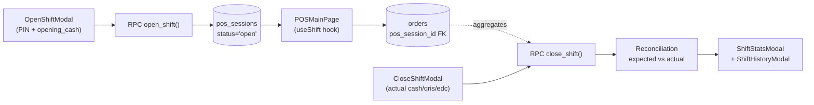
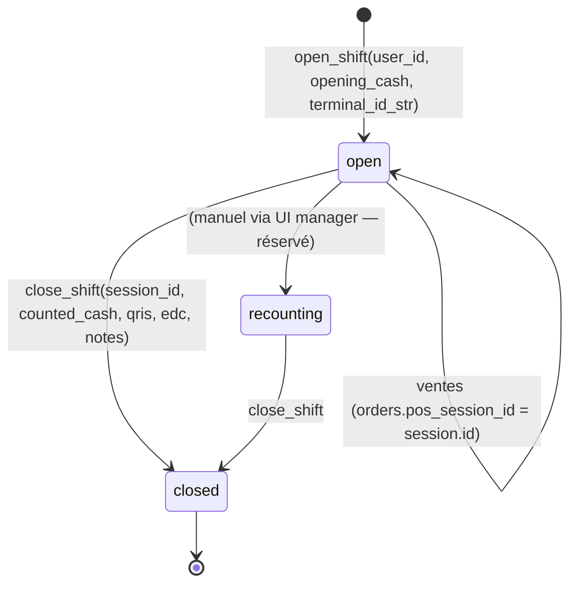

# 12 — Cash Register & Shift

> **Last verified** : 2026-05-13
> **Structure** : ce fichier fusionne la **vue fonctionnelle** (le *pourquoi* et le *quoi* métier) et la **référence technique** (le *comment* implémenté). Pour les tâches à faire, voir [`../../workplan/backlog-by-module/12-cash-register-shift.md`](../../workplan/backlog-by-module/12-cash-register-shift.md).
> **Related E2E flows** : [11-shift-cash-reconciliation](../08-flows-end-to-end/11-shift-cash-reconciliation.md), [10-end-of-day](../08-flows-end-to-end/10-end-of-day.md), [01-pos-sale-cash](../08-flows-end-to-end/01-pos-sale-cash.md).
> **App de rattachement** : POS (modales sur `/pos`) + Accounting (JE auto à la clôture, vues `view_session_*`).
> **Prérequis** : [02 — POS Cart & Orders](./02-pos-cart-orders.md), [03 — Payments & Split](./03-payments-split.md), [10 — Accounting](./10-accounting-double-entry.md).

> **En une phrase** : le module Cash Register est le notaire de la caisse de The Breakery — il transforme un tiroir-caisse en cycle fermé chiffré et signé, refuse toute vente tant qu'aucune session n'est ouverte, calcule l'écart 3-way (cash + QRIS + EDC) à la fermeture sans jamais l'inventer, exige une raison écrite si l'écart dépasse le seuil critique, et alimente automatiquement la comptabilité — pour que chaque journée commence et finisse sur un chiffre indiscutable, et qu'aucun argent ne disparaisse jamais dans le flou.

---

## Table des matières

- [Partie I — Vue fonctionnelle](#partie-i--vue-fonctionnelle)
  - [1. Raison d'être](#1-raison-dêtre)
  - [2. Les 5 modales du cycle de vie](#2-les-5-modales-du-cycle-de-vie)
  - [3. Les 5 invariants du module](#3-les-5-invariants-du-module)
  - [4. Ouvrir une session — Le rituel du matin](#4-ouvrir-une-session--le-rituel-du-matin)
  - [5. Pendant la session — La caisse vit](#5-pendant-la-session--la-caisse-vit)
  - [6. Fermer la session — Le rituel du soir](#6-fermer-la-session--le-rituel-du-soir)
  - [7. Le recounting — La marche arrière contrôlée](#7-le-recounting--la-marche-arrière-contrôlée)
  - [8. Historique des sessions](#8-historique-des-sessions)
  - [9. Multi-terminal — Le LAN partagé](#9-multi-terminal--le-lan-partagé)
  - [10. Les reports adossés](#10-les-reports-adossés)
  - [11. Couplage comptable](#11-couplage-comptable)
  - [12. Permissions](#12-permissions)
  - [13. Mécaniques transverses](#13-mécaniques-transverses)
  - [14. Ce que le module ne fait pas](#14-ce-que-le-module-ne-fait-pas)
  - [15. Utilisateurs cibles](#15-utilisateurs-cibles)
- [Partie II — Référence technique](#partie-ii--référence-technique)
  - [16. Vue d'ensemble technique](#16-vue-densemble-technique)
  - [17. Tables DB](#17-tables-db)
  - [18. Workflow shift](#18-workflow-shift)
  - [19. Variance calculation](#19-variance-calculation)
  - [20. RPCs Supabase](#20-rpcs-supabase)
  - [21. Hook composite useShift](#21-hook-composite-useshift)
  - [22. Composants UI](#22-composants-ui)
  - [23. Composants POS Reports liés](#23-composants-pos-reports-liés)
  - [24. Routes](#24-routes)
  - [25. RLS & permissions](#25-rls--permissions)
  - [26. Vues analytics liées](#26-vues-analytics-liées)
  - [27. Exemple de payload close_shift](#27-exemple-de-payload-close_shift)
  - [28. Pitfalls](#28-pitfalls)
- [Partie III — Backlog opérationnel](#partie-iii--backlog-opérationnel)
- [Partie IV — Design & UX](#partie-iv--design--ux)
  - [29. Thèmes et contextes d'affichage](#29-thèmes-et-contextes-daffichage)
  - [30. Écrans du module](#30-écrans-du-module)
  - [31. Layout patterns appliqués](#31-layout-patterns-appliqués)
  - [32. Composants UI signature](#32-composants-ui-signature)
  - [33. États visuels critiques](#33-états-visuels-critiques)
  - [34. Couleurs sémantiques utilisées](#34-couleurs-sémantiques-utilisées)
  - [35. Microcopy et empty states](#35-microcopy-et-empty-states)
  - [36. Références visuelles externes](#36-références-visuelles-externes)
  - [37. À faire côté design (backlog UX)](#37-à-faire-côté-design-backlog-ux)

---

# Partie I — Vue fonctionnelle

## 1. Raison d'être

Le module Cash Register est le **gardien de la cohérence cash** de The Breakery. Il répond à une question simple mais structurante dans toute entreprise qui manipule du liquide :

> *"Au matin j'ai mis 500 000 IDR dans le tiroir. Au soir je compte 2 350 000 IDR. Est-ce que ça colle avec ce que la caisse a encaissé sur la journée ? Et si ça ne colle pas, qui peut me dire pourquoi ?"*

C'est le module qui transforme **un tiroir-caisse plein d'argent** en **objet auditable** : ouverture chiffrée, transactions cash tracées, comptage de fermeture, écart calculé automatiquement, validation manager, archivage permanent.

Sans lui, l'argent disparaît dans la masse — un cashier honnête ne sait pas se défendre face à un soupçon, un cashier malhonnête n'a aucun mur devant lui. Avec lui, chaque journée est un **cycle fermé** : on ouvre, on encaisse, on referme, on réconcilie, on signe.

C'est aussi le module qui **conditionne tout le reste du POS** : tant qu'aucune session n'est ouverte, la caisse refuse de prendre la moindre commande.

---

## 2. Les 5 modales du cycle de vie

Le module est piloté par **5 modales** correspondant aux 5 moments-clés d'une session :

| Modal | Quand | Job-to-be-done |
|---|---|---|
| **OpenShiftModal** | Début de service | Ouvrir une session avec comptage du fond de caisse |
| **CloseShiftModal** | Fin de service | Initier la clôture |
| **ShiftReconciliationModal** | Pendant la clôture | Compter le tiroir et constater l'écart |
| **ShiftStatsModal** | Pendant la clôture | Consulter les stats de session avant signature |
| **ShiftHistoryModal** | À tout moment | Revoir les sessions passées avec leurs écarts |

Le cycle est **strictement linéaire** : on ne peut pas re-compter une session fermée, on ne peut pas ouvrir si une autre est déjà ouverte sur le même couple `(user, terminal)`, on ne peut pas vendre sans session.

---

## 3. Les 5 invariants du module

Quelles que soient les circonstances, le module garantit :

1. **Une session par utilisateur par terminal**. Impossible d'avoir deux sessions ouvertes simultanément sur le même couple `(user, terminal)`. La RPC `open_shift` refuse.
2. **Pas de vente sans session ouverte**. Le POS refuse toute transaction tant qu'aucune session `status = 'open'` n'existe pour le cashier connecté.
3. **Comptage cash chiffré obligatoire**. Ouverture comme fermeture exigent une saisie numérique — on ne peut pas "estimer". Pas de session sans nombre.
4. **Écart calculé, jamais inventé**. À la clôture, `expected_cash = opening_cash + cash_sales − cash_refunds`. Le système calcule, le cashier ne triche pas en arrière.
5. **Session fermée = session figée**. Une fois `status = 'closed'`, aucune modification possible — même par admin. Pour corriger une erreur, il faut un ajustement comptable manuel tracé.

---

## 4. Ouvrir une session — Le rituel du matin

### 4.1 Le geste

Avant la première vente, le cashier qui prend son poste déclenche `OpenShiftModal` :

- **Sélection du terminal** : sur quel poste physique on ouvre (Terminal 1 caisse principale, Terminal 2 comptoir café…).
- **Comptage du fond de caisse** : saisie du montant total de l'`opening_cash`.
- **Détail facultatif par coupure** (`opening_cash_details` JSONB) : combien de 100k, combien de 50k, combien de 20k, etc. — pour audit fin.
- **Validation** → la RPC `open_shift` crée la session avec un numéro séquentiel `SHF-YYYYMMDD-NN`.

### 4.2 Les contrôles automatiques

- Vérifie qu'**aucune session ouverte** n'existe pour ce cashier — sinon refus.
- Génère le `session_number` (format daté pour traçabilité comptable).
- Marque l'horodatage `opened_at` au timestamp exact.
- Enregistre `opened_by = user_id` (qui a ouvert).

Bénéfice métier : **un point de départ chiffré et signé**. À 14h, si on suspecte un problème de caisse, on remonte au comptage d'ouverture du matin — il existe, il est signé, il est immuable.

---

## 5. Pendant la session — La caisse vit

Tant que la session est ouverte, le POS l'utilise comme contexte transparent :

- Chaque commande créée référence implicitement la session active (`orders.pos_session_id`).
- Chaque paiement cash alimente le **total cash attendu** de la session.
- Chaque refund cash alimente le **total cash sorti**.
- Les autres méthodes de paiement (card, QRIS, e-wallet) sont également agrégées par session — pour la réconciliation par méthode (3-way reconciliation).

Vue rapide pendant la session : `POSReportsModal` (accessible depuis le POS) affiche en direct :

- Nombre de commandes encaissées par ce cashier sur cette session.
- CA total, panier moyen.
- Répartition par méthode de paiement.
- Voids et refunds.

Bénéfice métier : **le cashier voit où il en est** pendant la journée, sans devoir attendre la clôture. Il peut anticiper son comptage de fin.

---

## 6. Fermer la session — Le rituel du soir

### 6.1 Initiation

`CloseShiftModal` est déclenché par le cashier ou le manager à la fin du service. La modale propose le parcours guidé :

1. Affichage rappel du fond d'ouverture.
2. Bouton "Compter le tiroir" → ouvre `ShiftReconciliationModal`.

### 6.2 La réconciliation — `ShiftReconciliationModal`

C'est **le cœur du module**. La modale demande au cashier de compter physiquement, puis saisit :

- **`actual_cash`** (montant cash physique compté).
- **`actual_qris`** (total QRIS rapporté par l'agrégateur).
- **`actual_edc`** (total ticket EDC).
- Optionnel : détail par coupure (`closing_cash_details`) pour audit fin.

Le système calcule **automatiquement** :

| Indicateur | Formule |
|---|---|
| `expected_cash` | `opening_cash + Σ cash payments − Σ cash refunds` |
| `expected_qris` | `Σ orders.qris payments` |
| `expected_edc` | `Σ orders.card/edc payments` |
| `cash_difference` | `actual_cash − expected_cash` |
| `qris_difference` | `actual_qris − expected_qris` |
| `edc_difference` | `actual_edc − expected_edc` |
| Sévérité de l'écart | OK (0), info (<5k), warning (5k−50k), critical (>50k) |

L'écart est affiché en grand, **avec sa couleur** : vert si zéro, orange si petit, rouge si critique.

Si écart > seuil configuré, le système **exige une raison écrite obligatoire** avant de pouvoir continuer.

Bénéfice métier : **la vérité chiffrée s'impose en 5 secondes**. Pas de bricolage Excel, pas de "à peu près" — le tiroir colle ou ne colle pas, et le système le dit.

### 6.3 Les stats — `ShiftStatsModal`

Avant signature finale, le cashier ou le manager consulte le récap complet :

- **CA total** sur la session.
- **Nombre de commandes** (et nombre de couverts si dine-in).
- **Panier moyen**.
- **Répartition par méthode** : combien en cash, combien en card, en QRIS, en e-wallet, en B2B credit.
- **Total des remises** appliquées sur la session.
- **Liste des voids** (annulations).
- **Liste des refunds** (remboursements).

Bénéfice : **dernière chance de détecter une anomalie** avant clôture (ex: "tiens, j'ai fait 5 refunds aujourd'hui — pourquoi tant ?").

### 6.4 Validation manager

Si la politique l'exige (configurable dans Settings), la clôture nécessite la **validation d'un manager** avec PIN :

- `manager_id` enregistré.
- `manager_validated = true`.
- Le manager couvre le cashier de sa signature.

### 6.5 Clôture finale

À la validation, la RPC `close_shift` :

- Marque `closed_at = now()`.
- Marque `closed_by = user_id`.
- Persiste `counted_cash`, `expected_cash`, `cash_difference`, `actual_cash`, idem QRIS et EDC.
- Calcule et persiste les totaux par méthode de paiement.
- Calcule `total_sales` et `transaction_count` agrégés.
- Bascule `status` en `closed`.

À noter : `close_shift` **ne crée pas** d'écriture comptable automatique. Le dépôt cash en banque (mouvement 1110 → 1120) doit être saisi manuellement dans `/accounting/journals`. Cf. pitfall §28.

Bénéfice métier : **la journée est fermée, signée et persistée** en moins de 5 minutes. Le tiroir peut être vidé en sécurité, l'argent peut partir en banque.

---

## 7. Le recounting — La marche arrière contrôlée

Le système prévoit un **statut intermédiaire** `recounting` pour gérer le cas spécifique où le cashier vient de "fermer" mais réalise qu'il y a un problème :

- "Attends, j'ai oublié de compter les billets de 10k au fond du tiroir."
- Bascule en `recounting` → on peut re-saisir le `counted_cash`.
- Une fois corrigé, on confirme la clôture (`closed`).

Mais : **on ne peut pas re-ouvrir une session `closed`**. Le statut `recounting` est uniquement accessible **avant** la clôture finale signée.

Bénéfice métier : **tolérer l'erreur humaine** sans permettre la triche. Le cashier corrige son comptage, mais il ne peut pas revenir 3 jours plus tard pour modifier l'écart constaté.

---

## 8. Historique des sessions

Une vue accessible à tout moment (`ShiftHistoryModal`) qui liste :

- Les **N dernières sessions** du cashier connecté (ou de tous les cashiers, selon permissions).
- Pour chaque session : numéro, date, opening, expected, counted, écart, durée, statut.
- **Coloration de l'écart** : vert OK, orange warning, rouge critical.
- Clic sur une session → détail complet (stats, méthodes de paiement, voids, refunds).

Bénéfice métier : **mémoire chiffrée de la performance cash** sur la durée. Permet de repérer les patterns (ce cashier a un écart positif systématique, cet autre est en moins le mardi…).

---

## 9. Multi-terminal — Le LAN partagé

The Breakery peut avoir **plusieurs terminaux POS** ouverts en même temps sur le même LAN (caisse principale + comptoir café + caisse mobile événement). Chaque terminal peut héberger **plusieurs sessions** simultanément (multi-caissier sur un terminal physique) — le hook `useShift` gère le switching via `activeShiftUserId` persisté en `localStorage`.

La modale `LiveSessionsModal` (côté POS) permet à un manager de voir :

- Toutes les sessions actuellement ouvertes sur le terminal.
- Par qui, depuis quand.
- CA en cours sur chaque session.

Bénéfice métier : **piloter la salle en temps réel** depuis n'importe quel terminal. Le manager voit que la caisse 2 fait 80 % moins de transactions que la caisse 1 — peut-être que la cashier est en pause sans avoir prévenu.

---

## 10. Les reports adossés

Le module alimente plusieurs reports critiques du module Reports :

| Report | Donnée |
|---|---|
| **Sales Cash Balance** | Réconciliation cash par session — montrer les sessions avec écart |
| **Cash Variance Trend** | Tendance des écarts sur 30 jours par cashier (détection fraude progressive) |
| **Payment By Method** | Répartition cash / digital agrégée par session |
| **Staff Performance** | Stats par cashier basées sur les sessions qu'il a tenues |

Vues SQL adossées : `view_session_summary`, `view_session_cash_balance`, `view_session_discrepancies`.

Bénéfice métier : **les sessions ne sont pas juste des bouts de papier** — elles nourrissent l'audit comptable et l'audit RH du gérant.

---

## 11. Couplage comptable

Chaque session, à sa clôture, fournit les **données chiffrées nécessaires** aux écritures comptables :

| Événement | Impact comptable |
|---|---|
| Ouverture | Pas d'écriture (le cash existait déjà — il bouge juste physiquement vers le tiroir). |
| Ventes cash pendant la session | Déjà écritées au fil de l'eau par les triggers de commande. |
| Écart positif à la clôture | À comptabiliser en `produit exceptionnel` (4900 ou équivalent) — JE manuel. |
| Écart négatif à la clôture | À comptabiliser en `charge exceptionnelle` (5xxx) — JE manuel. |
| Clôture | `close_shift` snapshot les totaux ; le JE de dépôt 1110 → 1120 est saisi manuellement dans `/accounting/journals`. |

Bénéfice métier : **les écarts ne disparaissent pas dans la nature** — ils apparaissent dans les rapports `cash_balance` et `cash_variance_trend`, et le comptable peut interroger les sessions à l'origine pour passer les JE correspondants.

---

## 12. Permissions

| Permission | Action |
|---|---|
| `pos.open_session` | Ouvrir une nouvelle session |
| `pos.close_session` | Fermer une session existante |
| `pos.view_sessions` | Voir l'historique des sessions |
| `pos.validate_session` | Valider la clôture en tant que manager (pour les seuils élevés) |
| `pos.recount` | Corriger un comptage avant clôture finale (`status='recounting'`) |

Bénéfice métier : **cloisonner les responsabilités cash**. Un cashier peut ouvrir et fermer la sienne, mais pas valider celle d'un autre ; un manager valide mais n'opère pas.

---

## 13. Mécaniques transverses

| Module | Relation |
|---|---|
| **POS** | Refuse toute commande sans session active. Affiche la session active dans le header. |
| **Orders** | Chaque commande référence sa session via `orders.pos_session_id` — drill-down possible. |
| **Payments** | Méthodes de paiement consolidées par `expected_cash/qris/edc`. |
| **Accounting** | Les écritures de clôture (écart, dépôt) sont manuelles ; les vues `view_session_*` alimentent les rapports. |
| **Users & Permissions** | Permissions `pos.open_session` / `pos.close_session` / `pos.validate_session`. |
| **Reports** | Sales Cash Balance, Cash Variance Trend, Payment By Method consomment `pos_sessions`. |
| **Settings** | Seuil d'écart pour validation manager + politique de validation (`pos_config`). |
| **LAN** | Multi-caissier sur un même terminal physique via `terminal_id_str` partagé. |

---

## 14. Ce que le module ne fait pas

- Le module **ne gère pas le coffre-fort**. Le dépôt en banque du cash est une opération externe (à venir : module Cash Management).
- Le module **ne fait pas de mouvement intermédiaire** (cash-in / cash-out pendant la session). Pour ajouter du fond en cours, il faut fermer la session puis en ouvrir une nouvelle. *Cf. backlog.*
- Le module **ne supporte pas les sessions multi-journée**. Une session ne peut pas durer plus de 24h — au-delà, fermeture forcée par script.
- Le module **ne calcule pas la TVA / PB1**. Ce calcul est fait au niveau de chaque commande (tax inclusive 10/110).
- Le module **ne signe pas électroniquement** (KSeF, fiscal certification). Pas de certification fiscale Indonésie obligatoire en V2.
- Le module **ne crée pas de JE automatique** à la clôture — le comptable saisit manuellement le dépôt banque et les écarts.

---

## 15. Utilisateurs cibles

| Rôle | Ce qu'il fait dans le module |
|---|---|
| **Caissier** | Ouvre la session le matin avec comptage du fond, encaisse pendant le service, ferme le soir avec comptage 3-way. |
| **Manager** | Valide les clôtures avec écart critical (PIN), consulte `LiveSessionsModal`, peut basculer en `recounting`. |
| **Gérant** | Consulte `ShiftHistoryModal` pour repérer les patterns, exploite les rapports `cash_variance_trend`. |
| **Comptable** | Saisit les JE de dépôt 1110→1120 + ajustement écart à partir des données `view_session_*`. |

---

# Partie II — Référence technique

## 16. Vue d'ensemble technique

Module de gestion des sessions de caisse (shifts). Chaque session matérialise une période d'ouverture du terminal POS pour un caissier donné, avec compte d'ouverture (fond de caisse), enregistrement de toutes les transactions de la période, et réconciliation **3-way** (cash + QRIS + EDC) à la fermeture. Toute commande POS est rattachée à `pos_sessions.id` via `orders.pos_session_id`, ce qui sert de pivot pour les rapports de fin de journée.



**Cas d'usage clé** : The Breakery a 1–2 terminaux POS et 3–5 caissiers qui se relaient. Le terminal lui-même est partagé ; chaque caissier ouvre **sa propre** session via PIN. Plusieurs sessions peuvent coexister sur un même terminal — le hook `useShift` gère le switching via `activeShiftUserId` persisté en `localStorage`.

---

## 17. Tables DB

| Table | Rôle | RLS |
|---|---|---|
| `pos_sessions` | Une ligne par session (open + close), une session par caissier × terminal | permission-based |
| `pos_terminals` | Référentiel des terminaux physiques (nom, MAC, paramètres) — voir [19 — Settings](./19-settings-configuration.md) | enabled |

Colonnes clés de `pos_sessions` (cf. `src/hooks/useShift.ts:9` pour la forme TS) :

| Colonne | Type | Notes |
|---|---|---|
| `session_number` | `TEXT` UNIQUE | Format `SHF-YYYYMMDD-NN`, généré par `open_shift` |
| `terminal_id` | `UUID` FK NULL | Lien vers `pos_terminals` (référentiel persistant) |
| `terminal_id_str` | `TEXT` | Identifiant volatile généré côté browser : `TERM-{base36 timestamp}` (stocké en `localStorage.pos_terminal_id`) |
| `user_id` | `UUID` FK | Caissier qui ouvre la session |
| `status` | enum `session_status` | `open` / `recounting` / `closed` |
| `opened_at` / `opened_by` | `TIMESTAMPTZ` / `UUID` | Audit ouverture |
| `opening_cash` | `DECIMAL(12,2)` | Fond de caisse initial |
| `opening_cash_details` | `JSONB` | Détail billets/coins (optionnel) |
| `closed_at` / `closed_by` | `TIMESTAMPTZ` / `UUID` | Audit clôture |
| `expected_cash` / `expected_qris` / `expected_edc` | `DECIMAL(12,2)` | Calculés par `close_shift` à partir de `orders.payment_method` |
| `actual_cash` / `actual_qris` / `actual_edc` | `DECIMAL(12,2)` | Saisis par le caissier à la fermeture |
| `cash_difference` / `qris_difference` / `edc_difference` | `DECIMAL(12,2)` | `actual − expected`, peut être négatif (manque) ou positif (excédent) |
| `total_sales` / `transaction_count` | `DECIMAL(12,2)` / `INTEGER` | Snapshot agrégé à la clôture |
| `manager_id` / `manager_validated` | `UUID` / `BOOLEAN` | Validation manager si écart > seuil |
| `notes` | `TEXT` | Commentaires de réconciliation |

**Pas de table `cash_movements` séparée** — les mouvements de cash sont déduits de `orders.payment_method = 'cash'` dans la fenêtre `[opened_at, closed_at]`. Pour les sorties cash hors-ventes (paiement fournisseur en espèces), on passe par le module [11 — Expenses](./11-expenses.md) avec `payment_method='cash'`, qui débite le compte 1110 dans le JE.

---

## 18. Workflow shift



`open_shift` refuse l'ouverture si le **caissier** a déjà une session `status='open'` ailleurs (un caissier = max une session active à la fois). Plusieurs sessions de **caissiers différents** peuvent en revanche coexister sur le même terminal.

`close_shift` calcule `expected_cash`, `expected_qris`, `expected_edc`, `total_sales`, `transaction_count` en agrégeant les `orders` `status='completed'` rattachés. Toute écriture comptable de fin de journée (gestion du fond de caisse, dépôt en banque) est gérée séparément côté [10 — Accounting](./10-accounting-double-entry.md).

---

## 19. Variance calculation

Variance = compté physique − attendu théorique. Calculé pour chaque méthode de paiement :

| Méthode | Expected | Actual | Difference |
|---|---|---|---|
| Cash | `opening_cash + Σ(orders cash payments) − Σ(cash refunds)` | Compté billets + coins par le caissier | `actual − expected` |
| QRIS | `Σ(orders qris payments)` | Solde QRIS rapporté par l'agrégateur | idem |
| EDC | `Σ(orders card or edc payments)` | Total ticket EDC | idem |

Sévérité (cf. `view_session_discrepancies` pour les seuils) :

- `info` : variance ≤ 5 000 IDR (acceptable, perte/gain mineur)
- `warning` : 5 000 < variance ≤ 50 000 IDR — alerte rapport
- `critical` : variance > 50 000 IDR — `manager_validated = false` requis pour clôturer définitivement

`close_shift` retourne un `ReconciliationData` (`{ cash, qris, edc: { expected, actual, difference } }`) consommé par `ShiftReconciliationModal`.

---

## 20. RPCs Supabase

| RPC | Signature | Effet |
|---|---|---|
| `open_shift(p_user_id, p_opening_cash, p_terminal_id_str)` | Returns JSON | Crée la session si aucune `open` existante pour ce user. Génère `session_number` |
| `close_shift(p_session_id, p_user_id, p_counted_cash, p_closing_cash_details, p_notes)` | Returns `CloseShiftResult` JSON | Calcule expected_*, snapshot total_sales, set status='closed' |
| `get_user_open_shift(p_user_id)` | Returns `pos_sessions[]` | Bypass RLS pour récupération de la session courante d'un user (utilisé par `useShift` au mount) |
| `get_terminal_open_shifts(p_terminal_id)` | Returns `pos_sessions[]` | Bypass RLS pour lister toutes les sessions ouvertes sur un terminal donné (multi-caissier) |

Source : `supabase/migrations/20260205070000_add_missing_shift_lan_functions.sql` + corrections `20260210110003_db008_fix_open_shift.sql`, `20260210100004_fix_close_shift_status_filter.sql`, `20260222080244_fix_terminal_open_shifts_overload_ambiguity.sql`, `20260430180000_caissapp_shift_snapshots_and_close_rpc.sql`.

---

## 21. Hook composite useShift

Le module n'expose qu'un unique hook composite (`src/hooks/useShift.ts`, 507 lignes) qui agrège tout l'état nécessaire pour le POS :

```ts
const {
  // State
  currentSession,        // PosSession | null — session active du caissier sélectionné
  hasOpenShift,          // boolean
  isLoadingSession,
  terminalSessions,      // PosSession[] — toutes les sessions open sur ce terminal
  terminalId,            // 'TERM-XXX' (localStorage)
  activeShiftUserId,     // user_id sélectionné (multi-caissier sur un terminal)
  sessionTransactions,   // ShiftTransaction[] — orders complétées de la session
  sessionStats,          // { totalSales, transactionCount, cashTotal, qrisTotal, edcTotal, duration }
  recentSessions,        // PosSession[] — historique récent (10 dernières fermées)
  reconciliationData,    // ReconciliationData | null — affiché après close

  // Actions
  openShift, closeShift, switchToShift, recoverShift, clearReconciliation,
  refetchSession, refetchTransactions, refetchTerminalSessions,

  // Mutation flags
  isOpeningShift, isClosingShift,
} = useShift()
```

Comportements remarquables :

- **Auto-recovery** : `useEffect` au mount cherche les sessions `open` pour le user loggé via `get_user_open_shift` (bypass RLS) et restaure le state `activeShiftUserId`. Permet la reprise après reload du navigateur ou crash.
- **Multi-user switching** : `switchToShift(userId)` change le caissier actif sans fermer aucune session. Persisté en `localStorage.pos_active_shift_user_id`.
- **Fallback gracieux** : si les RPCs `get_user_open_shift` / `get_terminal_open_shifts` ne sont pas déployés (erreur `42883` ou `PGRST202`), le hook retombe sur des `SELECT` directs sur `pos_sessions` (tolérance lors des migrations).
- **Snapshot post-close** : `closedShiftStats` mémorise les totaux à la fermeture pour que `ShiftReconciliationModal` puisse les afficher même après que `currentSession` soit redevenu `null`.

---

## 22. Composants UI

`src/components/pos/shift/` :

| Composant | Rôle |
|---|---|
| `OpenShiftModal.tsx` | Sélection du caissier (PIN gate via `useShiftAuth`) + saisie `opening_cash` + bouton "Open Shift" |
| `CloseShiftModal.tsx` | Saisie 3-way (`actual_cash`, `actual_qris`, `actual_edc`) + `notes`. Affiche les attendus en preview |
| `ShiftReconciliationModal.tsx` | Récapitulatif post-close : variances par méthode + couleur sévérité + bouton "Print receipt" |
| `ShiftStatsModal.tsx` | KPIs en cours de session (CA temps réel, nb tx, panier moyen, durée) |
| `ShiftHistoryModal.tsx` | Historique des 10 dernières sessions du terminal avec `cash_difference` |
| `index.ts` | Re-export barrel |

Trigger d'affichage centralisé : `src/pages/pos/POSShiftModals.tsx` orchestre l'ouverture/fermeture et passe les callbacks au hook `useShift`.

---

## 23. Composants POS Reports liés

À l'intérieur du POS fullscreen, un modal de rapport caisse en temps réel agrège les données de la session active (`src/components/pos/reports/`) :

- `POSReportsModal.tsx` — Container avec onglets
- `POSReportsOverviewTab.tsx` — KPIs vue d'ensemble (CA, panier moyen)
- `POSReportsTransactionsTab.tsx` — Liste des `sessionTransactions` triées
- `POSReportsProductsTab.tsx` — Top produits vendus dans la session
- `POSReportsActivityTab.tsx` — Timeline horaire
- `POSReportsCancellationsTab.tsx` — Voids/refunds de la session
- `POSReportsSessionsTab.tsx` — Historique des sessions du terminal (`recentSessions`)

Ces tabs sont des vues "session-scoped" qui se distinguent du module `/reports` global ([14 — Reports & Analytics](./14-reports-analytics.md)) qui agrège sur toutes les sessions/dates.

---

## 24. Routes

| Route | Composant | Garde |
|---|---|---|
| `/pos` | `POSMainPage` qui mounte `useShift` + `POSShiftModals` | `POSAccessGuard` |
| `/pos/outstanding` | `POSOutstandingPage` (commandes non payées de la session) | `POSAccessGuard` |
| `/pos/cafe` | `CafeStockReceptionPage` (réception stock cafétéria, hors shift) | `POSAccessGuard` |

Le bouton "Open shift" / "Close shift" / "Stats" est dans la barre haute du POSMain (cf. `POSTerminalWrapper`).

---

## 25. RLS & permissions

| Permission | Action |
|---|---|
| `pos.open_session` | Ouvrir une session (bouton OpenShiftModal + RPC) |
| `pos.close_session` | Fermer une session (RPC `close_shift`) |
| `pos.view_sessions` | Voir l'historique (`ShiftHistoryModal`, `POSReportsSessionsTab`) |
| `pos.recount` | Passer une session en `recounting` (réservé manager — workflow rare) |

Policies (cf. migration `027_orders_pos_rls_policies` et seed) :

- SELECT : `is_authenticated()`
- INSERT : `user_has_permission(auth.uid(), 'pos.open_session')`
- UPDATE : `user_has_permission(auth.uid(), 'pos.open_session') OR user_has_permission(auth.uid(), 'pos.close_session')`
- DELETE : `is_admin(auth.uid())`

---

## 26. Vues analytics liées

- `view_session_summary` — résumé complet par session (durée, totaux par méthode, nb tx, écarts)
- `view_session_cash_balance` — balance cash par session (utilisé par rapport `cash_balance`)
- `view_session_discrepancies` — sessions avec écart > 0 + sévérité (`info` ≤5k IDR / `warning` 5–50k / `critical` >50k)

Ces vues sont consommées par les rapports [Cash Variance Trend](./14-reports-analytics.md) (catégorie Logs & Audit) et [Sales Cash Balance](./14-reports-analytics.md) (catégorie Finance).

---

## 27. Exemple de payload close_shift

Cas typique : caissier ferme sa session avec écart cash mineur :

```ts
// Input UI (CloseShiftModal)
closeShift(
  /* actualCash */ 2_485_000,   // compté physique
  /* actualQris */ 1_200_000,   // total QRIS rapporté
  /* actualEdc  */   850_000,   // total ticket EDC
  /* closedBy   */ 'user-3',
  /* notes      */ 'Petite caisse — écart 2k IDR sur monnaie',
)

// RPC close_shift retourne
{
  session_id: 'sess-9',
  status: 'closed',
  total_sales: 4_530_000,        // Σ orders.total où status='completed'
  transaction_count: 27,
  reconciliation: {
    cash: { expected: 2_487_000, actual: 2_485_000, difference: -2_000 },
    qris: { expected: 1_200_000, actual: 1_200_000, difference: 0 },
    edc:  { expected:   850_000, actual:   850_000, difference: 0 },
  }
}
```

`expected_cash = opening_cash (500k) + Σ(cash payments dans la session) − Σ(cash refunds) = 500k + 2,037k − 50k = 2,487k`. L'écart de -2 000 IDR est `info` (sévérité minimale).

---

## 28. Pitfalls

- **`terminal_id_str` vs `terminal_id`** : la colonne `terminal_id_str` (VARCHAR généré navigateur, ex. `TERM-XXX`) est utilisée pour le matching multi-caissier sur un même terminal physique, **pas** la FK `terminal_id` (UUID lié à `pos_terminals`). Confondre les deux casse la recovery auto.
- **Une session par user** : `open_shift` lève `Shift already open for this user` si le caissier a déjà une session `open`. Le hook `useShift.openShiftMutation` capture cette erreur et tente une recovery silencieuse via `get_user_open_shift`.
- **`expected_qris` / `expected_edc` séparés** : la migration tardive (2026-04-30) `caissapp_shift_snapshots_and_close_rpc` a séparé QRIS et EDC du champ historique unique. Les sessions antérieures ont `expected_qris=0` et `expected_edc` qui contient les deux — bien filtrer par `opened_at >= '2026-04-30'` dans les rapports historiques de variance.
- **Pas de JE auto à la close** : `close_shift` ne crée **pas** d'écriture comptable. Le dépôt cash en banque (mouvement 1110 → 1120) doit être saisi manuellement dans `/accounting/journals`. Idem pour les manques (compte 5xxx Loss on cash variance).
- **Recovery agressive** : si deux navigateurs sur le même terminal physique partagent le `localStorage.pos_terminal_id`, ils se voient mutuellement et peuvent switcher entre les sessions. C'est voulu pour le multi-caissier, mais cela signifie qu'**un terminal = un identifiant `terminal_id_str`** — ne pas réutiliser le même terminal_id_str sur deux machines distinctes.
- **`status='recounting'`** : intermédiaire prévu pour un re-comptage sans fermeture, peu utilisé en production. Ne pas confondre avec `closed`. Les rapports filtrent souvent `status != 'open'` plutôt que `status = 'closed'` pour inclure ce cas.

---

# Partie III — Backlog opérationnel

Pour les tâches techniques à exécuter (cash-in/cash-out en cours de session, validation à deux mains, dépôt bancaire intégré, comptage de coupures obligatoire, auto-clôture programmée, KSeF, coffre-fort), voir :

→ [`../../workplan/backlog-by-module/12-cash-register-shift.md`](../../workplan/backlog-by-module/12-cash-register-shift.md)

---

# Partie IV — Design & UX

> **Source canonique** : [`../../DESIGN_POS_AND_BACKOFFICE.md`](../../DESIGN_POS_AND_BACKOFFICE.md) §3 (POS dark theme) + §3.4 (modales secondaires) + §4 (Backoffice pour Accounting/Reports liés).
> **Tokens techniques** : [`../../../DESIGN.md`](../../../DESIGN.md).
> **Screenshots de référence** : [`../../ux/assets/screens/caissapp/v2-reference/`](../../ux/assets/screens/caissapp/v2-reference/).

## 29. Thèmes et contextes d'affichage

Le module Cash Register **traverse les deux apps** :

| Contexte | Thème CSS | Pages concernées | Identité |
|---|---|---|---|
| **POS Shift modals** | `.theme-pos` (noir profond `#0C0C0E`) | Modales sur `/pos` (`OpenShiftModal`, `CloseShiftModal`, `ShiftReconciliationModal`, `ShiftStatsModal`, `ShiftHistoryModal`) | Centrées plein écran, numpad virtuel, gros boutons tactiles |
| **POS Reports session-scoped** | `.theme-pos` (noir profond) | `POSReportsModal` (tabs Overview / Transactions / Products / Activity / Cancellations / Sessions) | Vue temps réel CA + transactions du shift en cours |
| **Backoffice Reports cash variance** | `.theme-backoffice` (ivoire `#F8F8F6`) | `/reports/cash-balance`, `/reports/cash-variance-trend` (catégorie Logs & Audit) | Tables denses + DateRangePicker + ComparisonKpiCard |

**Constante de marque cross-thème** : l'or `#C9A55C` pour le bouton "Close Shift" final + montants totaux. Variations de couleur sémantique selon thème (cf. §34).

---

## 30. Écrans du module

| Écran | Type | Densité | Composants signature |
|---|---|---|---|
| `OpenShiftModal` | Modal POS plein écran | Faible | Sélection cashier (PIN gate), input `opening_cash`, bouton "Open Shift" or massif |
| `CloseShiftModal` | Modal POS plein écran | Moyenne | 3 inputs (cash/qris/edc) côte à côte, preview "expected", notes textarea |
| `ShiftReconciliationModal` | Modal POS plein écran | Haute | Récap 3-way variances avec couleurs sévérité, bouton "Print receipt", validation manager PIN si critical |
| `ShiftStatsModal` | Modal POS plein écran | Très haute | KPI cards × 6 (CA, tx, panier moyen, durée, voids, refunds) + breakdown payment methods |
| `ShiftHistoryModal` | Modal POS plein écran | Moyenne | Table dense 10 dernières sessions avec coloration `cash_difference` |
| `LiveSessionsModal` | Modal POS plein écran | Moyenne | Liste sessions ouvertes sur le terminal — multi-caissier overview |
| `POSReportsModal` | Modal POS plein écran avec tabs | Très haute | Tabs Overview / Transactions / Products / Activity / Cancellations / Sessions |
| `/reports/cash-balance` | Page Backoffice | Maximale | DateRangePicker, table sessions × variance |
| `/reports/cash-variance-trend` | Page Backoffice | Maximale | Recharts line/bar variance par cashier sur 30j |

---

## 31. Layout patterns appliqués

### 31.1 POS Modal pattern (toutes les modales shift)

Pattern modale POS (cf. [`../../DESIGN_POS_AND_BACKOFFICE.md`](../../DESIGN_POS_AND_BACKOFFICE.md) §3.4) :

- **Plein écran** sur fond noir `surface-0`, blur derrière.
- **Header** : titre Playfair italique + close button discret en coin top-right.
- **Body scrollable** avec sections internes en cards `surface-1`.
- **Footer d'actions** : Cancel à gauche `text-secondary`, primary à droite `bg-gold` (bouton massif tactile ≥48px).
- **Virtual numpad** pour la saisie des montants (réutilisé du module Payments).

### 31.2 OpenShiftModal — Le rituel du matin

- **Sélecteur cashier** en haut (chips colorées, sélection PIN-gated).
- **Input `opening_cash`** massif au centre, numpad virtuel actif.
- **Optional détail coupures** : 6 inputs (100k, 50k, 20k, 10k, 5k, 2k+) repliable.
- **Bouton "Open Shift"** or massif full-width en bas.

### 31.3 CloseShiftModal — La réconciliation 3-way

- **3 colonnes** : Cash | QRIS | EDC.
- Chaque colonne :
  - Label uppercase wide tracking (CASH / QRIS / EDC).
  - **Expected** affiché en gris en haut (lecture seule).
  - **Actual** input avec numpad.
  - **Difference** calculée en temps réel avec couleur (vert OK, orange warning, rouge critical).
- **Textarea notes** en bas, obligatoire si écart > seuil.
- **Bouton "Reconcile"** en or, désactivé tant que les 3 inputs ne sont pas saisis.

### 31.4 ShiftReconciliationModal — Le récap post-close

- **3 cards 3-way** côte à côte avec variance et sévérité.
- **Card "Manager Validation"** si critical, avec PIN input.
- **Bouton "Print Receipt"** secondaire + bouton "Done" or.

### 31.5 ShiftStatsModal — KPI dense

- **6 KPI cards** uniformes (CA, nb tx, panier moyen, durée, voids, refunds).
- **Donut chart** "Revenue by Payment Method".
- **Footer** : bouton "Print Stats" secondaire.

### 31.6 Backoffice Reports (Cash Variance Trend)

Pattern Reports-like (cf. §4.7) :

- **DateRangePicker** en haut + filtres (cashier, terminal).
- **5 KPI cards** avec `ComparisonKpiCard` (delta vs période précédente).
- **2 graphiques Recharts** : line variance par jour, bar variance par cashier.
- **Table détaillée** en bas : sessions × variance × sévérité.

---

## 32. Composants UI signature

| Composant | Type | Usage | Style clé |
|---|---|---|---|
| `OpenShiftModal` | Modal plein écran | Début de service | Numpad virtuel, opening_cash input massif, validation PIN |
| `CloseShiftModal` | Modal plein écran | Fin de service | 3-way reconciliation côte à côte, preview "expected" |
| `ShiftReconciliationModal` | Modal plein écran | Post-close | Variance cards avec couleur sévérité, manager PIN si critical |
| `ShiftStatsModal` | Modal plein écran | Pendant close | KPI cards × 6 + donut payment methods |
| `ShiftHistoryModal` | Modal plein écran | Tout moment | Table dense colorée `cash_difference` |
| `POSReportsModal` | Modal tabs | Pendant session | 6 tabs scoped session — Overview / Transactions / Products / Activity / Cancellations / Sessions |

---

## 33. États visuels critiques

| État | Visuel | Pourquoi |
|---|---|---|
| **Pas de session ouverte** | Bannière rouge sticky en haut POS "No active shift — Open shift to start" + bouton "Open Shift" or pulsant | Le POS refuse les ventes — l'utilisateur doit voir pourquoi |
| **Session ouverte (header POS)** | Pastille verte clignotante + "SHF-20260513-03 · Mamat" + durée | Cashier sait quelle session est active |
| **Variance OK (zero)** | Texte vert `#34D399` + icône Check | Réconciliation parfaite |
| **Variance info (<5k)** | Texte gris `text-secondary` "OK — minor variance" | Acceptable, perte/gain mineur |
| **Variance warning (5-50k)** | Texte orange `#FBBF24` + icône AlertTriangle | Vérifier mais pas critique |
| **Variance critical (>50k)** | Texte rouge `#F87171` + icône AlertOctagon + bandeau "Manager validation required" | Action manager obligatoire |
| **Session recounting** | Badge orange "RECOUNTING" + icône RotateCcw | Marche arrière contrôlée, distinguer de `closed` |
| **Session closed** | Badge gris "CLOSED" + verrou Lock | Figée, plus modifiable |
| **Multi-session terminal** | Liste avec avatar de chaque cashier actif + CA en cours | Manager voit qui opère sur le terminal |

---

## 34. Couleurs sémantiques utilisées

| Rôle | POS (dark) | Backoffice (light) | Usage Cash Register |
|---|---|---|---|
| **Success** | `#34D399` | `#16A34A` | Variance OK (zero), session validated |
| **Info** | `#60A5FA` | `#2563EB` | Variance info (<5k) |
| **Warning** | `#FBBF24` | `#D97706` | Variance warning (5-50k), session `recounting` |
| **Error** | `#F87171` | `#DC2626` | Variance critical (>50k), session refusée à l'ouverture |
| **Gold** | `#C9A55C` | `#C9A55C` | Bouton "Open Shift" / "Close Shift" / "Reconcile", montants totaux |
| **Gris fermé** | `#A8A8B0` | `#6B7280` | Badge `closed`, sessions historiques |

---

## 35. Microcopy et empty states

### Empty states (EN)

| Page / Modal | Texte | CTA |
|---|---|---|
| POS no session | "No active shift — Open shift to start taking orders" + icône `DoorOpen` grise | "Open Shift" (or pulsant) |
| `ShiftHistoryModal` (no sessions yet) | "No closed shifts yet — your history will appear here after first close" | — |
| `LiveSessionsModal` (only own session) | "You're the only cashier on this terminal" | — |
| Reports Cash Variance (no data on range) | "No closed shifts in selected period" + icône `CalendarOff` | "Adjust date range" |

### Confirmations destructives (EN)

- **Close Shift with critical variance** : "Variance of -75,000 IDR exceeds critical threshold. Manager PIN required to close." + input PIN + bouton "Validate & Close" rouge.
- **Open Shift while another is open elsewhere** : "You already have an open shift (SHF-20260513-02 on Terminal 1). Close it first or recover it here." + bouton "Recover" or.
- **Recount confirmation** : "Switching to recounting will allow you to re-enter cash totals. Continue?" + bouton "Recount" orange.

### Toast notifications (EN)

- Open success: "Shift SHF-20260513-03 opened — 500,000 IDR opening cash"
- Close success: "Shift closed — variance: -2,000 IDR (info). Receipt ready to print."
- Critical variance: "Critical variance detected. Manager validation pending."
- Recovery: "Existing shift recovered — SHF-20260513-02"
- Session refused on POS sale: "Cannot create order without an open shift"

---

## 36. Références visuelles externes

| Ressource | Chemin / lien |
|---|---|
| Design doc complet (POS + Backoffice) | [`../../DESIGN_POS_AND_BACKOFFICE.md`](../../DESIGN_POS_AND_BACKOFFICE.md) |
| Tokens canoniques V2 | [`../../../DESIGN.md`](../../../DESIGN.md) à la racine |
| Inventaire tokens V2 | [`../../ux/v2-token-inventory.md`](../../ux/v2-token-inventory.md) |
| Screenshots POS de référence | [`../../ux/assets/screens/caissapp/v2-reference/`](../../ux/assets/screens/caissapp/v2-reference/) |
| Screenshots Backoffice Reports | [`../../ux/assets/screens/backoffice/`](../../ux/assets/screens/backoffice/) |
| Module Accounting (couplage écritures) | [`./10-accounting-double-entry.md`](./10-accounting-double-entry.md) |
| Module Payments (méthodes consolidées) | [`./03-payments-split.md`](./03-payments-split.md) |
| Module Reports (cash variance trend) | [`./14-reports-analytics.md`](./14-reports-analytics.md) |

---

## 37. À faire côté design (backlog UX)

| Priorité | Évolution UX | Bénéfice |
|---|---|---|
| Critical | **Cash-in / Cash-out modal en cours de session** | Bouton "Cash drawer adjustment" pour ajouter / retirer du fond avec trace nominative — évite de devoir fermer/rouvrir |
| Critical | **Visuel "validation à deux mains"** : double PIN (cashier + manager) sur écart critical | Renforcer l'audit fraud sur les gros écarts |
| High | **Dépôt bancaire UI** : modal "Bank deposit" en fin de journée avec photo du bordereau (Capacitor) | Tracer le départ du cash en banque + JE automatique 1110→1120 |
| High | **Forcer le comptage par coupure** sur fermeture | Inputs obligatoires 100k/50k/20k/10k/5k/2k+ pour audit fin et détection vol partiel |
| Medium | **Alerte cash threshold** pendant le service | Toast "Cash in drawer exceeds 5M IDR — consider a partial deposit" |
| Medium | **Pause / reprise session** | UI pour suspendre temporairement sans fermer (pause déjeuner) |
| Medium | **Auto-close programmée** à minuit | Notif manager si une session est restée ouverte par oubli |
| Low | **KSeF / fiscal certification UI** | Signature électronique des sessions pour conformité Indonésie |
| Low | **Module Cash Management complet** | Coffre-fort, dépôts banque, retraits, mouvements inter-coffres |
