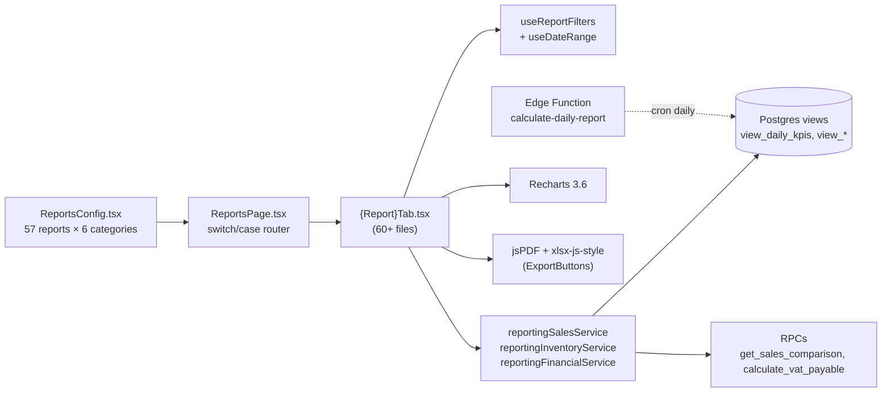

# 14 — Reports & Analytics

> **Last verified** : 2026-05-13
> **Structure** : ce fichier fusionne la **vue fonctionnelle** (le *pourquoi* et le *quoi* métier) et la **référence technique** (le *comment* implémenté). Pour les tâches à faire, voir [`../../workplan/backlog-by-module/14-reports-analytics.md`](../../workplan/backlog-by-module/14-reports-analytics.md).
> **Related E2E flows** : [10-end-of-day](../08-flows-end-to-end/10-end-of-day.md).
> **App de rattachement** : Backoffice (pure lecture seule — alimente les reports via vues SQL).
> **Prérequis** : [`../03-database/05-views-and-matviews.md`](../03-database/05-views-and-matviews.md), skill [`/report-audit`](../../../.claude/skills/report-audit/SKILL.md).

> **En une phrase** : le module Reports est l'instrument de bord de The Breakery — il transforme l'activité brute en décisions actionnables, sécurise contre les dérives, et donne à un gérant qui dort 6 h par nuit la certitude que tout ce qui se passe dans sa boulangerie est mesuré, comparé et exportable — sans qu'il ait à plonger dans la base de données.

---

## Table des matières

- [Partie I — Vue fonctionnelle](#partie-i--vue-fonctionnelle)
  - [1. Raison d'être](#1-raison-dêtre)
  - [2. Les 7 catégories du module](#2-les-7-catégories-du-module-les-7-onglets)
  - [3. Les 6 invariants UX du module](#3-les-6-invariants-ux-du-module)
  - [4. Overview — General Dashboard](#4-objectif-overview--general-dashboard)
  - [5. Sales (16 reports)](#5-objectif-sales-16-reports--comprendre-la-vente)
  - [6. Inventory (11 reports)](#6-objectif-inventory-11-reports--gardien-du-stock)
  - [7. Purchases (6 reports)](#7-objectif-purchases-6-reports--suivre-lapprovisionnement)
  - [8. Finance & Payments (12 reports)](#8-objectif-finance--payments-12-reports--réconcilier-et-projeter)
  - [9. Operations (5 reports)](#9-objectif-operations-5-reports--mesurer-la-productivité)
  - [10. Logs & Audit (10 reports)](#10-objectif-logs--audit-10-reports--détecter-fraude-et-anomalies)
  - [11. Exports — Sortir de l'app](#11-objectif-exports--sortir-de-lapp)
  - [12. Drill-down](#12-objectif-drill-down--aller-du-général-au-détail)
  - [13. Permissions — Cloisonnement par rôle](#13-objectif-permissions--cloisonnement-par-rôle)
  - [14. Ce que le module ne fait **pas**](#14-ce-que-le-module-ne-fait-pas-par-design)
- [Partie II — Référence technique](#partie-ii--référence-technique)
  - [15. Vue d'ensemble technique](#15-vue-densemble-technique)
  - [16. Inventaire des 57 rapports](#16-inventaire-des-57-rapports-srcpagesreportsreportsconfigtsx)
  - [17. Architecture des composants](#17-architecture-des-composants-srcpagesreports)
  - [18. Composants partagés](#18-composants-partagés-srccomponentsreports)
  - [19. Hooks](#19-hooks-srchooksreports)
  - [20. Services](#20-services-srcservicesreporting--srcservicesreports)
  - [21. RPCs Supabase utilisés](#21-rpcs-supabase-utilisés)
  - [22. Vues & matviews consommées](#22-vues--matviews-consommées)
  - [23. Edge Function `calculate-daily-report`](#23-edge-function-calculate-daily-report)
  - [24. Charting (Recharts 3.6)](#24-charting-recharts-36)
  - [25. Export PDF + Excel + CSV](#25-export-pdf--excel--csv)
  - [26. Pages (route) & RLS](#26-pages-route--rls)
  - [27. Skill `/report-audit`](#27-skill-report-audit)
  - [28. Pitfalls](#28-pitfalls)
- [Partie III — Backlog opérationnel](#partie-iii--backlog-opérationnel)
- [Partie IV — Design & UX](#partie-iv--design--ux)
  - [29. Thèmes et contextes d'affichage](#29-thèmes-et-contextes-daffichage)
  - [30. Écrans du module (57 reports)](#30-écrans-du-module-57-reports)
  - [31. Layout patterns appliqués](#31-layout-patterns-appliqués)
  - [32. Composants UI signature](#32-composants-ui-signature)
  - [33. États visuels critiques](#33-états-visuels-critiques)
  - [34. Couleurs sémantiques utilisées](#34-couleurs-sémantiques-utilisées)
  - [35. Microcopy et empty states](#35-microcopy-et-empty-states)
  - [36. Références visuelles externes](#36-références-visuelles-externes)
  - [37. À faire côté design (backlog UX)](#37-à-faire-côté-design-backlog-ux)

---

# Partie I — Vue fonctionnelle

## 1. Raison d'être

Le module Reports est la **conscience analytique** de The Breakery. Il répond à une question simple mais structurante pour un gérant qui ne peut pas être à la caisse 16 h par jour :

> *"Qu'est-ce qui s'est vraiment passé hier, cette semaine, ce mois ? Qu'est-ce qui se vend, qu'est-ce qui ne se vend plus, qui m'apporte de l'argent, qui m'en coûte, et est-ce que quelqu'un est en train de me voler ?"*

C'est le module qui transforme **des milliers de tickets, mouvements de stock, écritures comptables et clics caisse** en **réponses lisibles en une minute** : un graphique, un KPI comparé à hier, un top 10, une alerte rouge. Sans lui, le gérant pilote au feeling ; avec lui, chaque décision (commande fournisseur, planning staff, promo, retrait produit) est appuyée par un chiffre.

Le module n'écrit **jamais** de données métier : il ne fait que **lire, agréger, comparer, exporter**. C'est l'œil, pas la main.

---

## 2. Les 7 catégories du module (les 7 onglets)

Le module est structuré en **7 catégories** correspondant à 7 axes de pilotage distincts :

| Catégorie | Job-to-be-done | Reports |
|---|---|---|
| **Overview** | Vue 10 secondes : santé globale du jour / mois | 1 |
| **Sales** | Comprendre ce qui se vend, à qui, quand, à quel prix | 16 |
| **Inventory** | Vérifier que le stock physique colle au stock système et anticiper les ruptures | 11 |
| **Purchases** | Suivre les achats fournisseurs, les coûts d'approvisionnement et les impayés | 6 |
| **Finance & Payments** | Réconcilier la caisse, suivre la trésorerie, le P&L et la TVA | 12 |
| **Operations** | Mesurer la productivité staff, cuisine et production | 5 |
| **Logs & Audit** | Détecter les fraudes internes, les anomalies et les changements sensibles | 10 |

Au total **~61 reports déclarés** (dont 57 actifs : 53 visibles + 4 cachés en attente d'implémentation). Tous partagent la **même structure d'écran** (filtres date + KPI cards + graphiques + table + export) et les **mêmes permissions** (`reports.sales`, `reports.inventory`, `reports.financial`, `reports.audit`).

---

## 3. Les 6 invariants UX du module

Quel que soit le report consulté, l'utilisateur retrouve toujours les mêmes éléments — c'est ce qui rend le module appropriable en quelques minutes :

1. **Sélecteur de période** en haut à droite : Today, Yesterday, Last 7 days, Last 30 days, Month-to-date, Year-to-date, Custom range. Le report se recalcule en direct.
2. **Comparaison de période** activable d'un clic : "vs période précédente" ou "vs même période l'an dernier", avec affichage des deltas en % et en valeur absolue sur les KPI cards.
3. **Filtres contextuels** spécifiques au report (catégorie produit, staff, méthode de paiement, type de commande, client) avec synchronisation dans l'URL (partage de lien préservant les filtres).
4. **KPI cards** en haut (4 à 8 chiffres clés) — c'est le résumé qu'on lit en premier.
5. **Graphique(s)** au milieu — courbe, barres, donut, heatmap horaire selon le contexte.
6. **Table détaillée** en bas avec tri et pagination, et **deux boutons d'export** : CSV (pour Excel / comptable) et PDF (pour archivage / impression / partage).

Bénéfice métier : **zéro courbe d'apprentissage entre deux reports**. Le gérant qui maîtrise le Sales Dashboard maîtrise mécaniquement le P&L et le Stock Movement.

---

## 4. Objectif Overview — General Dashboard

Donner au gérant qui ouvre l'application le matin une **photo instantanée** de la santé du business sur la période sélectionnée, sans avoir à plonger dans le détail.

Le dashboard affiche :

- **Revenue net** (ventes encaissées, taxes incluses) avec delta vs période précédente.
- **Nombre de commandes** et **panier moyen**.
- **Top product** du jour (volume + revenu).
- **Alertes stock bas** consolidées (combien de produits sous le seuil critique).
- **Sessions de caisse actives** (combien de caisses ouvertes en ce moment).
- **Tendance ventes** sur les 7 / 30 / 90 derniers jours (courbe).

Bénéfice métier : **savoir en 10 secondes si la journée est en avance, en retard ou conforme** sur l'objectif. Si tout est vert, le gérant peut aller voir le four ; si quelque chose est rouge, il sait exactement où creuser.

---

## 5. Objectif Sales (16 reports) — Comprendre la vente

C'est la catégorie la plus dense du module. Elle répond à **toutes les questions qu'un commerçant se pose sur ses ventes**, déclinées par axe d'analyse.

### 5.1 Vues d'ensemble synthétiques

| Report | Réponse |
|---|---|
| **All in 1 Sales Summary** | "Quelle a été la journée / la semaine ?" Une page qui rassemble revenu, commandes, taxes, remises, top produits, top staff, méthodes de paiement. |
| **Daily Sales** | "Comment se répartit le revenu jour par jour sur la période ?" Une courbe + une table chronologique. |
| **Profit & Loss** | "Combien j'ai *vraiment* gagné après COGS et dépenses ?" Revenue – COGS – Expenses = Net Profit. |

### 5.2 Axes d'analyse des ventes

| Report | Réponse |
|---|---|
| **Sales By Date** | Journal détaillé de chaque commande sur la période. |
| **Sales Items By Date** | Journal détaillé de chaque ligne d'item vendue (drill-down dans les commandes). |
| **Daily Items Sold Detail** | Log chronologique avec heure d'envoi cuisine et heure de paiement — utile pour comprendre la cadence de service. |
| **Product Sales By SKU** | "Quels produits cartonnent ?" Classement par revenu / quantité. |
| **Product Sales By Category** | "Quelle catégorie tire le chiffre ?" Pains, viennoiseries, boissons, plats salés. |
| **Sales By Customer** | "Qui sont mes meilleurs clients ?" Classement par dépense cumulée sur la période. |
| **Sales Details By Hours** | "À quelle heure je vends le plus ?" Heatmap horaire — décisif pour le planning staff et la production. |
| **Order Type Distribution** | "Quelle part fait Dine-in, Takeaway, Delivery, B2B ?" Donut + comparaison période. |

### 5.3 Analyses avancées (rentabilité & fidélité)

| Report | Réponse |
|---|---|
| **Gross Margin by Product** | "Quel produit est *rentable* (pas juste populaire) ?" Revenu – coût matière par SKU. Identifie les SKUs déficitaires à reformuler ou retirer. |
| **ABC Product Analysis** | "Quels sont mes 20 % de produits qui font 80 % du CA ?" Classement Pareto en classes A / B / C. Outil de rationalisation du catalogue. |
| **Customer Lifetime Value** | "Combien vaut un client sur sa durée de vie ?" Total dépensé, fréquence de visite, ancienneté, statut (actif / dormant / perdu). |
| **Loyalty & Retention** | "Mon programme fidélité fonctionne-t-il ?" Points en circulation, répartition par palier (Bronze→Platinum), clients actifs vs inactifs. |
| **Sales Cancellation Details** | "Combien de commandes sont annulées et par qui ?" — premier filet de sécurité contre les annulations frauduleuses (croisé avec Logs & Audit). |

Bénéfice métier global : **arrêter de gérer le catalogue à l'instinct**. Chaque retrait, chaque promo, chaque négociation fournisseur est appuyée par un report précis.

---

## 6. Objectif Inventory (11 reports) — Gardien du stock

Le pendant analytique du module Inventory. Ici on ne *modifie* pas le stock, on **l'inspecte sous tous les angles**.

| Report | Réponse |
|---|---|
| **Product Stock Balance** | "Combien j'ai de chaque produit en ce moment et combien ça vaut ?" Valorisation au coût + au prix de vente. |
| **Stock Movement** | "Qu'est-ce qui a bougé sur la période ?" Historique complet : achats, ventes, transferts, casses, ajustements, productions. |
| **Stock Movement Analytics** | "Comment évolue la valeur du stock dans le temps ?" Courbe valeur + quantité. |
| **Wastage & Spoilage** | "Combien je jette par jour, et quels produits ?" Critique pour une boulangerie où le périssable est partout. |
| **Incoming Raw Materials** | "Qu'est-ce qui est rentré récemment côté matières premières ?" Suivi des réceptions hors PO formelles. |
| **Stock Transfer** | "Qu'est-ce qui a circulé entre l'entrepôt et la cuisine / la vitrine ?" |
| **Product Stock Warning** | "Quels produits sont en alerte rouge / orange ?" Liste actionnable pour le réassort. |
| **Product Unsold** | "Quels produits n'ont pas bougé sur la période ?" — détecte les SKUs morts à arrêter de produire. |
| **Expired Stock** | "Quels lots tracés sont périmés ou vont l'être ?" — alerte sanitaire et perte financière. |
| **Product Materials** | "Pour chaque produit fini, quelle est sa recette détaillée et son coût matière théorique ?" Base du calcul de marge. |

Bénéfice métier : **réconcilier la perception cuisine avec la réalité financière du stock**. Un chef qui jette "deux ou trois croissants par jour" voit en chiffres que ça représente 12 % de la production hebdo et 600 000 IDR de perte mensuelle.

---

## 7. Objectif Purchases (6 reports) — Suivre l'approvisionnement

Le pendant analytique du module Purchasing. Il répond à **"qu'est-ce que j'achète, à qui, à quel prix, et qu'est-ce que je n'ai pas encore payé ?"**.

| Report | Réponse |
|---|---|
| **Purchase Items** | "Quels articles j'ai achetés, à quel prix unitaire, à quelle date ?" — base pour la négociation fournisseur. |
| **Purchase Details** | "Détail de chaque PO sur la période — qui a commandé, qui a reçu, montants." |
| **Purchase By Date** | "Comment se répartissent mes achats dans le temps ?" Courbe d'évolution. |
| **Purchase By Supplier** | "Combien je dépense chez chaque fournisseur ?" — outil clé pour la concentration / diversification des sources. |
| **Outstanding Payment** | "Combien je dois encore à mes fournisseurs ?" Liste des factures impayées. |
| **Purchase Returns** *(à venir)* | Suivi des retours fournisseurs (avoirs, casse à la réception). |

Bénéfice métier : **maîtriser le coût matière** dans le temps. Repérer une hausse de tarif fournisseur, voir si un nouveau fournisseur tient ses prix, identifier les dépendances dangereuses (90 % du beurre chez un seul fournisseur).

---

## 8. Objectif Finance & Payments (12 reports) — Réconcilier et projeter

C'est la catégorie **comptable et trésorerie** du module. Elle s'adresse autant au gérant qu'au comptable externe.

### 8.1 Réconciliation et encaissements

| Report | Réponse |
|---|---|
| **Payment By Method** | "Quelle part en cash, carte, QRIS, e-wallet, bank transfer ?" Critique pour anticiper la trésorerie et négocier les commissions bancaires. |
| **Sales Cash Balance** | "Mon fond de caisse colle-t-il ?" Réconciliation des sessions caisse — montants attendus vs comptés. |
| **Expenses by Date** | Journal des dépenses opérationnelles approuvées sur la période. |

### 8.2 Créances et impayés

| Report | Réponse |
|---|---|
| **Receivables** | "Qui me doit de l'argent ?" Liste globale clients + ardoises POS. |
| **B2B Receivables Aging** | "Combien d'impayés B2B, et depuis quand ?" Buckets : Courant / 1-30 j / 31-60 j / 61-90 j / 90 j+. Permet de prioriser les relances. |
| **POS Outstanding** | "Quelles ardoises POS sont en cours ?" Notes non payées avec aging. |
| **POS Outstanding History** | "Quelles ardoises ont été soldées, avec quel délai ?" Mesure de la santé du crédit informel accordé en caisse. |

### 8.3 Pilotage P&L et projection

| Report | Réponse |
|---|---|
| **Revenue Forecast** | "Combien je vais faire les 14 prochains jours ?" Projection basée sur la moyenne mobile 7 jours des 90 derniers jours. |
| **P&L Monthly Trend** | "Quelle est ma rentabilité mois par mois sur 12 mois ?" Revenue, COGS, expenses, net profit en courbe. |
| **VAT / Tax Report** | "Combien de PB1 (taxe restaurant 10 %) j'ai collecté ce mois ?" Base pour la déclaration. |

### 8.4 Contrôle des dérives commerciales

| Report | Réponse |
|---|---|
| **Discounts & Voids** | "Combien de remises et annulations sur la période, qui les a faites ?" Vue agrégée. |
| **Discount Details** | "Détail de chaque remise — type, montant, bill, staff, approbation manager." |

Bénéfice métier : **avoir une comptabilité de pilotage en temps réel**, indépendante du comptable mensuel. Le gérant détecte une dérive de marge ou un trou de trésorerie au jour près, pas au trimestre près.

---

## 9. Objectif Operations (5 reports) — Mesurer la productivité

Ici on regarde **le geste opérationnel** : qui fait quoi, en combien de temps, avec quel rendement.

| Report | Réponse |
|---|---|
| **Staff Performance** | "Quel staff vend le plus, fait le plus de commandes, a le plus d'annulations ?" Classement par cashier / serveur. |
| **Production Report** | "Combien j'ai produit de chaque produit, à quel coût matière théorique ?" Drill-down par produit et date. |
| **Production Efficiency** | "Quel produit a le plus de gâchis en production ?" Taux de waste par produit + tendance journalière — repère les recettes mal calibrées ou les opérateurs en difficulté. |
| **COGS Production Report** | "Quel est le coût des matières premières consommées via la production + les ventes ?" Base du COGS comptable. |
| **KDS Service Speed** *(à venir)* | "Combien de temps prend chaque plat entre l'envoi cuisine et le 'ready' ?" Mesure du goulot d'étranglement service. |

Bénéfice métier : **objectiver les conversations RH et cuisine**. Un staff qui se plaint d'être "débordé tous les après-midis" est appuyé (ou contredit) par la heatmap horaire ; un chef qui dit qu'une recette "marche pas bien" est appuyé par le taux de waste.

---

## 10. Objectif Logs & Audit (10 reports) — Détecter fraude et anomalies

C'est la catégorie **sécurité métier**. Elle s'adresse au gérant qui veut s'assurer que **personne ne le vole** — ni de l'extérieur (clients) ni de l'intérieur (staff).

### 10.1 Traçabilité opérationnelle

| Report | Réponse |
|---|---|
| **Price Changes** | "Qui a changé le prix de quel produit, quand ?" Historique des modifications tarifaires — détecte les baisses non autorisées. |
| **Product Deleted** | "Qui a supprimé quel produit du catalogue ?" Log des suppressions (soft delete tracé). |
| **General Audit Log** | "Quels événements sensibles ont eu lieu dans le système ?" Vue brute du flux d'audit, filtrable. |
| **Permission Change Log** | "Qui a modifié les droits de qui ?" Détecte l'**auto-escalade de privilèges** (un staff qui se donne plus de droits) et les changements en masse suspects. |

### 10.2 Détection de fraude staff

| Report | Réponse | Risque détecté |
|---|---|---|
| **Void & Discount Abuse** | Taux d'annulation et de remise par cashier vs moyenne équipe. | **Sweethearting** (remises à des complices) et **annulations frauduleuses** (encaisser puis annuler pour empocher le cash). |
| **Cash Variance Trend** | Tendance des écarts de caisse par session sur 30 jours. | **Vol progressif** — petites soustractions répétées non détectables sur une seule session. |
| **Loyalty Adjustments Audit** | Ajouts manuels de points fidélité non rattachés à une commande. | **Crédit frauduleux** de points à un client complice. |
| **Ghost Stock Movements** | Mouvements de stock suspects : sans raison documentée, quantité anormalement élevée, hors horaires. | **Détournement de stock** physique. |

### 10.3 Détection d'erreurs ou fraude externe

| Report | Réponse |
|---|---|
| **Duplicate Transactions** | Détection d'éventuels doubles débits — même client / staff / montant dans une fenêtre courte. Protection client + détection d'erreur caisse. |
| **Alerts Dashboard** | Tableau de bord consolidé des anomalies détectées par l'app (anomaly detection cross-modules). |

Bénéfice métier : **dissuader, détecter, documenter**. Le simple fait que ces reports existent et soient consultés régulièrement par le gérant réduit drastiquement les tentations internes. En cas de fraude avérée, le report fournit la **preuve datée** pour licencier ou porter plainte.

---

## 11. Objectif Exports — Sortir de l'app

Chaque report propose **deux exports systématiques** :

| Export | Usage cible |
|---|---|
| **CSV** | Comptable externe (Excel), analyse ad-hoc, sauvegarde mensuelle, croisement avec d'autres sources. |
| **PDF** | Impression, archivage légal, envoi par e-mail à un associé, présentation à un investisseur ou à la banque. |

Le PDF inclut systématiquement un **en-tête The Breakery**, la **période**, la **date d'extraction** et un **filigrane** pour traçabilité.

Bénéfice métier : **interopérabilité totale**. Le module n'est pas une prison de données — le gérant peut emporter ses chiffres partout, dans n'importe quel format demandé par un tiers (banque, comptable, fournisseur de fonds).

---

## 12. Objectif Drill-down — Aller du général au détail

Plusieurs reports supportent la navigation **drill-down avec breadcrumb** : un clic sur une ligne de KPI ou de table ouvre le report enfant filtré sur cette ligne.

Exemples :

- Sur **Sales by Category**, cliquer "Viennoiseries" → ouvre **Product Sales By SKU** filtré sur Viennoiseries.
- Sur **Staff Performance**, cliquer un cashier → ouvre **Sales By Date** filtré sur ce cashier.
- Sur **Stock Warning**, cliquer un produit → ouvre **Stock Movement** filtré sur ce produit.

Le breadcrumb permet de remonter d'un clic.

Bénéfice métier : **éviter le ping-pong** entre 15 reports différents pour répondre à une seule question. Le gérant suit un fil naturel : "le CA viennoiseries baisse → quel produit en particulier → quel jour précis → c'est lié à quelle promo".

---

## 13. Objectif Permissions — Cloisonnement par rôle

Le module respecte le système de permissions transverse de l'app. Quatre permissions principales :

| Permission | Donne accès à |
|---|---|
| `reports.sales` | Catégories Overview, Sales (15 rapports) |
| `reports.inventory` | Catégorie Inventory (10 rapports) |
| `reports.financial` | Catégories Finance & Payments (12) + Purchases (5) + Operations (partiellement) |
| `reports.audit` | Catégorie Logs & Audit (10 rapports) — sensible, réservé admin / manager |

Bénéfice métier : **un cashier ne voit pas le P&L**, un manager de salle ne voit pas les audits de fraude, le comptable externe ne voit que la finance. Chaque rôle accède strictement à ce qu'il doit voir.

---

## 14. Ce que le module ne fait **pas** (par design)

Pour cadrer les attentes :

- Le module **ne modifie aucune donnée métier**. On ne corrige pas un prix dans un report — on va dans le module Products.
- Le module **ne crée pas d'écritures comptables**. La compta double-entry est gérée par triggers Postgres dans le module Accounting.
- Le module **ne déclenche pas d'actions** (commande automatique, relance fournisseur, e-mail client). Les reports informent ; l'action est manuelle dans le module concerné.
- Le module **ne stocke aucune donnée propre**. Toutes les vues sont des projections en lecture seule des tables transactionnelles — ce qui garantit qu'un report est **toujours synchronisé avec la réalité** au moment où il est ouvert.
- Le module **n'envoie pas de notifications push**. Les alertes apparaissent quand le report est ouvert ; l'envoi automatique d'alertes est de la responsabilité d'un futur module Notifications.

---

# Partie II — Référence technique

## 15. Vue d'ensemble technique

Module d'agrégation et de visualisation analytics multi-axes (sales, inventory, finance, purchasing, operations, audit). Le système est **config-driven** : un fichier unique `ReportsConfig.tsx` déclare tous les rapports, et `ReportsPage.tsx` joue le rôle de routeur via un switch/case sur `report.id`. Cette architecture facilite l'ajout d'un rapport sans toucher à la nav, et permet l'audit automatisé via le skill `/report-audit`.

Audit complet le plus récent : [`docs/audit/04-reports-testing-audit.md`](../../audit/04-reports-testing-audit.md) (2026-04-09, Quinn QA).



**Principe** : tout rapport consomme **soit** une view Postgres dédiée (préférence : agrégat pré-calculé, perf O(1) sur petite période) **soit** un RPC paramétré (ex. `get_sales_comparison(start1, end1, start2, end2)`). Le client ne fait jamais de gros `SELECT` brut sur `orders`.

---

## 16. Inventaire des 57 rapports (`src/pages/reports/ReportsConfig.tsx`)

### 16.1 Overview (1 rapport)

| ID | Titre | Composant | Source |
|---|---|---|---|
| `dashboard` | General Dashboard | `OverviewTab` | `getSalesComparison` + `getDashboardSummary` + `getUniqueCustomerCount` |

### 16.2 Sales (14 rapports + 2 hidden)

| ID | Titre | Composant | Source principale |
|---|---|---|---|
| `sales_dashboard` | All in 1 Sales Summary | `SalesTab` | view_daily_kpis |
| `daily_sales` | Daily Sales | `DailySalesTab` (+ `DailySalesDrillDown`) | view_daily_kpis |
| `sales_by_date` | Sales By Date | `SalesByDateTab` | orders |
| `sales_items_by_date` | Sales Items By Date | `SalesItemsByDateTab` | order_items + orders |
| `daily_items_sold_detail` | Daily Items Sold Detail | `DailyItemsSoldDetailTab` | order_items + KDS dispatched_at |
| `product_performance` | Product Sales By SKU | `ProductPerformanceTab` (+ drill-down) | view_product_sales |
| `sales_by_category` | Product Sales By Category | `SalesByCategoryTab` (+ `SalesByCategoryDrillDown`) | view_category_sales |
| `sales_by_customer` | Sales By Customer | `SalesByCustomerTab` | view_sales_by_customer |
| `sales_by_hour` | Sales Details By Hours | `SalesByHourTab` (+ `SalesByHourTable`) | view_sales_by_hour, HourlyHeatmap |
| `sales_cancellation` | Sales Cancellation Details | `SalesCancellationTab` | orders WHERE status IN ('cancelled', 'voided') |
| `profit_loss` | Profit Loss | `ProfitLossTab` (+ `profit-loss/` chart, kpis, table) | view_profit_loss |
| `order_type_distribution` | Order Type Distribution | `OrderTypeDistributionTab` | view_order_type_distribution |
| `loyalty_report` | Loyalty & Retention | `LoyaltyReportTab` | customers + loyalty_transactions |
| `gross_margin_by_product` | Gross Margin by Product | `GrossMarginByProductTab` | view_product_sales (revenue − cost) |
| `abc_analysis` | ABC Product Analysis | `AbcAnalysisTab` | view_product_sales (Pareto) |
| `customer_lifetime_value` | Customer Lifetime Value | `CustomerLifetimeValueTab` | view_customer_insights |

### 16.3 Inventory (10 rapports + 1 hidden)

| ID | Titre | Composant | Source |
|---|---|---|---|
| `inventory_dashboard` | Product Stock Balance | `InventoryTab` (+ `inventory/` cards, table) | view_inventory_valuation |
| `stock_movement` | Stock Movement | `StockMovementTab` (+ `stock-movement/` kpis, table) | stock_movements |
| `stock_analytics` | Stock Movement Analytics | `StockMovementAnalyticsTab` (+ `stock-analytics/` charts) | stock_movements aggregated |
| `wastage_report` | Wastage & Spoilage | `WastageReportTab` | view_stock_waste |
| `incoming_stock` | Incoming Raw Materials | `IncomingStocksTab` | stock_movements WHERE type IN ('purchase', 'stock_in') |
| `stock_transfer` | Stock Transfer | `StockTransferTab` | stock_movements WHERE type='transfer' |
| `stock_warning` | Product Stock Warning | `StockWarningTab` | view_stock_warning |
| `unsold_products` | Product Unsold | `UnsoldProductsTab` | view_unsold_products |
| `expired_stock` | Expired Stock | `ExpiredStockTab` | view_expired_stock |
| `product_materials` | Product Materials | `ProductMaterialsTab` | recipes + products (cost) |
| `outgoing_stock` | Outgoing Stocks | (hidden, placeholder) | future release |

### 16.4 Purchases (5 rapports + 1 hidden)

| ID | Titre | Composant | Source |
|---|---|---|---|
| `purchase_items` | Purchase Items | `PurchaseItemsTab` | purchase_order_items |
| `purchase_details` | Purchase Details | `PurchaseDetailsTab` | purchase_orders |
| `purchase_by_date` | Purchase By Date | `PurchaseByDateTab` | purchase_orders |
| `purchase_by_supplier` | Purchase By Supplier | `PurchaseBySupplierTab` | purchase_orders + suppliers |
| `outstanding_purchase_payment` | Outstanding Payment | `OutstandingPurchasePaymentTab` (+ `purchasing/`) | purchase_orders WHERE payment_status != 'paid' |
| `purchase_returns` | Purchase Returns | (hidden) | future release |

### 16.5 Finance & Payments (12 rapports)

| ID | Titre | Composant | Source |
|---|---|---|---|
| `payment_by_method` | Payment By Method | `PaymentMethodTab` | view_payment_method_stats |
| `cash_balance` | Sales Cash Balance | `SessionCashBalanceTab` | view_session_cash_balance |
| `receivables` | Receivables | `B2BReceivablesTab` | view_b2b_receivables |
| `b2b_aging` | B2B Receivables Aging | `B2BAgingTab` | view_b2b_receivables (bucketed) |
| `pos_outstanding` | POS Outstanding | `POSOutstandingTab` | view_pos_outstanding |
| `pos_outstanding_history` | POS Outstanding History | `POSOutstandingHistoryTab` | view_pos_outstanding_history |
| `revenue_forecast` | Revenue Forecast | `RevenueForecastTab` | view_daily_kpis (90d → moving avg + projection) |
| `pl_monthly_trend` | P&L Monthly Trend | `PLMonthlyTrendTab` | view_profit_loss (12 mois) |
| `expenses` | Expenses by Date | `ExpensesTab` (+ `expenses/` charts/kpis/table) | expenses + expense_categories |
| `discounts_voids` | Discounts & Voids | `DiscountsVoidsTab` (+ `discounts-voids/`) | orders WHERE discount_total > 0 OR status='voided' |
| `discount_details` | Discount Details | `DiscountDetailsTab` | orders + audit_logs |
| `vat_report` | VAT / Tax Report | `VATReportTab` | RPCs `calculate_vat_payable` + `get_vat_by_category` (month/year selectors) |

### 16.6 Operations (4 rapports + 1 hidden)

| ID | Titre | Composant | Source |
|---|---|---|---|
| `staff_performance` | Staff Performance | `StaffPerformanceTab` | view_staff_performance |
| `production_report` | Production Report | `ProductionReportTab` | RPC `get_production_report` |
| `production_efficiency` | Production Efficiency | `ProductionEfficiencyTab` | production_records + waste |
| `cogs_production` | COGS Production Report | `COGSProductionTab` | recipes + production_records + cost_price |
| `service_speed` | KDS Service Speed | (hidden) | RPC `get_kds_service_speed_stats` (migration pending) |

### 16.7 Logs & Audit (10 rapports)

| ID | Titre | Composant | Source |
|---|---|---|---|
| `price_changes` | Price Changes | `PriceChangesTab` (+ `price-changes/` kpis, table) | audit_logs WHERE action='update' AND table_name='products' |
| `deleted_products` | Product Deleted | `DeletedProductsTab` | products WHERE deleted_at IS NOT NULL |
| `audit_log` | General Audit Log | `AuditTab` (+ `audit/AuditLogRow`) | audit_logs (`useAuditLogReport` hook) |
| `alerts_dashboard` | Alerts Dashboard | `AlertsDashboardTab` (+ `alerts/`) | `anomalyAlerts` service |
| `void_discount_by_staff` | Void & Discount Abuse | `VoidDiscountByStaffTab` | orders + audit_logs grouped by staff |
| `cash_variance_trend` | Cash Variance Trend | `CashVarianceTrendTab` | view_session_discrepancies |
| `loyalty_adjustments_audit` | Loyalty Adjustments Audit | `LoyaltyAdjustmentsAuditTab` | loyalty_transactions WHERE type='adjust' |
| `duplicate_transactions` | Duplicate Transactions | `DuplicateTransactionsTab` | orders self-join window detection |
| `ghost_stock_movements` | Ghost Stock Movements | `GhostStockMovementsTab` | stock_movements WHERE notes IS NULL OR after-hours |
| `permission_change_log` | Permission Change Log | `PermissionChangeLogTab` | audit_logs WHERE action LIKE 'permission_%' |

**Total : 57 = 53 visibles + 4 cachés**.

---

## 17. Architecture des composants (`src/pages/reports/`)

```
src/pages/reports/
├── ReportsPage.tsx          # Container + router switch/case
├── ReportsConfig.tsx        # 57 reports × 6 categories declaration
└── components/              # 87 .tsx files total
    ├── {Report}Tab.tsx       # 60+ tabs, un par report (lazy-loaded)
    ├── {Drill}DrillDown.tsx  # 2 drill-downs : DailySales, SalesByCategory
    ├── alerts/               # AlertKpiCards, AlertListItem, AlertResolveDialog
    ├── audit/                # AuditLogRow
    ├── discounts-voids/      # Chart, Kpis, Table
    ├── expenses/             # Charts, Kpis, Table
    ├── inventory/            # ValuationCards, StockTable, WasteSection
    ├── price-changes/        # Kpis, Table
    ├── product-performance/  # DrillDownChart, DrillDownKpis, DrillDownTable, ProductTable
    ├── profit-loss/          # Chart, Kpis, Table
    ├── purchasing/           # OutstandingPaymentTable
    ├── stock-analytics/      # AnalyticsKpis, AnalyticsTable, StockQuantityChart, StockValueChart
    └── stock-movement/       # MovementKpis, MovementTable
```

Chaque `{Report}Tab.tsx` suit le pattern :

```tsx
export function FooTab() {
  const { dateRange } = useDateRange()
  const { data, isLoading, error } = useQuery({
    queryKey: ['report-foo', dateRange],
    queryFn: () => reportingSalesService.getFoo(dateRange.start, dateRange.end),
  })
  if (isLoading) return <ReportSkeleton />
  if (error) return <ReportPlaceholder error={error} />
  return (
    <>
      <ReportFilters />
      <FooKpis data={data} />
      <FooChart data={data} />
      <FooTable data={data} />
      <ExportButtons data={data} filename="foo-report" />
    </>
  )
}
```

---

## 18. Composants partagés (`src/components/reports/`)

17 fichiers/dossiers réutilisables :

| Composant | Rôle |
|---|---|
| `ComparisonKpiCard.tsx` | Card KPI avec valeur courante + δ vs période précédente (couleur émeraude/rouge) |
| `ComparisonToggle.tsx` | Switch "Compare to previous period" — déclenche un fetch double |
| `DateRangePicker/` | Composé : presets (Today, 7d, 30d, MTD, YTD, Custom) + calendar (date-fns) |
| `DualSeriesLineChart.tsx` | Recharts LineChart avec 2 séries (revenue + COGS, ou current vs previous) |
| `ExportButtons/` | Bouton "Export PDF" (jsPDF + autotable) + "Export Excel" (`xlsx-js-style`) + "Export CSV" (`csvExport.ts`) |
| `HourlyHeatmap.tsx` | Heatmap 7×24 (jour × heure) pour `sales_by_hour`, intensité = revenue |
| `ReportBreadcrumb.tsx` | Fil d'Ariane Catégorie > Rapport |
| `ReportFilters/` | Container des filtres communs (date range, terminal, staff, customer, payment method) |
| `ReportPlaceholder.tsx` | Affiché pour les rapports `hidden` ou `placeholder` |
| `ReportSkeleton.tsx` | Loading skeleton standard (kpis + chart + table) |
| `__tests__/` | Tests unitaires des helpers de date et formatters |

---

## 19. Hooks (`src/hooks/reports/`)

| Hook | Rôle |
|---|---|
| `useDateRange()` | State partagé via Zustand-like context : `{ start, end, preset, setPreset, setRange }`. Persiste dans sessionStorage |
| `useReportFilters()` | Combine date range + autres filtres (staff_id, customer_id, payment_method, category_id) |
| `useReportPermissions()` | Helper pour gating UI : retourne `{ canViewSales, canViewInventory, canViewFinancial, ... }` selon `user_has_permission` |
| `useDrillDown()` | State + navigation pour les rapports avec drill-down (Daily Sales → DailySalesDrillDown, Sales by Category → SalesByCategoryDrillDown) |
| `useAuditLogReport(filters)` | Fetch paginé `audit_logs` avec joins (`actor`, `target_table`) |
| `index.ts` | Barrel export |

---

## 20. Services (`src/services/reporting/` + `src/services/reports/`)

### 20.1 `reporting/` — services de fetch DB

| Service | Fonctions clés | Sources |
|---|---|---|
| `reportingSalesService.ts` | `getSalesComparison`, `getDailySales`, `getProductPerformance`, `getSalesByCategory`, `getDashboardSummary`, `getProfitLoss`, `getSalesByCustomer`, `getSalesByHour`, `getCancellations` | view_daily_kpis, view_product_sales, view_section_stock_details, view_hourly_sales, view_profit_loss, orders, order_items |
| `reportingInventoryService.ts` | `getStockValuation`, `getStockMovements`, `getWaste`, `getStockWarning`, `getExpiredStock`, `getUnsoldProducts`, `getProductMaterials` | view_inventory_valuation, view_stock_warning, view_expired_stock, view_unsold_products, view_stock_waste, stock_movements, products |
| `reportingFinancialService.ts` | `getPaymentMethodStats`, `getCashBalance`, `getB2BReceivables`, `getPOSOutstanding`, `getKDSServiceSpeed`, `getVATPayable`, `getVATByCategory` | view_payment_method_stats, view_session_cash_balance, view_b2b_receivables, view_pos_outstanding, RPCs `get_kds_service_speed_stats`, `calculate_vat_payable`, `get_vat_by_category` |

Convention : timezone via helper `toLocalDateStr(date)` (préserve TZ locale `Asia/Makassar`, évite le shift UTC à minuit). Voir [audit reports §Phase 2](../../audit/04-reports-testing-audit.md) pour la liste exhaustive.

### 20.2 `reports/` — services d'export et anomalies

| Service | Rôle |
|---|---|
| `pdfExport.ts` | Wrapper jsPDF + autoTable. Format A4, header avec logo, footer avec date génération |
| `csvExport.ts` | Sérialisation CSV avec échappement RFC 4180 |
| `anomalyAlerts.ts` | Détection règles : variance cash > seuil, void rate > 5 %, ghost stock movements, duplicate transactions. Alimente `AlertsDashboardTab` |

Export Excel non listé : utilise directement `xlsx-js-style` (style cellules) dans `ExportButtons.tsx`.

---

## 21. RPCs Supabase utilisés

| RPC | Rôle |
|---|---|
| `get_sales_comparison(start1, end1, start2, end2)` | TABLE période current + previous (revenue, orders, avg_basket) |
| `get_reporting_dashboard_summary(start, end)` | JSON résumé (period_sales, period_orders, top_product, low_stock_alerts, active_sessions) |
| `get_kds_service_speed_stats(start, end, station?)` | Stats vitesse KDS — non déployé (rapport `service_speed` masqué) |
| `calculate_vat_payable(year, month)` | TABLE PB1 collectée / déductible / nette à payer |
| `get_vat_by_category(year, month)` | Décomposition PB1 par catégorie produit |
| `get_production_report(start, end)` | TABLE production aggregated par produit (qty, cost, waste) |

Voir [03-rpc-functions.md](../03-database/03-rpc-functions.md) pour les signatures complètes.

---

## 22. Vues & matviews consommées

22 vues métier déclarées dans `supabase/migrations/058–061_reporting_*.sql`. Liste détaillée et fenêtres de fraîcheur dans [03-database/05-views-and-matviews.md](../03-database/05-views-and-matviews.md). Catégories :

- **Core KPIs & Sales** : `view_daily_kpis` (90 j), `view_payment_method_stats` (30 j), `view_product_sales` (30 j), `view_category_sales` (30 j), `view_profit_loss` (90 j), `view_sales_by_hour` (30 j), `view_hourly_sales` (7 j legacy), `view_sales_by_customer` (all-time), `view_order_type_distribution` (30 j)
- **Sessions & Cash** : `view_session_summary`, `view_session_cash_balance`, `view_session_discrepancies`
- **Inventory & Stock** : `view_inventory_valuation`, `view_stock_warning`, `view_stock_alerts` (legacy), `view_expired_stock`, `view_unsold_products`, `view_stock_waste`
- **Staff & Operations** : `view_staff_performance`, `view_customer_insights`, `view_production_summary` (30 j), `view_kds_queue_status`, `view_kds_service_speed`

Aucune **matview** rafraîchie par cron pour l'instant — tout est en `VIEW` standard, suffisant pour les volumes The Breakery (~200 tx/jour). Migration future possible vers `MATERIALIZED VIEW` + `pg_cron` si la latence dégrade.

---

## 23. Edge Function `calculate-daily-report`

**Source** : `supabase/functions/calculate-daily-report/index.ts`

Fonction Deno qui agrège toutes les données du jour (orders, payments, top products, hourly breakdown, staff perf) dans une structure `DailyReport` unique. Appelée :

- Soit par un planificateur externe (cron-style, comportement "service-role schedule" — `verify_jwt: true` suffit puisque le caller est trusted)
- Soit manuellement depuis un futur écran "Generate End-of-Day Report"

Le format de sortie est documenté dans le fichier source (interface `DailyReport`). Utile pour exports historiques en JSON ou alimentation d'un BI externe.

Voir [05-integrations/02-edge-functions.md](../05-integrations/02-edge-functions.md) pour la matrice complète des Edge Functions.

---

## 24. Charting (Recharts 3.6)

44 fichiers utilisent Recharts dans `src/pages/reports/components/`. Conventions :

| Type | Usage typique | Composants Recharts |
|---|---|---|
| LineChart | Tendances temporelles (revenue par jour, P&L 12 mois) | `LineChart`, `Line`, `XAxis`, `YAxis`, `CartesianGrid`, `Tooltip`, `Legend` |
| AreaChart | P&L stacké, variance trend | `AreaChart`, `Area`, `defs/linearGradient` (Luxe Dark gradient) |
| BarChart | Comparatifs (sales by category, payment methods) | `BarChart`, `Bar`, `Cell` (couleurs custom) |
| PieChart | Order type distribution, payment split | `PieChart`, `Pie`, `Cell` |
| HeatmapGrid (custom) | `HourlyHeatmap.tsx` — pas un composant Recharts natif, grille SVG manuelle |

Couleurs alignées sur le design system Luxe Dark — voir [02-design-system/02-tokens.md](../02-design-system/02-tokens.md) pour la palette chart (`--chart-1` à `--chart-5`).

---

## 25. Export PDF + Excel + CSV

Stack :

| Format | Lib | Usage |
|---|---|---|
| PDF | `jsPDF` 2.x + `jspdf-autotable` | Layout A4, header logo Breakery, footer date+pagination, tableaux avec colspan/rowspan |
| Excel | `xlsx-js-style` | Cellules stylées (header gras, totaux fond gris), formules sommes |
| CSV | `csvExport.ts` (custom, sans dépendance) | Échappement RFC 4180, BOM UTF-8 pour Excel |

Le composant `ExportButtons` reçoit `{ data, columns, filename, orientation? }` et instancie le bon exporter au clic. Voir [05-integrations/07-pdf-excel-export.md](../05-integrations/07-pdf-excel-export.md) pour les snippets de référence.

---

## 26. Pages (route) & RLS

| Route | Composant | Garde |
|---|---|---|
| `/reports` | `ReportsPage` | `RouteGuard permission="reports.sales"` (gate de base) + `ModuleErrorBoundary` |

Routes définies dans `src/routes/adminRoutes.tsx`. La granularité fine se fait à l'intérieur via `useReportPermissions` (chaque catégorie testée contre `reports.sales` / `reports.inventory` / `reports.financial` / `reports.audit`).

### RLS & permissions

| Permission | Rapports débloqués |
|---|---|
| `reports.sales` | Catégories Overview + Sales (15 rapports) |
| `reports.inventory` | Catégorie Inventory (10 rapports) |
| `reports.financial` | Catégories Finance (12) + Purchases (5) |
| `reports.audit` | Catégorie Logs & Audit (10 rapports) |

Le code de permission `reports.audit` a été ajouté par `supabase/migrations/20260315110000_p0_security_fixes.sql` pour gater les rapports sensibles (void abuse, cash variance, ghost movements, permission changes).

Pas de RLS spécifique sur les vues — elles héritent des RLS des tables sous-jacentes (`is_authenticated()` SELECT).

---

## 27. Skill `/report-audit`

Skill Claude Code dédié : `.claude/skills/report-audit/SKILL.md`. Trigger sur "report bug", "broken report", "missing report", "chart issue", "audit reports", etc. Capacités :

- Scan des 57 entries de `ReportsConfig.tsx` vs imports lazy dans `ReportsPage.tsx` (détection orphelins)
- Vérification que chaque service appelé existe dans les modules `reporting/`
- Audit cross-référencé view ↔ migration (s'assurer que toute view utilisée a sa migration)
- Détection de `select('*')` interdits
- Vérification timezone (`toISOString` vs `toLocalDateStr`)
- Génération d'un rapport priorisé P0/P1/P2/P3
- Mode interactif : propose des fixes au fil de l'eau

Le dernier passage du skill a produit [`docs/audit/04-reports-testing-audit.md`](../../audit/04-reports-testing-audit.md) (0 P0, 3 P1, 6 P2, 5 P3).

---

## 28. Pitfalls

- ⚠️ **`hidden: true` ne masque pas le routing** : un rapport caché reste résolu par le switch/case (vers `<ReportPlaceholder>`). Vérifier à la fois `hidden` (UI nav) et `placeholder` (component) lors d'un refactor.
- ⚠️ **`toISOString()` en filtre date** : 4 fonctions de `reportingSalesService` utilisent encore `toISOString()` sur `created_at` (P2 dans l'audit). Risque d'orders perdus pour les transactions juste après minuit local. Préférer `toLocalDateStr()` partout.
- ⚠️ **Pas de cache long sur `useDateRange`** : le state est sessionStorage, donc reload navigateur = retour à "Today". Ne pas s'attendre à de la persistence cross-session.
- ⚠️ **`view_daily_kpis` plafonné à 90 j** : pour des analyses > 90 jours, créer un agrégat dédié ou paginer manuellement. Le bouton "Year" du `DateRangePicker` peut retourner des trous au-delà.
- ⚠️ **Recharts re-rendering coûteux** : avec >5 000 points la perf chute. Pour le `RevenueForecast` (90 j × hourly), pré-agréger côté service et passer max 1 500 points au chart.
- ⚠️ **Export PDF gros datasets** : `jspdf-autotable` ne paginera pas un tableau de 10 000 lignes — limite à ~2 000 lignes pratiques. Pour plus, exporter Excel.
- ⚠️ **`vat_report` utilise `month/year`, pas `dateRange`** : seul rapport avec UI custom — ne pas tenter de réutiliser `<ReportFilters>` standard, il a son propre `MonthYearPicker`.
- ⚠️ **`production_report` court-circuite le service barrel** : appelle directement le RPC `get_production_report` au lieu de passer par `reportingSalesService`. Mineur mais incohérent — à harmoniser quand le module Production sera étendu.
- ⚠️ **`xlsx-js-style` vs `xlsx`** : la lib supporte les styles cellules (couleurs, gras, bordures), mais elle est forkée et peut diverger. Pas d'upgrade automatique — checker le changelog avant tout bump.
- ⚠️ **9 rapports d'audit/sécurité (catégorie Logs)** : impact RGPD/audit. Ne pas exposer en self-service à un caissier — toujours gater via `reports.audit` qui n'est attribuée qu'aux rôles `admin` et `manager`.
- ⚠️ **`anomalyAlerts.ts` faux-positifs** : la détection "ghost stock movements" (notes vides + after-hours) signale les imports en masse légitimes. Filtrer par `created_by IS NOT 'system'` côté client.
- ⚠️ **Tests components manquants** : 0 test de composant report (audit P3). Les services sont couverts (~131 it blocks) mais les Tabs n'ont pas de tests Testing Library — régressions visuelles non détectées.
- ⚠️ **`calculate-daily-report` Edge Function non schedulée** : la function existe mais aucun cron Supabase ne l'appelle. À configurer manuellement via `pg_cron` si on veut un snapshot quotidien automatique.

---

# Partie III — Backlog opérationnel

Pour les tâches techniques à exécuter (KDS Service Speed report, Unusual Transaction Patterns, B2B Self-Approval Risk, Customer Cohort Analysis, Basket Analysis, Promotion Effectiveness, Peak Hour Staffing, Perishable Turnover, Table Turnover, Sales By Brand, Purchase Returns, Outgoing Stocks), voir :

→ [`../../workplan/backlog-by-module/14-reports-analytics.md`](../../workplan/backlog-by-module/14-reports-analytics.md)

Tâches priorisées P0–P3 avec critères d'acceptation, dépendances, estimations XS/S/M/L/XL et risques identifiés.

---

# Partie IV — Design & UX

> **Source canonique** : [`../../DESIGN_POS_AND_BACKOFFICE.md`](../../DESIGN_POS_AND_BACKOFFICE.md) — §4.7 "Le module Reports — Spécificité".
> **Tokens techniques** : [`../../../DESIGN.md`](../../../DESIGN.md) (variables CSS, scales, classes Tailwind).
> **Screenshots de référence** : [`../../ux/assets/screens/backoffice/`](../../ux/assets/screens/backoffice/) — source de vérité visuelle.

## 29. Thèmes et contextes d'affichage

Le module Reports est **exclusivement Backoffice** — c'est l'archétype de la "salle de commandement claire" décrite dans [`../../DESIGN_POS_AND_BACKOFFICE.md`](../../DESIGN_POS_AND_BACKOFFICE.md) §4.

| Contexte | Thème CSS | Pages concernées | Identité |
|---|---|---|---|
| **Backoffice — Reports** | `.theme-backoffice` (ivoire `#F8F8F6`) | `/reports` (57 reports sous-routés via switch/case) | Salle de commandement claire, dense — KPI cards + charts Recharts + tables, pure lecture seule |

**Constante de marque** : l'or `#C9A55C` réservé aux totaux finaux, aux courbes principales Recharts (1ʳᵉ série), et aux deltas positifs des `ComparisonKpiCard`. Voir [`../../DESIGN_POS_AND_BACKOFFICE.md`](../../DESIGN_POS_AND_BACKOFFICE.md) §4.7 — "Header avec DateRangePicker + filtres contextuels + bouton export CSV/PDF, 5 KPI cards avec ComparisonKpiCard, 1 ou 2 graphiques Recharts, table détaillée".

---

## 30. Écrans du module (57 reports)

Les 57 reports partagent le même squelette d'écran (cf. invariants UX §3). Différenciations par catégorie :

| Catégorie | Densité visuelle | Charts dominants | Couleurs sémantiques |
|---|---|---|---|
| **Overview** (1) | Très haute | LineChart 90j gold + KPIs delta | Gold dominant, success green pour positifs |
| **Sales** (16) | Maximale | LineChart, BarChart, HourlyHeatmap, PieChart (Pareto) | Chart palette `--chart-1` à `--chart-5` |
| **Inventory** (11) | Haute | LineChart valuation, BarChart waste, donut categories | Warning/Error pour stock bas/critique |
| **Purchases** (6) | Moyenne | LineChart purchases over time, BarChart by supplier | Info blue, gold pour totaux |
| **Finance** (12) | Maximale | LineChart P&L 12 mois, BarChart payment methods, donut | Gold pour revenu, red pour expenses |
| **Operations** (5) | Haute | BarChart staff perf, HourlyHeatmap production | Chart palette |
| **Logs & Audit** (10) | Très haute | Tables denses, BarChart variance trend | Warning/Error dominantes (alertes) |

---

## 31. Layout patterns appliqués

Tous les reports suivent le pattern décrit dans [`../../DESIGN_POS_AND_BACKOFFICE.md`](../../DESIGN_POS_AND_BACKOFFICE.md) §4.7 :

### 31.1 Header report

1. **Breadcrumb** : `Reports > {Category} > {Report Name}` cliquable pour remonter.
2. **Titre report** en gros caractère bold + sous-titre court.
3. **DateRangePicker** à droite : presets (Today, Yesterday, 7d, 30d, MTD, YTD, Custom).
4. **ComparisonToggle** : "Compare to previous period" switch.
5. **Filtres contextuels** : staff / customer / payment_method / category selon le report (URL-synced).
6. **Boutons d'export** : "Export CSV" + "Export PDF" + "Export Excel" en row.

### 31.2 KPI cards (4-8 en row)

- `ComparisonKpiCard` : valeur courante en gros (font-3xl ou 4xl), label uppercase tracking large, delta % colorisé (vert positif, rouge négatif) avec petite flèche.
- Icône Lucide en haut à gauche (par contexte : `$`, `Package`, `Users`, `TrendingUp`).
- Fond `surface-1`, padding 24-32 px, ombre douce.

### 31.3 Charts Recharts (1-2 en row)

- Card englobante `surface-1` avec header (label uppercase + tooltip "?" pour méthodologie).
- Hauteur fixe 320 px (parfois 400 px pour des heatmaps).
- Couleurs alignées sur `--chart-1` à `--chart-5` (gold/blue/red/green/purple).
- Tooltip Recharts custom avec format IDR + delta %.

### 31.4 Table détaillée

- Header sticky.
- Tri par clic sur header (icône `ChevronUp/Down`).
- Pagination en bas (10/25/50/100 items).
- Row hover `surface-2`.
- Drill-down sur clic ligne pour les reports concernés (cf. §12).

### 31.5 Footer report

- Récapitulatif chiffres clés (total, count, avg).
- Date de génération + utilisateur (visible sur export PDF).

---

## 32. Composants UI signature

| Composant | Type | Usage | Style clé |
|---|---|---|---|
| `ComparisonKpiCard` | KPI card | Tous reports | Valeur en gros (`text-3xl`), label uppercase tracking, delta colorisé (vert/rouge) avec arrow icon, ombre douce |
| `DateRangePicker` | Popover calendrier | Tous reports | Presets shortcuts en gauche, double-month calendar à droite, "Apply" / "Cancel" en footer |
| `ComparisonToggle` | Switch | Tous reports | "Compare to previous period" + sub-options ("same period last year") |
| `HourlyHeatmap` | SVG grid | `sales_by_hour`, KDS, production | Grille 7×24 (jour × heure), intensité gold (0 % transparent → 100 % gold massif) avec hover tooltip |
| `DualSeriesLineChart` | Recharts | P&L, comparison | 2 séries (current + previous) avec gold solid + grey dashed, hover crosshair |
| `ExportButtons` | Button group | Tous reports | 3 boutons icône Lucide (`FileText` PDF, `FileSpreadsheet` Excel, `FileDown` CSV) + dropdown options |
| `ReportFilters` | Form bar | Tous reports | Inline filters avec dropdowns + search, "Reset" button à droite, URL-synced |
| `ReportSkeleton` | Loading | Tous reports | Skeletons KPI + chart + table avec shimmer |
| `ReportPlaceholder` | Empty/hidden | Reports hidden | Icône grise + "Coming soon" + lien backlog |
| `ReportBreadcrumb` | Navigation | Tous reports | `Reports > Sales > Daily Sales` cliquable |

---

## 33. États visuels critiques

| État | Visuel | Pourquoi |
|---|---|---|
| **Delta positif KPI** | Couleur emerald `#16A34A` + arrow `TrendingUp` | Indicateur sain immédiat |
| **Delta négatif KPI** | Couleur red `#DC2626` + arrow `TrendingDown` | Alerte attention |
| **Delta nul** | Couleur grey `#6B7280` + "−" | Stable |
| **Loading (fetch)** | `ReportSkeleton` avec shimmer | Évite flash blanc |
| **Empty (no data)** | Card centrée "No data for selected period" + icône grise | Distinct du loading |
| **Hidden report** | `ReportPlaceholder` avec "Coming soon" badge | Communique l'évolution future |
| **Error fetch** | `<ErrorBoundary>` avec bouton retry + détail dev | Self-recovery utilisateur |
| **Anomalie détectée** | Badge orange "⚠ Anomaly" sur la ligne concernée | Cf. `anomalyAlerts` service |
| **Audit/Logs sensible** | Bannière jaune en haut "Sensitive data — do not share outside management" | Conformité RGPD/RH |
| **Comparaison période** | Ligne pointillée grise sur LineChart + colonne "Previous" sur table | Distingue clairement |
| **PB1 / VAT report** | UI custom avec `MonthYearPicker` (pas DateRangePicker) | Cf. pitfall §28 |
| **Variance forte cash** | Row table fond `red/10` + icône `AlertTriangle` | Signal fraude potentielle |
| **Top performer** | Badge gold "Top" sur la première ligne | Récompense visuelle des leaders |

---

## 34. Couleurs sémantiques utilisées

| Rôle | Backoffice (light) | Usage Reports |
|---|---|---|
| **Success** | `#16A34A` (emerald) | Delta positif KPI, opname matched, B2B paid, top performer |
| **Warning** | `#D97706` (amber) | Stock bas, void rate > seuil, B2B aging 31-60 j, anomalies modérées |
| **Error** | `#DC2626` (red) | Delta négatif fort, stock critique, B2B 90 j+, cash variance >5 k IDR, ghost stock |
| **Info** | `#2563EB` (blue) | Drill-down breadcrumb, links, neutral data points |
| **Gold** | `#C9A55C` | Totaux finaux, courbe principale Recharts (1ʳᵉ série), Top badge, exports PDF header |

### Palette Recharts (5 séries max simultanées)

- `--chart-1` : `#C9A55C` (gold) — série principale (revenue)
- `--chart-2` : `#2563EB` (blue) — série secondaire (orders)
- `--chart-3` : `#DC2626` (red) — coûts (COGS)
- `--chart-4` : `#16A34A` (green) — marge / profit
- `--chart-5` : `#9333EA` (purple) — autres

---

## 35. Microcopy et empty states

### Empty states

| Report | Texte | CTA |
|---|---|---|
| Tous (no data) | "No data for the selected period" + icône `BarChart3` grise | "Reset filters" ou "Adjust period" |
| `sales_dashboard` (no sales today) | "No sales recorded today yet — open a session to start" | "Open POS" (lien vers `/pos`) |
| `wastage_report` (no waste) | "Clean operations — no waste recorded this period" + icône `Sparkles` green | — |
| `b2b_aging` (no overdue) | "All B2B invoices are current" + icône `CheckCircle` green | — |
| `void_discount_by_staff` (no abuse) | "No outliers detected — all staff within normal range" | — |
| `alerts_dashboard` (no anomalies) | "No anomalies detected — operations look healthy" | — |
| Hidden report | "Coming soon — see backlog for priority" | Lien vers `../../workplan/backlog-by-module/14-reports-analytics.md` |

### Tooltips méthodologie

Chaque KPI card a une icône "?" cliquable qui ouvre un popover :

- **Revenue net** : "Sum of completed orders, taxes included, excluding voided orders."
- **Avg basket** : "Revenue ÷ Number of orders for the period."
- **Stock value at cost** : "Sum of (current_stock × cost_price) for active products."
- **PB1 collected** : "10 % extracted from inclusive prices via formula: tax = total × 10/110."
- **B2B aging buckets** : "Current = before due date. 1-30 = 1 to 30 days past due. etc."

### Toast notifications

- Succès export PDF : "PDF generated — opening in new tab"
- Succès export CSV : "CSV downloaded — 247 rows"
- Erreur export gros dataset : "Too many rows for PDF (10 000+) — try Excel export or narrow date range"
- Filter applied : "Filter updated — 47 results"
- Comparison toggle on : "Comparing to previous period — see deltas on KPI cards"

---

## 36. Références visuelles externes

| Ressource | Chemin / lien |
|---|---|
| Design doc complet (POS + Backoffice) | [`../../DESIGN_POS_AND_BACKOFFICE.md`](../../DESIGN_POS_AND_BACKOFFICE.md) — §4.7 "Le module Reports — Spécificité" |
| Tokens canoniques V2 | [`../../../DESIGN.md`](../../../DESIGN.md) à la racine |
| Screenshot Backoffice Dashboard | [`../../ux/assets/screens/backoffice/Dashboard.jpg`](../../ux/assets/screens/backoffice/Dashboard.jpg) |
| Design system feature components | [`../02-design-system/04-feature-components.md`](../02-design-system/04-feature-components.md) |
| Module Accounting (source P&L, VAT) | [`./10-accounting-double-entry.md`](./10-accounting-double-entry.md) |
| Module Inventory (source stock reports) | [`./06-inventory-stock.md`](./06-inventory-stock.md) |
| Module Expenses (source expenses report) | [`./11-expenses.md`](./11-expenses.md) |
| Flow E2E End of Day | [`../08-flows-end-to-end/10-end-of-day.md`](../08-flows-end-to-end/10-end-of-day.md) |

---

## 37. À faire côté design (backlog UX)

| Priorité | Évolution UX | Bénéfice |
|---|---|---|
| 🔴 | **Mode "Dashboard customizable"** | Permettre au gérant de pinner ses 6 KPIs préférés sur Overview, drag-drop layout |
| 🔴 | **Mobile/tablet adaptive reports** | Layout responsive avec stack vertical des KPI cards et charts simplifiés pour consultation rapide depuis téléphone |
| 🔴 | **Annotations sur charts** | Ajouter manuellement des notes sur la courbe ("Promo Pâques", "Panne machine 12/04") pour expliquer les pics et creux |
| 🟠 | **Email automatique des reports** | Programmer un envoi mensuel du PDF P&L au comptable externe, hebdo du Cash Variance au manager |
| 🟠 | **Comparaison année N-1** | Toggle additionnel "vs same period last year" pour identifier la saisonnalité réelle |
| 🟠 | **Heatmap calendrier dépenses** | Vue calendrier 30 jours avec densité visuelle (chaud = beaucoup de tx) — détection rapide anomalies temporelles |
| 🟡 | **Filter chips avec mémorisation** | Sauvegarder les combinaisons de filtres préférées en presets nommés ("Q1 review", "Daily ops") |
| 🟡 | **Drill-down profond cross-modules** | Cliquer un cashier dans `staff_performance` → ouvre directement son audit log avec timeline visuelle |
| 🟢 | **Animation chiffres qui montent** | KPI cards avec animation count-up à l'ouverture pour effet "tableau de bord vivant" |
| 🟢 | **Mode présentation grand écran** | Vue plein écran pour afficher le dashboard sur TV en cuisine ou salle de pause |
| 🟢 | **Dark mode complet du Backoffice** | Pour les sessions tardives du comptable / manager — cohérent avec V3 `.theme-pulse` |
