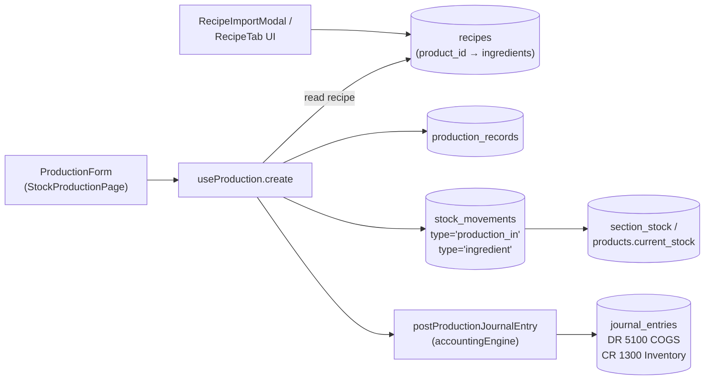
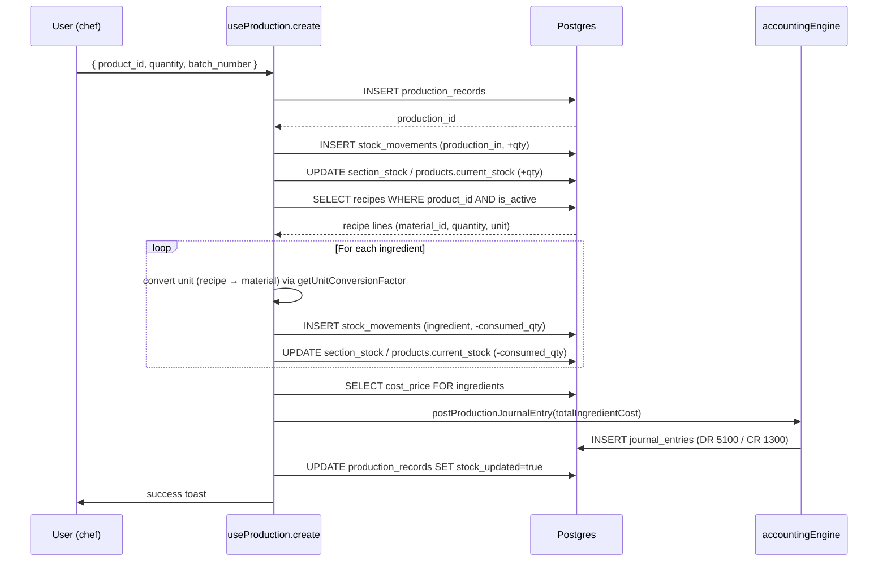

# 15 — Production & Recipes

> **Last verified** : 2026-05-17
> **Structure** : ce fichier fusionne la **vue fonctionnelle** (le *pourquoi* et le *quoi* métier — recipes BoM + production records + conversion d'unités + couplage comptable) et la **référence technique** (le *comment* implémenté : tables, hook `useProduction`, mutations atomiques, triggers désactivés). Pour les tâches à faire, voir [`../../workplan/backlog-by-module/15-production-recipes.md`](../../workplan/backlog-by-module/15-production-recipes.md).
> **Related E2E flows** : [12-production-stock-impact](../08-flows-end-to-end/12-production-stock-impact.md).
> **Prérequis modules** : [05 — Products & Categories](./05-products-categories.md) (BoM `recipes`), [06 — Inventory & Stock](./06-inventory-stock.md) (ledger des mouvements), [10 — Accounting](./10-accounting-double-entry.md) (JE COGS).
> **App de rattachement** : Backoffice exclusivement (`/inventory/production`). Pas d'interface POS — la production est un acte arrière-boutique.

> **En une phrase** : le module Production & Recipes est **le pétrin numérique** de The Breakery — il transforme un acte artisanal (sortir 50 baguettes du four) en cascade comptable et logistique propre, déduit automatiquement les ingrédients selon la recette avec conversion d'unités, traite les ratés sans culpabilité, alerte si une recette est infaisable avant pétrissage, et donne au gérant le coût matière réel de chaque produit au gramme près.

---

## Table des matières

- [Partie I — Vue fonctionnelle](#partie-i--vue-fonctionnelle)
  - [1. Raison d'être](#1-raison-dêtre)
  - [2. Les 2 dimensions du module](#2-les-2-dimensions-du-module)
  - [3. Les 5 invariants du module](#3-les-5-invariants-du-module)
  - [4. Les Recipes — Le bill of materials](#4-les-recipes--le-bill-of-materials)
  - [5. Les Production Records — Le quotidien du fournil](#5-les-production-records--le-quotidien-du-fournil)
  - [6. La gestion des ratés (waste)](#6-la-gestion-des-ratés-waste)
  - [7. L'historique de production](#7-lhistorique-de-production)
  - [8. Les suggestions de production](#8-les-suggestions-de-production)
  - [9. Le ProductionSummary — Le récap du jour](#9-le-productionsummary--le-récap-du-jour)
  - [10. La conversion d'unités — La mécanique invisible](#10-la-conversion-dunités--la-mécanique-invisible)
  - [11. Les productions infaisables — L'alerte préventive](#11-les-productions-infaisables--lalerte-préventive)
  - [12. Le couplage comptable](#12-le-couplage-comptable)
  - [13. Couplage avec le module Inventory](#13-couplage-avec-le-module-inventory)
  - [14. Mécaniques transverses — Comment le module dialogue avec le reste](#14-mécaniques-transverses--comment-le-module-dialogue-avec-le-reste)
  - [15. Ce que le module ne fait pas (par design)](#15-ce-que-le-module-ne-fait-pas-par-design)
- [Partie II — Référence technique](#partie-ii--référence-technique)
  - [16. Vue d'ensemble technique](#16-vue-densemble-technique)
  - [17. Tables DB](#17-tables-db)
  - [18. Workflow production](#18-workflow-production)
  - [19. Triggers SQL & stock movement automatique](#19-triggers-sql--stock-movement-automatique)
  - [20. Hooks](#20-hooks)
  - [21. Services](#21-services)
  - [22. Pages (`src/pages/inventory/`)](#22-pages-srcpagesinventory)
  - [23. Composants UI](#23-composants-ui)
  - [24. Vue analytics](#24-vue-analytics)
  - [25. RLS & permissions](#25-rls--permissions)
  - [26. Pitfalls](#26-pitfalls)
- [Partie III — Backlog opérationnel](#partie-iii--backlog-opérationnel)
- [Partie IV — Design & UX](#partie-iv--design--ux)
  - [27. Thèmes et contextes d'affichage](#27-thèmes-et-contextes-daffichage)
  - [28. Écrans du module](#28-écrans-du-module)
  - [29. Layout patterns appliqués](#29-layout-patterns-appliqués)
  - [30. Composants UI signature](#30-composants-ui-signature)
  - [31. États visuels critiques](#31-états-visuels-critiques)
  - [32. Couleurs sémantiques utilisées](#32-couleurs-sémantiques-utilisées)
  - [33. Microcopy et empty states](#33-microcopy-et-empty-states)
  - [34. Références visuelles externes](#34-références-visuelles-externes)
  - [35. À faire côté design (backlog UX)](#35-à-faire-côté-design-backlog-ux)

---

# Partie I — Vue fonctionnelle

## 1. Raison d'être

Le module Production & Recipes est **le pétrin numérique** de The Breakery. Il répond à la question fondamentale d'une boulangerie artisanale qui produit elle-même ce qu'elle vend :

> *"Quand le boulanger sort 50 baguettes du four, comment je sais que ça vient bien de m'avoir coûté 12,5 kg de farine, 250 g de sel, 75 g de levure et 7,5 L d'eau — et comment je suis sûr que mon stock matière s'est mis à jour tout seul, sans qu'il ait à le saisir ?"*

C'est le module qui transforme **l'acte artisanal de fabrication** en **flux de données comptables et logistiques** : un lot de production déclaré décrémente automatiquement les ingrédients consommés selon la recette, incrémente le stock produits finis, gère les ratés (waste), trace le batch, calcule le coût matière, et alimente la comptabilité (transfert COGS matières premières → stock produits finis).

Le module est **central à l'identité bakery** de l'app. Pour un restaurant qui revend ce qu'il achète, il n'a aucun sens ; pour une boulangerie qui fabrique 80 % de ce qu'elle vend, il est **la colonne vertébrale** entre les achats matières et les ventes produits finis.

---

## 2. Les 2 dimensions du module

Le module repose sur **deux concepts complémentaires** :

| Concept | Quoi | Quand on l'utilise |
|---|---|---|
| **Recipes** | La nomenclature : "pour produire 1 baguette, il faut X ingrédients" | À la création / modification d'un produit fini — opération rare, stratégique |
| **Production Records** | Les ordres de production : "j'ai produit Y baguettes le 12 mai" | Quotidien — chaque fournée saisie |

Recipes = **le savoir-faire codifié**. Production Records = **l'usage quotidien**.

---

## 3. Les 5 invariants du module

Quelle que soit la situation, le module garantit :

1. **Une recette = des proportions invariantes**. La recette dit "1 baguette = 250 g de farine". Que je produise 1 ou 1000 baguettes, le ratio est fixe.
2. **Conversion d'unités automatique**. La recette peut être en grammes, le stock matière en kilos — le système convertit (`getUnitConversionFactor`). 50 baguettes × 250 g = 12 500 g → −12,5 kg du stock farine.
3. **Production atomique**. Saisir une production déclenche en une transaction : déduction matières, incrémentation produit fini, gestion waste, écriture comptable, mouvements ledger. Tout ou rien.
4. **Waste géré séparément**. Sur 52 baguettes pétries, 50 vont en vente et 2 sont ratées (`quantity_waste`). Les ratés sont déduits du stock matière (la farine a quand même été consommée) mais n'entrent **pas** en stock vendable.
5. **Recettes versionnées dans le temps**. Modifier une recette ne change pas les coûts historiques. Une production passée garde le coût de la recette au moment où elle a été enregistrée.

---

## 4. Les Recipes — Le bill of materials

C'est l'**ADN du produit fini**. Pour chaque produit fini, on définit ses ingrédients :

### 4.1 Structure d'une recette

Une recette est une **liste de lignes**, chacune représentant un ingrédient :

| Champ | Exemple |
|---|---|
| **Product** (produit fini) | Baguette tradition |
| **Material** (matière première) | Farine T65 |
| **Quantity** | 250 |
| **Unit** | g |
| **Is active** | true |

Une baguette tradition aura donc ~4-5 lignes : farine, sel, levure, eau, améliorant.

### 4.2 Là où ça se définit

La recette se gère depuis la **fiche produit** (module [Products](./05-products-categories.md)) dans l'onglet "Recipe" :

- Ajout / retrait de lignes.
- Pour chaque ligne : choisir la matière première (autocomplete sur les produits flaggés `material`), quantité, unité.
- Désactivation d'une ligne sans supprimer (historique préservé).

### 4.3 Cohérence avec le coût

L'onglet Costing du produit utilise la recette pour calculer le **coût matière théorique** :

- Pour chaque ligne : `coût_unitaire_matière × quantité × conversion`.
- Somme = coût matière par unité produite.
- Comparé au prix de vente → marge brute théorique du produit.

Bénéfice métier : **chaque produit a sa fiche technique** et son coût matière calculé en direct. Quand la farine augmente de 10 %, l'app montre que le coût de la baguette monte de 5 % et que la marge baisse — décision pricing immédiate.

---

## 5. Les Production Records — Le quotidien du fournil

C'est l'**acte de production** : "j'ai fabriqué X unités de tel produit aujourd'hui dans telle section".

### 5.1 La saisie

Page `StockProductionPage` — pensée pour le boulanger ou le chef de production qui saisit en fin de service ou en début d'après-midi :

- **Sélection de la date** (par défaut : aujourd'hui).
- **Sélection de la section** (cuisine principale, four pâtisserie, atelier chocolat…).
- **Ajout des produits produits** ligne par ligne :
  - Produit fini (autocomplete).
  - Quantité produite.
  - Unité (modifiable, conversion auto).
  - Quantité waste (les ratés non vendables).
  - Raison du waste (mal cuit, mal levé, brûlé, esthétique…).
- **Estimation completion time** (optionnel — heure prévue de sortie pour piloter le service).
- **Save** → toute la chaîne se déclenche.

### 5.2 La chaîne déclenchée

À la validation, la mutation `useProduction.create` exécute :

1. Insertion d'un `production_records` avec `production_id` séquentiel.
2. Lookup de la recette du produit fini.
3. Pour chaque ligne de recette :
   - Conversion d'unité si recette en g et matière stockée en kg.
   - Calcul de la quantité consommée = `recette_qty × conversion × (quantity_produced + quantity_waste)`.
   - Création d'un mouvement `ingredient` qui débite le stock matière.
4. Création d'un mouvement `production_in` qui crédite le stock produit fini de `quantity_produced` (sans le waste).
5. Création d'un mouvement `production_waste` si `quantity_waste > 0`.
6. Trigger Postgres → écriture comptable de transfert (DR Finished Goods Inventory / CR Raw Materials Inventory).

Bénéfice métier : **un seul geste utilisateur, toute la mécanique** se déroule. Le boulanger saisit "50 baguettes, 2 ratées" et 7 mouvements de stock + 1 écriture compta sont créés.

---

## 6. La gestion des ratés (waste)

Spécificité métier : dans une boulangerie, **le rebut fait partie du métier**. Une fournée mal levée, un croissant brûlé, une tarte écrasée — c'est du quotidien.

Le module distingue :

| Type | Sort |
|---|---|
| **quantity_produced** | Stock produit fini, vendable |
| **quantity_waste** | Sortie matière effective (le pain *a* été pétri) mais pas de stock vendable |

Chaque waste est saisi avec une **raison catégorisée** (mal cuit, mal levé, esthétique, démonstration, test recette, dégustation client) → alimente le report `production_efficiency` qui suit le taux de waste par produit dans le temps.

Bénéfice métier : **chiffrer le coût des ratés** sans culpabiliser l'artisan. Le boulanger déclare ses 2 baguettes ratées, le système calcule que ça représente 4 % de waste sur la fournée et 12 000 IDR de matière perdue. Sur un mois c'est 360 000 IDR — assez pour justifier une formation ou un ajustement de recette.

---

## 7. L'historique de production

`ProductionHistory` (panneau dans `StockProductionPage`) affiche les **productions du jour** déjà enregistrées :

- Liste des productions saisies aujourd'hui.
- Pour chaque entrée : produit, quantité produite, quantité waste, staff, heure.
- **Suppression** possible (avec PIN manager + recompensation automatique des mouvements).
- **Navigation par date** : revenir au passé pour consulter les fournées des jours précédents.

Bénéfice métier : **la mémoire de la production**. Le manager voit en début d'après-midi qu'il y a déjà 80 baguettes saisies ce matin, donc inutile d'en relancer.

---

## 8. Les suggestions de production

Une vue dédiée (intégrée au panneau Alertes du module [Inventory](./06-inventory-stock.md)) propose des **recommandations de production** :

- Pour chaque produit fini : `vitesse_vente_jour × jours_couvrir − stock_courant`.
- Si positif → suggestion de production.
- Quantité suggérée arrondie au pas standard (douzaines pour viennoiseries, par 10 pour pains…).
- Filtrage par produits avec recette active uniquement.

Cas d'usage : "Vous vendez en moyenne 60 croissants par jour, vous en avez 8 en stock, il faut en relancer 100 pour couvrir 2 jours."

Bénéfice métier : **passer du push au pull**. Le boulanger n'attend plus qu'on lui demande — l'app pousse la liste des produits à relancer chaque matin.

---

## 9. Le ProductionSummary — Le récap du jour

Au-dessus de la saisie, un panneau récap synthétise :

- **Total produced** sur la journée.
- **Total waste** sur la journée + taux de waste (%).
- **Nombre de produits différents** mis en production.
- **Section active** pour la saisie courante.

Bénéfice métier : **dashboard production permanent**. Le chef voit en direct sa performance de la journée.

---

## 10. La conversion d'unités — La mécanique invisible

Spécificité technique avec impact métier énorme : le module gère **les conversions d'unités** entre la recette et le stock.

### 10.1 Pourquoi

- La **recette** s'écrit naturellement en grammes (gramme par baguette).
- Le **stock matière** est suivi en kilos (la farine s'achète au sac de 25 kg).
- Sans conversion, on aurait un produit fini défini en "250 g de farine" et un stock de "100 kg de farine" → impossible à comparer.

### 10.2 Comment

La fonction `getUnitConversionFactor(recipeUnit, materialUnit)` gère les paires :

- `g ↔ kg` (×0,001 / ×1000).
- `mL ↔ L` (×0,001 / ×1000).
- `pcs ↔ pcs` (×1).
- Conversions personnalisées par produit (si nécessaire).

À chaque saisie de production, le système applique la conversion **silencieusement** avant de débiter le stock.

Bénéfice métier : **liberté de définir la recette dans l'unité naturelle** (gramme pour la pâtisserie, mL pour les liquides) sans devoir tout aligner à la main. Le système traduit.

---

## 11. Les productions infaisables — L'alerte préventive

Avant de valider une saisie de production, le système peut **alerter** si une recette est infaisable :

- Calcul à blanc des consommations attendues.
- Vérification que chaque matière a un stock suffisant.
- Si insuffisant → alerte visuelle avec le détail "il manque 2,5 kg de farine et 50 g de levure pour produire les 100 baguettes prévues".
- L'utilisateur peut quand même forcer la saisie (avec `inventory.adjust` et un warning compta), ou réduire la quantité.

Bénéfice métier : **avant de pétrir, le système sait si on peut pétrir**. Évite de découvrir en pleine production qu'il manque un ingrédient.

---

## 12. Le couplage comptable

Chaque production génère **automatiquement** une écriture journal :

| Mouvement | Compte débit | Compte crédit |
|---|---|---|
| Sortie matières premières (recipe-based) | — | 1310 Raw Materials Inventory |
| Entrée produits finis | 1320 Finished Goods Inventory | — |
| Waste | 5210 Production Waste Expense | 1320 Finished Goods (si waste post-prod) |

Le solde net : **le coût matière sort du stock matières premières, entre dans le stock produits finis** (sauf la partie waste qui passe directement en charge). Quand le produit fini sera vendu, le coût matière sera transféré du stock vers le COGS via le trigger de vente.

Bénéfice métier : **traçabilité comptable de la valeur ajoutée** par l'atelier. La marge brute des produits finis est calculable au gramme près.

---

## 13. Couplage avec le module Inventory

Le module Production **n'est pas autonome** — il s'appuie sur [Inventory](./06-inventory-stock.md) pour tout ce qui concerne le stock :

- **Stock matières premières** : lu pour vérifier la faisabilité, débité à chaque production.
- **Stock produits finis** : crédité à chaque production.
- **Ledger des mouvements** : chaque production génère plusieurs mouvements typés (`ingredient`, `production_in`, `production_waste`).
- **Sections** : la production se fait dans une section spécifique (cuisine, four, atelier) — référencée dans `production_records`.

Réciproquement, le module Inventory **utilise** Production :

- Le dashboard produit affiche la recette si applicable.
- Les suggestions de réapprovisionnement matières sont calculées d'après les recettes des produits finis à produire.
- Le coût matière dans le dashboard produit vient des recettes.

---

## 14. Mécaniques transverses — Comment le module dialogue avec le reste

| Module | Relation |
|---|---|
| **Products** | Onglet Recipe sur chaque fiche produit fini. Onglet Costing utilise la recette. |
| **Inventory** | Toutes les consommations / créations passent par le ledger inventory. |
| **Reports** | `production_report`, `production_efficiency`, `cogs_production` sont alimentés ici. |
| **Accounting** | Écritures de transfert raw materials → finished goods + waste expense. |
| **Settings** | Sections de production, unités par défaut, seuil d'alerte waste configurables. |
| **POS** | Quand un produit fini est vendu, le stock produit fini créé ici est décrémenté. |
| **Purchasing** | Les matières premières achetées via PO alimentent le stock utilisé ici. |

---

## 15. Ce que le module ne fait pas (par design)

- Le module **propose** la production (RPC `suggest_production_schedule_v1` S15 + UI calendar `ProductionSchedulePage`) mais ne **valide pas automatiquement** un plan — le boulanger arbitre toujours en début de service.
- Le module **ne suit pas le temps de pétrissage / cuisson** au four. Pas de minuteur intégré, pas de capteur IoT.
- Le module **n'expose pas les allergènes** sur le ticket de caisse ni sur le customer display. L'infra existe (S15 : enum 14 allergènes EU, `products.allergens[]`, view récursive `view_product_allergens`, badges Backoffice) mais l'intégration receipt/display est **WONTFIX 2026-05-17 per user decision** (memory `project_allergens_wontfix`). L'admin/back-office peut consulter les allergènes propagés via la BoM.

> **Note S15-S17** : les sous-recettes (F6), le versioning explicite (`recipe_versions` append-only), et les recettes en pourcentage de boulanger (`recipes.is_baker_percentage`) — historiquement listés ici comme non-supportés — sont **désormais livrés**. Voir [§25bis Architecture S15-S18 additions](#25bis-architecture-s15-s18-additions).

---

# Partie II — Référence technique

## 16. Vue d'ensemble technique

Module de gestion des recettes (BoM — Bill of Materials) et des **records de production** (fournées de pâtisserie). Cœur métier The Breakery : chaque fournée déduit automatiquement les matières premières via la recette, ajoute le produit fini en stock, et passe une écriture comptable COGS (DR 5100 / CR 1300).



**Cas d'usage clé** : la production matinale du chef pâtissier. Sélection du produit fini (croissant, baguette), saisie de la quantité produite, validation. Le système :

1. Insère le `production_record`
2. Lit la `recipe` active du produit
3. Crée un `stock_movement type='production_in'` (+qty produit fini)
4. Crée N `stock_movements type='ingredient'` (-qty matières premières)
5. Met à jour `section_stock` ou `products.current_stock` pour chaque mouvement
6. Calcule le coût total ingrédients (Σ `cost_price × consumed_qty`)
7. Pose le JE comptable DR 5100 / CR 1300 du montant calculé
8. Met `production_records.stock_updated = true`, `materials_consumed = true`

---

## 17. Tables DB

| Table | Rôle | RLS |
|---|---|---|
| `recipes` | Bill of Materials : un produit fini → N ingrédients (M:M via `material_id` lui-même un `products.id`) | Permission-based |
| `production_records` | Une ligne par fournée produite, lien vers le produit fini + section + staff | Permission-based |

`recipes` :

| Colonne | Type | Notes |
|---|---|---|
| `product_id` | `UUID` FK products | Le produit fini |
| `material_id` | `UUID` FK products | L'ingrédient — peut être `raw_material` ou `semi_finished` |
| `quantity` | `DECIMAL(10,3)` | Quantité par 1 unité de produit fini |
| `unit` | `TEXT` | Unité de la recette (ex. `g`, `ml`) — converti via `getUnitConversionFactor` vers l'unité du `material` |
| `is_active` | `BOOLEAN` DEFAULT TRUE | Désactivation sans suppression (versions de recette) |

`production_records` :

| Colonne | Type | Notes |
|---|---|---|
| `production_id` | `TEXT` UNIQUE | Format `PROD-YYYYMMDD-XXXX` (généré client-side) |
| `product_id` | `UUID` FK | Produit fini fabriqué |
| `quantity_produced` | `DECIMAL(10,3)` | Quantité de produit fini |
| `quantity_waste` | `DECIMAL(10,3)` DEFAULT 0 | Pertes (rebut, raté) |
| `production_date` | `DATE` | Date de la fournée (par défaut today) |
| `staff_id` / `staff_name` | `UUID` / `TEXT` | Pâtissier responsable |
| `section_id` | `UUID` FK sections | Section de production (cuisine, labo) |
| `status` | `TEXT` | Pour workflow étendu (draft → in_progress → completed) — peu utilisé en prod |
| `materials_consumed` | `BOOLEAN` DEFAULT FALSE | Flag qui passe à TRUE après la déduction des ingrédients |
| `stock_updated` | `BOOLEAN` DEFAULT FALSE | Flag qui passe à TRUE une fois les `stock_movements` créés |
| `estimated_completion` | `TIMESTAMPTZ` NULL | Pour les productions planifiées |
| `notes` | `TEXT` | Commentaires |
| `created_by` / `updated_by` | `UUID` FK user_profiles | Audit |

Le statut "stock_updated" / "materials_consumed" sert de protection idempotente : on ne re-déduit pas les ingrédients si le record est déjà flagué.

---

## 18. Workflow production



Toutes les étapes sont séquentielles dans un même `useMutation.mutationFn` — pas de transaction PostgreSQL globale (une RPC atomique `create_production_record` existe en parallèle, cf. `supabase/migrations/20260502061925_create_production_record_rpc.sql`, mais le hook fait actuellement les inserts séparément pour faciliter le debug).

---

## 19. Triggers SQL & stock movement automatique

Historiquement, un trigger `tr_update_product_stock` mettait à jour `products.current_stock` à chaque insert dans `stock_movements`. Il a été **désactivé** car il causait des deadlocks et des incohérences avec `section_stock`. Désormais le hook `useProduction.create` met à jour le stock **lui-même** après chaque insert de mouvement.

Triggers actifs liés :

- `production_records` n'a pas de trigger AFTER INSERT — toute la logique est côté hook
- Les `stock_movements` insérés par production sont consommés par les vues analytics `view_stock_waste`, `view_inventory_valuation`, etc.
- Le JE est posé via la fonction de service `postProductionJournalEntry` (pas via trigger DB) — voir [10 — Accounting](./10-accounting-double-entry.md)

Migration de référence pour la création des tables : `supabase/migrations/045_recipes_production_tables.sql`. Migrations correctives :
- `20260203100000_import_recipes.sql` — seed initial des recettes
- `20260204110000_fix_recipes_rls.sql` — correction RLS
- `20260222025747_secure_recipes_permissions.sql` — gating fin
- `20260222080054_add_production_record_status_columns.sql` — ajout `status`, `estimated_completion`
- `20260330300000_p2_fix_production_view.sql` — correction `view_production_summary`
- `20260502061925_create_production_record_rpc.sql` — RPC atomique alternative

---

## 20. Hooks

### Production (`src/hooks/inventory/useProduction.ts`)

Hook composite (544 lignes) :

| Méthode | Rôle |
|---|---|
| `list` | useQuery — `production_records` filtrés par produit, date range, staff. Joins product + user |
| `todayProduction` | useQuery — productions du jour |
| `summary` | useQuery — agrégat par produit (total_quantity, record_count, last_production) |
| `getById(id)` | useQuery factory — détail single |
| `create` | useMutation — orchestration complète (cf. workflow ci-dessus) |
| `update` | useMutation — édite uniquement `notes` et `batch_number` (pas de réversion stock) |
| `remove` | useMutation — **réverse les `stock_movements`** (production_in → -qty, ingredient → +qty) puis delete |

Realtime via `supabase.channel('production-changes')` qui invalide `['production']` sur tout INSERT/UPDATE/DELETE.

**Invalidations onSuccess** : `['production']`, `['stock-movements']`, `['inventory']`, `['products']`, `['product-full-detail']`, `['product-dashboard']` — la production touche large.

### Recipe (`src/hooks/inventory/useProductRecipe.ts`)

Hook simple pour récupérer la recette active d'un produit :

```ts
const { recipe, isLoading } = useProductRecipe(productId)
// recipe = Array<{ material_id, quantity, unit, material: { name, unit, cost_price } }>
```

Utilisé dans `RecipeViewerModal` (lecture seule), `RecipeTab` (édition inline).

### Stock production hook auxiliaire (`src/pages/inventory/useStockProduction.ts`)

Hook spécifique à la page `StockProductionPage` qui combine `useProduction` + `useProducts(filters: type='finished')` + helpers de validation. Pas exposé hors de la page.

---

## 21. Services

### `src/pages/inventory/stockProductionService.ts`

Service local de la page (pas dans `src/services/`) :

| Fonction | Rôle |
|---|---|
| `validateProductionInput(data)` | Vérifie qty > 0, product_id présent, stock ingrédients suffisant |
| `calculateIngredientCost(recipe, productionQty)` | Multiplie chaque ingrédient par qty produite × cost_price avec conversion d'unité |
| `formatProductionId(date)` | Génère `PROD-YYYYMMDD-XXXX` |

### `src/services/products/recipeImportExport.ts`

Import/export des recettes en CSV/JSON pour migration entre environnements. Format pivoté : 1 ligne = 1 (produit, ingrédient, quantité, unité).

### `src/services/accounting/accountingEngine.ts` — `postProductionJournalEntry`

Fonction qui crée le JE comptable :

```ts
await postProductionJournalEntry({
  productionId,           // FK source
  productionDate,         // = JE date
  productionNumber,       // PROD-XXX dans la description
  productName,
  totalIngredientCost,    // Σ cost_price × qty
  createdBy,
})
// → JE: DR 5100 (COGS Production) / CR 1300 (Inventory)
```

Retourne `{ success, skipped?, error? }`. Le hook `useProduction.create` log mais n'échoue pas si le JE échoue (la production reste enregistrée — réconciliation manuelle possible).

### `src/utils/unitConversion.ts` — `getUnitConversionFactor`

Helper critique : convertit la quantité recette dans l'unité du matériau. Exemple : recette en `g`, matériau stocké en `kg` → factor 0.001. Voir `src/types/units.ts` pour la matrice complète.

---

## 22. Pages (`src/pages/inventory/`)

| Page | Route | Garde |
|---|---|---|
| `StockProductionPage.tsx` | `/inventory/production` (et redirect `/production`) | `inventory.view` |
| `components/ProductionForm.tsx` | (sous-composant page) | sélection produit fini + qty + batch + notes |
| `components/ProductionSummary.tsx` | (sous-composant) | KPIs du jour : total fournées, top produit |
| `components/ProductionHistory.tsx` | (sous-composant) | Table des `production_records` récents avec actions |
| `tabs/RecipeTab.tsx` | sous-onglet de `ProductDetailPage` | Édition de la recette d'un produit |
| `dashboard/ProductionSection.tsx` | sous-composant `ProductInventoryDashboard` | Section production du dashboard global |
| `dashboard/RecipeUsageTable.tsx` | sous-composant dashboard | Top recettes utilisées |

Routes définies dans `src/routes/inventoryRoutes.tsx` (sous le `<Route path="/inventory">` parent).

---

## 23. Composants UI

| Composant | Localisation | Rôle |
|---|---|---|
| `RecipeViewerModal.tsx` | `src/components/inventory/` | Modal lecture seule pour visualiser la recette d'un produit fini |
| `RecipeImportModal.tsx` | `src/components/products/` | Import CSV/JSON de recettes en masse |
| `recipe-import/` | `src/components/products/` | Sous-composants de l'assistant d'import (mapping colonnes, preview, validation) |
| `alerts/ProductionTab.tsx` | `src/components/inventory/` | Onglet alerts spécifique production (recettes orphelines, ingrédients manquants) |

---

## 24. Vue analytics

`view_production_summary` (cf. migration `045` + correction `20260330300000_p2_fix_production_view.sql`) — agrégat 30 jours utilisé par `ProductionSection` et le rapport [`production_report` du module 14](./14-reports-analytics.md).

Rapports liés (catégorie Operations) :

- `production_report` — quantités, valeurs, coûts
- `production_efficiency` — taux de waste par produit, tendance journalière
- `cogs_production` — coût matières premières via production + ventes
- `product_materials` — recettes ingrédients × cost (catégorie Inventory)

---

## 25. RLS & permissions

| Permission | Action |
|---|---|
| `inventory.view` | Voir les productions et recettes |
| `inventory.create` | Créer un `production_record` |
| `inventory.update` | Éditer (notes, batch_number) |
| `inventory.delete` | Supprimer (avec réversion stock) |
| `inventory.adjust` | Ajustements manuels orthogonaux à la production |
| `products.update` | Modifier les recettes (BoM) |

Pattern RLS standard `is_authenticated()` SELECT + `user_has_permission()` writes. La table `recipes` a une policy spécifique `secure_recipes_permissions` (migration 2026-02-22) qui restreint l'édition aux rôles `admin` et `production_manager`.

Voir le flow E2E lié : [08-flows-end-to-end/12-production-stock-impact.md](../08-flows-end-to-end/12-production-stock-impact.md) pour le déroulé complet (sélection produit → calcul théorique ingrédients consommés → validation → impact stock multi-section → JE comptable → mise à jour des dashboards).

---

## 25bis. Architecture S15-S18 additions

> **Pourquoi cette section** : §17 (tables) et §19 (triggers) décrivent l'architecture S13. Les sessions S15-S18 ont introduit beaucoup de nouveaux objets DB et UI. Cette synthèse récapitule l'état post-S18 sans réécrire les sections d'origine. Pour le détail : INDEX [S15](../../workplan/plans/2026-05-15-session-15-INDEX.md), [S16](../../workplan/plans/2026-05-16-session-16-INDEX.md), [S17](../../workplan/plans/2026-05-17-session-17-INDEX.md), [S18](../../workplan/plans/2026-05-17-session-18-INDEX.md).

### Nouvelles tables (S15)

| Table | Rôle | Migration |
|---|---|---|
| `recipe_versions` | Snapshot append-only de chaque modification de recette. `snapshot` JSONB embarque depuis S16 le `cost_price` per-version (CHECK constraint). FK `production_records.recipe_version_id` figé pour traçabilité COGS. | `20260519000003..005` + S16 `20260520000020..022` |
| `production_batches` | Fournée multi-recettes en une opération atomique. FK `production_records.production_batch_id`. | `20260519000100..103` |
| `production_schedules` | Calendrier hebdo de slots (5am, 7am, 11am, 4pm) avec recettes prévues. Suggestions auto basées sur historique de vente 4 dernières semaines. | `20260519000120..122` |
| `margin_alerts` | Alertes quand un produit fini passe sous son `target_margin_pct`. Recalculée quotidiennement via pg_cron. | `20260519000140..142` |

### Nouvelles colonnes

- `recipes.is_baker_percentage` (boolean S15) — toggle mode pourcentage de boulanger (farine = 100%, eau = 65%, etc.). Conversion auto à la sauvegarde.
- `recipes.target_margin_pct` (S15) — seuil au-dessous duquel `margin_alerts` se déclenche.
- `production_records.expected_yield_qty` / `actual_yield_qty` / `yield_variance_pct` (S15) — F5 yield tracking. Variance > seuil (`business_config.production_yield_variance_threshold_pct`) déclenche modal de confirmation.
- `production_records.recipe_version_id` (S15) — FK figée vers le snapshot utilisé au moment de la production.
- `products.is_semi_finished` (boolean S16) — maintenu par trigger `tr_recipes_recompute_is_semi_finished` ; `true` ssi le produit a une recette de profondeur ≥ 2 (sous-recette). Distinct de l'enum legacy `product_type='semi_finished'`.
- `products.allergens[]` (array S15) — 14 allergènes EU (gluten, lactose, etc.) ; vue récursive `view_product_allergens` agrège via la BoM.

### Nouveaux RPCs (SECURITY DEFINER, gated)

| RPC | Rôle | Migration |
|---|---|---|
| `calculate_recipe_cost(recipe_id)` | Coût recette en cascade jusqu'à 5 niveaux (S15). Helper interne `_calculate_recipe_cost_walk` pour appels pg_cron sans `auth.uid()`. | `20260519000002` |
| `record_production_v1` | Insertion atomique d'une production avec déduction récursive matières feuilles, JE, idempotency key (bumped S15 pour cascade). | bump S15 `20260519000006` |
| `record_batch_production_v1` | Production multi-recettes en 1 tx (fix temp-table same-tx via S15). | `20260519000103` |
| `suggest_production_schedule_v1` | Calendrier hebdo basé sur `order_items × orders` (4 dernières semaines). | `20260519000121` |
| `recompute_recipe_margins_v1` | pg_cron quotidien qui recalcule marges et insère dans `margin_alerts`. | `20260519000142` |
| `duplicate_recipe_v1` | Clone d'une recette (utilisé par RecipeDuplicateModal). | `20260519000082` |
| `search_ingredients_v1` | Autocomplete IngredientPicker — retourne `{product_id, name, sku, kind, score}` avec ranking trigramme (S16 bump). | `20260519000081` + S16 `20260520000014` |
| `recipe_bom_full_v1` | Lecture **leaves-only** WITH RECURSIVE depth-5 — remplace BFS client-side, rewire `IngredientAggregatePreview` (S17). | `20260521000020..021` (fix numeric cast) |
| `product_cost_at_version(p_product_id, p_version_id)` | Full-cascade cost depth-5 pour 1 version donnée. | S17 |
| `upsert_recipe_v1` (bump S15) | Accepte baker percentage via trailing DEFAULTs (signature stable). | bump S15 `20260519000150` |
| `recipe_cost_history_v1` | Dual-mode report (overview cross-recipe + timeline single-recipe) gated par `reports.financial.read`. Consommé par 2 pages BO Reports S18. | S18 `20260522000010` |

### Nouveaux triggers

| Trigger | Effet | Migration |
|---|---|---|
| `validate_recipe_no_cycle` | Anti-cycle DFS 5-niveaux avant INSERT/UPDATE sur `recipe_ingredients`. | S15 `20260519000001` |
| `tr_snapshot_recipe_version_cascade` | Snapshot append-only dans `recipe_versions` à chaque UPDATE recette/ingredients, propagation WITH RECURSIVE aux ancestres (S17 refactor : cleanup WHEN OTHERS, COALESCE NULL cost, descriptive change_note). | S15 `20260519000003`, refactor S17 `20260521000011` |
| `tr_snapshot_on_product_cost_change` | Déclenche cascade snapshot ancestres quand `products.cost_price` change (manuel ou via WAC). | S17 `20260521000012` |
| `tr_update_product_cost_on_purchase` | WAC : à l'INSERT d'un `stock_movements.purchase/incoming`, recalcule `products.cost_price` via formule moyenne pondérée → cascade snapshots ancestres via trigger amont. | S17 `20260521000013` |
| `tr_recipes_recompute_is_semi_finished` | Maintient `products.is_semi_finished` après INSERT/UPDATE/DELETE sur `recipes` ou `recipe_ingredients`. | S16 `20260520000012` |
| pg_cron `recompute_recipe_margins_v1` | Recalcul quotidien des marges → insertions dans `margin_alerts`. | S15 `20260519000142` |

### Nouveaux composants UI Backoffice

`apps/backoffice/src/features/inventory-production/components/` : `ProductionForm` (étendu S15 expected/actual yield + waste), `YieldVarianceModal`, `RecipeVersionHistory` (S15 + S16 cost column), `RecipeEditor` (S15 IngredientPicker + DnD + Duplicate + cost preview), `RecipeDuplicateModal`, `RecipeCostPreviewCard`, `BatchSelector`, `IngredientAggregatePreview` (S15 BFS depth-1 → S17 rewire `recipe_bom_full_v1`), `ProductionCalendarGrid`, `ScheduleSlotCell`, `BoulangerModeToggle`, `BakerPreviewPanel` (extrait pour rester sous 500 lignes).

Pages : `BatchProductionPage`, `ProductionSchedulePage`, `MarginWatchPage`, `ProductionYieldPage` (reports), `RecipeCostOverviewPage`, `RecipeCostTimelinePage` (reports S18, recharts `LineChart`).

Helper domain : `packages/domain/src/production/recipeCostCalculator.ts` (S15) + `expandRecipeCascade.ts` (S17, public API `@breakery/domain` préservée — sans consumer actuel, DEV-S17-2.A-01 informational).

Cross-app : POS `ProductCard.tsx` + BO `Products.tsx` enrichis avec `AllergenBadge` (badges only ; receipt/display WONTFIX 2026-05-17).

---

## 26. Pitfalls

- **Triggers stock désactivés** : `tr_update_product_stock` n'est plus actif sur `stock_movements`. Toute insertion via SQL direct (hors `useProduction`) **ne mettra pas à jour** `products.current_stock` ou `section_stock`. Toujours passer par les hooks ou par la RPC `create_production_record_rpc` (atomique).
- **Conversion d'unité obligatoire** : la recette peut être en `g` et le matériau stocké en `kg`. Le hook applique `getUnitConversionFactor(recipeUnit, materialUnit)` — si la matrice ne couvre pas une paire, le factor par défaut est 1 (silencieux), ce qui causera une déduction massive ou nulle. Compléter `src/types/units.ts` avant d'utiliser de nouvelles unités.
- **`section_stock` vs `products.current_stock`** : si le produit a une `section_id`, le hook met à jour `section_stock`, sinon il met à jour `products.current_stock`. La fallback existe en cas d'erreur upsert. Pour un dashboard cohérent, **toujours** lire le stock via la vue agrégée (`view_inventory_valuation`) qui combine les deux.
- **JE non-bloquant** : si `postProductionJournalEntry` échoue (compte 5100 ou 1300 manquant), la production reste enregistrée et le stock est mis à jour, mais aucun JE n'est créé. Le `console.error('Production JE failed')` est silencieux côté UI. Surveiller le logger Sentry pour détecter ces cas.
- **Récursion produits semi-finis** : depuis S15, la déduction **EST récursive** via `record_production_v1` (cascade jusqu'à 5 niveaux, anti-cycle via trigger `validate_recipe_no_cycle`). Le RPC déduit récursivement les matières feuilles (raw materials) en walking la BoM. Depuis S17, le coût matière utilise `recipe_bom_full_v1` (depth-5 WITH RECURSIVE) côté lecture. **Limite** : profondeur 5 — au-delà, le snapshot s'arrête (acceptable pour Breakery dont la BoM la plus profonde est ~3 niveaux). Voir [§25bis Architecture S15-S18 additions](#25bis-architecture-s15-s18-additions).
- **Reverse delete partiel** : `useProduction.remove` réverse les `stock_movements` mais **ne réverse pas le JE comptable**. Pour annuler proprement, créer un JE manuel de contre-passation après la suppression.
- **`materials_consumed` jamais flag** : le hook met `stock_updated = true` mais oublie souvent `materials_consumed = true` (champ historique non systématique). Ne pas s'appuyer dessus pour des invariants — préférer `stock_updated` ou la présence de `stock_movements` liés via `reference_id`.
- **`production_id` collision** : le format `PROD-YYYYMMDD-XXXX` avec 4 chars base36 random a ~1.7M combinaisons par jour. Pour les volumes The Breakery (~50 productions/jour) c'est sans risque, mais valider l'unicité côté DB via UNIQUE constraint.
- **`quantity_waste` ne déduit rien** : le champ existe sur `production_records` pour le reporting, mais `useProduction.create` **n'en tient pas compte** dans la quantité ajoutée au stock. Pour soustraire les pertes, soit saisir manuellement un `stock_movement type='waste'` après, soit étendre la mutation. Le rapport `production_efficiency` utilise `quantity_waste` pour calculer le taux de gâche.
- **Versioning des recettes** : depuis S15, toute modification d'une recette ou de ses ingrédients déclenche un snapshot append-only dans `recipe_versions` (trigger `tr_snapshot_recipe_version_cascade`). Le `snapshot` JSONB embarque depuis S16 le `cost_price` per-version (breaking shape change — rows legacy pré-S16 tolérées sans cost, voir DEV-S16-2.B-02). Depuis S17, un changement de `products.cost_price` (via WAC purchase trigger) propage automatiquement des snapshots aux **recettes ancestres** via WITH RECURSIVE walk (`tr_snapshot_on_product_cost_change`). Le modèle legacy "disable/replace via `RecipeImportModal` + `is_active` flag" n'est plus utilisé. Pour lire l'historique : page BO `RecipeVersionHistory` ou nouveau report S18 `RecipeCostHistory` (voir module 14, TASK-14-021).
- **Coût ingrédient = `cost_price`** : si un produit ingrédient n'a pas de `cost_price` renseigné, son coût est traité comme 0 dans le JE. Le total COGS sera sous-évalué. Vérifier régulièrement via le rapport `product_materials` que tous les ingrédients ont un coût.

---

# Partie III — Backlog opérationnel

Pour les tâches techniques à exécuter (sous-recettes / semi-finis, versioning explicite des recettes, plan de production hebdomadaire, boulanger's percentages, allergènes structurés, saisie mobile cuisine, IoT four, coût-marge temps réel, yield calculator, RPC atomique production), voir :

→ [`../../workplan/backlog-by-module/15-production-recipes.md`](../../workplan/backlog-by-module/15-production-recipes.md)

Tâches priorisées P0–P3 avec critères d'acceptation, dépendances, estimations XS/S/M/L/XL et risques identifiés.

---

# Partie IV — Design & UX

> **Source canonique** : [`../../DESIGN_POS_AND_BACKOFFICE.md`](../../DESIGN_POS_AND_BACKOFFICE.md) (design détaillé des deux apps).
> **Design system global** : [`../02-design-system/`](../02-design-system/) (7 fichiers : Luxe Dark, tokens, shadcn, layouts, responsive).
> **Screenshots de référence** : [`../../ux/assets/screens/`](../../ux/assets/screens/) — source de vérité visuelle.

## 27. Thèmes et contextes d'affichage

Le module Production vit **exclusivement en Backoffice** (`.theme-backoffice`). C'est un acte arrière-boutique — pas d'UI POS dédiée.

| Contexte | Thème CSS | Pages concernées | Identité |
|---|---|---|---|
| **Backoffice — Production saisie** | `.theme-backoffice` (ivoire `#F8F8F6`) | `/inventory/production` | Salle de commandement claire, dense, formulaire scrollable haute densité |
| **Backoffice — RecipeTab fiche produit** | `.theme-backoffice` | `/products/:id/edit` (onglet Recipe) | Éditeur BoM inline avec recherche matières |
| **Backoffice — RecipeImportModal** | `.theme-backoffice` | Modal depuis `/products` (bouton "Import recipes") | Assistant stepper |
| **Backoffice — RecipeViewerModal** | `.theme-backoffice` | Modal depuis fiche produit ou alerte | Lecture seule de la recette + stock dispo en temps réel |
| **Backoffice — ProductionTab Alerts** | `.theme-backoffice` | Panel Alerts depuis topbar (`StockAlertsPanel`) | Onglet dédié aux suggestions de production |

**Constante de marque cross-thème** : l'or `#C9A55C` reste identique partout (bouton "Save production", total coût matière, badge "Production OK"). Voir [`../../DESIGN_POS_AND_BACKOFFICE.md`](../../DESIGN_POS_AND_BACKOFFICE.md) §2 (Luxe Bakery).

---

## 28. Écrans du module

| Route / Écran | Type | Densité | Composants signature |
|---|---|---|---|
| `/inventory/production` | Page de saisie production multi-items | Très haute | `StockProductionPage`, `ProductionSummary`, `ProductionForm`, `ProductionHistory` |
| `/products/:id/edit` (onglet Recipe) | Éditeur BoM | Haute | `RecipeTab` — table éditable lignes matière/qty/unit |
| Modal `RecipeImportModal` | Stepper import CSV/JSON | Moyenne | Étapes : upload → mapping colonnes → preview → execute |
| Modal `RecipeViewerModal` | Lecture seule | Faible | Cards ingrédients avec stock dispo temps réel |
| `ProductionTab` (dans `StockAlertsPanel`) | Onglet suggestions | Moyenne | Liste produits à relancer en production avec qty suggérée |
| `dashboard/ProductionSection` | Section dashboard produit | Moyenne | Charts production récente + top produits + waste rate |
| `dashboard/RecipeUsageTable` | Table compacte | Faible | Recettes consommatrices d'un ingrédient (vue inverse) |

---

## 29. Layout patterns appliqués

### 29.1 Backoffice — Page de saisie production (`/inventory/production`)

Layout dense formulaire (cf. [`../../DESIGN_POS_AND_BACKOFFICE.md`](../../DESIGN_POS_AND_BACKOFFICE.md) §4.4 et §4.6 pour la densité maximale) :

1. **Header de page** : titre "Production" + sous-titre avec date du jour + actions (DatePicker pour naviguer dans le passé, bouton "Export day report").
2. **`ProductionSummary`** : 4 KPI cards row — `Total produced today`, `Total waste today`, `Waste rate %`, `Active section`.
3. **`ProductionForm`** (zone principale) :
   - Sélecteur **section de production** (cards visuelles : `Cuisine principale`, `Four pâtisserie`, `Atelier chocolat`, etc. avec icônes).
   - **Table multi-lignes** : 1 ligne = 1 produit à saisir.
     - Colonne 1 : Product autocomplete (recherche sur produits `type='finished'` avec recette).
     - Colonne 2 : `quantity_produced` (input numérique avec stepper +/−).
     - Colonne 3 : `unit` (dropdown, conversion auto si différent du stock).
     - Colonne 4 : `quantity_waste` (input numérique, optionnel).
     - Colonne 5 : `waste_reason` (dropdown catégorisé : mal cuit, mal levé, esthétique, etc.) — visible seulement si `quantity_waste > 0`.
     - Colonne 6 : `notes` (texte libre court).
     - Colonne 7 : icône delete (trash) ligne.
   - Bouton **"Add product"** en fin de table.
   - **Estimated completion time** (champ optionnel TimeField).
4. **Sidebar droite — "Recipe preview & feasibility"** (sticky) :
   - Pour le produit actif sélectionné : aperçu recette avec stock dispo par matière (vert/orange/rouge selon couverture).
   - Badge "Feasible ✓" ou "Insufficient stock ⚠️" (avec détail manquant).
   - Coût matière théorique total + marge théorique vs prix de vente.
5. **Footer sticky** : bouton "Save production" or massif pleine largeur + bouton secondaire "Save as draft".
6. **`ProductionHistory`** en bas : table dense des productions du jour avec colonnes (Time / Product / Qty / Waste / Staff / Actions kebab → delete avec PIN).

### 29.2 Backoffice — Onglet Recipe (`/products/:id/edit`)

- **Table éditable** lignes recette :
  - Material autocomplete (recherche sur produits `type IN ('raw_material', 'semi_finished')`).
  - Quantity (input numérique).
  - Unit (dropdown).
  - Toggle `is_active`.
  - Drag handle pour réordonner (cosmétique).
- **Coût matière calculé live** affiché en pied de table : `Σ (cost_price × qty × conversion)` = coût matière par unité produite.
- **Comparaison auto** : coût matière vs prix de vente → marge brute théorique en gold massif.
- **Boutons** : "Add ingredient" en bas de la table, "Save recipe" sticky.

### 29.3 Backoffice — RecipeImportModal (stepper)

- **Step 1 — Upload** : drag-and-drop zone + bouton "Choose file" (CSV/XLSX/JSON).
- **Step 2 — Column mapping** : preview 5 premières lignes + dropdowns "Map column to field" (product, material, quantity, unit).
- **Step 3 — Preview & validate** : table preview complète avec lignes en erreur surlignées en rouge, tooltips d'erreur.
- **Step 4 — Execute** : progress bar + résultat "47 recipes imported, 3 updated, 2 errors".

### 29.4 Backoffice — RecipeViewerModal

Modal centrée, fond `surface-1`, header avec produit + photo :

- **Cards par ingrédient** : nom matière, qty × unit, conversion → stock unit, **stock dispo** affiché avec couleur sémantique :
  - Vert si dispo > consommation × 10 (large marge).
  - Orange si dispo couvre 1-10 productions.
  - Rouge si dispo < 1 production possible.
- **Footer** : coût matière total + marge vs prix de vente.

### 29.5 Backoffice — ProductionTab (dans Alerts)

Layout liste de suggestions :

- **Header** : "Production suggestions" + filtre par section.
- **Liste de cards** par produit fini :
  - Nom + photo + stock courant.
  - Vitesse moyenne `60 sold/day`.
  - Couverture `0.13 day left`.
  - Suggestion qty (`Produce 100 units to cover 2 days`).
  - Bouton "Add to production form" (gold) — pré-remplit `ProductionForm`.

### 29.6 Backoffice — Dashboard ProductionSection (fiche produit)

- **Mini-charts** : `StockTimelineChart` (production_in events highlighted) + `MovementBreakdownChart` (slice production).
- **Tableau "Last 10 productions"** : date, qty produced, waste, staff, JE link.
- **KPI** : taux de waste 30j, coût matière moyen 30j.

---

## 30. Composants UI signature

| Composant | Type | Usage | Style clé |
|---|---|---|---|
| `ProductionForm` | Table éditable | `/inventory/production` | Multi-row inline editing, autocomplete produits, conversion d'unité auto visible, validation faisabilité par ligne |
| `ProductionSummary` | KPI row | `/inventory/production` (haut de page) | 4 cards avec icônes Lucide (`ChefHat`, `Trash2`, `Percent`, `MapPin`) |
| `ProductionHistory` | Table dense | `/inventory/production` (bas de page) | Compact rows, badge waste-rate, actions kebab (delete avec PIN) |
| `RecipeTab` | Table éditable | `/products/:id/edit` | Drag handles, autocomplete materials, qty/unit inline, live cost calculation footer |
| `RecipeViewerModal` | Modal lecture | Depuis fiche produit ou alerte | Cards ingrédients avec stock dispo temps réel (vert/orange/rouge), footer marge |
| `RecipeImportModal` | Stepper modal | Depuis `/products` | 4 étapes : upload → mapping → preview → execute, progress bar |
| `FeasibilityBadge` | Badge inline | `ProductionForm` sidebar | Vert "Feasible" / orange "Tight stock" / rouge "Insufficient" avec détail tooltip |
| `WasteReasonSelect` | Dropdown | `ProductionForm` | Catégorisé : mal cuit, mal levé, esthétique, dégustation, test, autre |
| `UnitConversionTooltip` | Tooltip inline | `ProductionForm` qty input | Affiche conversion auto "250 g → 0.25 kg in stock" |
| `ProductionTab` (alerts) | List panel | `StockAlertsPanel` | Cards suggestions production avec CTA "Add to form" gold |
| `ProductionSection` (dashboard) | Mixed section | `ProductInventoryDashboard` | Mini-charts + table récente |

---

## 31. États visuels critiques

| État | Visuel | Pourquoi |
|---|---|---|
| **Recette infaisable** | Badge rouge "Insufficient stock" + détail "Missing 2.5 kg flour, 50 g yeast" en sidebar | Empêcher de pétrir si pas assez de matière |
| **Recette tight** | Badge orange "Tight stock" + warning "Only 1.2 batches possible" | Avertir avant de lancer une production complète |
| **Recette feasible** | Badge vert "Feasible ✓" + nombre de batches possibles | Confirmer faisabilité d'un coup d'œil |
| **Quantity_waste élevée** | Cellule fond orange si waste > 10% du produced + tooltip "High waste rate" | Détecter une fournée ratée à analyser |
| **Conversion d'unité auto** | Sous-texte gris discret sous le qty input : "250 g = 0.25 kg in stock" | Transparence sur la mécanique invisible |
| **Cost_price manquant sur ingrédient** | Badge orange "No cost defined" sur la ligne recette + warning sidebar "JE will be incomplete" | Inviter à compléter avant production |
| **JE production échoué** | Toast rouge "Production saved but JE failed — see logs" + link vers `/accounting/journal-entries` | Réconciliation manuelle requise |
| **Production saved successfully** | Toast vert avec récap "50 baguettes, 2 waste — 12.5 kg flour, 250 g salt consumed — JE posted" | Feedback complet de la cascade |
| **Recette désactivée** | Ligne grise barrée + toggle off + badge "Inactive (version 2024-09-12)" | Versions de recette préservées |
| **Suggestion production** | Card avec progress bar "0.13 day left" en rouge si critique + CTA "Produce now" gold | Action prête à exécuter |
| **Ingrédient orphelin** | Badge rouge "Recipe orphan" sur ligne dont le `material_id` n'existe plus | Audit avant import en masse |
| **Production in_progress** (status) | Indicateur jaune pulsing + ETA visible si `estimated_completion` | Pilotage flux production |

---

## 32. Couleurs sémantiques utilisées

| Rôle | Backoffice (light) | Usage Production |
|---|---|---|
| **Success** | `#16A34A` | Recette feasible, production saved, JE posted, waste rate sain (<3%) |
| **Warning** | `#D97706` | Recette tight (1-10 batches), waste rate >10%, cost_price manquant, ingrédient stock bas |
| **Error** | `#DC2626` | Recette infaisable (insufficient stock), JE failed, recette orphan, waste rate >20% |
| **Info** | `#2563EB` | Conversion d'unité auto, recette désactivée (version archive) |
| **Gold** | `#C9A55C` | Bouton "Save production", total coût matière, marge brute théorique, CTA "Produce now" alerts |

---

## 33. Microcopy et empty states

### Empty states (EN only)

| Page / contexte | Texte | CTA |
|---|---|---|
| `/inventory/production` (aucune fournée aujourd'hui) | "No productions today yet — your kitchen is quiet" + icône `ChefHat` grise | "Start a production" (auto-focus form) |
| `/inventory/production` ligne form vide | "Select a finished product to start" placeholder dans le 1er row | — |
| RecipeTab (aucun ingrédient) | "No recipe defined yet — production tracking requires at least one ingredient" + icône `BookOpen` grise | "Add first ingredient" |
| RecipeViewerModal (recette inexistante) | "This product has no active recipe — it cannot be produced" | "Define recipe" (lien vers RecipeTab) |
| ProductionTab Alerts (aucune suggestion) | "All finished products are well stocked — no production needed today" | — |
| RecipeImportModal step preview (toutes lignes en erreur) | "All rows have errors — fix your file and retry" | "Download error report" |
| ProductionHistory (date sans prod) | "No productions on May 12" | "Go back to today" |

### Confirmations destructives

- **Delete production record** : "This will reverse all stock movements (raw materials +12.5 kg flour returned, finished goods −50 baguettes). The accounting JE will NOT be reversed automatically — create a manual counter-entry." + bouton "Reverse production" (rouge) + champ raison obligatoire + PIN manager.
- **Disable a recipe** : "Existing productions remain unchanged. New productions will use the new active version." + bouton "Disable" (orange).
- **Force production despite insufficient stock** : "Stock will go negative on: Flour (-2.5 kg), Yeast (-50 g). Continue anyway with `inventory.adjust` permission?" + bouton "Force production" (rouge) + PIN admin.
- **Bulk import recipes overwrite** : "47 existing recipes will be deactivated and replaced by imported versions. The audit trail is preserved." + bouton "Import & overwrite" (orange).

### Toast notifications (EN)

- Succès production : "Batch saved: 50 baguettes / 2 waste — 12.5 kg flour, 250 g salt, 75 g yeast, 7.5 L water consumed — JE posted (Rp 125,000)"
- Production infaisable forcée : "Production forced despite insufficient stock — adjustments required for: Flour (-2.5 kg)"
- Erreur recette infaisable : "Insufficient raw materials — missing 2.5 kg flour to produce 100 baguettes" + bouton "Adjust qty"
- Erreur JE : "Production saved but accounting entry failed. Check chart of accounts (5100, 1300)."
- Erreur conversion : "Unknown unit conversion: tablespoon → kg. Falling back to factor 1. Update `src/types/units.ts`."
- Suggestion appliquée : "Added 100 baguettes to production form from suggestions"
- Recipe import OK : "47 recipes imported, 3 updated, 2 errors — see report"
- Reverse delete : "Production reversed — stock restored, JE counter-entry pending"

---

## 34. Références visuelles externes

| Ressource | Chemin / lien |
|---|---|
| Design doc complet (POS + Backoffice) | [`../../DESIGN_POS_AND_BACKOFFICE.md`](../../DESIGN_POS_AND_BACKOFFICE.md) |
| Tokens canoniques V2 | [`../../../DESIGN.md`](../../../DESIGN.md) à la racine |
| Inventaire tokens V2 | [`../../ux/v2-token-inventory.md`](../../ux/v2-token-inventory.md) |
| Screenshots Backoffice de référence | [`../../ux/assets/screens/backoffice/`](../../ux/assets/screens/backoffice/) — voir `Dashboard.jpg` pour pattern KPI / charts |
| Design system feature components | [`../02-design-system/04-feature-components.md`](../02-design-system/04-feature-components.md) |
| Module Inventory (couplage stock) | [`./06-inventory-stock.md`](./06-inventory-stock.md) |
| Module Products (BoM dans fiche produit) | [`./05-products-categories.md`](./05-products-categories.md) |
| Module Accounting (JE COGS) | [`./10-accounting-double-entry.md`](./10-accounting-double-entry.md) |

---

## 35. À faire côté design (backlog UX)

| Priorité | Évolution UX | Bénéfice |
|---|---|---|
| Critical | **Mockups saisie production mobile/tablette** | Le boulanger en cuisine doit pouvoir saisir sans aller au PC backoffice — tablette portrait avec gros boutons |
| Critical | **Visuel sous-recettes / semi-finis** (arbre recette imbriquée) | Une pâte feuilletée semi-fini consommée par croissants + pains au chocolat — UI dédiée |
| Critical | **Versioning explicite des recettes UI** (modal "Recipe history") | Voir les changements de recette dans le temps avec date/auteur/raison — analyse d'impact prix |
| High | **Plan de production hebdomadaire** (`/inventory/production/plan`) | Vue calendaire 7 jours, drag-and-drop des productions planifiées, instanciation en 1 clic |
| High | **Boulanger's percentages mode** dans RecipeTab | Toggle "Bakers % view" : recette affichée en % de farine pour les boulangers traditionnels |
| High | **Allergènes structurés** : badges sur fiche produit + propagation auto sur les recettes utilisatrices | Affichage automatique gluten/lactose/fruits à coque sur fiche produit + ticket |
| Medium | **Coût-marge temps réel par recette** : alerte si une modification fait passer sous le seuil de marge cible | Anti-perte commerciale immédiate |
| Medium | **Yield calculator UI** : "Si je veux servir 80 couverts demain, combien produire ?" | Recommandation basée sur historique conso |
| Medium | **Mode tactile pour la table ProductionForm** (cellules plus grandes, focus auto-suivant) | Saisie rapide en cuisine sans précision souris |
| Low | **Intégration IoT four** : capteurs sondes connectées qui pré-remplissent la production à la sortie du four | Saisie zéro |
| Low | **Confettis** sur production zéro-waste | Récompense visuelle au boulanger (gamification douce) |
| Low | **Mode présentation grand écran cuisine** : affichage des suggestions de production sur écran mural | Toute l'équipe voit ce qu'il y a à relancer |

---
