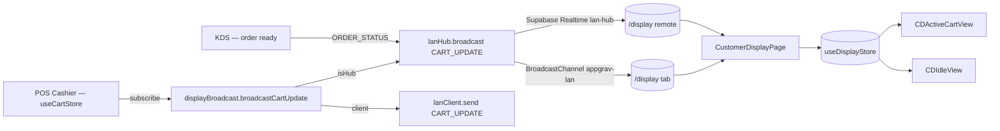

# 16 — Customer Display

> **Last verified** : 2026-05-13
> **Structure** : ce fichier fusionne la **vue fonctionnelle** (le *pourquoi* et le *quoi* métier) et la **référence technique** (le *comment* implémenté). Pour les tâches à faire, voir [`../../workplan/backlog-by-module/16-display-customer.md`](../../workplan/backlog-by-module/16-display-customer.md).
> **Related E2E flows** : [01-pos-sale-cash](../08-flows-end-to-end/01-pos-sale-cash.md), [07-loyalty-earn-redeem](../08-flows-end-to-end/07-loyalty-earn-redeem.md), [08-kds-order-lifecycle](../08-flows-end-to-end/08-kds-order-lifecycle.md).
> **App de rattachement** : POS (écran secondaire face client `/display` — purement passif, sans authentification de route).

> **En une phrase** : le module Customer Display est le second écran face client de The Breakery — il transforme un client devant la caisse en client informé en lui montrant son panier se construire en direct, voit la remise s'appliquer et ses points fidélité monter en temps réel, devient un panneau publicitaire animé pendant les creux d'activité, signale les commandes prêtes pour soulager le caissier, se dim automatiquement après 30 min d'inactivité — et tout cela sans qu'il ait jamais besoin d'être touché, en se contentant d'écouter le hub POS via LAN BroadcastChannel.

---

## Table des matières

- [Partie I — Vue fonctionnelle](#partie-i--vue-fonctionnelle)
  - [1. Raison d'être](#1-raison-dêtre)
  - [2. Les 2 vues du module](#2-les-2-vues-du-module)
  - [3. Les 5 invariants du module](#3-les-5-invariants-du-module)
  - [4. Le mode Active — CDActiveCartView](#4-le-mode-active--cdactivecartview)
  - [5. Le mode Idle — CDIdleView](#5-le-mode-idle--cdidleview)
  - [6. Notifications d'ordres prêts — Le pont avec le KDS](#6-notifications-dordres-prêts--le-pont-avec-le-kds)
  - [7. Le canal LAN — Le cordon avec le POS](#7-le-canal-lan--le-cordon-avec-le-pos)
  - [8. Configuration — Settings → Display](#8-configuration--settings--display)
  - [9. Les promotions affichées — display_promotions](#9-les-promotions-affichées--display_promotions)
  - [10. Le displayStore — La mémoire locale](#10-le-displaystore--la-mémoire-locale)
  - [11. Mécaniques transverses](#11-mécaniques-transverses)
  - [12. Ce que le module ne fait pas](#12-ce-que-le-module-ne-fait-pas)
  - [13. Utilisateurs cibles](#13-utilisateurs-cibles)
- [Partie II — Référence technique](#partie-ii--référence-technique)
  - [14. Vue d'ensemble technique](#14-vue-densemble-technique)
  - [15. Diagramme de responsabilité](#15-diagramme-de-responsabilité)
  - [16. Tables DB](#16-tables-db)
  - [17. Hooks](#17-hooks)
  - [18. Services](#18-services)
  - [19. Composants UI](#19-composants-ui)
  - [20. Stores](#20-stores)
  - [21. RPCs / Edge Functions](#21-rpcs--edge-functions)
  - [22. RLS / Permissions](#22-rls--permissions)
  - [23. Routes](#23-routes)
  - [24. Flows E2E](#24-flows-e2e)
  - [25. Pitfalls](#25-pitfalls)
- [Partie III — Backlog opérationnel](#partie-iii--backlog-opérationnel)
- [Partie IV — Design & UX](#partie-iv--design--ux)
  - [26. Thèmes et contextes d'affichage](#26-thèmes-et-contextes-daffichage)
  - [27. Écrans du module](#27-écrans-du-module)
  - [28. Layout patterns appliqués](#28-layout-patterns-appliqués)
  - [29. Composants UI signature](#29-composants-ui-signature)
  - [30. États visuels critiques](#30-états-visuels-critiques)
  - [31. Couleurs sémantiques utilisées](#31-couleurs-sémantiques-utilisées)
  - [32. Microcopy et empty states](#32-microcopy-et-empty-states)
  - [33. Références visuelles externes](#33-références-visuelles-externes)
  - [34. À faire côté design (backlog UX)](#34-à-faire-côté-design-backlog-ux)

---

# Partie I — Vue fonctionnelle

## 1. Raison d'être

Le module Customer Display est **le second écran face client** de The Breakery. Il répond à une question simple mais déterminante pour la confiance et l'engagement :

> *"Comment je rends transparent ce que le caissier saisit à la caisse, comment je valorise les promotions et les points fidélité gagnés en direct, et comment je rends utile l'écran orienté client même quand personne n'achète, pendant la pause de 14h à 15h ?"*

C'est l'écran qui transforme **un client devant la caisse** en **client informé, rassuré et engagé** : il voit son panier se construire en direct, voit la remise s'appliquer quand une promo se déclenche, voit ses points fidélité monter, voit le total final avant de payer, voit son ticket arriver à la cuisine, et — quand il n'y a personne à encaisser — voit les promos du moment défiler.

Le module a **deux modes** complémentaires :

- **Active** — un client est en train de commander → afficher son panier en direct.
- **Idle** — personne n'est en cours d'encaissement → afficher promotions, logo, ambiance.

Le tout sans la moindre interaction de la part du client — l'écran est **purement informationnel et marketing**, jamais tactile.

---

## 2. Les 2 vues du module

| Vue | Quand | Quoi |
|---|---|---|
| **CDActiveCartView** | Pendant une commande en cours | Cart live, totaux, remises, points fidélité gagnés, statut envoi cuisine |
| **CDIdleView** | Aucune activité caisse | Logo The Breakery, promos rotatives, message d'accueil, ambiance visuelle |

La bascule entre les deux est **automatique** : dès que le caissier met un produit au panier, l'écran passe en mode Active ; après N secondes sans activité, il retourne en Idle.

---

## 3. Les 5 invariants du module

Quel que soit le mode, le module garantit :

1. **Aucune interaction tactile**. L'écran est purement passif. Pas de bouton, pas de clic. Le client regarde, il ne touche pas.
2. **Synchro temps réel avec le POS**. Chaque ajout / retrait au cart caisse se reflète sur l'écran client en <500 ms via LAN BroadcastChannel.
3. **Idle = utile**. L'idle screen n'est jamais "vide" : promos qui défilent, logo, messages d'accueil — l'écran continue à travailler pour la boutique.
4. **Économie d'énergie après 30 min idle**. Le screen se dim automatiquement → préservation de l'écran physique et de l'attention client (rien ne clignote inutilement).
5. **Configurable côté Settings**. Durées idle, rotation promos, sons, etc. ne sont pas codés en dur — le gérant ajuste depuis Settings → Display.

---

## 4. Le mode Active — CDActiveCartView

Activé dès qu'un item entre dans le cart caisse.

### 4.1 Ce que voit le client

- **Logo The Breakery** en en-tête (toujours visible — branding constant).
- **Liste des items** au fur et à mesure de leur ajout :
  - Nom du produit, quantité, prix unitaire, prix total ligne.
  - Modificateurs en sous-ligne ("Sucre +", "Sans lait").
  - Mise en valeur du dernier item ajouté (highlight 2 secondes).
- **Remises appliquées** :
  - Promo déclenchée → ligne dédiée avec nom et montant.
  - Animation visuelle subtile (la remise apparaît, le total baisse).
- **Sous-total / Taxe PB1 / Total** affichés en gros.
- **Si client lié** : nom du client, palier fidélité, **points gagnés en direct** ("+45 points pour cette commande").

### 4.2 Pendant le paiement

- **Méthode de paiement** affichée (Cash / Card / QRIS…).
- Pour cash : **montant reçu et monnaie à rendre** affichés en grand caractère (utile au client pour vérifier).
- Pour digital : **QR code de paiement** (futur — backlog).

### 4.3 À la finalisation

- **Message de confirmation** "Order Confirmed".
- **Numéro de commande** affiché en gros.
- **Estimation du temps** si dine-in.
- Bascule automatique en Idle après quelques secondes.

Bénéfice métier : **la transparence transformée en confiance**. Le client voit que rien n'est dissimulé, voit la valeur du programme fidélité (points qui montent), et part avec son numéro de commande visuellement validé.

---

## 5. Le mode Idle — CDIdleView

Activé quand aucune activité caisse n'est détectée pendant le `idleTimeoutSeconds` configurable (typiquement 60s).

### 5.1 Contenu

- **Logo The Breakery** dominant.
- **Promos rotatives** : carrousel des promotions actives (`display_promotions` table) :
  - Image, titre, description courte, période de validité visible.
  - Rotation toutes les `promoRotationIntervalSeconds` (typiquement 8-15s).
  - Fade in/out doux pour ne pas agresser l'œil.
- **Message d'accueil** : "Welcome to The Breakery — Try our signature croissant".
- **Horaires d'ouverture** discrets en bas.
- **QR code wifi guest** ou QR code Instagram (futur).

### 5.2 Gestion de l'attention

- Animations **lentes et apaisées** — l'objectif est de séduire, pas de distraire.
- **Pas de son** en mode Idle (sauf cas spécial cf. §6).
- **Dim automatique après 30 min** d'inactivité totale (la boutique est fermée ou en pause) — protège l'écran et réduit la consommation.

Bénéfice métier : **l'écran continue à vendre quand personne ne commande**. Pendant le creux de 14h-15h, les passants voient les promos du soir et reviennent peut-être.

---

## 6. Notifications d'ordres prêts — Le pont avec le KDS

Spécificité plus avancée : le Customer Display peut afficher les **commandes prêtes** quand le client attend en salle.

### 6.1 Mécanique

- Quand le KDS marque une commande `all ready`, le hub POS broadcaste un message `ORDER_STATUS` (status `ready`) au Customer Display.
- L'écran affiche : "Order #124 — Ready" en grand caractère pendant N secondes (5 min auto-removal).
- Bip sonore optionnel (configurable).
- Animation d'apparition.

### 6.2 Usage typique

- Le client a commandé pour emporter, paye et attend à sa table.
- Quand sa commande sort, l'écran le notifie sans qu'il ait à demander.
- Réduit la pression sur le caissier qui n'a plus à crier "Numéro 124 !".

Bénéfice métier : **scaler le service sans staff supplémentaire**. Un écran fait le travail d'un crieur — et c'est plus discret + plus stylé pour la marque.

---

## 7. Le canal LAN — Le cordon avec le POS

Le Customer Display est un **client LAN** qui écoute le hub POS :

| Message reçu | Effet |
|---|---|
| `CART_UPDATE` | Mise à jour du panier affiché (ajout / retrait / modif quantité) |
| `CART_CLEAR` | Vidage du panier → bascule en Idle après timeout |
| `ORDER_STATUS` (status=ready) | Affichage de la notification "ready" + son optionnel |
| `PROMOTION_UPDATE` | Recharge la liste des promos affichées en idle |
| `CONFIG_UPDATE` | Recharge les réglages (idle timeout, etc.) |

Le display **ne renvoie rien** au hub — c'est une communication strictement descendante. Pas d'écriture en base, pas de mutation.

Si la liaison LAN saute :

- L'écran reste sur le dernier état connu.
- Indicateur visuel discret de déconnexion (point gris en coin).
- Auto-reconnexion en arrière-plan.

Bénéfice métier : **client jamais visible**. Une coupure réseau ne casse pas l'écran — il continue à afficher quelque chose de cohérent.

---

## 8. Configuration — Settings → Display

Réglages disponibles :

| Réglage | Effet |
|---|---|
| **Idle timeout** | Combien de secondes d'inactivité avant bascule en mode Idle (défaut 60s) |
| **Promo rotation interval** | Combien de secondes entre deux promos (défaut 10s) |
| **Show ready orders** | Activer / désactiver l'affichage des commandes prêtes |
| **Sound on ready** | Bip sonore quand une commande est prête |
| **Welcome message** | Texte d'accueil personnalisé |
| **Show wifi QR** | Afficher un QR code wifi guest en idle |
| **Show fidélité animation** | Activer / désactiver l'animation de points en direct |
| **Theme** | Clair / sombre / auto |
| **Dim after minutes** | Hard-coded à 30 min en V2 (cf. backlog UX pour exposition setting) |

Toutes ces valeurs sont propagées par `CONFIG_UPDATE` sans devoir redémarrer l'écran.

Bénéfice métier : **chaque boutique a sa personnalité**. The Breakery dark mode avec animation points = signature visuelle distincte.

---

## 9. Les promotions affichées — display_promotions

Les promotions affichées en mode Idle viennent d'une **table dédiée** distincte des promotions transactionnelles :

- **Titre + sous-titre + description**.
- **Image** (uploadée dans Supabase Storage).
- **Période d'affichage** (`start_date`, `end_date`, nullables pour open-ended).
- **Priorité** (DESC sort pour ordre rotation).
- **Statut actif** (`is_active`).
- **Couleurs background / text** pour thématiser le visuel.

Le gérant gère cette table depuis Settings → Display → Promotions (ou un éditeur dédié).

Distinction importante : ces promos sont **purement marketing visuel**. Elles ne déclenchent pas de remise. La remise réelle est dans le module Promotions & Combos. Le Customer Display **promeut** ; le moteur **applique**.

Bénéfice métier : **séparation marketing / opérationnel**. On peut afficher "−15 % le mercredi sur les viennoiseries" en visuel marketing dans Idle, ET avoir la promo correspondante configurée dans Promotions qui s'applique automatiquement à la caisse. Mais on peut aussi afficher "Nouveauté — Cookie au chocolat blanc" sans qu'il y ait de promo réelle dessous.

---

## 10. Le displayStore — La mémoire locale

Côté technique métier, le `displayStore` (Zustand) maintient l'état local de l'écran :

- `cart` : le cart courant (ou null si idle).
- `isIdle` : true / false.
- `orderQueue` : liste des commandes en cours.
- `readyOrders` : commandes marquées ready récemment.
- `currentPromoIndex` : index dans la rotation de promos.
- `connected` : statut de connexion LAN.

L'écran est entièrement **piloté par cet état** — pas de fetch direct, pas d'écriture. Sa robustesse vient de cette simplicité.

---

## 11. Mécaniques transverses

| Module | Relation |
|---|---|
| **POS** | Source des `CART_UPDATE` via `useDisplayBroadcast`. |
| **KDS** | Source des `ORDER_STATUS` (status=ready) quand commande all ready. |
| **Promotions** | Affichage marketing des `display_promotions` (table distincte des promos transactionnelles). |
| **Customers** | Affichage du nom + palier fidélité quand un client est lié au cart. |
| **Settings** | Configuration centralisée dans Settings → Display. |
| **LAN** | Client LAN sans écriture (réception uniquement). |
| **Branding** | `BreakeryLogo` et styles (`customerDisplayStyles`) cohérents avec la signature visuelle The Breakery. |

---

## 12. Ce que le module ne fait pas

- L'écran **n'est pas tactile**. Aucune interaction client. C'est un écran de **diffusion**, pas un kiosk.
- L'écran **ne saisit aucune donnée**. Pas de "tapez votre numéro de téléphone pour la fidélité".
- L'écran **ne pré-commande pas**. C'est le rôle de TabletOrdering ou du POS, pas du display.
- L'écran **ne paie pas**. Pas de NFC, pas de QR de paiement (encore — backlog).
- L'écran **ne joue pas de vidéos** (uniquement images statiques pour les promos).
- L'écran **ne fait pas d'analytics** sur les clients (eye tracking, comptage de regards) — pas d'IoT vision.
- L'écran **ne supporte pas l'offline complet** — coupure LAN = écran figé sur dernier état (acceptable car non transactionnel).

---

## 13. Utilisateurs cibles

| Rôle | Ce qu'il fait dans le module |
|---|---|
| **Client final** | Regarde l'écran — voit son panier, ses points, ses promos. Aucune action requise. |
| **Caissier** | Indirect — sait que l'écran reflète son cart. Sait que l'écran annonce les "ready" pour soulager les annonces vocales. |
| **Gérant** | Configure les promos affichées via Settings → Display, ajuste les durées idle/rotation, surveille la connexion LAN. |
| **Manager marketing** | Crée les visuels de `display_promotions` (image, titre, période). |

---

# Partie II — Référence technique

## 14. Vue d'ensemble technique

Public-facing customer display device showing live cart, totals, order queue and rotating promotions. Mirrors the cashier's POS in real-time over LAN.

The Customer Display is a passive, fullscreen client surface served at `/display`. It is intended for a screen physically mounted on the customer side of the counter (small TV, tablet in landscape, second monitor). It has **no authentication guard** (route is public) because the device only consumes broadcast data and never mutates anything server-side.

Three surfaces are composited on the same page based on activity state:

| Surface          | Trigger                                                       | Visual                                                         |
| ---------------- | ------------------------------------------------------------- | -------------------------------------------------------------- |
| **Active cart**  | `cart.items.length > 0`                                       | Branded header + line items + totals + order type / table info |
| **Idle promos**  | `cart.items.length === 0` AND `idle > idleTimeoutSeconds`     | Rotating promo cards loaded from `display_promotions`          |
| **Ready orders** | One or more orders broadcast `status: 'ready'` (last 5 min)   | Toast-style banner with order number + chime audio cue         |

Updates flow exclusively from the POS hub through the LAN layer (BroadcastChannel + Supabase Realtime fallback).

---

## 15. Diagramme de responsabilité



---

## 16. Tables DB

| Table                | Rôle                                                        | Migration                |
| -------------------- | ----------------------------------------------------------- | ------------------------ |
| `display_promotions` | Promo cards rotated in idle mode (image, title, dates)      | `010_lan_sync_display`   |
| `display_content`    | Auxiliary content blocks (announcements, menu spotlights)   | `010_lan_sync_display`   |
| `lan_nodes`          | Runtime presence of the display device (heartbeat 30 s)     | `010_lan_sync_display`   |

Key columns of `display_promotions`:

| Column             | Type      | Notes                                |
| ------------------ | --------- | ------------------------------------ |
| `title`            | TEXT      | Headline                             |
| `subtitle`         | TEXT      | Secondary line                       |
| `image_url`        | TEXT      | CDN/Storage URL                      |
| `start_date`       | DATE      | Nullable — open-ended start          |
| `end_date`         | DATE      | Nullable — open-ended end            |
| `is_active`        | BOOLEAN   | Filter at fetch                      |
| `priority`         | INT       | DESC sort                            |
| `background_color` | TEXT      | Hex (idle theming)                   |
| `text_color`       | TEXT      | Hex                                  |

---

## 17. Hooks

| Hook                           | Path                                          | Rôle                                                    |
| ------------------------------ | --------------------------------------------- | ------------------------------------------------------- |
| `useDisplayStore`              | `src/stores/displayStore.ts`                  | State store (cart mirror, queues, idle, promos)         |
| `useDisplayBroadcast`          | `src/hooks/pos/useDisplayBroadcast.ts`        | Cross-tab fallback via `BroadcastChannel('appgrav-pos')` — used by POS Cart, PaymentModal, SplitByItemModal |
| `useDisplaySettings`           | `src/hooks/settings/useModuleConfigSettings` | Reads `display.*` keys (`idleTimeoutSeconds`, `promoRotationIntervalSeconds`) |
| `useLanClient` (indirect)      | `src/hooks/lan/useLanClient.ts`               | Connection to hub (heartbeat, status)                   |

---

## 18. Services

| Service                                       | Rôle                                                                                                                                                 |
| --------------------------------------------- | ---------------------------------------------------------------------------------------------------------------------------------------------------- |
| `src/services/display/displayBroadcast.ts`    | Public API: `broadcastCartUpdate()`, `broadcastOrderStatus(orderId, orderNumber, status)`, `clearDisplay()`, `startCartBroadcast()`, `stopCartBroadcast()` |
| `src/services/lan/lanHub.ts`                  | Hub-side broadcast (`LAN_MESSAGE_TYPES.CART_UPDATE`, `ORDER_STATUS`)                                                                                |
| `src/services/lan/lanClient.ts`               | Client-side subscription on the display device                                                                                                       |

`broadcastCartUpdate()` is debounced by the cart store subscription (only re-emits when `items`, `total`, `customerName` or `tableNumber` actually changed) to avoid render storms during quantity stepper spam.

---

## 19. Composants UI

| Composant                       | Path                                              | Rôle                                                                |
| ------------------------------- | ------------------------------------------------- | ------------------------------------------------------------------- |
| `CustomerDisplayPage`           | `src/pages/display/CustomerDisplayPage.tsx`       | Root page — wires LAN client, subscriptions, idle timer, promo loop |
| `CDActiveCartView`              | `src/pages/display/CDActiveCartView.tsx`          | Live cart layout (items list, totals card, customer/table chip)     |
| `CDIdleView`                    | `src/pages/display/CDIdleView.tsx`                | Promo rotation, brand showcase, "ready order" banners               |
| `customerDisplayStyles.ts`      | `src/pages/display/customerDisplayStyles.ts`      | Inline style tokens (oversized typography, dark/light contrast)     |
| `BreakeryLogo`                  | `src/components/ui/BreakeryLogo.tsx`              | Branding lockup (hero in idle, header in active)                    |

UI principles:

- Oversized typography — line items must be readable from 2 m.
- High contrast — Luxe Dark palette inverted for promos when `background_color` provided.
- No interactive controls — page is **read-only by design**, ignore taps.
- Auto-dim after 30 idle minutes (CSS opacity 0.5) to protect screens.

---

## 20. Stores

### `useDisplayStore` (`src/stores/displayStore.ts`)

Shape (excerpt):

```ts
{
  cart: { items, subtotal, discountAmount, total, itemCount, customerName, orderType, tableNumber },
  lastCartUpdate: string | null,
  orderQueue: IQueuedOrder[],     // status === 'preparing'
  readyOrders: IQueuedOrder[],    // status === 'ready' or 'called'
  isIdle: boolean,
  idleTimeout: number,            // seconds — from settings
  lastActivity: string,
  currentPromoIndex: number,
  promoRotationInterval: number,  // seconds
  isConnected: boolean,
}
```

Key actions:

- `updateCart(payload)` — replaces full cart snapshot, resets `isIdle` if items present
- `updateOrderStatus({ orderId, status })` — moves order across `orderQueue → readyOrders` and schedules a 5-minute auto-removal `setTimeout` per ready order (timeouts tracked in a module-level `Map` to allow cleanup on unmount via `clearAllTimeouts()`)
- `removeReadyOrder(orderId)` — manual dismissal + clears the pending timeout
- `clearCart()` — full reset incl. all pending timeouts (called on POS order completion)
- `checkIdle()` — invoked by interval; switches `isIdle` true once `now - lastActivity > idleTimeout`

The store does **not** persist (display devices are stateless on reload).

---

## 21. RPCs / Edge Functions

None. The display is a pure consumer — no Edge Functions, no RPCs. All data arrives via LAN messages or a one-shot Supabase select on `display_promotions` at mount.

---

## 22. RLS / Permissions

| Table                | Policy                                     | Notes                                              |
| -------------------- | ------------------------------------------ | -------------------------------------------------- |
| `display_promotions` | `SELECT` for `is_authenticated()`          | Anonymous reads not allowed — display device must be logged in (kiosk session) |
| `display_content`    | `SELECT` for `is_authenticated()`          | Same as above                                      |

> The `/display` route has no React `RouteGuard` — it is publicly *navigable*, but Supabase calls require an authenticated session. In production, the display device is provisioned with a dedicated kiosk user. If session expires, the page silently fails to refresh promos but continues to show whatever is in `useDisplayStore`.

---

## 23. Routes

| Route      | Component             | Guard              | Layout |
| ---------- | --------------------- | ------------------ | ------ |
| `/display` | `CustomerDisplayPage` | None (public path) | None — fullscreen |

Registered in `src/routes/posRoutes.tsx`:

```tsx
<Route path="/display" element={<CustomerDisplayPage />} />
```

---

## 24. Flows E2E

### Flow A — Cashier adds an item

1. Cashier taps a product on POS → `useCartStore.addItem()`
2. `startCartBroadcast()` subscriber fires → `broadcastCartUpdate()`
3. Hub broadcasts `CART_UPDATE` via `BroadcastChannel('appgrav-lan')` + Supabase Realtime
4. `CustomerDisplayPage` receives the message via `lanClient.on(LAN_MESSAGE_TYPES.CART_UPDATE, …)`
5. `useDisplayStore.updateCart(payload)` mutates state
6. `CDActiveCartView` re-renders with the new line item
7. **Latency target**: < 300 ms on LAN, < 800 ms via Realtime fallback

### Flow B — Order ready (KDS chime)

1. Barista taps "Ready" on KDS → KDS calls `broadcastOrderStatus(orderId, orderNumber, 'ready')`
2. Hub forwards `ORDER_STATUS` payload to all clients
3. Display receives → `updateOrderStatus()` moves the order from `orderQueue` to `readyOrders`
4. `CDIdleView` (or active overlay) shows the order number + plays `audioRef` chime once
5. After 5 min, `setTimeout` auto-removes the order from `readyOrders`

### Flow C — Idle promo rotation

1. After `idleTimeoutSeconds` (default 30) of zero cart activity, `checkIdle()` flips `isIdle = true`
2. `CDIdleView` mounts; `useEffect` sets a `setInterval(promoRotationInterval * 1000)` calling `nextPromo()`
3. `currentPromoIndex` increments modulo `promotions.length`
4. New promo image fades in (CSS transition)
5. Any `CART_UPDATE` with items > 0 instantly resets to `CDActiveCartView`

---

## 25. Pitfalls

- **Memory leaks via setTimeout**: `useDisplayStore` schedules a `setTimeout` per ready order (auto-removal at 5 min). The page MUST call `clearAllTimeouts()` on unmount, otherwise hot-reload during dev or fast route changes leak handles. The store exposes this action explicitly — `CustomerDisplayPage` uses it in a `useEffect` cleanup.
- **Promo SQL filter pitfall**: the `display_promotions` query uses two `.or()` clauses chained — Supabase combines them with AND, so a promo with `start_date IS NULL` AND `end_date < today` is correctly excluded only because of the second `.or()`. Do not refactor without testing edge dates.
- **Public route, authenticated query**: visiting `/display` without an active Supabase session returns `data: []` for promos with no error toast (silent fail). Ensure the kiosk session is provisioned and refreshed (use a service-account user with auto-refresh tokens).
- **Audio autoplay blocked**: the chime `audioRef.current?.play()` may be blocked by browser autoplay policies until the page receives a user gesture. On a dedicated kiosk device, perform a one-time tap during setup to "unlock" audio for the session.
- **Cross-tab vs cross-device**: if POS and `/display` run in the same browser, the cross-tab `BroadcastChannel('appgrav-pos')` (used by `useDisplayBroadcast`) is the fast path. Cross-device (separate tablets) requires the LAN hub path (`'appgrav-lan'` + Realtime).
- **Do not add interactive controls**: the display is read-only. Any on-screen button (e.g. "Dismiss") must be guarded by a long-press + PIN to prevent customers from interfering.
- **Idle dimming threshold**: hard-coded to 30 minutes (`isDimmed = idleMinutes >= 30`). If the bakery wants a different value, expose via `display.dimAfterMinutes` setting key, do not edit the page constant.

---

# Partie III — Backlog opérationnel

Pour les tâches techniques à exécuter (QR de paiement affiché, "commande prête" enrichi style tableau d'aéroport, vidéos courtes en idle, animations fidélité, multilingue, météo/heure, compteur de visiteurs, A/B testing, mode vitrine externe), voir :

→ [`../../workplan/backlog-by-module/16-display-customer.md`](../../workplan/backlog-by-module/16-display-customer.md)

---

# Partie IV — Design & UX

> **Source canonique** : [`../../DESIGN_POS_AND_BACKOFFICE.md`](../../DESIGN_POS_AND_BACKOFFICE.md) §3.6 (Customer Display).
> **Tokens techniques** : [`../../../DESIGN.md`](../../../DESIGN.md).
> **Screenshots de référence** : [`../../ux/assets/screens/`](../../ux/assets/screens/).

## 26. Thèmes et contextes d'affichage

Le module Customer Display vit **exclusivement** dans une surface face client de l'app POS, donc un seul thème par défaut (avec override possible via `background_color` / `text_color` de chaque `display_promotions`) :

| Contexte | Thème CSS | Pages concernées | Identité |
|---|---|---|---|
| **Customer Display** | `.theme-pos` (noir profond `#0C0C0E`) par défaut, surchargé par promos | `/display` | Plein écran face client, oversized typography lisible à 2m, purement passif |

**Spécificité** : le display peut afficher des promos avec leur propre palette (`background_color`, `text_color`) qui override temporairement le thème. C'est une exception ciblée pour permettre des visuels marketing distinctifs (ex: promo de saison rouge sur fond crème).

**Constante de marque** : l'or `#C9A55C` reste systématiquement pour le `TOTAL` final et les points fidélité gagnés.

---

## 27. Écrans du module

| Route | Type d'écran | Densité | Composants signature |
|---|---|---|---|
| `/display` (Active mode) | Plein écran cart live | Moyenne | `CDActiveCartView`, items list animée, totals XL, fidelity counter |
| `/display` (Idle mode) | Plein écran promos rotatives | Faible | `CDIdleView`, `BreakeryLogo` dominant, promo cards fade in/out, ready orders banner |
| `/display` (Ready banner overlay) | Bandeau top sur les 2 modes | Faible | "Order #124 — Ready" XL + bip optionnel, auto-removal 5min |

---

## 28. Layout patterns appliqués

### 28.1 Active mode (`CDActiveCartView`)

Pattern miroir cart caisse adapté plein écran face client (cf. [`../../DESIGN_POS_AND_BACKOFFICE.md`](../../DESIGN_POS_AND_BACKOFFICE.md) §3.6) :

- **Header** : `BreakeryLogo` à gauche + nom client (si lié) à droite + palier fidélité.
- **Liste items animée** au centre :
  - Chaque item : quantité, nom produit, prix unitaire, prix total.
  - Modificateurs en sous-ligne couleur d'accent.
  - Highlight 2s sur le dernier item ajouté.
  - Typography oversized (≥ 24px lignes principales, ≥ 48px totaux).
- **Remises** : ligne dédiée verte avec nom + montant + animation discrète.
- **Block totaux** en bas :
  - SUBTOTAL en label gris.
  - TAX INCLUDED (10% PB1) en ligne séparée.
  - **TOTAL** en très très gros caractère + or pour le montant.
- **Si client lié** : ligne "Earned points: +45" en or animé (chiffres qui montent).
- **Pendant paiement cash** : ligne "Cash received: 100,000 IDR / Change: 13,500 IDR" en gros.
- **À la finalisation** : "Order #4315 confirmed" en hero + estimation temps si dine-in.

### 28.2 Idle mode (`CDIdleView`)

Pattern marketing display (cf. §3.6) :

- **`BreakeryLogo` dominant** centré (style hero, ~30% hauteur).
- **Carrousel promos** en dessous :
  - Image + titre + description courte.
  - Période de validité visible discrètement.
  - Fade in/out (CSS transition ~600ms).
  - Background/text colors prises de `display_promotions` si fournies.
- **Message d'accueil** en Playfair italique : "Welcome to The Breakery".
- **Horaires d'ouverture** discrets en bas en mono.
- **Dim auto** après 30 min idle (opacity 0.5).

### 28.3 Ready orders banner (overlay sur 2 modes)

- **Bandeau top** ou overlay center "Order #124 — Ready" en XL gold.
- **Animation** : slide-in depuis le haut, stable 5 min, slide-out.
- **Chime audio** optionnel (configurable).
- **Stack** : si plusieurs orders prêts, liste empilée verticalement.

---

## 29. Composants UI signature

| Composant | Type | Usage | Style clé |
|---|---|---|---|
| `CustomerDisplayPage` | Root | Wires LAN + idle + promos | Plein écran, no nav, no scroll bar |
| `CDActiveCartView` | Layout active | Pendant commande | Oversized typo, animations fidelity, last item highlight |
| `CDIdleView` | Layout idle | Hors commande | Logo dominant, promo fade in/out, ready banner overlay |
| `BreakeryLogo` | Branding | Hero idle / header active | Croissant illustré + "French Bakery & Pastry" Playfair italique gold |
| `customerDisplayStyles.ts` | Inline tokens | Tous les écrans | Oversized typography, dark/light contrast inverter |

---

## 30. États visuels critiques

| État | Visuel | Pourquoi |
|---|---|---|
| **Active — first item added** | Bascule Idle→Active avec fade, item highlighted 2s | Client voit que sa saisie est prise en compte |
| **Last item highlight** | Background `gold/10` 2s + scale 1.02 | Confirmation visuelle de l'ajout |
| **Promo applied** | Ligne dédiée verte avec animation (slide-in + total qui baisse) | Valoriser la remise — client voit la promo s'appliquer |
| **Fidelity points earned** | Texte gold "+45 points" avec animation chiffres montants | Valoriser le programme fidélité — incitation à revenir |
| **Cash payment in progress** | "Cash received / Change due" en XL gold + monnaie animée | Aide le client à vérifier la transaction |
| **Order confirmed** | "Order #4315 confirmed" hero gold + estimation temps | Validation explicite, le client part avec un numéro visuel |
| **Idle promo rotating** | Fade in/out 600ms, no abrupt cut | Apaisé, pas distrayant |
| **Order ready banner** | Bandeau gold "Order #124 — Ready" + bip optionnel | Notifier sans crier "numéro 124 !" |
| **Dim mode (>30min idle)** | Opacity 0.5 sur tout l'écran | Économie énergie + attention |
| **LAN disconnected** | Point gris discret en coin top-right + tooltip "Connection lost" | Transparence sans alarmer le client |
| **Promo with custom theme** | Background + text colors override depuis `display_promotions` | Permet variations marketing distinctives |

---

## 31. Couleurs sémantiques utilisées

| Rôle | POS (dark) | Usage Customer Display |
|---|---|---|
| **Success** | `#34D399` | Remises appliquées (ligne verte), animation "promo applied" |
| **Warning** | `#FBBF24` | (rarement utilisé — display non-transactionnel) |
| **Error** | `#F87171` | Indicateur LAN disconnected (discret, en coin) |
| **Info** | `#60A5FA` | Modificateurs items en sous-ligne |
| **Gold** | `#C9A55C` | TOTAL, points fidélité, Order ready banner, branding, Playfair italique |
| **Background override** | Custom hex from `display_promotions.background_color` | Promos thématiques (saisons, événements) |

---

## 32. Microcopy et empty states

### Empty states / Idle (EN)

| Page / State | Texte | CTA |
|---|---|---|
| Idle no active promos | "Welcome to The Breakery — Try our signature croissant" + `BreakeryLogo` dominant | — |
| LAN disconnected (kept last state) | Point discret "•" en coin (gris) + tooltip "Reconnecting…" | — |
| No internet for promos refresh | (silent fail — keeps current promos in memory) | — |

### Active mode microcopy (EN)

- "Welcome, {customer_name}" — affiché si client lié au cart
- "Tier: {gold/silver/bronze}" — palier fidélité
- "Earned points: +{n}" — animation montante
- "SUBTOTAL" / "TAX INCLUDED (10%)" / "TOTAL" — labels uppercase tracking
- "Cash received" / "Change due" — pendant paiement cash
- "Order #{n} confirmed — estimated wait: {x} min" — finalisation

### Ready banner (EN)

- "Order #{n} — Ready" (hero gold, audio chime)
- Si plusieurs orders : stack vertical, derniers en premier
- Auto-disappear 5 min

### Confirmations destructives

Aucune — le display est purement passif, jamais d'action destructive client-facing.

---

## 33. Références visuelles externes

| Ressource | Chemin / lien |
|---|---|
| Design doc complet (POS + Backoffice) — Display §3.6 | [`../../DESIGN_POS_AND_BACKOFFICE.md`](../../DESIGN_POS_AND_BACKOFFICE.md) |
| Tokens canoniques V2 | [`../../../DESIGN.md`](../../../DESIGN.md) à la racine |
| Inventaire tokens V2 | [`../../ux/v2-token-inventory.md`](../../ux/v2-token-inventory.md) |
| Screenshots POS / Display de référence | [`../../ux/assets/screens/caissapp/v2-reference/`](../../ux/assets/screens/caissapp/v2-reference/) |
| Module POS (source CART_UPDATE) | [`./02-pos-cart-orders.md`](./02-pos-cart-orders.md) |
| Module KDS (source ORDER_STATUS) | [`./04-kds-kitchen.md`](./04-kds-kitchen.md) |
| Module Promotions (engine transactionnel — distinct du marketing display) | [`./13-promotions-discounts.md`](./13-promotions-discounts.md) |
| Module Customers (fidélité affichée) | [`./08-customers-loyalty.md`](./08-customers-loyalty.md) |
| LAN architecture | [`../06-lan-architecture/`](../06-lan-architecture/) |

---

## 34. À faire côté design (backlog UX)

| Priorité | Évolution UX | Bénéfice |
|---|---|---|
| Critical | **QR code de paiement digital** affiché sur l'écran au moment du paiement QRIS / e-wallet | Le client scanne avec son téléphone — fluidité paiement |
| Critical | **"Commande prête" enrichi style aéroport** : numéro + nom client + table en grand tableau | Vue globale pour toutes les commandes en attente |
| High | **Vidéos courtes loop (15s)** en mode Idle plutôt qu'images statiques | Promos premium plus engageantes |
| High | **Animations programme fidélité enrichies** : "+45 points → Silver dans 200 points !" avec progress bar | Inciter à revenir + valoriser le palier |
| High | **Multilingue auto FR/EN/ID** selon préférence shop / horaires | Touristes / clientèle internationale |
| Medium | **Météo + heure** discrètes en idle | Touch additionnel ambiance |
| Medium | **Compteur visiteurs** "10 000ᵉ client cette année !" — gamification douce | Engagement marketing |
| Medium | **Setting `display.dimAfterMinutes`** au lieu du hard-code 30 min | Customisation gérant |
| Low | **A/B testing visuel** : deux variantes promo + mesure impact ventes | Optimisation marketing data-driven |
| Low | **Mode "vitrine externe"** : si écran placé côté rue, masquer cart courant, montrer uniquement promos en grand | Use case secondaire (boutique avec vitrine animée) |
