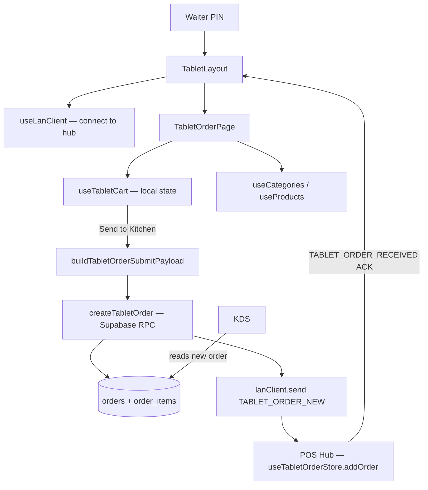

# 17 — Tablet Ordering (Waiter Tablets)

> **Last verified** : 2026-05-13
> **Structure** : ce fichier fusionne la **vue fonctionnelle** (le *pourquoi* et le *quoi* métier) et la **référence technique** (le *comment* implémenté). Pour les tâches à faire, voir [`../../workplan/backlog-by-module/17-tablet-ordering.md`](../../workplan/backlog-by-module/17-tablet-ordering.md).
> **Related E2E flows** : [01-pos-sale-cash](../08-flows-end-to-end/01-pos-sale-cash.md), [08-kds-order-lifecycle](../08-flows-end-to-end/08-kds-order-lifecycle.md).
> **App de rattachement** : POS (sous-app `/tablet/*` — surface tablette dédiée aux serveurs en salle, connectée au hub POS via LAN).

> **En une phrase** : le module Tablet Ordering est l'extension salle du POS de The Breakery — il transforme un serveur en noyau mobile de prise de commande en lui donnant une tablette PIN-authentifiée, connectée en LAN client au hub POS, capable d'envoyer une commande complète en moins de 30 secondes avec ACK du caissier — sans toucher au cash, sans risque de commande perdue, sans devoir faire l'aller-retour au comptoir — pour que le service en salle gagne le tempo qu'il perd dans les boulangeries qui prennent encore les commandes au carnet papier.

---

## Table des matières

- [Partie I — Vue fonctionnelle](#partie-i--vue-fonctionnelle)
  - [1. Raison d'être](#1-raison-dêtre)
  - [2. Les 2 pages du module](#2-les-2-pages-du-module)
  - [3. Les 5 invariants du module](#3-les-5-invariants-du-module)
  - [4. Le PIN d'authentification — La porte serveur](#4-le-pin-dauthentification--la-porte-serveur)
  - [5. Le connecteur LAN — Le cordon ombilical](#5-le-connecteur-lan--le-cordon-ombilical)
  - [6. La prise de commande — TabletOrderPage](#6-la-prise-de-commande--tabletorderpage)
  - [7. L'envoi au POS — Le moment de bascule](#7-lenvoi-au-pos--le-moment-de-bascule)
  - [8. Du côté du POS — La réception](#8-du-côté-du-pos--la-réception)
  - [9. Suivi des commandes — TabletOrdersPage](#9-suivi-des-commandes--tabletorderspage)
  - [10. Sécurité et permissions](#10-sécurité-et-permissions)
  - [11. Mécaniques transverses](#11-mécaniques-transverses)
  - [12. Ce que le module ne fait pas](#12-ce-que-le-module-ne-fait-pas)
  - [13. Utilisateurs cibles](#13-utilisateurs-cibles)
- [Partie II — Référence technique](#partie-ii--référence-technique)
  - [14. Vue d'ensemble technique](#14-vue-densemble-technique)
  - [15. Diagramme de responsabilité](#15-diagramme-de-responsabilité)
  - [16. Tables DB](#16-tables-db)
  - [17. Hooks](#17-hooks)
  - [18. Services](#18-services)
  - [19. Composants UI](#19-composants-ui)
  - [20. Stores](#20-stores)
  - [21. RPCs / Edge Functions](#21-rpcs--edge-functions)
  - [22. RLS / Permissions](#22-rls--permissions)
  - [23. Routes](#23-routes)
  - [24. Flows E2E](#24-flows-e2e)
  - [25. Pitfalls](#25-pitfalls)
- [Partie III — Backlog opérationnel](#partie-iii--backlog-opérationnel)
- [Partie IV — Design & UX](#partie-iv--design--ux)
  - [26. Thèmes et contextes d'affichage](#26-thèmes-et-contextes-daffichage)
  - [27. Écrans du module](#27-écrans-du-module)
  - [28. Layout patterns appliqués](#28-layout-patterns-appliqués)
  - [29. Composants UI signature](#29-composants-ui-signature)
  - [30. États visuels critiques](#30-états-visuels-critiques)
  - [31. Couleurs sémantiques utilisées](#31-couleurs-sémantiques-utilisées)
  - [32. Microcopy et empty states](#32-microcopy-et-empty-states)
  - [33. Références visuelles externes](#33-références-visuelles-externes)
  - [34. À faire côté design (backlog UX)](#34-à-faire-côté-design-backlog-ux)

---

# Partie I — Vue fonctionnelle

## 1. Raison d'être

Le module Tablet Ordering est **l'extension salle de la caisse** de The Breakery. Il répond à une question simple mais structurante quand on sert en salle :

> *"Comment je prends la commande de la table 7 sans devoir faire 4 allers-retours au comptoir avec un carnet papier, et comment je m'assure que la cuisine reçoit la commande au moment où je quitte la table — pas 5 minutes plus tard ?"*

C'est le module qui transforme **un serveur en salle** en **noyau mobile du POS** : il prend la commande directement à la table sur une tablette Android, l'envoie au comptoir caisse via LAN, le caissier valide, la cuisine reçoit, le client est servi. Le tout en quelques secondes au lieu de plusieurs minutes.

Le module est **délibérément simple** côté serveur :

- Pas d'encaissement à la table (le paiement reste au comptoir pour la sécurité cash).
- Pas de gestion de stock complexe.
- Pas de modifier complexe (ajouts simples uniquement).
- Pas de promotion manuelle (l'engine du POS s'en charge à la réception).

Le serveur **saisit** ; le caissier **encaisse** ; la cuisine **prépare**. Trois rôles, un flux.

---

## 2. Les 2 pages du module

| Page | Job-to-be-done |
|---|---|
| **TabletOrderPage** (`/tablet/order`) | Composer une commande à la table — sélection produits, table, envoi au comptoir |
| **TabletOrdersPage** (`/tablet/orders`) | Voir l'historique des commandes envoyées par cette tablette + leur statut (envoyée, payée, annulée) |

Le tout est englobé par **TabletLayout** qui gère l'authentification PIN, la connexion LAN client, et l'écoute des ACKs du hub POS.

---

## 3. Les 5 invariants du module

Quelle que soit la situation, le module garantit toujours :

1. **PIN d'authentification serveur**. Chaque commande est attribuée à un serveur nommé. PIN exigé à l'ouverture de session tablette + relock après inactivité.
2. **LAN client uniquement**. La tablette est un client LAN qui dialogue avec le hub POS. Aucune écriture directe en base — toujours via le hub pour cohérence.
3. **Envoi explicite obligatoire**. Une commande saisie n'arrive **pas** au comptoir tant que le serveur n'a pas tapé "Send to POS". Pas d'envoi auto.
4. **ACK du hub avant confirmation**. Le serveur ne voit "Order sent" qu'après réception de l'accusé du hub POS (canal `TABLET_ORDER_RECEIVED`). Sinon il sait que ça n'est pas passé.
5. **Pas de paiement à la table**. Le serveur ne touche jamais à l'encaissement. La caisse reste **le seul point de contact argent**.

---

## 4. Le PIN d'authentification — La porte serveur

À l'ouverture de la tablette, **PinVerificationModal** s'affiche en plein écran :

- Le serveur tape son PIN à 4 chiffres.
- Vérification via `auth-verify-pin` (Edge Function).
- En cas de succès → la tablette charge le nom du serveur + son ID dans la session.
- Une commande envoyée depuis cette tablette portera **automatiquement** le nom du serveur (`waiterName`, `waiterId`).

Comportement de relock :

- Auto-lock après N minutes d'inactivité (configurable).
- Lock manuel via bouton "Switch waiter" pour passer la tablette à un collègue.
- Pas de session persistante navigateur — quitter et revenir = re-PIN.

Bénéfice métier : **chaque commande est nominative**. Pour les tips, les performances staff, les éventuels litiges, on sait qui a pris la commande.

---

## 5. Le connecteur LAN — Le cordon ombilical

La tablette s'enregistre comme **client LAN** auprès du hub POS dès la connexion :

- `useLanClient` initialise la liaison.
- `deviceType: 'tablet'`, `deviceName: 'Tablet - Made'`.
- **Heartbeat** toutes les 30s → le hub sait que la tablette est en ligne.
- **Statut** affiché en permanence dans le header (Wifi icon vert = connecté, gris = déconnecté).

Si la liaison saute :

- La tablette tente une reconnexion automatique.
- L'envoi de commande est bloqué tant que LAN down (et même chemin Supabase direct pour `createTabletOrder` — cf. Flow B technique).
- Le serveur voit l'alerte "Hors ligne — impossible d'envoyer" et sait qu'il doit attendre.

Bénéfice métier : **transparence sur la liaison**. Le serveur n'envoie jamais "dans le vide" — soit ça marche, soit l'app le dit clairement.

---

## 6. La prise de commande — TabletOrderPage

L'écran de saisie est volontairement **épuré et tactile** :

### 6.1 Layout

- **Sélecteur de table** en haut (table number ou nom client).
- **Grille produits** par catégorie, comme au POS mais simplifiée.
- **Cart latéral ou inférieur** selon orientation tablette.
- **Bouton "Send to POS"** en gros, accessible au pouce.

### 6.2 Fonctionnalités

- **Recherche produit** rapide.
- **Quantités** ajustables (+/−).
- **Modifiers basiques** (sucre, lait, sans X) — mais pas la totalité du modifier engine du POS.
- **Notes spéciales** par item (allergie, préparation).
- **Type de commande** : dine-in (défaut tablette), takeaway possible.
- **Stock indicator** : badge sur les produits en rupture.

### 6.3 Ce qui est *absent* volontairement

- Pas de remise / promotion manuelle.
- Pas de paiement.
- Pas de void d'une commande déjà envoyée (devient la responsabilité du caissier).
- Pas de modifier complexes type combo (combo → renvoyer au comptoir).

Bénéfice métier : **simplicité radicale**. Un serveur saisit une commande complète en 30 secondes — sans menu déroulant, sans dialog secondaire.

---

## 7. L'envoi au POS — Le moment de bascule

Bouton **"Send to POS"** → la commande quitte la tablette :

1. Construction du payload (items, modifiers, notes, table, waiter, total estimatif).
2. `createTabletOrder()` insère les rows `orders` + `order_items` directement dans Supabase (status `pending_payment`).
3. Envoi LAN `TABLET_ORDER_NEW` au hub POS (chemin rapide informationnel).
4. Le hub POS :
   - Reçoit la commande, l'ajoute au `tabletOrderStore` côté caisse.
   - Notifie le caissier via `TabletOrdersPanel` (modal POS).
   - Renvoie un ACK `TABLET_ORDER_RECEIVED` avec status `'received'`.
5. La tablette reçoit l'ACK → toast "Order #123 confirmed by POS".
6. Le cart se vide → prêt pour la prochaine table.

Si erreur (LAN down après insert) :

- Le hub côté caisse réconcilie via Realtime sur `orders` (filter `created_via='tablet' AND status='pending_payment'`).
- Pas de double-listing grâce au dedup par `orderId`.
- Toast côté tablette : "POS unreachable, order saved to cloud".

Bénéfice métier : **garantie de réception**. Pas de commande perdue dans le tuyau — l'ACK est la confirmation explicite, et le fallback Realtime garantit la livraison même si le LAN flanche.

---

## 8. Du côté du POS — La réception

Quand une commande tablette arrive au comptoir, le caissier en est notifié dans **`TabletOrdersPanel`** :

- Badge avec compteur d'unread.
- Liste des commandes reçues : table, serveur, items, montant estimatif, heure de réception.
- Trois actions par commande :
  - **Accept** → la commande passe dans le cart POS du caissier qui peut la finaliser (encaisser ou la basculer en ardoise).
  - **Reject** → la commande est annulée, message renvoyé au serveur.
  - **Hold** → en attente d'une décision.

Pendant cette phase, la commande est en statut `pending_payment` côté tablet store. Une fois encaissée au POS, le hub renvoie un message à la tablette → la commande passe en `paid`.

Bénéfice métier : **fluidité du flux salle-caisse**. La caisse maîtrise quand traiter une commande tablette ; le serveur en salle voit en direct quand elle est validée.

---

## 9. Suivi des commandes — TabletOrdersPage

Page accessible depuis le menu tablette : la **liste des commandes envoyées** depuis cette tablette ce jour.

Affiche pour chaque commande :

- Numéro, table, items résumés, total.
- Heure d'envoi.
- Statut : `pending_payment` (en attente caisse), `paid` (validée), `cancelled` (rejetée).
- Badge coloré (orange / vert / rouge).

Limites :

- Historique limité à **50 dernières commandes** (`MAX_INCOMING_ORDERS`).
- Pas de drill-down détaillé (la fiche commande complète reste côté POS).
- Pas d'export.

Bénéfice métier : **mémoire courte mais suffisante** pour le service en cours. Un serveur qui sert 30 tables en service voit toutes ses commandes du jour.

---

## 10. Sécurité et permissions

Le module hérite des règles globales :

- **Permission `sales.create`** — exigée pour insérer les rows `orders`/`order_items` (RLS Supabase). Le rôle waiter a typiquement `sales.create` + `sales.view` mais pas `sales.void`, `sales.discount`, `payments.process`.
- **Toutes les commandes tracées** côté audit (qui a saisi quoi à quelle heure, `waiter_id` + `created_via='tablet'`).
- **PIN serveur obligatoire** — pas d'usage anonyme. PIN stocké en `user_profiles.pin_hash` (bcrypt) vérifié via `auth-verify-pin` Edge Function.
- **PIN manager** requis pour des actions sensibles (mais peu de telles actions existent côté tablette par design).

Pas de permission d'écriture supplémentaire — toute action passe par RLS Supabase + cohérence côté hub POS qui valide les permissions du caissier qui traite.

Bénéfice métier : **sécurité cohérente avec le POS**. La tablette n'ouvre pas de nouvelle surface de fraude — elle reste un client soumis au contrôle central.

---

## 11. Mécaniques transverses

| Module | Relation |
|---|---|
| **POS** | Récepteur des commandes tablette via `TabletOrdersPanel` et `useTabletOrderReceiver`. |
| **Products** | Catalogue partagé (lecture seule, filtré sur `product_type === 'finished'`). |
| **LAN** | Client LAN avec heartbeat, fallback Realtime via Supabase. |
| **Customers** | Possibilité de lier un client à la commande tablette (recherche simple). |
| **KDS** | Indirect — la commande tablette accepted au POS suit le flux normal (envoi cuisine, statuts). |
| **Settings** | Pas de réglage dédié pour l'instant — `POS Configuration` couvre indirectement. |

---

## 12. Ce que le module ne fait pas

- La tablette **ne fait pas de paiement**. Choix de sécurité — l'argent reste au comptoir.
- La tablette **ne supporte pas le modifier engine complet** du POS. Modifiers basiques uniquement.
- La tablette **ne crée pas de client**. Pour ajouter un nouveau client, le serveur passe par le caissier.
- La tablette **ne gère pas les combos avec sélection multi-groupes**. Un combo nécessite le `ComboSelectorModal` du POS — la tablette renvoie au comptoir.
- La tablette **ne supporte pas l'offline complet**. Si LAN down, le chemin Supabase direct fonctionne ; mais sans cloud, envoi bloqué et pas de queue locale.
- La tablette **ne déclenche pas l'envoi cuisine elle-même**. C'est le caissier qui décide quand envoyer en cuisine (souvent à l'acceptation).
- La tablette **ne consulte pas le KDS** ni les stocks détaillés — juste l'indicateur "rupture" sur les produits.

---

## 13. Utilisateurs cibles

| Rôle | Ce qu'il fait dans le module |
|---|---|
| **Serveur de salle** | Prend les commandes table par table, envoie au POS, suit l'historique du service. |
| **Caissier** | Reçoit les commandes tablette dans `TabletOrdersPanel`, accepte/rejette/hold, encaisse au moment du paiement. |
| **Manager** | Surveille la connexion LAN, configure les PIN, audite les commandes nominatives. |

---

# Partie II — Référence technique

## 14. Vue d'ensemble technique

Touch-optimised order capture for floor staff. Each tablet runs as a LAN client connected to the POS hub, drafts orders independently, and pushes them to the kitchen via the hub.

The Tablet module gives waiters a dedicated, lightweight order-taking surface that complements the main POS:

- Lives at `/tablet/order` and `/tablet/orders`, behind a layout (`TabletLayout`) that handles PIN auth + LAN connection.
- Uses a **separate cart implementation** (`useTabletCart`) — *not* the full `useCartStore`. No locked items, no promotions engine, no customer pricing tiers, no split payments — just product + quantity + modifiers + notes.
- Sends finalised orders to the cashier (`POS hub`) via Supabase RPC + a LAN `TABLET_ORDER_NEW` notification — the cashier collects payment.
- Tracks the order lifecycle locally (`tabletOrderStore`) so multiple tablets don't double-fire the same table.

Designed for landscape Android tablets (10–12") in kiosk mode (Capacitor), but works in any modern browser on tablet-class devices.

---

## 15. Diagramme de responsabilité



---

## 16. Tables DB

The tablet module reuses the standard sales tables — no dedicated schema:

| Table              | Rôle                                                    | Tablet-specific columns                              |
| ------------------ | ------------------------------------------------------- | ---------------------------------------------------- |
| `orders`           | Header row — created with `status='pending_payment'`    | `created_via='tablet'`, `waiter_id`, `table_number`  |
| `order_items`      | Line items                                              | Standard                                             |
| `lan_nodes`        | Tablet device presence (heartbeat 30 s)                 | `device_type='tablet'`                               |
| `device_configurations` | Persistent per-tablet config (name, station map)   | Optional                                             |

Order is **not paid at tablet time** — payment occurs at the cashier when the customer is ready.

---

## 17. Hooks

| Hook                  | Path                                          | Rôle                                                    |
| --------------------- | --------------------------------------------- | ------------------------------------------------------- |
| `useTabletCart`       | `src/hooks/tablet/useTabletCart.ts`           | Local cart state — items, quantity, table, order type   |
| `useLanClient`        | `src/hooks/lan/useLanClient.ts`               | LAN connection (auto-connect, status, reconnect)        |
| `useProducts`         | `src/hooks/products/useProducts.ts`           | Product catalogue (filtered by category)                |
| `useCategories`       | `src/hooks/products/useCategories.ts`         | Category list                                           |
| `useAuthStore`        | `src/stores/authStore.ts`                     | Waiter identity (display_name, id)                      |
| `useTabletOrderStore` | `src/stores/tabletOrderStore.ts`              | **Hub-side** — incoming-order tracker for the cashier   |

`useTabletCart` returns: `{ items, tableNumber, orderType, itemCount, subtotal, total, addItem, removeItem, updateQuantity, setTableNumber, setOrderType, clearCart }`. Designed for ≤ 50 line items (no virtualization). Item dedup keys on `productId` if no modifiers/notes are present.

---

## 18. Services

| Service                                        | Rôle                                                                            |
| ---------------------------------------------- | ------------------------------------------------------------------------------- |
| `src/services/pos/tabletOrderService.ts`       | `buildTabletOrderSubmitPayload(cart, waiter, device)` + `createTabletOrder()` (Supabase insert into `orders` + `order_items`) |
| `src/services/pos/dispatchStationResolver.ts`  | `batchGetDispatchStationsForProductIds(ids)` — maps each product to its KDS station so the kitchen can route correctly |
| `src/services/lan/lanClient.ts`                | Sends `TABLET_ORDER_NEW`, listens for `TABLET_ORDER_RECEIVED` ACK               |
| `src/services/lan/lanProtocol.ts`              | `LAN_MESSAGE_TYPES.TABLET_ORDER_NEW` / `.TABLET_ORDER_RECEIVED`                 |

---

## 19. Composants UI

| Composant            | Path                                       | Rôle                                                           |
| -------------------- | ------------------------------------------ | -------------------------------------------------------------- |
| `TabletLayout`       | `src/pages/tablet/TabletLayout.tsx`        | PIN gate, LAN connection, header (Wifi indicator), bottom tabs |
| `TabletOrderPage`    | `src/pages/tablet/TabletOrderPage.tsx`     | Main order capture: category nav + product grid + cart panel   |
| `TabletOrdersPage`   | `src/pages/tablet/TabletOrdersPage.tsx`    | Sent-orders history with status (pending_payment / paid)       |
| `PinVerificationModal` | `src/components/pos/modals/PinVerificationModal.tsx` | Reused for waiter PIN entry                                |

Layout pattern (TabletOrderPage):

- **Left rail** — category list (vertical, scrollable, large touch targets ≥ 56 px)
- **Center** — product grid (3–4 columns), search bar at top
- **Right panel** — cart, table selector, order-type toggle (`dine_in` | `takeaway`), "Send to Kitchen" CTA

No `tablet/` directory under `src/components/` — all layout lives in the page file. Reused primitives come from `src/components/ui/` (Button, Card, Skeleton).

---

## 20. Stores

### `useTabletCart` — local hook state, *not* a Zustand store

Per-page React state (created at page mount, destroyed on navigation). Intentional: the waiter's cart is ephemeral and tied to a single in-progress order.

### `useTabletOrderStore` — POS-hub side (`src/stores/tabletOrderStore.ts`)

Lives on the **cashier's POS**, not on the tablet. Tracks incoming orders coming from any tablet so the cashier knows what's pending payment.

Shape:

```ts
{
  incomingOrders: ITabletOrderEntry[],   // capped at 50
  unreadCount: number,
  addOrder(entry): void,                 // dedup by orderId
  markPaid(orderId): void,
  markCancelled(orderId): void,
  clearUnread(): void,
  removeOrder(orderId): void,
}
```

Populated by:

1. Supabase Realtime subscription on `orders` (filter `created_via='tablet' AND status='pending_payment'`)
2. LAN `TABLET_ORDER_NEW` message (faster path on LAN)

The dedup in `addOrder()` ensures both paths arriving for the same order don't double-list.

---

## 21. RPCs / Edge Functions

No dedicated Edge Function for tablet. Order creation goes through standard channels:

- `createTabletOrder()` performs `INSERT INTO orders + order_items` in a single Supabase request (auto-numbered via DB trigger).
- Permissions enforced by RLS on `orders` (`sales.create`).
- The `complete_order_with_payments` RPC is called later by the **cashier** (not the tablet) when the customer pays.

---

## 22. RLS / Permissions

| Table          | Tablet operation         | Required permission |
| -------------- | ------------------------ | ------------------- |
| `orders`       | INSERT (draft order)     | `sales.create`      |
| `order_items`  | INSERT                   | `sales.create`      |
| `products`     | SELECT (catalogue)       | `is_authenticated()` |
| `categories`   | SELECT                   | `is_authenticated()` |

The tablet user is typically a `waiter` role that has `sales.create` and `sales.view` but not `sales.void`, `sales.discount`, or `payments.process`. PINs are stored in `user_profiles.pin_hash` (bcrypt) and verified through the standard `auth-verify-pin` Edge Function.

---

## 23. Routes

| Route             | Component          | Guard            |
| ----------------- | ------------------ | ---------------- |
| `/tablet`         | `TabletLayout`     | `POSAccessGuard` + in-layout PIN gate |
| `/tablet/order`   | `TabletOrderPage`  | (inherited)      |
| `/tablet/orders`  | `TabletOrdersPage` | (inherited)      |

Defined in `src/routes/posRoutes.tsx`. Wrapped in `ModuleErrorBoundary moduleName="Tablet"`. The layout itself enforces PIN-on-mount via `PinVerificationModal`.

---

## 24. Flows E2E

### Flow A — Take an order

1. Waiter opens `/tablet/order` on the tablet
2. `TabletLayout` mounts → `useLanClient({ deviceType: 'tablet', autoConnect: true })` connects to hub
3. PIN modal appears → waiter enters PIN → `auth-verify-pin` Edge Function validates → `setIsAuthenticated(true)`
4. Waiter selects table number + order type (`dine_in`)
5. Waiter taps products → `useTabletCart.addItem()` accumulates lines
6. Waiter taps "Send to Kitchen":
   - `buildTabletOrderSubmitPayload()` assembles the payload (waiter id, items, dispatch station per item)
   - `createTabletOrder()` inserts `orders` + `order_items` rows in Supabase
   - `lanClient.send(TABLET_ORDER_NEW, { orderId, orderNumber, ... })` notifies the hub
7. Hub-side `useTabletOrderStore.addOrder()` puts the order in the cashier's "incoming" panel
8. Cashier sees badge increment, can preview order, marks as paid when customer pays
9. Hub sends `TABLET_ORDER_RECEIVED` ACK → tablet shows toast "Order #123 confirmed by POS"
10. KDS polls/subscribes to `orders` and starts preparing line items routed to its station

### Flow B — Hub disconnect during send

1. Tablet attempts `createTabletOrder()` while LAN hub is offline
2. Supabase insert succeeds (cloud reachable independently of LAN)
3. `lanClient.send()` throws → caught, toast "POS unreachable, order saved to cloud"
4. Hub-side Realtime subscription on `orders` fires when reachable → `addOrder()` reconciles
5. No duplicate (dedup by `orderId`)

### Flow C — Status follow-up

1. KDS marks an item ready → `broadcastOrderStatus(orderId, 'ready')`
2. Tablet's `lanClient.on(ORDER_STATUS, …)` triggers a toast "Table 5 — order ready"
3. Waiter retrieves the dish

---

## 25. Pitfalls

- **Two cart implementations**: `useTabletCart` (tablet) and `useCartStore` (POS) are intentionally distinct. Do not import `cartStore` into the tablet pages — its locked-item / promotion / split-payment logic does not apply and will pull in heavy dependencies.
- **Hub vs cloud separation**: order creation goes to **Supabase first**, LAN message is *informational*. If you reverse the order ("send via LAN, then DB"), you risk losing orders when the hub is offline. Keep the current order: DB insert, then notify.
- **`waiterName` on `TabletLayout` mount**: derived from `useAuthStore().user`. If a different waiter wants to use the tablet, they must explicitly logout (full app logout, not the in-layout PIN re-prompt) — the PIN modal alone does not switch identities.
- **Product type filter**: `TabletOrderPage` filters `p.product_type === 'finished'` — raw materials and intermediates are hidden. If you add a new product type for tablet use, update this filter.
- **Item dedup edge case**: `addItem()` merges the new line into an existing one only if neither has modifiers/notes. A product with notes always becomes a new line, even if identical text — by design (each note represents a discrete customer request).
- **No PIN re-verify on idle**: unlike `/pos`, the tablet does not auto-lock on session timeout. If the bakery requires it, wire up `useSessionTimeout` from `src/hooks/auth/`.
- **Concurrent table assignment**: nothing prevents two tablets from drafting an order on the same table number — first one to "Send to Kitchen" wins. If table-locking is desired, add a `table_locks` table or use Supabase Realtime presence.
- **Capacitor keyboard overlap**: when running native, the on-screen keyboard can hide the cart panel. `capacitor.config.ts` sets `Keyboard.resize: 'body'` to mitigate; if issues persist, scroll-into-view the focused input.

---

# Partie III — Backlog opérationnel

Pour les tâches techniques à exécuter (queue offline avec sync, auto-send cuisine optionnel, modifier engine complet, combos sélectionnables, création de client à la table, pre-bill, notifications KDS→tablet, photos plats, mode menu client), voir :

→ [`../../workplan/backlog-by-module/17-tablet-ordering.md`](../../workplan/backlog-by-module/17-tablet-ordering.md)

---

# Partie IV — Design & UX

> **Source canonique** : [`../../DESIGN_POS_AND_BACKOFFICE.md`](../../DESIGN_POS_AND_BACKOFFICE.md) §3.7 (Tablet Ordering) + §3 (POS dark theme parent).
> **Tokens techniques** : [`../../../DESIGN.md`](../../../DESIGN.md).
> **Screenshots de référence** : [`../../ux/assets/screens/`](../../ux/assets/screens/).

## 26. Thèmes et contextes d'affichage

Le module Tablet vit **exclusivement** dans l'app POS (variante salle), donc un seul thème :

| Contexte | Thème CSS | Pages concernées | Identité |
|---|---|---|---|
| **Tablet Ordering** | `.theme-pos` (noir profond `#0C0C0E`) | `/tablet`, `/tablet/order`, `/tablet/orders` | Layout simplifié vs POS principal, optimisé tactile landscape Android |

**Constante de marque** : l'or `#C9A55C` pour le bouton "Send to POS" (le geste primaire absolu côté tablette) + branding header.

**Spécificités tablette vs POS classique** :

- Pas de modale de paiement (le serveur ne paye pas).
- Pas de sidebar back-office.
- Cibles tactiles ≥56px (vs 48px POS classique) car prise en marche avec une main.
- PIN gate en plein écran à l'ouverture.
- Indicateur LAN persistant dans le header.

---

## 27. Écrans du module

| Route | Type d'écran | Densité | Composants signature |
|---|---|---|---|
| `/tablet` (layout) | Layout PIN-gated + header LAN | Faible | `TabletLayout`, `PinVerificationModal`, Wifi indicator |
| `/tablet/order` | Prise de commande tactile | Moyenne | Left rail catégories, product grid 3-4 cols, right panel cart + table selector + "Send to POS" |
| `/tablet/orders` | Historique 50 dernières | Moyenne | Liste avec status badges (pending_payment / paid / cancelled) |

---

## 28. Layout patterns appliqués

### 28.1 TabletLayout — La porte d'entrée

Pattern entrée plein écran + persistent shell (cf. [`../../DESIGN_POS_AND_BACKOFFICE.md`](../../DESIGN_POS_AND_BACKOFFICE.md) §3.7) :

- **PinVerificationModal** plein écran au mount, PIN à 4 chiffres avec numpad virtuel grand format.
- Une fois auth → header sticky en haut :
  - Logo Breakery à gauche + nom serveur ("Tablet - Made").
  - **Indicateur Wifi** au centre (vert si LAN OK, gris si déconnecté, animation de reconnexion).
  - Bouton "Switch waiter" + bouton logout à droite.
- **Bottom tabs** : "Order" (TabletOrderPage) + "History" (TabletOrdersPage).

### 28.2 TabletOrderPage — La prise de commande

Pattern 3 colonnes landscape (cf. §3.7) :

- **Left rail (~15%)** : liste catégories verticale, scrollable, items ≥56px, catégorie active en or.
- **Center (~55%)** : product grid 3-4 cols selon viewport :
  - Search bar en haut.
  - Cards 280×280 avec photo + nom + prix.
  - Badge "SOLD OUT" si stock épuisé.
- **Right panel (~30%)** : cart + table selector + order-type toggle :
  - **Table selector** en haut : input number ou autocomplete table.
  - **Order type toggle** : Dine-in / Takeaway (chips, dine-in actif par défaut).
  - **Liste items cart** : quantité préfixe, nom, modifiers, prix monospace, boutons −/+/trash.
  - **Add note** par item (icône tag → modal note).
  - **Subtotal / Total** en bas en gros.
  - **Bouton "Send to POS"** or massif full-width — le geste primaire absolu.

### 28.3 TabletOrdersPage — Historique

Pattern liste simple :

- **Header** : titre "My Orders Today" + compteur.
- **Liste cards** par commande :
  - Numéro + table + heure d'envoi à gauche.
  - Items résumés (3 premiers + "…+2 more").
  - Total à droite.
  - Badge status (orange `pending_payment` / vert `paid` / rouge `cancelled`).
- **Empty state** si pas de commandes ce jour.

---

## 29. Composants UI signature

| Composant | Type | Usage | Style clé |
|---|---|---|---|
| `TabletLayout` | Shell | Persistent header + bottom tabs | LAN indicator + waiter identity |
| `PinVerificationModal` | Modal plein écran | Auth | Numpad virtuel 4-digit, retry on fail |
| `TabletOrderPage` 3-cols | Layout | Prise commande | Touch targets ≥56px, gold "Send to POS" CTA |
| `TabletOrdersPage` cards | Liste | Historique | Status badges colorés, dernières 50 |
| `TabletOrdersPanel` (côté POS) | Panel reçu | Modal POS cashier | Badge unread, actions Accept/Reject/Hold |

---

## 30. États visuels critiques

| État | Visuel | Pourquoi |
|---|---|---|
| **PIN locked** | Modal plein écran avec numpad XL et logo Breakery dominant | Empêche tout usage anonyme |
| **LAN connected** | Icône Wifi `#34D399` (vert), tooltip "Connected to POS hub" | Serveur sait que l'envoi est possible |
| **LAN disconnected** | Icône Wifi grise + tooltip "Disconnected — orders will sync on reconnect via cloud" | Transparence sur l'état du lien |
| **LAN reconnecting** | Icône Wifi avec animation pulse jaune | En cours de récup |
| **Sending order** | Bouton "Send to POS" → spinner + texte "Sending…" | Feedback action |
| **Order sent OK** | Toast vert "Order #4315 confirmed by POS" + cart vidé + retour grille | Confirmation explicite |
| **Order sent error** | Toast rouge "POS unreachable, order saved to cloud" + cart conservé | Pas de perte de saisie |
| **Product out of stock** | Badge "SOLD OUT" diagonal gris translucide sur card produit | Empêche la saisie d'un produit indisponible |
| **Status `pending_payment`** | Badge orange dans `/tablet/orders` | Caissier doit encore valider |
| **Status `paid`** | Badge vert dans `/tablet/orders` | Commande finalisée |
| **Status `cancelled`** | Badge rouge dans `/tablet/orders` | Caissier a rejeté |
| **Order ready (KDS notification)** | Toast "Table 5 — order ready" + bip discret | Serveur va chercher le plat |

---

## 31. Couleurs sémantiques utilisées

| Rôle | POS (dark) | Usage Tablet |
|---|---|---|
| **Success** | `#34D399` | LAN connected, status `paid`, toast envoi OK |
| **Warning** | `#FBBF24` | LAN reconnecting, status `pending_payment` |
| **Error** | `#F87171` | LAN disconnected, status `cancelled`, toast envoi erreur |
| **Info** | `#60A5FA` | Notifications KDS "ready" |
| **Gold** | `#C9A55C` | Bouton "Send to POS", branding header, catégorie active |

---

## 32. Microcopy et empty states

### Empty states (EN)

| Page | Texte | CTA |
|---|---|---|
| `/tablet/order` (no items in cart) | "Tap products to start the order" + icône `ShoppingBag` grise | — |
| `/tablet/orders` (no orders today) | "No orders yet today — your sent orders will appear here" + icône `ClipboardList` grise | "Take an order" → `/tablet/order` |
| PIN modal | "Enter your PIN to start" | — |
| LAN disconnected during compose | "Connection lost — orders saved locally will sync when reconnected" | — |

### Confirmations destructives (EN)

- **Clear cart** : "Clear all items from cart? This cannot be undone." + bouton "Clear" rouge.
- **Logout** : "Switch waiter? Any unsent order will be lost." + bouton "Switch" or.
- **Cancel send** (during in-flight) : non-applicable — le send est atomique.

### Toast notifications (EN)

- Order sent OK: "Order #4315 confirmed by POS"
- LAN disconnect during send: "POS unreachable, order saved to cloud — will reconcile"
- LAN reconnect: "Connection restored"
- Order paid (from POS): "Order #4315 paid — Table 5"
- Order cancelled (from POS): "Order #4315 rejected by cashier"
- KDS ready: "Table 5 — order ready"
- PIN error: "Wrong PIN — try again"

---

## 33. Références visuelles externes

| Ressource | Chemin / lien |
|---|---|
| Design doc complet (POS + Backoffice) — Tablet §3.7 | [`../../DESIGN_POS_AND_BACKOFFICE.md`](../../DESIGN_POS_AND_BACKOFFICE.md) |
| Tokens canoniques V2 | [`../../../DESIGN.md`](../../../DESIGN.md) à la racine |
| Inventaire tokens V2 | [`../../ux/v2-token-inventory.md`](../../ux/v2-token-inventory.md) |
| Screenshots POS de référence | [`../../ux/assets/screens/caissapp/v2-reference/`](../../ux/assets/screens/caissapp/v2-reference/) |
| Design system feature components | [`../02-design-system/04-feature-components.md`](../02-design-system/04-feature-components.md) |
| Module POS (cart parent) | [`./02-pos-cart-orders.md`](./02-pos-cart-orders.md) |
| Module KDS (consommateur en aval) | [`./04-kds-kitchen.md`](./04-kds-kitchen.md) |
| LAN architecture | [`../06-lan-architecture/`](../06-lan-architecture/) |

---

## 34. À faire côté design (backlog UX)

| Priorité | Évolution UX | Bénéfice |
|---|---|---|
| Critical | **Queue offline UI** : badge "X orders queued — will sync on reconnect" + liste consultable | Permet la saisie sans LAN, sync au retour |
| Critical | **Toggle "Auto-send to kitchen"** : switch dans header pour bypass acceptation caissier | Service rapide direct sans intervention comptoir |
| High | **Modifier engine complet** : modal modifiers avec toutes les options du POS | Cas configurations complexes refusés actuellement |
| High | **Combos sélectionnables** : `ComboSelectorModal` complet sur tablette | Composer un combo sans renvoyer au comptoir |
| High | **Création de client à la table** : modal "New customer" simple (nom + téléphone) | Fidéliser dès la salle |
| Medium | **Pre-bill à la table** : impression note sans encaissement (Bluetooth printer) | Le client voit son addition avant le paiement |
| Medium | **Notifications push KDS → tablet** | Serveur reçoit "Table 7 ready" sans regarder le KDS |
| Medium | **Auto-lock on idle** : timer configurable | Sécurité similaire au POS |
| Low | **Photos haute qualité** + descriptions détaillées | Aide suggestion au client |
| Low | **Mode "menu client"** : tablette tendue au client, lecture seule + sélection autorisée | Style fast-casual |
