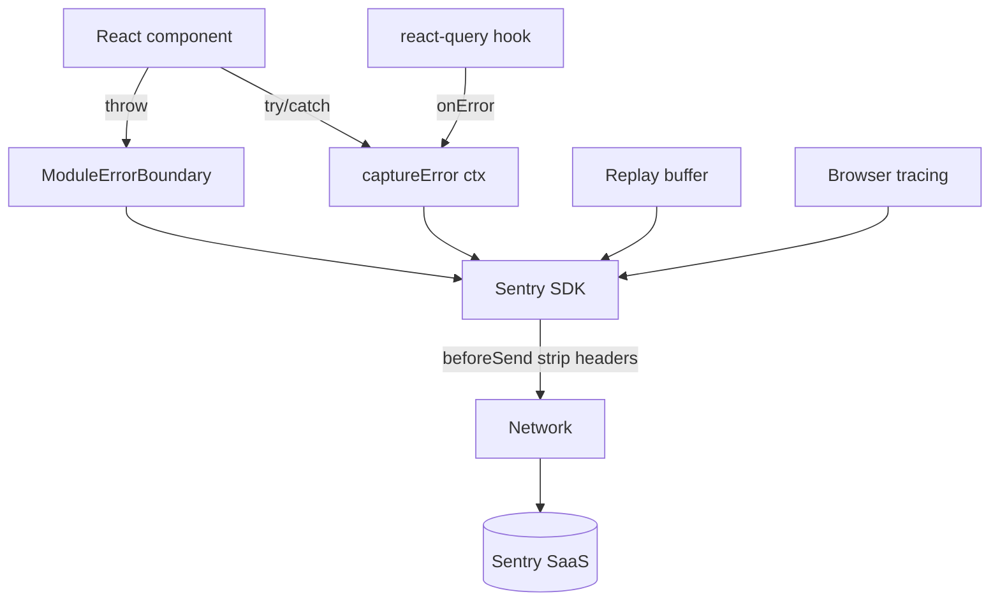

# 03 — Sentry Monitoring

> **Last verified**: 2026-05-03

Sentry is the only error/performance monitoring layer in V2. It is **production-only** — disabled in `npm run dev` to avoid noise and PII exposure during local work.

## Project metadata

| Property | Value |
|----------|-------|
| Org | `the-breakery` |
| Project | `appgrav-v2` |
| Dashboard | https://the-breakery.sentry.io/ |
| SDK | `@sentry/react@^10.47.0` |
| Vite plugin | `@sentry/vite-plugin@^5.2.0` |
| Init module | `src/lib/sentry.ts` |

## Activation rules

```ts
const SENTRY_DSN = import.meta.env.VITE_SENTRY_DSN
const IS_PRODUCTION = import.meta.env.PROD

if (sentryEnabled || !SENTRY_DSN || !IS_PRODUCTION) {
  if (!SENTRY_DSN && IS_PRODUCTION) {
    console.warn('[Sentry] VITE_SENTRY_DSN not set — error monitoring is disabled')
  }
  return
}
```

| Condition | Behaviour |
|-----------|-----------|
| Dev (`vite`) | Sentry **off** unconditionally |
| Prod build, DSN missing | Sentry off, console warning emitted |
| Prod build, DSN set | Sentry initialised, sourcemaps uploaded |
| `initSentry()` called twice | Second call is a no-op (`sentryEnabled` flag) |

## Init configuration

Full config from `src/lib/sentry.ts`:

```ts
Sentry.init({
  dsn: SENTRY_DSN,
  environment: IS_PRODUCTION ? 'production' : 'development',
  release: APP_VERSION ? `appgrav-v2@${APP_VERSION}` : undefined,
  tracesSampleRate: IS_PRODUCTION ? 0.2 : 1.0,
  tracePropagationTargets: ['localhost', /^https:\/\/abjabuniwkqpfsenxljp\.supabase\.co/],
  replaysSessionSampleRate: 0.1,
  replaysOnErrorSampleRate: 1.0,
  integrations: [
    Sentry.reactRouterV6BrowserTracingIntegration({ /* router refs */ }),
    Sentry.replayIntegration({ maskAllText: true, blockAllMedia: true }),
  ],
  ignoreErrors: [
    'ResizeObserver loop',
    'ResizeObserver loop completed with undelivered notifications',
    'Failed to fetch',
    'NetworkError',
    'Load failed',
    'JWT expired',
    'Auth session missing',
  ],
  beforeSend(event) { /* strip auth headers from breadcrumbs */ return event }
})
```

| Setting | Value | Why |
|---------|-------|-----|
| `tracesSampleRate` | 0.2 in prod | 20% of transactions — enough for signal at low cost |
| `replaysSessionSampleRate` | 0.1 | 10% of sessions for general UX baselines |
| `replaysOnErrorSampleRate` | 1.0 | 100% replay capture when an error fires |
| `tracePropagationTargets` | Supabase URL + localhost | Distributed traces span Supabase Edge Functions |
| `maskAllText` / `blockAllMedia` | true / true | Replays scrub PII (PIN entry, customer names) |

## Sourcemaps

The Vite plugin uploads sourcemaps at build time so production stack traces are deminified in the dashboard.

```ts
// vite.config.ts
sentryVitePlugin({
  authToken: process.env.SENTRY_AUTH_TOKEN,
  org: 'the-breakery',
  project: 'appgrav-v2',
  reactComponentAnnotation: { enabled: true },
}),
```

```ts
// vite.config.ts → build
sourcemap: 'hidden', // generated, uploaded to Sentry, NOT served publicly
```

| Variable | Where set | Notes |
|----------|-----------|-------|
| `VITE_SENTRY_DSN` | `.env`, Vercel | Embedded in bundle (public DSN — safe) |
| `SENTRY_AUTH_TOKEN` | `.env`, Vercel build env | **Build-time only**; never in bundle |
| `VITE_APP_VERSION` | CI/CD (optional) | Tags releases as `appgrav-v2@<version>` |

`reactComponentAnnotation: { enabled: true }` injects component-name attributes so Sentry's Issues page shows the React component a click happened on.

## Public API (`src/lib/sentry.ts`)

| Export | Signature | When to call |
|--------|-----------|--------------|
| `initSentry()` | `() => void` | Once at app boot (`src/main.tsx`) |
| `setSentryUser(user)` | `({ id, email?, role? } \| null) => void` | After PIN sign-in / sign-out |
| `captureError(err, ctx?)` | `(Error, Record?) => void` | Inside `try/catch` blocks where you want extra context |
| `addBreadcrumb(msg, category, data?)` | `(string, string, Record?) => void` | Annotate user steps before an error |
| `sentryEnabled` | `boolean` | Read-only flag for conditional code paths |

### User context discipline

```ts
setSentryUser({ id: user.id, role: user.role }) // never email
```

`setSentryUser` deliberately drops `email` even though the type allows it — only the role is forwarded. This matches the GDPR-light posture documented in `07-security/`.

### Captured-error pattern

```ts
try {
  await processPayment(order)
} catch (err) {
  captureError(err as Error, { order_id: order.id, payment_method: 'cash' })
  toast.error('Payment failed — please retry')
}
```

## Filtered errors

The `ignoreErrors` list silences three categories of known-noisy errors:

| Pattern | Reason |
|---------|--------|
| `ResizeObserver loop` (×2) | Browser quirk, harmless |
| `Failed to fetch`, `NetworkError`, `Load failed` | Already retried by react-query — Sentry would double-count |
| `JWT expired`, `Auth session missing` | Expected behaviour — handled by `useSessionTimeout` |

If you add a new ignored pattern, also add a comment explaining why.

## PII scrubbing — `beforeSend`

```ts
beforeSend(event) {
  if (event.breadcrumbs) {
    event.breadcrumbs = event.breadcrumbs.map((b) => {
      if (b.category === 'xhr' || b.category === 'fetch') {
        if (b.data?.['headers']) delete b.data['headers']
      }
      return b
    })
  }
  return event
}
```

This deletes `Authorization`, `apikey`, `x-session-token`, and `x-supabase-*` headers from breadcrumbs before they leave the browser. PIN values themselves are masked by the replay integration (`maskAllText: true`).

## ErrorBoundary integration

Each module wraps its routes in `<ModuleErrorBoundary>`, which calls `Sentry.captureException` and shows a recovery UI. The default `Sentry.ErrorBoundary` is **not** used directly — V2 uses a custom wrapper to keep the recovery action consistent across modules. See `01-architecture/03-error-handling.md`.

## Distributed tracing

`tracePropagationTargets` includes the Supabase project URL. When the React app calls a Supabase Edge Function, Sentry attaches `sentry-trace` and `baggage` headers, and `cors.ts` whitelists them:

```ts
// supabase/functions/_shared/cors.ts
'Access-Control-Allow-Headers': '..., baggage, sentry-trace'
```

Result: a single Sentry transaction spans browser → Edge Function → Postgres.

## Replay privacy

| Setting | Value |
|---------|-------|
| `maskAllText` | true (every text node masked by default) |
| `blockAllMedia` | true (no images / video sent) |
| Sample rate | 10% baseline, 100% on error |
| Retention | 30 days (Sentry default tier) |

Manual unmasking (e.g. for a debug-only widget) is achieved with the `data-sentry-unmask` attribute. There are **zero** unmasked elements in V2 today.

## Diagram — error capture pipeline



## Operational notes

- **Releases**: tag a release in Sentry by setting `VITE_APP_VERSION=<git-sha>` at build time; the SDK derives `release: appgrav-v2@<sha>`.
- **Quotas**: project is on the team plan; replays are the most expensive line. Bump `replaysSessionSampleRate` only after checking quota.
- **Local debugging**: set `VITE_SENTRY_DSN` in `.env.local` and build for prod (`npm run build && npm run preview`) to test capture.

## Cross-references

- Build pipeline: `10-deployment-ops/02-vite-build.md`
- ErrorBoundary pattern: `01-architecture/03-error-handling.md`
- Auth user context: `07-security/01-authentication.md`
