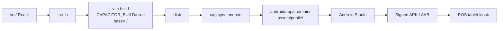

# 04 — Capacitor Native Builds

> **Last verified**: 2026-05-03

Capacitor wraps the Vite SPA so it can ship as a native Android (and iOS, untested in prod) application — primarily for kiosk-mode POS tablets. The web build (`npm run build`) and the Capacitor build share the same `dist/` artifact but with different base paths and different plugin behaviour.

## App identity

| Property | Value |
|----------|-------|
| `appId` | `com.thebreakery.appgrav` |
| `appName` | `The Breakery POS` |
| `webDir` | `dist` |
| `androidScheme` | `https` (no cleartext in prod) |
| `cleartext` | `false` |
| `allowMixedContent` | `false` (Android) |
| `captureInput` | `true` (intercepts hardware keyboard for POS) |
| `webContentsDebuggingEnabled` | `false` (true only in dev branches) |

Source: `capacitor.config.ts`.

## Installed plugins

| Plugin | Version | Purpose |
|--------|---------|---------|
| `@capacitor/core` | `^7.5.0` | Runtime bridge |
| `@capacitor/cli` | `^7.5.0` | Build / sync tooling |
| `@capacitor/android` | `^7.5.0` | Android platform |
| `@capacitor/ios` | `^7.5.0` | iOS platform (installed, not actively shipped) |
| `@capacitor/app` | `^7.1.2` | App lifecycle, back-button handling |
| `@capacitor/keyboard` | `^7.0.4` | Keyboard show/hide events, dark style |
| `@capacitor/splash-screen` | `^7.0.5` | Programmatic splash hide |
| `@capacitor/status-bar` | `^7.0.5` | Status bar style + colour |
| `@capacitor/assets` (dev) | `^3.0.5` | Generates Android icons + splashes from a single source |

## Plugin configuration (per `capacitor.config.ts`)

```ts
plugins: {
  SplashScreen: {
    launchShowDuration: 2000,
    backgroundColor: '#111827',
    showSpinner: false,
    androidSpinnerStyle: 'small',
    launchFadeOutDuration: 500,
  },
  StatusBar: {
    style: 'dark',
    backgroundColor: '#111827',
  },
  Keyboard: {
    resize: 'body',
    style: 'dark',
  },
}
```

The dark backgrounds match the Luxe Dark design system (`docs/reference/02-design-system/`).

## `useCapacitorInit` hook

The hook (`src/hooks/useCapacitorInit.ts`) is mounted once at app root and is a no-op on web.

```ts
export function useCapacitorInit() {
  useEffect(() => {
    if (!Capacitor.isNativePlatform()) return

    SplashScreen.hide()
    StatusBar.setStyle({ style: Style.Dark })
    StatusBar.setBackgroundColor({ color: '#111827' })

    let listenerHandle: PluginListenerHandle | undefined
    App.addListener('backButton', ({ canGoBack }) => {
      if (canGoBack) window.history.back()
      // Don't exit app — POS kiosk mode should stay open
    }).then((h) => { listenerHandle = h })

    return () => { listenerHandle?.remove() }
  }, [])
}
```

Three behaviours:

1. Hide splash once React has mounted (avoids the 2 s splash being a hard floor).
2. Force status bar to dark + theme colour, regardless of system theme.
3. Intercept Android back button — navigate back if possible, **never exit the app** (kiosk discipline).

## Web vs. Capacitor build differences

The build is gated by the `CAPACITOR_BUILD` env var:

```ts
// vite.config.ts
const isCapacitor = process.env.CAPACITOR_BUILD === 'true'
return {
  base: isCapacitor ? './' : '/',
  plugins: [
    react(),
    ...(!isCapacitor ? [VitePWA({ /* ... */ })] : []),  // PWA disabled on native
    sentryVitePlugin({ /* ... */ }),
  ],
  // ...
}
```

| Behaviour | Web build | Capacitor build |
|-----------|-----------|-----------------|
| `base` | `/` | `./` (relative paths for `file://`) |
| PWA service worker | Enabled | **Disabled** (would conflict with WebView) |
| Sourcemaps uploaded to Sentry | Yes | Yes |
| Output directory | `dist/` | `dist/` (then copied into `android/app/src/main/assets/public/`) |

PWA must be disabled in Capacitor: Service Workers run in a non-shared scope on Android WebView and break asset loading.

## Platform detection

```ts
import { Capacitor } from '@capacitor/core'

if (Capacitor.isNativePlatform()) { /* Android / iOS branch */ }
if (Capacitor.getPlatform() === 'android') { /* Android-only */ }
```

A second signal exists for build-time conditionals — `VITE_PLATFORM=android` set by `.env.android`. Used by the bundler to ship Android-specific Tailwind tweaks (e.g. larger touch targets, no scrollbar styling).

## Build commands

```bash
# Sync built assets to native project (npm run android:sync)
set CAPACITOR_BUILD=true && npm run build && npx cap sync android

# Open Android Studio after sync
npm run android:build       # = sync + cap open android
npm run android:open        # just opens Android Studio (no rebuild)

# Live device run (requires adb-connected device)
npm run android:live        # = npx cap run android

# Hot-reload dev cycle (slower than web HMR, but native plugins available)
npm run android:dev         # = build + sync + open

# Asset regeneration (icons + splash from src image)
npm run assets:generate     # = npx @capacitor/assets generate --android
```

> **Heads-up**: `set CAPACITOR_BUILD=true` is Windows syntax and will silently fail on macOS / Linux. On Unix shells use `CAPACITOR_BUILD=true npm run build && npx cap sync android`. This is a known footgun in `package.json` — see `10-deployment-ops/04-mobile-build.md`.

## Asset generation

```bash
npm run assets:generate
```

`@capacitor/assets` reads source images (logo + splash) from the configured input dir and writes density buckets (`mdpi`/`hdpi`/`xhdpi`/`xxhdpi`/`xxxhdpi`) to `android/app/src/main/res/`. Re-run after every logo change.

## Server / dev URL override

For hot reload directly against the Vite dev server, uncomment in `capacitor.config.ts`:

```ts
server: {
  androidScheme: 'https',
  cleartext: false,
  // url: 'http://192.168.X.X:5173',
  // cleartext: true,
}
```

This makes the WebView load assets from your laptop instead of `file://`. Re-comment and `cap sync` before any production build, otherwise the APK ships with a hard-coded LAN URL.

## CSP and Capacitor

`index.html` CSP is permissive enough for Capacitor:

```
connect-src 'self' https://*.supabase.co wss://*.supabase.co https://api.anthropic.com
            https://*.ingest.us.sentry.io
            http://localhost:3001 http://127.0.0.1:3001 http://192.168.1.110:3001
            ws://192.168.1.8:9100 ws://192.168.1.13:9100 ...
```

The hard-coded LAN IPs are temporary — they unblock printer WebSocket discovery on the production Lombok network. They will move to runtime configuration once the dynamic CSP loader from `06-lan-architecture/05-discovery.md` lands.

## Diagram — Capacitor build flow



## Cross-references

- PWA disabled rationale: `05-pwa.md`
- Tablet kiosk / wake-lock posture: `04-modules/02-pos-terminal.md`
- LAN printer connectivity: `06-lan-architecture/03-print-routing.md`
- Mobile build deployment: `10-deployment-ops/04-mobile-build.md`
