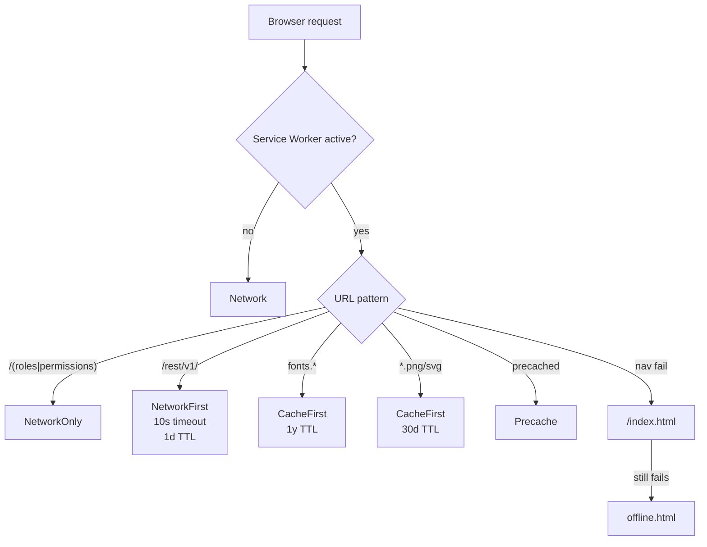

# 05 — Progressive Web App (PWA)

> **Last verified**: 2026-05-03

V2 ships as an installable PWA on every browser and is **not** wrapped in a service worker on Capacitor builds. The PWA layer powers offline awareness, install prompts, and runtime caching of slow-changing assets (fonts, images, Supabase reads).

## Stack

| Component | Version | Role |
|-----------|---------|------|
| `vite-plugin-pwa` | `^1.2.0` | Generates manifest, registers SW, configures Workbox |
| `workbox-window` | `^7.4.0` | Listens to SW lifecycle (waiting → activated) for update prompts |

Source of truth: the `VitePWA(...)` block in `vite.config.ts`.

## Activation rule

```ts
// vite.config.ts
const isCapacitor = process.env.CAPACITOR_BUILD === 'true'
plugins: [
  react(),
  ...(!isCapacitor ? [VitePWA({ registerType: 'autoUpdate', /* ... */ })] : []),
  // ...
]
```

| Build | PWA active |
|-------|------------|
| `npm run build` (web) | Yes |
| `CAPACITOR_BUILD=true npm run build` (native) | **No** — Service Workers conflict with Android WebView scope |
| `npm run dev` | No (`devOptions.enabled: false`) |

The `autoUpdate` registration mode means the SW takes over silently on the next page load after a deploy — no `skipWaiting` UI prompt. This matches an "always-on POS" usage profile.

## Manifest

Full manifest from `vite.config.ts`:

```ts
manifest: {
  name: 'AppGrav - The Breakery POS',
  short_name: 'AppGrav',
  description: 'Point of Sale system for The Breakery bakery',
  theme_color: '#0f172a',
  background_color: '#0f172a',
  display: 'standalone',
  display_override: ['window-controls-overlay'],
  orientation: 'any',
  start_url: '/pos',
  scope: '/',
  icons: [
    { src: '/pwa-192x192.png', sizes: '192x192', type: 'image/png' },
    { src: '/pwa-512x512.png', sizes: '512x512', type: 'image/png' },
    { src: '/pwa-512x512.png', sizes: '512x512', type: 'image/png', purpose: 'maskable' },
  ],
  shortcuts: [
    { name: 'Point of Sale', short_name: 'POS', url: '/pos', icons: [{ src: '/pwa-192x192.png', sizes: '192x192' }] },
    { name: 'Kitchen Display', short_name: 'KDS', url: '/kds', icons: [{ src: '/pwa-192x192.png', sizes: '192x192' }] },
  ],
}
```

| Field | Why this value |
|-------|----------------|
| `start_url: '/pos'` | Installed app boots straight into the POS terminal |
| `scope: '/'` | Whole app under one PWA |
| `display: 'standalone'` | No browser chrome — kiosk feel |
| `display_override: ['window-controls-overlay']` | On Windows, lets cashier theme the title bar |
| `theme_color` / `background_color` | `#0f172a` (Luxe Dark slate-950) |
| Shortcuts | Long-press app icon → jump to POS or KDS |

## HTML meta tags

`index.html` reinforces the manifest for browsers that read meta first:

```html
<meta name="theme-color" content="#0f172a">
<meta name="mobile-web-app-capable" content="yes">
<meta name="apple-mobile-web-app-status-bar-style" content="black-translucent">
<link rel="apple-touch-icon" href="/pwa-192x192.png">
```

## Icon assets

Stored in `public/`. Three files cover the PWA spec; `apple-touch-icon` reuses the 192px asset.

| File | Size | Purpose |
|------|------|---------|
| `public/pwa-192x192.png` | 192×192 | Android home screen, Apple touch icon |
| `public/pwa-512x512.png` | 512×512 | Splash + maskable |
| `public/logo-breakery.png` | original | App-internal use (header) |
| `public/logo-breakery-original.png` | source | Excluded from precache (`globIgnores`) |
| `public/croissant.svg` | vector | Favicon backup |
| `public/favicon.ico` | multi | Browser tab |

## Workbox runtime caching

Five strategies are wired up. Order matters — first match wins.

| # | URL pattern | Handler | Cache | TTL |
|---|-------------|---------|-------|-----|
| 1 | `https://fonts.googleapis.com/*` | `CacheFirst` | `google-fonts-cache` | 1 year |
| 2 | `https://fonts.gstatic.com/*` | `CacheFirst` | `gstatic-fonts-cache` | 1 year |
| 3 | `https://*.supabase.co/rest/v1/(user_profiles\|roles\|permissions\|...)*` | **`NetworkOnly`** | — | — |
| 4 | `https://*.supabase.co/rest/v1/*` | `NetworkFirst` | `supabase-api-cache` | 1 day, 100 entries, 10 s timeout |
| 5 | `*.png/jpg/jpeg/svg/gif/webp` | `CacheFirst` | `images-cache` | 30 days, 100 entries |

> **SECURITY (QUAL-08)**: Auth-related Supabase tables are matched **before** the generic Supabase rule and forced to `NetworkOnly`. A stale cached `roles` row could grant a revoked permission for up to 24 h — strictly forbidden.

```ts
// vite.config.ts (excerpt)
{
  urlPattern: /^https:\/\/.*\.supabase\.co\/rest\/v1\/(user_profiles|roles|permissions|role_permissions|user_roles|user_permissions|user_sessions).*/i,
  handler: 'NetworkOnly' as const,
},
{
  urlPattern: /^https:\/\/.*\.supabase\.co\/rest\/v1\/.*/i,
  handler: 'NetworkFirst',
  options: {
    cacheName: 'supabase-api-cache',
    expiration: { maxEntries: 100, maxAgeSeconds: 60 * 60 * 24 },
    networkTimeoutSeconds: 10,
    cacheableResponse: { statuses: [0, 200] },
  },
}
```

## Precache

```ts
globPatterns: ['**/*.{js,css,html,ico,png,svg,woff,woff2}'],
globIgnores: ['**/logo-breakery-original*'],
```

Everything emitted by Vite + the static assets in `public/` are precached at install time, with one exception — the original (large) logo source file is excluded to keep the precache under the 25 MB Workbox warning limit.

## SPA navigation fallback

```ts
navigateFallback: '/index.html',
navigateFallbackDenylist: [/^\/api\//],
```

Any deep link served while offline falls back to `index.html` so React Router can resolve the route. `/api/*` is excluded because the app has no internal API routes (Supabase is on a different origin), and the denylist preserves behaviour if any are added later.

## Offline page

`public/offline.html` is a static HTML page (not part of the React bundle). It is served by the SW when navigation fails AND no precache match exists.

```html
<!-- public/offline.html (excerpt) -->
<h1>You're Offline</h1>
<p>The Breakery POS requires an internet connection. Please check your network and try again.</p>
<button onclick="window.location.reload()">Retry</button>
```

The page mirrors Luxe Dark colours (`#0a0a0a` background, `#c9a55c` accent). It is intentionally minimal — V2 is online-only, so the offline page is a recovery affordance, not a full offline experience.

## Install prompt

V2 does not custom-render an install prompt. The browser surfaces the default "Install app" UI when manifest + SW + HTTPS conditions are met. To customize later, listen for `beforeinstallprompt` and store the event for a deferred call to `prompt()`.

## Service worker lifecycle (workbox-window)

`workbox-window` is installed but **not wired to a UI prompt** today — `registerType: 'autoUpdate'` handles activation silently. If a manual update prompt is needed (e.g. for breaking schema changes), wire `wb.addEventListener('waiting', ...)` and surface a toast.

## CSP allow-list

The PWA registers under `'self'`, so no extra CSP entry is required. The two cached external font origins are already listed under `style-src` and `font-src`:

```
style-src 'self' 'unsafe-inline' https://fonts.googleapis.com;
font-src 'self' https://fonts.gstatic.com;
```

## Diagram — request resolution



## Operational notes

- Deploying a new build flushes precache automatically; runtime caches survive (TTL-bound).
- To force-refresh a kiosk after a hotfix: visit Settings → "About" → "Clear cache" (calls `caches.keys().then(k => k.forEach(caches.delete))`).
- Fonts cached for a year are immutable (Google Fonts uses fingerprinted URLs). Safe.

## Cross-references

- Capacitor PWA-disabled rationale: `04-capacitor-native.md`
- Bundle splitting + `vendor-pdf` lazy load: `10-deployment-ops/02-vite-build.md`
- Auth caching ban (QUAL-08): `07-security/04-cache-policy.md`
