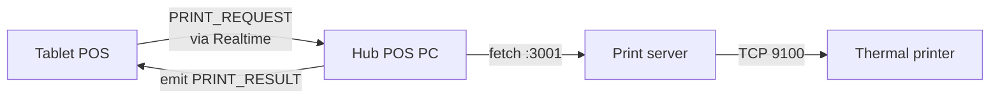

# 06 — Local Print Server

> **Last verified**: 2026-05-03

The print server is an **optional** local Express daemon that runs on the POS PC (port 3001) and bridges browser print requests to physical thermal printers. It is the primary path; the `send-to-printer` Edge Function exists as a remote-fallback (limited use).

## Topology

| Component | Host | Port | Protocol |
|-----------|------|------|----------|
| POS app (browser/Capacitor) | Tablet / PC | — | `fetch()` |
| Print server | POS PC (Lombok: `192.168.1.92`, dev: `localhost`) | 3001 | HTTP JSON |
| Thermal printer | LAN (e.g. `192.168.1.8:9100`) | 9100 | TCP raw / WebSocket |
| `send-to-printer` Edge Function | Supabase | — | HTTPS JSON |

The print server source code lives outside this repo — it is a small Node Express service that owns the printer drivers (ESC/POS). This document covers the **client side** (`src/services/print/`) and the protocol contract.

## CSP allow-list

`index.html` whitelists localhost + the production print server IP:

```
connect-src 'self' ...
            http://localhost:3001
            http://127.0.0.1:3001
            http://192.168.1.110:3001
            ws://192.168.1.8:9100 ws://192.168.1.13:9100 ws://192.168.1.14:9100
            ws://192.168.1.15:9100 ws://192.168.1.101:9100;
```

The hard-coded IPs are temporary; see the LAN dynamic-CSP design in `06-lan-architecture/05-discovery.md`.

## Endpoints

All endpoints use `Content-Type: application/json` and a 5 s default timeout (configurable via `printing.request_timeout_ms` in `pos_config`). Health check timeout is 2 s.

| Method | Endpoint | Purpose | Body |
|--------|----------|---------|------|
| GET | `/health` | Liveness probe (used by `checkPrintServer`) | — |
| POST | `/print/receipt` | Customer receipt (80 mm thermal) | `{ order: IOrderPrintData }` |
| POST | `/print/kitchen` | Kitchen ticket | `{ order, items }` |
| POST | `/print/barista` | Barista ticket | `{ order, items }` |
| POST | `/print/display` | Display-case ticket | `{ order, items }` |
| POST | `/print/waiter` | Waiter summary | `{ order }` |
| POST | `/drawer/open` | Cash drawer kick | — |

Z-Report (shift close) re-uses `/print/receipt` with a pre-formatted text payload — see `printShiftReport()`.

## Client service

`src/services/print/printService.ts` exports the canonical typed wrappers:

```ts
export const printService = {
  checkPrintServer,
  printReceipt,
  printKitchenTicket,
  printBaristaTicket,
  printDisplayTicket,
  printWaiterTicket,
  printShiftReport,
  openCashDrawer,
}
```

Every print function follows the same shape:

1. `checkPrintServer()` → 2 s `GET /health` probe.
2. If unreachable → return `{ success: false, error: 'Print server not available' }` (no exception).
3. Otherwise `fetch(POST)` with an `AbortController` timeout.
4. Map non-200 responses to `{ success: false, error }`; map fetch failures the same way.

```ts
// printService.ts (excerpt)
export async function checkPrintServer(): Promise<boolean> {
  try {
    const config = getPrintConfig()
    const controller = new AbortController()
    const timeoutId = setTimeout(() => controller.abort(), config.healthCheckTimeout)
    const response = await fetch(`${config.serverUrl}/health`, { signal: controller.signal })
    clearTimeout(timeoutId)
    return response.ok
  } catch { return false }
}
```

Configuration is read from `useCoreSettingsStore.getState().getSetting<...>('printing.*')`. Defaults:

| Setting key | Default |
|-------------|---------|
| `printing.server_url` | `http://localhost:3001` |
| `printing.request_timeout_ms` | `5000` |
| `printing.health_check_timeout_ms` | `2000` |

These can be overridden per-tenant from Settings → Printing.

## Hub-routed printing

Multi-device LANs route through the hub (`src/services/print/hubPrintService.ts`):

- If the calling device **is** the hub, it calls `printService.*` directly.
- Otherwise, it sends a `PRINT_REQUEST` over the LAN (`lanClient.send(LAN_MESSAGE_TYPES.PRINT_REQUEST, payload)`) and the hub executes the local print on its behalf.

```ts
// hubPrintService.ts (excerpt — full file lives in repo)
import { useLanStore } from '@/stores/lanStore'
import { lanClient } from '@/services/lan/lanClient'
import { LAN_MESSAGE_TYPES } from '@/services/lan/lanProtocol'
import { printKitchenTicket, printBaristaTicket } from '@/services/print/printService'
```

This means a tablet in the dining room can press "send to kitchen" without owning the printer — the hub PC is the single point of physical contact.

## DB-driven config

Persistent printer assignments live in `printer_configurations`:

| Column | Purpose |
|--------|---------|
| `name` | Human label (e.g. "Cuisine 1") |
| `type` | `kitchen` / `barista` / `receipt` / `display` / `waiter` |
| `endpoint` | `tcp://192.168.1.8:9100` or `usb://...` |
| `is_default_for_type` | Boolean |
| `is_active` | Boolean |

The print server reads this table at startup and after `LAN_MESSAGE_TYPES.PRINTER_CONFIG_UPDATE`. KDS stations follow the same pattern in `kds_stations`.

## Fallback flow

```mermaid
sequenceDiagram
  participant POS as POS UI
  participant PS as printService
  participant Local as Local print server :3001
  participant EF as Edge Function send-to-printer

  POS->>PS: printReceipt(order)
  PS->>Local: GET /health (2s timeout)
  alt Local UP
    Local-->>PS: 200
    PS->>Local: POST /print/receipt
    Local-->>PS: 200
    PS-->>POS: { success: true }
  else Local DOWN
    Local-->>PS: timeout
    PS-->>POS: { success: false, error }
    Note over POS: UI shows toast; cashier may retry
    Note over POS,EF: Optional: reissue via Edge Function for cloud-routed printer
    POS->>EF: POST /functions/v1/send-to-printer
    EF-->>POS: { success | error }
  end
```

> The fallback to `send-to-printer` is **opt-in**, used only for orders that must reach a remote / off-LAN printer (e.g. ghost kitchen). The default path is local-only.

## Error categories

| Returned `error` | Cause | UI handling |
|------------------|-------|-------------|
| `Print server not available` | Health check failed | Toast: "Printer offline — check the POS PC" |
| `Print failed: <body>` | Server returned non-200 | Toast with body; retry button |
| `AbortError` (mapped to message) | 5 s timeout exceeded | Toast: "Printer didn't respond" |
| Network error | DNS / refused | Toast + Sentry (categorised as `print.network`) |

All errors are logged via `logError` from `@/utils/logger` (which forwards to Sentry in prod).

## Discovery + heartbeat

`networkDiscovery.ts` scans the LAN for print servers on app boot — see `06-lan-architecture/05-discovery.md`. The hub also sends a `PRINTER_HEARTBEAT` every 30 s; clients flag a printer as `STALE` after 120 s without ack.

## Diagram — full print path (hub-routed)



## Operational tips

- Keep the print server running as a Windows service (`pm2-windows-service`) so reboots don't strand cashiers.
- The print server logs every job with `order_number` — match these against `orders.id` when triaging missing receipts.
- The `/drawer/open` endpoint works only if a cash drawer is daisy-chained to the receipt printer (most ESC/POS printers expose drawer kick on RJ11).

## Cross-references

- Edge Function fallback: `02-edge-functions.md` (`send-to-printer`)
- Hub/client protocol: `06-lan-architecture/02-hub-client-protocol.md`
- Print routing & hub responsibilities: `06-lan-architecture/04-print-routing.md`
- Discovery / heartbeat: `06-lan-architecture/05-discovery.md`
