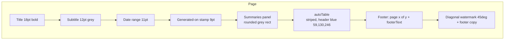

# 07 — PDF & Excel Export

> **Last verified**: 2026-05-03

V2 produces three flavours of exportable artefact:

1. **Tabular PDF** (reports, journals, daily reports) — generated client-side with `jsPDF` + `jspdf-autotable`.
2. **Tabular Excel** (stock opname, B2B catalogue) — generated client-side with `xlsx-js-style`.
3. **Branded HTML / PDF invoices** (B2B) — generated server-side by the `generate-invoice` Edge Function.

## Stack

| Library | Version | Side | Purpose |
|---------|---------|------|---------|
| `jspdf` | `^4.0.0` | Client | Core PDF engine |
| `jspdf-autotable` | `^5.0.7` | Client | Table layout plugin |
| `xlsx-js-style` | `^1.2.0` | Client | Excel with styled cells |
| `date-fns` | `^4.1.0` | Both | Date formatting |

## Bundle isolation

Both `jspdf` and `xlsx` are heavy. They live in their own Rollup chunks (`vite.config.ts → manualChunks`):

```ts
if (id.includes('jspdf') || id.includes('jspdf-autotable')) return 'vendor-pdf'
if (id.includes('xlsx')) return 'vendor-xlsx'
```

Plus three transitive deps are stubbed to save ~107 KB gzip — V2's PDF code never uses `.html()` (no DOM rendering) or SVG paths.

```ts
// vite.config.ts → resolve.alias
'html2canvas': path.resolve(__dirname, './src/lib/stubs/html2canvas.ts'),
'dompurify':   path.resolve(__dirname, './src/lib/stubs/dompurify.ts'),
'canvg':       path.resolve(__dirname, './src/lib/stubs/canvg.ts'),
```

## Lazy loading

`pdfExport.ts` imports `jspdf` dynamically so the chunk is only fetched when a user actually exports:

```ts
// src/services/reports/pdfExport.ts
const { default: jsPDF } = await import('jspdf')
const { default: autoTable } = await import('jspdf-autotable')
```

`xlsx-js-style` is imported eagerly in `opnameImportService.ts` (the import dialog needs it on open). If you add another Excel exporter, follow the dynamic-import pattern.

## PDF service — `src/services/reports/pdfExport.ts`

Single generic exporter:

```ts
exportToPDF<T>(
  data: T[],
  columns: PdfColumn<T>[],
  options: PdfExportOptions,
  summaries?: PdfSummary[]
): Promise<{ success: boolean, error?: string }>
```

### Column model

```ts
interface PdfColumn<T> {
  key: keyof T | string         // dot-notation supported (e.g. 'customer.name')
  header: string
  width?: number                // mm
  align?: 'left' | 'center' | 'right'
  format?: (value: unknown, row: T) => string
}
```

### Options

```ts
interface PdfExportOptions {
  filename: string                                   // suffixed with date range
  title: string                                      // big centred header
  subtitle?: string
  dateRange?: { from: Date; to: Date }
  watermark?: { text: string; showDate?: boolean }   // diagonal + footer
  orientation?: 'portrait' | 'landscape'             // default portrait
  showLogo?: boolean                                 // not yet wired
  footerText?: string
}
```

### Layout



The header colour palette today (RGB):

| Element | Colour | Hex |
|---------|--------|-----|
| Title text | `(44, 62, 80)` | `#2C3E50` |
| Body text | `(50, 50, 50)` | `#323232` |
| Subdued / footer | `(150, 150, 150)` | `#969696` |
| Table header fill | `(59, 130, 246)` | `#3B82F6` (Tailwind `blue-500`) |
| Alternate row | `(245, 247, 250)` | `#F5F7FA` |

> **Branding gap**: today's PDF colour scheme is generic blue-on-white, not Luxe Dark gold. Re-skinning is tracked in `04-modules/06-reports.md` (issue: "PDF brand alignment").

### Helpers

| Helper | Output |
|--------|--------|
| `formatNumber(value)` | `1,234,567` |
| `formatCurrency(value)` | `Rp 1,234,500` (rounded to nearest 100 IDR) |
| `formatDate(value)` | `dd/MM/yyyy` |
| `formatDateTime(value)` | `dd/MM/yyyy HH:mm` |
| `formatPercentage(value)` | `12.3%` |

### Watermarking (NFR-RS3)

```ts
addWatermark(doc, text, showDate = true)
```

Adds a 45° watermark across every page + a small footer copy. Used for "DRAFT" or "INTERNAL" stamps on financial PDFs. Default text + show-date toggle live in the calling report's `options.watermark`.

## Excel service — `xlsx-js-style`

Two patterns coexist.

### Template generation (write)

```ts
// src/services/inventory/opnameImportService.ts (excerpt)
const data = items.map((item) => ({
  'SKU': item.product.sku,
  'Product Name': item.product.name,
  'Current Stock': item.system_quantity,
  'Actual Stock': item.counted_quantity ?? '',
  'Unit': item.unit || 'pcs',
  'Reason': item.reason || '',
  'Notes': item.notes || ''
}))
const worksheet = XLSX.utils.json_to_sheet(data)
const workbook = XLSX.utils.book_new()
XLSX.utils.book_append_sheet(workbook, worksheet, 'Opname')
worksheet['!cols'] = [{ wch: 15 }, { wch: 30 }, ...] // column widths
XLSX.writeFile(workbook, fileName)
```

### Import / parse (read)

```ts
const reader = new FileReader()
reader.onload = (e) => {
  const data = new Uint8Array(e.target?.result as ArrayBuffer)
  const workbook = XLSX.read(data, { type: 'array' })
  const jsonData = XLSX.utils.sheet_to_json(workbook.Sheets[workbook.SheetNames[0]])
  // ...row-by-row reconciliation against the live opname session
}
```

Returned shape: `{ updatedItems, errors, stats: { total, matched, unmatched } }`. The stock-opname dialog renders `errors[]` inline with row numbers so the cashier knows which lines were skipped.

## Server-side invoices — `generate-invoice`

For B2B invoices, PDF generation lives in the `generate-invoice` Edge Function (Deno), not the client. Reasons:

- HTML templating is easier with template strings server-side.
- The PDF must include the **stamp** (signed bytes) — server-only secret.
- Avoid shipping a 200 KB JSON payload to the browser only to render a PDF.

The Edge Function returns `{ html: string, pdf_base64?: string }`. The HTML path is rendered into an `<iframe>` for preview; the base64 path is offered as a direct download.

See `02-edge-functions.md` → `generate-invoice` for the full contract.

## Calling pattern

```ts
import { exportToPDF, formatCurrency, formatDate } from '@/services/reports/pdfExport'

await exportToPDF(
  rows,
  [
    { key: 'order_number', header: 'Order' },
    { key: 'created_at', header: 'Date', format: formatDate },
    { key: 'total', header: 'Total', align: 'right', format: formatCurrency },
  ],
  {
    filename: 'sales_report',
    title: 'Sales Report',
    dateRange: { from, to },
    watermark: { text: 'INTERNAL', showDate: true },
    footerText: 'The Breakery — Lombok',
  },
  [
    { label: 'Total revenue', value: formatCurrency(totalRevenue) },
    { label: 'Orders', value: rows.length },
  ]
)
```

## Filename convention

`pdfExport.ts` auto-suffixes filenames:

| Scenario | Result |
|----------|--------|
| `dateRange` provided | `<filename>_<from-yyyy-MM-dd>_<to-yyyy-MM-dd>.pdf` |
| No `dateRange` | `<filename>_<today-yyyy-MM-dd>.pdf` |

This keeps multi-export folders sortable.

## Performance budgets

| Library | Gzip size (approx) | Loaded when |
|---------|--------------------|-------------|
| `vendor-pdf` (jspdf + autotable) | ~95 KB | First click on "Export PDF" |
| `vendor-xlsx` (xlsx-js-style) | ~140 KB | Import dialog opens |
| Stubbed deps saved | ~107 KB | Always (compile-time) |

Reports with > 5 000 rows should paginate via `dateRange` or the report's filter — `autoTable` becomes sluggish past ~10 000 rows in a single call.

## Cross-references

- Generic export module API: `04-modules/06-reports.md`
- Edge Function PDF (B2B): `02-edge-functions.md` → `generate-invoice`
- Bundle splitting: `10-deployment-ops/02-vite-build.md`
- Stock opname workflow: `04-modules/04-inventory.md`
