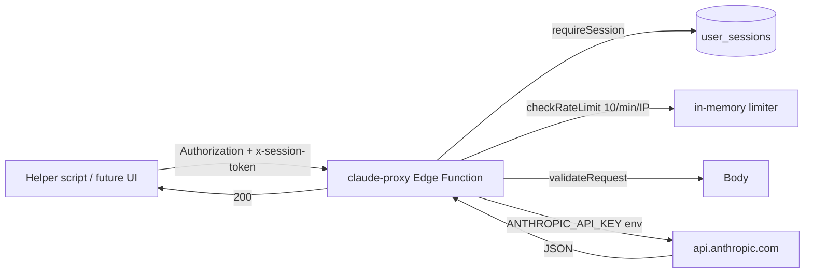

# 08 — Claude Proxy (Anthropic API)

> **Last verified**: 2026-05-03

The `claude-proxy` Edge Function lets server-side / scripted helpers call the Anthropic Claude API without ever exposing the API key to the browser. The runtime app does **not** consume Claude in the user-facing flow today — usage is limited to internal tools (`scripts/test-claude.ts`, repair scripts).

## Function metadata

| Property | Value |
|----------|-------|
| Path | `supabase/functions/claude-proxy/index.ts` |
| Method | `POST` |
| `verify_jwt` | true (production) |
| Session check | `requireSession()` — custom session token required |
| Rate limit | **10 req/min per IP** (`checkRateLimit`) |
| Secret env var | `ANTHROPIC_API_KEY` (Supabase secret, server-only) |

## Endpoint

```
POST https://abjabuniwkqpfsenxljp.supabase.co/functions/v1/claude-proxy
Headers:
  Authorization: Bearer <jwt>
  x-session-token: <session token>
  content-type: application/json
```

## Request body

```ts
interface ClaudeMessage {
  role: 'user' | 'assistant'
  content: string
}

interface ClaudeRequest {
  messages: ClaudeMessage[]
  system?: string
  max_tokens?: number       // default ~1024
  model?: string            // must be in ALLOWED_MODELS
}
```

Validation (`validateRequest`):

- `messages` must be a non-empty array
- Each message must have `role` ∈ `{ user, assistant }` and a `string` `content`
- Anything else returns `400 Invalid request structure`

## Response

The function forwards the Anthropic response shape verbatim:

```ts
interface AnthropicResponse {
  id: string
  type: string
  role: string
  content: Array<{ type: string; text?: string }>
  model: string
  stop_reason: string
  usage: { input_tokens: number; output_tokens: number }
}
```

| Status | Body |
|--------|------|
| 200 | `AnthropicResponse` |
| 400 | `{ error: '...' }` (bad input) |
| 401 | `{ error: 'Authentication required' }` (no session) |
| 405 | `{ error: 'Method not allowed' }` (non-POST) |
| 429 | `{ error: 'Rate limit exceeded', retry_after_ms }` |
| 500 | `{ error: 'API configuration error' \| 'Upstream error' }` |

## Allowed models

Pinned to a small allow-list to prevent budget surprises:

```ts
const ALLOWED_MODELS = [
  'claude-3-haiku-20240307',
  'claude-3-5-haiku-20241022',
  'claude-haiku-4-5-20251001',
]
```

Anything outside this list is rejected with 400. The default model (when `model` is omitted) is the cheapest available — currently `claude-3-haiku-20240307`. To call Sonnet/Opus, add the snapshot ID to `ALLOWED_MODELS` and redeploy.

## Anthropic API call

```ts
fetch('https://api.anthropic.com/v1/messages', {
  method: 'POST',
  headers: {
    'x-api-key': apiKey,                  // from Deno.env.get('ANTHROPIC_API_KEY')
    'anthropic-version': '2023-06-01',
    'content-type': 'application/json',
  },
  body: JSON.stringify({ model, system, messages, max_tokens: max_tokens ?? 1024 }),
})
```

The `anthropic-version` header is pinned to `2023-06-01` — the latest schema-stable version that matches the request shape above.

## Consumers

No code in `src/` invokes `claude-proxy` today. The active consumers are scripts:

| File | Usage |
|------|-------|
| `scripts/test-claude.ts` | Smoke test — `askClaude` and `chatWithClaude` from `src/services/anthropicService.ts` |
| `scripts/repair-system.ts` | Internal automation |
| `scripts/repair-all-high-priority.ts` | Internal automation |
| `scripts/run-audit.ts` | Audit helper |
| `scripts/debug-error.ts` | Debug helper |

> **Important**: There is no end-user feature wired to Claude in V2 production. The proxy is operational scaffolding kept ready for future LLM features (e.g. menu suggestions, customer FAQ bot). Any new UI use case must go through a permission gate (see "Hardening backlog" below).

## Security model



| Concern | Control |
|---------|---------|
| API key leakage | Key lives only in Supabase secret env; never in client bundle or git |
| Anonymous abuse | `verify_jwt: true` + `requireSession` reject unauthenticated callers |
| Token-burn DoS | 10 req/min per IP via shared rate-limiter |
| Model upgrade drift | Hard-coded `ALLOWED_MODELS` allow-list |
| Prompt injection from user input | Caller's responsibility (no system-prompt sanitisation in proxy) |

### Hardening backlog (per `breakery-lint-disable` comment in source)

The function lint-disables itself with the rationale:

> verify_jwt=true gates an authenticated caller; **no granular `user_has_permission(uid, 'integrations.claude.use')` enforcement server-side today** (frontend UI gates the feature flag for normal use). ACCEPTED RISK: an authenticated user with the JWT could in principle bypass the UI gate and burn LLM budget directly. Hardening followup tracked in `deferred-work.md` (per-app rate-limit + permission gate).

Two follow-ups are tracked:

1. Add `user_has_permission(p_user_id, 'integrations.claude.use')` server-side check.
2. Move from in-memory IP-based rate limit to a per-`user_id` rate limit backed by Postgres (so re-deploys don't reset the counter).

## CSP and CORS

`index.html` whitelists Anthropic in `connect-src` so direct browser calls would technically work — but that path is **forbidden** because it would expose the API key. All Claude calls must go through the proxy.

```
connect-src 'self' https://*.supabase.co wss://*.supabase.co https://api.anthropic.com ...
```

CORS for the Edge Function uses the shared `_shared/cors.ts` allow-list (production origins + dev localhost ports).

## Example call

```ts
// scripts/test-claude.ts pattern (simplified)
const res = await fetch(`${SUPABASE_URL}/functions/v1/claude-proxy`, {
  method: 'POST',
  headers: {
    'Authorization': `Bearer ${jwt}`,
    'x-session-token': sessionToken,
    'content-type': 'application/json',
  },
  body: JSON.stringify({
    model: 'claude-haiku-4-5-20251001',
    system: 'You are a helpful assistant.',
    messages: [{ role: 'user', content: 'Summarise yesterday's sales.' }],
    max_tokens: 512,
  }),
})
const data: AnthropicResponse = await res.json()
const text = data.content.find(c => c.type === 'text')?.text ?? ''
```

## Operational notes

- **Cost control**: every request to Claude shows up in the Anthropic console under the project key. Set a monthly cap there as a hard backstop.
- **Logs**: Edge Function logs are in Supabase Dashboard → Functions → claude-proxy → Logs. Errors include the model + `usage` so cost-attribution is post-hoc reconstructable.
- **Latency**: Haiku is sub-second; Sonnet adds 2–5 s. The 5 s frontend timeout used elsewhere is too tight — wire a 30 s timeout for any Sonnet call.
- **Streaming**: The proxy does **not** support streaming today. Add `stream: true` + SSE pass-through if a UI consumer needs incremental tokens.

## Cross-references

- Edge Functions overview: `02-edge-functions.md`
- Auth + session token model: `07-security/01-authentication.md`
- Rate-limiter shared module: `02-edge-functions.md` → "Shared modules"
- Future LLM feature work: `_bmad/output/planning-artifacts/` (epic backlog)
